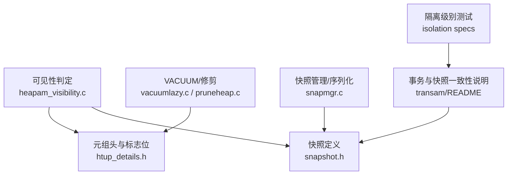
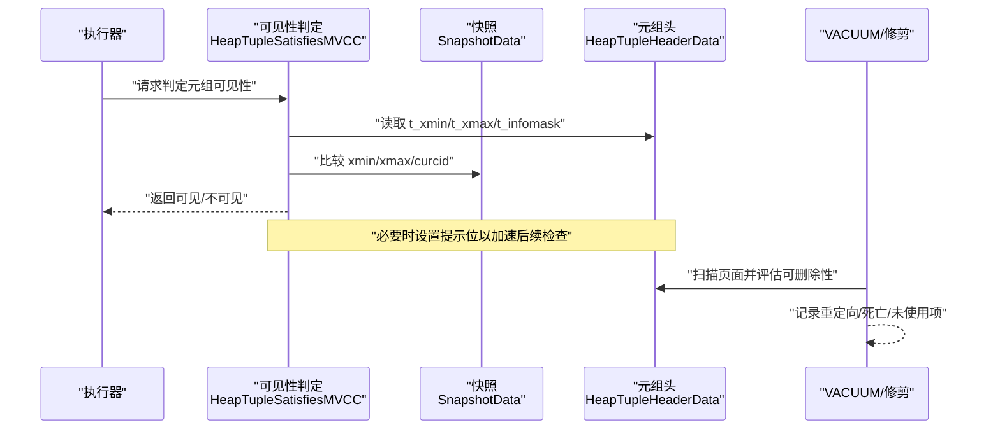
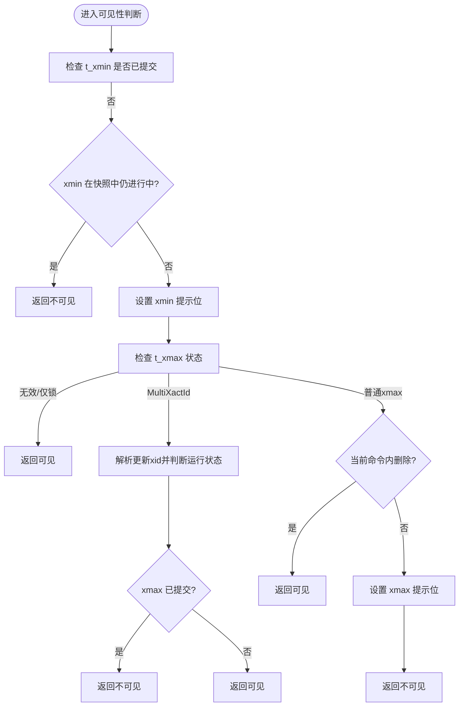
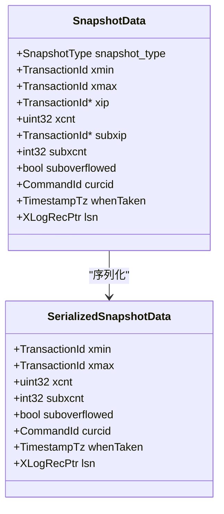
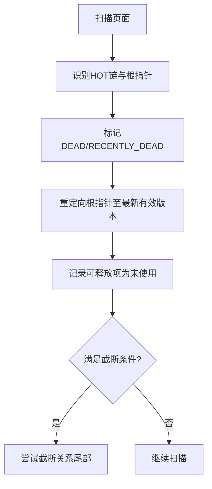
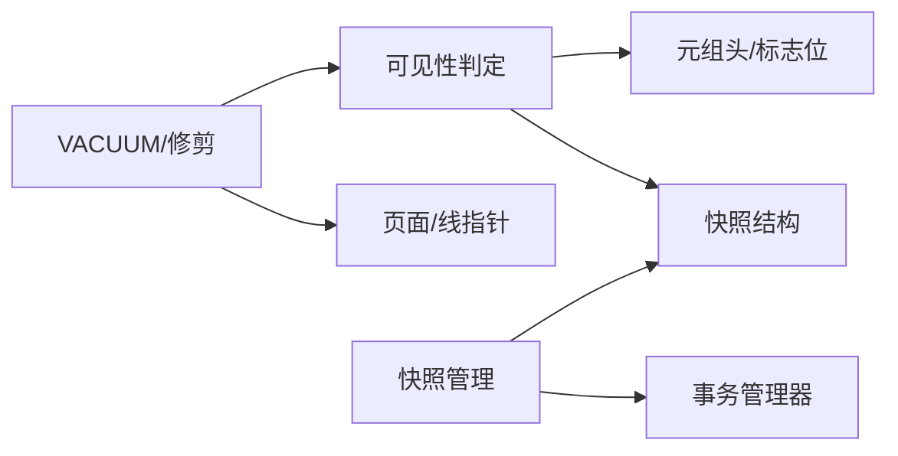

# MVCC并发控制

<cite>
**本文引用的文件**
- [heapam_visibility.c](file://src/backend/access/heap/heapam_visibility.c)
- [snapshot.h](file://src/include/utils/snapshot.h)
- [htup_details.h](file://src/include/access/htup_details.h)
- [pruneheap.c](file://src/backend/access/heap/pruneheap.c)
- [vacuumlazy.c](file://src/backend/access/heap/vacuumlazy.c)
- [snapmgr.c](file://src/backend/utils/time/snapmgr.c)
- [README (transam)](file://src/backend/access/transam/README)
- [read-only-anomaly-2.spec](file://src/test/isolation/specs/read-only-anomaly-2.spec)
- [read-only-anomaly-3.spec](file://src/test/isolation/specs/read-only-anomaly-3.spec)
</cite>

## 目录
1. [简介](#简介)
2. [项目结构](#项目结构)
3. [核心组件](#核心组件)
4. [架构总览](#架构总览)
5. [详细组件分析](#详细组件分析)
6. [依赖关系分析](#依赖关系分析)
7. [性能考虑](#性能考虑)
8. [故障排查指南](#故障排查指南)
9. [结论](#结论)
10. [附录](#附录)

## 简介
本文件面向Mini PostgreSQL的MVCC（多版本并发控制）子系统，系统性阐述可见性判断算法、快照管理、版本链维护与清理机制，以及不同隔离级别下的行为差异。文档以源码为依据，提供流程图与架构图帮助理解，并给出性能调优建议与常见问题诊断方法，为并发编程与运维提供完整指导。

## 项目结构
围绕MVCC的关键代码主要分布在以下模块：
- 可见性判定：堆访问层的可见性函数实现
- 元组头与标志位：定义xmin/xmax/cmin/cmax等字段与提示位
- 快照定义与管理：快照类型、字段与序列化
- 垃圾回收与VACUUM：页面级修剪与懒清理
- 事务与快照一致性：事务开始/结束与快照获取的互斥说明
- 隔离级别测试：读偏斜/幻读等场景的隔离测试用例

**图示来源**
- [heapam_visibility.c:936-1144](file://src/backend/access/heap/heapam_visibility.c#L936-L1144)
- [htup_details.h:121-218](file://src/include/access/htup_details.h#L121-L218)
- [snapshot.h:142-217](file://src/include/utils/snapshot.h#L142-L217)
- [vacuumlazy.c:1-200](file://src/backend/access/heap/vacuumlazy.c#L1-L200)
- [pruneheap.c:577-854](file://src/backend/access/heap/pruneheap.c#L577-L854)
- [snapmgr.c:2123-2152](file://src/backend/utils/time/snapmgr.c#L2123-L2152)
- [README (transam):224-244](file://src/backend/access/transam/README#L224-L244)

**章节来源**
- [heapam_visibility.c:936-1144](file://src/backend/access/heap/heapam_visibility.c#L936-L1144)
- [snapshot.h:142-217](file://src/include/utils/snapshot.h#L142-L217)
- [htup_details.h:121-218](file://src/include/access/htup_details.h#L121-L218)
- [vacuumlazy.c:1-200](file://src/backend/access/heap/vacuumlazy.c#L1-L200)
- [pruneheap.c:577-854](file://src/backend/access/heap/pruneheap.c#L577-L854)
- [snapmgr.c:2123-2152](file://src/backend/utils/time/snapmgr.c#L2123-L2152)
- [README (transam):224-244](file://src/backend/access/transam/README#L224-L244)

## 核心组件
- 元组可见性判定器：根据元组头的xmin/xmax及标志位，结合当前快照或即时快照进行可见性判断，并在条件满足时更新提示位以减少后续开销。
- 快照数据结构：包含xmin/xmax边界、进行中事务列表xip、子事务subxip、命令ID curcid等，用于统一描述“时间点视图”。
- 元组头与标志位：t_xmin/t_xmax、t_cid（cmin/cmax）、t_infomask中的HEAP_XMIN_COMMITTED/INVALID、HEAP_XMAX_COMMITTED/INVALID等，用于快速路径判断与状态缓存。
- VACUUM与页面修剪：识别可删除的元组与HOT链，记录重定向/死亡/未使用项，必要时截断关系尾部。
- 快照管理与序列化：创建、传播与序列化快照，保证跨进程/恢复场景的一致性。
- 事务与快照一致性约束：确保快照中关于提交顺序的语义一致，避免看到不一致的版本组合。

**章节来源**
- [heapam_visibility.c:936-1144](file://src/backend/access/heap/heapam_visibility.c#L936-L1144)
- [snapshot.h:142-217](file://src/include/utils/snapshot.h#L142-L217)
- [htup_details.h:121-218](file://src/include/access/htup_details.h#L121-L218)
- [vacuumlazy.c:1-200](file://src/backend/access/heap/vacuumlazy.c#L1-L200)
- [pruneheap.c:577-854](file://src/backend/access/heap/pruneheap.c#L577-L854)
- [snapmgr.c:2123-2152](file://src/backend/utils/time/snapmgr.c#L2123-L2152)
- [README (transam):224-244](file://src/backend/access/transam/README#L224-L244)

## 架构总览
下图展示了MVCC在读取路径上的关键交互：执行器通过可见性函数判定元组是否对当前快照可见；可见性函数依据元组头字段与快照边界进行决策，并可能更新提示位；VACUUM后台扫描页面，基于可见性与阈值决定删除与重定向。

**图示来源**
- [heapam_visibility.c:936-1144](file://src/backend/access/heap/heapam_visibility.c#L936-L1144)
- [snapshot.h:142-217](file://src/include/utils/snapshot.h#L142-L217)
- [htup_details.h:121-218](file://src/include/access/htup_details.h#L121-L218)
- [pruneheap.c:577-854](file://src/backend/access/heap/pruneheap.c#L577-L854)

## 详细组件分析

### 可见性判断算法（xmin/xmax与规则）
- 基本思路：
  - 若插入事务（xmin）在当前快照中仍“进行中”，则视为不可见；否则认为已提交。
  - 若删除事务（xmax）无效或已中止，则元组可见；若xmax为仅锁标记，则可见；若xmax已提交且非仅锁，则不可见。
  - 对于MultiXactId情况，需解析实际更新xid并判断其运行状态。
  - 当前命令内变更通过curcid区分：同一事务内，Cmin/Cmax与curcid的比较决定本命令是否可见。
- 提示位优化：
  - 当确认xmin/xmax的提交/中止状态后，写入HEAP_XMIN_COMMITTED/INVALID或HEAP_XMAX_COMMITTED/INVALID，减少后续重复检查。
- 关键路径参考：
  - MVCC可见性主流程：[heapam_visibility.c:936-1144](file://src/backend/access/heap/heapam_visibility.c#L936-L1144)
  - 元组头字段与标志位：[htup_details.h:121-218](file://src/include/access/htup_details.h#L121-L218)

**图示来源**
- [heapam_visibility.c:936-1144](file://src/backend/access/heap/heapam_visibility.c#L936-L1144)
- [htup_details.h:121-218](file://src/include/access/htup_details.h#L121-L218)

**章节来源**
- [heapam_visibility.c:936-1144](file://src/backend/access/heap/heapam_visibility.c#L936-L1144)
- [htup_details.h:121-218](file://src/include/access/htup_details.h#L121-L218)

### 快照管理机制（创建、传播、失效）
- 快照结构：
  - xmin/xmax：界定可见范围，所有小于xmin的XID可见，大于等于xmax的XID不可见。
  - xip/subxip：记录进行中事务及其子事务，用于精确判断“进行中”集合。
  - curcid：当前命令ID，用于同事务内的命令级可见性。
- 创建与传播：
  - 快照在事务开始时创建，包含当前活动事务集合；支持序列化以便跨进程传递。
  - 序列化过程复制xmin/xmax、xip、subxip、curcid、时间戳与LSN等关键字段。
- 失效与复用：
  - 静态快照在事务期间复用，直到被显式释放；ActiveSnapshot栈引用计数管理生命周期。
- 关键路径参考：
  - 快照定义与字段：[snapshot.h:142-217](file://src/include/utils/snapshot.h#L142-L217)
  - 快照序列化：[snapmgr.c:2123-2152](file://src/backend/utils/time/snapmgr.c#L2123-L2152)

**图示来源**
- [snapshot.h:142-217](file://src/include/utils/snapshot.h#L142-L217)
- [snapmgr.c:2123-2152](file://src/backend/utils/time/snapmgr.c#L2123-L2152)

**章节来源**
- [snapshot.h:142-217](file://src/include/utils/snapshot.h#L142-L217)
- [snapmgr.c:2123-2152](file://src/backend/utils/time/snapmgr.c#L2123-L2152)

### 版本链维护策略（HOT链、垃圾回收、VACUUM）
- 版本链与ctid：
  - 每次更新生成新版本，旧版本的t_ctid指向新版本，形成版本链；HINT位与HEAP_HOT_UPDATED标识HOT更新。
- HOT链修剪：
  - 遇到DEAD元组时，将链首重定向到最新有效版本，或将根指针置为LP_DEAD；中间可移除的DEAD项标记为未使用。
- 懒VACUUM：
  - 扫描堆页，收集待删除TID，按阈值触发索引清理与页面压缩；必要时尝试截断关系尾部。
- 关键路径参考：
  - 页面级修剪逻辑：[pruneheap.c:577-854](file://src/backend/access/heap/pruneheap.c#L577-L854)
  - 懒VACUUM流程与参数：[vacuumlazy.c:1-200](file://src/backend/access/heap/vacuumlazy.c#L1-L200)

**图示来源**
- [pruneheap.c:577-854](file://src/backend/access/heap/pruneheap.c#L577-L854)
- [vacuumlazy.c:1-200](file://src/backend/access/heap/vacuumlazy.c#L1-L200)

**章节来源**
- [pruneheap.c:577-854](file://src/backend/access/heap/pruneheap.c#L577-L854)
- [vacuumlazy.c:1-200](file://src/backend/access/heap/vacuumlazy.c#L1-L200)

### 隔离级别下的MVCC行为差异
- 读已提交（Read Committed）：每个语句获得新快照，能看到之前已提交的变更。
- 可重复读（Repeatable Read）：事务内首个语句起建立快照，后续SELECT均基于该快照，不反映其他事务提交的新数据。
- 可串行化（Serializable）：
  - 检测写冲突导致的循环依赖时，可能中止其中一个事务以避免异常。
  - 读-only可串行化可通过延迟快照获取避免读偏斜问题。
- 相关测试用例：
  - 读偏斜异常与串行化隔离：[read-only-anomaly-2.spec](file://src/test/isolation/specs/read-only-anomaly-2.spec)
  - 读-only可串行化的延迟快照策略：[read-only-anomaly-3.spec](file://src/test/isolation/specs/read-only-anomaly-3.spec)
- 事务与快照一致性约束：
  - 确保快照间提交顺序一致性，防止看到不一致的版本组合：[README (transam):224-244](file://src/backend/access/transam/README#L224-L244)

**章节来源**
- [read-only-anomaly-2.spec:1-42](file://src/test/isolation/specs/read-only-anomaly-2.spec#L1-L42)
- [read-only-anomaly-3.spec:1-39](file://src/test/isolation/specs/read-only-anomaly-3.spec#L1-L39)
- [README (transam):224-244](file://src/backend/access/transam/README#L224-L244)

## 依赖关系分析
- 可见性判定依赖：
  - 元组头字段与标志位（htup_details.h）
  - 快照边界与进行中事务集合（snapshot.h）
  - 事务状态查询（如TransactionIdIsInProgress/DidCommit）
- VACUUM依赖：
  - 页面结构与线指针（ItemId）
  - 可见性判定结果（用于确定可删除性）
  - 并行上下文与共享内存（DSM）用于大规模表清理
- 快照管理依赖：
  - 事务管理器（获取活动事务集合）
  - WAL/LSN（记录快照取用位置）

**图示来源**
- [heapam_visibility.c:936-1144](file://src/backend/access/heap/heapam_visibility.c#L936-L1144)
- [htup_details.h:121-218](file://src/include/access/htup_details.h#L121-L218)
- [snapshot.h:142-217](file://src/include/utils/snapshot.h#L142-L217)
- [vacuumlazy.c:1-200](file://src/backend/access/heap/vacuumlazy.c#L1-L200)

**章节来源**
- [heapam_visibility.c:936-1144](file://src/backend/access/heap/heapam_visibility.c#L936-L1144)
- [vacuumlazy.c:1-200](file://src/backend/access/heap/vacuumlazy.c#L1-L200)
- [snapshot.h:142-217](file://src/include/utils/snapshot.h#L142-L217)
- [htup_details.h:121-218](file://src/include/access/htup_details.h#L121-L218)

## 性能考虑
- 提示位优化：
  - 尽早设置HEAP_XMIN_COMMITTED/INVALID与HEAP_XMAX_COMMITTED/INVALID，减少后续对事务状态的频繁查询。
- 快照边界优化：
  - 利用xmin/xmax快速排除大量XID，仅在边界附近搜索xip数组。
- VACUUM阈值与并行：
  - 合理配置maintenance_work_mem/autovacuum_work_mem以平衡内存与I/O；无索引表可直接逐页清理，无需累积TID数组。
  - 并行VACUUM通过DSM共享信息，提升大表清理效率。
- 截断策略：
  - 仅在可释放页数达到阈值时尝试截断，避免不必要的锁竞争与耗时。

**章节来源**
- [heapam_visibility.c:936-1144](file://src/backend/access/heap/heapam_visibility.c#L936-L1144)
- [vacuumlazy.c:1-200](file://src/backend/access/heap/vacuumlazy.c#L1-L200)

## 故障排查指南
- 常见症状与定位：
  - 读到“幽灵行”或“缺失行”：检查xmin/xmax与快照边界是否正确；确认curcid是否导致本命令内不可见。
  - 高CPU占用于可见性检查：观察提示位是否生效；检查是否存在大量仍在进行中的事务导致无法设置提示位。
  - VACUUM进度缓慢：查看dead tuple数量与阈值；确认是否因并行上下文或锁等待导致阻塞。
- 诊断步骤：
  - 使用页面检查工具查看元组头标志位与ctid链；验证HOT链是否断裂或重定向异常。
  - 检查快照序列化和传播是否正确，确保xmin/xmax与xip/subxip一致。
  - 核对隔离级别与事务行为是否符合预期（特别是可串行化下的延迟快照）。

**章节来源**
- [pruneheap.c:577-854](file://src/backend/access/heap/pruneheap.c#L577-L854)
- [vacuumlazy.c:1-200](file://src/backend/access/heap/vacuumlazy.c#L1-L200)
- [snapshot.h:142-217](file://src/include/utils/snapshot.h#L142-L217)

## 结论
Mini PostgreSQL的MVCC通过严谨的可见性判定、高效的快照管理与完善的版本链维护机制，实现了高并发下的数据一致性。配合VACUUM的页面修剪与截断策略，系统能够在读写混合负载下保持良好性能。理解xmin/xmax、快照边界与提示位的作用，有助于在实际应用中优化查询与事务设计，并有效排查并发相关问题。

## 附录
- 关键术语：
  - xmin：插入事务ID；xmax：删除/锁定事务ID；cmin/cmax：命令级可见性；curcid：当前命令ID。
  - HOT：原地更新技术，减少索引维护成本。
  - 快照：描述某一时刻数据库可见性的抽象，包含xmin/xmax与进行中事务集合。
- 参考路径：
  - 可见性主流程：[heapam_visibility.c:936-1144](file://src/backend/access/heap/heapam_visibility.c#L936-L1144)
  - 快照结构：[snapshot.h:142-217](file://src/include/utils/snapshot.h#L142-L217)
  - 元组头定义：[htup_details.h:121-218](file://src/include/access/htup_details.h#L121-L218)
  - 页面修剪：[pruneheap.c:577-854](file://src/backend/access/heap/pruneheap.c#L577-L854)
  - 懒VACUUM：[vacuumlazy.c:1-200](file://src/backend/access/heap/vacuumlazy.c#L1-L200)
  - 快照序列化：[snapmgr.c:2123-2152](file://src/backend/utils/time/snapmgr.c#L2123-L2152)
  - 事务一致性约束：[README (transam):224-244](file://src/backend/access/transam/README#L224-L244)