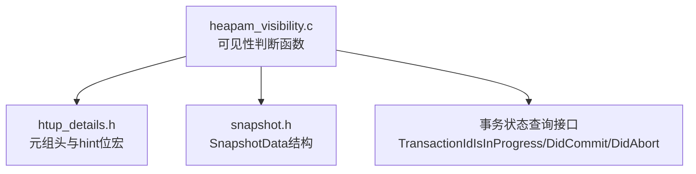
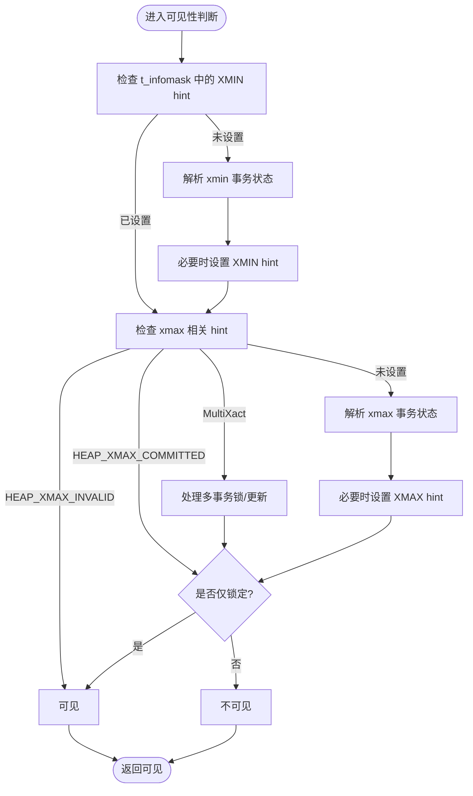
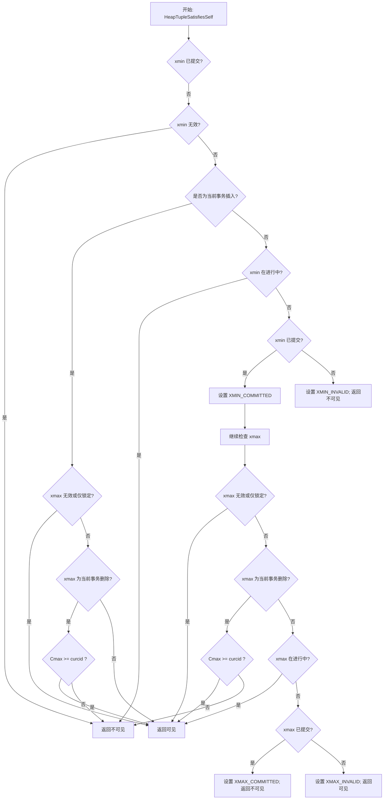
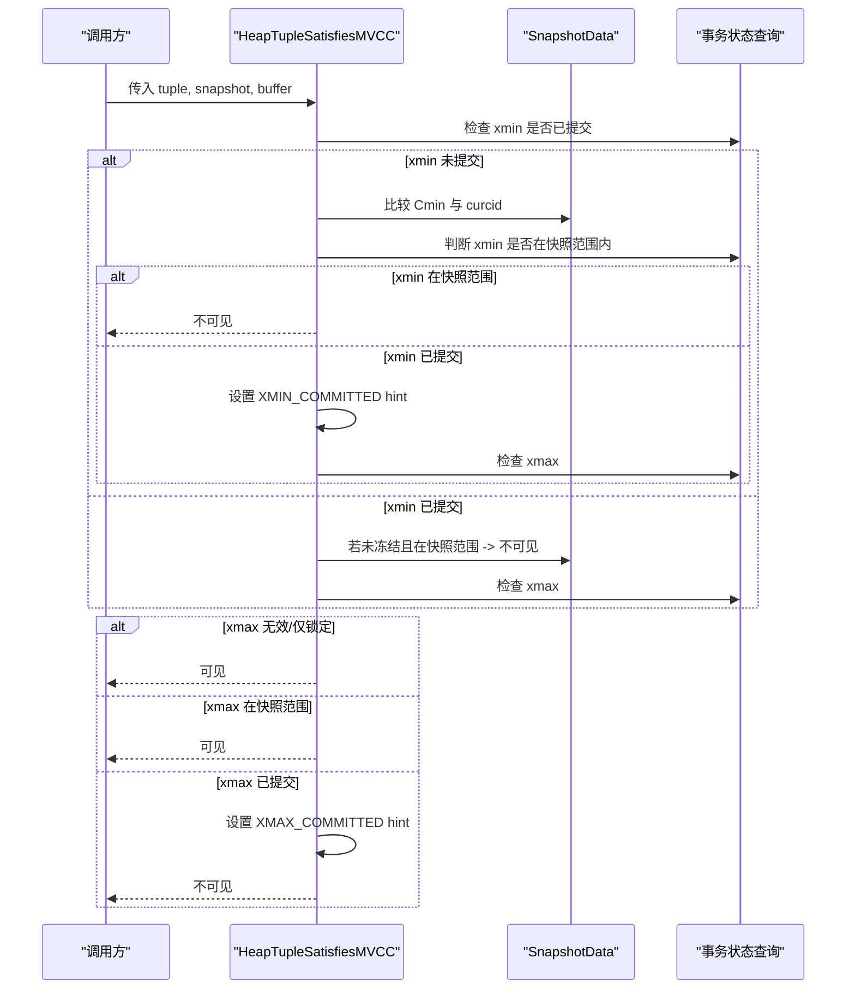
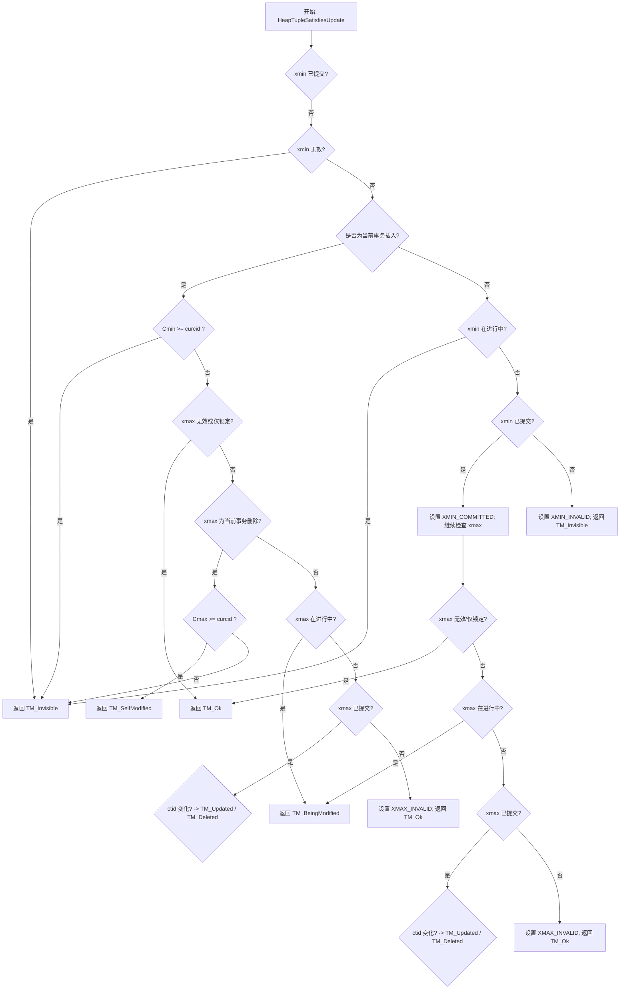
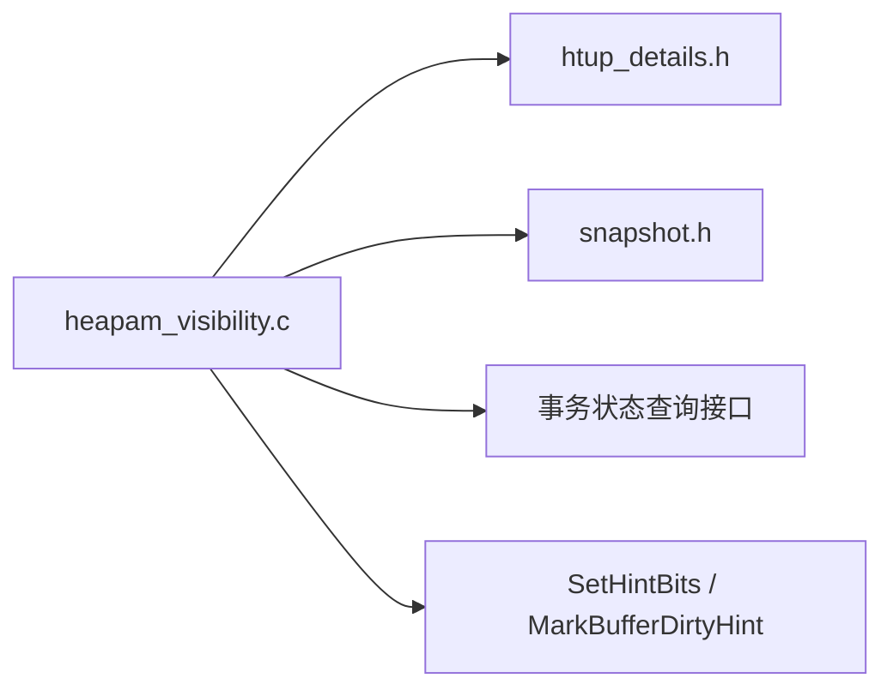

# 可见性判断规则

<cite>
**本文引用的文件**
- [heapam_visibility.c](file://src/backend/access/heap/heapam_visibility.c)
- [htup_details.h](file://src/include/access/htup_details.h)
- [snapshot.h](file://src/include/utils/snapshot.h)
</cite>

## 目录
1. [简介](#简介)
2. [项目结构](#项目结构)
3. [核心组件](#核心组件)
4. [架构总览](#架构总览)
5. [详细组件分析](#详细组件分析)
6. [依赖关系分析](#依赖关系分析)
7. [性能考虑](#性能考虑)
8. [故障排查指南](#故障排查指南)
9. [结论](#结论)
10. [附录](#附录)

## 简介
本文聚焦 Mini PostgreSQL 的 MVCC 可见性判断系统，系统性解析 HeapTupleSatisfies 系列函数的实现原理与行为差异，重点包括：
- HeapTupleSatisfiesSelf、HeapTupleSatisfiesMVCC、HeapTupleSatisfiesUpdate 的工作机制
- 元组头中 xmin/xmax 字段与 hint 位（HEAP_XMIN_COMMITTED、HEAP_XMAX_INVALID 等）的作用与使用场景
- 不同事务状态下的可见性规则（当前事务、已提交事务、已中止事务）
- 可见性检查的性能优化策略与 hint 位机制
- 通过流程图与代码级引用帮助读者理解关键路径

## 项目结构
本主题涉及的核心代码位于后端访问层 heap 子系统中，主要文件为 heapam_visibility.c；元组头定义与 hint 位宏在 htup_details.h；快照结构与 MVCC 判定所需字段在 snapshot.h。

图表来源
- [heapam_visibility.c:1-120](file://src/backend/access/heap/heapam_visibility.c#L1-L120)
- [htup_details.h:200-272](file://src/include/access/htup_details.h#L200-L272)
- [snapshot.h:142-217](file://src/include/utils/snapshot.h#L142-L217)

章节来源
- [heapam_visibility.c:1-120](file://src/backend/access/heap/heapam_visibility.c#L1-L120)
- [htup_details.h:200-272](file://src/include/access/htup_details.h#L200-L272)
- [snapshot.h:142-217](file://src/include/utils/snapshot.h#L142-L217)

## 核心组件
- 可见性判断函数族
  - HeapTupleSatisfiesSelf：对“自身”可见性（即时快照+当前命令），用于内部快速路径
  - HeapTupleSatisfiesMVCC：基于给定 MVCC 快照的可见性判断，不更新 hint 位（除非满足条件）
  - HeapTupleSatisfiesUpdate：返回更丰富的 TM_Result，供 UPDATE 等写操作使用
  - HeapTupleSatisfiesAny/Toast/Vacuum 等：特殊用途的可见性判断
- 元组头与 hint 位
  - xmin/xmax：记录插入/删除该元组的事务 ID
  - hint 位：HEAP_XMIN_COMMITTED、HEAP_XMIN_INVALID、HEAP_XMAX_COMMITTED、HEAP_XMAX_INVALID、HEAP_XMAX_IS_MULTI、HEAP_XMAX_LOCK_ONLY 等，用于缓存事务状态，减少重复检查
- 快照结构
  - SnapshotData：包含 xmin/xmax、xip/subxip、curcid 等，用于 MVCC 可见性判定

章节来源
- [heapam_visibility.c:147-332](file://src/backend/access/heap/heapam_visibility.c#L147-L332)
- [heapam_visibility.c:428-719](file://src/backend/access/heap/heapam_visibility.c#L428-L719)
- [heapam_visibility.c:937-1144](file://src/backend/access/heap/heapam_visibility.c#L937-L1144)
- [htup_details.h:200-272](file://src/include/access/htup_details.h#L200-L272)
- [snapshot.h:142-217](file://src/include/utils/snapshot.h#L142-L217)

## 架构总览
可见性判断的整体流程围绕“先查 hint 位，再查事务状态，必要时回写 hint 位以加速后续访问”展开。不同函数根据调用上下文选择不同路径：
- Self：仅考虑当前事务与已提交/中止的外部事务
- MVCC：依据快照决定哪些事务视为“仍在进行”，并据此判断可见性
- Update：除可见性外还需区分“被当前事务修改”“被其他事务更新/删除”“正在被修改”等

图表来源
- [heapam_visibility.c:147-332](file://src/backend/access/heap/heapam_visibility.c#L147-L332)
- [heapam_visibility.c:937-1144](file://src/backend/access/heap/heapam_visibility.c#L937-L1144)
- [htup_details.h:200-272](file://src/include/access/htup_details.h#L200-L272)

## 详细组件分析

### 元组头字段与 hint 位
- xmin：插入该元组的事务 ID
- xmax：删除或更新该元组的事务 ID（可能为 MultiXactId）
- hint 位
  - HEAP_XMIN_COMMITTED：xmin 已提交
  - HEAP_XMIN_INVALID：xmin 无效/中止
  - HEAP_XMAX_COMMITTED：xmax 已提交
  - HEAP_XMAX_INVALID：xmax 无效/中止
  - HEAP_XMAX_IS_MULTI：xmax 是多事务 ID
  - HEAP_XMAX_LOCK_ONLY：xmax 仅为加锁，非删除
这些位由 SetHintBits 安全地写入，避免在不安全的 LSN 条件下设置提交 hint。

章节来源
- [htup_details.h:200-272](file://src/include/access/htup_details.h#L200-L272)
- [heapam_visibility.c:81-144](file://src/backend/access/heap/heapam_visibility.c#L81-L144)

### HeapTupleSatisfiesSelf
- 目标：判断元组对“自身”是否可见（即时快照 + 当前命令）
- 关键点
  - 若 xmin 未提交，则检查是否为当前事务插入；若是，进一步看 xmax 是否无效或仅锁定，或当前事务删除且 CID 早于当前命令
  - 若 xmin 为外部事务，需判断其是否在进行中；若已提交则设置 hint；否则标记无效并返回不可见
  - 对 xmax 的处理类似：若无效或仅锁定则可见；若 xmax 为当前事务删除且 CID 晚于当前命令则可见；否则不可见
  - 遇到可安全设置的 hint 时调用 SetHintBits 更新元组头，提升后续性能

图表来源
- [heapam_visibility.c:147-332](file://src/backend/access/heap/heapam_visibility.c#L147-L332)

章节来源
- [heapam_visibility.c:147-332](file://src/backend/access/heap/heapam_visibility.c#L147-L332)

### HeapTupleSatisfiesMVCC
- 目标：基于给定 MVCC 快照判断可见性
- 关键点
  - 若 xmin 未提交：
    - 若 xmin 无效则不可见
    - 若 xmin 为当前事务插入，比较 Cmin 与快照 curcid；若晚于 curcid 则不可见
    - 若 xmin 在快照范围内（即视为仍在进行），则不可见
    - 若 xmin 已提交，设置 hint 并继续
  - 若 xmin 已提交但不在冻结状态且在快照范围内，仍视为不可见
  - 对 xmax 的处理：
    - 若无效或仅锁定则可见
    - 若为 MultiXact，需判断更新者是否在当前事务内且 Cmax 是否晚于 curcid
    - 若 xmax 在快照范围内，视为仍在进行，返回可见
    - 若 xmax 已提交，设置 hint 并返回不可见
  - 注意：MVCC 路径通常不立即设置 hint，以避免高并发下对共享结构的争用

图表来源
- [heapam_visibility.c:937-1144](file://src/backend/access/heap/heapam_visibility.c#L937-L1144)
- [snapshot.h:142-217](file://src/include/utils/snapshot.h#L142-L217)

章节来源
- [heapam_visibility.c:937-1144](file://src/backend/access/heap/heapam_visibility.c#L937-L1144)
- [snapshot.h:142-217](file://src/include/utils/snapshot.h#L142-L217)

### HeapTupleSatisfiesUpdate
- 目标：为 UPDATE 提供细粒度结果（TM_Ok、TM_SelfModified、TM_Updated、TM_Deleted、TM_BeingModified、TM_Invisible）
- 关键点
  - 若 xmin 未提交：
    - 若无效则不可见
    - 若为当前事务插入，比较 Cmin 与 curcid；若晚于 curcid 则不可见
    - 若 xmax 为当前事务删除，比较 Cmax 与 curcid；若晚于 curcid 则为自修改，否则不可见
    - 若 xmax 为仅锁定，需判断锁是否仍存在
    - 若 xmin 在进行中则不可见；若已提交设置 hint；否则无效并不可见
  - 若 xmin 已提交：
    - 若 xmax 无效或仅锁定则可见
    - 若 xmax 为 MultiXact，需判断成员是否运行、是否当前事务、以及 Cmax 与 curcid
    - 若 xmax 在进行中则“正在被修改”
    - 若 xmax 已提交，设置 hint 并根据 ctid 判断是更新还是删除
- 返回值含义
  - TM_Ok：可见且可更新
  - TM_SelfModified：当前事务在本命令后修改过
  - TM_Updated：被其他事务更新（ctid 变化）
  - TM_Deleted：被其他事务删除
  - TM_BeingModified：正被其他事务修改（含 MultiXact 锁）
  - TM_Invisible：扫描开始时不存在

图表来源
- [heapam_visibility.c:428-719](file://src/backend/access/heap/heapam_visibility.c#L428-L719)

章节来源
- [heapam_visibility.c:428-719](file://src/backend/access/heap/heapam_visibility.c#L428-L719)

### 可见性规则总结（按事务状态）
- 当前事务插入（xmin = 当前事务）
  - 若 xmax 无效或仅锁定：可见
  - 若 xmax 为当前事务删除：比较 Cmax 与 curcid；晚于 curcid 可见，否则不可见
  - 若 xmax 为其他事务删除：若该事务在进行中则可见；若已提交则不可见；若中止则可见
- 外部事务插入（xmin ≠ 当前事务）
  - 若 xmin 在进行中：不可见
  - 若 xmin 已提交：继续检查 xmax
  - 若 xmin 中止/无效：不可见
- 删除端（xmax）
  - 若 xmax 无效或仅锁定：可见
  - 若 xmax 为当前事务删除：比较 Cmax 与 curcid
  - 若 xmax 为其他事务删除：若在进行中则可见；若已提交则不可见；若中止则可见
- MVCC 快照
  - 将“在快照范围内”的事务视为仍在进行，从而推迟可见性判断到后续访问者

章节来源
- [heapam_visibility.c:147-332](file://src/backend/access/heap/heapam_visibility.c#L147-L332)
- [heapam_visibility.c:937-1144](file://src/backend/access/heap/heapam_visibility.c#L937-L1144)

## 依赖关系分析
- 可见性函数依赖
  - 元组头访问宏（htup_details.h）：读取/设置 xmin/xmax 与 hint 位
  - 快照结构（snapshot.h）：提供 xmin/xmax、xip/subxip、curcid 等
  - 事务状态查询：TransactionIdIsInProgress、TransactionIdDidCommit、TransactionIdDidAbort
- 提示位写入
  - SetHintBits：仅在安全时机设置提交 hint（LSN 检查），并调用 MarkBufferDirtyHint 标记缓冲脏页

图表来源
- [heapam_visibility.c:81-144](file://src/backend/access/heap/heapam_visibility.c#L81-L144)
- [htup_details.h:200-272](file://src/include/access/htup_details.h#L200-L272)
- [snapshot.h:142-217](file://src/include/utils/snapshot.h#L142-L217)

章节来源
- [heapam_visibility.c:81-144](file://src/backend/access/heap/heapam_visibility.c#L81-L144)
- [htup_details.h:200-272](file://src/include/access/htup_details.h#L200-L272)
- [snapshot.h:142-217](file://src/include/utils/snapshot.h#L142-L217)

## 性能考虑
- Hint 位机制
  - 首次访问时解析 xmin/xmax 的真实事务状态，并在安全时机设置 hint 位，避免后续重复检查
  - 提交 hint 的设置受 LSN 保护，确保不会错误地提前缓存提交状态
- MVCC 路径不急于设置 hint
  - 在 MVCC 可见性判断中，若事务在快照范围内被视为仍在进行，不立即设置 hint，以减少对共享结构的争用
- 快速路径
  - 优先检查 hint 位，命中则直接返回结果
  - 对于仅锁定（HEAP_XMAX_LOCK_ONLY）的情况，尽早返回可见，减少额外检查

[本节为通用性能讨论，无需特定文件引用]

## 故障排查指南
- 常见现象与定位
  - 可见性异常：检查 xmin/xmax 是否正确设置，hint 位是否被正确更新
  - 更新失败或误判：确认 Cmin/Cmax 与 curcid 的比较逻辑，以及 MultiXact 成员状态
  - 性能退化：观察是否频繁触发事务状态查询，检查 hint 位是否生效
- 建议步骤
  - 使用页面检查工具查看元组头信息（如 pageinspect 扩展）
  - 核对事务生命周期与快照范围，确认是否符合预期
  - 关注 SetHintBits 的调用路径，确保 LSN 条件满足

章节来源
- [heapam_visibility.c:81-144](file://src/backend/access/heap/heapam_visibility.c#L81-L144)
- [heapam_visibility.c:147-332](file://src/backend/access/heap/heapam_visibility.c#L147-L332)
- [heapam_visibility.c:428-719](file://src/backend/access/heap/heapam_visibility.c#L428-L719)
- [heapam_visibility.c:937-1144](file://src/backend/access/heap/heapam_visibility.c#L937-L1144)

## 结论
Mini PostgreSQL 的 MVCC 可见性判断系统通过 HeapTupleSatisfies 系列函数实现了高效、正确的可见性判定。其核心在于：
- 利用元组头的 xmin/xmax 与 hint 位缓存事务状态，显著降低重复检查成本
- 针对不同调用场景（Self/MVCC/Update）采用差异化策略，兼顾正确性与性能
- 在 MVCC 快照下谨慎设置 hint，避免对共享状态的过度竞争
- 通过严格的 LSN 检查保证 hint 位的安全更新

[本节为总结性内容，无需特定文件引用]

## 附录
- 术语
  - 元组头：HeapTupleHeader，包含 xmin/xmax、t_infomask 等
  - 快照：SnapshotData，描述可见性边界与活跃事务集合
  - hint 位：元组头中的标志位，用于缓存事务提交/中止状态
- 参考路径
  - 可见性函数实现：[heapam_visibility.c](file://src/backend/access/heap/heapam_visibility.c)
  - 元组头与 hint 位定义：[htup_details.h](file://src/include/access/htup_details.h)
  - 快照结构定义：[snapshot.h](file://src/include/utils/snapshot.h)

[本节为补充说明，无需特定文件引用]