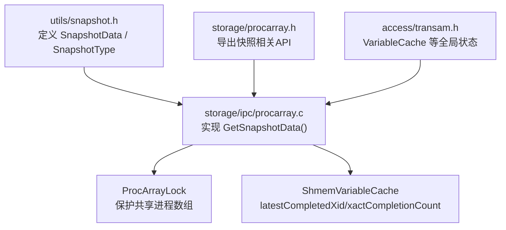
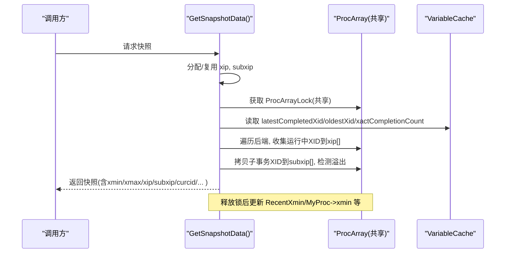
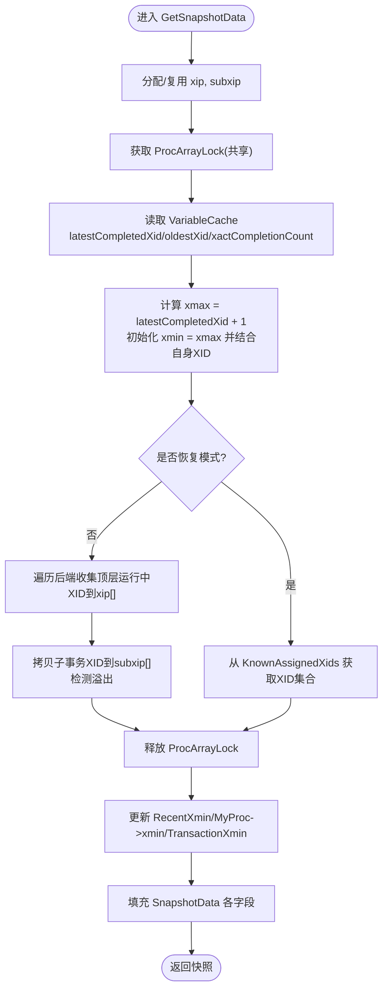
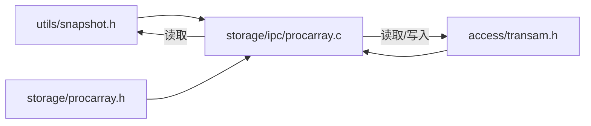

# 快照管理机制

<cite>
**本文引用的文件**
- [src/include/utils/snapshot.h](file://src/include/utils/snapshot.h)
- [src/backend/storage/ipc/procarray.c](file://src/backend/storage/ipc/procarray.c)
- [src/include/storage/procarray.h](file://src/include/storage/procarray.h)
- [src/include/access/transam.h](file://src/include/access/transam.h)
</cite>

## 目录
1. [简介](#简介)
2. [项目结构](#项目结构)
3. [核心组件](#核心组件)
4. [架构总览](#架构总览)
5. [详细组件分析](#详细组件分析)
6. [依赖关系分析](#依赖关系分析)
7. [性能考虑](#性能考虑)
8. [故障排查指南](#故障排查指南)
9. [结论](#结论)
10. [附录](#附录)

## 简介
本文件面向Mini PostgreSQL的MVCC快照管理系统，系统性说明SnapshotData结构体设计、GetSnapshotData创建流程、快照在查询执行中的传播与使用、失效与清理策略、并发同步机制与性能要点，并给出最佳实践与常见问题解决方案。文档以仓库源码为依据，聚焦关键路径与实现细节，帮助读者理解快照如何保证一致性视图以及如何在高并发下高效工作。

## 项目结构
围绕快照管理的关键代码分布在以下位置：
- 快照类型与数据结构定义：utils/snapshot.h
- 快照创建与共享状态读取：storage/ipc/procarray.c（含GetSnapshotData）
- 进程数组与快照相关接口声明：storage/procarray.h
- 事务ID与全局变量缓存（latestCompletedXid、xactCompletionCount等）：access/transam.h

图表来源
- [src/include/utils/snapshot.h:121-217](file://src/include/utils/snapshot.h#L121-L217)
- [src/backend/storage/ipc/procarray.c:2248-2600](file://src/backend/storage/ipc/procarray.c#L2248-L2600)
- [src/include/storage/procarray.h:44-61](file://src/include/storage/procarray.h#L44-L61)
- [src/include/access/transam.h:230-250](file://src/include/access/transam.h#L230-L250)

章节来源
- [src/include/utils/snapshot.h:121-217](file://src/include/utils/snapshot.h#L121-L217)
- [src/backend/storage/ipc/procarray.c:2248-2600](file://src/backend/storage/ipc/procarray.c#L2248-L2600)
- [src/include/storage/procarray.h:44-61](file://src/include/storage/procarray.h#L44-L61)
- [src/include/access/transam.h:230-250](file://src/include/access/transam.h#L230-L250)

## 核心组件
- SnapshotData：表示一次MVCC或特殊语义快照的核心结构，包含xmin/xmax、运行中事务列表xip及其计数xcnt、子事务列表subxip及计数subxcnt、是否溢出标志suboverflowed、命令ID curcid、时间戳whenTaken、WAL位置lsn、快照构建时的完成计数snapXactCompletionCount等。
- SnapshotType：区分不同可见性语义的快照类型，如SNAPSHOT_MVCC、SNAPSHOT_SELF、SNAPSHOT_ANY、SNAPSHOT_TOAST、SNAPSHOT_DIRTY、SNAPSHOT_HISTORIC_MVCC、SNAPSHOT_NON_VACUUMABLE。
- ProcArrayLock：保护共享进程数组的轻量级锁，确保扫描其他后端事务状态的一致性。
- ShmemVariableCache：共享内存中的事务ID边界与计数，包括latestCompletedXid、oldestXid、xactCompletionCount等，用于快速计算xmax与判断是否需要重算快照。

章节来源
- [src/include/utils/snapshot.h:121-217](file://src/include/utils/snapshot.h#L121-L217)
- [src/include/storage/procarray.h:44-61](file://src/include/storage/procarray.h#L44-L61)
- [src/include/access/transam.h:230-250](file://src/include/access/transam.h#L230-L250)

## 架构总览
快照创建由GetSnapshotData完成，其核心步骤如下：
- 分配或复用xip/subxip缓冲区（首次调用时分配）。
- 获取ProcArrayLock（共享模式），读取共享进程数组与其他后端的事务信息。
- 计算xmax为latestCompletedXid+1；初始化xmin为xmax，再结合当前后端自身XID更新。
- 遍历所有后端，收集运行中的顶层XID到xip[]，同时尽可能拷贝子事务XID到subxip[]；若检测到溢出则标记suboverflowed。
- 在热备恢复模式下，从KnownAssignedXids获取XID集合，简化top-level与子事务区分。
- 释放锁后，更新RecentXmin、MyProc->xmin、TransactionXmin等全局/本地状态，并填充SnapshotData各字段。
- 维护GlobalVis*边界，辅助后续可见性测试与清理。

图表来源
- [src/backend/storage/ipc/procarray.c:2248-2600](file://src/backend/storage/ipc/procarray.c#L2248-L2600)
- [src/include/access/transam.h:230-250](file://src/include/access/transam.h#L230-L250)

章节来源
- [src/backend/storage/ipc/procarray.c:2248-2600](file://src/backend/storage/ipc/procarray.c#L2248-L2600)
- [src/include/access/transam.h:230-250](file://src/include/access/transam.h#L230-L250)

## 详细组件分析

### SnapshotData 结构与字段语义
- snapshot_type：快照类型，决定可见性规则（MVCC、Self、Any、Toast、Dirty、Historic MVCC、Non-Vacuumable）。
- xmin/xmax：MVCC可见性的边界。所有小于xmin的XID视为已完成且可见；大于等于xmax的XID视为尚未完成不可见；区间[xmin,xmax)内的XID需查xip[]判断是否仍在运行。
- xip/xcnt：运行中的顶层事务XID列表及其数量。
- subxip/subxcnt/suboverflowed：运行中的子事务XID列表、数量与溢出标志。当子事务过多导致无法完整记录时会溢出，影响可见性判断的精确度。
- takenDuringRecovery/copied：是否在恢复期间取快照；是否为持久化副本。
- curcid：当前命令ID，用于同一事务内命令间可见性。
- speculativeToken/vistest：特殊用途字段，分别用于脏读场景与“非可清理”可见性测试。
- active_count/regd_count/ph_node：引用计数与注册堆节点，用于ActiveSnapshot栈与RegisteredSnapshots管理。
- whenTaken/lsn：快照时间与WAL位置，便于诊断与回放。
- snapXactCompletionCount：构建快照时的完成计数，用于静态快照重用优化。

章节来源
- [src/include/utils/snapshot.h:121-217](file://src/include/utils/snapshot.h#L121-L217)

### GetSnapshotData 工作原理与生命周期
- 缓冲分配：首次调用时为xip/subxip分配最大可能大小的数组，避免重复分配开销。
- 锁与共享状态：以共享模式获取ProcArrayLock，读取VariableCache的最新完成XID与完成计数，确保一致地计算xmax与判断是否需要重算。
- 运行中事务收集：遍历后端，跳过无XID、自身XID、逻辑解码与LAZY VACUUM等特殊情况，收集运行中顶层XID；尽可能拷贝子事务XID，遇到溢出标记suboverflowed。
- 恢复模式处理：在热备恢复时，从KnownAssignedXids获取XID集合，统一放入subxip并调整xmin。
- 结果回填：设置xmin/xmax/xcnt/subxcnt/suboverflowed/curcid/refcounts/copied等，并调用内部函数初始化旧快照相关信息。
- 全局可见性边界：更新GlobalVis*边界，辅助后续清理与可见性测试。

图表来源
- [src/backend/storage/ipc/procarray.c:2248-2600](file://src/backend/storage/ipc/procarray.c#L2248-L2600)

章节来源
- [src/backend/storage/ipc/procarray.c:2248-2600](file://src/backend/storage/ipc/procarray.c#L2248-L2600)

### 快照的传播与使用
- 在查询执行过程中，执行器通过ActiveSnapshot栈获取当前可见性快照，并在扫描、连接、聚合等操作中使用该快照进行元组可见性判断。
- 常见用法包括PushActiveSnapshot/PopActiveSnapshot成对管理快照生命周期，或在特定命令中临时替换ActiveSnapshot以提供一致的视图。
- 对于需要更严格可见性的场景（如EXPLAIN、索引操作、扩展安装等），会显式推送一个复制的快照或事务快照，以保证内部操作不受外部并发修改影响。

章节来源
- [src/include/storage/procarray.h:44-61](file://src/include/storage/procarray.h#L44-L61)

### 快照失效与清理策略
- 快照本身不直接持有数据页或行版本，而是通过xmin/xmax/xip/subxip约束可见性范围。清理主要由Vacuum/autovacuum依据xmin边界推进，回收不可见元组。
- GlobalVis*边界在GetSnapshotData中被更新，反映当前会话与系统范围内“必须保留”的最早XID，从而指导清理何时可以安全回收。
- 当子事务过多导致suboverflowed=true时，可见性检查可能需要额外代价来确认子事务状态，但不会阻止快照继续生效。
- 复制槽与catalog xmin会影响最小可见边界，确保逻辑复制消费者能读到所需历史版本。

章节来源
- [src/backend/storage/ipc/procarray.c:2491-2575](file://src/backend/storage/ipc/procarray.c#L2491-L2575)
- [src/include/access/transam.h:230-250](file://src/include/access/transam.h#L230-L250)

### 并发环境下的同步机制
- ProcArrayLock：以共享模式保护对共享进程数组的读取，确保快照构建期间其他后端的状态变更被正确捕获。
- VariableCache：latestCompletedXid与xactCompletionCount作为全局单调递增的基准，用于快速确定xmax与判断静态快照是否可重用。
- MyProc->xmin/TransactionXmin/RecentXmin：后端局部与全局的最小可见边界，协调清理与可见性判断。
- 恢复模式：KnownAssignedXids提供已分配XID集合，确保在热备环境下也能构造一致的快照。

章节来源
- [src/backend/storage/ipc/procarray.c:2304-2310](file://src/backend/storage/ipc/procarray.c#L2304-L2310)
- [src/backend/storage/ipc/procarray.c:2470-2475](file://src/backend/storage/ipc/procarray.c#L2470-L2475)
- [src/include/access/transam.h:230-250](file://src/include/access/transam.h#L230-L250)

## 依赖关系分析
- 模块耦合：
  - procarray.c依赖snapshot.h定义的SnapshotData/SnapshotType，以及transam.h的全局VariableCache。
  - 通过procarray.h暴露GetSnapshotData等接口供上层模块调用。
- 外部依赖点：
  - 共享内存中的进程数组与VariableCache。
  - 恢复子系统提供的KnownAssignedXids能力。
- 潜在循环依赖：
  - 快照创建仅读取共享状态，不反向依赖具体访问层，保持低耦合。

图表来源
- [src/include/utils/snapshot.h:121-217](file://src/include/utils/snapshot.h#L121-L217)
- [src/backend/storage/ipc/procarray.c:2248-2600](file://src/backend/storage/ipc/procarray.c#L2248-L2600)
- [src/include/storage/procarray.h:44-61](file://src/include/storage/procarray.h#L44-L61)
- [src/include/access/transam.h:230-250](file://src/include/access/transam.h#L230-L250)

章节来源
- [src/include/utils/snapshot.h:121-217](file://src/include/utils/snapshot.h#L121-L217)
- [src/backend/storage/ipc/procarray.c:2248-2600](file://src/backend/storage/ipc/procarray.c#L2248-L2600)
- [src/include/storage/procarray.h:44-61](file://src/include/storage/procarray.h#L44-L61)
- [src/include/access/transam.h:230-250](file://src/include/access/transam.h#L230-L250)

## 性能考虑
- 静态快照重用：利用snapXactCompletionCount与xactCompletionCount比较，若无事务完成则可复用已有快照，减少锁竞争与扫描成本。
- 缓冲复用：xip/subxip在首次分配后可复用，避免频繁malloc/free。
- 锁粒度：获取ProcArrayLock为共享模式，降低阻塞概率；在锁内尽量完成必要计算，减少持锁时间。
- 子事务溢出：当suboverflowed=true时，可见性检查可能增加额外开销，应关注长事务与大量子事务的使用模式。
- 恢复模式：KnownAssignedXids路径避免了复杂的主/子事务区分，提升恢复期快照构建效率。

[本节为通用性能建议，无需特定文件引用]

## 故障排查指南
- 快照未更新或过旧：
  - 检查xactCompletionCount与snapXactCompletionCount是否匹配，确认是否命中静态快照重用。
  - 核查是否有长时间运行的事务导致xmin长期不推进。
- 可见性异常：
  - 检查xip/subxip是否正确填充，是否存在溢出导致的不精确判断。
  - 确认是否处于恢复模式，KnownAssignedXids是否有效。
- 清理滞后：
  - 观察GlobalVis*边界与复制槽xmin/catalog_xmin是否限制了清理进度。
  - 检查vacuum_defer_cleanup_age配置是否过大。

章节来源
- [src/backend/storage/ipc/procarray.c:2506-2528](file://src/backend/storage/ipc/procarray.c#L2506-L2528)
- [src/include/access/transam.h:230-250](file://src/include/access/transam.h#L230-L250)

## 结论
Mini PostgreSQL的快照管理以SnapshotData为核心，通过GetSnapshotData在共享锁保护下采集运行中事务信息，形成稳定的MVCC视图。借助VariableCache的全局边界与完成计数，系统在并发环境下实现了高效的快照创建与重用。配合GlobalVis*边界与复制槽约束，清理策略得以安全推进。实践中应关注子事务溢出、长事务与恢复模式的影响，遵循快照生命周期管理规范，以获得稳定一致且高性能的查询体验。

[本节为总结性内容，无需特定文件引用]

## 附录
- 术语
  - XID：事务标识符，用于追踪事务生命周期与可见性。
  - CID：命令标识符，用于同一事务内命令间的可见性控制。
  - 静态快照：基于完成计数判断可复用的快照，避免重复构建。
- 参考路径
  - 快照结构定义：[src/include/utils/snapshot.h:121-217](file://src/include/utils/snapshot.h#L121-L217)
  - 快照创建主流程：[src/backend/storage/ipc/procarray.c:2248-2600](file://src/backend/storage/ipc/procarray.c#L2248-L2600)
  - 共享状态与边界：[src/include/access/transam.h:230-250](file://src/include/access/transam.h#L230-L250)
  - 快照相关API声明：[src/include/storage/procarray.h:44-61](file://src/include/storage/procarray.h#L44-L61)

[本节为附录，无需特定文件引用]