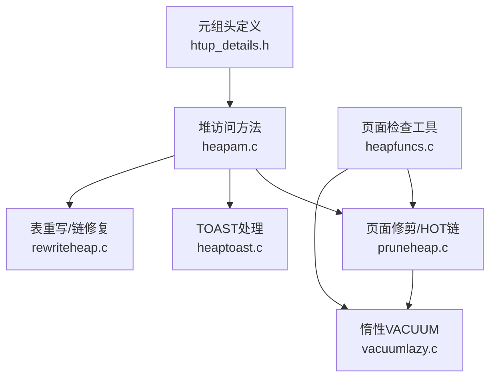
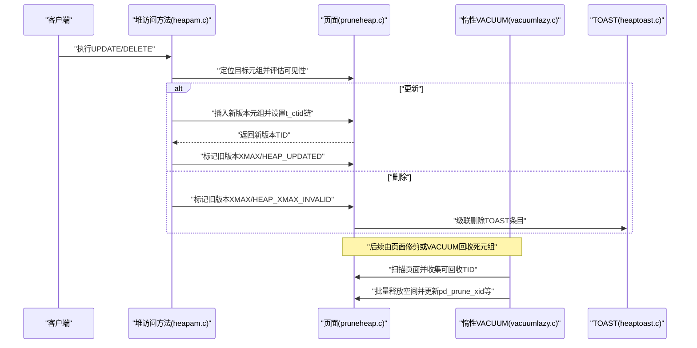
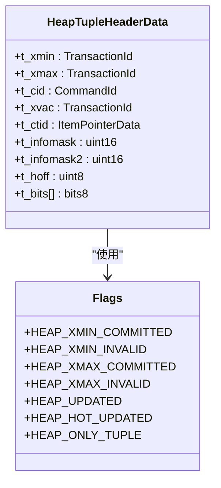
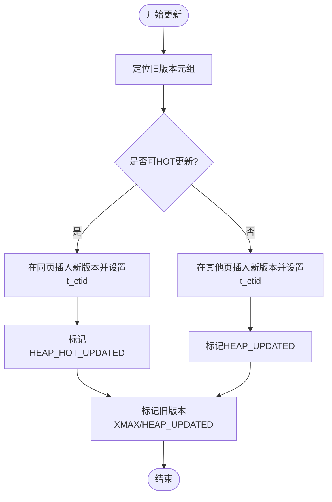
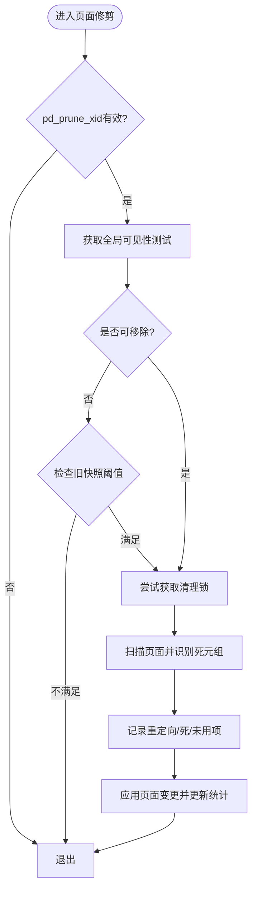
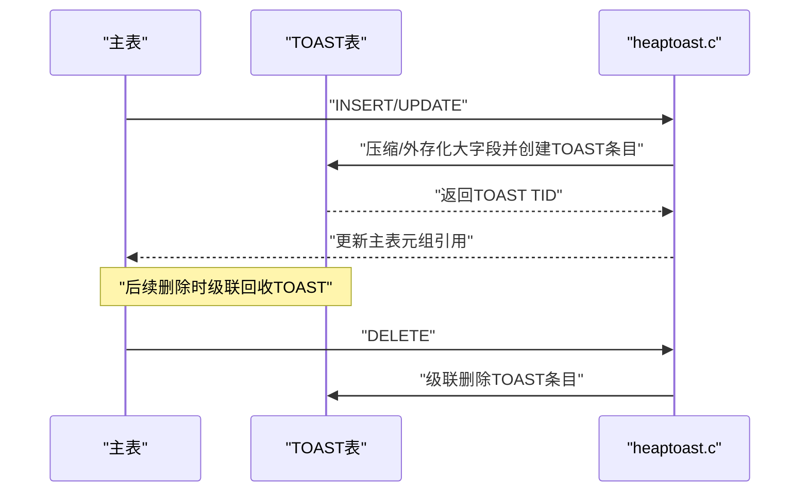
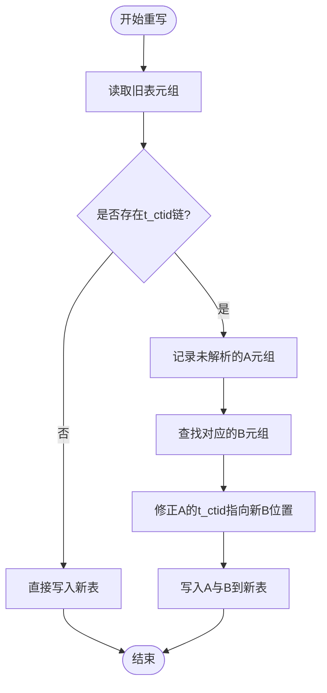
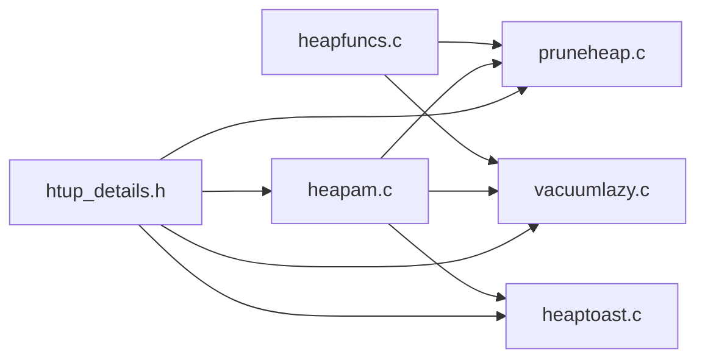

# 版本链维护

<cite>
**本文引用的文件**
- [htup_details.h](file://src/include/access/htup_details.h)
- [heapam.c](file://src/backend/access/heap/heapam.c)
- [pruneheap.c](file://src/backend/access/heap/pruneheap.c)
- [vacuumlazy.c](file://src/backend/access/heap/vacuumlazy.c)
- [heaptoast.c](file://src/backend/access/heap/heaptoast.c)
- [rewriteheap.c](file://src/backend/access/heap/rewriteheap.c)
- [heapfuncs.c](file://contrib/pageinspect/heapfuncs.c)
</cite>

## 目录
1. [简介](#简介)
2. [项目结构](#项目结构)
3. [核心组件](#核心组件)
4. [架构总览](#架构总览)
5. [详细组件分析](#详细组件分析)
6. [依赖关系分析](#依赖关系分析)
7. [性能考虑](#性能考虑)
8. [故障排查指南](#故障排查指南)
9. [结论](#结论)
10. [附录](#附录)

## 简介
本文面向Mini PostgreSQL的版本链维护机制，围绕元组版本链、t_ctid指针、HOT更新、VACUUM清理、TOAST与大对象存储的关联，以及调试与监控方法展开。目标是帮助读者理解：
- 元组版本链的概念与实现原理（t_ctid如何链接新旧版本）
- 更新时版本链的创建过程（新版本插入、旧版本标记）
- VACUUM对版本链的清理策略（死元组识别与回收）
- TOAST表与主表的版本链关系及大对象处理
- 性能优化（hint位、垃圾回收触发条件）
- 调试工具与监控方法

## 项目结构
本主题涉及的核心代码分布在以下模块：
- 元组头定义与可见性标志：src/include/access/htup_details.h
- 堆访问方法与更新流程：src/backend/access/heap/heapam.c
- 页面级修剪与HOT链管理：src/backend/access/heap/pruneheap.c
- 并发VACUUM（惰性清理）：src/backend/access/heap/vacuumlazy.c
- TOAST外部存储与压缩：src/backend/access/heap/heaptoast.c
- 表重写与版本链修复：src/backend/access/heap/rewriteheap.c
- 页面检查与调试接口：contrib/pageinspect/heapfuncs.c

**图表来源**
- [htup_details.h:85-111](file://src/include/access/htup_details.h#L85-L111)
- [heapam.c:77-121](file://src/backend/access/heap/heapam.c#L77-L121)
- [pruneheap.c:30-91](file://src/backend/access/heap/pruneheap.c#L30-L91)
- [vacuumlazy.c:174-194](file://src/backend/access/heap/vacuumlazy.c#L174-L194)
- [heaptoast.c:36-93](file://src/backend/access/heap/heaptoast.c#L36-L93)
- [rewriteheap.c:126-185](file://src/backend/access/heap/rewriteheap.c#L126-L185)
- [heapfuncs.c:583-586](file://contrib/pageinspect/heapfuncs.c#L583-L586)

**章节来源**
- [htup_details.h:85-111](file://src/include/access/htup_details.h#L85-L111)
- [heapam.c:77-121](file://src/backend/access/heap/heapam.c#L77-L121)
- [pruneheap.c:30-91](file://src/backend/access/heap/pruneheap.c#L30-L91)
- [vacuumlazy.c:174-194](file://src/backend/access/heap/vacuumlazy.c#L174-L194)
- [heaptoast.c:36-93](file://src/backend/access/heap/heaptoast.c#L36-L93)
- [rewriteheap.c:126-185](file://src/backend/access/heap/rewriteheap.c#L126-L185)
- [heapfuncs.c:583-586](file://contrib/pageinspect/heapfuncs.c#L583-L586)

## 核心组件
- 元组头与可见性标志：定义了t_xmin/t_xmax/t_cid/t_xvac、t_infomask/t_infomask2等字段，以及HEAP_XMIN_COMMITTED、HEAP_XMAX_INVALID、HEAP_UPDATED、HEAP_HOT_UPDATED、HEAP_ONLY_TUPLE等关键标志。
- t_ctid指针：用于指向当前或更新的元组位置，形成版本链；支持分区键更新时的特殊标记与推测插入令牌。
- HOT更新与仅堆元组：通过HEAP_HOT_UPDATED与HEAP_ONLY_TUPLE标识同一页内就地更新产生的版本链，减少索引维护开销。
- 页面修剪与VACUUM：在页面级别识别可删除的元组并清理，支持惰性VACUUM收集死元组TID并批量回收。
- TOAST与大对象：将大字段压缩或外存化，主表与TOAST表之间通过引用保持数据一致性，并在删除时级联回收。
- 表重写：在重建表时维护t_ctid链的正确映射，确保版本链在新表中保持一致。

**章节来源**
- [htup_details.h:121-180](file://src/include/access/htup_details.h#L121-L180)
- [htup_details.h:186-283](file://src/include/access/htup_details.h#L186-L283)
- [htup_details.h:477-513](file://src/include/access/htup_details.h#L477-L513)
- [pruneheap.c:30-91](file://src/backend/access/heap/pruneheap.c#L30-L91)
- [vacuumlazy.c:174-194](file://src/backend/access/heap/vacuumlazy.c#L174-L194)
- [heaptoast.c:36-93](file://src/backend/access/heap/heaptoast.c#L36-L93)
- [rewriteheap.c:126-185](file://src/backend/access/heap/rewriteheap.c#L126-L185)

## 架构总览
版本链维护贯穿“写入—可见性—清理”的全生命周期：
- 写入阶段：INSERT/UPDATE在堆中分配新元组，设置t_xmin/t_xmax，并通过t_ctid建立版本链；若为HOT更新，则在同一页内就地更新并标记HEAP_HOT_UPDATED。
- 可见性判断：读取路径依据t_infomask中的提交/无效标志与快照信息决定元组是否可见。
- 清理阶段：页面级修剪与VACUUM识别不可见且可回收的元组，释放空间并更新页面状态；TOAST在删除时级联回收外部存储。

**图表来源**
- [heapam.c:77-121](file://src/backend/access/heap/heapam.c#L77-L121)
- [pruneheap.c:94-200](file://src/backend/access/heap/pruneheap.c#L94-L200)
- [vacuumlazy.c:174-194](file://src/backend/access/heap/vacuumlazy.c#L174-L194)
- [heaptoast.c:36-93](file://src/backend/access/heap/heaptoast.c#L36-L93)

## 详细组件分析

### 元组头与t_ctid版本链
- t_ctid的作用：指向当前或更新的元组位置，形成版本链；当元组被移动至其他分区时，使用特殊值指示；推测插入时使用令牌而非真实TID。
- 最新版本判定：若XMAX无效或t_ctid自指（且XMAX有效时为锁定或删除），则为最新版本；沿t_ctid链追踪可找到最新元组，但需校验XMIN/XMAX一致性以避免误判。
- 可见性标志：HEAP_XMIN_COMMITTED/INVALID、HEAP_XMAX_COMMITTED/INVALID、HEAP_UPDATED、HEAP_HOT_UPDATED、HEAP_ONLY_TUPLE等用于快速判断可见性与更新类型。

**图表来源**
- [htup_details.h:121-180](file://src/include/access/htup_details.h#L121-L180)
- [htup_details.h:186-283](file://src/include/access/htup_details.h#L186-L283)

**章节来源**
- [htup_details.h:85-111](file://src/include/access/htup_details.h#L85-L111)
- [htup_details.h:121-180](file://src/include/access/htup_details.h#L121-L180)
- [htup_details.h:186-283](file://src/include/access/htup_details.h#L186-L283)

### 更新流程与HOT链创建
- 更新时：插入新版本元组，设置t_xmin为新事务ID，并将旧版本的t_ctid指向新版本；若可在同页内就地更新，则标记HEAP_HOT_UPDATED以减少索引维护成本。
- 仅堆元组：HEAP_ONLY_TUPLE表示该元组仅为HOT链的一部分，不独立存在索引中，进一步降低维护开销。
- 可见性优化：通过hint位（如HEAP_XMIN_COMMITTED/HEAP_XMAX_INVALID）避免重复检查事务状态，提升读取性能。

**图表来源**
- [heapam.c:77-121](file://src/backend/access/heap/heapam.c#L77-L121)
- [htup_details.h:477-513](file://src/include/access/htup_details.h#L477-L513)

**章节来源**
- [heapam.c:77-121](file://src/backend/access/heap/heapam.c#L77-L121)
- [htup_details.h:477-513](file://src/include/access/htup_details.h#L477-L513)

### 页面修剪与VACUUM清理
- 页面级修剪：heap_page_prune_opt在页面空闲不足或存在潜在死元组时尝试获取清理锁并进行修剪；利用pd_prune_xid与全局可见性测试确定可回收范围。
- 惰性VACUUM：扫描堆并收集死元组TID，分批进行索引清理与页面压缩；无索引时可边扫边清理，减少内存占用。
- 回收策略：识别不可见且满足回收条件的元组，释放空间并更新页面状态；必要时截断关系尾部以回收未使用的块。

**图表来源**
- [pruneheap.c:94-200](file://src/backend/access/heap/pruneheap.c#L94-L200)
- [vacuumlazy.c:174-194](file://src/backend/access/heap/vacuumlazy.c#L174-L194)

**章节来源**
- [pruneheap.c:94-200](file://src/backend/access/heap/pruneheap.c#L94-L200)
- [vacuumlazy.c:174-194](file://src/backend/access/heap/vacuumlazy.c#L174-L194)

### TOAST与大对象存储
- 插入/更新：heap_toast_insert_or_update根据目标长度限制对大字段进行压缩或外存化，生成TOAST条目并更新主表元组引用。
- 删除：heap_toast_delete在删除主表元组时级联删除对应的TOAST条目，避免孤立数据。
- 与版本链的关系：TOAST条目的生命周期与主表元组版本一致，删除或更新时需保证引用完整性与一致性。

**图表来源**
- [heaptoast.c:36-93](file://src/backend/access/heap/heaptoast.c#L36-L93)

**章节来源**
- [heaptoast.c:36-93](file://src/backend/access/heap/heaptoast.c#L36-L93)

### 表重写与版本链修复
- 重写目标：在重建表时保持可见信息与更新链的一致性，确保t_ctid链在新表中正确映射。
- 哈希表管理：使用unresolved_tups与old_new_tid_map跟踪A->B的链式引用，遇到B后修正A的t_ctid并写入新表。
- 性能考量：批量构建页面并通过WAL记录与直接写入磁盘，减少缓冲管理器压力；逻辑重写时维护映射文件。

**图表来源**
- [rewriteheap.c:126-185](file://src/backend/access/heap/rewriteheap.c#L126-L185)

**章节来源**
- [rewriteheap.c:126-185](file://src/backend/access/heap/rewriteheap.c#L126-L185)

## 依赖关系分析
- 元组头定义被堆访问方法、页面修剪、VACUUM、TOAST等模块广泛引用，构成版本链的基础数据结构。
- 堆访问方法依赖页面修剪与VACUUM完成可见性判断与空间回收；TOAST在主表更新/删除时被调用以管理外部存储。
- 页面检查工具提供调试接口，便于观察HEAP_HOT_UPDATED与HEAP_ONLY_TUPLE等标志的状态。

**图表来源**
- [htup_details.h:121-180](file://src/include/access/htup_details.h#L121-L180)
- [heapam.c:77-121](file://src/backend/access/heap/heapam.c#L77-L121)
- [pruneheap.c:30-91](file://src/backend/access/heap/pruneheap.c#L30-L91)
- [vacuumlazy.c:174-194](file://src/backend/access/heap/vacuumlazy.c#L174-L194)
- [heaptoast.c:36-93](file://src/backend/access/heap/heaptoast.c#L36-L93)
- [heapfuncs.c:583-586](file://contrib/pageinspect/heapfuncs.c#L583-L586)

**章节来源**
- [htup_details.h:121-180](file://src/include/access/htup_details.h#L121-L180)
- [heapam.c:77-121](file://src/backend/access/heap/heapam.c#L77-L121)
- [pruneheap.c:30-91](file://src/backend/access/heap/pruneheap.c#L30-L91)
- [vacuumlazy.c:174-194](file://src/backend/access/heap/vacuumlazy.c#L174-L194)
- [heaptoast.c:36-93](file://src/backend/access/heap/heaptoast.c#L36-L93)
- [heapfuncs.c:583-586](file://contrib/pageinspect/heapfuncs.c#L583-L586)

## 性能考虑
- hint位优化：通过设置HEAP_XMIN_COMMITTED、HEAP_XMAX_INVALID等标志，避免重复查询事务状态，提升读取路径性能。
- HOT更新：在同一页内就地更新并标记HEAP_HOT_UPDATED，减少索引维护与跨页跳转开销。
- 垃圾回收触发：页面级修剪基于pd_prune_xid与全局可见性测试；惰性VACUUM在扫描过程中收集死元组并批量回收，控制内存使用上限。
- TOAST压缩：优先尝试内联压缩，其次外存化大字段，平衡主表大小与I/O成本。

[本节为通用性能指导，无需特定文件来源]

## 故障排查指南
- 使用页面检查工具查看元组标志：通过heapfuncs.c提供的函数可检测HEAP_HOT_UPDATED与HEAP_ONLY_TUPLE等标志，辅助定位HOT链问题。
- 检查版本链一致性：沿t_ctid链验证XMIN/XMAX匹配，避免VACUUM导致的误判；确认新版本元组的XMIN等于旧版本的XMAX。
- 监控VACUUM进度：关注惰性VACUUM的死元组收集与回收阶段，确保及时释放空间并更新页面状态。
- TOAST一致性：在删除主表元组后，确认TOAST条目已被级联删除，避免孤立数据占用空间。

**章节来源**
- [heapfuncs.c:583-586](file://contrib/pageinspect/heapfuncs.c#L583-L586)
- [htup_details.h:85-111](file://src/include/access/htup_details.h#L85-L111)
- [vacuumlazy.c:174-194](file://src/backend/access/heap/vacuumlazy.c#L174-L194)
- [heaptoast.c:36-93](file://src/backend/access/heap/heaptoast.c#L36-L93)

## 结论
Mini PostgreSQL的版本链维护机制通过t_ctid指针与可见性标志实现了高效的元组版本管理。HOT更新减少了索引维护成本，页面级修剪与惰性VACUUM确保了空间的及时回收。TOAST与大对象存储与主表版本链紧密耦合，保证了数据一致性。结合hint位优化与调试工具，可有效提升性能并便于问题定位。

[本节为总结性内容，无需特定文件来源]

## 附录
- 关键标志说明：
  - HEAP_XMIN_COMMITTED/INVALID：指示插入事务的提交/无效状态
  - HEAP_XMAX_COMMITTED/INVALID：指示删除/锁定事务的提交/无效状态
  - HEAP_UPDATED：表示该元组为UPDATE后的新版本
  - HEAP_HOT_UPDATED：表示HOT就地更新
  - HEAP_ONLY_TUPLE：表示仅存在于HOT链中的元组
- 调试建议：
  - 使用页面检查工具观察标志位变化
  - 沿t_ctid链验证版本关系
  - 监控VACUUM日志与页面状态

[本节为补充信息，无需特定文件来源]