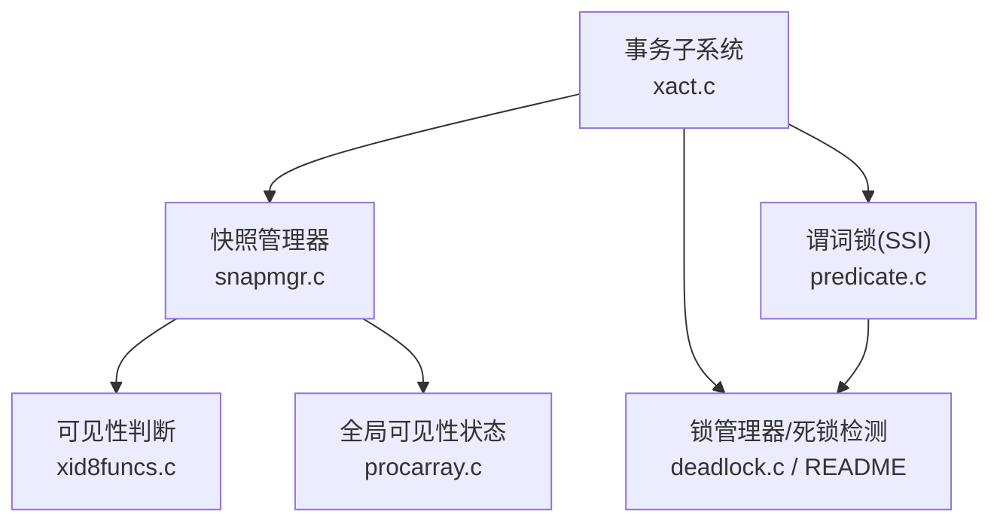
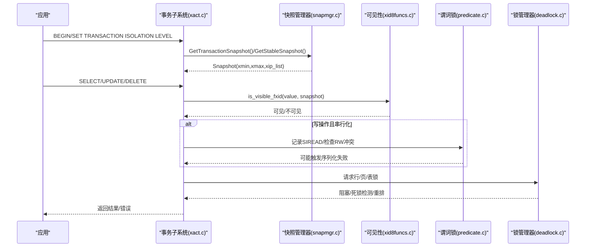
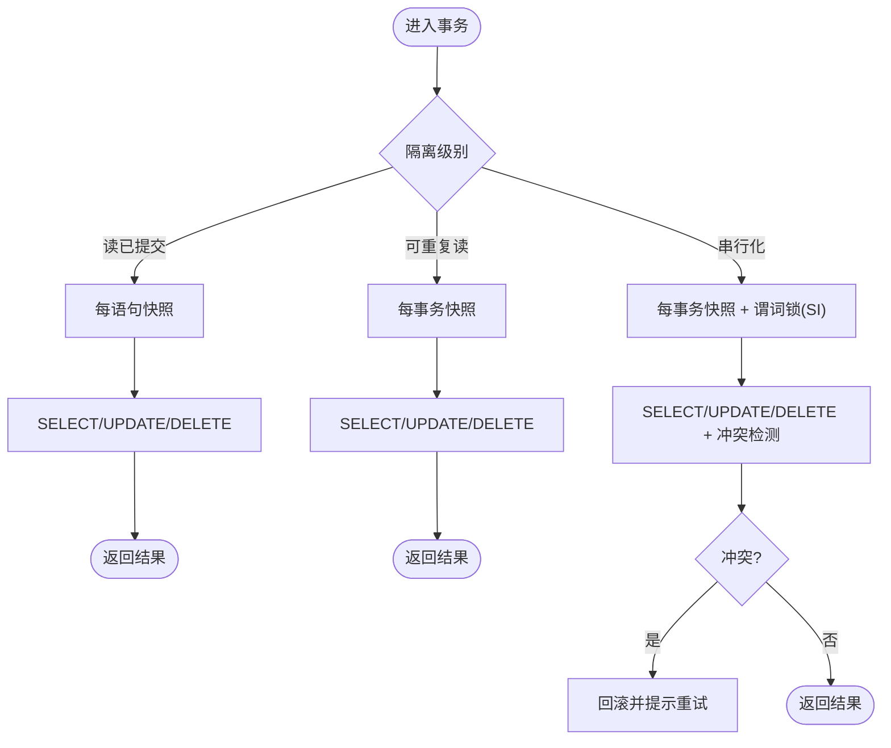
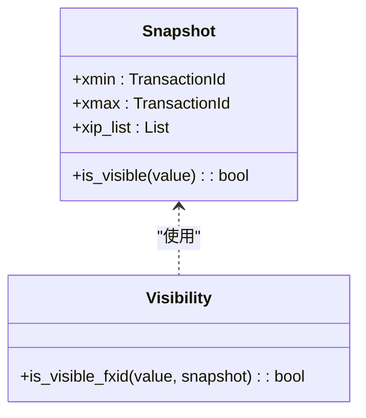
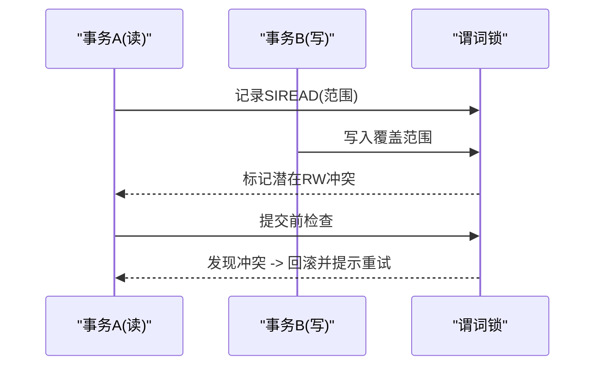
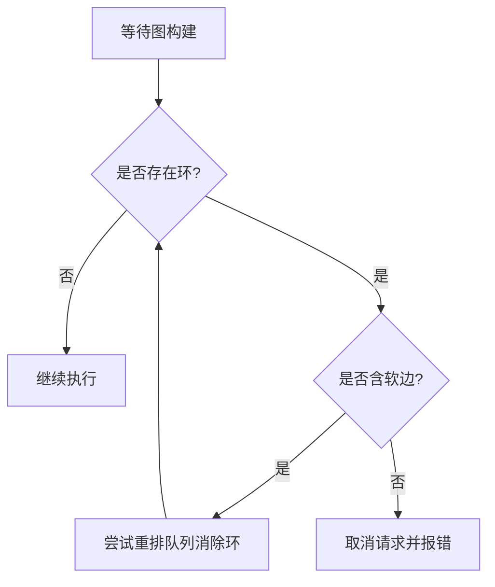
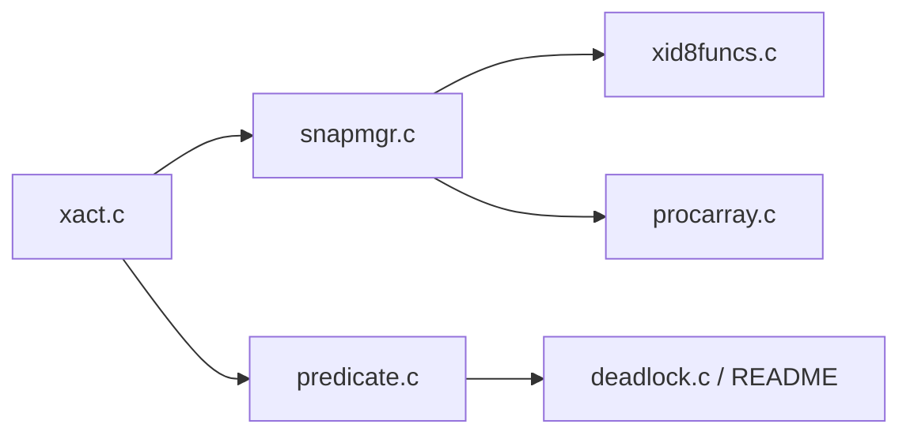

# 隔离级别支持

<cite>
**本文引用的文件**
- [xact.c](file://src/backend/access/transam/xact.c)
- [predicate.c](file://src/backend/storage/lmgr/predicate.c)
- [snapmgr.c](file://src/backend/utils/time/snapmgr.c)
- [xid8funcs.c](file://src/backend/utils/adt/xid8funcs.c)
- [procarray.c](file://src/backend/storage/ipc/procarray.c)
- [deadlock.c](file://src/backend/storage/lmgr/deadlock.c)
- [README（lmgr）](file://src/backend/storage/lmgr/README)
- [mvcc.sgml](file://doc/src/sgml/mvcc.sgml)
- [func.sgml](file://doc/src/sgml/func.sgml)
- [xact.h](file://src/include/access/xact.h)
</cite>

## 目录
1. [简介](#简介)
2. [项目结构](#项目结构)
3. [核心组件](#核心组件)
4. [架构总览](#架构总览)
5. [详细组件分析](#详细组件分析)
6. [依赖关系分析](#依赖关系分析)
7. [性能考量](#性能考量)
8. [故障排查指南](#故障排查指南)
9. [结论](#结论)
10. [附录](#附录)

## 简介
本文件面向 Mini PostgreSQL 的事务隔离级别支持，系统性说明四种标准隔离级别（读未提交、读已提交、可重复读、串行化）的实现差异与行为特征。重点阐述 MVCC 在各隔离级别下的快照语义、读偏斜、幻读、不可重复读等问题的处理方式；文档化隔离级别的配置方法与运行时切换机制；并给出不同隔离级别对性能与一致性权衡的分析、典型并发场景及解决方案，以及隔离级别选择的指导原则与最佳实践。

## 项目结构
Mini PostgreSQL 的隔离级别实现横跨事务子系统、快照管理、谓词锁（SSI）、可见性判断与锁管理器等多个模块：
- 事务子系统负责隔离级别常量、默认值、事务生命周期与快照获取时机控制。
- 快照管理器维护当前/次级/目录快照，按隔离级别决定“每语句”或“每事务”快照策略。
- 谓词锁子系统为串行化提供 SSI 冲突检测与回滚判定。
- 可见性函数基于快照 xmin/xmax/活动事务列表判断元组可见性。
- 锁管理器与死锁检测保障写路径上的互斥与公平性。

**图示来源**
- [xact.c:63-75](file://src/backend/access/transam/xact.c#L63-L75)
- [snapmgr.c:83-105](file://src/backend/utils/time/snapmgr.c#L83-L105)
- [predicate.c:1-190](file://src/backend/storage/lmgr/predicate.c#L1-L190)
- [xid8funcs.c:215-247](file://src/backend/utils/adt/xid8funcs.c#L215-L247)
- [procarray.c:155-170](file://src/backend/storage/ipc/procarray.c#L155-L170)
- [deadlock.c:342-386](file://src/backend/storage/lmgr/deadlock.c#L342-L386)

**章节来源**
- [xact.c:63-75](file://src/backend/access/transam/xact.c#L63-L75)
- [snapmgr.c:83-105](file://src/backend/utils/time/snapmgr.c#L83-L105)
- [predicate.c:1-190](file://src/backend/storage/lmgr/predicate.c#L1-L190)

## 核心组件
- 事务子系统
  - 定义隔离级别常量与默认值，暴露 IsolationUsesXactSnapshot()、IsolationIsSerializable() 等宏以区分“每语句快照”和“每事务快照”，并识别串行化模式。
  - 在事务开始/命令执行时触发快照获取，配合 GUC 与运行态切换。
- 快照管理器
  - 维护 CurrentSnapshot、SecondarySnapshot、CatalogSnapshot 等关键快照对象，跟踪引用计数与最小 xmin，用于推进清理边界。
  - 根据隔离级别选择快照粒度：读已提交为每语句快照；可重复读/串行化为每事务快照。
- 可见性判断
  - 基于 pg_snapshot 的 xmin/xmax/xip_list 判断 FullTransactionId 是否可见，支持二分查找优化。
- 谓词锁（SSI）
  - 为串行化级别提供读-写冲突检测、安全快照优化、失败回滚与重试提示。
- 锁管理与死锁检测
  - 通过等待图（WFG）检测硬/软边循环，必要时重排队列避免中止。

**章节来源**
- [xact.h:30-66](file://src/include/access/xact.h#L30-L66)
- [snapmgr.c:83-105](file://src/backend/utils/time/snapmgr.c#L83-L105)
- [xid8funcs.c:215-247](file://src/backend/utils/adt/xid8funcs.c#L215-L247)
- [predicate.c:1-190](file://src/backend/storage/lmgr/predicate.c#L1-L190)
- [procarray.c:155-170](file://src/backend/storage/ipc/procarray.c#L155-L170)
- [deadlock.c:342-386](file://src/backend/storage/lmgr/deadlock.c#L342-L386)

## 架构总览
下图展示从 SQL 层到存储层的隔离级别相关调用链：事务启动/命令执行 -> 快照获取 -> 可见性判断 -> 锁/谓词锁参与 -> 提交/回滚。

**图示来源**
- [xact.c:63-75](file://src/backend/access/transam/xact.c#L63-L75)
- [snapmgr.c:83-105](file://src/backend/utils/time/snapmgr.c#L83-L105)
- [xid8funcs.c:215-247](file://src/backend/utils/adt/xid8funcs.c#L215-L247)
- [predicate.c:1-190](file://src/backend/storage/lmgr/predicate.c#L1-L190)
- [deadlock.c:342-386](file://src/backend/storage/lmgr/deadlock.c#L342-L386)

## 详细组件分析

### 隔离级别与 MVCC 行为
- 读未提交
  - SQL 标准允许脏读，但 PostgreSQL 内部不实现该级别；实际最低可用为读已提交。
- 读已提交
  - 每语句一个快照：每个 SQL 语句开始时获取最新快照，因此同一事务内多次查询可能看到不同提交的数据（不可重复读可能发生）。
  - 不会读到未提交数据；不会出现幻读（因为每次语句重新取快照）。
- 可重复读
  - 每事务一个快照：事务首次非控制语句时创建稳定快照，后续所有查询均基于该快照，保证可重复读。
  - 仍可能出现序列化异常（如更新目标被其他事务修改导致冲突），需要应用层重试。
- 串行化
  - 在可重复读基础上增加谓词锁（SSI）监控读写冲突，检测到可能导致非串行执行的 RW 冲突时主动回滚并提示重试。
  - 提供“安全只读快照”优化：当可证明无冲突时可释放谓词锁以提升性能。

**图示来源**
- [xact.h:30-66](file://src/include/access/xact.h#L30-L66)
- [predicate.c:1-190](file://src/backend/storage/lmgr/predicate.c#L1-L190)
- [mvcc.sgml:400-600](file://doc/src/sgml/mvcc.sgml#L400-L600)

**章节来源**
- [mvcc.sgml:400-600](file://doc/src/sgml/mvcc.sgml#L400-L600)
- [xact.h:30-66](file://src/include/access/xact.h#L30-L66)

### 快照管理与可见性
- 快照结构
  - 包含 xmin（最低活跃事务ID）、xmax（下一个未完成事务ID）、xip_list（活动事务列表）。
  - 可见性判断依据：若事务ID小于 xmin 则可见；大于等于 xmax 则不可见；在区间内需查 xip_list。
- 快照获取策略
  - 读已提交：每语句获取最新快照。
  - 可重复读/串行化：每事务首个非控制语句获取稳定快照。
- 辅助视图
  - 系统视图提供 xmin/xmax/xip_list 等字段便于诊断。

**图示来源**
- [func.sgml:22917-22949](file://doc/src/sgml/func.sgml#L22917-L22949)
- [xid8funcs.c:215-247](file://src/backend/utils/adt/xid8funcs.c#L215-L247)
- [snapmgr.c:83-105](file://src/backend/utils/time/snapmgr.c#L83-L105)

**章节来源**
- [func.sgml:22917-22949](file://doc/src/sgml/func.sgml#L22917-L22949)
- [xid8funcs.c:215-247](file://src/backend/utils/adt/xid8funcs.c#L215-L247)
- [snapmgr.c:83-105](file://src/backend/utils/time/snapmgr.c#L83-L105)

### 串行化与谓词锁（SSI）
- 设计要点
  - 使用 SIREAD 锁记录读取范围，检测“先读后写”的 RW 冲突。
  - 仅在串行化事务中创建/检查 SIREAD 锁。
  - 支持“安全只读快照”优化，减少锁开销。
- 冲突处理
  - 检测到可能导致非串行执行的冲突时，标记并可能在提交前回滚，提示应用重试。
- 资源管理
  - 通过共享内存中的哈希表与链表维护谓词锁与冲突信息，分区锁降低竞争。

**图示来源**
- [predicate.c:1-190](file://src/backend/storage/lmgr/predicate.c#L1-L190)
- [predicate.c:490-567](file://src/backend/storage/lmgr/predicate.c#L490-L567)

**章节来源**
- [predicate.c:1-190](file://src/backend/storage/lmgr/predicate.c#L1-L190)
- [predicate.c:490-567](file://src/backend/storage/lmgr/predicate.c#L490-L567)

### 锁管理与死锁检测
- 等待图（WFG）
  - 进程作为节点，等待关系为有向边；存在环即死锁。
  - 区分“硬边”（已持有锁冲突）与“软边”（队列顺序导致的潜在冲突）。
- 解决策略
  - 优先尝试重排队列反转软边消除环，避免中止事务；否则取消其中一个请求并报错。

**图示来源**
- [README（lmgr）:393-465](file://src/backend/storage/lmgr/README#L393-L465)
- [deadlock.c:342-386](file://src/backend/storage/lmgr/deadlock.c#L342-L386)

**章节来源**
- [README（lmgr）:393-465](file://src/backend/storage/lmgr/README#L393-L465)
- [deadlock.c:342-386](file://src/backend/storage/lmgr/deadlock.c#L342-L386)

## 依赖关系分析
- 事务子系统依赖快照管理器获取可见性视图，并在串行化模式下依赖谓词锁进行冲突检测。
- 可见性函数依赖快照结构与活动事务列表，结合全局可见性状态推进 xmin。
- 锁管理器与谓词锁共同协作：普通锁保证写互斥，谓词锁捕获“读-写”时序冲突。

**图示来源**
- [xact.c:63-75](file://src/backend/access/transam/xact.c#L63-L75)
- [snapmgr.c:83-105](file://src/backend/utils/time/snapmgr.c#L83-L105)
- [predicate.c:1-190](file://src/backend/storage/lmgr/predicate.c#L1-L190)
- [xid8funcs.c:215-247](file://src/backend/utils/adt/xid8funcs.c#L215-L247)
- [procarray.c:155-170](file://src/backend/storage/ipc/procarray.c#L155-L170)
- [deadlock.c:342-386](file://src/backend/storage/lmgr/deadlock.c#L342-L386)

**章节来源**
- [xact.c:63-75](file://src/backend/access/transam/xact.c#L63-L75)
- [snapmgr.c:83-105](file://src/backend/utils/time/snapmgr.c#L83-L105)
- [predicate.c:1-190](file://src/backend/storage/lmgr/predicate.c#L1-L190)

## 性能考量
- 读已提交
  - 优点：高并发、低开销；缺点：不可重复读，复杂业务可能需要额外逻辑。
- 可重复读
  - 优点：事务内稳定视图；代价：更长的快照持有与可能的冲突回滚。
- 串行化
  - 优点：最强一致性；代价：谓词锁与冲突检测带来额外开销，可能频繁回滚重试。
- 优化点
  - 安全只读快照：可提前释放谓词锁，降低开销。
  - 合理索引与查询：缩小谓词锁范围，减少冲突概率。
  - 调整连接数与事务长度：缓解内存压力与锁竞争。

[本节为通用性能讨论，不直接分析具体文件]

## 故障排查指南
- 常见错误
  - 串行化失败：收到“无法串行化访问”的错误，应回滚并重试整个事务。
  - 死锁：出现等待环，系统会取消其中一个请求并报错，建议缩短事务、优化索引或调整业务顺序。
- 诊断工具
  - 查看快照字段 xmin/xmax/xip_list，定位可见性问题。
  - 观察谓词锁与冲突列表，评估冲突热点。
  - 检查锁等待图，定位软/硬边冲突。

**章节来源**
- [mvcc.sgml:400-600](file://doc/src/sgml/mvcc.sgml#L400-L600)
- [predicate.c:1-190](file://src/backend/storage/lmgr/predicate.c#L1-L190)
- [README（lmgr）:393-465](file://src/backend/storage/lmgr/README#L393-L465)

## 结论
Mini PostgreSQL 通过 MVCC 与 SSI 的组合实现了完整的隔离级别支持：读已提交提供高并发与简单语义；可重复读提供事务内稳定视图；串行化通过谓词锁确保严格一致性。选择隔离级别需在一致性与性能之间权衡，并结合业务特性与重试能力进行决策。

[本节为总结性内容，不直接分析具体文件]

## 附录
- 配置与运行时切换
  - 设置默认隔离级别：通过事务参数或会话参数设置隔离级别。
  - 运行时切换：在事务块内设置隔离级别，影响后续语句的快照策略。
  - 串行化事务可设置为 deferrable（仅读），等待安全快照以减少冲突。
- 最佳实践
  - 读多写少场景优先使用读已提交。
  - 需要稳定视图的场景使用可重复读，并准备重试逻辑。
  - 强一致性要求时使用串行化，优化查询与索引以降低冲突。
  - 避免长事务与宽范围更新，减少锁与谓词锁压力。

**章节来源**
- [xact.h:30-66](file://src/include/access/xact.h#L30-L66)
- [predicate.c:1-190](file://src/backend/storage/lmgr/predicate.c#L1-L190)
- [mvcc.sgml:400-600](file://doc/src/sgml/mvcc.sgml#L400-L600)