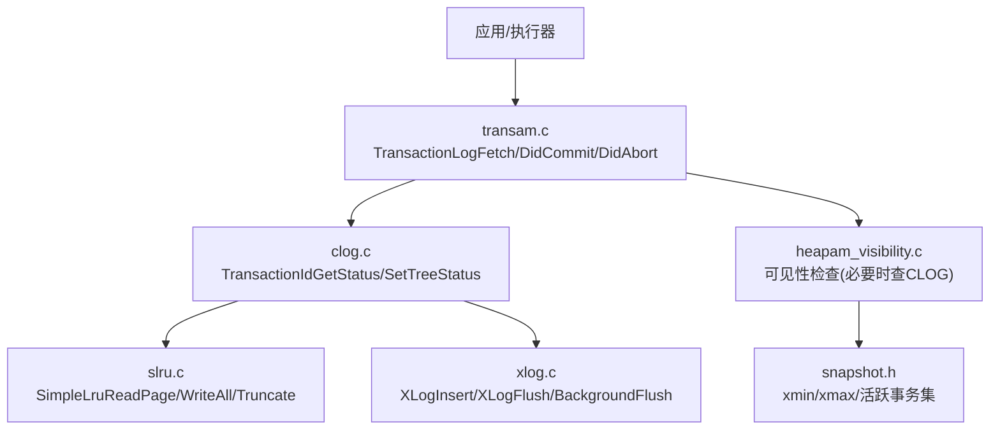
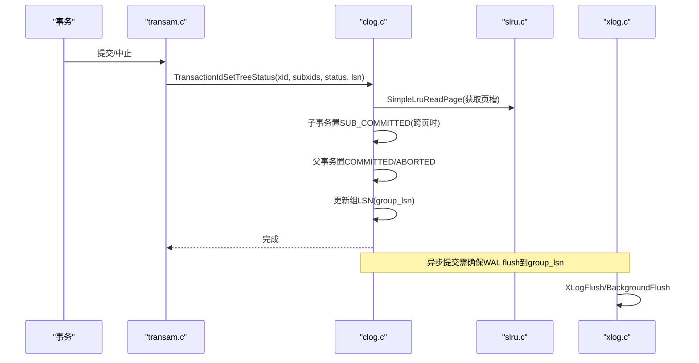
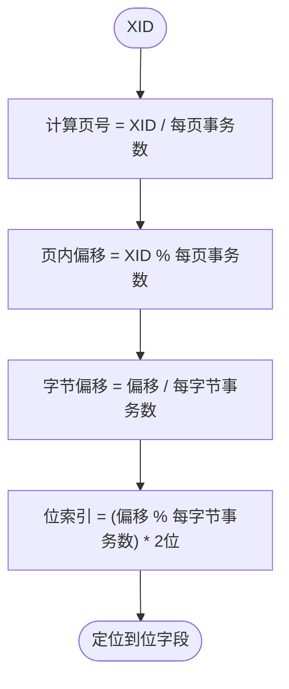
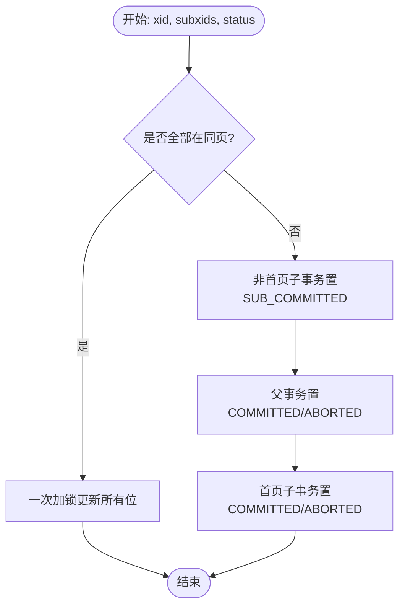
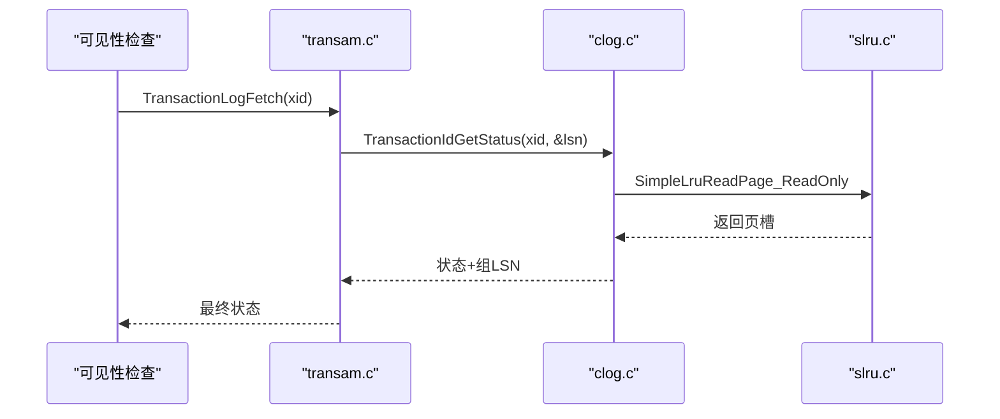
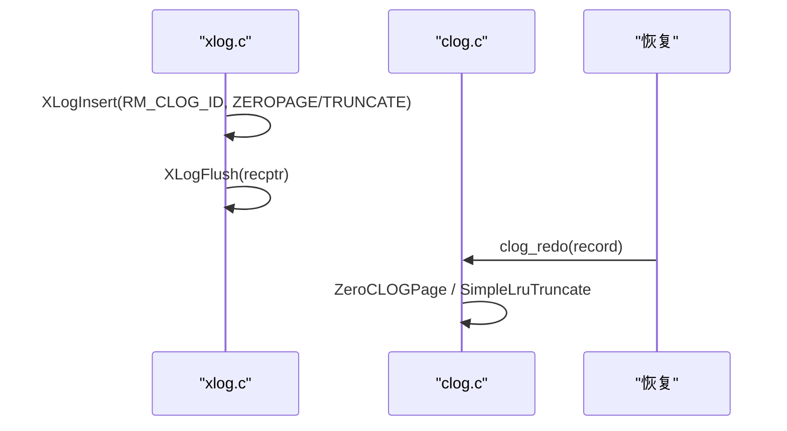
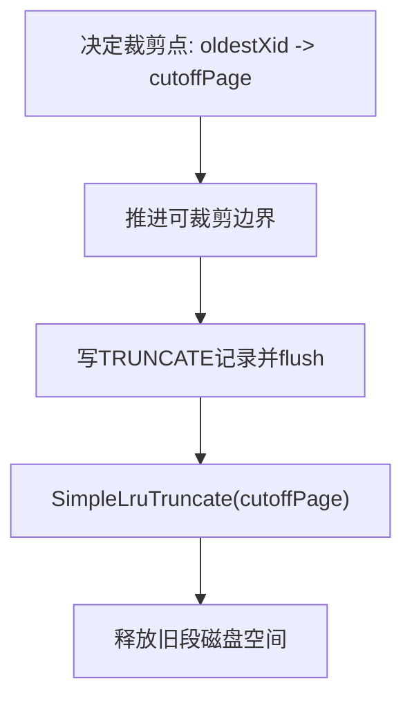
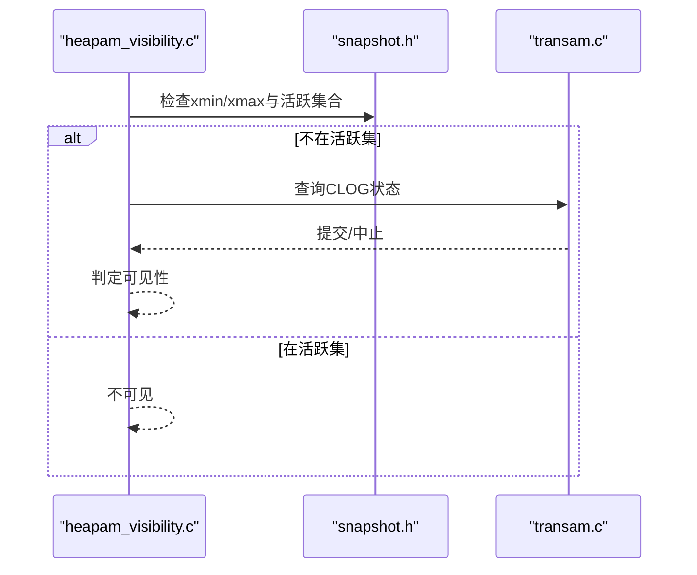
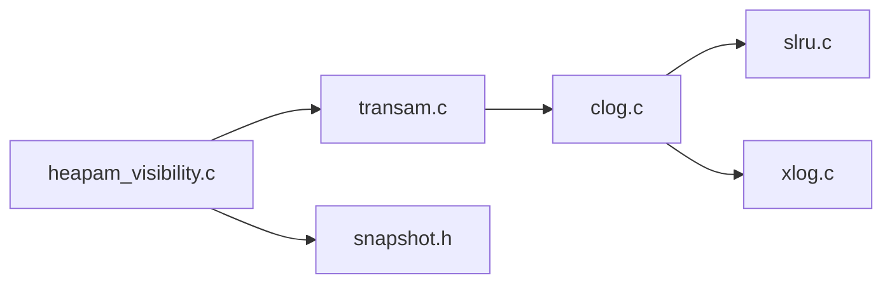

# CLOG提交日志管理

<cite>
**本文引用的文件**
- [clog.h](file://src/include/access/clog.h)
- [clog.c](file://src/backend/access/transam/clog.c)
- [transam.c](file://src/backend/access/transam/transam.c)
- [slru.c](file://src/backend/access/transam/slru.c)
- [xlog.c](file://src/backend/access/transam/xlog.c)
- [heapam_visibility.c](file://src/backend/access/heap/heapam_visibility.c)
- [snapshot.h](file://src/include/utils/snapshot.h)
</cite>

## 目录
1. [简介](#简介)
2. [项目结构](#项目结构)
3. [核心组件](#核心组件)
4. [架构总览](#架构总览)
5. [详细组件分析](#详细组件分析)
6. [依赖关系分析](#依赖关系分析)
7. [性能考虑](#性能考虑)
8. [故障排查指南](#故障排查指南)
9. [结论](#结论)
10. [附录](#附录)

## 简介
本文件面向Mini PostgreSQL中的CLOG（Commit Log，提交日志）子系统，系统性阐述其数据结构、存储格式、事务状态跟踪机制、读写流程、与WAL的协调策略、空间管理与清理、以及性能调优与监控要点。CLOG以位图形式记录每个事务的提交/中止/子提交等状态，配合SLRU缓存与WAL持久化，为MVCC可见性判断提供可靠依据。

## 项目结构
围绕CLOG的关键代码主要分布在以下位置：
- 接口与类型定义：src/include/access/clog.h
- CLOG实现：src/backend/access/transam/clog.c
- 高层事务日志访问接口：src/backend/access/transam/transam.c
- SLRU通用缓存与持久化：src/backend/access/transam/slru.c
- WAL写入与后台刷新：src/backend/access/transam/xlog.c
- MVCC可见性与CLOG交互：src/backend/access/heap/heapam_visibility.c
- 快照结构与可见性边界：src/include/utils/snapshot.h

图表来源
- [clog.c:163-229](file://src/backend/access/transam/clog.c#L163-L229)
- [transam.c:48-94](file://src/backend/access/transam/transam.c#L48-L94)
- [slru.c:186-212](file://src/backend/access/transam/slru.c#L186-L212)
- [xlog.c:2910-3038](file://src/backend/access/transam/xlog.c#L2910-L3038)
- [heapam_visibility.c:23-62](file://src/backend/access/heap/heapam_visibility.c#L23-L62)
- [snapshot.h:146-184](file://src/include/utils/snapshot.h#L146-L184)

章节来源
- [clog.h:18-61](file://src/include/access/clog.h#L18-L61)
- [clog.c:47-110](file://src/backend/access/transam/clog.c#L47-L110)
- [transam.c:27-94](file://src/backend/access/transam/transam.c#L27-L94)
- [slru.c:154-212](file://src/backend/access/transam/slru.c#L154-L212)
- [xlog.c:2910-3038](file://src/backend/access/transam/xlog.c#L2910-L3038)
- [heapam_visibility.c:23-62](file://src/backend/access/heap/heapam_visibility.c#L23-L62)
- [snapshot.h:146-184](file://src/include/utils/snapshot.h#L146-L184)

## 核心组件
- 事务状态枚举与WAL记录类型：定义在clog.h，包含IN_PROGRESS/COMMITTED/ABORTED/SUB_COMMITTED及截断记录结构。
- CLOG页内布局：每页BLCKSZ字节，每事务占2位，每页可容纳固定数量事务；通过宏将XID映射到页号、字节偏移和位索引。
- 共享内存与SLRU：使用SimpleLru维护CLOG页缓存，支持按组LSN追踪异步提交的持久化点。
- 事务树批量更新：支持父事务与其子事务在同一页或多页上的原子性更新，含“子提交”中间态保证并发可见性安全。
- 组更新优化：当锁竞争时，多个进程可将自身加入等待队列，由领导者统一更新同一页的状态，降低锁争用。
- 扩展与裁剪：ExtendCLOG按需创建新页并写零页WAL；TruncateCLOG基于oldestXid删除过期段并写截断WAL。
- 高层API：transam.c提供TransactionLogFetch/DidCommit/DidAbort等接口，封装CLOG查询与子事务回溯。

章节来源
- [clog.h:18-61](file://src/include/access/clog.h#L18-L61)
- [clog.c:59-75](file://src/backend/access/transam/clog.c#L59-L75)
- [clog.c:163-229](file://src/backend/access/transam/clog.c#L163-L229)
- [clog.c:414-563](file://src/backend/access/transam/clog.c#L414-L563)
- [clog.c:840-913](file://src/backend/access/transam/clog.c#L840-L913)
- [transam.c:48-94](file://src/backend/access/transam/transam.c#L48-L94)

## 架构总览
CLOG作为事务状态的位图存储，位于SLRU缓存中，并通过WAL保障崩溃恢复一致性。关键路径如下：
- 写路径：事务提交/中止时，调用TransactionIdSetTreeStatus，内部可能先标记子事务为SUB_COMMITTED，再原子设置父事务为COMMITTED/ABORTED，并更新组LSN。
- 读路径：可见性检查或上层逻辑通过TransactionLogFetch读取状态，必要时递归处理子事务。
- 持久化：CheckPointCLOG刷脏页；异步提交通过组LSN确保WAL至少flush到对应点；截断时写TRUNCATE记录并flush。
- 恢复：clog_redo重放ZEROPAGE/TRUNCATE记录，重建CLOG页与裁剪范围。

图表来源
- [clog.c:163-229](file://src/backend/access/transam/clog.c#L163-L229)
- [clog.c:570-622](file://src/backend/access/transam/clog.c#L570-L622)
- [xlog.c:2910-3038](file://src/backend/access/transam/xlog.c#L2910-L3038)

## 详细组件分析

### 数据结构与存储格式
- 事务状态位：每事务2位，取值IN_PROGRESS=0x00、COMMITTED=0x01、ABORTED=0x02、SUB_COMMITTED=0x03。
- 页级容量：每页BLCKSZ字节，每字节存4个事务位，故每页可记录BLCKSZ*4个事务。
- 寻址：TransactionIdToPage/ToPgIndex/ToByte/ToBIndex将XID映射到页号、页内字节偏移与位索引。
- 组LSN：每页按固定大小分组记录最新影响该组的WAL LSN，用于异步提交的安全点。

图表来源
- [clog.c:59-75](file://src/backend/access/transam/clog.c#L59-L75)

章节来源
- [clog.h:18-31](file://src/include/access/clog.h#L18-L31)
- [clog.c:59-75](file://src/backend/access/transam/clog.c#L59-L75)

### 事务提交状态跟踪（单事务与多事务）
- 单事务：直接调用TransactionIdSetStatusBit更新位字段，并更新组LSN。
- 多事务（事务树）：
  - 若父子与子事务同页：一次锁定更新所有位。
  - 跨页：先将非首页的子事务置为SUB_COMMITTED，再原子设置父事务为COMMITTED，最后将首页子事务也置为COMMITTED，保证并发可见性安全。
- 组更新优化：当无法立即获得独占锁时，进程加入等待队列，由领导者统一更新，减少锁竞争。

图表来源
- [clog.c:163-229](file://src/backend/access/transam/clog.c#L163-L229)
- [clog.c:273-398](file://src/backend/access/transam/clog.c#L273-L398)
- [clog.c:414-563](file://src/backend/access/transam/clog.c#L414-L563)

章节来源
- [clog.c:163-229](file://src/backend/access/transam/clog.c#L163-L229)
- [clog.c:273-398](file://src/backend/access/transam/clog.c#L273-L398)
- [clog.c:414-563](file://src/backend/access/transam/clog.c#L414-L563)

### CLOG读写操作
- 读：TransactionIdGetStatus通过只读方式读取位字段，返回状态与对应的组LSN；transam.c提供TransactionLogFetch进行单次结果缓存。
- 写：TransactionIdSetPageStatusInternal负责落位与dirty标记；组更新路径通过队列合并多次更新。
- 持久化：CheckPointCLOG调用SimpleLruWriteAll刷脏页；异步提交通过group_lsn确保WAL flush到足够点。
- 扩展与裁剪：ExtendCLOG在页面边界创建新页并写零页WAL；TruncateCLOG基于oldestXid删除旧段并写截断WAL。

图表来源
- [transam.c:48-94](file://src/backend/access/transam/transam.c#L48-L94)
- [clog.c:639-663](file://src/backend/access/transam/clog.c#L639-L663)
- [slru.c:186-212](file://src/backend/access/transam/slru.c#L186-L212)

章节来源
- [transam.c:48-94](file://src/backend/access/transam/transam.c#L48-L94)
- [clog.c:639-663](file://src/backend/access/transam/clog.c#L639-L663)
- [clog.c:818-829](file://src/backend/access/transam/clog.c#L818-L829)
- [clog.c:840-913](file://src/backend/access/transam/clog.c#L840-L913)

### 与WAL的协调机制
- 写WAL规则：对CLOG页初始化写ZEROPAGE记录；截断写TRUNCATE记录并flush。
- 异步提交：CLOG页内按组记录group_lsn，确保WAL flush到该LSN后再认为提交已持久化。
- 恢复：clog_redo重放ZEROPAGE/TRUNCATE，重建页与裁剪范围；AdvanceOldestClogXid推进可裁剪边界。

图表来源
- [clog.c:953-981](file://src/backend/access/transam/clog.c#L953-L981)
- [clog.c:987-1021](file://src/backend/access/transam/clog.c#L987-L1021)
- [xlog.c:2910-3038](file://src/backend/access/transam/xlog.c#L2910-L3038)

章节来源
- [clog.c:953-981](file://src/backend/access/transam/clog.c#L953-L981)
- [clog.c:987-1021](file://src/backend/access/transam/clog.c#L987-L1021)
- [xlog.c:2910-3038](file://src/backend/access/transam/xlog.c#L2910-L3038)

### 空间管理与清理策略
- 扩展：ExtendCLOG在页面起始XID处创建新页并写零页WAL，避免越界访问。
- 裁剪：TruncateCLOG根据oldestXid确定截止页，先推进可裁剪边界，再写TRUNCATE记录并flush，最后SimpleLruTruncate删除旧段。
- 启动后修剪：StartupCLOG/TrimCLOG确保当前页未使用部分清零，防止回放残留。

图表来源
- [clog.c:879-913](file://src/backend/access/transam/clog.c#L879-L913)
- [clog.c:755-813](file://src/backend/access/transam/clog.c#L755-L813)

章节来源
- [clog.c:840-913](file://src/backend/access/transam/clog.c#L840-L913)
- [clog.c:755-813](file://src/backend/access/transam/clog.c#L755-L813)

### 与MVCC可见性的协作
- 可见性函数在判断元组可见性时，会先检查是否在活跃事务集中；若非活跃，则查CLOG确认提交/中止状态。
- 快照的xmin/xmax定义了可见窗口，结合CLOG状态决定元组是否可见。

图表来源
- [heapam_visibility.c:23-62](file://src/backend/access/heap/heapam_visibility.c#L23-L62)
- [snapshot.h:146-184](file://src/include/utils/snapshot.h#L146-L184)
- [transam.c:117-200](file://src/backend/access/transam/transam.c#L117-L200)

章节来源
- [heapam_visibility.c:23-62](file://src/backend/access/heap/heapam_visibility.c#L23-L62)
- [snapshot.h:146-184](file://src/include/utils/snapshot.h#L146-L184)
- [transam.c:117-200](file://src/backend/access/transam/transam.c#L117-L200)

## 依赖关系分析
- clog.c依赖slru.c进行页缓存与I/O；依赖xlog.c进行WAL插入与flush。
- transam.c作为高层接口，封装CLOG查询与子事务回溯。
- heapam_visibility.c在可见性判断中调用transam.c/CLOG。
- snapshot.h提供可见性边界信息，指导何时需要查CLOG。

图表来源
- [clog.c:33-45](file://src/backend/access/transam/clog.c#L33-L45)
- [transam.c:20-25](file://src/backend/access/transam/transam.c#L20-L25)
- [heapam_visibility.c:23-62](file://src/backend/access/heap/heapam_visibility.c#L23-L62)
- [snapshot.h:146-184](file://src/include/utils/snapshot.h#L146-L184)

章节来源
- [clog.c:33-45](file://src/backend/access/transam/clog.c#L33-L45)
- [transam.c:20-25](file://src/backend/access/transam/transam.c#L20-L25)
- [heapam_visibility.c:23-62](file://src/backend/access/heap/heapam_visibility.c#L23-L62)
- [snapshot.h:146-184](file://src/include/utils/snapshot.h#L146-L184)

## 性能考虑
- 缓存策略：
  - CLOG共享缓冲数量按NBuffers动态调整，上限128，平衡内存与性能。
  - 使用只读路径SimpleLruReadPage_ReadOnly减少锁持有时间。
- I/O优化：
  - 组更新机制合并同一页的多次更新，降低XactSLRULock争用。
  - 异步提交通过group_lsn精确控制WAL flush点，避免过度fsync。
  - CheckPointCLOG批量刷脏页，减少频繁同步。
- 监控指标：
  - 关注CLOG检查点开始/结束探针（TRACE_POSTGRESQL_CLOG_CHECKPOINT_*）。
  - 观察SLRU截断计数与I/O错误上报，评估裁剪与持久化压力。
  - 监控事务提交延迟与组更新等待事件（WAIT_EVENT_XACT_GROUP_UPDATE）。

[本节为通用性能建议，不直接分析具体文件]

## 故障排查指南
- 常见问题定位：
  - 提交未持久化：检查异步提交group_lsn与WAL flush是否匹配；确认CheckPointCLOG是否正常执行。
  - 可见性异常：核对快照xmin/xmax与活跃事务集；确认CLOG状态与子事务父链一致。
  - 空间不足或裁剪失败：检查TruncateCLOG是否成功写TRUNCATE记录并flush；确认AdvanceOldestClogXid推进正确。
- 诊断步骤：
  - 查看CLOG相关WAL记录（ZEROPAGE/TRUNCATE）是否生成与重放。
  - 检查SLRU错误上报与I/O错误原因（打开/读取/写入/fsync/关闭失败）。
  - 验证组更新队列是否堆积，是否存在长时间持有XactSLRULock的情况。

章节来源
- [slru.c:122-148](file://src/backend/access/transam/slru.c#L122-L148)
- [clog.c:818-829](file://src/backend/access/transam/clog.c#L818-L829)
- [clog.c:879-913](file://src/backend/access/transam/clog.c#L879-L913)

## 结论
CLOG通过紧凑的位图存储、高效的SLRU缓存与严格的WAL协调，为事务提交状态提供了高吞吐、低延迟且可靠的底层支撑。其事务树批量更新与组更新优化显著降低了锁竞争，而扩展与裁剪机制保障了长期运行的空间效率。结合MVCC可见性判断，CLOG成为PostgreSQL并发控制的核心基石之一。

## 附录
- 术语
  - CLOG：提交日志，记录事务提交/中止/子提交状态。
  - SLRU：简单LRU缓存，用于CLOG页的内存管理与持久化。
  - WAL：预写日志，保证崩溃恢复的一致性。
  - MVCC：多版本并发控制，基于快照与CLOG实现可见性。

[本节为概念性说明，不直接分析具体文件]