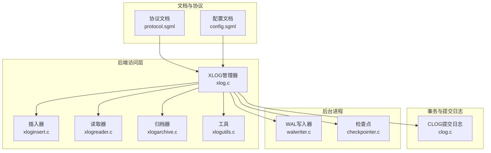
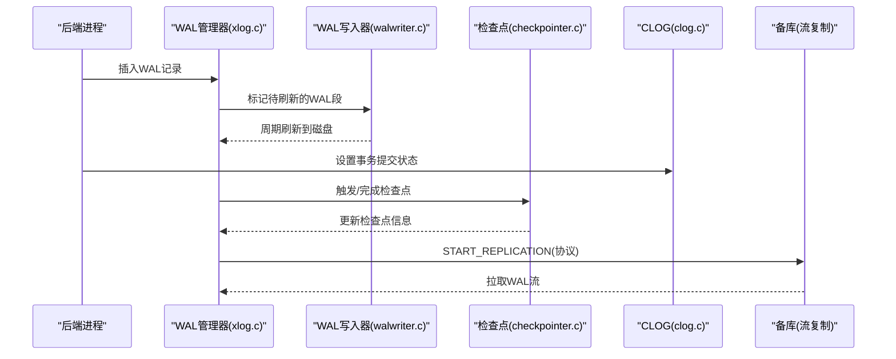
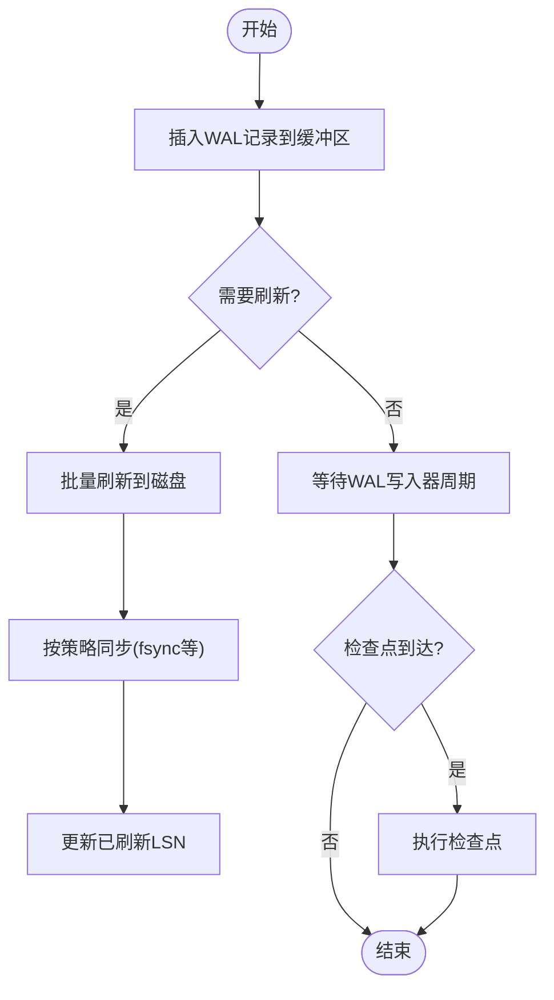
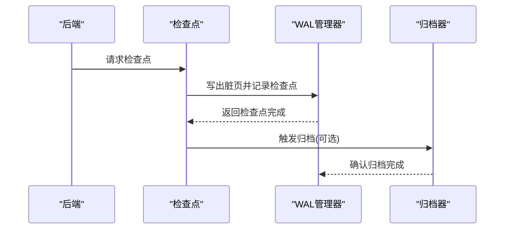
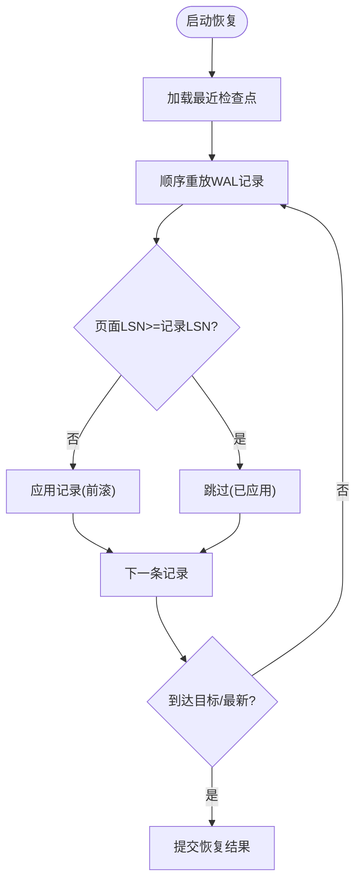
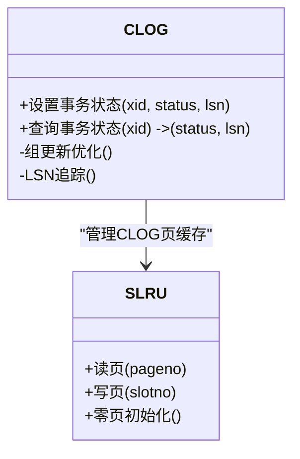
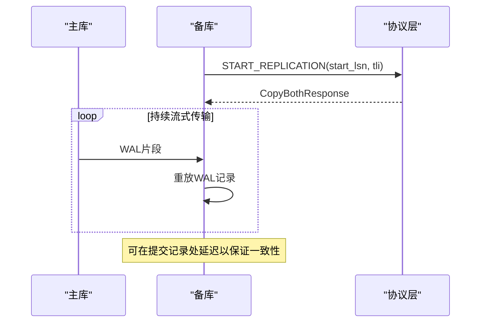
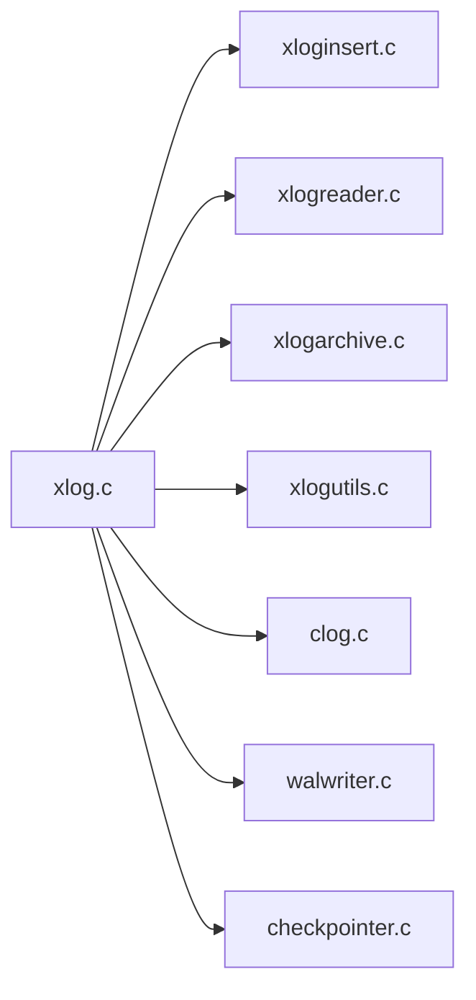

# WAL日志与恢复

<cite>
**本文引用的文件**
- [xlog.c](file://src/backend/access/transam/xlog.c)
- [clog.c](file://src/backend/access/transam/clog.c)
- [walwriter.c](file://src/backend/postmaster/walwriter.c)
- [checkpointer.c](file://src/backend/postmaster/checkpointer.c)
- [README（transam）](file://src/backend/access/transam/README)
- [protocol.sgml](file://doc/src/sgml/protocol.sgml)
- [config.sgml](file://doc/src/sgml/config.sgml)
</cite>

## 目录
1. [简介](#简介)
2. [项目结构](#项目结构)
3. [核心组件](#核心组件)
4. [架构总览](#架构总览)
5. [详细组件分析](#详细组件分析)
6. [依赖关系分析](#依赖关系分析)
7. [性能考虑](#性能考虑)
8. [故障排查指南](#故障排查指南)
9. [结论](#结论)
10. [附录](#附录)

## 简介
本文件面向Mini PostgreSQL的WAL（预写式日志）子系统与崩溃恢复机制，系统性说明WAL记录格式、写入流程、检查点机制、日志轮转与归档策略；深入阐述崩溃恢复的前滚与回滚过程及一致性检查；文档化CLOG（提交日志）的事务状态跟踪与内存映射文件操作；并解释流复制中的WAL传输机制与数据一致性保证。文末提供架构图、恢复流程图与性能优化建议，帮助读者全面理解并可靠地运维该系统。

## 项目结构
围绕WAL与恢复的关键代码主要分布在以下模块：
- 事务与WAL核心：access/transam 下的 xlog.c、xloginsert.c、xlogreader.c、xlogarchive.c、generic_xlog.c、xlogutils.c
- CLOG提交日志：access/transam/clog.c
- 后台进程：postmaster/walwriter.c（WAL写入）、postmaster/checkpointer.c（检查点）
- 文档与协议：doc/src/sgml/protocol.sgml（START_REPLICATION等）、doc/src/sgml/config.sgml（复制相关配置）
- 通用说明：access/transam/README（WAL重放与全页写策略）

**图示来源**
- [xlog.c:1-200](file://src/backend/access/transam/xlog.c#L1-L200)
- [clog.c:1-120](file://src/backend/access/transam/clog.c#L1-L120)
- [walwriter.c:1-120](file://src/backend/postmaster/walwriter.c#L1-L120)
- [checkpointer.c:1-120](file://src/backend/postmaster/checkpointer.c#L1-L120)
- [protocol.sgml:1834-1856](file://doc/src/sgml/protocol.sgml#L1834-L1856)
- [config.sgml:3932-4233](file://doc/src/sgml/config.sgml#L3932-L4233)

**章节来源**
- [xlog.c:1-200](file://src/backend/access/transam/xlog.c#L1-L200)
- [clog.c:1-120](file://src/backend/access/transam/clog.c#L1-L120)
- [walwriter.c:1-120](file://src/backend/postmaster/walwriter.c#L1-L120)
- [checkpointer.c:1-120](file://src/backend/postmaster/checkpointer.c#L1-L120)
- [protocol.sgml:1834-1856](file://doc/src/sgml/protocol.sgml#L1834-L1856)
- [config.sgml:3932-4233](file://doc/src/sgml/config.sgml#L3932-L4233)

## 核心组件
- WAL管理器（xlog.c）：负责WAL记录生成、写入、刷新、时间线管理、检查点与重启点、恢复控制、最小恢复点更新等。
- CLOG（clog.c）：以SLRU方式维护事务提交/中止状态位，支持组更新优化与异步提交的LSN追踪，确保“先写WAL后写数据”的一致性约束。
- WAL写入器（walwriter.c）：后台进程周期性将WAL缓冲区刷盘，保障异步提交在可预期时间内持久化。
- 检查点（checkpointer.c）：集中执行检查点，协调脏页写出与WAL对齐，降低恢复成本。
- 文档与协议：START_REPLICATION与复制延迟参数定义，支撑主从流复制与一致性保证。

**章节来源**
- [xlog.c:1-200](file://src/backend/access/transam/xlog.c#L1-L200)
- [clog.c:1-120](file://src/backend/access/transam/clog.c#L1-L120)
- [walwriter.c:1-120](file://src/backend/postmaster/walwriter.c#L1-L120)
- [checkpointer.c:1-120](file://src/backend/postmaster/checkpointer.c#L1-L120)

## 架构总览
下图展示了WAL写入、检查点、CLOG与恢复之间的交互关系，以及流复制中主从WAL传输的基本路径。

**图示来源**
- [xlog.c:1-200](file://src/backend/access/transam/xlog.c#L1-L200)
- [walwriter.c:1-120](file://src/backend/postmaster/walwriter.c#L1-L120)
- [checkpointer.c:1-120](file://src/backend/postmaster/checkpointer.c#L1-L120)
- [clog.c:1-120](file://src/backend/access/transam/clog.c#L1-L120)
- [protocol.sgml:1834-1856](file://doc/src/sgml/protocol.sgml#L1834-L1856)

## 详细组件分析

### WAL记录格式与写入流程
- 记录类型与定位：WAL记录包含记录头、数据体与校验信息；通过LSN唯一标识位置，支持顺序追加与随机回放。
- 插入与缓冲：后端调用插入接口将记录写入共享WAL缓冲区，必要时申请新段；WAL写入器定期将缓冲区内容落盘。
- 刷新与同步：根据配置选择fsync/fdatasync等方式确保持久化；异步提交时通过CLOG组LSN追踪确保WAL至少写到对应位置。
- 全页写策略：首次影响某页的记录携带整页副本，提高重放可靠性；后续增量更新仅记录差异。

**图示来源**
- [xlog.c:1-200](file://src/backend/access/transam/xlog.c#L1-L200)
- [walwriter.c:1-120](file://src/backend/postmaster/walwriter.c#L1-L120)

**章节来源**
- [xlog.c:1-200](file://src/backend/access/transam/xlog.c#L1-L200)
- [walwriter.c:1-120](file://src/backend/postmaster/walwriter.c#L1-L120)
- [README（transam）:420-440](file://src/backend/access/transam/README#L420-L440)

### 检查点机制、日志轮转与归档
- 检查点：检查点进程集中写出脏页并写入检查点记录，记录当前WAL位置与时间线，便于快速恢复。
- 重启点：恢复过程中建立重启点，减少重放范围。
- 日志轮转：当WAL达到阈值或检查点完成后进行分段切换；可配置最大/最小WAL大小。
- 归档：归档器将历史WAL段复制到安全存储，支持时间点恢复与备份链构建。

**图示来源**
- [checkpointer.c:1-200](file://src/backend/postmaster/checkpointer.c#L1-L200)
- [xlog.c:1-200](file://src/backend/access/transam/xlog.c#L1-L200)

**章节来源**
- [checkpointer.c:1-200](file://src/backend/postmaster/checkpointer.c#L1-L200)
- [xlog.c:1-200](file://src/backend/access/transam/xlog.c#L1-L200)

### 崩溃恢复：前滚、回滚与一致性检查
- 前滚（Redo）：从最近检查点开始，重放WAL记录将数据库推进到一致状态；对每个页面变更依据记录LSN判断是否已应用。
- 回滚（Undo）：对于未提交事务，利用子事务与CLOG状态进行撤销，确保原子性。
- 一致性检查：重放过程中校验记录CRC、时间线合法性、页面LSN等，防止不一致数据落地。

**图示来源**
- [xlog.c:2817-2842](file://src/backend/access/transam/xlog.c#L2817-L2842)
- [xlog.c:9371-9391](file://src/backend/access/transam/xlog.c#L9371-L9391)
- [xlog.c:9960-9991](file://src/backend/access/transam/xlog.c#L9960-L9991)
- [README（transam）:420-440](file://src/backend/access/transam/README#L420-L440)

**章节来源**
- [xlog.c:2817-2842](file://src/backend/access/transam/xlog.c#L2817-L2842)
- [xlog.c:9371-9391](file://src/backend/access/transam/xlog.c#L9371-L9391)
- [xlog.c:9960-9991](file://src/backend/access/transam/xlog.c#L9960-L9991)
- [README（transam）:420-440](file://src/backend/access/transam/README#L420-L440)

### CLOG（提交日志）管理机制
- 数据结构：每页固定数量事务条目，每项2位表示状态（进行中/已提交/已中止/子提交），按页号与偏移计算具体位置。
- 组更新优化：高并发提交时将同一页上的多个事务合并更新，减少锁竞争与I/O。
- 异步提交LSN追踪：为每组事务维护最新LSN，确保在异步提交场景下WAL至少写到该LSN，满足“先写WAL后写数据”。
- 内存映射与SLRU：使用SimpleLru管理CLOG页缓存，支持零页初始化、截断与清理。

**图示来源**
- [clog.c:112-163](file://src/backend/access/transam/clog.c#L112-L163)
- [clog.c:273-332](file://src/backend/access/transam/clog.c#L273-L332)
- [clog.c:414-563](file://src/backend/access/transam/clog.c#L414-L563)
- [clog.c:570-622](file://src/backend/access/transam/clog.c#L570-L622)
- [clog.c:687-704](file://src/backend/access/transam/clog.c#L687-L704)

**章节来源**
- [clog.c:112-163](file://src/backend/access/transam/clog.c#L112-L163)
- [clog.c:273-332](file://src/backend/access/transam/clog.c#L273-L332)
- [clog.c:414-563](file://src/backend/access/transam/clog.c#L414-L563)
- [clog.c:570-622](file://src/backend/access/transam/clog.c#L570-L622)
- [clog.c:687-704](file://src/backend/access/transam/clog.c#L687-L704)

### 流复制中的WAL传输机制与一致性保证
- 主库发送：备库通过START_REPLICATION协议指定起始位置与时间线，主库以CopyBothResponse响应并开始推送WAL流。
- 备库接收与重放：备库持续接收WAL片段并立即重放，保持与主库的数据一致；可通过配置在提交记录处引入延迟以满足合规要求。
- 一致性保证：基于WAL的顺序性与检查点/重启点，结合时间线校验与记录CRC，确保跨节点数据一致。

**图示来源**
- [protocol.sgml:1834-1856](file://doc/src/sgml/protocol.sgml#L1834-L1856)
- [config.sgml:4211-4233](file://doc/src/sgml/config.sgml#L4211-L4233)

**章节来源**
- [protocol.sgml:1834-1856](file://doc/src/sgml/protocol.sgml#L1834-L1856)
- [config.sgml:4211-4233](file://doc/src/sgml/config.sgml#L4211-L4233)

## 依赖关系分析
- 松耦合设计：WAL管理器与CLOG通过明确接口交互；后台进程通过信号与共享内存协作。
- 关键依赖：
  - xlog.c 依赖 xloginsert.c、xlogreader.c、xlogarchive.c、xlogutils.c
  - clog.c 依赖 SimpleLru与WAL刷新机制
  - walwriter.c 与 checkpointer.c 通过WAL管理器协调I/O与检查点
  - 流复制依赖协议文档定义的START_REPLICATION消息

**图示来源**
- [xlog.c:1-200](file://src/backend/access/transam/xlog.c#L1-L200)
- [clog.c:1-120](file://src/backend/access/transam/clog.c#L1-L120)
- [walwriter.c:1-120](file://src/backend/postmaster/walwriter.c#L1-L120)
- [checkpointer.c:1-120](file://src/backend/postmaster/checkpointer.c#L1-L120)

**章节来源**
- [xlog.c:1-200](file://src/backend/access/transam/xlog.c#L1-L200)
- [clog.c:1-120](file://src/backend/access/transam/clog.c#L1-L120)
- [walwriter.c:1-120](file://src/backend/postmaster/walwriter.c#L1-L120)
- [checkpointer.c:1-120](file://src/backend/postmaster/checkpointer.c#L1-L120)

## 性能考虑
- WAL写入器调优：合理设置WalWriterDelay与WalWriterFlushAfter，平衡异步提交延迟与CPU开销。
- 检查点间隔：调整CheckPointSegments与CheckPointCompletionTarget，避免频繁检查点导致抖动。
- 全页写开关：fullPageWrites开启提升重放可靠性，但增加WAL体积；可根据硬件可靠性权衡。
- 压缩与校验：启用wal_compression可降低网络与归档带宽；track_wal_io_timing用于IO瓶颈定位。
- 复制延迟：在主从部署中，通过提交延迟参数控制一致性窗口，注意时钟同步影响。

[本节为通用指导，不直接分析具体文件]

## 故障排查指南
- WAL写入失败：检查walwriter进程健康与系统fsync能力；关注错误日志与重试逻辑。
- 检查点卡顿：观察脏页压力与I/O吞吐；必要时调整检查点目标与后台写入频率。
- 恢复异常：核对时间线历史与期望TLI列表；检查记录CRC与页面LSN一致性。
- 流复制中断：确认START_REPLICATION起始位置有效且未被回收；检查网络与归档可用性。

**章节来源**
- [walwriter.c:120-200](file://src/backend/postmaster/walwriter.c#L120-L200)
- [checkpointer.c:120-200](file://src/backend/postmaster/checkpointer.c#L120-L200)
- [xlog.c:9960-9991](file://src/backend/access/transam/xlog.c#L9960-L9991)
- [protocol.sgml:1834-1856](file://doc/src/sgml/protocol.sgml#L1834-L1856)

## 结论
Mini PostgreSQL的WAL与恢复机制通过严格的“先写WAL后写数据”原则、检查点与重启点、CLOG提交状态管理与流复制协议，提供了高可靠的数据持久化与一致性保障。合理的参数调优与监控有助于在高并发与大规模部署中维持稳定性能与低延迟。

[本节为总结性内容，不直接分析具体文件]

## 附录
- 术语
  - LSN：WAL记录序列号，唯一标识记录位置
  - TLI：时间线ID，用于区分分支与恢复路径
  - CLOG：提交日志，记录事务最终状态
  - 检查点：将内存状态与WAL对齐的快照点
  - 重启点：恢复过程中建立的轻量级检查点
- 参考
  - 协议与配置文档定义了流复制与复制延迟行为
  - transam README说明了全页写与重放策略

[本节为补充信息，不直接分析具体文件]