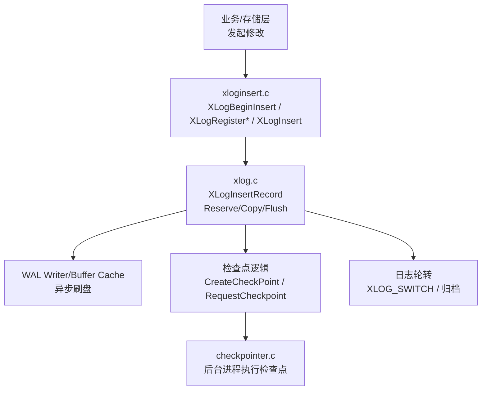
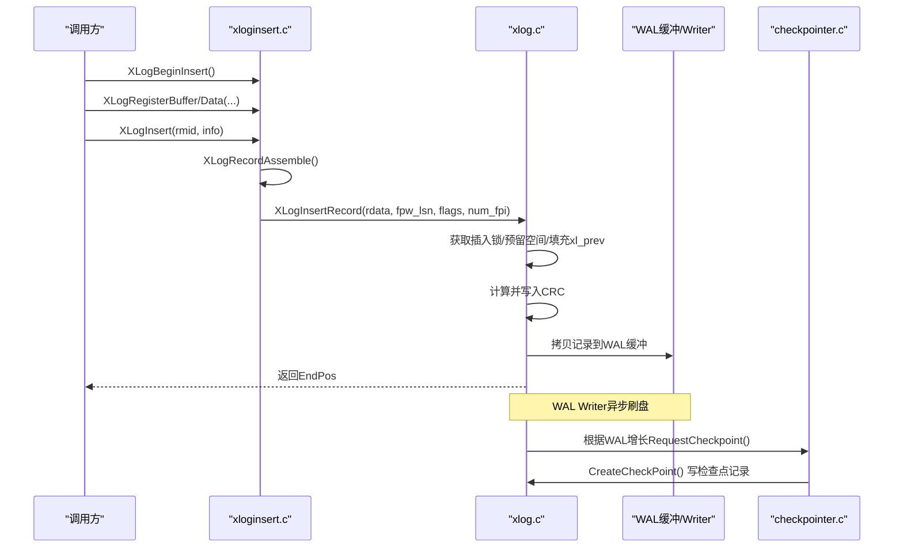
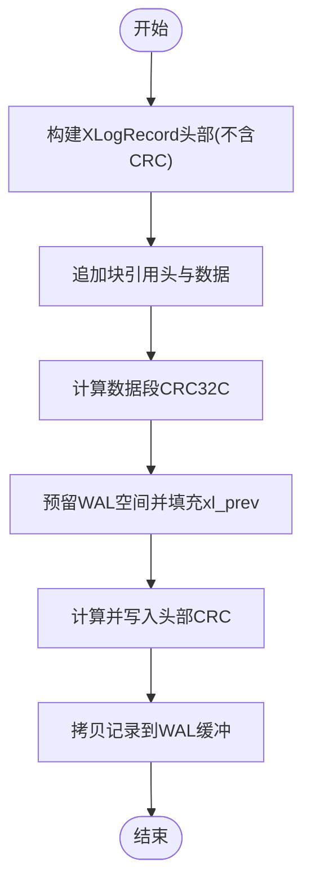
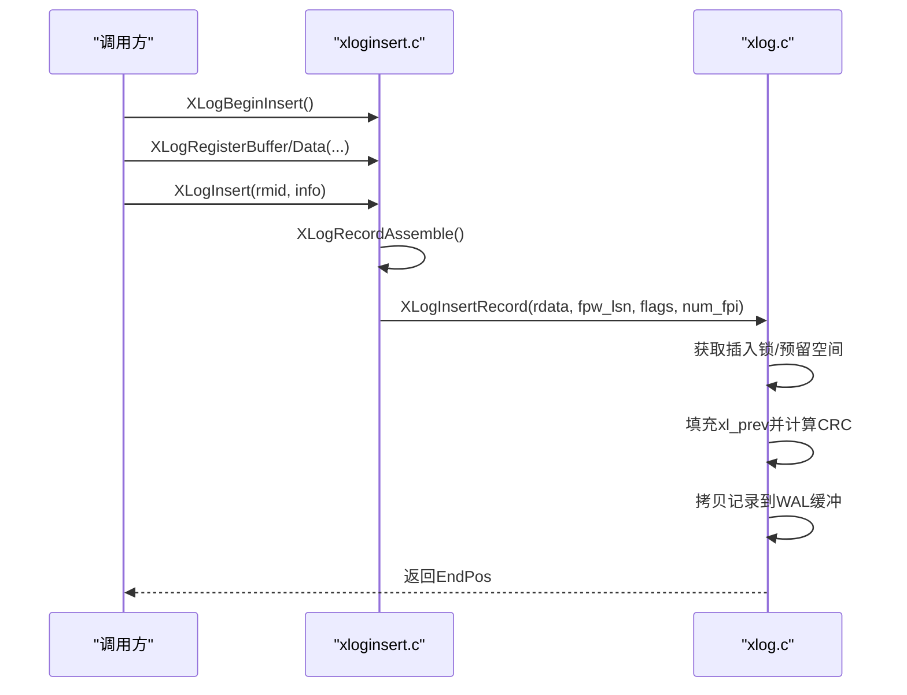
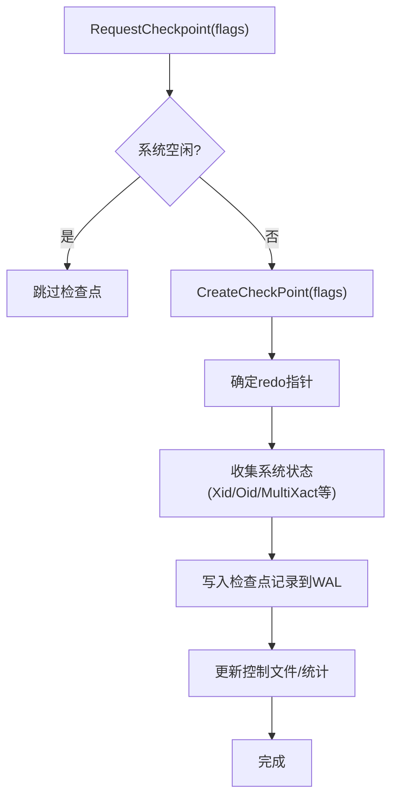
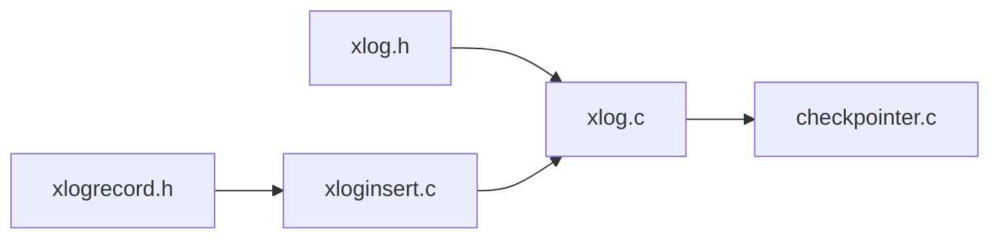

# WAL日志写入机制

<cite>
**本文引用的文件**
- [xlogrecord.h](file://src/include/access/xlogrecord.h)
- [xloginsert.c](file://src/backend/access/transam/xloginsert.c)
- [xlog.c](file://src/backend/access/transam/xlog.c)
- [xlog.h](file://src/include/access/xlog.h)
- [checkpointer.c](file://src/backend/postmaster/checkpointer.c)
</cite>

## 目录
1. [简介](#简介)
2. [项目结构](#项目结构)
3. [核心组件](#核心组件)
4. [架构总览](#架构总览)
5. [详细组件分析](#详细组件分析)
6. [依赖关系分析](#依赖关系分析)
7. [性能考虑](#性能考虑)
8. [故障排查指南](#故障排查指南)
9. [结论](#结论)
10. [附录](#附录)

## 简介
本文件面向Mini PostgreSQL的WAL（预写式日志）写入机制，系统性阐述WAL记录格式与校验、插入流程、检查点机制、日志轮转与归档策略，以及性能优化技巧。文档以源码为依据，提供代码级流程图与时序图，帮助开发者理解从调用XLogBeginInsert到最终落盘的完整路径，并给出调试与排障建议。

## 项目结构
围绕WAL写入的核心代码主要分布在以下位置：
- 记录格式定义：include/access/xlogrecord.h
- 记录组装与注册：backend/access/transam/xloginsert.c
- 插入、落盘、检查点、轮转：backend/access/transam/xlog.c
- 检查点触发与统计：postmaster/checkpointer.c
- 检查点标志位与接口声明：include/access/xlog.h

**图示来源**
- [xloginsert.c:122-476](file://src/backend/access/transam/xloginsert.c#L122-L476)
- [xlog.c:1004-1200](file://src/backend/access/transam/xlog.c#L1004-L1200)
- [checkpointer.c:182-200](file://src/backend/postmaster/checkpointer.c#L182-L200)

**章节来源**
- [xlogrecord.h:21-55](file://src/include/access/xlogrecord.h#L21-L55)
- [xloginsert.c:122-476](file://src/backend/access/transam/xloginsert.c#L122-L476)
- [xlog.c:1004-1200](file://src/backend/access/transam/xlog.c#L1004-L1200)
- [checkpointer.c:182-200](file://src/backend/postmaster/checkpointer.c#L182-L200)

## 核心组件
- WAL记录格式与校验
  - 固定头部：XLogRecord（包含长度、事务ID、前驱指针、信息位、资源管理器ID、CRC）
  - 块引用头：XLogRecordBlockHeader（标识fork、数据长度、是否含页镜像等）
  - 页镜像头：XLogRecordBlockImageHeader（长度、hole偏移、压缩标志）
  - 主数据头：短/长两种形式（按长度选择）
  - 校验和：对记录数据段计算CRC32C，并在预留空间后回填头部CRC
- 记录组装与插入
  - XLogBeginInsert/XLogResetInsertion：生命周期管理
  - XLogRegisterBuffer/XLogRegisterBlock/XLogRegisterData：注册块与数据
  - XLogRecordAssemble：拼装记录链、决定是否需要全页镜像、计算数据CRC
  - XLogInsert：协调组装与落盘
- 插入与持久化
  - XLogInsertRecord：获取插入锁、预留空间、填充xl_prev、计算并写入CRC、拷贝记录到WAL缓冲、更新重要LSN、必要时跨页刷新请求
- 检查点
  - CreateCheckPoint：计算redo指针、收集系统状态、写检查点记录、更新控制文件
  - RequestCheckpoint：由WAL消耗或时间触发，通知后台检查点进程
- 日志轮转与归档
  - XLOG_SWITCH：切换WAL段，flush并通知归档器
  - 基于max_wal_size/min_wal_size与CheckPointSegments的策略

**章节来源**
- [xlogrecord.h:21-228](file://src/include/access/xlogrecord.h#L21-L228)
- [xloginsert.c:122-476](file://src/backend/access/transam/xloginsert.c#L122-L476)
- [xlog.c:1004-1200](file://src/backend/access/transam/xlog.c#L1004-L1200)
- [xlog.c:8788-9000](file://src/backend/access/transam/xlog.c#L8788-L9000)
- [xlog.h:206-258](file://src/include/access/xlog.h#L206-L258)

## 架构总览
WAL写入的关键路径如下：
- 调用方通过XLogBeginInsert开始构造记录，使用XLogRegister*系列注册需要持久化的块和数据
- XLogInsert调用XLogRecordAssemble组装记录链，再调用XLogInsertRecord完成插入
- XLogInsertRecord负责并发安全的空间预留、CRC计算、拷贝到WAL缓冲，并更新全局写入进度
- 后台WAL Writer周期性将缓冲中的记录刷入磁盘；检查点进程在WAL增长达到阈值或定时时创建检查点
- 当需要切换WAL段时，插入XLOG_SWITCH记录并flush，随后触发归档

**图示来源**
- [xloginsert.c:122-476](file://src/backend/access/transam/xloginsert.c#L122-L476)
- [xlog.c:1004-1200](file://src/backend/access/transam/xlog.c#L1004-L1200)
- [checkpointer.c:182-200](file://src/backend/postmaster/checkpointer.c#L182-L200)

## 详细组件分析

### WAL记录格式与校验
- 记录布局
  - 固定头部XLogRecord：包含总长度、事务ID、前驱指针、信息位、资源管理器ID、CRC
  - 零个或多个块引用头XLogRecordBlockHeader：描述被修改块的fork、数据长度、是否包含页镜像等
  - 可选页镜像头XLogRecordBlockImageHeader：描述页镜像长度、hole偏移、压缩标志
  - 主数据区：短/长两种头部，承载非块关联的数据
- 校验机制
  - 先对“数据部分”计算CRC32C，预留空间后再计算并写入头部CRC，保证整条记录的完整性
  - 支持full-page image（FPI）与PGLZ压缩以减少WAL体积

**图示来源**
- [xlogrecord.h:21-228](file://src/include/access/xlogrecord.h#L21-L228)
- [xloginsert.c:490-809](file://src/backend/access/transam/xloginsert.c#L490-L809)
- [xlog.c:1116-1130](file://src/backend/access/transam/xlog.c#L1116-L1130)

**章节来源**
- [xlogrecord.h:21-228](file://src/include/access/xlogrecord.h#L21-L228)
- [xloginsert.c:490-809](file://src/backend/access/transam/xloginsert.c#L490-L809)
- [xlog.c:1116-1130](file://src/backend/access/transam/xlog.c#L1116-L1130)

### 日志插入流程（XLogInsert调用链）
- 关键步骤
  - XLogBeginInsert：初始化插入上下文，校验恢复期禁止插入
  - XLogRegisterBuffer/XLogRegisterBlock/XLogRegisterData：注册块与数据
  - XLogInsert：组装记录并调用XLogInsertRecord
  - XLogRecordAssemble：决定是否记录全页镜像、拼接rdata链、计算数据CRC
  - XLogInsertRecord：获取插入锁、预留空间、填充xl_prev、计算并写入CRC、拷贝记录、更新重要LSN、必要时跨页刷新
- 错误处理
  - 恢复期不允许插入
  - 参数非法（info掩码）会触发严重错误
  - 若需全页镜像但条件变化，回退重试

**图示来源**
- [xloginsert.c:122-476](file://src/backend/access/transam/xloginsert.c#L122-L476)
- [xlog.c:1004-1200](file://src/backend/access/transam/xlog.c#L1004-L1200)

**章节来源**
- [xloginsert.c:122-476](file://src/backend/access/transam/xloginsert.c#L122-L476)
- [xlog.c:1004-1200](file://src/backend/access/transam/xlog.c#L1004-L1200)

### 缓冲区管理与持久化策略
- 插入锁与并发
  - 使用固定数量的插入锁提升并发度，同时避免竞争热点
- 空间预留与拷贝
  - 预留WAL空间后，多进程可并行拷贝记录到各自分配的区间
- 刷盘时机
  - 跨页边界时更新全局写入请求，促使WAL Writer刷盘
  - 重要记录会更新lastImportantAt，辅助判断何时需要fsync
- 全页镜像策略
  - 根据RedoRecPtr与页面LSN判断是否需要备份整页
  - 支持PGLZ压缩与hole剔除以降低WAL体积

**章节来源**
- [xlog.c:1004-1200](file://src/backend/access/transam/xlog.c#L1004-L1200)
- [xloginsert.c:547-700](file://src/backend/access/transam/xloginsert.c#L547-L700)

### 检查点机制
- 检查点类型与标志
  - 关闭检查点：CHECKPOINT_IS_SHUTDOWN
  - 恢复结束检查点：CHECKPOINT_END_OF_RECOVERY
  - 立即检查点：CHECKPOINT_IMMEDIATE
  - 强制检查点：CHECKPOINT_FORCE
  - 刷出所有页：CHECKPOINT_FLUSH_ALL
  - 等待完成：CHECKPOINT_WAIT
  - 已请求标记：CHECKPOINT_REQUESTED
  - 触发原因：CHECKPOINT_CAUSE_XLOG（WAL消耗）、CHECKPOINT_CAUSE_TIME（超时）
- 触发条件
  - WAL增长超过阈值（max_wal_size/CheckPointSegments）
  - 定时器到期（CheckPointTimeout）
  - 显式请求（如DDL、备份等场景）
- 执行流程
  - CreateCheckPoint：计算redo指针、收集系统快照、写检查点记录、更新控制文件、统计指标

**图示来源**
- [xlog.h:206-258](file://src/include/access/xlog.h#L206-L258)
- [xlog.c:8788-9000](file://src/backend/access/transam/xlog.c#L8788-L9000)
- [checkpointer.c:182-200](file://src/backend/postmaster/checkpointer.c#L182-L200)

**章节来源**
- [xlog.h:206-258](file://src/include/access/xlog.h#L206-L258)
- [xlog.c:8788-9000](file://src/backend/access/transam/xlog.c#L8788-L9000)
- [checkpointer.c:182-200](file://src/backend/postmaster/checkpointer.c#L182-L200)

### 日志轮转与归档策略
- 日志切换
  - 插入XLOG_SWITCH记录，flush当前段并执行段尾动作（通知归档）
- 空间管理
  - 依据max_wal_size与min_wal_size进行预留与回收
  - 检查点完成后清理过期WAL段
- 归档
  - 段切换后触发归档流程，确保WAL可被外部消费

**章节来源**
- [xlog.c:1176-1200](file://src/backend/access/transam/xlog.c#L1176-L1200)
- [xlog.c:86-100](file://src/backend/access/transam/xlog.c#L86-L100)

### 性能优化技巧
- 批量写入
  - log_newpages/log_newpage_range：将多个页打包为单个WAL记录，减少记录头开销
- 异步提交
  - WAL Writer异步刷盘，降低前端阻塞
- 预分配与复用
  - 插入锁与WAL缓冲预分配，减少临界区分配
- 压缩与hole剔除
  - wal_compression开启时尝试PGLZ压缩；标准页跳过hole区域
- 全页镜像优化
  - 仅在必要时记录FPI，结合RedoRecPtr与页面LSN决策

**章节来源**
- [xloginsert.c:1018-1186](file://src/backend/access/transam/xloginsert.c#L1018-L1186)
- [xlog.c:86-100](file://src/backend/access/transam/xlog.c#L86-L100)
- [xloginsert.c:628-699](file://src/backend/access/transam/xloginsert.c#L628-L699)

## 依赖关系分析
- xloginsert.c依赖xlogrecord.h定义的记录结构与常量
- xlog.c实现插入、检查点、轮转等核心逻辑，依赖xlog.h的接口与标志
- checkpointer.c作为后台进程响应RequestCheckpoint并执行CreateCheckPoint
- 各模块通过共享内存与锁机制协作，保证并发安全与一致性

**图示来源**
- [xlogrecord.h:21-228](file://src/include/access/xlogrecord.h#L21-L228)
- [xloginsert.c:122-476](file://src/backend/access/transam/xloginsert.c#L122-L476)
- [xlog.c:1004-1200](file://src/backend/access/transam/xlog.c#L1004-L1200)
- [checkpointer.c:182-200](file://src/backend/postmaster/checkpointer.c#L182-L200)

**章节来源**
- [xlogrecord.h:21-228](file://src/include/access/xlogrecord.h#L21-L228)
- [xloginsert.c:122-476](file://src/backend/access/transam/xloginsert.c#L122-L476)
- [xlog.c:1004-1200](file://src/backend/access/transam/xlog.c#L1004-L1200)
- [checkpointer.c:182-200](file://src/backend/postmaster/checkpointer.c#L182-L200)

## 性能考虑
- 合理设置wal_compression与fullPageWrites，平衡CPU与I/O
- 调整max_wal_size与min_wal_size，避免频繁轮转
- 利用批量写入接口减少记录数量
- 监控检查点耗时与WAL增长，适时调优CheckPointTimeout与CompletionTarget

[本节为通用指导，不直接分析具体文件]

## 故障排查指南
- 常见错误
  - 恢复期插入：检查InRecovery与XLogInsertAllowed
  - 非法info掩码：确认调用方未设置保留位
  - 全页镜像条件变化：XLogInsertRecord可能返回InvalidXLogRecPtr要求重算
- 调试方法
  - 启用WAL相关GUC（如wal_log_hints、track_wal_io_timing）
  - 使用pg_waldump解析WAL记录，验证结构与内容
  - 观察检查点日志与统计（log_checkpoints、CheckpointStats）

**章节来源**
- [xlog.c:1023-1026](file://src/backend/access/transam/xlog.c#L1023-L1026)
- [xloginsert.c:430-438](file://src/backend/access/transam/xloginsert.c#L430-L438)
- [xlog.c:1088-1099](file://src/backend/access/transam/xlog.c#L1088-L1099)

## 结论
Mini PostgreSQL的WAL写入机制以严格的记录格式与校验保障可靠性，通过插入锁与缓冲管理实现高并发插入，借助检查点与日志轮转维持系统稳定与可恢复性。配合批量写入、压缩与异步刷盘等优化手段，可在不同负载下取得良好性能。开发者应重点关注记录组装、全页镜像决策与检查点触发条件，以便正确扩展与调优。

[本节为总结，不直接分析具体文件]

## 附录
- 关键函数路径参考
  - 记录组装：[xloginsert.c:490-809](file://src/backend/access/transam/xloginsert.c#L490-L809)
  - 插入落盘：[xlog.c:1004-1200](file://src/backend/access/transam/xlog.c#L1004-L1200)
  - 检查点：[xlog.c:8788-9000](file://src/backend/access/transam/xlog.c#L8788-L9000)
  - 检查点标志：[xlog.h:206-258](file://src/include/access/xlog.h#L206-L258)
  - 记录格式：[xlogrecord.h:21-228](file://src/include/access/xlogrecord.h#L21-L228)

[本节为索引，不直接分析具体文件]