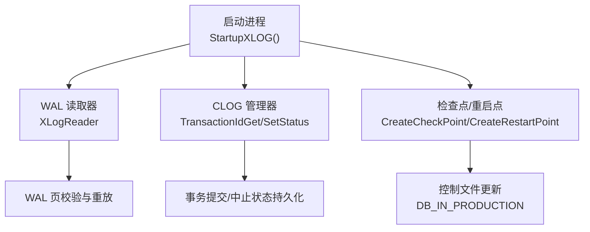
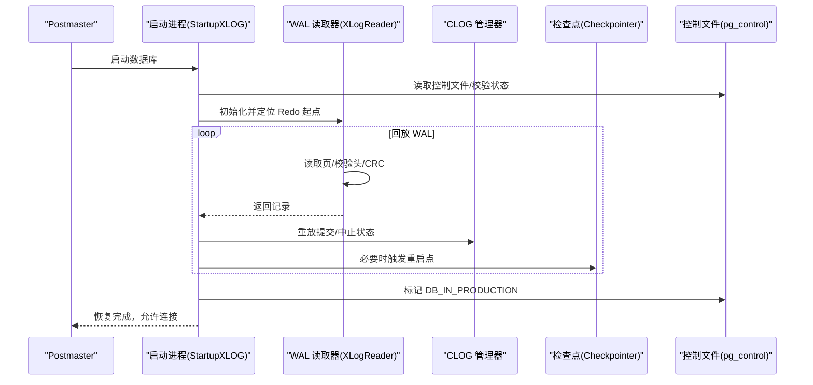
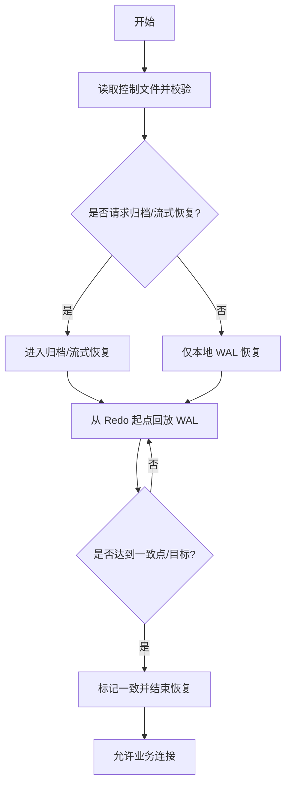
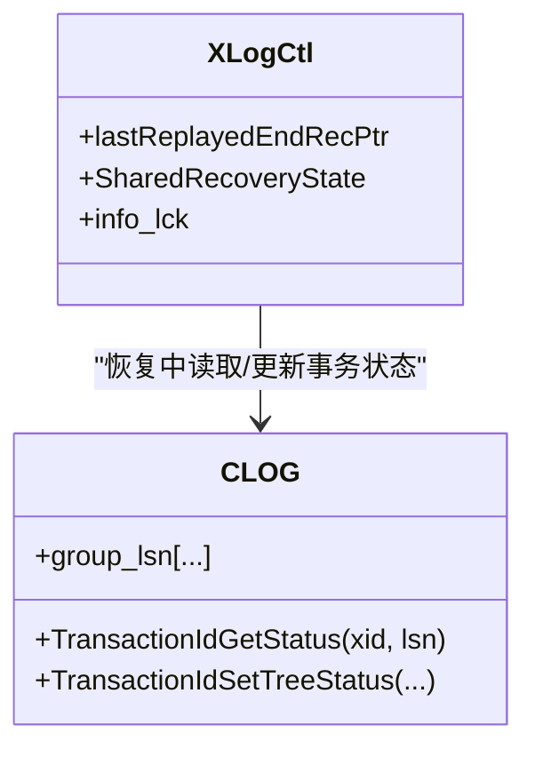
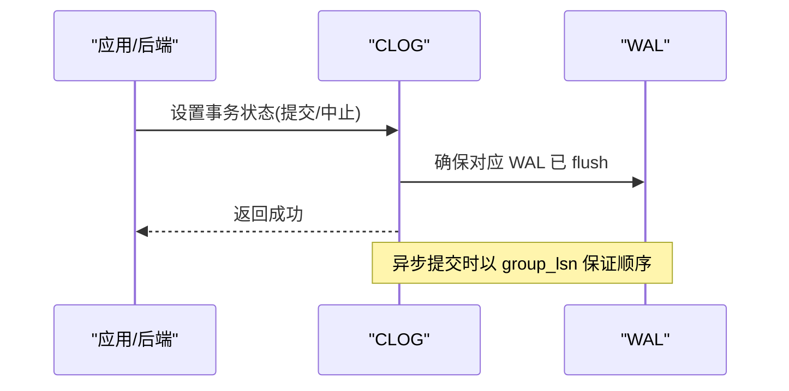
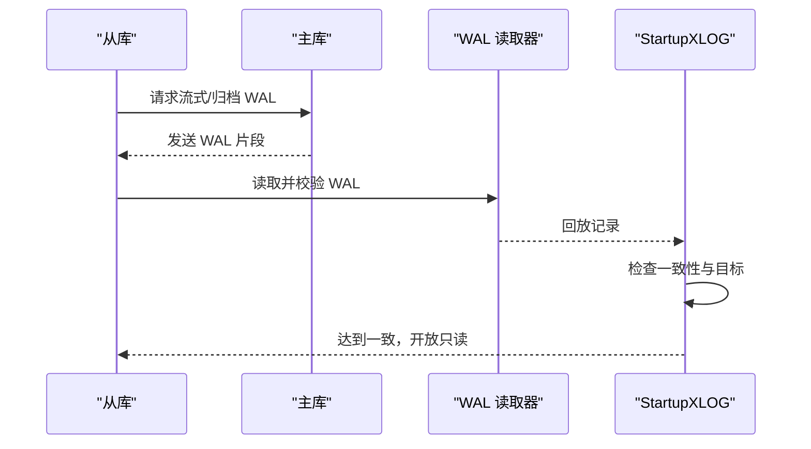
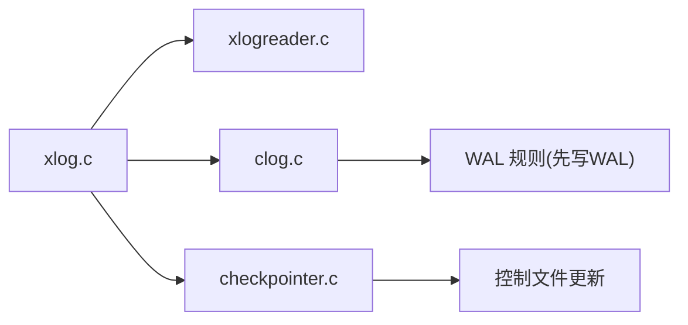

# 崩溃恢复与一致性

<cite>
**本文引用的文件**
- [xlog.c](file://src/backend/access/transam/xlog.c)
- [clog.c](file://src/backend/access/transam/clog.c)
- [checkpointer.c](file://src/backend/postmaster/checkpointer.c)
- [xlogreader.c](file://src/backend/access/transam/xlogreader.c)
</cite>

## 目录
1. [简介](#简介)
2. [项目结构](#项目结构)
3. [核心组件](#核心组件)
4. [架构总览](#架构总览)
5. [详细组件分析](#详细组件分析)
6. [依赖关系分析](#依赖关系分析)
7. [性能考虑](#性能考虑)
8. [故障排除指南](#故障排除指南)
9. [结论](#结论)
10. [附录](#附录)

## 简介
本文件面向 Mini PostgreSQL 的崩溃恢复机制，系统性阐述启动检查、前滚恢复（Redo）与后滚回滚（Undo/Abort）的实现要点；解释一致性检查算法、事务状态验证与数据完整性保证；文档化 CLOG（提交日志）在恢复中的作用；说明流复制中的恢复机制（从库同步与增量恢复）；给出并行恢复、跳过无用记录与恢复进度监控等优化策略；并提供常见错误诊断与手动干预方法。最后通过具体场景演示 ACID 特性的保障过程。

## 项目结构
Mini PostgreSQL 的恢复子系统主要位于后端访问层与事务管理模块：
- WAL 管理与恢复主流程：xlog.c
- WAL 读取与校验：xlogreader.c
- 提交日志（CLOG）：clog.c
- 检查点与重启点：checkpointer.c

图表来源
- [xlog.c:6341-6500](file://src/backend/access/transam/xlog.c#L6341-L6500)
- [xlogreader.c:236-595](file://src/backend/access/transam/xlogreader.c#L236-L595)
- [clog.c:639-663](file://src/backend/access/transam/clog.c#L639-L663)
- [checkpointer.c:385-456](file://src/backend/postmaster/checkpointer.c#L385-L456)

章节来源
- [xlog.c:6341-6500](file://src/backend/access/transam/xlog.c#L6341-L6500)
- [xlogreader.c:236-595](file://src/backend/access/transam/xlogreader.c#L236-L595)
- [clog.c:639-663](file://src/backend/access/transam/clog.c#L639-L663)
- [checkpointer.c:385-456](file://src/backend/postmaster/checkpointer.c#L385-L456)

## 核心组件
- WAL 恢复主流程（StartupXLOG）：负责启动检查、时间线选择、信号文件解析、归档/流式恢复入口、一致性判定与结束恢复。
- WAL 读取器（XLogReader）：提供 WAL 页读取、记录组装、头部与 CRC 校验、跨页记录处理、断链检测。
- CLOG（提交日志）：维护事务提交/中止状态，支持分组更新与异步提交的 LSN 追踪，确保“先写 WAL 再落盘”的一致性约束。
- 检查点/重启点（Checkpointer）：在正常模式创建检查点，在恢复期间创建重启点，协调 WAL 回放与数据一致性。

章节来源
- [xlog.c:6341-6500](file://src/backend/access/transam/xlog.c#L6341-L6500)
- [xlog.c:7900-8200](file://src/backend/access/transam/xlog.c#L7900-L8200)
- [xlogreader.c:236-595](file://src/backend/access/transam/xlogreader.c#L236-L595)
- [clog.c:639-663](file://src/backend/access/transam/clog.c#L639-L663)
- [checkpointer.c:385-456](file://src/backend/postmaster/checkpointer.c#L385-L456)

## 架构总览
下图展示崩溃恢复的整体流程与控制点：

图表来源
- [xlog.c:6341-6500](file://src/backend/access/transam/xlog.c#L6341-L6500)
- [xlog.c:7900-8200](file://src/backend/access/transam/xlog.c#L7900-L8200)
- [xlogreader.c:236-595](file://src/backend/access/transam/xlogreader.c#L236-L595)
- [checkpointer.c:385-456](file://src/backend/postmaster/checkpointer.c#L385-L456)

## 详细组件分析

### 启动检查与恢复阶段划分
- 启动检查：读取控制文件，校验 checkpoint 位置与集群状态；清理临时 WAL 段；根据最小恢复点与时间线确定目标 TLI；读取 recovery 信号文件并验证参数。
- 前滚恢复（Redo）：从 Redo 起点开始顺序回放 WAL 记录，应用数据修改，直至一致点或目标 LSN/XID/时间。
- 后滚回滚（Undo/Abort）：对未提交事务进行回滚，由 WAL 中记录的撤销信息与 CLOG 状态共同保证。
- 一致性判定：当回放到达备份结束点且无未初始化页面引用时，认为达到一致状态；随后允许只读连接（热备）。

图表来源
- [xlog.c:6341-6500](file://src/backend/access/transam/xlog.c#L6341-L6500)
- [xlog.c:7900-8200](file://src/backend/access/transam/xlog.c#L7900-L8200)

章节来源
- [xlog.c:6341-6500](file://src/backend/access/transam/xlog.c#L6341-L6500)
- [xlog.c:7900-8200](file://src/backend/access/transam/xlog.c#L7900-L8200)

### 一致性检查算法与事务状态验证
- 一致性检查：检查是否存在对未初始化页面的引用；若不存在且已越过备份结束点，则置为一致。
- 事务状态验证：通过 CLOG 查询事务最终状态；结合 WAL 中提交/中止记录，确保“提交可见性”与“原子性”。
- 关键约束：异步提交需保证对应 CLOG 更新的 LSN 已被 WAL flush 覆盖，满足“先写 WAL 再落盘”的规则。

图表来源
- [xlog.c:7008-718](file://src/backend/access/transam/xlog.c#L7008-L718)
- [clog.c:639-663](file://src/backend/access/transam/clog.c#L639-L663)
- [clog.c:163-229](file://src/backend/access/transam/clog.c#L163-L229)

章节来源
- [xlog.c:7008-718](file://src/backend/access/transam/xlog.c#L7008-L718)
- [clog.c:639-663](file://src/backend/access/transam/clog.c#L639-L663)
- [clog.c:163-229](file://src/backend/access/transam/clog.c#L163-L229)

### CLOG（提交日志）在恢复中的作用
- 作用：记录事务的最终提交/中止状态；在恢复过程中用于判断事务可见性与一致性。
- 读取与验证：通过 TransactionIdGetStatus 获取状态与相关 LSN；结合 WAL 回放确保状态与 WAL 一致。
- 写入与原子性：提交时使用子提交（subcommitted）过渡态，保证多页更新原子性；异步提交通过 group_lsn 追踪最晚 LSN，确保 WAL 先行落盘。

图表来源
- [clog.c:639-663](file://src/backend/access/transam/clog.c#L639-L663)
- [clog.c:163-229](file://src/backend/access/transam/clog.c#L163-L229)

章节来源
- [clog.c:639-663](file://src/backend/access/transam/clog.c#L639-L663)
- [clog.c:163-229](file://src/backend/access/transam/clog.c#L163-L229)

### 流复制中的恢复机制（从库同步与增量恢复）
- 从库同步：通过归档恢复或流式恢复拉取 WAL，按序回放至目标 LSN/时间/XID；支持切换时间线与清理旧时间线片段。
- 增量恢复：基于最近的重启点/检查点进行回放，减少恢复时间；在恢复期间可创建重启点以推进最小恢复点。
- 一致性开放：达到一致点后，允许热备只读连接，提升可用性。

图表来源
- [xlog.c:6341-6500](file://src/backend/access/transam/xlog.c#L6341-L6500)
- [xlog.c:7900-8200](file://src/backend/access/transam/xlog.c#L7900-L8200)
- [xlogreader.c:236-595](file://src/backend/access/transam/xlogreader.c#L236-L595)

章节来源
- [xlog.c:6341-6500](file://src/backend/access/transam/xlog.c#L6341-L6500)
- [xlog.c:7900-8200](file://src/backend/access/transam/xlog.c#L7900-L8200)
- [xlogreader.c:236-595](file://src/backend/access/transam/xlogreader.c#L236-L595)

### 恢复性能优化策略
- 并行恢复：利用多个后台进程并行回放不同资源管理器记录（代码中通过并行执行框架与锁粒度控制），提高回放吞吐。
- 跳过无用记录：对不影响数据一致性的记录（如某些元数据变更）可跳过以减少回放开销。
- 恢复进度监控：通过 lastReplayedEndRecPtr、currentChunkStartTime 等共享变量跟踪回放进度与耗时，辅助调优与告警。

章节来源
- [xlog.c:7008-718](file://src/backend/access/transam/xlog.c#L7008-L718)

### 故障排除指南
- 常见错误
  - WAL 生成级别过低：归档恢复要求 wal_level 至少为 replica，否则终止恢复。
  - 控制文件无效：checkpoint 位置或集群状态非法，导致无法继续。
  - WAL 记录损坏：CRC 校验失败或 prev-link 不匹配，需回退到更早备份或修复 WAL。
- 手动干预
  - 调整恢复目标：通过 recovery_target_* 配置指定时间点/XID/LSN/名称。
  - 清理/修复 WAL：移除损坏片段，补充缺失归档，重新发起恢复。
  - 强制检查点：在恢复结束后或提升为主库后请求检查点，缩短下次恢复窗口。

章节来源
- [xlog.c:6300-6335](file://src/backend/access/transam/xlog.c#L6300-L6335)
- [xlog.c:6376-6430](file://src/backend/access/transam/xlog.c#L6376-L6430)
- [xlogreader.c:720-800](file://src/backend/access/transam/xlogreader.c#L720-L800)

## 依赖关系分析
- xlog.c 依赖 xlogreader.c 进行 WAL 读取与校验；依赖 clog.c 进行事务状态读写；依赖 checkpointer.c 在恢复期间创建重启点。
- clog.c 依赖 SLRU 与 WAL 规则，确保提交状态与 WAL 顺序一致。
- checkpointer.c 在恢复期间协调重启点，影响最小恢复点与后续恢复起点。

图表来源
- [xlog.c:6341-6500](file://src/backend/access/transam/xlog.c#L6341-L6500)
- [xlogreader.c:236-595](file://src/backend/access/transam/xlogreader.c#L236-L595)
- [clog.c:639-663](file://src/backend/access/transam/clog.c#L639-L663)
- [checkpointer.c:385-456](file://src/backend/postmaster/checkpointer.c#L385-L456)

章节来源
- [xlog.c:6341-6500](file://src/backend/access/transam/xlog.c#L6341-L6500)
- [xlogreader.c:236-595](file://src/backend/access/transam/xlogreader.c#L236-L595)
- [clog.c:639-663](file://src/backend/access/transam/clog.c#L639-L663)
- [checkpointer.c:385-456](file://src/backend/postmaster/checkpointer.c#L385-L456)

## 性能考虑
- 回放并行化：合理设置并行 worker 数量，避免锁竞争过大。
- 跳过无用记录：针对非关键元数据变更启用跳过，降低回放压力。
- 进度监控：关注 lastReplayedEndRecPtr 与 chunk 时间戳，识别瓶颈段落。
- 检查点频率：在恢复期间适当调整 checkpoint_timeout 与 max_wal_size，平衡回放速度与磁盘压力。

[本节为通用指导，无需特定文件来源]

## 故障排除指南
- 诊断步骤
  - 检查控制文件状态与 checkpoint 位置是否有效。
  - 查看 WAL 记录 CRC 与 prev-link 是否匹配，定位损坏位置。
  - 确认 wal_level 与恢复目标配置是否符合要求。
- 手动修复
  - 替换损坏 WAL 片段，补充缺失归档。
  - 调整 recovery_target_* 指向更早一致点。
  - 恢复完成后请求检查点，缩短下次恢复窗口。

章节来源
- [xlog.c:6300-6335](file://src/backend/access/transam/xlog.c#L6300-L6335)
- [xlog.c:6376-6430](file://src/backend/access/transam/xlog.c#L6376-L6430)
- [xlogreader.c:720-800](file://src/backend/access/transam/xlogreader.c#L720-L800)

## 结论
Mini PostgreSQL 的崩溃恢复通过严格的启动检查、WAL 回放、CLOG 状态验证与检查点/重启点协调，确保 ACID 特性在异常恢复后依然成立。借助流复制与归档恢复，系统可在主库故障时快速重建一致副本；通过并行回放、跳过无用记录与进度监控等手段，恢复性能得到显著提升。实践中应重视 WAL 完整性、控制文件有效性以及恢复目标配置的合理性，配合故障排除流程，保障高可用与数据一致性。

[本节为总结，无需特定文件来源]

## 附录
- 关键术语
  - Redo：前滚恢复，重放已提交事务的数据修改。
  - Undo：后滚回滚，撤销未提交事务的影响。
  - CLOG：提交日志，记录事务最终状态。
  - 重启点：恢复期间的轻量检查点，推进最小恢复点。
- 参考路径
  - 启动与恢复主流程：[xlog.c:6341-6500](file://src/backend/access/transam/xlog.c#L6341-L6500)
  - 一致性判定与结束恢复：[xlog.c:7900-8200](file://src/backend/access/transam/xlog.c#L7900-L8200)
  - WAL 读取与校验：[xlogreader.c:236-595](file://src/backend/access/transam/xlogreader.c#L236-L595)
  - CLOG 事务状态：[clog.c:639-663](file://src/backend/access/transam/clog.c#L639-L663)
  - 检查点/重启点：[checkpointer.c:385-456](file://src/backend/postmaster/checkpointer.c#L385-L456)

[本节为附录，无需特定文件来源]