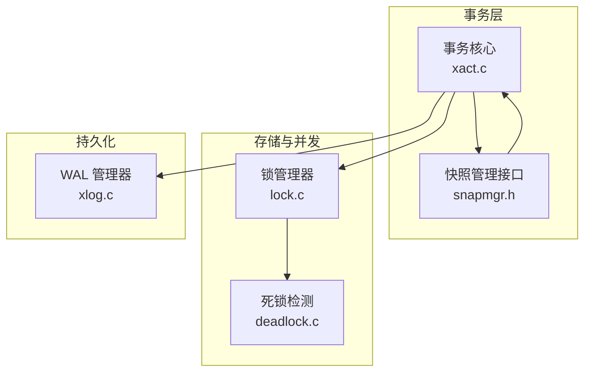
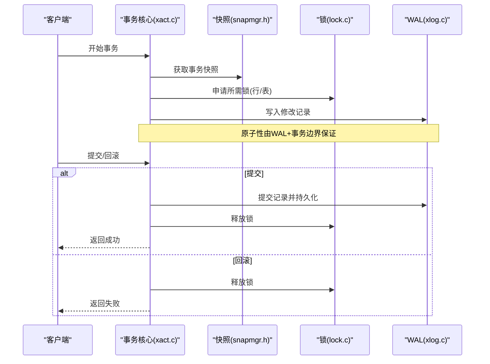
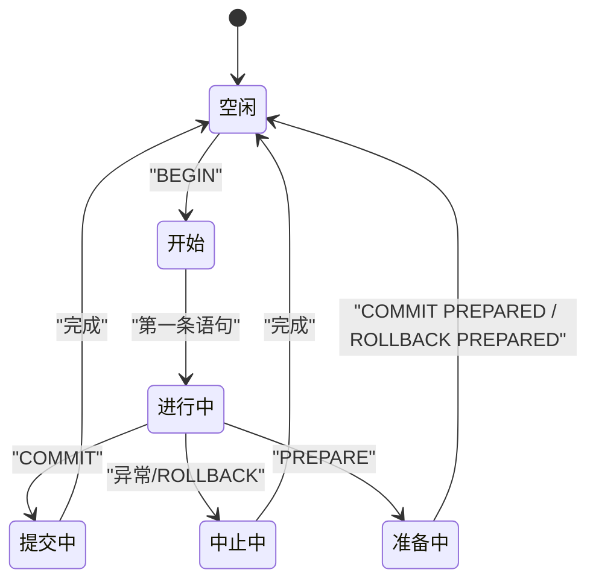
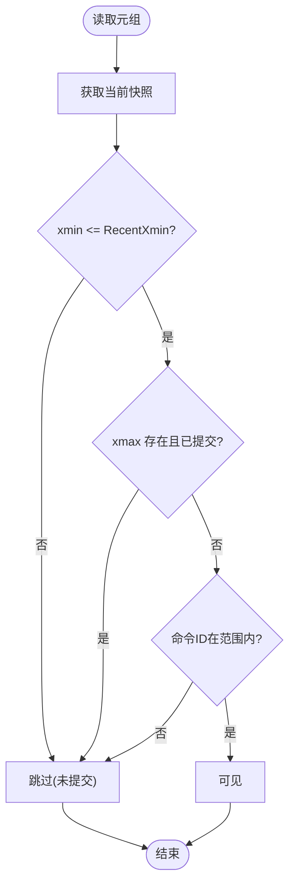
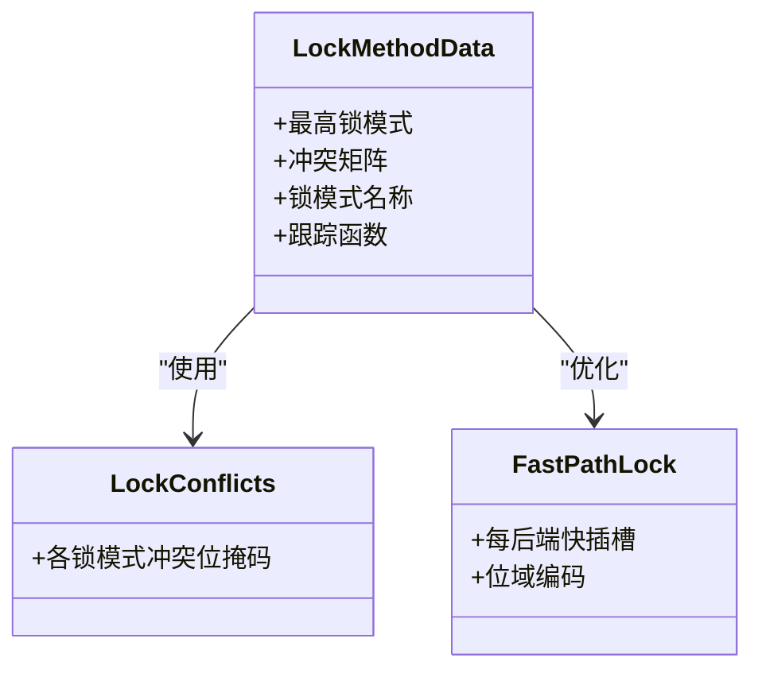
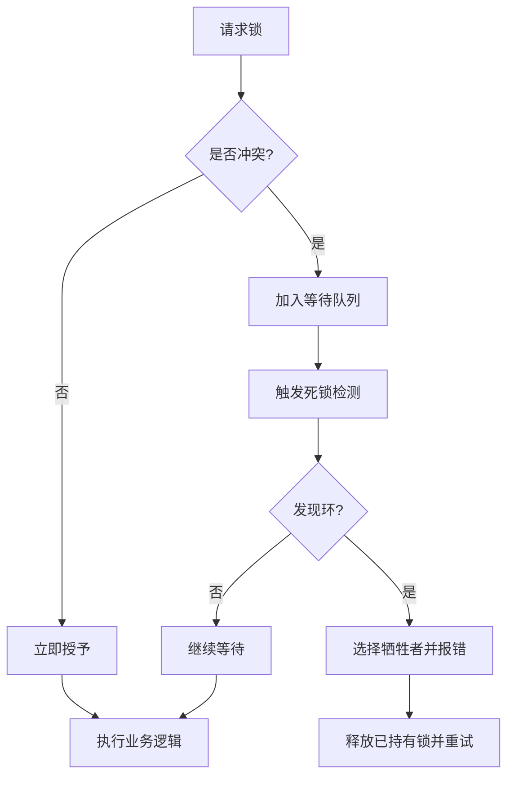
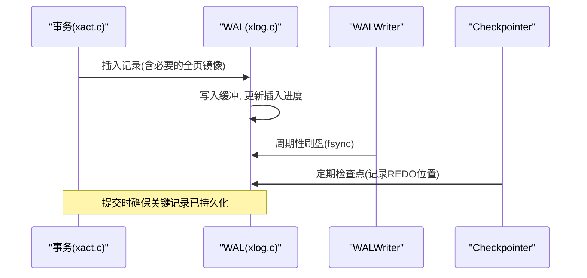
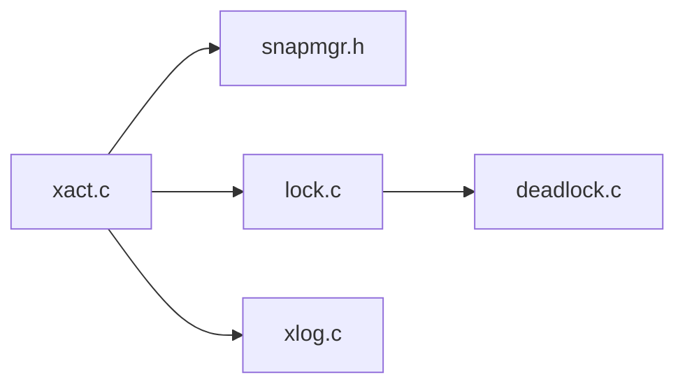

# 事务管理

<cite>
**本文引用的文件**
- [xact.c](file://src/backend/access/transam/xact.c)
- [xlog.c](file://src/backend/access/transam/xlog.c)
- [lock.c](file://src/backend/storage/lmgr/lock.c)
- [deadlock.c](file://src/backend/storage/lmgr/deadlock.c)
- [snapmgr.h](file://src/include/utils/snapmgr.h)
</cite>

## 目录
1. [简介](#简介)
2. [项目结构](#项目结构)
3. [核心组件](#核心组件)
4. [架构总览](#架构总览)
5. [详细组件分析](#详细组件分析)
6. [依赖关系分析](#依赖关系分析)
7. [性能考虑](#性能考虑)
8. [故障排查指南](#故障排查指南)
9. [结论](#结论)
10. [附录](#附录)

## 简介
本文件为 Mini PostgreSQL 的事务管理系统提供全面技术文档，围绕 ACID 特性、MVCC（多版本并发控制）、锁机制与 WAL（预写式日志）展开。重点覆盖：
- 事务边界定义、原子性保证与持久化策略
- MVCC 可见性判断、快照管理与版本链维护
- 行级锁、表级锁与死锁检测
- WAL 写入与恢复流程
- 事务状态图、并发控制流程图与故障恢复策略

## 项目结构
Mini PostgreSQL 的事务相关代码主要分布在以下模块：
- 事务核心：access/transam/xact.c
- 预写式日志：access/transam/xlog.c
- 锁管理器：storage/lmgr/lock.c
- 死锁检测：storage/lmgr/deadlock.c
- 快照管理接口：include/utils/snapmgr.h

**图示来源**
- [xact.c:127-203](file://src/backend/access/transam/xact.c#L127-L203)
- [xlog.c:428-736](file://src/backend/access/transam/xlog.c#L428-L736)
- [lock.c:60-154](file://src/backend/storage/lmgr/lock.c#L60-L154)
- [deadlock.c:36-128](file://src/backend/storage/lmgr/deadlock.c#L36-L128)
- [snapmgr.h:108-178](file://src/include/utils/snapmgr.h#L108-L178)

**章节来源**
- [xact.c:127-203](file://src/backend/access/transam/xact.c#L127-L203)
- [xlog.c:428-736](file://src/backend/access/transam/xlog.c#L428-L736)
- [lock.c:60-154](file://src/backend/storage/lmgr/lock.c#L60-L154)
- [deadlock.c:36-128](file://src/backend/storage/lmgr/deadlock.c#L36-L128)
- [snapmgr.h:108-178](file://src/include/utils/snapmgr.h#L108-L178)

## 核心组件
- 事务核心（xact.c）：定义事务状态机、事务块状态、事务 ID 分配、子事务管理、命令 ID、时间戳等；提供提交、回滚、准备等生命周期钩子。
- 快照管理（snapmgr.h）：提供获取事务快照、最新快照、目录快照、注册/注销快照、旧快照阈值管理等接口，支撑 MVCC 可见性判断。
- 锁管理器（lock.c）：实现锁模式冲突矩阵、锁表、快速路径锁槽、资源所有者绑定等，支撑行级/表级锁的获取与释放。
- 死锁检测（deadlock.c）：构建等待图、查找环、拓扑排序与重排队列，选择牺牲进程以打破死锁。
- WAL 管理器（xlog.c）：负责 WAL 插入、缓冲、刷盘、检查点、恢复、时间线、归档等，保障持久性与可恢复性。

**章节来源**
- [xact.c:127-203](file://src/backend/access/transam/xact.c#L127-L203)
- [snapmgr.h:108-178](file://src/include/utils/snapmgr.h#L108-L178)
- [lock.c:60-154](file://src/backend/storage/lmgr/lock.c#L60-L154)
- [deadlock.c:36-128](file://src/backend/storage/lmgr/deadlock.c#L36-L128)
- [xlog.c:428-736](file://src/backend/access/transam/xlog.c#L428-L736)

## 架构总览
事务系统由“事务核心 + 快照管理 + 锁管理 + WAL”构成。事务启动时创建快照并进入有效事务状态；数据修改前申请相应锁，记录 WAL；提交时确保 WAL 持久化并更新全局可见性信息；回滚时撤销变更并清理资源。

**图示来源**
- [xact.c:127-203](file://src/backend/access/transam/xact.c#L127-L203)
- [snapmgr.h:108-178](file://src/include/utils/snapmgr.h#L108-L178)
- [lock.c:60-154](file://src/backend/storage/lmgr/lock.c#L60-L154)
- [xlog.c:428-736](file://src/backend/access/transam/xlog.c#L428-L736)

## 详细组件分析

### 事务状态机与边界
- 事务状态 TransState：默认、开始、进行中、提交中、中止中、准备中。
- 事务块状态 TBlockState：支持单语句事务、显式事务块、隐式事务、并行工作器内事务、子事务等。
- 事务 ID 分配：首次访问数据或需要 XID 时分配，保证父子事务顺序与可见性。
- 原子性：通过 WAL 记录与事务边界（提交/回滚）共同保证。

**图示来源**
- [xact.c:127-203](file://src/backend/access/transam/xact.c#L127-L203)

**章节来源**
- [xact.c:127-203](file://src/backend/access/transam/xact.c#L127-L203)

### MVCC：可见性判断、快照管理与版本链
- 快照类型：事务快照、历史快照、目录快照、脏快照、非可真空快照、Toast 快照等。
- 可见性判断：基于事务 ID 与命令 ID，结合全局可见性测试（如 GlobalVisTest）。
- 快照生命周期：获取、推送/弹出、注册/注销、导出/导入、旧快照阈值管理。
- 版本链：堆表元组携带 xmin/xmax 与命令 ID，配合快照决定可见性。

**图示来源**
- [snapmgr.h:108-178](file://src/include/utils/snapmgr.h#L108-L178)

**章节来源**
- [snapmgr.h:108-178](file://src/include/utils/snapmgr.h#L108-L178)

### 锁机制：行级锁、表级锁与死锁检测
- 锁模式与冲突矩阵：AccessShareLock、RowShareLock、RowExclusiveLock、ShareUpdateExclusiveLock、ShareLock、ShareRowExclusiveLock、ExclusiveLock、AccessExclusiveLock。
- 快速路径锁：减少共享内存争用，提升热点路径性能。
- 死锁检测：构建等待图，递归查找环，拓扑排序与队列重排，选择牺牲进程。

**图示来源**
- [lock.c:60-154](file://src/backend/storage/lmgr/lock.c#L60-L154)

**图示来源**
- [deadlock.c:36-128](file://src/backend/storage/lmgr/deadlock.c#L36-L128)

**章节来源**
- [lock.c:60-154](file://src/backend/storage/lmgr/lock.c#L60-L154)
- [deadlock.c:36-128](file://src/backend/storage/lmgr/deadlock.c#L36-L128)

### WAL：写入与恢复
- 写入路径：插入记录到 WAL 缓冲区，按页组织，必要时取全页镜像；通过 LWLock 保护并发插入；后台 WALWriter 刷盘。
- 持久化策略：fsync/fdatasync 等同步方法；检查点生成与重启点；异步提交与同步提交选项。
- 恢复流程：启动时从检查点开始回放 WAL；支持归档恢复、流复制；处理时间线与目标位置。

**图示来源**
- [xlog.c:428-736](file://src/backend/access/transam/xlog.c#L428-L736)

**章节来源**
- [xlog.c:428-736](file://src/backend/access/transam/xlog.c#L428-L736)

## 依赖关系分析
- xact.c 依赖 snapmgr.h（快照）、lock.c（锁）、xlog.c（WAL），形成事务生命周期的核心闭环。
- lock.c 依赖 deadlock.c 进行死锁检测，并通过资源所有者绑定锁的生命周期。
- xlog.c 提供持久化能力，被事务与恢复流程广泛使用。

**图示来源**
- [xact.c:127-203](file://src/backend/access/transam/xact.c#L127-L203)
- [snapmgr.h:108-178](file://src/include/utils/snapmgr.h#L108-L178)
- [lock.c:60-154](file://src/backend/storage/lmgr/lock.c#L60-L154)
- [deadlock.c:36-128](file://src/backend/storage/lmgr/deadlock.c#L36-L128)
- [xlog.c:428-736](file://src/backend/access/transam/xlog.c#L428-L736)

**章节来源**
- [xact.c:127-203](file://src/backend/access/transam/xact.c#L127-L203)
- [snapmgr.h:108-178](file://src/include/utils/snapmgr.h#L108-L178)
- [lock.c:60-154](file://src/backend/storage/lmgr/lock.c#L60-L154)
- [deadlock.c:36-128](file://src/backend/storage/lmgr/deadlock.c#L36-L128)
- [xlog.c:428-736](file://src/backend/access/transam/xlog.c#L428-L736)

## 性能考虑
- 快照获取与可见性判断应尽量避免昂贵扫描；合理使用命令 ID 与最近最小 XID 加速过滤。
- 锁竞争热点可通过快速路径锁降低开销；合理设计事务粒度以减少锁持有时间。
- WAL 写入采用批量缓冲与异步刷盘；调整检查点频率与 WAL 大小以平衡吞吐与恢复成本。
- 避免长事务导致可见性前沿推进缓慢，影响 Vacuum 与空间回收。

[本节为通用指导，不直接分析具体文件]

## 故障排查指南
- 事务卡在提交：检查 WAL 刷盘与 fsync 配置；确认检查点是否正常；查看是否有阻塞的锁或长时间运行的查询。
- 死锁频繁：分析锁请求顺序与事务粒度；优化 SQL 以避免循环等待；关注自动真空进程对锁的影响。
- 可见性问题：核对快照获取时机与命令 ID；检查 xmin/xmax 设置是否符合预期；验证全局可见性测试结果。
- 恢复异常：检查检查点与 WAL 完整性；确认归档与流复制配置；关注时间线与目标位置设置。

**章节来源**
- [deadlock.c:36-128](file://src/backend/storage/lmgr/deadlock.c#L36-L128)
- [xlog.c:428-736](file://src/backend/access/transam/xlog.c#L428-L736)
- [snapmgr.h:108-178](file://src/include/utils/snapmgr.h#L108-L178)

## 结论
Mini PostgreSQL 的事务系统通过清晰的状态机、严格的快照与可见性规则、完善的锁与死锁检测以及健壮的 WAL 机制，实现了 ACID 特性。开发时应重点关注事务边界、锁粒度、快照生命周期与 WAL 持久化策略，以获得高一致性与高性能。

[本节为总结，不直接分析具体文件]

## 附录
- 术语
  - ACID：原子性、一致性、隔离性、持久性
  - MVCC：多版本并发控制
  - WAL：预写式日志
  - 快照：用于可见性判断的一致性视图
- 参考路径
  - 事务状态与边界：[xact.c:127-203](file://src/backend/access/transam/xact.c#L127-L203)
  - 快照接口：[snapmgr.h:108-178](file://src/include/utils/snapmgr.h#L108-L178)
  - 锁模式与冲突：[lock.c:60-154](file://src/backend/storage/lmgr/lock.c#L60-L154)
  - 死锁检测：[deadlock.c:36-128](file://src/backend/storage/lmgr/deadlock.c#L36-L128)
  - WAL 写入与恢复：[xlog.c:428-736](file://src/backend/access/transam/xlog.c#L428-L736)

[本节为补充说明，不直接分析具体文件]