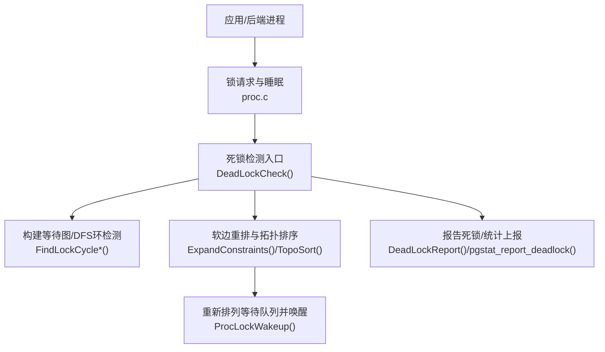
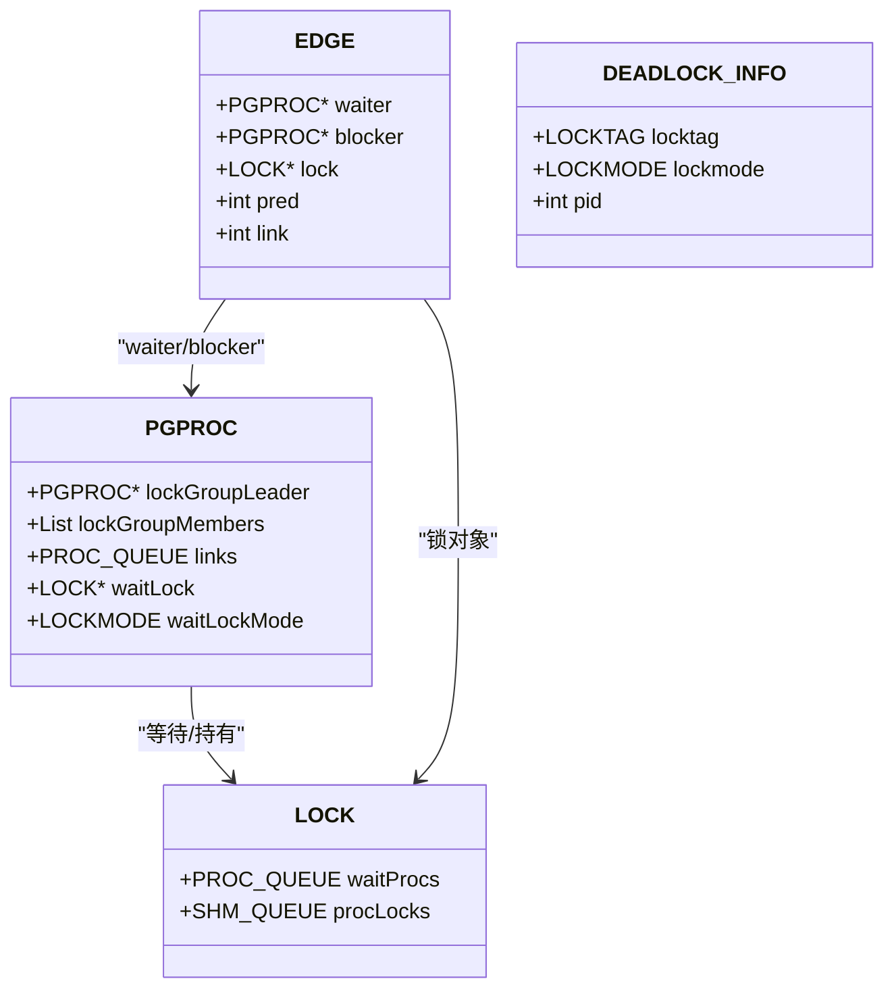
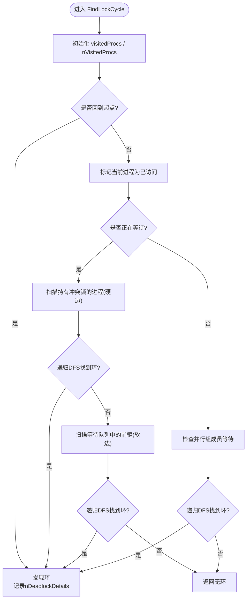
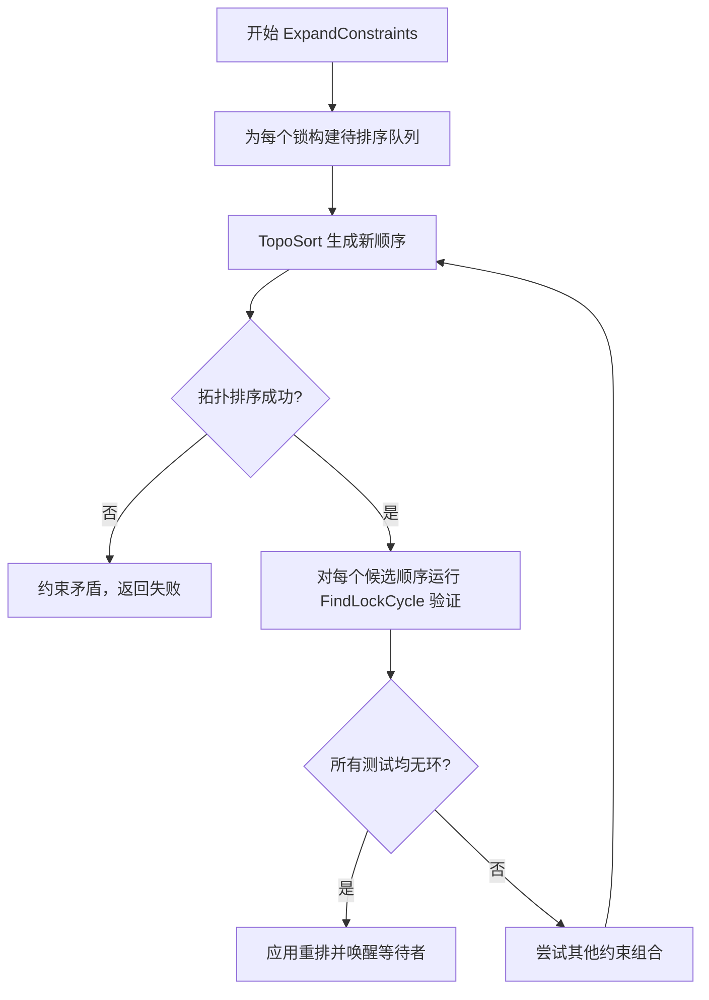
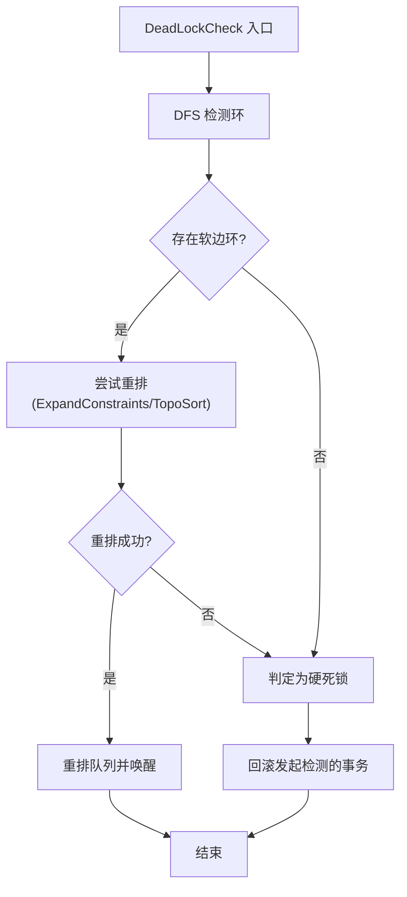
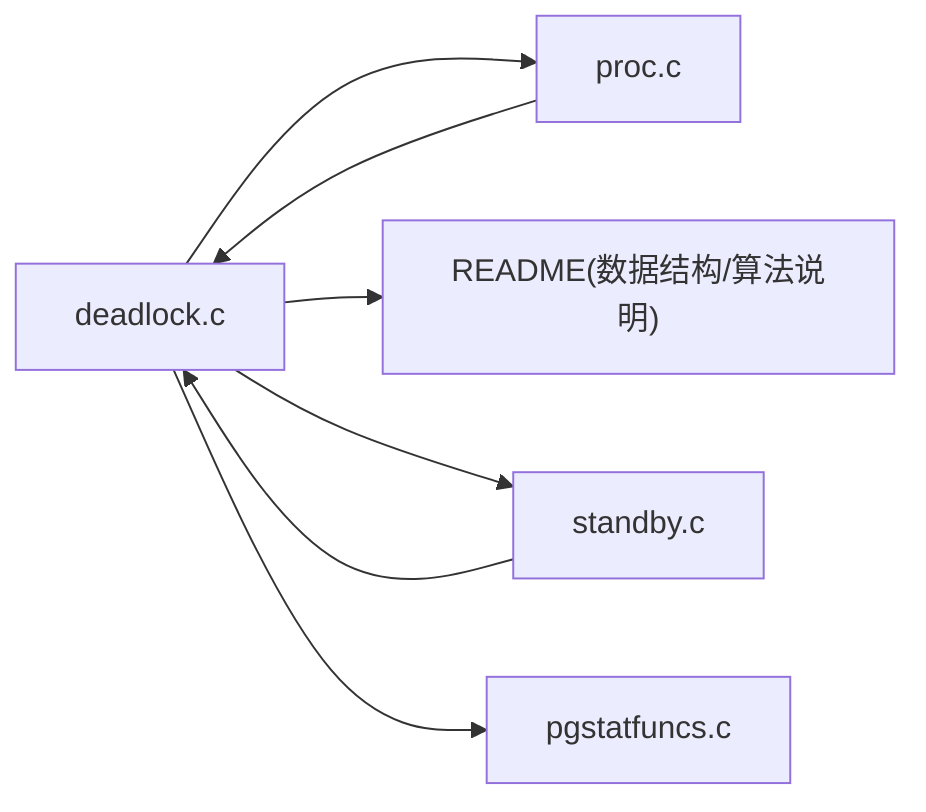

# 死锁检测算法

<cite>
**本文引用的文件**
- [src/backend/storage/lmgr/deadlock.c](file://src/backend/storage/lmgr/deadlock.c)
- [src/backend/storage/lmgr/README](file://src/backend/storage/lmgr/README)
- [src/backend/storage/lmgr/proc.c](file://src/backend/storage/lmgr/proc.c)
- [src/backend/storage/ipc/standby.c](file://src/backend/storage/ipc/standby.c)
- [doc/src/sgml/config.sgml](file://doc/src/sgml/config.sgml)
- [doc/src/sgml/monitoring.sgml](file://doc/src/sgml/monitoring.sgml)
- [src/backend/utils/adt/pgstatfuncs.c](file://src/backend/utils/adt/pgstatfuncs.c)
</cite>

## 目录
1. [简介](#简介)
2. [项目结构](#项目结构)
3. [核心组件](#核心组件)
4. [架构总览](#架构总览)
5. [详细组件分析](#详细组件分析)
6. [依赖关系分析](#依赖关系分析)
7. [性能考量](#性能考量)
8. [故障排查指南](#故障排查指南)
9. [结论](#结论)
10. [附录](#附录)

## 简介
本文件系统性梳理 Mini PostgreSQL 中“死锁检测”的算法与实现，重点覆盖：
- 等待图（Wait-For Graph, WFG）的构建与维护机制，包括进程间等待关系的跟踪。
- 循环检测算法的实现细节，包括深度优先搜索与环检测策略。
- 死锁解除策略：受害者选择、回滚决策、软边重排与拓扑排序。
- 触发条件与执行频率：乐观等待与 DeadlockTimeout 的权衡。
- 分布式环境下的挑战与可行方案。
- 监控指标与调试工具使用方法。
- 典型死锁场景分析与预防措施建议。

## 项目结构
围绕死锁检测的关键代码主要位于存储层的锁管理器子系统中：
- 死锁检测主逻辑：src/backend/storage/lmgr/deadlock.c
- 锁管理器设计说明与算法文档：src/backend/storage/lmgr/README
- 锁请求与睡眠流程（触发检测点）：src/backend/storage/lmgr/proc.c
- 热备恢复冲突处理（含超时与取消）：src/backend/storage/ipc/standby.c
- 配置参数（deadlock_timeout）：doc/src/sgml/config.sgml
- 探针与统计接口（deadlock-found 等）：doc/src/sgml/monitoring.sgml
- 统计函数（pg_stat_get_db_deadlocks 等）：src/backend/utils/adt/pgstatfuncs.c



图表来源
- [src/backend/storage/lmgr/deadlock.c:216-285](file://src/backend/storage/lmgr/deadlock.c#L216-L285)
- [src/backend/storage/lmgr/deadlock.c:448-536](file://src/backend/storage/lmgr/deadlock.c#L448-L536)
- [src/backend/storage/lmgr/deadlock.c:804-848](file://src/backend/storage/lmgr/deadlock.c#L804-L848)
- [src/backend/storage/lmgr/deadlock.c:876-1062](file://src/backend/storage/lmgr/deadlock.c#L876-L1062)
- [src/backend/storage/lmgr/proc.c:1161-1203](file://src/backend/storage/lmgr/proc.c#L1161-L1203)

章节来源
- [src/backend/storage/lmgr/README:338-551](file://src/backend/storage/lmgr/README#L338-L551)
- [src/backend/storage/lmgr/deadlock.c:216-285](file://src/backend/storage/lmgr/deadlock.c#L216-L285)

## 核心组件
- 等待图（WFG）建模
  - 节点：进程（或并行组代表）。
  - 边：A 等待 B 持有的冲突锁（硬边），或 A 在等待队列中排在 B 之后且请求冲突（软边）。
  - 维护：通过锁对象 LOCK 的 waitProcs 队列与 PROCLOCK 持有信息构建；支持并行组（lockGroupLeader/members）聚合。
- 环检测
  - 从当前等待进程出发进行 DFS，记录已访问进程，若回到起点则发现环。
  - 区分“涉及起始进程的环”与“其他环”，仅对前者进行处理。
- 软边重排与拓扑排序
  - 当检测到包含软边的环时，尝试反转其中一条或多条软边对应的等待顺序，使用拓扑排序生成新顺序，验证是否消除所有环。
- 受害者选择与回滚
  - 若无法通过重排解决（硬死锁或无可行重排），终止发起检测的进程的事务（回滚其事务以释放锁）。
  - 特殊优化：若阻塞者为 autovacuum 工作进程，可返回特殊状态以便上层选择性取消。

章节来源
- [src/backend/storage/lmgr/deadlock.c:36-76](file://src/backend/storage/lmgr/deadlock.c#L36-L76)
- [src/backend/storage/lmgr/deadlock.c:448-536](file://src/backend/storage/lmgr/deadlock.c#L448-L536)
- [src/backend/storage/lmgr/deadlock.c:804-848](file://src/backend/storage/lmgr/deadlock.c#L804-L848)
- [src/backend/storage/lmgr/deadlock.c:876-1062](file://src/backend/storage/lmgr/deadlock.c#L876-L1062)
- [src/backend/storage/lmgr/README:393-551](file://src/backend/storage/lmgr/README#L393-L551)

## 架构总览
下图展示从锁请求到死锁检测、再到解除的完整调用链。

```mermaid
sequenceDiagram
participant P as "后端进程"
participant L as "锁管理器(ProcSleep/LockAcquire)"
participant D as "死锁检测(DeadLockCheck)"
participant G as "等待图/DFS(FindLockCycle*)"
participant T as "拓扑排序(TopoSort)"
participant Q as "等待队列重排/唤醒"
participant S as "统计/日志"
P->>L : 请求锁(可能冲突)
L->>P : 加入等待队列并设置超时
Note over P,L : 乐观等待，不立即检测
P->>D : 超时后触发 DeadLockCheck()
D->>G : 构建WFG并DFS查找环
alt 发现环
D->>T : 尝试软边重排(ExpandConstraints/TopoSort)
T-->>D : 成功? 否 -> 失败
opt 成功重排
D->>Q : 重排队列并唤醒
Q-->>P : 继续等待或获得锁
else 无法重排
D->>S : 记录死锁详情
D-->>P : 返回DS_HARD_DEADLOCK
P->>P : 回滚事务(释放锁)
end
else 无环
D-->>P : DS_NO_DEADLOCK/DS_SOFT_DEADLOCK
P->>L : 继续等待
end
```

图表来源
- [src/backend/storage/lmgr/proc.c:1161-1203](file://src/backend/storage/lmgr/proc.c#L1161-L1203)
- [src/backend/storage/lmgr/deadlock.c:216-285](file://src/backend/storage/lmgr/deadlock.c#L216-L285)
- [src/backend/storage/lmgr/deadlock.c:448-536](file://src/backend/storage/lmgr/deadlock.c#L448-L536)
- [src/backend/storage/lmgr/deadlock.c:804-848](file://src/backend/storage/lmgr/deadlock.c#L804-L848)
- [src/backend/storage/lmgr/deadlock.c:876-1062](file://src/backend/storage/lmgr/deadlock.c#L876-L1062)

## 详细组件分析

### 等待图（WFG）构建与维护
- 硬边：由已持有的冲突锁产生。扫描 PROCLOCK 列表，若某进程持有所需锁模式的冲突类型，则形成 A→B 的边。
- 软边：由等待队列顺序产生。若 A 在 B 之后且请求冲突，则 A 必须等待 B，形成 A→B 的软边。
- 并行组：将同一并行组的进程视为一个节点（leader 为代表），成员间的锁不冲突，避免自死锁。
- 数据结构：EDGE 表示边（waiter/blocker/lock），DEADLOCK_INFO 用于记录环路径信息以便输出诊断。



图表来源
- [src/backend/storage/lmgr/deadlock.c:36-76](file://src/backend/storage/lmgr/deadlock.c#L36-L76)
- [src/backend/storage/lmgr/README:50-155](file://src/backend/storage/lmgr/README#L50-L155)

章节来源
- [src/backend/storage/lmgr/deadlock.c:36-76](file://src/backend/storage/lmgr/deadlock.c#L36-L76)
- [src/backend/storage/lmgr/deadlock.c:538-790](file://src/backend/storage/lmgr/deadlock.c#L538-L790)
- [src/backend/storage/lmgr/README:393-444](file://src/backend/storage/lmgr/README#L393-L444)

### 环检测算法（DFS 与软边收集）
- FindLockCycle/Recurse：从起始进程出发 DFS，维护 visitedProcs 数组，若回到起点则发现环；否则忽略非起始点的环。
- 软边收集：在回溯过程中，若边为软边（来自等待队列顺序），将其加入 softEdges 列表，供后续重排使用。
- 并行组处理：若当前进程属于并行组，检查组成员的等待情况，确保不漏掉跨成员的边。



图表来源
- [src/backend/storage/lmgr/deadlock.c:448-536](file://src/backend/storage/lmgr/deadlock.c#L448-L536)
- [src/backend/storage/lmgr/deadlock.c:538-790](file://src/backend/storage/lmgr/deadlock.c#L538-L790)

章节来源
- [src/backend/storage/lmgr/deadlock.c:448-536](file://src/backend/storage/lmgr/deadlock.c#L448-L536)
- [src/backend/storage/lmgr/deadlock.c:538-790](file://src/backend/storage/lmgr/deadlock.c#L538-L790)

### 软边重排与拓扑排序
- ExpandConstraints：根据一组需要反转的软边约束，为每个相关锁的等待队列生成新的顺序候选。
- TopoSort：对等待队列进行拓扑排序，保证满足“waiter 必须在 blocker 之前”的偏序约束，同时尽量保持原顺序以减少扰动。
- 验证：对每个候选顺序，再次运行 FindLockCycle 验证是否仍存在环；若全部通过，则实施重排并唤醒等待者。



图表来源
- [src/backend/storage/lmgr/deadlock.c:804-848](file://src/backend/storage/lmgr/deadlock.c#L804-L848)
- [src/backend/storage/lmgr/deadlock.c:876-1062](file://src/backend/storage/lmgr/deadlock.c#L876-L1062)

章节来源
- [src/backend/storage/lmgr/deadlock.c:804-848](file://src/backend/storage/lmgr/deadlock.c#L804-L848)
- [src/backend/storage/lmgr/deadlock.c:876-1062](file://src/backend/storage/lmgr/deadlock.c#L876-L1062)

### 死锁解除策略（受害者选择与回滚）
- 软死锁：通过重排等待队列即可消除环，无需回滚。
- 硬死锁：无法通过重排解决时，终止发起检测的进程的事务（回滚），释放其持有的锁，打破环。
- Autovacuum 优化：若检测到直接阻塞当前进程的 autovacuum 工作进程，返回特殊状态，允许上层选择性取消该工作进程，体现低优先级原则。



图表来源
- [src/backend/storage/lmgr/deadlock.c:216-285](file://src/backend/storage/lmgr/deadlock.c#L216-L285)
- [src/backend/storage/lmgr/deadlock.c:314-363](file://src/backend/storage/lmgr/deadlock.c#L314-L363)
- [src/backend/storage/lmgr/deadlock.c:287-301](file://src/backend/storage/lmgr/deadlock.c#L287-L301)

章节来源
- [src/backend/storage/lmgr/deadlock.c:216-285](file://src/backend/storage/lmgr/deadlock.c#L216-L285)
- [src/backend/storage/lmgr/deadlock.c:287-301](file://src/backend/storage/lmgr/deadlock.c#L287-L301)

### 触发条件与执行频率
- 乐观等待：正常锁请求若无冲突立即授予；若有冲突则进入等待队列并设置 DeadlockTimeout 定时器。
- 超时触发：若在超时时间内未获得锁，则触发 DeadLockCheck。默认通常为 1 秒，可根据负载调整。
- 热备恢复冲突：Standby 端等待关系锁时，也遵循类似超时与检测逻辑，必要时向主端发送取消信号。

章节来源
- [src/backend/storage/lmgr/README:346-360](file://src/backend/storage/lmgr/README#L346-L360)
- [doc/src/sgml/config.sgml:8766-8799](file://doc/src/sgml/config.sgml#L8766-L8799)
- [src/backend/storage/ipc/standby.c:525-557](file://src/backend/storage/ipc/standby.c#L525-L557)

### 分布式环境下的挑战与解决方案
- 挑战
  - 全局等待图跨节点分布，单点检测难以获取完整图。
  - 网络延迟与分区导致图不一致，易出现误判或漏判。
  - 多节点协调开销大，频繁检测影响吞吐。
- 可行方案
  - 分阶段检测：先在本地检测短环，再跨节点协商长环。
  - 基于令牌/仲裁节点的集中式检测：定期汇总各节点局部图，构建全局图并检测环。
  - 异步与采样：降低检测频率，结合热点数据与高冲突资源优先检测。
  - 一致性边界：在关键临界区（如加锁/解锁）使用轻量级同步，确保图快照一致。
  - 回滚策略：选择代价最小的事务作为受害者（如最小工作量、最近提交概率低）。

[本节为概念性讨论，不直接引用具体源码]

### 监控指标与调试工具
- 探针
  - deadlock-found：当死锁检测器发现死锁时触发。
- 统计函数
  - pg_stat_get_db_deadlocks：数据库级死锁计数。
  - 其他冲突统计：启动期死锁、快照冲突、缓冲钉冲突等。
- 调试
  - DEBUG_DEADLOCK：打印等待队列顺序，辅助定位软边问题。
  - 错误报告：DeadLockReport 输出“进程X等待Y上的Z锁；被进程W阻塞”等详细信息。

章节来源
- [doc/src/sgml/monitoring.sgml:7033-7042](file://doc/src/sgml/monitoring.sgml#L7033-L7042)
- [src/backend/utils/adt/pgstatfuncs.c:1428-1432](file://src/backend/utils/adt/pgstatfuncs.c#L1428-L1432)
- [src/backend/storage/lmgr/deadlock.c:1088-1153](file://src/backend/storage/lmgr/deadlock.c#L1088-L1153)
- [src/backend/storage/lmgr/deadlock.c:1064-1083](file://src/backend/storage/lmgr/deadlock.c#L1064-L1083)

## 依赖关系分析
- 模块耦合
  - deadlock.c 依赖 proc.c 的锁请求/睡眠流程（触发检测点）。
  - 依赖 README 描述的锁数据结构（LOCK/PROCLOCK/PGPROC）与等待队列语义。
  - 依赖 standby.c 的热备冲突处理逻辑（超时与取消）。
  - 依赖 pgstatfuncs.c 提供统计上报能力。
- 外部依赖
  - LWLock 保护锁表分区，死锁检测按分区号顺序加锁以避免 LWLock 死锁。
  - 内存分配在启动时预分配，避免在信号处理器中动态分配。



图表来源
- [src/backend/storage/lmgr/deadlock.c:216-285](file://src/backend/storage/lmgr/deadlock.c#L216-L285)
- [src/backend/storage/lmgr/proc.c:1161-1203](file://src/backend/storage/lmgr/proc.c#L1161-L1203)
- [src/backend/storage/ipc/standby.c:525-557](file://src/backend/storage/ipc/standby.c#L525-L557)
- [src/backend/utils/adt/pgstatfuncs.c:1428-1432](file://src/backend/utils/adt/pgstatfuncs.c#L1428-L1432)

章节来源
- [src/backend/storage/lmgr/README:202-248](file://src/backend/storage/lmgr/README#L202-L248)
- [src/backend/storage/lmgr/deadlock.c:131-199](file://src/backend/storage/lmgr/deadlock.c#L131-L199)

## 性能考量
- 乐观等待减少检测开销：仅在超时后才检测，避免每次等待都计算 WFG。
- 预分配工作空间：在进程启动时分配最大所需空间，避免运行时分配风险。
- 拓扑排序复杂度：由于约束数量通常很小，简单实现足以满足需求。
- 并行组优化：将组内锁视为不冲突，减少不必要的边与检测成本。
- 调优建议
  - 合理设置 deadlock_timeout：在高并发下可适当增大，减少误检；在交互式场景可降低以提升响应。
  - 关注热点资源的锁粒度与持有时间，减少冲突概率。
  - 利用监控指标（deadlock-found、pg_stat_get_db_deadlocks）评估系统健康度。

[本节为通用指导，不直接引用具体源码]

## 故障排查指南
- 常见症状
  - 查询长时间等待并报错“deadlock detected”。
  - 日志中出现“Process X waits for Y on Z; blocked by process W.”。
- 排查步骤
  - 查看服务器日志与客户端错误详情，确认涉及的锁对象与进程。
  - 启用 DEBUG_DEADLOCK 打印等待队列顺序，观察软边与硬边。
  - 使用 pg_stat_activity 与相关统计视图，识别阻塞链与热点资源。
  - 调整 deadlock_timeout 与锁粒度，复现并验证修复效果。
- 自动清理与恢复
  - 若检测到 autovacuum 阻塞，可考虑取消该工作进程以快速恢复。
  - 热备冲突：Standby 端超时后会请求主端检查自身死锁，必要时取消冲突查询。

章节来源
- [src/backend/storage/lmgr/deadlock.c:1088-1153](file://src/backend/storage/lmgr/deadlock.c#L1088-L1153)
- [src/backend/storage/lmgr/deadlock.c:1064-1083](file://src/backend/storage/lmgr/deadlock.c#L1064-L1083)
- [src/backend/storage/ipc/standby.c:525-557](file://src/backend/storage/ipc/standby.c#L525-L557)

## 结论
Mini PostgreSQL 的死锁检测采用经典的等待图与 DFS 环检测，并结合软边重排与拓扑排序，尽可能避免回滚。通过乐观等待与可调超时平衡检测开销与响应时间。对于分布式场景，需引入分阶段检测、集中式仲裁与一致性边界等策略。借助内置探针与统计接口，可有效监控与定位死锁问题。实践中应结合业务特点优化锁粒度、持有时间与超时参数，以降低死锁概率并提升整体吞吐。

[本节为总结性内容，不直接引用具体源码]

## 附录
- 典型死锁场景示例（隔离测试）
  - 四进程死锁，包含两条硬边与两条软边，检测器通过反转 d1-e2 软边解除阻塞。
  - 参考用例：src/test/isolation/specs/deadlock-soft.spec

章节来源
- [src/test/isolation/specs/deadlock-soft.spec:1-40](file://src/test/isolation/specs/deadlock-soft.spec#L1-L40)