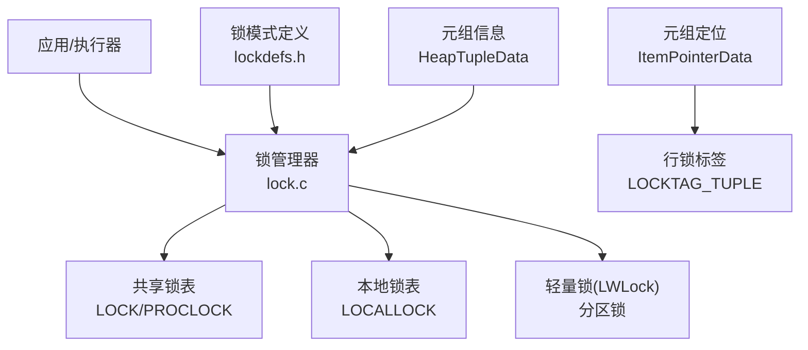
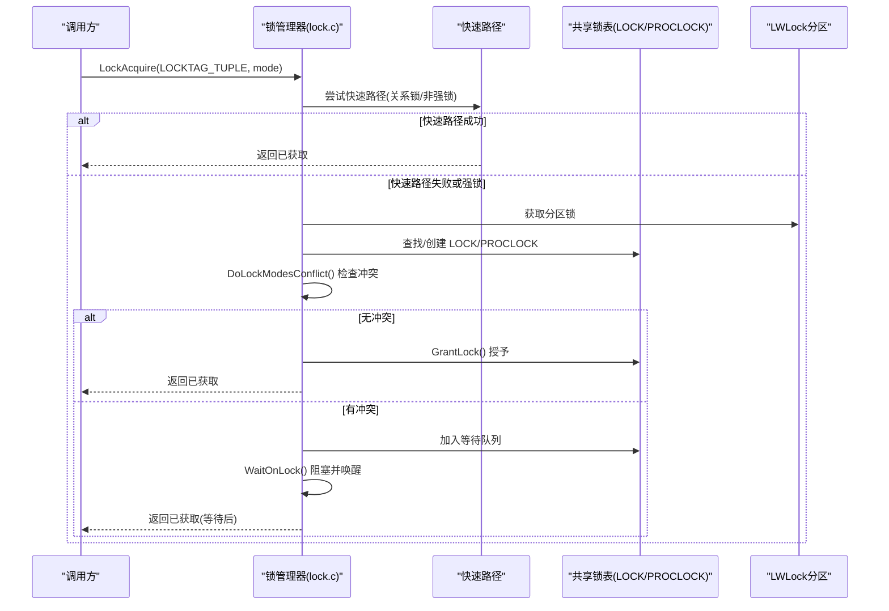
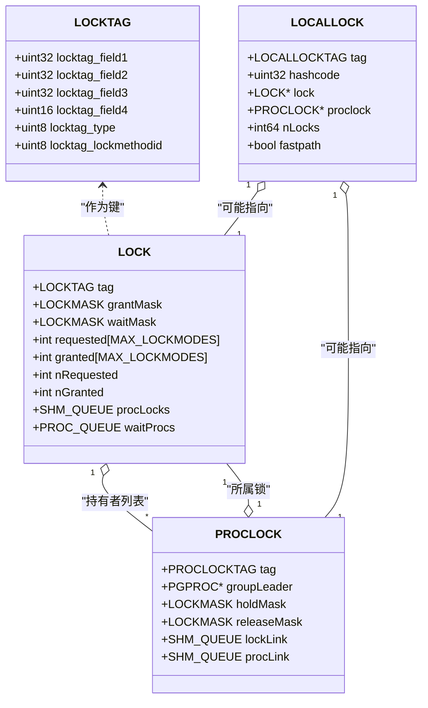
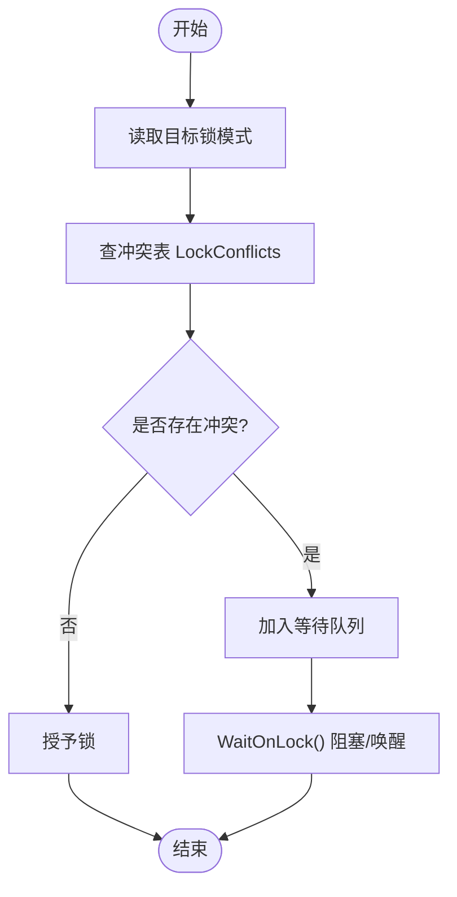
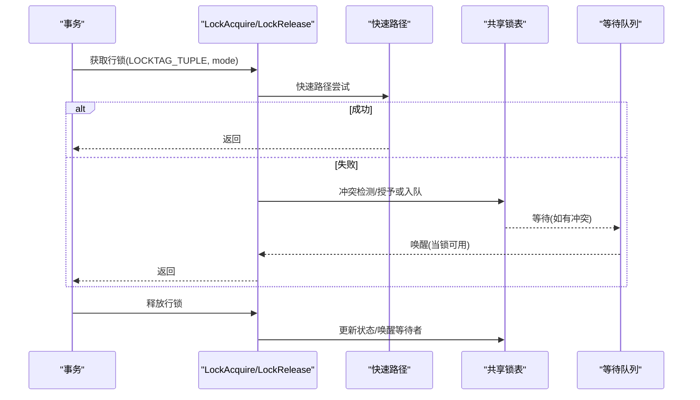
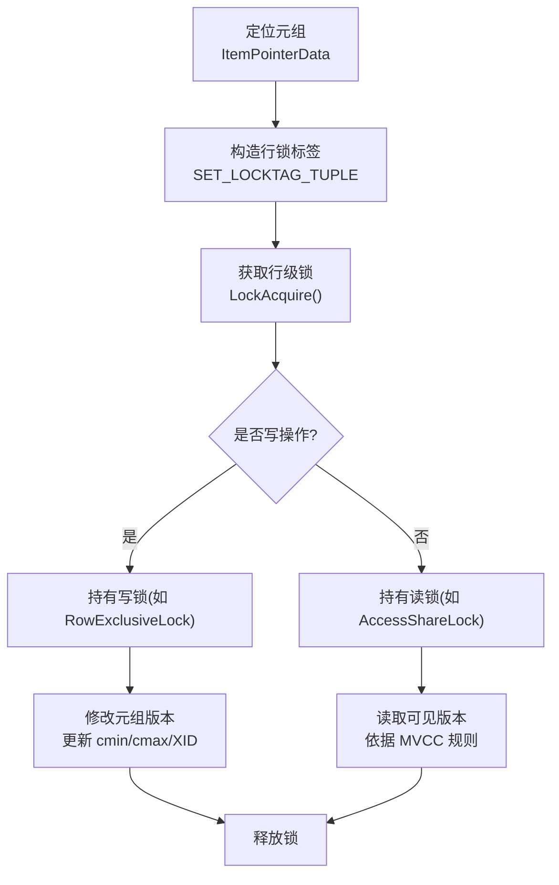
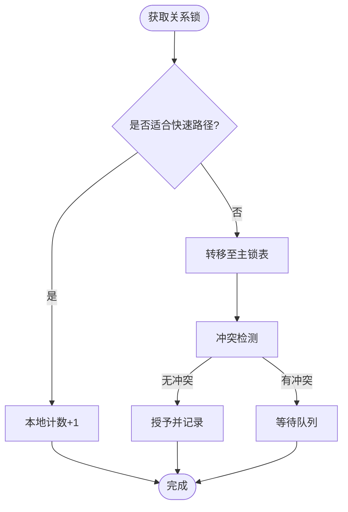
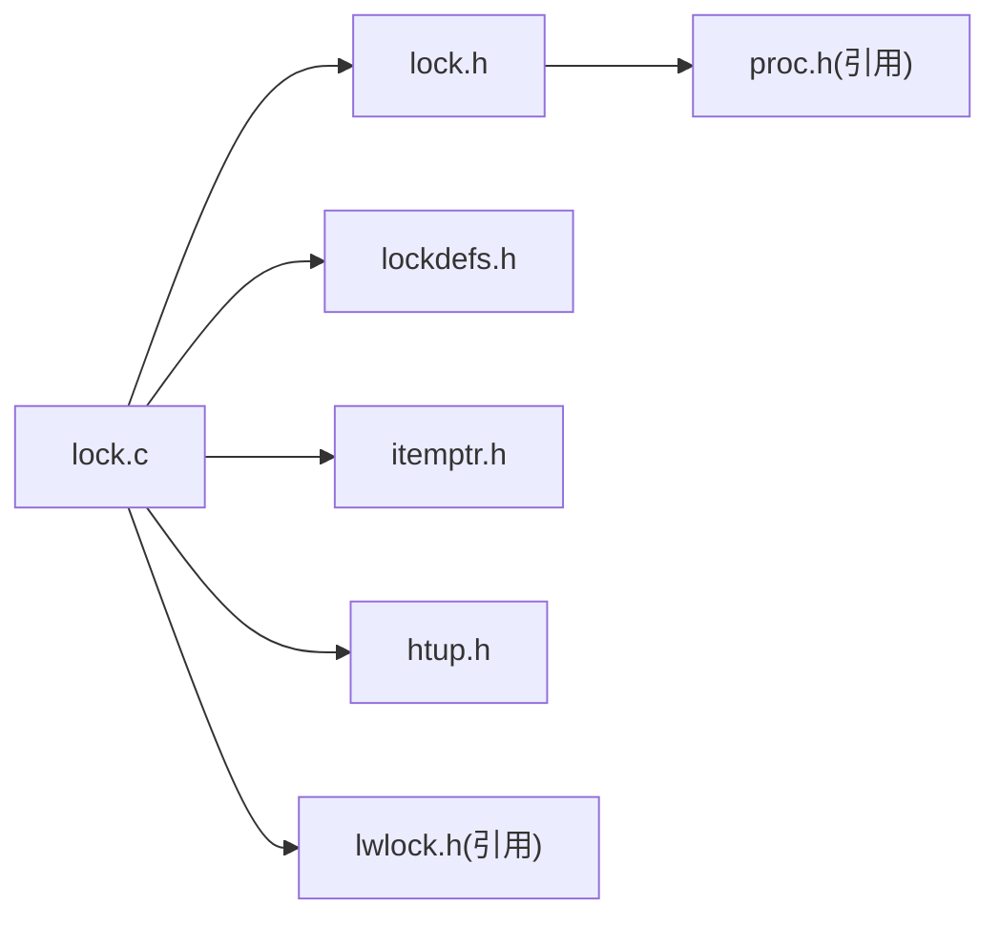

# 行级锁实现

<cite>
**本文引用的文件**
- [lock.h](file://src/include/storage/lock.h)
- [lockdefs.h](file://src/include/storage/lockdefs.h)
- [lock.c](file://src/backend/storage/lmgr/lock.c)
- [itemptr.h](file://src/include/storage/itemptr.h)
- [htup.h](file://src/include/access/htup.h)
</cite>

## 目录
1. [简介](#简介)
2. [项目结构](#项目结构)
3. [核心组件](#核心组件)
4. [架构总览](#架构总览)
5. [详细组件分析](#详细组件分析)
6. [依赖关系分析](#依赖关系分析)
7. [性能考虑](#性能考虑)
8. [故障排查指南](#故障排查指南)
9. [结论](#结论)
10. [附录](#附录)

## 简介
本文件面向 Mini PostgreSQL 的行级锁机制，系统性阐述其数据结构、获取与释放流程、锁模式语义与冲突矩阵、与 MVCC 元组版本的关系，以及快速路径与锁升级等优化策略。文档以源码为依据，提供代码级图示与可追溯的“章节来源”和“图示来源”，帮助读者从概念到实现逐步理解行级锁在数据库中的工作原理与最佳实践。

## 项目结构
Mini PostgreSQL 的锁子系统位于 storage/lmgr 目录，核心头文件定义于 include/storage，行级锁相关的数据结构与接口集中在 lock.h；锁模式与常量定义在 lockdefs.h；具体实现逻辑在 lock.c。行标识（TID）与元组访问接口分别由 itemptr.h 与 htup.h 提供，用于将行级锁与物理元组位置关联。

**图示来源**
- [lock.c:380-465](file://src/backend/storage/lmgr/lock.c#L380-L465)
- [lock.h:140-175](file://src/include/storage/lock.h#L140-L175)
- [lockdefs.h:33-48](file://src/include/storage/lockdefs.h#L33-L48)
- [itemptr.h:20-49](file://src/include/storage/itemptr.h#L20-L49)
- [htup.h:30-71](file://src/include/access/htup.h#L30-L71)

**章节来源**
- [lock.c:380-465](file://src/backend/storage/lmgr/lock.c#L380-L465)
- [lock.h:140-175](file://src/include/storage/lock.h#L140-L175)
- [lockdefs.h:33-48](file://src/include/storage/lockdefs.h#L33-L48)
- [itemptr.h:20-49](file://src/include/storage/itemptr.h#L20-L49)
- [htup.h:30-71](file://src/include/access/htup.h#L30-L71)

## 核心组件
- LOCKTAG：唯一标识被锁对象的结构体，包含类型与多字段 ID。行级锁使用 LOCKTAG_TUPLE，通过 SET_LOCKTAG_TUPLE 宏组合数据库 OID、关系 OID、块号与偏移号。
- LOCK：每个被锁对象的共享状态，包括已授予/等待的掩码、请求计数、持有者列表与等待队列。
- PROCLOCK：每个后端对某个锁对象的持有/等待记录，链接到 LOCK 与 PGPROC。
- LOCALLOCK：后端本地缓存的锁计数与资源所有者信息，支持快速路径与批量释放。
- LockMethodData/冲突表：描述每种锁模式的语义与冲突关系，默认方法定义了标准八种锁模式。
- 快速路径与强锁计数：针对关系锁的快速路径位图与强锁分区计数，减少共享内存访问。

**章节来源**
- [lock.h:140-175](file://src/include/storage/lock.h#L140-L175)
- [lock.h:300-314](file://src/include/storage/lock.h#L300-L314)
- [lock.h:354-372](file://src/include/storage/lock.h#L354-L372)
- [lock.h:400-433](file://src/include/storage/lock.h#L400-L433)
- [lock.c:65-105](file://src/backend/storage/lmgr/lock.c#L65-L105)
- [lock.c:165-259](file://src/backend/storage/lmgr/lock.c#L165-L259)

## 架构总览
行级锁围绕“对象标识—共享状态—本地缓存—等待队列”的层次组织。调用方通过 LOCKTAG 指定要锁定的行（基于 ItemPointer），进入锁管理器后，优先尝试快速路径；若失败或需要强锁，则转入共享锁表进行冲突检测、排队与授予。锁升级发生在本地计数达到阈值或发生冲突时，将快速路径持有的锁迁移至主锁表。

**图示来源**
- [lock.c:65-105](file://src/backend/storage/lmgr/lock.c#L65-L105)
- [lock.c:165-259](file://src/backend/storage/lmgr/lock.c#L165-L259)
- [lock.h:540-560](file://src/include/storage/lock.h#L540-L560)

## 详细组件分析

### 数据结构：LOCKTAG、LOCK、PROCLOCK、LOCALLOCK
- LOCKTAG：固定 16 字节，包含 locktag_type 与四个字段，行级锁类型为 LOCKTAG_TUPLE，通过 SET_LOCKTAG_TUPLE 设置 dboid/reloid/blocknum/offnum。
- LOCK：维护 grantMask/waitMask、requested/granted 计数、procLocks 链表与 waitProcs 队列。
- PROCLOCK：记录某后端在某锁上的 holdMask/releaseMask，并链接到 LOCK 与 PGPROC。
- LOCALLOCK：本地缓存 nLocks、lockOwners、fastpath 标志等，支持按 ResourceOwner 粒度释放。

**图示来源**
- [lock.h:140-175](file://src/include/storage/lock.h#L140-L175)
- [lock.h:300-314](file://src/include/storage/lock.h#L300-L314)
- [lock.h:354-372](file://src/include/storage/lock.h#L354-L372)
- [lock.h:400-433](file://src/include/storage/lock.h#L400-L433)

**章节来源**
- [lock.h:140-175](file://src/include/storage/lock.h#L140-L175)
- [lock.h:300-314](file://src/include/storage/lock.h#L300-L314)
- [lock.h:354-372](file://src/include/storage/lock.h#L354-L372)
- [lock.h:400-433](file://src/include/storage/lock.h#L400-L433)

### 锁模式与冲突矩阵
默认锁方法定义了八种标准锁模式，冲突表 LockConflicts 描述了各模式之间的互斥关系。例如：
- AccessShareLock：仅与 AccessExclusiveLock 冲突。
- RowShareLock：与 ExclusiveLock、AccessExclusiveLock 冲突。
- RowExclusiveLock：与 ShareLock、ShareRowExclusiveLock、ExclusiveLock、AccessExclusiveLock 冲突。
- ShareUpdateExclusiveLock：自冲突且与其他多种写锁冲突。
- ShareLock、ShareRowExclusiveLock、ExclusiveLock、AccessExclusiveLock：逐级增强互斥范围。

**图示来源**
- [lock.c:65-105](file://src/backend/storage/lmgr/lock.c#L65-L105)
- [lock.h:540-560](file://src/include/storage/lock.h#L540-L560)

**章节来源**
- [lockdefs.h:33-48](file://src/include/storage/lockdefs.h#L33-L48)
- [lock.c:65-105](file://src/backend/storage/lmgr/lock.c#L65-L105)

### 行级锁获取与释放流程
- 获取：LockAcquire() 先尝试快速路径（适用于关系锁且非强锁），失败则进入共享锁表，计算哈希、加分区锁、冲突检测、授予或入队等待。
- 释放：LockRelease() 递减本地计数，必要时清理共享状态并唤醒等待者。
- 批量释放：LockReleaseAll()/LockReleaseSession() 按事务或会话粒度释放所有锁。

**图示来源**
- [lock.c:165-259](file://src/backend/storage/lmgr/lock.c#L165-L259)
- [lock.h:540-560](file://src/include/storage/lock.h#L540-L560)

**章节来源**
- [lock.c:165-259](file://src/backend/storage/lmgr/lock.c#L165-L259)
- [lock.h:540-560](file://src/include/storage/lock.h#L540-L560)

### 行级锁与 MVCC 元组版本的关系
- 行级锁以 ItemPointerData（blockNumber + offsetNumber）精确定位物理元组位置，结合关系 OID 与数据库 OID 形成 LOCKTAG_TUPLE。
- 元组版本通过 HeapTupleHeader 的 cmin/cmax 与更新 XID 管理可见性；行级锁保护的是当前版本的修改一致性，MVCC 保证读一致性与并发可见性。
- 在 UPDATE/DELETE 等写操作中，行级锁确保同一时刻只有一个事务能修改特定元组；读操作通常持较轻的锁（如 AccessShareLock），避免阻塞写但允许并发读。

**图示来源**
- [itemptr.h:20-49](file://src/include/storage/itemptr.h#L20-L49)
- [lock.h:219-226](file://src/include/storage/lock.h#L219-L226)
- [htup.h:30-71](file://src/include/access/htup.h#L30-L71)

**章节来源**
- [itemptr.h:20-49](file://src/include/storage/itemptr.h#L20-L49)
- [lock.h:219-226](file://src/include/storage/lock.h#L219-L226)
- [htup.h:30-71](file://src/include/access/htup.h#L30-L71)

### 快速路径与锁升级机制
- 快速路径：针对关系锁的非强锁模式，使用后端本地的 fpLockBits 位图加速获取与释放，避免频繁访问共享内存。
- 强锁与转移：当存在强锁或冲突时，快速路径不可用，需将锁转移到主锁表（FastPathTransferRelationLocks）。
- 锁升级：本地计数增长或冲突触发时，LOCALLOCK 会升级为共享锁表中的正式条目，确保死锁检测与公平调度。

**图示来源**
- [lock.c:165-259](file://src/backend/storage/lmgr/lock.c#L165-L259)
- [lock.h:386-399](file://src/include/storage/lock.h#L386-L399)

**章节来源**
- [lock.c:165-259](file://src/backend/storage/lmgr/lock.c#L165-L259)
- [lock.h:386-399](file://src/include/storage/lock.h#L386-L399)

## 依赖关系分析
- 模块耦合：lock.c 依赖 lock.h 提供的数据结构与接口，依赖 lockdefs.h 的锁模式定义，依赖 itemptr.h/htup.h 进行元组定位与访问。
- 共享内存：LOCK/PROCLOCK 位于共享内存哈希表，受 LWLock 分区保护；LOCALLOCK 为后端私有，降低竞争。
- 外部集成：与事务系统、快照可见性、WAL 等协作，确保锁与 MVCC 的一致性。

**图示来源**
- [lock.c:30-51](file://src/backend/storage/lmgr/lock.c#L30-L51)
- [lock.h:21-25](file://src/include/storage/lock.h#L21-L25)
- [lockdefs.h:20-26](file://src/include/storage/lockdefs.h#L20-L26)
- [itemptr.h:14-19](file://src/include/storage/itemptr.h#L14-L19)
- [htup.h:14-19](file://src/include/access/htup.h#L14-L19)

**章节来源**
- [lock.c:30-51](file://src/backend/storage/lmgr/lock.c#L30-L51)
- [lock.h:21-25](file://src/include/storage/lock.h#L21-L25)
- [lockdefs.h:20-26](file://src/include/storage/lockdefs.h#L20-L26)
- [itemptr.h:14-19](file://src/include/storage/itemptr.h#L14-L19)
- [htup.h:14-19](file://src/include/access/htup.h#L14-L19)

## 性能考虑
- 快速路径：对常见读锁与轻写锁使用本地位图，显著减少共享内存访问与上下文切换。
- 分区锁：锁表按 NUM_LOCK_PARTITIONS 分区，降低热点竞争。
- 锁升级：仅在必要时将快速路径锁迁移到主锁表，平衡性能与正确性。
- 批量释放：按 ResourceOwner 或会话粒度释放，减少重复扫描与同步开销。

[本节为通用性能建议，不直接分析具体文件]

## 故障排查指南
- 死锁检测：通过 DeadLockCheck() 识别软/硬死锁，必要时调整锁顺序或超时策略。
- 等待链分析：利用 GetBlockerStatusData() 与 LockHasWaiters() 查看阻塞关系与等待者数量。
- 调试输出：启用 LOCK_DEBUG 相关开关，打印锁状态与进程信息，辅助定位问题。

**章节来源**
- [lock.h:596-609](file://src/include/storage/lock.h#L596-L609)
- [lock.c:279-354](file://src/backend/storage/lmgr/lock.c#L279-L354)

## 结论
Mini PostgreSQL 的行级锁以 LOCKTAG/LOCK/PROCLOCK/LOCALLOCK 为核心，结合快速路径与分区锁实现高性能与可扩展性。通过明确的锁模式与冲突矩阵，配合 MVCC 元组版本管理，既保证了并发读的性能，又确保了写操作的原子性与一致性。合理运用快速路径与锁升级机制，可在高并发场景下获得更优吞吐与更低延迟。

[本节为总结性内容，不直接分析具体文件]

## 附录
- 常用宏与接口
  - SET_LOCKTAG_TUPLE：构造行级锁标签
  - LockAcquire()/LockRelease()：获取与释放锁
  - DoLockModesConflict()：检查锁模式冲突
  - GrantLock()/RemoveFromWaitQueue()：授予与移除等待
- 参考路径
  - 行级锁标签构造：[lock.h:219-226](file://src/include/storage/lock.h#L219-L226)
  - 锁模式与冲突表：[lock.c:65-105](file://src/backend/storage/lmgr/lock.c#L65-L105)
  - 快速路径与强锁计数：[lock.c:165-259](file://src/backend/storage/lmgr/lock.c#L165-L259)
  - 元组定位与访问：[itemptr.h:20-49](file://src/include/storage/itemptr.h#L20-L49), [htup.h:30-71](file://src/include/access/htup.h#L30-L71)

[本节为补充说明，不直接分析具体文件]