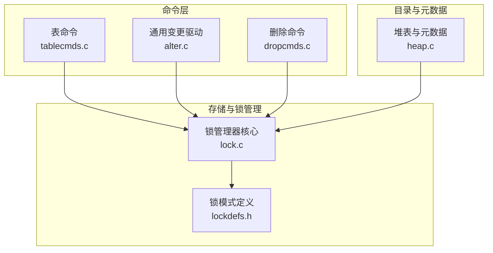
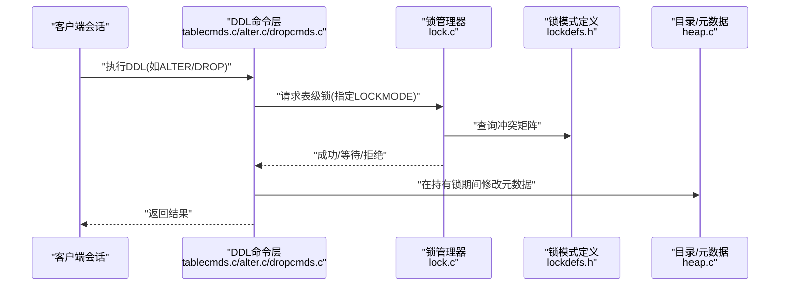
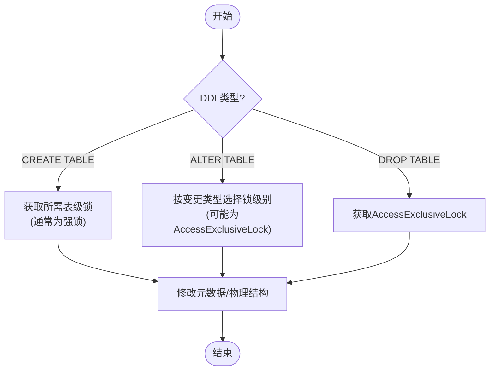
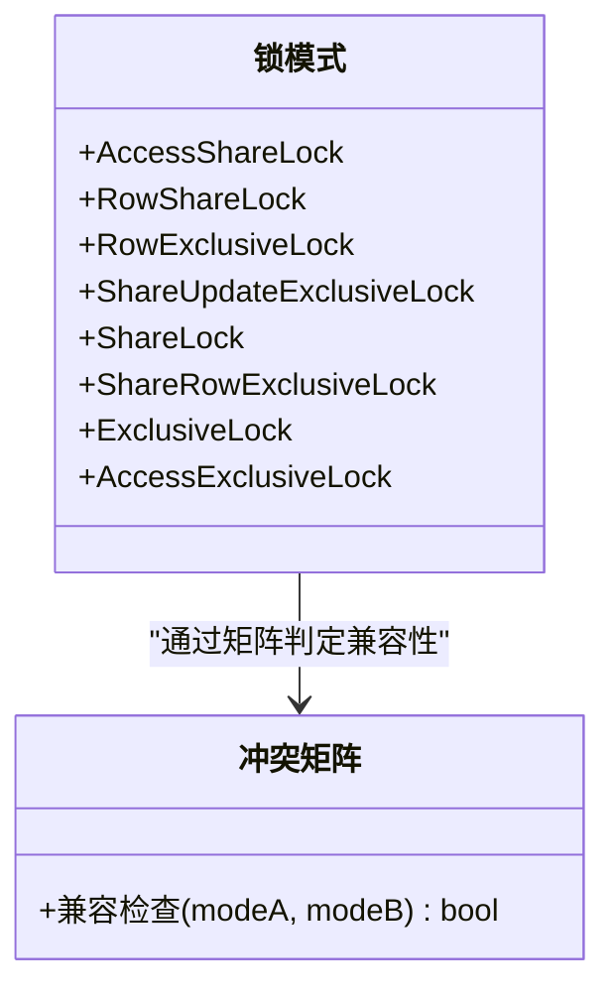
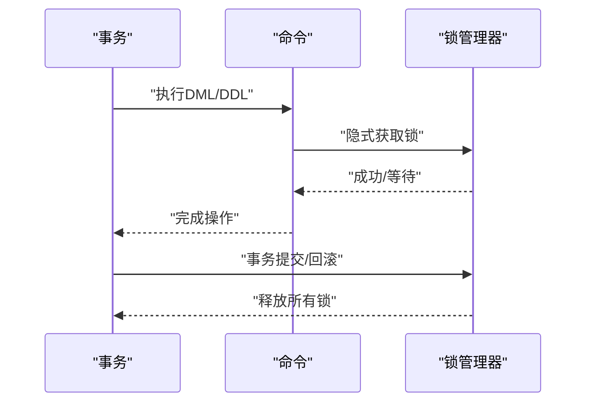
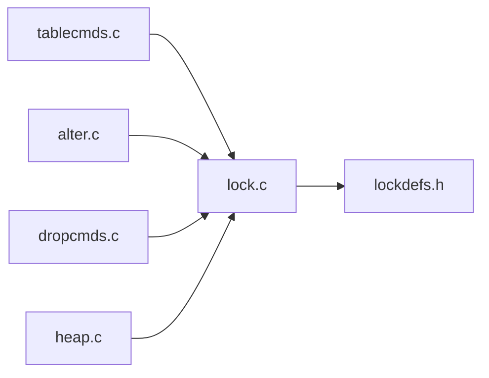

# 表级锁机制

<cite>
**本文引用的文件**
- [lockdefs.h](file://src/include/storage/lockdefs.h)
- [lock.c](file://src/backend/storage/lmgr/lock.c)
- [tablecmds.c](file://src/backend/commands/tablecmds.c)
- [alter.c](file://src/backend/commands/alter.c)
- [dropcmds.c](file://src/backend/commands/dropcmds.c)
- [heap.c](file://src/backend/catalog/heap.c)
</cite>

## 更新摘要
**所做更改**
- 移除了关于LOCK TABLE命令的显式锁获取说明
- 更新了锁获取时机与释放策略章节，明确用户无法通过LOCK TABLE语句显式锁定表
- 调整了相关示例和流程图，反映内部锁管理机制仍然存在但用户接口已移除
- 更新了故障排查指南，说明LOCK TABLE命令不可用的情况

## 目录
1. [简介](#简介)
2. [项目结构](#项目结构)
3. [核心组件](#核心组件)
4. [架构总览](#架构总览)
5. [详细组件分析](#详细组件分析)
6. [依赖关系分析](#依赖关系分析)
7. [性能考量](#性能考量)
8. [故障排查指南](#故障排查指南)
9. [结论](#结论)
10. [附录](#附录)

## 简介
本文件面向Mini PostgreSQL的表级锁机制，系统性说明表级锁的类型、作用域、获取与释放策略，以及在DDL（如CREATE TABLE、ALTER TABLE、DROP TABLE）中的具体应用。文档还涵盖表级锁与行级锁的交互关系、不同事务隔离级别下的行为差异、并发影响分析与调优建议，并提供DDL操作的锁获取流程图与实际使用示例路径。

**重要更新**：Mini PostgreSQL已完全移除LOCK TABLE命令，用户无法通过SQL语句显式获取表级锁。虽然内部锁管理机制仍然存在于事务隔离中，但不再提供用户级的显式表锁定功能。

## 项目结构
围绕表级锁的关键代码分布在以下模块：
- 锁模式定义与冲突矩阵：storage层头文件与lmgr实现
- DDL命令入口与锁获取：commands层的表操作、变更与删除命令
- 系统目录与元数据修改：catalog层对表结构的修改路径

**图表来源**
- [lockdefs.h:20-48](file://src/include/storage/lockdefs.h#L20-L48)
- [lock.c:60-105](file://src/backend/storage/lmgr/lock.c#L60-L105)
- [tablecmds.c:2280-2295](file://src/backend/commands/tablecmds.c#L2280-L2295)
- [alter.c:180-186](file://src/backend/commands/alter.c#L180-L186)
- [dropcmds.c:70-74](file://src/backend/commands/dropcmds.c#L70-L74)
- [heap.c:1520-1540](file://src/backend/catalog/heap.c#L1520-L1540)

**章节来源**
- [lockdefs.h:20-48](file://src/include/storage/lockdefs.h#L20-L48)
- [lock.c:60-105](file://src/backend/storage/lmgr/lock.c#L60-L105)

## 核心组件
- 锁模式与冲突矩阵：定义了AccessShareLock、RowShareLock、RowExclusiveLock、ShareUpdateExclusiveLock、ShareLock、ShareRowExclusiveLock、ExclusiveLock、AccessExclusiveLock等模式，以及各模式之间的互斥关系。
- 锁管理器：提供锁获取、释放、冲突检测、等待与唤醒等核心能力。
- DDL命令：在表创建、变更、删除过程中按需要获取相应级别的表级锁。
- 目录与元数据：在修改系统目录或表结构时，通常以强锁保护一致性。

**注意**：LOCK TABLE命令已从系统中完全移除，用户无法通过SQL语句显式获取表级锁。所有表级锁的获取都是通过内部机制自动完成的。

**章节来源**
- [lockdefs.h:28-48](file://src/include/storage/lockdefs.h#L28-L48)
- [lock.c:60-105](file://src/backend/storage/lmgr/lock.c#L60-L105)

## 架构总览
下图展示了DDL命令如何通过命令层调用锁管理器，并依据锁模式定义进行冲突检测与等待。

**图表来源**
- [tablecmds.c:2280-2295](file://src/backend/commands/tablecmds.c#L2280-L2295)
- [alter.c:180-186](file://src/backend/commands/alter.c#L180-L186)
- [dropcmds.c:70-74](file://src/backend/commands/dropcmds.c#L70-L74)
- [lock.c:60-105](file://src/backend/storage/lmgr/lock.c#L60-L105)
- [lockdefs.h:28-48](file://src/include/storage/lockdefs.h#L28-L48)

## 详细组件分析

### 锁模式与作用域
- AccessShareLock：读访问，允许与其他读共享，仅与写锁冲突。
- RowShareLock：SELECT FOR UPDATE/FOR SHARE使用，阻止独占写。
- RowExclusiveLock：INSERT/UPDATE/DELETE使用，阻止共享写。
- ShareUpdateExclusiveLock：VACUUM(非FULL)、ANALYZE、CREATE INDEX CONCURRENTLY等后台维护操作使用，避免并发索引构建冲突。
- ShareLock：例如普通CREATE INDEX，阻止写入但允许多个共享读。
- ShareRowExclusiveLock：类似EXCLUSIVE但允许ROW SHARE。
- ExclusiveLock：阻塞ROW SHARE/SELECT...FOR UPDATE等。
- AccessExclusiveLock：最严格锁，用于ALTER TABLE、DROP TABLE、VACUUM FULL等操作，阻塞所有其他锁。

冲突矩阵由锁管理器维护，确保任意两个锁模式的兼容性判定一致。

**章节来源**
- [lockdefs.h:33-48](file://src/include/storage/lockdefs.h#L33-L48)
- [lock.c:65-105](file://src/backend/storage/lmgr/lock.c#L65-L105)

### DDL中的表级锁应用
- CREATE TABLE：通常在创建阶段以强锁保护元数据一致性，随后在后续步骤中可能根据子操作类型获取更细粒度锁。
- ALTER TABLE：根据变更类型选择合适锁级别；涉及重写或破坏性变更时使用AccessExclusiveLock。
- DROP TABLE：以AccessExclusiveLock确保无并发读写。
- 重命名/移动Schema：通过通用变更驱动获取AccessExclusiveLock后执行。

**图表来源**
- [tablecmds.c:2280-2295](file://src/backend/commands/tablecmds.c#L2280-L2295)
- [alter.c:180-186](file://src/backend/commands/alter.c#L180-L186)
- [dropcmds.c:70-74](file://src/backend/commands/dropcmds.c#L70-L74)

**章节来源**
- [tablecmds.c:2280-2295](file://src/backend/commands/tablecmds.c#L2280-L2295)
- [alter.c:180-186](file://src/backend/commands/alter.c#L180-L186)
- [dropcmds.c:70-74](file://src/backend/commands/dropcmds.c#L70-L74)

### 表级锁与行级锁的交互
- 读操作（SELECT）通常获取AccessShareLock，可与其它读共享，但与写锁冲突。
- 写操作（INSERT/UPDATE/DELETE）获取RowExclusiveLock，阻止共享写与独占写。
- SELECT FOR UPDATE/FOR SHARE获取RowShareLock，阻止独占写。
- 后台维护（VACUUM/ANALYZE/CONCURRENTLY索引）使用ShareUpdateExclusiveLock，避免与索引构建冲突。
- 强锁（ExclusiveLock/AccessExclusiveLock）会阻塞几乎所有其他锁，保证DDL原子性与一致性。

**图表来源**
- [lockdefs.h:33-48](file://src/include/storage/lockdefs.h#L33-L48)
- [lock.c:65-105](file://src/backend/storage/lmgr/lock.c#L65-L105)

**章节来源**
- [lockdefs.h:33-48](file://src/include/storage/lockdefs.h#L33-L48)
- [lock.c:65-105](file://src/backend/storage/lmgr/lock.c#L65-L105)

### 锁获取时机与释放策略
- 隐式锁：大多数DML/DDL在执行过程中自动获取所需锁，无需显式声明。
- **重要更新**：LOCK TABLE命令已从系统中完全移除，用户无法通过SQL语句显式获取特定级别的表级锁。所有表级锁的获取都是通过内部机制自动完成的。
- 释放策略：锁在事务结束时统一释放；部分短生命周期锁（如扩展锁）在操作完成后立即释放，避免长时间持有。

**图表来源**
- [lock.c:165-186](file://src/backend/storage/lmgr/lock.c#L165-L186)

**章节来源**
- [lock.c:165-186](file://src/backend/storage/lmgr/lock.c#L165-L186)

### 不同事务隔离级别下的行为差异
- 读已提交/可重复读/串行化：表级锁的获取与冲突判定遵循相同规则；隔离级别主要影响可见性与快照语义，不改变表级锁的基本兼容性。
- 强锁（如AccessExclusiveLock）在任何隔离级别下都会阻塞其他会话对该表的访问，确保DDL的原子性。

[本节为概念性说明，不直接分析具体文件]

### DDL操作的锁获取流程（实际示例路径）
- CREATE TABLE：参考表命令中对目标关系的打开与锁获取位置。
- ALTER TABLE：参考表命令中针对不同类型变更的锁选择逻辑。
- DROP TABLE：参考删除命令中对对象地址获取时的锁参数。

**章节来源**
- [tablecmds.c:2280-2295](file://src/backend/commands/tablecmds.c#L2280-L2295)
- [alter.c:180-186](file://src/backend/commands/alter.c#L180-L186)
- [dropcmds.c:70-74](file://src/backend/commands/dropcmds.c#L70-L74)

## 依赖关系分析
- 命令层依赖锁管理器进行锁获取与冲突检测。
- 锁管理器依赖锁模式定义与冲突矩阵。
- 目录层在修改元数据前需持有合适的表级锁，确保一致性。

**图表来源**
- [tablecmds.c:2280-2295](file://src/backend/commands/tablecmds.c#L2280-L2295)
- [alter.c:180-186](file://src/backend/commands/alter.c#L180-L186)
- [dropcmds.c:70-74](file://src/backend/commands/dropcmds.c#L70-L74)
- [heap.c:1520-1540](file://src/backend/catalog/heap.c#L1520-L1540)
- [lock.c:60-105](file://src/backend/storage/lmgr/lock.c#L60-L105)
- [lockdefs.h:28-48](file://src/include/storage/lockdefs.h#L28-L48)

**章节来源**
- [lock.c:60-105](file://src/backend/storage/lmgr/lock.c#L60-L105)
- [lockdefs.h:28-48](file://src/include/storage/lockdefs.h#L28-L48)

## 性能考量
- 锁粒度与并发：尽量使用较细粒度的锁（如RowExclusiveLock）以提升并发；仅在必要时使用强锁（AccessExclusiveLock）。
- 长事务影响：长事务持有锁会延长阻塞时间，应拆分大事务或优化批处理。
- 后台任务：VACUUM/ANALYZE/CONCURRENTLY索引使用ShareUpdateExclusiveLock，避免与索引构建冲突，但仍需注意与DDL的协调。
- 配置参数：max_locks_per_xact影响每事务最大锁数量，应根据工作负载调整以避免锁表溢出。

**重要更新**：由于LOCK TABLE命令已被移除，用户无法通过显式锁来获取更细粒度的控制，这简化了锁管理但也减少了灵活性。

[本节提供一般性指导，不直接分析具体文件]

## 故障排查指南
- 死锁检测：锁管理器包含死锁检测逻辑，出现循环等待时会主动解除。
- 常见错误：当请求的锁与现有锁冲突且无法立即授予时，会话将进入等待；若超时或检测到死锁，将返回错误。
- **重要更新**：如果尝试使用LOCK TABLE命令，将收到语法错误或命令不支持的错误消息，因为该命令已从Mini PostgreSQL中完全移除。
- 诊断要点：查看当前持有的锁、等待的锁及冲突来源，结合DDL执行路径定位问题。

**章节来源**
- [deadlock.c](file://src/backend/storage/lmgr/deadlock.c)

## 结论
Mini PostgreSQL的表级锁机制通过明确的锁模式与冲突矩阵，保障DDL操作的原子性与一致性。命令层在适当时机获取合适级别的锁，并在事务结束时释放。虽然LOCK TABLE命令已被移除，但内部的表级锁管理机制仍然完整存在，只是不再提供用户级的显式锁控制功能。合理选择锁级别、控制事务长度与后台任务调度，是提升并发性能的关键。

[本节为总结性内容，不直接分析具体文件]

## 附录
- 实际使用示例路径（不展示代码内容）：
  - CREATE TABLE锁获取位置：[tablecmds.c:2280-2295](file://src/backend/commands/tablecmds.c#L2280-L2295)
  - ALTER TABLE锁获取位置：[tablecmds.c:2280-2295](file://src/backend/commands/tablecmds.c#L2280-L2295)
  - DROP TABLE锁获取位置：[dropcmds.c:70-74](file://src/backend/commands/dropcmds.c#L70-L74)
  - 重命名/移动Schema锁获取位置：[alter.c:180-186](file://src/backend/commands/alter.c#L180-L186)
  - 目录层强锁使用示例：[heap.c:1520-1540](file://src/backend/catalog/heap.c#L1520-L1540)

**重要更新**：LOCK TABLE命令已完全移除，不再提供任何显式表锁定的SQL语法支持。

[本节为引用路径汇总，不直接分析具体文件]