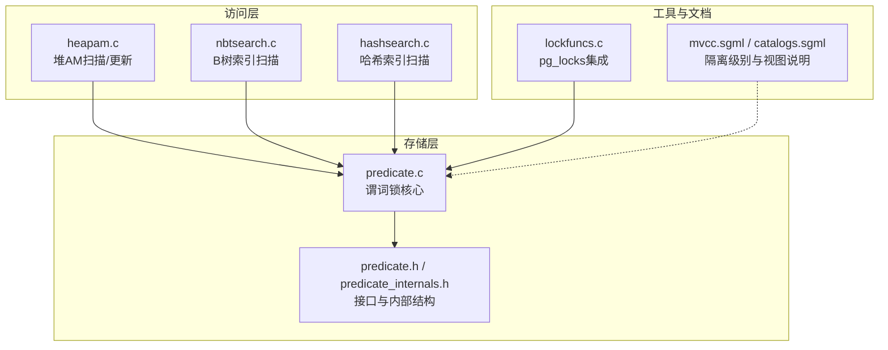
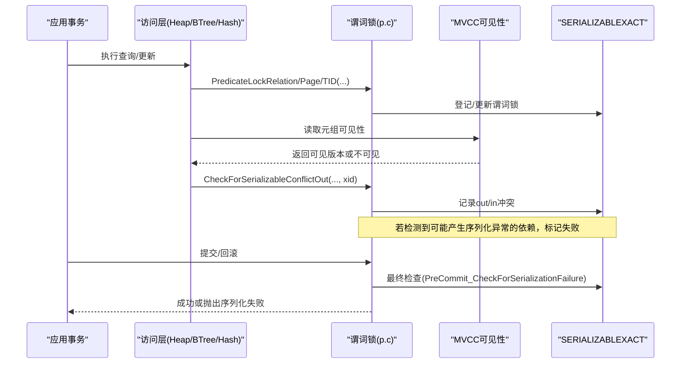
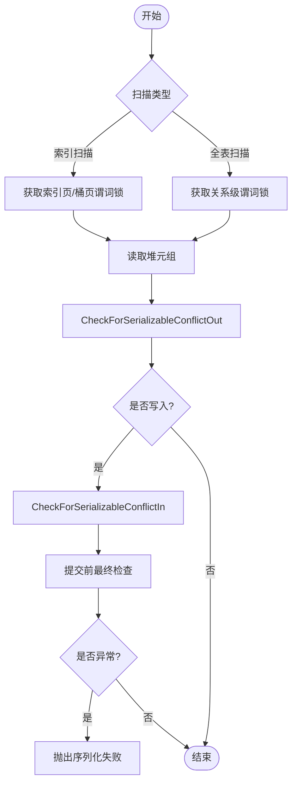
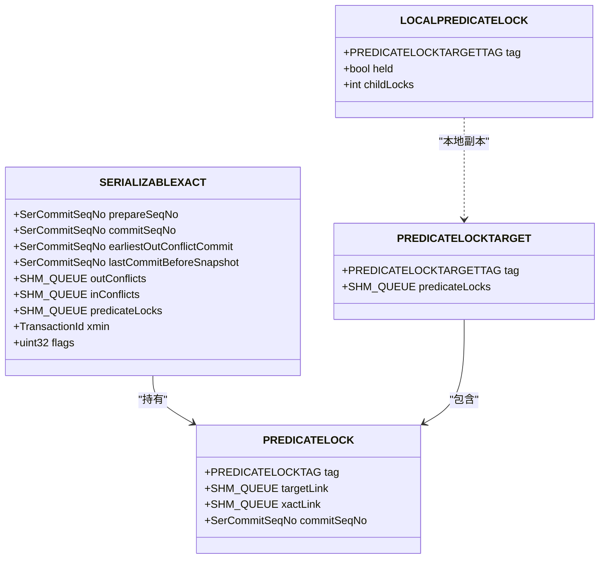
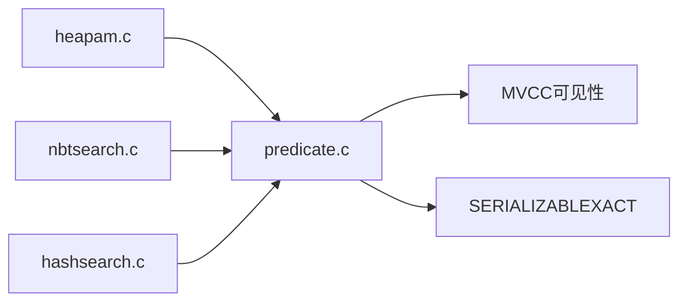

# 谓词锁系统

<cite>
**本文引用的文件**
- [predicate.c](file://src/backend/storage/lmgr/predicate.c)
- [predicate.h](file://src/include/storage/predicate.h)
- [predicate_internals.h](file://src/include/storage/predicate_internals.h)
- [mvcc.sgml](file://doc/src/sgml/mvcc.sgml)
- [heapam.c](file://src/backend/access/heap/heapam.c)
- [nbtsearch.c](file://src/backend/access/nbtree/nbtsearch.c)
- [hashsearch.c](file://src/backend/access/hash/hashsearch.c)
- [lockfuncs.c](file://src/backend/utils/adt/lockfuncs.c)
- [catalogs.sgml](file://doc/src/sgml/catalogs.sgml)
</cite>

## 目录
1. [简介](#简介)
2. [项目结构](#项目结构)
3. [核心组件](#核心组件)
4. [架构总览](#架构总览)
5. [详细组件分析](#详细组件分析)
6. [依赖关系分析](#依赖关系分析)
7. [性能考量与优化](#性能考量与优化)
8. [故障排查指南](#故障排查指南)
9. [结论](#结论)
10. [附录](#附录)

## 简介
本文件系统性阐述 Mini PostgreSQL 中的谓词锁（Predicate Locking）子系统，重点解释其在可重复读（Repeatable Read）与串行化（Serializable）隔离级别中的作用机制，覆盖范围查询冲突检测、索引扫描与全表扫描的不同处理方式、核心数据结构（如 SERIALIZABLEXACT、PREDICATELOCKTARGET、PREDICATELOCK、LOCALPREDICATELOCK 等）、与 MVCC 的一致性保证、幻读防护、性能影响与优化策略，以及监控视图与调试方法。文档同时对比不同隔离级别下的行为差异，并给出实际应用场景建议。

## 项目结构
谓词锁实现主要位于存储层锁管理器（lmgr）的 predicate 模块，配合访问层（access）各 AM（Heap、BTree、Hash）在扫描路径中插入谓词锁获取与冲突检查点；公共接口定义于 include/storage 下；文档说明位于 doc/src/sgml。

图表来源
- [predicate.c:2514-2592](file://src/backend/storage/lmgr/predicate.c#L2514-L2592)
- [predicate.h:43-85](file://src/include/storage/predicate.h#L43-L85)
- [predicate_internals.h:57-116](file://src/include/storage/predicate_internals.h#L57-L116)
- [heapam.c:1233-1252](file://src/backend/access/heap/heapam.c#L1233-L1252)
- [nbtsearch.c:1383-1408](file://src/backend/access/nbtree/nbtsearch.c#L1383-L1408)
- [hashsearch.c:175-352](file://src/backend/access/hash/hashsearch.c#L175-L352)
- [lockfuncs.c:88-110](file://src/backend/utils/adt/lockfuncs.c#L88-L110)
- [mvcc.sgml:570-769](file://doc/src/sgml/mvcc.sgml#L570-L769)
- [catalogs.sgml:9672-9693](file://doc/src/sgml/catalogs.sgml#L9672-L9693)

章节来源
- [predicate.c:2514-2592](file://src/backend/storage/lmgr/predicate.c#L2514-L2592)
- [predicate.h:43-85](file://src/include/storage/predicate.h#L43-L85)
- [predicate_internals.h:57-116](file://src/include/storage/predicate_internals.h#L57-L116)
- [heapam.c:1233-1252](file://src/backend/access/heap/heapam.c#L1233-L1252)
- [nbtsearch.c:1383-1408](file://src/backend/access/nbtree/nbtsearch.c#L1383-L1408)
- [hashsearch.c:175-352](file://src/backend/access/hash/hashsearch.c#L175-L352)
- [lockfuncs.c:88-110](file://src/backend/utils/adt/lockfuncs.c#L88-L110)
- [mvcc.sgml:570-769](file://doc/src/sgml/mvcc.sgml#L570-L769)
- [catalogs.sgml:9672-9693](file://doc/src/sgml/catalogs.sgml#L9672-L9693)

## 核心组件
- SERIALIZABLEXACT：每个参与串行化的事务对象，维护提交序列号、冲突列表（in/out）、谓词锁链表、安全快照标志等。
- PREDICATELOCKTARGETTAG/PREDICATELOCKTARGET：锁目标标识与共享内存中的目标条目，包含该目标上的所有谓词锁。
- PREDICATELOCKTAG/PREDICATELOCK：具体锁项，绑定到目标与事务，支持粒度提升（relation/page/tuple）。
- LOCALPREDICATELOCK：本地缓存，用于快速判断是否需要粒度提升与清理子锁。
- 冲突检测函数族：CheckForSerializableConflictOut/In、CheckTableForSerializableConflictIn 等，结合 MVCC 可见性判定读写依赖。
- 监控接口：GetPredicateLockStatusData、PageIsPredicateLocked 等，供 pg_locks 等视图使用。

章节来源
- [predicate_internals.h:57-116](file://src/include/storage/predicate_internals.h#L57-L116)
- [predicate_internals.h:282-343](file://src/include/storage/predicate_internals.h#L282-L343)
- [predicate_internals.h:362-382](file://src/include/storage/predicate_internals.h#L362-L382)
- [predicate.h:43-85](file://src/include/storage/predicate.h#L43-L85)
- [predicate.c:1431-1467](file://src/backend/storage/lmgr/predicate.c#L1431-L1467)
- [predicate.c:2002-2040](file://src/backend/storage/lmgr/predicate.c#L2002-L2040)

## 架构总览
谓词锁在 Serializable 隔离级别下工作，通过记录“读取了哪些数据”和“写入了哪些数据”，并在提交前或写入时检测潜在的读写依赖环，从而避免序列化异常（包括幻读）。其关键流程如下：

图表来源
- [predicate.c:2514-2592](file://src/backend/storage/lmgr/predicate.c#L2514-L2592)
- [predicate.c:4114-4201](file://src/backend/storage/lmgr/predicate.c#L4114-L4201)
- [predicate.c:4701-4781](file://src/backend/storage/lmgr/predicate.c#L4701-L4781)
- [mvcc.sgml:570-769](file://doc/src/sgml/mvcc.sgml#L570-L769)

## 详细组件分析

### 1) 隔离级别与谓词锁的作用
- Repeatable Read：提供稳定快照，但不检测跨事务的读写依赖环；不启用谓词锁跟踪。
- Serializable：在 Repeatable Read 基础上增加谓词锁跟踪与冲突检测，确保并发执行等价于某种串行顺序；当检测到可能导致序列化异常的依赖组合时，触发序列化失败（允许应用重试）。

章节来源
- [mvcc.sgml:570-769](file://doc/src/sgml/mvcc.sgml#L570-L769)

### 2) 范围查询冲突检测算法
- 索引扫描（BTree/Hash）：
  - 在扫描过程中对访问到的索引页或桶页获取谓词锁（页面级），以减少细粒度锁数量。
  - 对于定位到的堆元组，必要时获取元组级谓词锁以精确捕获读写冲突。
- 全表扫描：
  - 直接获取关系级谓词锁，避免逐行/逐页锁带来的开销。
- 冲突检测时机：
  - 读取时：调用 CheckForSerializableConflictOut，若发现读取的版本由其他并发事务修改且不可见，则建立 out 冲突边。
  - 写入时：调用 CheckForSerializableConflictIn，若写入位置被其他事务读取过，则建立 in 冲突边。
  - 提交前：进行最终检查，若存在可能形成依赖环的情况，则中止当前事务。

图表来源
- [nbtsearch.c:1383-1408](file://src/backend/access/nbtree/nbtsearch.c#L1383-L1408)
- [hashsearch.c:175-352](file://src/backend/access/hash/hashsearch.c#L175-L352)
- [heapam.c:1233-1252](file://src/backend/access/heap/heapam.c#L1233-L1252)
- [predicate.c:4114-4201](file://src/backend/storage/lmgr/predicate.c#L4114-L4201)
- [predicate.c:4701-4781](file://src/backend/storage/lmgr/predicate.c#L4701-L4781)

章节来源
- [nbtsearch.c:1383-1408](file://src/backend/access/nbtree/nbtsearch.c#L1383-L1408)
- [hashsearch.c:175-352](file://src/backend/access/hash/hashsearch.c#L175-L352)
- [heapam.c:1233-1252](file://src/backend/access/heap/heapam.c#L1233-L1252)
- [predicate.c:4114-4201](file://src/backend/storage/lmgr/predicate.c#L4114-L4201)
- [predicate.c:4701-4781](file://src/backend/storage/lmgr/predicate.c#L4701-L4781)

### 3) 数据结构与关系

图表来源
- [predicate_internals.h:57-116](file://src/include/storage/predicate_internals.h#L57-L116)
- [predicate_internals.h:299-343](file://src/include/storage/predicate_internals.h#L299-L343)
- [predicate_internals.h:362-370](file://src/include/storage/predicate_internals.h#L362-L370)

章节来源
- [predicate_internals.h:57-116](file://src/include/storage/predicate_internals.h#L57-L116)
- [predicate_internals.h:299-343](file://src/include/storage/predicate_internals.h#L299-L343)
- [predicate_internals.h:362-370](file://src/include/storage/predicate_internals.h#L362-L370)

### 4) 与 MVCC 的一致性保证与幻读防护
- 一致性：Serializable 通过谓词锁记录读取集与写入集，并结合 MVCC 快照可见性，在提交阶段验证是否存在可能的依赖环。若存在，则拒绝提交，从而保证结果等价于某种串行执行。
- 幻读防护：范围查询通过页面/元组级谓词锁锁定“可能被影响的结果集”。后续写入若与这些锁冲突，将触发冲突检测，避免在相同条件下出现“新增/删除”的幻读现象。

章节来源
- [mvcc.sgml:570-769](file://doc/src/sgml/mvcc.sgml#L570-L769)
- [predicate.c:4114-4201](file://src/backend/storage/lmgr/predicate.c#L4114-L4201)
- [predicate.c:4701-4781](file://src/backend/storage/lmgr/predicate.c#L4701-L4781)

### 5) 粒度提升与内存优化
- 粒度提升：当同一目标的细粒度锁（如元组级）数量超过阈值时，自动提升到更粗粒度（页级或关系级），减少锁表大小与冲突检测成本。
- 本地缓存：LOCALPREDICATELOCK 为每事务维护本地哈希，加速判断是否需要提升与清理子锁。
- 只读安全快照：只读事务若被判定为“安全”，可提前释放谓词锁，降低开销。

章节来源
- [predicate.c:2329-2369](file://src/backend/storage/lmgr/predicate.c#L2329-L2369)
- [predicate.c:2514-2569](file://src/backend/storage/lmgr/predicate.c#L2514-L2569)
- [predicate.c:528-549](file://src/backend/storage/lmgr/predicate.c#L528-L549)

### 6) 监控视图与调试
- pg_locks：集成常规锁与谓词锁信息，便于观察 SIReadLock 等谓词锁状态。
- GetPredicateLockStatusData：收集当前所有谓词锁的目标与事务信息，供上层视图展示。
- PageIsPredicateLocked：查询某页是否被谓词锁保护。
- 调试：可通过 LWLock 统计与日志开关辅助定位热点与等待情况。

章节来源
- [lockfuncs.c:88-110](file://src/backend/utils/adt/lockfuncs.c#L88-L110)
- [predicate.c:1431-1467](file://src/backend/storage/lmgr/predicate.c#L1431-L1467)
- [predicate.c:2002-2040](file://src/backend/storage/lmgr/predicate.c#L2002-L2040)
- [catalogs.sgml:9672-9693](file://doc/src/sgml/catalogs.sgml#L9672-L9693)

## 依赖关系分析
谓词锁与访问层紧密耦合：
- Heap AM：在全表扫描或特定更新路径中获取关系级或元组级谓词锁。
- BTree/Hash 索引：在扫描过程中获取页面/桶级谓词锁，并对命中元组进行冲突检测。
- 冲突检测：基于 MVCC 可见性与事务提交序列号，构建读写依赖图，提交前检测环。

图表来源
- [heapam.c:1233-1252](file://src/backend/access/heap/heapam.c#L1233-L1252)
- [nbtsearch.c:1383-1408](file://src/backend/access/nbtree/nbtsearch.c#L1383-L1408)
- [hashsearch.c:175-352](file://src/backend/access/hash/hashsearch.c#L175-L352)
- [predicate.c:4114-4201](file://src/backend/storage/lmgr/predicate.c#L4114-L4201)

章节来源
- [heapam.c:1233-1252](file://src/backend/access/heap/heapam.c#L1233-L1252)
- [nbtsearch.c:1383-1408](file://src/backend/access/nbtree/nbtsearch.c#L1383-L1408)
- [hashsearch.c:175-352](file://src/backend/access/hash/hashsearch.c#L175-L352)
- [predicate.c:4114-4201](file://src/backend/storage/lmgr/predicate.c#L4114-L4201)

## 性能考量与优化
- 锁粒度控制：通过阈值驱动的粒度提升（tuple→page→relation）降低锁表规模与冲突检测成本。
- 只读优化：只读事务可尽早判定为安全快照并释放谓词锁，减少后续开销。
- 扫描路径选择：优先使用索引扫描以减少访问的页面/元组数量，从而降低谓词锁数量。
- 连接池与事务长度：控制活跃连接数与事务持续时间，避免长事务持有过多谓词锁导致冲突概率上升。
- 监控与调优：利用 pg_locks 与 LWLock 统计观察热点与等待，调整查询计划与索引设计。

[本节为通用指导，无需特定文件引用]

## 故障排查指南
- 常见错误：序列化失败（SQLSTATE 40001），提示因读写依赖导致无法串行化。
- 定位步骤：
  - 使用 pg_locks 查看 SIReadLock 及常规锁分布，识别热点关系与页面。
  - 检查范围查询是否使用了合适的索引，避免全表扫描导致的过多谓词锁。
  - 审查事务逻辑，尽量缩小事务范围，减少跨多表的读写依赖。
  - 开启 LWLock 调试输出，分析锁竞争与等待热点。
- 恢复策略：应用层捕获序列化失败并重试；必要时重构业务逻辑以避免冲突模式。

章节来源
- [mvcc.sgml:570-769](file://doc/src/sgml/mvcc.sgml#L570-L769)
- [catalogs.sgml:9672-9693](file://doc/src/sgml/catalogs.sgml#L9672-L9693)
- [predicate.c:4114-4201](file://src/backend/storage/lmgr/predicate.c#L4114-L4201)

## 结论
Mini PostgreSQL 的谓词锁系统在 Serializable 隔离级别下，通过记录读取与写入的数据范围，并结合 MVCC 可见性，在提交阶段检测潜在依赖环，有效防止序列化异常与幻读。通过粒度提升、只读优化与监控手段，系统在正确性与性能之间取得平衡。合理设计查询与事务、选择合适的隔离级别，是发挥该子系统优势的关键。

[本节为总结，无需特定文件引用]

## 附录
- 不同隔离级别行为对比
  - Repeatable Read：稳定快照，无谓词锁跟踪，不检测依赖环。
  - Serializable：谓词锁跟踪+冲突检测，可能触发序列化失败，但保证等价于串行执行。
- 实际应用场景
  - 金融结算、库存扣减等强一致性场景推荐使用 Serializable。
  - 报表与分析类只读负载可考虑 READ ONLY DEFERRABLE 以获得最佳性能。

[本节为概念性内容，无需特定文件引用]