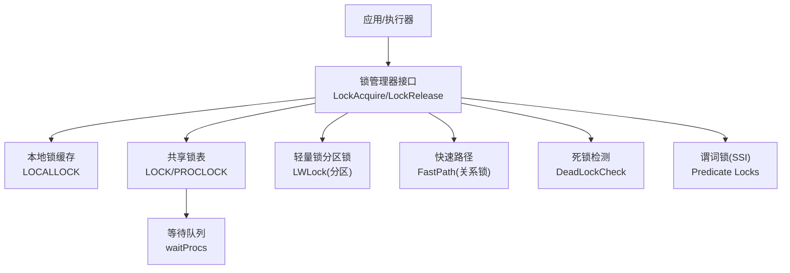
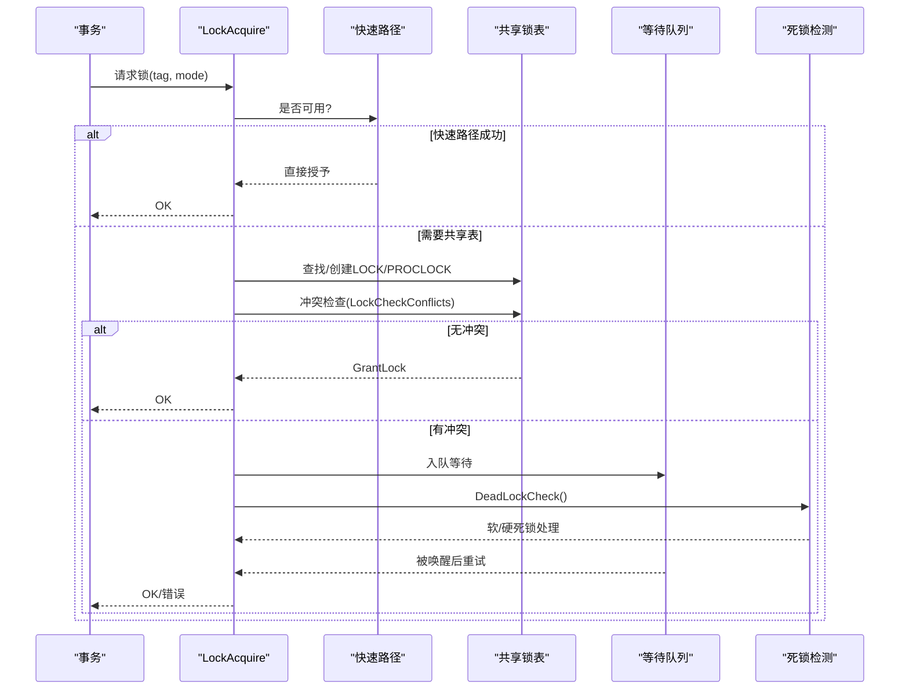
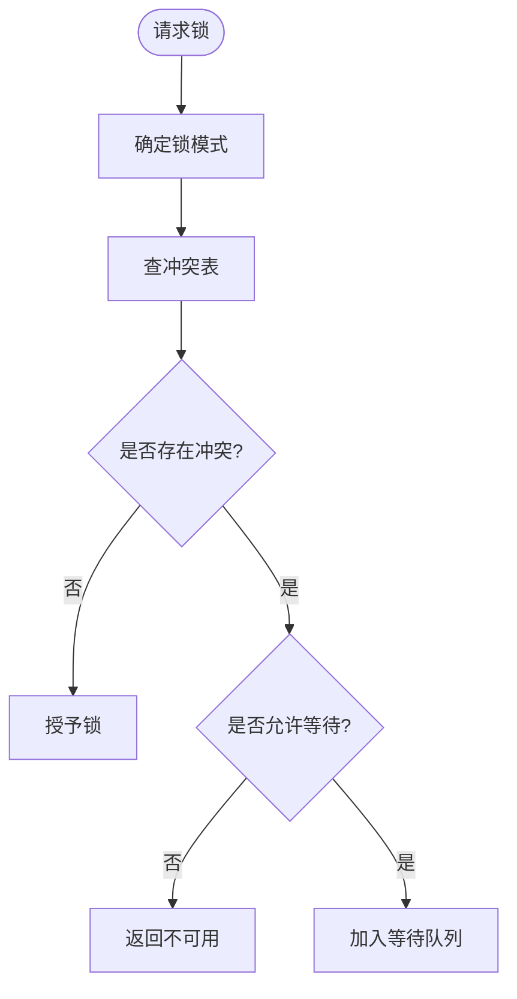
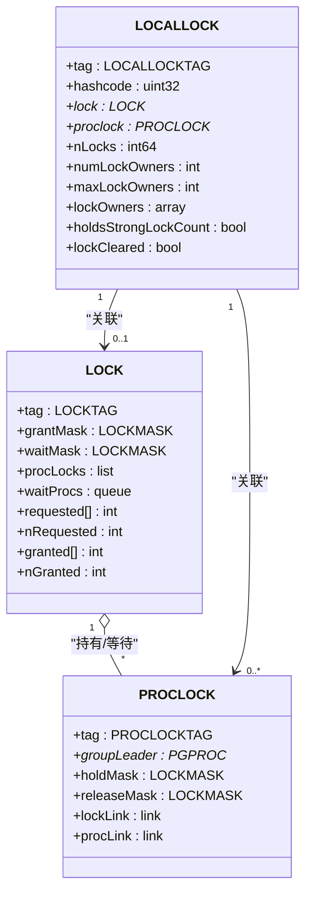
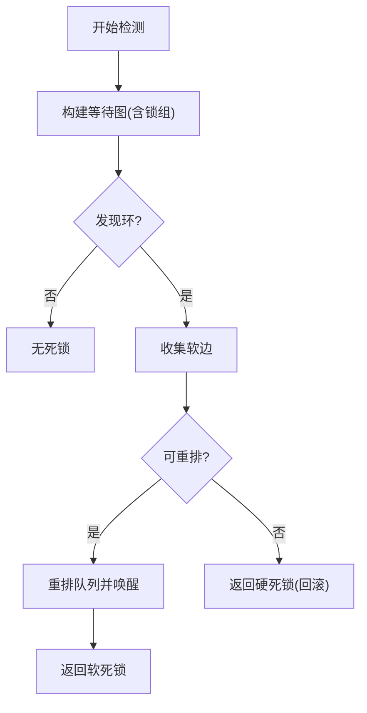
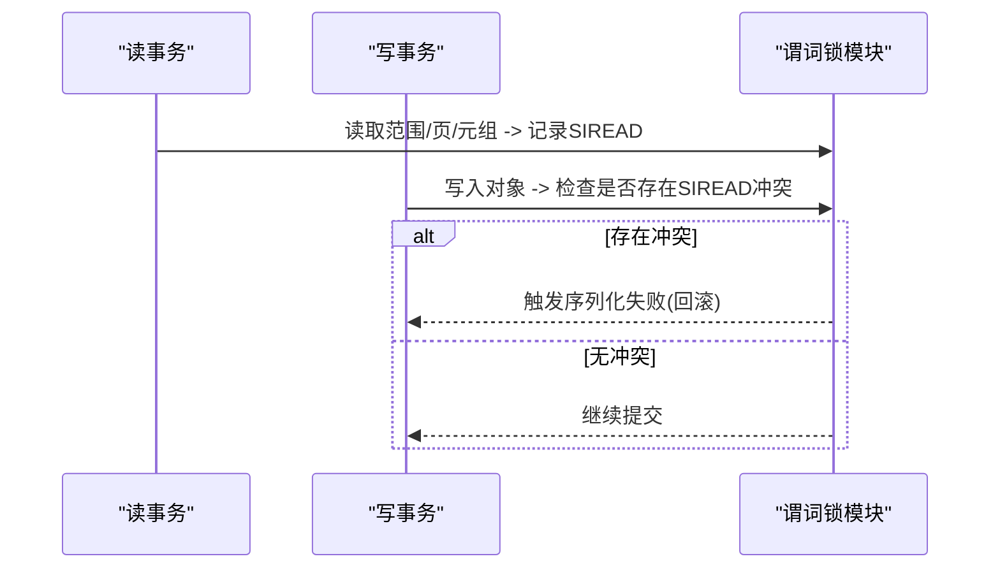
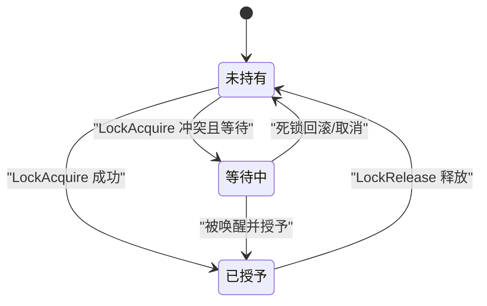
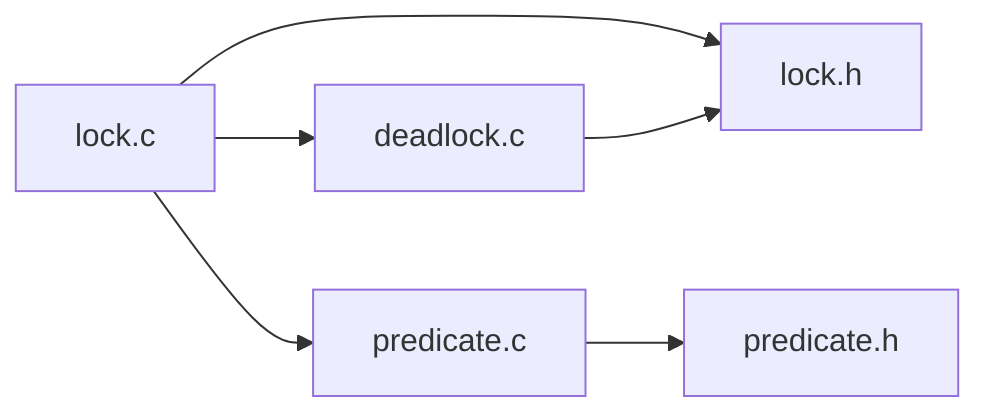

# 锁机制设计

<cite>
**本文引用的文件**
- [src/include/storage/lock.h](file://src/include/storage/lock.h)
- [src/include/storage/lockdefs.h](file://src/include/storage/lockdefs.h)
- [src/backend/storage/lmgr/lock.c](file://src/backend/storage/lmgr/lock.c)
- [src/backend/storage/lmgr/deadlock.c](file://src/backend/storage/lmgr/deadlock.c)
- [src/backend/storage/lmgr/predicate.c](file://src/backend/storage/lmgr/predicate.c)
- [src/include/storage/predicate.h](file://src/include/storage/predicate.h)
</cite>

## 目录
1. [简介](#简介)
2. [项目结构](#项目结构)
3. [核心组件](#核心组件)
4. [架构总览](#架构总览)
5. [详细组件分析](#详细组件分析)
6. [依赖关系分析](#依赖关系分析)
7. [性能考量](#性能考量)
8. [故障排查指南](#故障排查指南)
9. [结论](#结论)
10. [附录](#附录)

## 简介
本文件面向Mini PostgreSQL的并发控制子系统，系统性阐述其锁机制设计与实现，覆盖行级与表级锁、共享/排他语义、锁升级策略、死锁检测（等待图构建、循环检测、解除策略）、锁粒度控制与超时、等待队列与优先级调度，以及可重复读/可串行化隔离级别下的谓词锁与范围冲突检测。文档同时提供状态图、流程图与调用序列图，并给出监控指标与调试方法建议，帮助读者全面理解并发安全保障。

## 项目结构
围绕锁机制的关键代码集中在存储层管理器（lmgr）与头文件中：
- 锁类型、标签、数据结构定义：lock.h、lockdefs.h
- 锁获取/释放、冲突检查、等待唤醒：lock.c
- 死锁检测与解除：deadlock.c
- 谓词锁（SSI）：predicate.c、predicate.h

图表来源
- [src/backend/storage/lmgr/lock.c:380-465](file://src/backend/storage/lmgr/lock.c#L380-L465)
- [src/backend/storage/lmgr/deadlock.c:216-285](file://src/backend/storage/lmgr/deadlock.c#L216-L285)
- [src/backend/storage/lmgr/predicate.c:244-258](file://src/backend/storage/lmgr/predicate.c#L244-L258)

章节来源
- [src/backend/storage/lmgr/lock.c:380-465](file://src/backend/storage/lmgr/lock.c#L380-L465)
- [src/include/storage/lock.h:140-175](file://src/include/storage/lock.h#L140-L175)

## 核心组件
- 锁模式与冲突表：定义了AccessShareLock、RowShareLock、RowExclusiveLock、ShareUpdateExclusiveLock、ShareLock、ShareRowExclusiveLock、ExclusiveLock、AccessExclusiveLock等模式及冲突矩阵。
- 锁目标标识LOCKTAG：用于唯一标识被锁对象（表、页、元组、事务、虚拟事务、对象、咨询锁等）。
- 共享锁表项LOCK与持有者项PROCLOCK：维护grantMask、waitMask、请求/授予计数、等待队列等。
- 本地锁LOCALLOCK：后端进程内缓存，减少共享内存访问。
- 快速路径FastPath：针对无冲突的关系锁优化，避免进入共享锁表。
- 分区锁：通过NUM_LOCK_PARTITIONS将锁表分片，降低竞争。
- 死锁检测：基于等待图构建与拓扑排序，支持软边重排与硬死锁回滚。
- 谓词锁：为可串行化隔离级别提供SIREAD锁，记录读集范围并在写时检测RW冲突。

章节来源
- [src/include/storage/lockdefs.h:33-48](file://src/include/storage/lockdefs.h#L33-L48)
- [src/include/storage/lock.h:140-175](file://src/include/storage/lock.h#L140-L175)
- [src/include/storage/lock.h:300-372](file://src/include/storage/lock.h#L300-L372)
- [src/include/storage/lock.h:400-433](file://src/include/storage/lock.h#L400-L433)
- [src/backend/storage/lmgr/lock.c:61-105](file://src/backend/storage/lmgr/lock.c#L61-L105)
- [src/backend/storage/lmgr/lock.c:165-259](file://src/backend/storage/lmgr/lock.c#L165-L259)
- [src/backend/storage/lmgr/lock.c:511-523](file://src/backend/storage/lmgr/lock.c#L511-L523)
- [src/backend/storage/lmgr/deadlock.c:36-94](file://src/backend/storage/lmgr/deadlock.c#L36-L94)
- [src/backend/storage/lmgr/predicate.c:27-82](file://src/backend/storage/lmgr/predicate.c#L27-L82)

## 架构总览
锁子系统采用“本地缓存 + 共享表 + 分区锁”的分层设计：
- 本地层：LOCALLOCK缓存当前会话/事务持有的锁计数，加速重复获取与释放。
- 共享层：LOCK/PROCLOCK维护跨进程的锁状态与等待队列；通过哈希表+分区锁保证并发安全。
- 快速路径：对常见无冲突的关系锁走fast path，不进入共享表，极大降低开销。
- 死锁检测：在等待前或等待期间检测等待图环，尝试重排队列（软死锁），否则回滚一个事务（硬死锁）。
- 谓词锁：在可串行化隔离级别下，记录读范围（SIREAD），写时检查是否与其他事务读集冲突，必要时中止。

图表来源
- [src/backend/storage/lmgr/lock.c:765-1169](file://src/backend/storage/lmgr/lock.c#L765-L1169)
- [src/backend/storage/lmgr/deadlock.c:216-285](file://src/backend/storage/lmgr/deadlock.c#L216-L285)

## 详细组件分析

### 锁类型与冲突矩阵
- 锁模式：从细粒度的AccessShareLock到强独占的AccessExclusiveLock，覆盖DDL/DML/索引/真空等场景。
- 冲突矩阵：每种模式对应一个位掩码，表示与其冲突的模式集合；冲突判断通过位运算快速完成。
- 行级/表级粒度：通过LOCKTAG区分不同粒度（RELATION、PAGE、TUPLE等），上层根据操作选择合适粒度。

图表来源
- [src/backend/storage/lmgr/lock.c:61-105](file://src/backend/storage/lmgr/lock.c#L61-L105)
- [src/backend/storage/lmgr/lock.c:1414-1548](file://src/backend/storage/lmgr/lock.c#L1414-L1548)

章节来源
- [src/include/storage/lockdefs.h:33-48](file://src/include/storage/lockdefs.h#L33-L48)
- [src/backend/storage/lmgr/lock.c:61-105](file://src/backend/storage/lmgr/lock.c#L61-L105)
- [src/backend/storage/lmgr/lock.c:1414-1548](file://src/backend/storage/lmgr/lock.c#L1414-L1548)

### 锁获取流程与等待队列管理
- 入口：LockAcquireExtended负责统一入口，处理本地缓存、快速路径、共享表、等待与唤醒。
- 本地缓存：LOCALLOCK记录持有次数与资源所有者，避免重复访问共享内存。
- 快速路径：对无冲突的关系锁使用fast path，跳过共享表，提升热点路径性能。
- 共享表：SetupLockInTable创建/查找LOCK/PROCLOCK，GrantLock更新授予状态。
- 等待队列：当存在冲突且允许等待时，入队waitProcs；被唤醒后重新检查冲突并可能再次等待。
- 分区锁：通过LockHashPartitionLock保护各分区，减少锁竞争。

图表来源
- [src/include/storage/lock.h:300-372](file://src/include/storage/lock.h#L300-L372)
- [src/include/storage/lock.h:400-433](file://src/include/storage/lock.h#L400-L433)
- [src/backend/storage/lmgr/lock.c:1181-1353](file://src/backend/storage/lmgr/lock.c#L1181-L1353)

章节来源
- [src/backend/storage/lmgr/lock.c:765-1169](file://src/backend/storage/lmgr/lock.c#L765-L1169)
- [src/backend/storage/lmgr/lock.c:1181-1353](file://src/backend/storage/lmgr/lock.c#L1181-L1353)
- [src/include/storage/lock.h:300-433](file://src/include/storage/lock.h#L300-L433)

### 锁升级策略
- 快速路径到共享表的迁移：当检测到强冲突（如AccessExclusiveLock）时，会将已存在的快速路径锁迁移至主锁表，确保死锁检测能感知所有锁。
- 同一对象上的多粒度锁：若已持有较低粒度锁但未达到请求级别，系统会发出风险警告（CHECK_DEADLOCK_RISK），提示编码实践可能导致死锁风险。
- 扩展锁限制：持有关系扩展锁时禁止再获取其他重型锁，避免复杂等待链。

章节来源
- [src/backend/storage/lmgr/lock.c:165-259](file://src/backend/storage/lmgr/lock.c#L165-L259)
- [src/backend/storage/lmgr/lock.c:972-999](file://src/backend/storage/lmgr/lock.c#L972-L999)
- [src/backend/storage/lmgr/lock.c:1295-1331](file://src/backend/storage/lmgr/lock.c#L1295-L1331)

### 死锁检测算法
- 等待图构建：以PGPROC为节点，边表示“等待-阻塞”关系；考虑锁组（lock group）成员代表整个组。
- 循环检测：递归遍历等待图，若回到起点则发现硬死锁；否则收集可能的“软边”（可通过重排队列消除的冲突）。
- 软死锁解除：尝试对受影响的等待队列进行拓扑排序重排，打破环路；若成功，返回软死锁状态。
- 硬死锁解除：无法重排时，选择一个事务回滚（由调用方决定），并记录详细信息以便报告。
- 自动真空阻塞识别：检测是否被autovacuum阻塞，便于上层采取取消策略。

图表来源
- [src/backend/storage/lmgr/deadlock.c:216-285](file://src/backend/storage/lmgr/deadlock.c#L216-L285)
- [src/backend/storage/lmgr/deadlock.c:448-536](file://src/backend/storage/lmgr/deadlock.c#L448-L536)
- [src/backend/storage/lmgr/deadlock.c:538-790](file://src/backend/storage/lmgr/deadlock.c#L538-L790)

章节来源
- [src/backend/storage/lmgr/deadlock.c:36-94](file://src/backend/storage/lmgr/deadlock.c#L36-L94)
- [src/backend/storage/lmgr/deadlock.c:216-285](file://src/backend/storage/lmgr/deadlock.c#L216-L285)
- [src/backend/storage/lmgr/deadlock.c:448-790](file://src/backend/storage/lmgr/deadlock.c#L448-L790)

### 锁粒度控制与超时/等待
- 粒度控制：通过LOCKTAG区分表、页、元组等粒度；上层根据操作选择合适的粒度，以减少锁竞争。
- 等待队列：waitProcs维护等待顺序；死锁检测时可重排以提升吞吐。
- 超时机制：代码中未内置全局锁超时参数；通常由上层（如客户端驱动或会话级配置）实现超时取消。
- 优先级调度：默认按FIFO等待；死锁检测中的重排可视为一种“公平性”调整，避免饥饿。

章节来源
- [src/include/storage/lock.h:140-175](file://src/include/storage/lock.h#L140-L175)
- [src/backend/storage/lmgr/lock.c:1041-1169](file://src/backend/storage/lmgr/lock.c#L1041-L1169)
- [src/backend/storage/lmgr/deadlock.c:248-285](file://src/backend/storage/lmgr/deadlock.c#L248-L285)

### 谓词锁与可串行化隔离
- SIREAD锁：为可串行化事务记录读集（范围/页/元组），不阻塞其他事务，仅用于冲突检测。
- 冲突检测：写操作时检查是否与已有SIREAD锁冲突；读操作时检查是否有后续写冲突。
- 范围合并与降级：在内存压力下，可将多个细粒度锁合并为粗粒度锁，降低开销。
- 安全快照优化：只读事务在满足条件时可标记为“安全”，提前释放谓词锁并跳过跟踪。

图表来源
- [src/backend/storage/lmgr/predicate.c:27-82](file://src/backend/storage/lmgr/predicate.c#L27-L82)
- [src/include/storage/predicate.h:49-81](file://src/include/storage/predicate.h#L49-L81)

章节来源
- [src/backend/storage/lmgr/predicate.c:27-82](file://src/backend/storage/lmgr/predicate.c#L27-L82)
- [src/include/storage/predicate.h:49-81](file://src/include/storage/predicate.h#L49-L81)

### 锁状态图

图表来源
- [src/backend/storage/lmgr/lock.c:765-1169](file://src/backend/storage/lmgr/lock.c#L765-L1169)
- [src/backend/storage/lmgr/deadlock.c:216-285](file://src/backend/storage/lmgr/deadlock.c#L216-L285)

## 依赖关系分析
- lock.c依赖lock.h定义的锁结构与API，依赖deadlock.c提供的死锁检测能力，依赖predicate.c提供的可串行化支持。
- deadlock.c依赖锁表结构（LOCK/PROCLOCK）与进程信息（PGPROC）构建等待图。
- predicate.c独立维护谓词锁哈希表与SLRU，与主锁表解耦但需与MVCC/快照交互。

图表来源
- [src/backend/storage/lmgr/lock.c:30-51](file://src/backend/storage/lmgr/lock.c#L30-L51)
- [src/backend/storage/lmgr/deadlock.c:26-34](file://src/backend/storage/lmgr/deadlock.c#L26-L34)
- [src/backend/storage/lmgr/predicate.c:193-211](file://src/backend/storage/lmgr/predicate.c#L193-L211)

章节来源
- [src/backend/storage/lmgr/lock.c:30-51](file://src/backend/storage/lmgr/lock.c#L30-L51)
- [src/backend/storage/lmgr/deadlock.c:26-34](file://src/backend/storage/lmgr/deadlock.c#L26-L34)
- [src/backend/storage/lmgr/predicate.c:193-211](file://src/backend/storage/lmgr/predicate.c#L193-L211)

## 性能考量
- 快速路径：热点关系锁走fast path，显著降低共享内存访问与锁竞争。
- 分区锁：NUM_LOCK_PARTITIONS将锁表分片，减少LWLock争用。
- 本地缓存：LOCALLOCK减少重复获取/释放的开销。
- 谓词锁合并：在内存压力下合并细粒度锁，降低追踪成本。
- 监控指标建议：
  - 锁等待时间分布（TRACE_POSTGRESQL_LOCK_WAIT_*）
  - 死锁频率与类型（TRACE_POSTGRESQL_DEADLOCK_FOUND）
  - 快速路径命中率（FastPathLocalUseCount相关统计）
  - 谓词锁数量与合并率（max_predicate_locks_per_xact/page/relation）

[本节为通用指导，无需特定文件引用]

## 故障排查指南
- 死锁诊断：
  - 启用死锁日志与跟踪，查看等待图与软/硬死锁信息。
  - 关注autovacuum阻塞情况，必要时取消相关进程。
- 锁等待过长：
  - 检查是否存在大量慢查询或长事务持有锁。
  - 评估是否可通过调整隔离级别或重写查询减少锁竞争。
- 内存压力：
  - 调整max_locks_per_xact与max_predicate_locks_*参数。
  - 观察谓词锁合并行为，避免过多细粒度锁。

章节来源
- [src/backend/storage/lmgr/deadlock.c:216-285](file://src/backend/storage/lmgr/deadlock.c#L216-L285)
- [src/backend/storage/lmgr/predicate.c:360-368](file://src/backend/storage/lmgr/predicate.c#L360-L368)

## 结论
Mini PostgreSQL的锁机制通过分层设计（本地缓存、共享表、分区锁）与快速路径优化，实现了高效且可扩展的并发控制。死锁检测结合软边重排与硬死锁回滚，保障系统在复杂并发场景下的稳定性。谓词锁为可串行化隔离提供了可靠的范围冲突检测能力。配合合理的监控与调优，可为高并发应用提供坚实的并发安全保障。

[本节为总结，无需特定文件引用]

## 附录
- 关键API参考：
  - LockAcquire/LockRelease：锁获取与释放
  - DeadLockCheck：死锁检测
  - PredicateLockRelation/Page/TID：谓词锁操作
- 配置参数：
  - max_locks_per_xact：每事务最大锁数
  - max_predicate_locks_per_xact/page/relation：谓词锁容量

[本节为补充信息，无需特定文件引用]