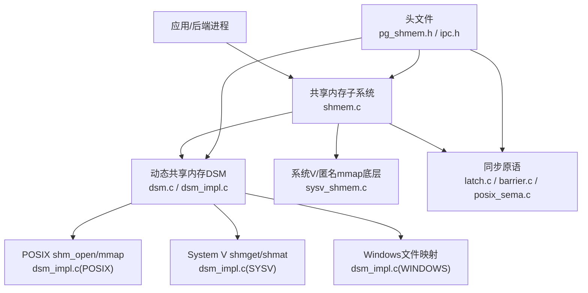
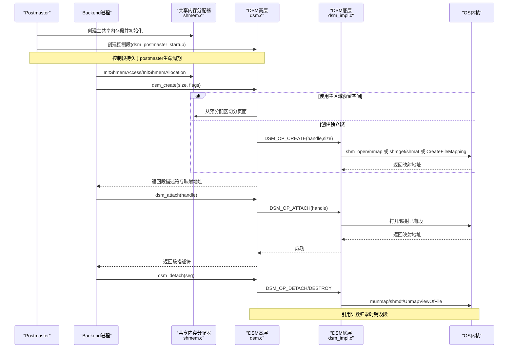
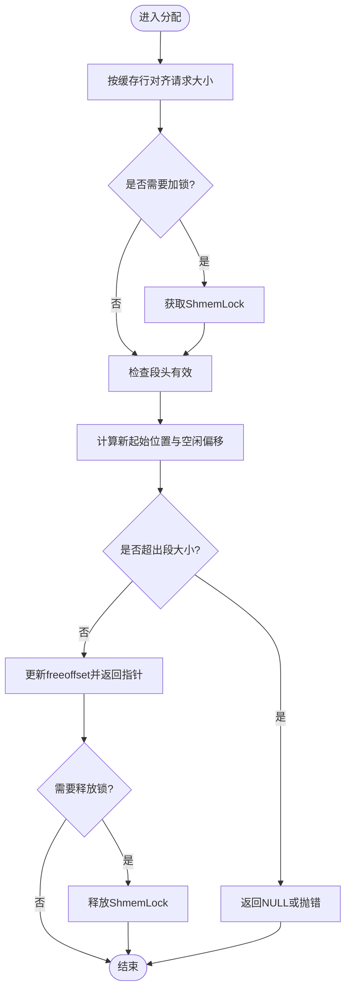
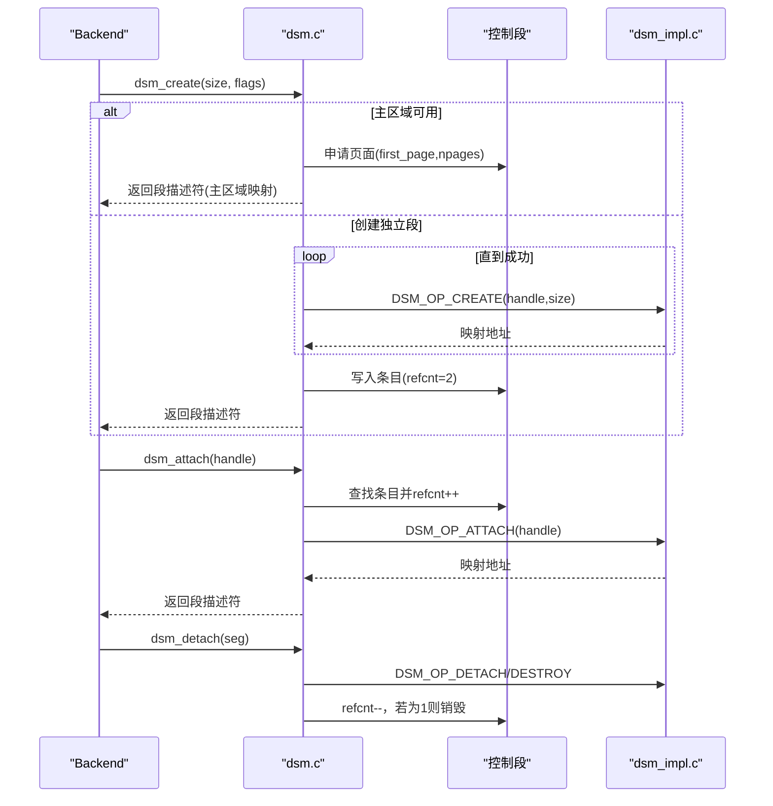
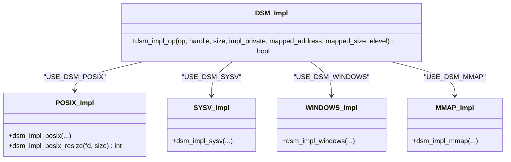
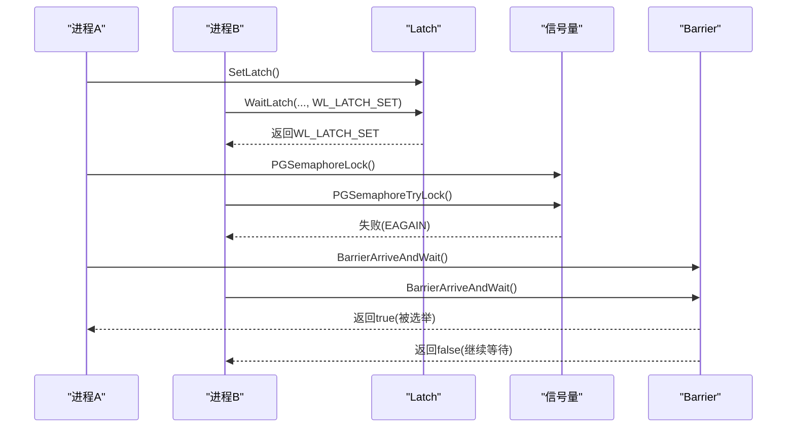
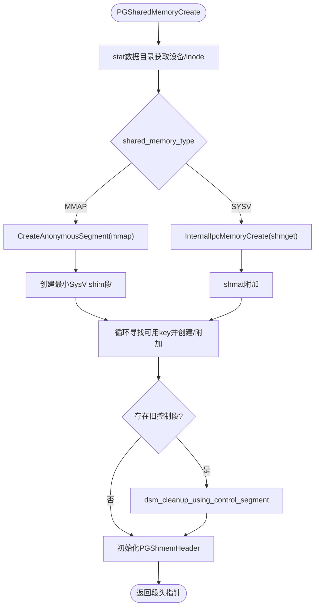
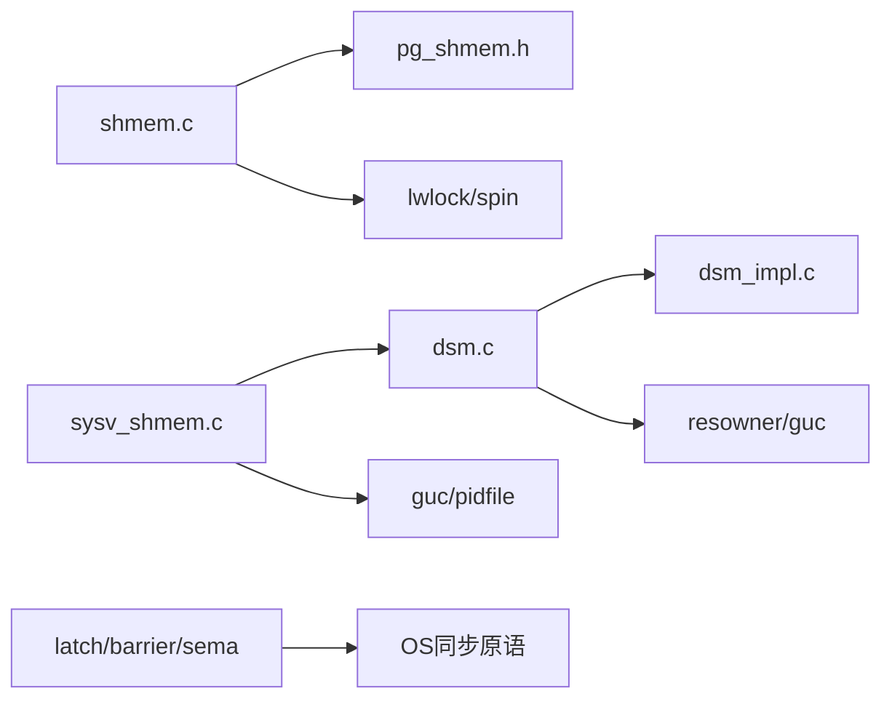

# 共享内存管理

<cite>
**本文引用的文件**
- [shmem.c](file://src/backend/storage/ipc/shmem.c)
- [dsm.c](file://src/backend/storage/ipc/dsm.c)
- [dsm_impl.c](file://src/backend/storage/ipc/dsm_impl.c)
- [latch.c](file://src/backend/storage/ipc/latch.c)
- [barrier.c](file://src/backend/storage/ipc/barrier.c)
- [posix_sema.c](file://src/backend/port/posix_sema.c)
- [sysv_shmem.c](file://src/backend/port/sysv_shmem.c)
- [pg_shmem.h](file://src/include/storage/pg_shmem.h)
- [ipc.h](file://src/include/storage/ipc.h)
</cite>

## 目录
1. [简介](#简介)
2. [项目结构](#项目结构)
3. [核心组件](#核心组件)
4. [架构总览](#架构总览)
5. [详细组件分析](#详细组件分析)
6. [依赖关系分析](#依赖关系分析)
7. [性能考量](#性能考量)
8. [故障排除指南](#故障排除指南)
9. [结论](#结论)
10. [附录](#附录)

## 简介
本文件面向Mini PostgreSQL的共享内存管理系统，系统性阐述共享内存段的创建、映射与销毁流程；动态共享内存（DSM）的分配、进程间通信与同步原语；并发访问控制（锁、信号量、条件变量）；以及在不同操作系统上的移植实现（POSIX共享内存、System V共享内存、mmap方案）。文档包含架构图、进程通信流程图与故障排除指南，帮助多进程协作开发。

## 项目结构
围绕共享内存与进程间通信的核心代码主要位于：
- 后端存储IPC层：src/backend/storage/ipc
- 端口适配层：src/backend/port
- 公共头文件：src/include/storage

图表来源
- [shmem.c:92-149](file://src/backend/storage/ipc/shmem.c#L92-L149)
- [dsm.c:145-199](file://src/backend/storage/ipc/dsm.c#L145-L199)
- [dsm_impl.c:160-196](file://src/backend/storage/ipc/dsm_impl.c#L160-L196)
- [sysv_shmem.c:628-796](file://src/backend/port/sysv_shmem.c#L628-L796)
- [pg_shmem.h:29-40](file://src/include/storage/pg_shmem.h#L29-L40)
- [ipc.h:64-80](file://src/include/storage/ipc.h#L64-L80)

章节来源
- [shmem.c:92-149](file://src/backend/storage/ipc/shmem.c#L92-L149)
- [pg_shmem.h:29-40](file://src/include/storage/pg_shmem.h#L29-L40)
- [ipc.h:64-80](file://src/include/storage/ipc.h#L64-L80)

## 核心组件
- 共享内存段与分配器
  - 段头PGShmemHeader维护段元信息（大小、自由偏移、索引指针等），提供统一入口进行初始化与访问。
  - 分配器以“从头部向后线性增长”的方式分配对齐块，支持加锁与无锁两种路径，保证缓存行对齐与一致性。
- 动态共享内存（DSM）
  - 高层接口负责段生命周期管理、控制段维护、引用计数与自动清理。
  - 底层实现抽象出跨平台操作（POSIX、System V、Windows、mmap），通过统一API分发。
- 同步与通信
  - Latch用于轻量级进程/线程唤醒，基于自管道或signalfd/epoll/kqueue等高效机制。
  - Barrier提供阶段屏障，配合条件变量与自旋锁实现多参与者同步。
  - 信号量封装POSIX信号量，提供阻塞/非阻塞获取与释放。
- 平台适配
  - System V/匿名mmap混合策略创建主共享内存段，并处理巨大页、键冲突与残留清理。
  - DSM底层按配置选择POSIX shm_open/mmap、System V shmget/shmat或Windows文件映射。

章节来源
- [shmem.c:158-234](file://src/backend/storage/ipc/shmem.c#L158-L234)
- [dsm.c:446-572](file://src/backend/storage/ipc/dsm.c#L446-L572)
- [dsm_impl.c:160-196](file://src/backend/storage/ipc/dsm_impl.c#L160-L196)
- [latch.c:433-462](file://src/backend/storage/ipc/latch.c#L433-L462)
- [barrier.c:99-196](file://src/backend/storage/ipc/barrier.c#L99-L196)
- [posix_sema.c:256-384](file://src/backend/port/posix_sema.c#L256-L384)
- [sysv_shmem.c:628-796](file://src/backend/port/sysv_shmem.c#L628-L796)

## 架构总览
下图展示主共享内存与动态共享内存的关系，以及各模块间的调用链。

图表来源
- [sysv_shmem.c:628-796](file://src/backend/port/sysv_shmem.c#L628-L796)
- [dsm.c:145-199](file://src/backend/storage/ipc/dsm.c#L145-L199)
- [dsm.c:446-572](file://src/backend/storage/ipc/dsm.c#L446-L572)
- [dsm.c:590-675](file://src/backend/storage/ipc/dsm.c#L590-L675)
- [dsm.c:728-800](file://src/backend/storage/ipc/dsm.c#L728-L800)
- [dsm_impl.c:213-343](file://src/backend/storage/ipc/dsm_impl.c#L213-L343)
- [dsm_impl.c:427-597](file://src/backend/storage/ipc/dsm_impl.c#L427-L597)
- [dsm_impl.c:614-782](file://src/backend/storage/ipc/dsm_impl.c#L614-L782)

## 详细组件分析

### 共享内存段与分配器（shmem.c）
- 段头与全局指针
  - PGShmemHeader记录段大小、自由偏移、索引表指针与控制段句柄。
  - 进程通过InitShmemAccess设置基址与边界，便于校验与计算。
- 分配策略
  - ShmemAlloc/ShmemAllocNoError/ShmemAllocRaw：按缓存行对齐分配，使用自旋锁保护freeoffset更新。
  - ShmemAllocUnlocked：在锁未就绪前使用，仅做最大对齐。
  - ShmemInitStruct：通过命名查找或分配，维护ShmemIndex哈希表，避免重复分配与名称冲突。
  - ShmemInitHash：为共享内存中的哈希表固定目录大小，确保多进程可见性。
- 错误处理
  - 分配失败抛出内存不足错误；名称冲突或尺寸不匹配时报错。

图表来源
- [shmem.c:158-234](file://src/backend/storage/ipc/shmem.c#L158-L234)
- [shmem.c:237-273](file://src/backend/storage/ipc/shmem.c#L237-L273)
- [shmem.c:393-493](file://src/backend/storage/ipc/shmem.c#L393-L493)

章节来源
- [shmem.c:92-149](file://src/backend/storage/ipc/shmem.c#L92-L149)
- [shmem.c:158-234](file://src/backend/storage/ipc/shmem.c#L158-L234)
- [shmem.c:237-273](file://src/backend/storage/ipc/shmem.c#L237-L273)
- [shmem.c:287-309](file://src/backend/storage/ipc/shmem.c#L287-L309)
- [shmem.c:338-375](file://src/backend/storage/ipc/shmem.c#L338-L375)
- [shmem.c:393-493](file://src/backend/storage/ipc/shmem.c#L393-L493)

### 动态共享内存（DSM）高层（dsm.c）
- 控制段
  - Postmaster启动时创建控制段，记录所有DSM段条目（句柄、引用计数、页面范围、是否钉住等）。
  - 控制段生命周期与postmaster一致，崩溃恢复时会尝试清理孤儿段。
- 段创建与附加
  - dsm_create优先从主共享内存预留区切分页面；否则调用底层实现创建独立段。
  - dsm_attach根据句柄查找控制段条目，增加引用计数并映射段。
- 生命周期与清理
  - dsm_detach减少引用计数，必要时触发销毁；支持on-detach回调。
  - 后端关闭时遍历并detach所有段；postmaster关闭时清理剩余段与控制段。

图表来源
- [dsm.c:145-199](file://src/backend/storage/ipc/dsm.c#L145-L199)
- [dsm.c:446-572](file://src/backend/storage/ipc/dsm.c#L446-L572)
- [dsm.c:590-675](file://src/backend/storage/ipc/dsm.c#L590-L675)
- [dsm.c:728-800](file://src/backend/storage/ipc/dsm.c#L728-L800)

章节来源
- [dsm.c:145-199](file://src/backend/storage/ipc/dsm.c#L145-L199)
- [dsm.c:446-572](file://src/backend/storage/ipc/dsm.c#L446-L572)
- [dsm.c:590-675](file://src/backend/storage/ipc/dsm.c#L590-L675)
- [dsm.c:728-800](file://src/backend/storage/ipc/dsm.c#L728-L800)

### DSM底层实现（dsm_impl.c）
- 统一接口
  - dsm_impl_op根据配置选择POSIX、System V、Windows或mmap实现，执行CREATE/ATTACH/DETACH/DESTROY。
- POSIX实现
  - 使用shm_open/shm_unlink与mmap；resize时使用ftruncate与可选的posix_fallocate预分配以避免SIGBUS。
- System V实现
  - 使用shmget/shmat/shmdt/shmctl；对key与ID进行转换与缓存；attach时通过IPC_STAT获取大小。
- Windows实现
  - 使用CreateFileMapping/MapViewOfFile；命名空间采用Global前缀；自动在最后一个引用释放时销毁对象。
- mmap实现
  - 将共享内存映射到文件（通常位于专用目录），适合文件系统-backed共享内存场景。

图表来源
- [dsm_impl.c:160-196](file://src/backend/storage/ipc/dsm_impl.c#L160-L196)
- [dsm_impl.c:213-343](file://src/backend/storage/ipc/dsm_impl.c#L213-L343)
- [dsm_impl.c:427-597](file://src/backend/storage/ipc/dsm_impl.c#L427-L597)
- [dsm_impl.c:614-782](file://src/backend/storage/ipc/dsm_impl.c#L614-L782)

章节来源
- [dsm_impl.c:160-196](file://src/backend/storage/ipc/dsm_impl.c#L160-L196)
- [dsm_impl.c:213-343](file://src/backend/storage/ipc/dsm_impl.c#L213-L343)
- [dsm_impl.c:427-597](file://src/backend/storage/ipc/dsm_impl.c#L427-L597)
- [dsm_impl.c:614-782](file://src/backend/storage/ipc/dsm_impl.c#L614-L782)

### 进程间同步与通信（Latch、Barrier、信号量）
- Latch
  - 提供Set/Reset/Wait能力，内部使用自管道或signalfd/epoll/kqueue实现高效唤醒。
  - WaitLatch可结合超时与postmaster死亡事件等待。
- Barrier
  - 支持静态与动态参与者集合，使用自旋锁与条件变量协调阶段推进，选举一个参与者执行串行工作。
- 信号量
  - 基于POSIX信号量封装，支持阻塞与非阻塞获取，提供重置、解锁等操作。

图表来源
- [latch.c:433-462](file://src/backend/storage/ipc/latch.c#L433-L462)
- [latch.c:554-613](file://src/backend/storage/ipc/latch.c#L554-L613)
- [barrier.c:99-196](file://src/backend/storage/ipc/barrier.c#L99-L196)
- [posix_sema.c:256-384](file://src/backend/port/posix_sema.c#L256-L384)

章节来源
- [latch.c:192-332](file://src/backend/storage/ipc/latch.c#L192-L332)
- [latch.c:433-462](file://src/backend/storage/ipc/latch.c#L433-L462)
- [latch.c:554-613](file://src/backend/storage/ipc/latch.c#L554-L613)
- [barrier.c:99-196](file://src/backend/storage/ipc/barrier.c#L99-L196)
- [posix_sema.c:256-384](file://src/backend/port/posix_sema.c#L256-L384)

### 平台移植：主共享内存创建（sysv_shmem.c）
- 策略
  - 默认使用匿名mmap作为主共享内存主体，同时保留最小System V段用于目录锁互斥。
  - 可选择完全使用System V或mmap方式。
- 关键流程
  - 检测数据目录设备/inode，生成唯一键；循环尝试创建/附加，处理EEXIST/EACCES/EIDRM等。
  - 支持巨大页（MAP_HUGETLB），并在失败时回退到普通页。
  - 清理旧控制段与孤儿DSM段。

图表来源
- [sysv_shmem.c:628-796](file://src/backend/port/sysv_shmem.c#L628-L796)
- [sysv_shmem.c:535-597](file://src/backend/port/sysv_shmem.c#L535-L597)
- [sysv_shmem.c:449-524](file://src/backend/port/sysv_shmem.c#L449-L524)

章节来源
- [sysv_shmem.c:628-796](file://src/backend/port/sysv_shmem.c#L628-L796)
- [sysv_shmem.c:535-597](file://src/backend/port/sysv_shmem.c#L535-L597)
- [sysv_shmem.c:449-524](file://src/backend/port/sysv_shmem.c#L449-L524)

## 依赖关系分析
- 模块耦合
  - shmem.c依赖lwlock与spinlock进行分配保护；依赖pg_shmem.h定义段头。
  - dsm.c依赖ds m_impl.c提供的跨平台操作；依赖资源所有者与GUC配置。
  - sysv_shmem.c依赖dsm.c进行控制段清理；依赖GUC与pidfile。
  - latch.c、barrier.c、posix_sema.c提供同步原语，被上层广泛使用。
- 外部依赖
  - POSIX：shm_open/mmap/ftruncate/posix_fallocate。
  - System V：shmget/shmat/shmdt/shmctl。
  - Windows：CreateFileMapping/MapViewOfFile。

图表来源
- [shmem.c:64-74](file://src/backend/storage/ipc/shmem.c#L64-L74)
- [dsm.c:27-44](file://src/backend/storage/ipc/dsm.c#L27-L44)
- [sysv_shmem.c:34-42](file://src/backend/port/sysv_shmem.c#L34-L42)
- [pg_shmem.h:29-40](file://src/include/storage/pg_shmem.h#L29-L40)

章节来源
- [shmem.c:64-74](file://src/backend/storage/ipc/shmem.c#L64-L74)
- [dsm.c:27-44](file://src/backend/storage/ipc/dsm.c#L27-L44)
- [sysv_shmem.c:34-42](file://src/backend/port/sysv_shmem.c#L34-L42)
- [pg_shmem.h:29-40](file://src/include/storage/pg_shmem.h#L29-L40)

## 性能考量
- 分配对齐
  - 共享内存分配按缓存行对齐，减少伪共享与缓存抖动。
- 主区域预分配
  - DSM优先从主共享内存预留区切分页面，降低系统调用开销与碎片化。
- 大页支持
  - 在Linux上可使用MAP_HUGETLB减少TLB压力，需按大页大小对齐。
- 等待机制
  - Latch使用epoll/kqueue/poll与self-pipe/signalfd，避免忙轮询与信号竞态。
- 控制段与引用计数
  - 控制段集中管理DSM段，减少重复查找与映射成本；引用计数确保及时回收。

[本节为通用指导，无需特定文件来源]

## 故障排除指南
- 共享内存不足
  - 现象：分配失败或报内存不足。
  - 排查：检查totalsize与freeoffset；确认是否达到系统限制（如SHMMAX/SHMALL/tmpfs容量）。
  - 参考：[shmem.c:158-234](file://src/backend/storage/ipc/shmem.c#L158-L234)
- 名称冲突或尺寸不匹配
  - 现象：ShmemInitStruct报错。
  - 排查：确认模块初始化顺序与名称唯一性；核对size参数。
  - 参考：[shmem.c:393-493](file://src/backend/storage/ipc/shmem.c#L393-L493)
- DSM段过多或无法创建
  - 现象：too many dynamic shared memory segments。
  - 排查：检查maxitems与引用计数；确认是否有泄漏或未detach。
  - 参考：[dsm.c:534-572](file://src/backend/storage/ipc/dsm.c#L534-L572)
- 控制段损坏或孤儿段
  - 现象：postmaster重启后遗留段。
  - 排查：使用dsm_cleanup_using_control_segment清理；检查控制段魔数与nitems。
  - 参考：[dsm.c:206-276](file://src/backend/storage/ipc/dsm.c#L206-L276)
- 平台相关错误
  - POSIX：shm_open/mmap失败；检查权限与tmpfs空间。
  - System V：shmget/shmat失败；检查key/ID与权限。
  - Windows：CreateFileMapping失败；检查命名空间与权限。
  - 参考：[dsm_impl.c:213-343](file://src/backend/storage/ipc/dsm_impl.c#L213-L343)、[dsm_impl.c:427-597](file://src/backend/storage/ipc/dsm_impl.c#L427-L597)、[dsm_impl.c:614-782](file://src/backend/storage/ipc/dsm_impl.c#L614-L782)

章节来源
- [shmem.c:158-234](file://src/backend/storage/ipc/shmem.c#L158-L234)
- [shmem.c:393-493](file://src/backend/storage/ipc/shmem.c#L393-L493)
- [dsm.c:206-276](file://src/backend/storage/ipc/dsm.c#L206-L276)
- [dsm.c:534-572](file://src/backend/storage/ipc/dsm.c#L534-L572)
- [dsm_impl.c:213-343](file://src/backend/storage/ipc/dsm_impl.c#L213-L343)
- [dsm_impl.c:427-597](file://src/backend/storage/ipc/dsm_impl.c#L427-L597)
- [dsm_impl.c:614-782](file://src/backend/storage/ipc/dsm_impl.c#L614-L782)

## 结论
Mini PostgreSQL的共享内存管理通过分层设计实现了高内聚、低耦合：
- 主共享内存段由sysv_shmem.c统一管理，兼容多种平台特性（如大页）。
- DSM提供灵活的动态内存分配与生命周期管理，屏蔽底层差异。
- 同步原语（Latch、Barrier、信号量）保障多进程协作的正确性与效率。
- 完善的错误处理与清理机制确保系统在异常情况下仍可稳定运行。

[本节为总结，无需特定文件来源]

## 附录
- 关键数据结构
  - PGShmemHeader：共享内存段头，包含magic、creatorPID、totalsize、freeoffset、dsm_control、index、device、inode。
  - dsm_control_header：DSM控制段头，包含magic、nitems、maxitems与条目数组。
- 配置项
  - shared_memory_type：选择主共享内存实现（SYSV/MAP/Windows）。
  - huge_pages/huge_page_size：控制大页使用与大小。
  - dynamic_shared_memory_type：选择DSM底层实现（posix/sysv/windows/mmap）。

章节来源
- [pg_shmem.h:29-40](file://src/include/storage/pg_shmem.h#L29-L40)
- [pg_shmem.h:42-66](file://src/include/storage/pg_shmem.h#L42-L66)
- [dsm.c:85-92](file://src/backend/storage/ipc/dsm.c#L85-L92)
- [dsm_impl.c:97-118](file://src/backend/storage/ipc/dsm_impl.c#L97-L118)