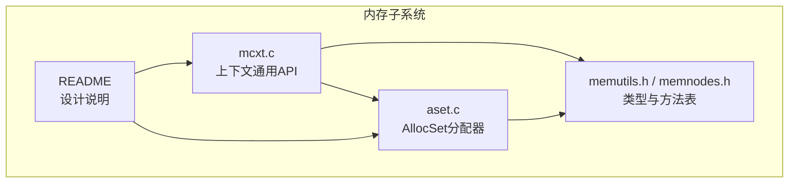
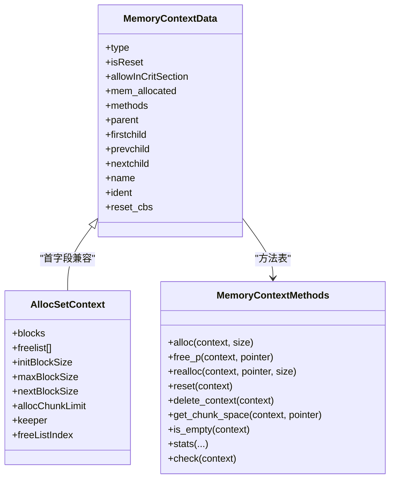
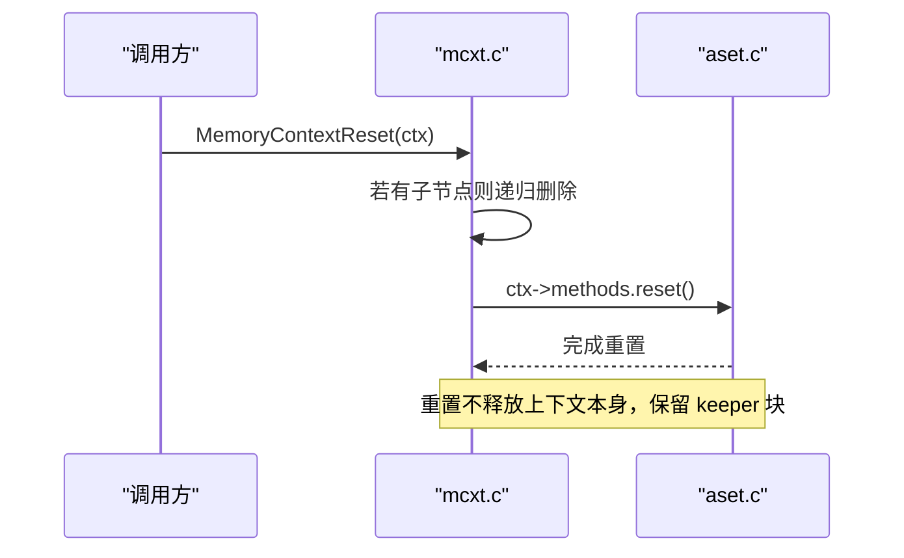
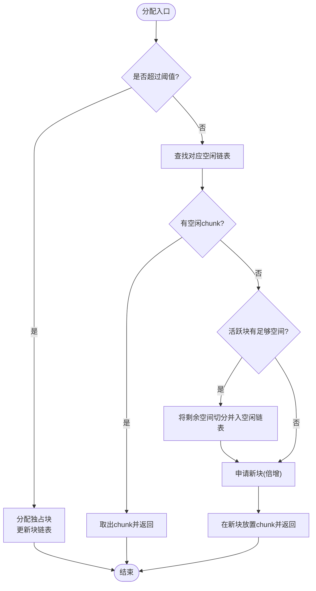
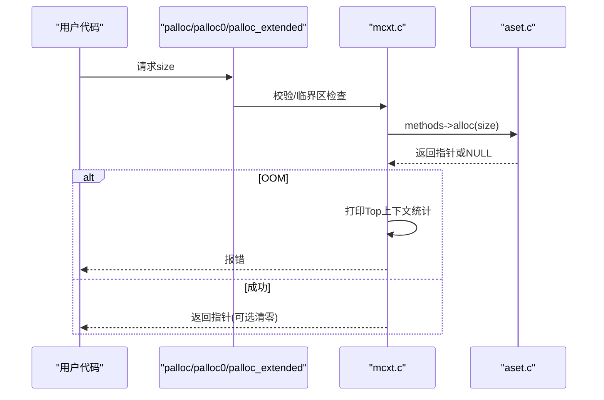
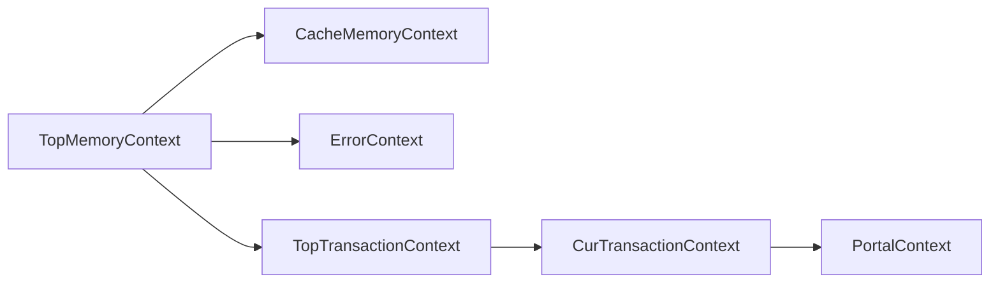
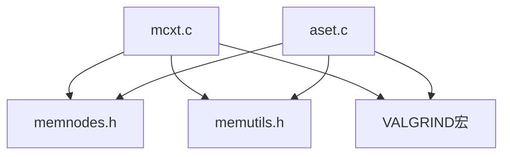

# 内存上下文管理

<cite>
**本文引用的文件**
- [mcxt.c](file://src/backend/utils/mmgr/mcxt.c)
- [aset.c](file://src/backend/utils/mmgr/aset.c)
- [memutils.h](file://src/include/utils/memutils.h)
- [memnodes.h](file://src/include/nodes/memnodes.h)
- [README](file://src/backend/utils/mmgr/README)
</cite>

## 目录
1. [简介](#简介)
2. [项目结构](#项目结构)
3. [核心组件](#核心组件)
4. [架构总览](#架构总览)
5. [详细组件分析](#详细组件分析)
6. [依赖关系分析](#依赖关系分析)
7. [性能考量](#性能考量)
8. [故障排查指南](#故障排查指南)
9. [结论](#结论)
10. [附录](#附录)

## 简介
本文件为 Mini PostgreSQL 的内存上下文（Memory Context）管理系统提供系统化、可操作的文档。内容涵盖：
- 层次化内存管理的树形结构与生命周期管理
- 自动清理机制与回调
- Aset 分配器的实现原理、性能特点与适用场景
- 上下文的创建、切换、删除、重置与嵌套继承策略
- 内存分配流程图、上下文关系图与最佳实践，帮助避免内存泄漏

## 项目结构
Mini PostgreSQL 的内存子系统位于 utils/mmgr 目录，核心由 mcxt.c（上下文通用逻辑）、aset.c（默认分配器 AllocSet）、以及头文件 memutils.h、memnodes.h 组成；README 提供了设计背景与使用约定。

**图表来源**
- [mcxt.c:1-140](file://src/backend/utils/mmgr/mcxt.c#L1-L140)
- [aset.c:1-136](file://src/backend/utils/mmgr/aset.c#L1-L136)
- [memutils.h:1-229](file://src/include/utils/memutils.h#L1-L229)
- [memnodes.h:1-111](file://src/include/nodes/memnodes.h#L1-L111)
- [README:1-392](file://src/backend/utils/mmgr/README#L1-L392)

**章节来源**
- [mcxt.c:1-140](file://src/backend/utils/mmgr/mcxt.c#L1-L140)
- [README:1-120](file://src/backend/utils/mmgr/README#L1-L120)

## 核心组件
- 内存上下文抽象与树形组织：通过 MemoryContextData 描述上下文节点，包含父/子指针、名称、标识、统计计数、方法表等；上下文形成森林，根通常为 TopMemoryContext。
- 方法表接口：MemoryContextMethods 定义 alloc/free/realloc/reset/delete/stats 等虚函数，具体上下文类型（如 AllocSet）实现各自策略。
- 全局上下文：TopMemoryContext、ErrorContext、CacheMemoryContext、MessageContext、事务相关上下文等，作为系统级资源边界。
- 当前上下文：CurrentMemoryContext 用于简化调用链中的临时分配，应指向短生命周期上下文以避免泄漏。
- 分配器：默认采用 AllocSet（Aset），基于块池与固定大小空闲链表，兼顾小对象复用与大对象直返。

**章节来源**
- [memnodes.h:58-93](file://src/include/nodes/memnodes.h#L58-L93)
- [memutils.h:50-66](file://src/include/utils/memutils.h#L50-L66)
- [mcxt.c:39-58](file://src/backend/utils/mmgr/mcxt.c#L39-L58)
- [README:101-116](file://src/backend/utils/mmgr/README#L101-L116)

## 架构总览
内存上下文以树形结构组织，所有分配通过当前上下文或显式上下文进行，底层由具体分配器实现。重置/删除时按树自底向上清理，支持回调钩子。

**图表来源**
- [memnodes.h:58-93](file://src/include/nodes/memnodes.h#L58-L93)
- [aset.c:121-136](file://src/backend/utils/mmgr/aset.c#L121-L136)

**章节来源**
- [memnodes.h:58-93](file://src/include/nodes/memnodes.h#L58-L93)
- [aset.c:121-136](file://src/backend/utils/mmgr/aset.c#L121-L136)

## 详细组件分析

### 上下文生命周期与树形管理
- 初始化：系统启动时创建 TopMemoryContext 与 ErrorContext，并设置 CurrentMemoryContext。
- 创建：类型特定创建函数完成自身头部与块池初始化后，调用 MemoryContextCreate 将上下文挂入父节点的子链表，并继承 allowInCritSection。
- 切换：通过设置 CurrentMemoryContext 改变后续 palloc/palloc0/palloc_extended 的目标上下文。
- 重置：MemoryContextReset 会先递归删除子上下文，再对当前上下文执行 reset-only；MemoryContextResetOnly 仅清空已分配空间并调用类型特定的 reset。
- 删除：MemoryContextDelete 先解链父关系，再调用类型 delete 释放全部资源，同时销毁 Valgrind 池。
- 回调：可在上下文上注册 reset/delete 回调，在重置或删除前按逆序调用，便于释放外部资源。

**图表来源**
- [mcxt.c:147-191](file://src/backend/utils/mmgr/mcxt.c#L147-L191)
- [aset.c:547-617](file://src/backend/utils/mmgr/aset.c#L547-L617)

**章节来源**
- [mcxt.c:103-140](file://src/backend/utils/mmgr/mcxt.c#L103-L140)
- [mcxt.c:147-278](file://src/backend/utils/mmgr/mcxt.c#L147-L278)
- [mcxt.c:819-858](file://src/backend/utils/mmgr/mcxt.c#L819-L858)
- [README:101-116](file://src/backend/utils/mmgr/README#L101-L116)

### Aset 分配器工作原理
- 块与块头：每个 AllocBlock 维护 freeptr/endptr 表示可用区间，块头含 aset/prev/next 等元信息。
- 小块与空闲链表：小于阈值的请求进入固定大小的空闲链表（按 2 的幂对齐），提高复用率与局部性。
- 大块路径：超过阈值的请求直接分配独占块，释放时直接归还给系统，避免碎片与长期占用。
- 块增长策略：首次分配使用 initBlockSize，之后每次倍增直至 maxBlockSize；必要时回退减小块大小以应对 malloc 失败。
- 活跃块复用：优先在当前活跃块中分配；若不足，则将剩余空间切分为合适大小的 chunk 加入空闲链表，再申请新块。
- 保持块（keeper）：上下文头与首个块共享内存，重置时保留该块以减少频繁 malloc/free。

**图表来源**
- [aset.c:720-986](file://src/backend/utils/mmgr/aset.c#L720-L986)

**章节来源**
- [aset.c:53-85](file://src/backend/utils/mmgr/aset.c#L53-L85)
- [aset.c:140-158](file://src/backend/utils/mmgr/aset.c#L140-L158)
- [aset.c:378-544](file://src/backend/utils/mmgr/aset.c#L378-L544)
- [aset.c:720-986](file://src/backend/utils/mmgr/aset.c#L720-L986)

### 内存分配流程（palloc/palloc0/palloc_extended）
- 校验参数与临界区约束：禁止在临界区内分配（除非上下文允许）。
- 标记 isReset=false：表明上下文已发生分配，不可再视为“未使用”。
- 委派到具体分配器：通过 methods->alloc 完成实际分配。
- OOM 处理：记录 TopMemoryContext 统计并上报错误；支持 NO_OOM 模式返回 NULL。
- 零填充：palloc0/MemoryContextAllocZero 等在分配后清零。

**图表来源**
- [mcxt.c:867-901](file://src/backend/utils/mmgr/mcxt.c#L867-L901)
- [mcxt.c:910-939](file://src/backend/utils/mmgr/mcxt.c#L910-L939)
- [mcxt.c:983-1018](file://src/backend/utils/mmgr/mcxt.c#L983-L1018)
- [mcxt.c:1093-1121](file://src/backend/utils/mmgr/mcxt.c#L1093-L1121)
- [mcxt.c:1123-1154](file://src/backend/utils/mmgr/mcxt.c#L1123-L1154)
- [mcxt.c:1157-1193](file://src/backend/utils/mmgr/mcxt.c#L1157-L1193)

### 上下文关系与继承
- 父子关系：创建时可指定父上下文；删除父上下文会级联删除其所有后代。
- 重绑定：可通过 MemoryContextSetParent 将上下文迁移至新的父节点，常用于将短期上下文提升为长期缓存。
- 继承标志：子上下文继承父的 allowInCritSection 标志，便于在特定上下文中放宽临界区限制（例如 ErrorContext）。

**图表来源**
- [memutils.h:50-66](file://src/include/utils/memutils.h#L50-L66)
- [mcxt.c:365-409](file://src/backend/utils/mmgr/mcxt.c#L365-L409)

**章节来源**
- [mcxt.c:365-409](file://src/backend/utils/mmgr/mcxt.c#L365-L409)
- [README:101-116](file://src/backend/utils/mmgr/README#L101-L116)

### 清理策略与回调
- 重置 vs 删除：
  - 重置：释放已分配空间，保留上下文与 keeper 块，适合高频复用。
  - 删除：彻底释放上下文及其所有后代，适用于一次性或不再需要的上下文。
- 回调机制：通过 MemoryContextRegisterResetCallback 注册回调，重置/删除前按逆序调用，便于释放外部资源（如锁、句柄）。
- 安全保证：删除前先解链父关系，避免错误传播导致悬挂指针。

**章节来源**
- [mcxt.c:147-278](file://src/backend/utils/mmgr/mcxt.c#L147-L278)
- [mcxt.c:281-328](file://src/backend/utils/mmgr/mcxt.c#L281-L328)

## 依赖关系分析
- 模块耦合：
  - mcxt.c 提供统一 API 并通过方法表解耦具体分配器。
  - aset.c 实现 AllocSet 的具体分配策略，依赖系统 malloc/free。
  - memnodes.h 定义公共数据结构与方法表；memutils.h 暴露全局上下文与常用宏。
- 外部依赖：
  - 调试/检测：Valgrind 宏用于内存池跟踪与越界检测。
  - 日志与统计：MemoryContextStatsDetail 输出上下文树统计，支持服务端日志。

**图表来源**
- [memnodes.h:58-93](file://src/include/nodes/memnodes.h#L58-L93)
- [memutils.h:1-229](file://src/include/utils/memutils.h#L1-L229)
- [mcxt.c:819-858](file://src/backend/utils/mmgr/mcxt.c#L819-L858)
- [aset.c:720-986](file://src/backend/utils/mmgr/aset.c#L720-L986)

**章节来源**
- [memnodes.h:58-93](file://src/include/nodes/memnodes.h#L58-L93)
- [memutils.h:1-229](file://src/include/utils/memutils.h#L1-L229)

## 性能考量
- 小块复用：Aset 使用固定大小空闲链表，减少 malloc 调用次数，提高局部性与命中率。
- 大块直返：超过阈值的分配直接独占块，释放时立即归还系统，避免长期占用与碎片。
- 块倍增策略：降低频繁分配开销，同时受 maxBlockSize 限制控制峰值内存。
- 临界区保护：禁止在临界区分配，防止 OOM 升级为 PANIC；ErrorContext 特例允许。
- 统计与诊断：MemoryContextStatsDetail 限制每层最多输出 100 个子节点，避免日志爆炸。

[本节为通用性能讨论，无需特定文件引用]

## 故障排查指南
- OOM 定位：
  - 分配失败时会打印 TopMemoryContext 的统计信息，结合上下文名快速定位热点。
  - 可使用 MemoryContextStatsDetail 按需导出上下文树统计。
- 越界与损坏：
  - 启用 MEMORY_CONTEXT_CHECKING 可在重置/删除时检查块一致性，报告写越界等问题。
- 临界区违规：
  - 在非允许上下文的临界区分配会触发断言；必要时通过 MemoryContextAllowInCriticalSection 放宽限制（谨慎使用）。
- 常见误用：
  - 将 CurrentMemoryContext 指向长生命周期上下文可能导致泄漏；应确保临时分配在短生命周期上下文中进行。
  - 忘记重置/删除上下文会导致内存持续增长；建议配合事务/查询/批处理的边界进行清理。

**章节来源**
- [mcxt.c:867-901](file://src/backend/utils/mmgr/mcxt.c#L867-L901)
- [mcxt.c:1028-1090](file://src/backend/utils/mmgr/mcxt.c#L1028-L1090)
- [aset.c:1410-1534](file://src/backend/utils/mmgr/aset.c#L1410-L1534)
- [README:72-98](file://src/backend/utils/mmgr/README#L72-L98)

## 结论
Mini PostgreSQL 的内存上下文系统通过抽象的方法表与树形组织，实现了灵活且高效的内存生命周期管理。Aset 分配器在小对象复用与大对象直返之间取得平衡，配合上下文重置/删除与回调机制，能够显著降低内存碎片与管理开销。遵循本文的最佳实践，可避免常见的内存泄漏与性能问题，保障系统的稳定性与可扩展性。

[本节为总结性内容，无需特定文件引用]

## 附录

### 最佳实践清单
- 始终将临时分配放入短生命周期上下文（如事务/查询/门户上下文），并在结束时重置。
- 避免在临界区内进行内存分配；确需使用时，仅在明确允许的上下文（如 ErrorContext）中进行。
- 合理使用上下文层级：将需要跨阶段复用的数据提升到更长的上下文（如 CacheMemoryContext），但注意及时释放。
- 对于大对象或一次性大数据，考虑使用支持 HUGE 的分配接口，并尽快释放。
- 定期使用 MemoryContextStatsDetail 监控内存使用情况，关注异常增长的上下文。
- 在开发/测试环境开启 MEMORY_CONTEXT_CHECKING，尽早发现越界与不一致问题。

[本节为通用指导，无需特定文件引用]