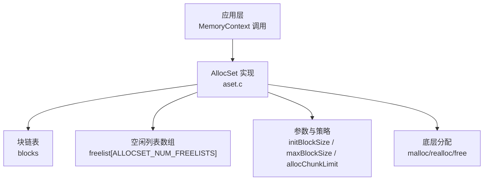
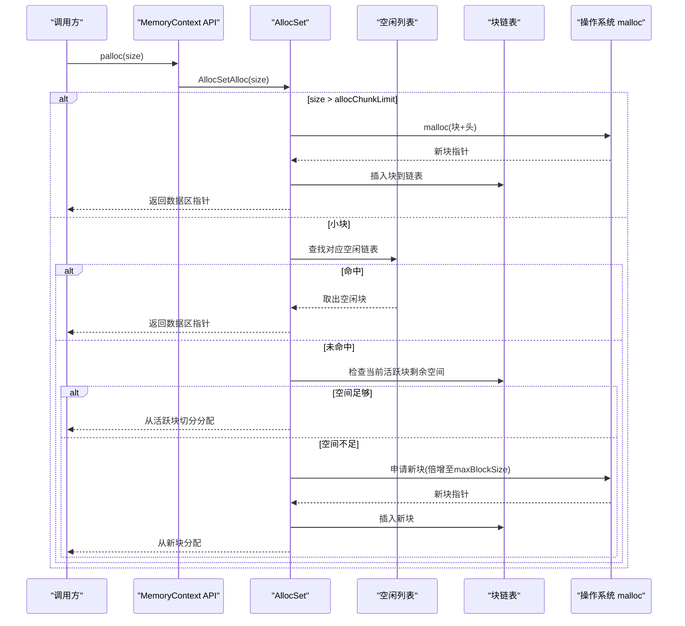
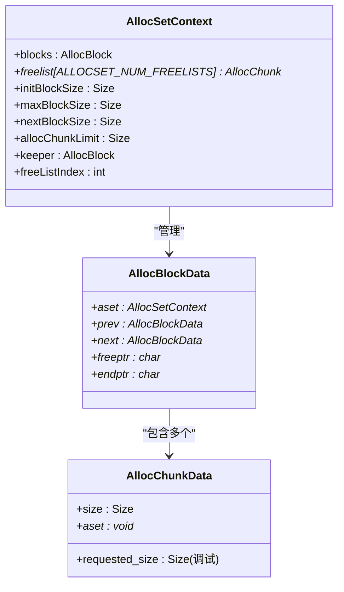
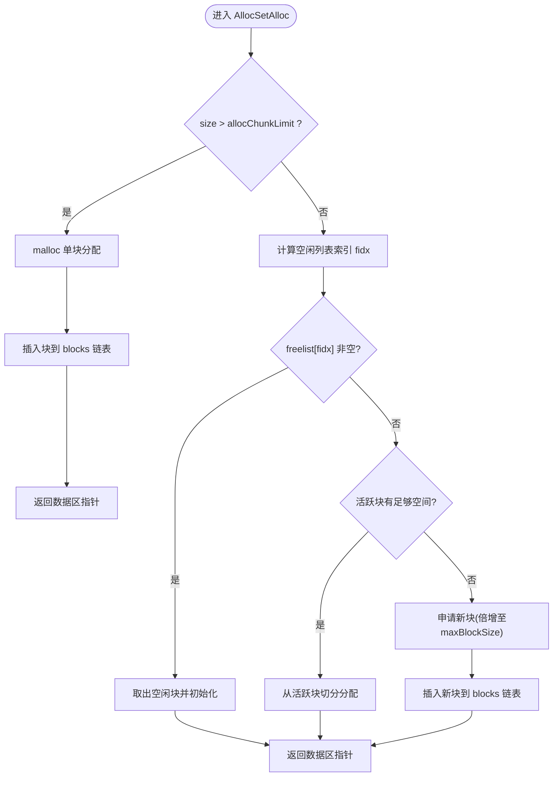
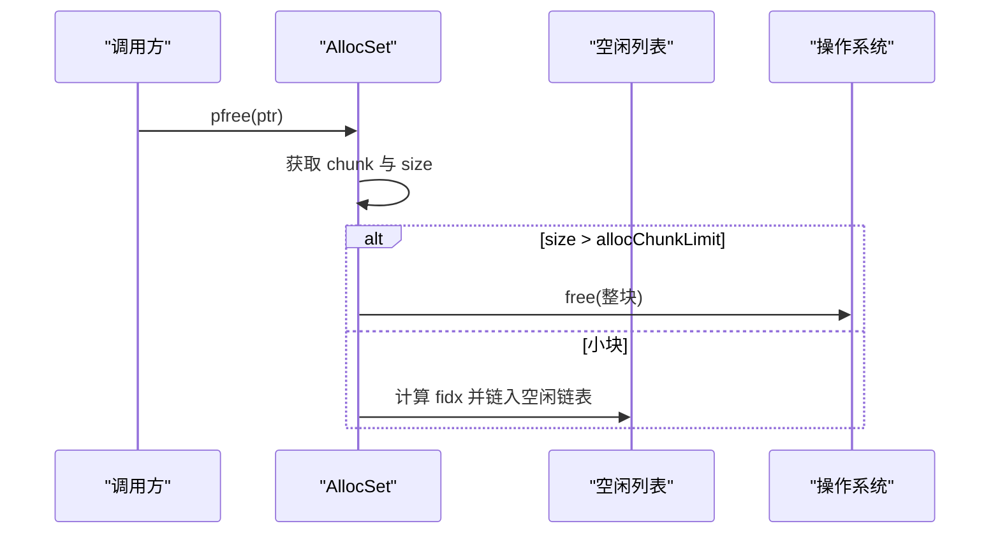
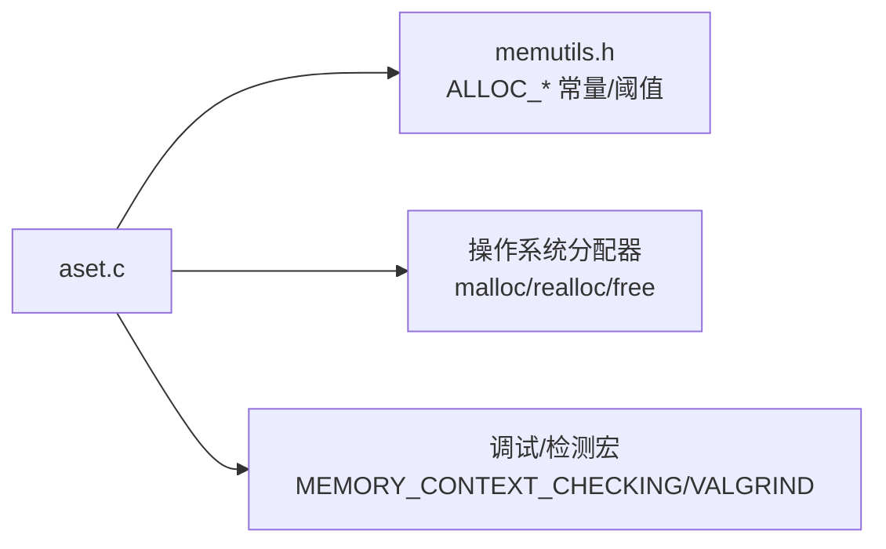

# Aset分配器

<cite>
**本文引用的文件**
- [aset.c](file://src/backend/utils/mmgr/aset.c)
- [memutils.h](file://src/include/utils/memutils.h)
</cite>

## 目录
1. [简介](#简介)
2. [项目结构](#项目结构)
3. [核心组件](#核心组件)
4. [架构总览](#架构总览)
5. [详细组件分析](#详细组件分析)
6. [依赖关系分析](#依赖关系分析)
7. [性能考量](#性能考量)
8. [故障排查指南](#故障排查指南)
9. [结论](#结论)
10. [附录](#附录)

## 简介
本文件为 Mini PostgreSQL 中 AllocSet（Aset）分配器的技术文档。Aset 是标准内存上下文 MemoryContext 的一种实现，采用“块池 + 分块”的策略：将大量小对象分配到少数大区块中，通过固定大小的空闲列表复用小块；超过阈值的大块则直接以独立块形式由底层 malloc 管理，释放时直接归还给系统。该设计显著降低频繁分配/释放带来的开销，并提高局部性与缓存友好性。

## 项目结构
与 Aset 相关的核心代码位于后端 utils/mmgr 目录，头文件在 include/utils 下：
- 实现：src/backend/utils/mmgr/aset.c
- 配置与公共接口：src/include/utils/memutils.h

图表来源
- [aset.c:121-137](file://src/backend/utils/mmgr/aset.c#L121-L137)
- [aset.c:378-544](file://src/backend/utils/mmgr/aset.c#L378-L544)
- [memutils.h:193-223](file://src/include/utils/memutils.h#L193-L223)

章节来源
- [aset.c:1-100](file://src/backend/utils/mmgr/aset.c#L1-L100)
- [memutils.h:193-223](file://src/include/utils/memutils.h#L193-L223)

## 核心组件
- 内存上下文头与元数据：AllocSetContext，维护块链表、空闲列表、分配参数等。
- 块：AllocBlockData，表示从 malloc 获得的一块连续内存，包含 freeptr/endptr 等指针。
- 分块：AllocChunkData，每个分配的单元前缀，记录 size、指向所属 set 或空闲列表的链接。
- 空闲列表：按 2 的幂对齐的多个链表，用于快速匹配相同尺寸范围的小块。
- 上下文回收：context_freelists，对常用参数的上下文进行 LIFO 复用，减少创建/销毁成本。

关键常量与策略
- ALLOC_MINBITS：最小块的指数基，保证最小块至少满足最大对齐要求。
- ALLOCSET_NUM_FREELISTS：空闲列表数量，决定“小块”与“大块”的分界点。
- ALLOC_CHUNK_LIMIT：小块上限，等于 2^(ALLOCSET_NUM_FREELISTS - 1 + ALLOC_MINBITS)。
- ALLOC_CHUNK_FRACTION：限制单个块内小块的最大占比，避免过度碎片化。
- ALLOCSET_SEPARATE_THRESHOLD：与 ALLOC_CHUNK_LIMIT 保持一致，标识“单独分配”的阈值。

章节来源
- [aset.c:53-85](file://src/backend/utils/mmgr/aset.c#L53-L85)
- [aset.c:121-137](file://src/backend/utils/mmgr/aset.c#L121-L137)
- [memutils.h:193-223](file://src/include/utils/memutils.h#L193-L223)

## 架构总览
Aset 的核心流程围绕“小块走空闲列表，大块走独立块”展开。分配时根据请求大小选择路径；释放时将小块挂回空闲列表，大块直接归还系统；重置时保留 keeper 块以减少重复分配。

图表来源
- [aset.c:720-986](file://src/backend/utils/mmgr/aset.c#L720-L986)
- [memutils.h:193-223](file://src/include/utils/memutils.h#L193-L223)

章节来源
- [aset.c:720-986](file://src/backend/utils/mmgr/aset.c#L720-L986)

## 详细组件分析

### 数据结构与内存布局
- AllocSetContext：持有 blocks 链表、freelist 数组、init/max/next block size、allocChunkLimit、keeper 块索引等。
- AllocBlockData：双向链表节点，记录所属 set、前后块指针、可用区间 [freeptr, endptr)。
- AllocChunkData：紧邻用户数据之前的头部，size 为已对齐的容量；在空闲时 aset 字段作为空闲列表链接。

内存布局要点
- 块起始处为块头，随后是若干分块；每个分块前有分块头，再后为用户数据。
- 小块按 2^k 对齐，便于通过位运算快速定位空闲列表索引。
- 大块独占一个块，释放时整块归还系统。

图表来源
- [aset.c:121-137](file://src/backend/utils/mmgr/aset.c#L121-L137)
- [aset.c:151-158](file://src/backend/utils/mmgr/aset.c#L151-L158)
- [aset.c:172-194](file://src/backend/utils/mmgr/aset.c#L172-L194)

章节来源
- [aset.c:121-194](file://src/backend/utils/mmgr/aset.c#L121-L194)

### 分配流程与空闲列表机制
- 小块分配：计算空闲列表索引 fidx = ceil(log2(size >> ALLOC_MINBITS))，优先从对应空闲链表取块；若为空，则在当前活跃块中切分，否则申请新块（初始 initBlockSize，后续倍增至 maxBlockSize）。
- 大块分配：当 size > allocChunkLimit 时，直接 malloc 一个仅容纳该分块的块，并在释放时整块归还系统。
- 活跃块空间不足时，会将剩余空间切分为合适大小的空闲块并入相应空闲链表，避免浪费。

图表来源
- [aset.c:720-986](file://src/backend/utils/mmgr/aset.c#L720-L986)

章节来源
- [aset.c:720-986](file://src/backend/utils/mmgr/aset.c#L720-L986)

### 释放流程与重用策略
- 小块释放：根据分块 size 计算空闲列表索引，将分块链入对应空闲链表，不真正归还系统，以便下次复用。
- 大块释放：验证块一致性后，从 blocks 链表移除并 free() 整个块。
- 重置/删除：Reset 会清空空闲列表并将除 keeper 外的所有块归还系统；Delete 会彻底释放所有资源或将上下文放入全局空闲列表以供复用。

图表来源
- [aset.c:992-1060](file://src/backend/utils/mmgr/aset.c#L992-L1060)

章节来源
- [aset.c:992-1060](file://src/backend/utils/mmgr/aset.c#L992-L1060)

### 扩容与重新分配
- realloc：若原块为大块，使用 realloc 调整整块大小；若为小块且需要扩大，则新建小块并拷贝数据，旧块释放（可能进入空闲列表）。
- 增长策略：小块按 2 的幂对齐，避免频繁移动；大块路径保持“单块独占”，简化边界处理。

章节来源
- [aset.c:1074-1309](file://src/backend/utils/mmgr/aset.c#L1074-L1309)

### 上下文创建与复用
- 创建：校验参数，确定首块大小（考虑 minContextSize/initBlockSize），建立首个块并标记为 keeper，设置空闲列表与分配参数。
- 复用：对于默认或小上下文参数，将已删除的上下文放入 context_freelists，下次创建时直接复用，减少 malloc/free 次数。

章节来源
- [aset.c:378-544](file://src/backend/utils/mmgr/aset.c#L378-L544)
- [aset.c:620-705](file://src/backend/utils/mmgr/aset.c#L620-L705)

## 依赖关系分析
- 模块耦合：Aset 依赖 MemoryContext 抽象接口，并通过 memutils.h 中的宏定义统一参数与阈值。
- 外部依赖：底层通过 malloc/realloc/free 管理大块；调试/检测相关宏（如 MEMORY_CONTEXT_CHECKING、VALGRIND_*）影响行为但不改变主流程。
- 关键约束：allocChunkLimit 必须与 ALLOCSET_SEPARATE_THRESHOLD 一致，确保小块/大块判定一致。

图表来源
- [aset.c:53-85](file://src/backend/utils/mmgr/aset.c#L53-L85)
- [memutils.h:193-223](file://src/include/utils/memutils.h#L193-L223)

章节来源
- [aset.c:53-85](file://src/backend/utils/mmgr/aset.c#L53-L85)
- [memutils.h:193-223](file://src/include/utils/memutils.h#L193-L223)

## 性能考量
- 小块重用：通过空闲列表避免频繁系统调用，提升热点路径性能。
- 块倍增：新块按倍增策略增长，减少分配次数，同时受 maxBlockSize 限制防止过大。
- 大块直配：超过阈值的请求直接由系统分配/释放，避免小块列表膨胀与长期占用。
- 参数调优建议：
  - 增大 ALLOCSET_NUM_FREELISTS：提高小块粒度细分，适合大量不同尺寸小对象的场景，但会增加空闲列表遍历与内存开销。
  - 调整 initBlockSize/maxBlockSize：针对工作负载的峰值与持续时间，平衡首次分配与后续增长。
  - 合理设置 minContextSize：对高频短生命周期上下文，可预分配更多空间以减少早期增长。
  - 保持 allocChunkLimit 与 ALLOCSET_SEPARATE_THRESHOLD 一致，避免判定不一致导致的性能退化。

[本节提供通用指导，无需特定文件引用]

## 故障排查指南
- 常见错误信号：
  - 释放时找不到包含分块的块：检查块指针合法性与一致性（aset/freeptr/endptr）。
  - 检测到越界写入：启用 MEMORY_CONTEXT_CHECKING，利用哨兵检测越界。
  - 内存泄漏/不一致：使用 AllocSetStats/MemoryContextStats 统计块数、空闲块数与空间分布。
- 诊断步骤：
  - 确认请求是否超过 allocChunkLimit，判断走小块还是大块路径。
  - 检查空闲列表索引计算是否正确（与 ALLOC_MINBITS 相关）。
  - 观察 blocks 链表状态，确认活跃块与 keeper 块位置正确。
  - 在调试构建下运行，关注警告信息定位问题。

章节来源
- [aset.c:1009-1042](file://src/backend/utils/mmgr/aset.c#L1009-L1042)
- [aset.c:1410-1531](file://src/backend/utils/mmgr/aset.c#L1410-L1531)

## 结论
Aset 通过“小块复用 + 大块直配”的双轨策略，在大多数工作负载下实现了低延迟、高吞吐的内存分配。其关键优势在于：
- 用少量大块承载大量小块，降低系统调用频率与碎片化。
- 空闲列表按 2 的幂组织，分配/释放路径高效且可预测。
- 上下文复用进一步减少创建/销毁成本。
合理配置 ALLOC_MINBITS、ALLOCSET_NUM_FREELISTS、ALLOC_CHUNK_LIMIT 以及上下文尺寸参数，可在不同场景下取得更优的性能与内存占用平衡。

[本节总结性内容，无需特定文件引用]

## 附录
- 关键常量与含义
  - ALLOC_MINBITS：最小块的对齐指数基，确保最小块满足最大对齐。
  - ALLOCSET_NUM_FREELISTS：空闲列表数量，决定小块粒度与小块/大块分界。
  - ALLOC_CHUNK_LIMIT：小块上限，超过即走大块路径。
  - ALLOC_CHUNK_FRACTION：限制小块在块内的最大占比，控制碎片。
  - ALLOCSET_SEPARATE_THRESHOLD：与 ALLOC_CHUNK_LIMIT 一致，供上层逻辑参考。
- 推荐上下文参数
  - 默认上下文：ALLOCSET_DEFAULT_SIZES（较大初始块与上限）。
  - 小上下文：ALLOCSET_SMALL_SIZES（较小初始块与上限）。
  - 启动小但可能增长：ALLOCSET_START_SMALL_SIZES。

章节来源
- [aset.c:53-85](file://src/backend/utils/mmgr/aset.c#L53-L85)
- [memutils.h:193-223](file://src/include/utils/memutils.h#L193-L223)