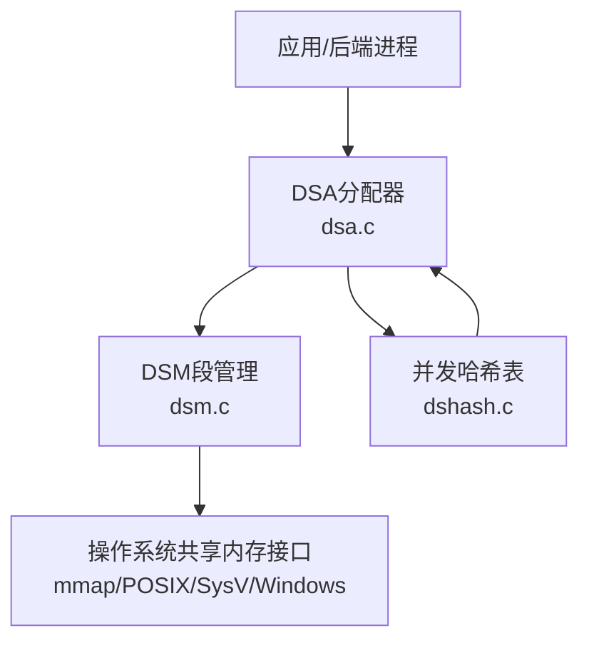
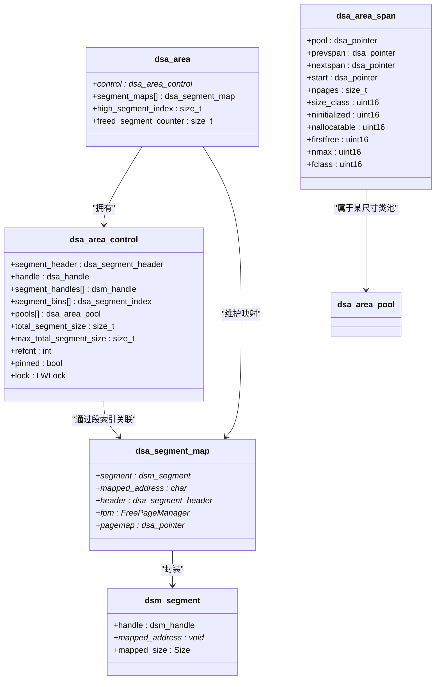
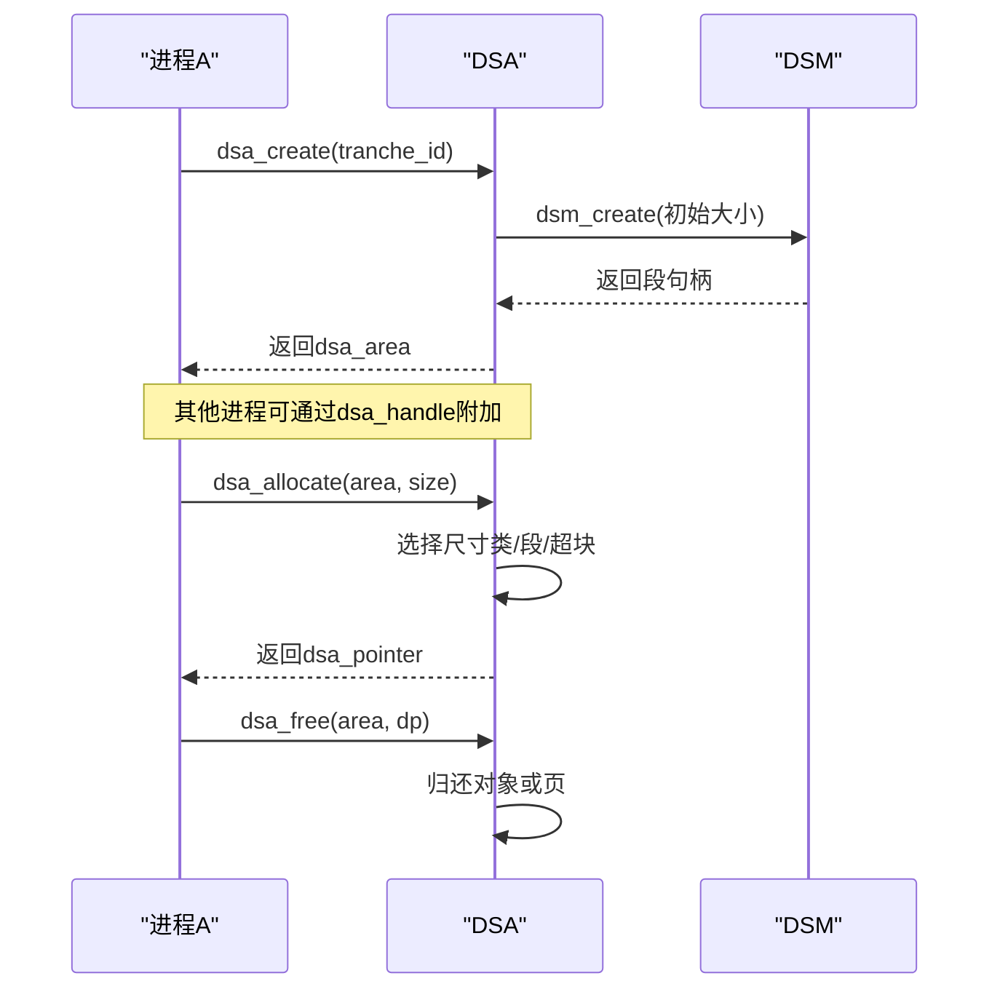
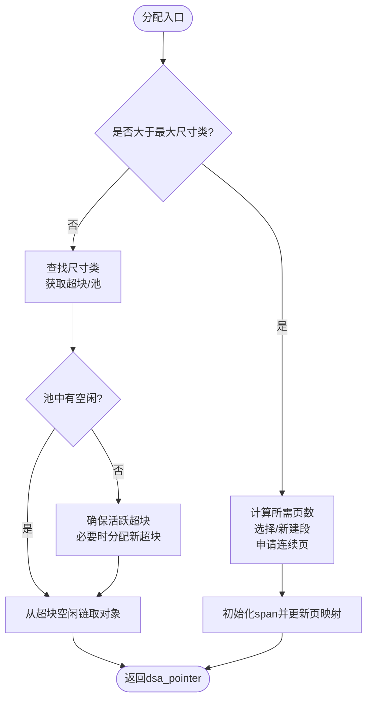
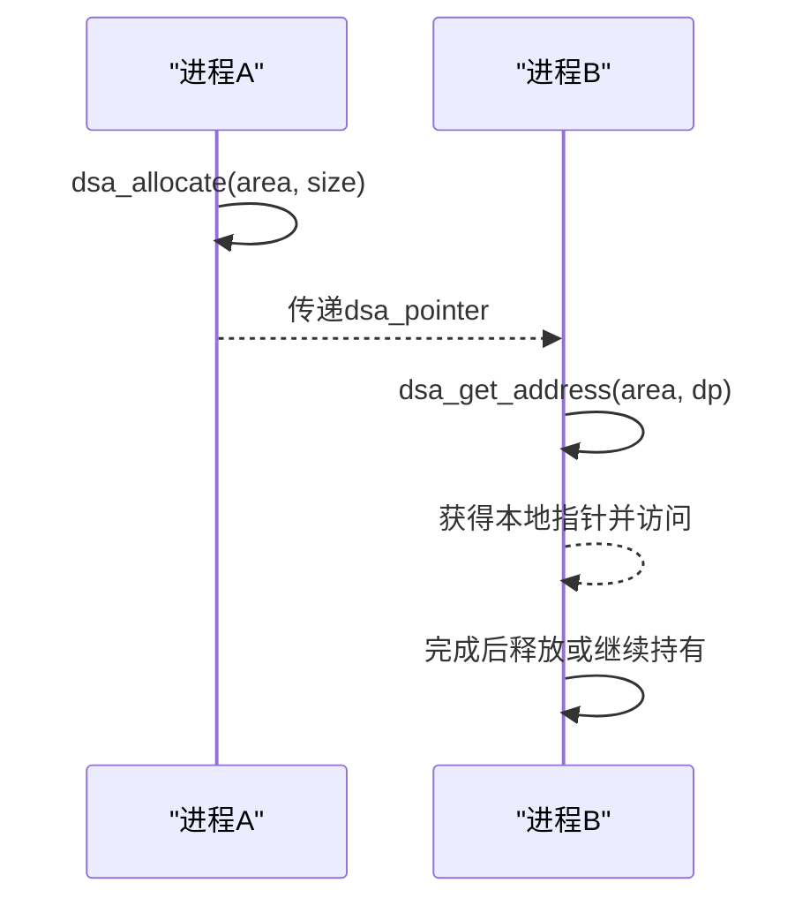
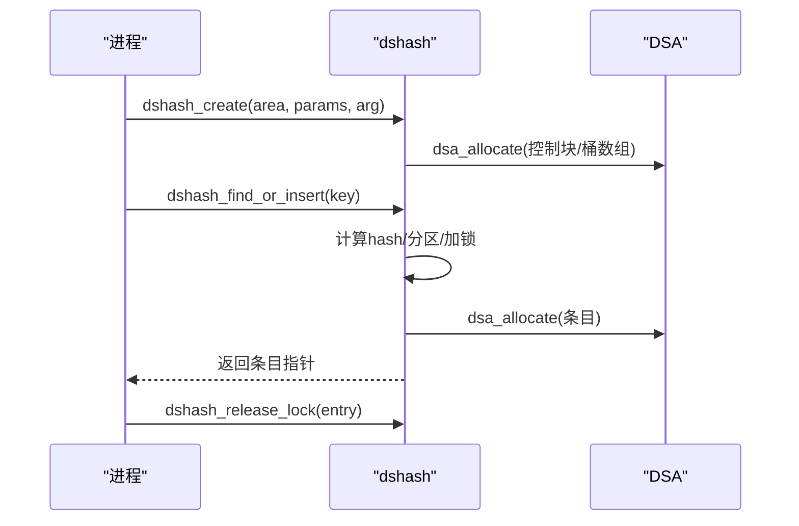
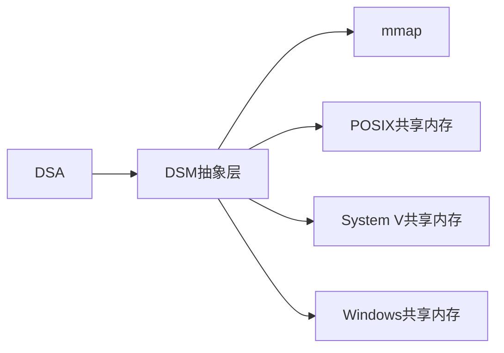
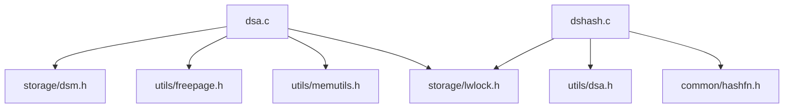

# DSA分配器

<cite>
**本文引用的文件**
- [src/include/utils/dsa.h](file://src/include/utils/dsa.h)
- [src/backend/utils/mmgr/dsa.c](file://src/backend/utils/mmgr/dsa.c)
- [src/include/lib/dshash.h](file://src/include/lib/dshash.h)
- [src/backend/lib/dshash.c](file://src/backend/lib/dshash.c)
- [src/include/storage/dsm.h](file://src/include/storage/dsm.h)
- [src/backend/storage/ipc/dsm.c](file://src/backend/storage/ipc/dsm.c)
</cite>

## 目录
1. [简介](#简介)
2. [项目结构](#项目结构)
3. [核心组件](#核心组件)
4. [架构总览](#架构总览)
5. [详细组件分析](#详细组件分析)
6. [依赖关系分析](#依赖关系分析)
7. [性能考虑](#性能考虑)
8. [故障排查指南](#故障排查指南)
9. [结论](#结论)
10. [附录：进程间通信示例与最佳实践](#附录进程间通信示例与最佳实践)

## 简介
本文件为Mini PostgreSQL中的DSA（Dynamic Shared Allocation，动态共享分配）分配器提供系统化文档。DSA在DSM（Dynamic Shared Memory，动态共享内存）之上构建，提供跨进程共享的堆式内存管理，支持高效的小对象与大对象分配、区域化生命周期管理、以及通过“相对指针”实现安全的跨进程访问。同时，文档还涵盖基于DSA的并发哈希表dshash的实现要点，以及与DSM系统的集成方式。

## 项目结构
DSA相关代码主要分布在以下位置：
- 公共接口与类型定义：src/include/utils/dsa.h
- 分配器核心实现：src/backend/utils/mmgr/dsa.c
- 并发哈希表（基于DSA）：src/include/lib/dshash.h, src/backend/lib/dshash.c
- DSM抽象层：src/include/storage/dsm.h, src/backend/storage/ipc/dsm.c

图表来源
- [src/backend/utils/mmgr/dsa.c:1-800](file://src/backend/utils/mmgr/dsa.c#L1-L800)
- [src/backend/storage/ipc/dsm.c:1-200](file://src/backend/storage/ipc/dsm.c#L1-L200)
- [src/backend/lib/dshash.c:1-200](file://src/backend/lib/dshash.c#L1-L200)

章节来源
- [src/include/utils/dsa.h:1-124](file://src/include/utils/dsa.h#L1-L124)
- [src/backend/utils/mmgr/dsa.c:1-800](file://src/backend/utils/mmgr/dsa.c#L1-L800)
- [src/include/lib/dshash.h:1-91](file://src/include/lib/dshash.h#L1-L91)
- [src/backend/lib/dshash.c:1-200](file://src/backend/lib/dshash.c#L1-L200)
- [src/include/storage/dsm.h:1-61](file://src/include/storage/dsm.h#L1-L61)
- [src/backend/storage/ipc/dsm.c:1-200](file://src/backend/storage/ipc/dsm.c#L1-L200)

## 核心组件
- dsa_area：DSA区域的进程本地句柄，维护控制块映射、各DSM段的映射表、引用计数等。
- dsa_pointer：跨进程可传递的“相对指针”，编码了段索引与偏移，需经dsa_get_address转换为本地指针后使用。
- dsa_handle：DSA区域句柄，本质是首个DSM段的handle，用于跨进程attach。
- dsm_segment：DSM段封装，负责创建、附加、分离、固定映射等。
- dshash_table：基于DSA的并发哈希表，使用分区锁与动态扩容，数据存储在DSA区域内。

章节来源
- [src/include/utils/dsa.h:20-124](file://src/include/utils/dsa.h#L20-L124)
- [src/include/storage/dsm.h:18-61](file://src/include/storage/dsm.h#L18-L61)
- [src/include/lib/dshash.h:19-91](file://src/include/lib/dshash.h#L19-L91)

## 架构总览
DSA以DSM段为底层存储单元，按页组织并维护空闲页管理器；小对象通过尺寸类池与超块（span）管理，大对象直接分配连续页。每个DSA区域维护多个DSM段，并通过段索引+偏移编码成dsa_pointer进行跨进程传递。

图表来源
- [src/backend/utils/mmgr/dsa.c:147-376](file://src/backend/utils/mmgr/dsa.c#L147-L376)
- [src/include/storage/dsm.h:18-61](file://src/include/storage/dsm.h#L18-L61)

## 详细组件分析

### DSA区域与生命周期
- 创建区域：dsa_create在DSM中创建控制段并初始化控制块，后续按需扩展更多DSM段。
- 就地创建：dsa_create_in_place在已有共享内存上构造DSA区域，适用于嵌入到预分配共享区。
- 附加区域：dsa_attach通过dsa_handle附加到已有区域；dsa_attach_in_place用于就地创建的区域。
- 释放与固定：dsa_release_in_place减少引用计数并在归零时解除所有DSM段的pin；dsa_pin_mapping固定当前进程的映射以避免被回收。

图表来源
- [src/backend/utils/mmgr/dsa.c:420-529](file://src/backend/utils/mmgr/dsa.c#L420-L529)
- [src/backend/utils/mmgr/dsa.c:665-815](file://src/backend/utils/mmgr/dsa.c#L665-L815)

章节来源
- [src/backend/utils/mmgr/dsa.c:420-529](file://src/backend/utils/mmgr/dsa.c#L420-L529)
- [src/backend/utils/mmgr/dsa.c:601-642](file://src/backend/utils/mmgr/dsa.c#L601-L642)

### 分配策略与内存模型
- 尺寸类与小对象：小于等于最大尺寸类的请求进入对应尺寸类池，通过超块（span）管理空闲链表，每超块固定页数（如16页=64KB），提高局部性并降低碎片。
- 大对象：超过最大尺寸类的请求直接申请连续页，由特殊span管理，释放时直接归还页到空闲页管理器。
- 段选择与分箱：按最大连续空闲页长度将段分箱，优先从能容纳请求且更可能整块回收的段分配。
- 对齐与元数据：页大小为FPM_PAGE_SIZE（通常4KB），超块与span等元数据位于段内或独立页，页映射表记录页归属的span以便快速释放。

图表来源
- [src/backend/utils/mmgr/dsa.c:665-815](file://src/backend/utils/mmgr/dsa.c#L665-L815)
- [src/backend/utils/mmgr/dsa.c:236-247](file://src/backend/utils/mmgr/dsa.c#L236-L247)

章节来源
- [src/backend/utils/mmgr/dsa.c:665-815](file://src/backend/utils/mmgr/dsa.c#L665-L815)
- [src/backend/utils/mmgr/dsa.c:236-247](file://src/backend/utils/mmgr/dsa.c#L236-L247)

### 跨进程安全访问与dsa_pointer
- dsa_pointer编码段号与偏移，跨进程传递安全但不可直接解引用。
- 必须调用dsa_get_address将dsa_pointer转换为本地指针后再访问。
- 无效指针用InvalidDsaPointer表示，可用DsaPointerIsValid检查。

图表来源
- [src/include/utils/dsa.h:45-81](file://src/include/utils/dsa.h#L45-L81)
- [src/backend/utils/mmgr/dsa.c:665-815](file://src/backend/utils/mmgr/dsa.c#L665-L815)

章节来源
- [src/include/utils/dsa.h:45-81](file://src/include/utils/dsa.h#L45-L81)

### 并发哈希表（dshash）
- 数据结构：开放寻址+桶链表，条目包含用户数据与指向下一项的dsa_pointer。
- 分区锁：固定数量的分区（默认128），每个分区独立锁，提升并发度。
- 动态扩容：当分区负载因子超过阈值时触发扩容，重新插入所有条目到新桶数组。
- 共享：控制结构与桶数组均位于DSA区域，跨进程可见。

图表来源
- [src/backend/lib/dshash.c:197-254](file://src/backend/lib/dshash.c#L197-L254)
- [src/backend/lib/dshash.c:424-485](file://src/backend/lib/dshash.c#L424-L485)
- [src/backend/lib/dshash.c:662-734](file://src/backend/lib/dshash.c#L662-L734)

章节来源
- [src/include/lib/dshash.h:19-91](file://src/include/lib/dshash.h#L19-L91)
- [src/backend/lib/dshash.c:197-254](file://src/backend/lib/dshash.c#L197-L254)
- [src/backend/lib/dshash.c:424-485](file://src/backend/lib/dshash.c#L424-L485)
- [src/backend/lib/dshash.c:662-734](file://src/backend/lib/dshash.c#L662-L734)

### 与DSM系统集成
- DSM提供段创建、附加、分离、固定映射等能力，DSA在其上构建区域与段管理。
- DSM支持多种后端实现（mmap/POSIX/SysV/Windows），DSA不关心具体实现细节。
- 通过on_dsm_detach回调自动清理资源，避免泄漏。

图表来源
- [src/backend/storage/ipc/dsm.c:145-200](file://src/backend/storage/ipc/dsm.c#L145-L200)
- [src/include/storage/dsm.h:35-61](file://src/include/storage/dsm.h#L35-L61)

章节来源
- [src/backend/storage/ipc/dsm.c:145-200](file://src/backend/storage/ipc/dsm.c#L145-L200)
- [src/include/storage/dsm.h:35-61](file://src/include/storage/dsm.h#L35-L61)

## 依赖关系分析
- dsa.c依赖：
  - storage/dsm.h：DSM段操作
  - utils/freepage.h：空闲页管理器
  - utils/memutils.h：通用内存工具
  - storage/lwlock.h：轻量级锁
- dshash.c依赖：
  - utils/dsa.h：DSA接口
  - storage/lwlock.h：分区锁
  - common/hashfn.h：哈希函数

图表来源
- [src/backend/utils/mmgr/dsa.c:51-60](file://src/backend/utils/mmgr/dsa.c#L51-L60)
- [src/backend/lib/dshash.c:32-39](file://src/backend/lib/dshash.c#L32-L39)

章节来源
- [src/backend/utils/mmgr/dsa.c:51-60](file://src/backend/utils/mmgr/dsa.c#L51-L60)
- [src/backend/lib/dshash.c:32-39](file://src/backend/lib/dshash.c#L32-L39)

## 性能考虑
- 小对象分配：
  - 尺寸类池减少碎片，超块粒度（如64KB）提高缓存局部性。
  - 每尺寸类一个LWLock，适度并发；未来可考虑每核池以降低竞争。
- 大对象分配：
  - 直接分配连续页，避免内部碎片；需要较大连续空间时优先选择合适段。
- 段选择策略：
  - 按最大连续空闲页分箱，尽量集中占用，便于整段回收。
- 锁定粒度：
  - 区域级锁保护段列表与全局状态；池级锁保护小对象分配；哈希表使用分区锁。
- 内存对齐：
  - 页对齐与MAXALIGN保证数据结构对齐，减少CPU访问开销。
- 零初始化：
  - 可选DSA_ALLOC_ZERO，权衡安全性与性能。

[本节为一般性指导，不直接分析具体文件]

## 故障排查指南
- 分配失败：
  - 检查是否设置了DSA_ALLOC_NO_OOM；否则将抛出OOM错误。
  - 确认区域大小限制（dsa_set_size_limit）未超限。
- 非法指针：
  - 使用DsaPointerIsValid校验dsa_pointer有效性。
  - 确保通过dsa_get_address转换后再访问。
- 段释放与映射失效：
  - 若段被unpin或detach，需重新attach或重建映射。
  - 利用on_dsm_detach回调确保正确释放。
- 哈希表异常：
  - 检查分区锁是否正确获取与释放。
  - 扩容期间注意ensure_valid_bucket_pointers同步。

章节来源
- [src/backend/utils/mmgr/dsa.c:665-815](file://src/backend/utils/mmgr/dsa.c#L665-L815)
- [src/backend/lib/dshash.c:381-412](file://src/backend/lib/dshash.c#L381-L412)
- [src/backend/lib/dshash.c:741-750](file://src/backend/lib/dshash.c#L741-L750)

## 结论
DSA为Mini PostgreSQL提供了高效、可扩展的跨进程共享内存分配机制。通过尺寸类池与超块管理小对象，直接页分配处理大对象，结合DSM段管理与空闲页管理器，实现了良好的性能与低碎片。配合dshash提供的并发哈希表，可在多进程中安全地共享复杂数据结构。合理设置分配标志、关注锁定粒度与内存对齐，可获得稳定高效的运行表现。

[本节为总结性内容，不直接分析具体文件]

## 附录：进程间通信示例与最佳实践

- 基本流程
  - 进程A创建DSA区域并分配数据，获取dsa_handle。
  - 进程B通过dsa_handle附加到同一区域，使用dsa_pointer访问共享数据。
  - 使用dsa_free释放对象，结束时释放区域或等待系统回收。

- 关键API路径参考
  - 创建与附加区域：[src/backend/utils/mmgr/dsa.c:420-529](file://src/backend/utils/mmgr/dsa.c#L420-L529)
  - 分配与释放：[src/backend/utils/mmgr/dsa.c:665-815](file://src/backend/utils/mmgr/dsa.c#L665-L815)
  - 哈希表创建与操作：[src/backend/lib/dshash.c:197-254](file://src/backend/lib/dshash.c#L197-L254), [src/backend/lib/dshash.c:424-485](file://src/backend/lib/dshash.c#L424-L485)
  - DSM段管理：[src/include/storage/dsm.h:35-61](file://src/include/storage/dsm.h#L35-L61), [src/backend/storage/ipc/dsm.c:145-200](file://src/backend/storage/ipc/dsm.c#L145-L200)

- 最佳实践
  - 优先使用dsa_allocate0初始化共享数据，避免未定义行为。
  - 对频繁分配的小对象，选择合适的尺寸类以减少浪费。
  - 合理使用DSA_ALLOC_HUGE仅在大对象场景启用。
  - 使用dsa_pin_mapping延长映射生命周期，避免意外回收。
  - 在哈希表中及时释放条目并调用dshash_release_lock，防止死锁。

[本节为概念性指导，不直接分析具体文件]