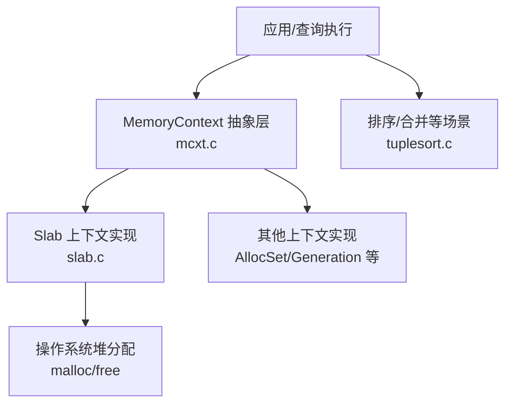
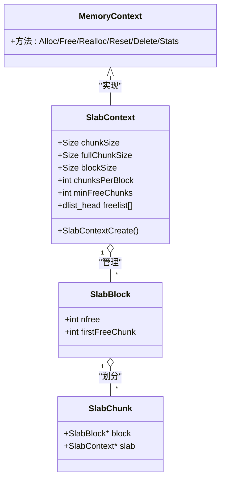
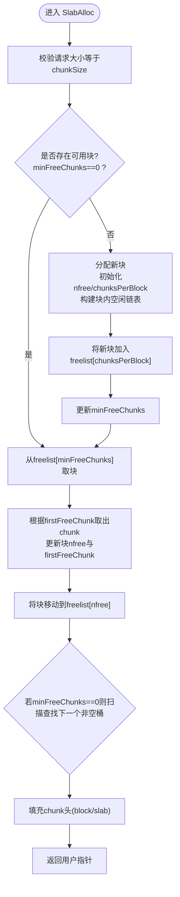
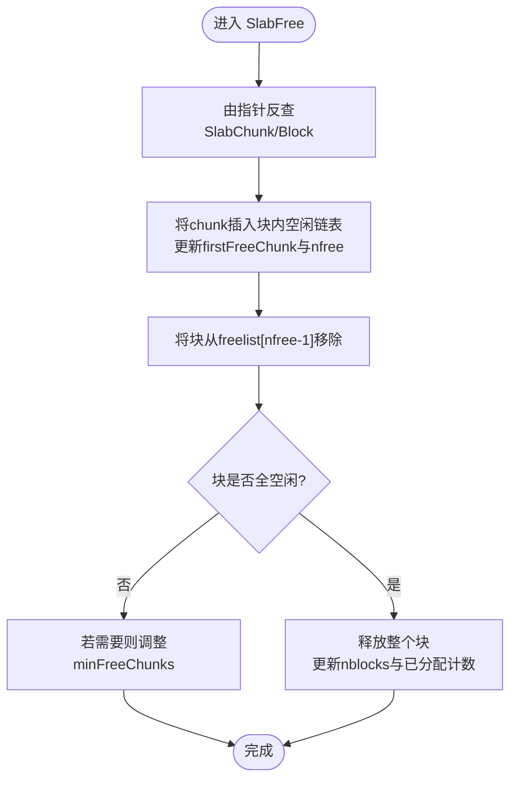
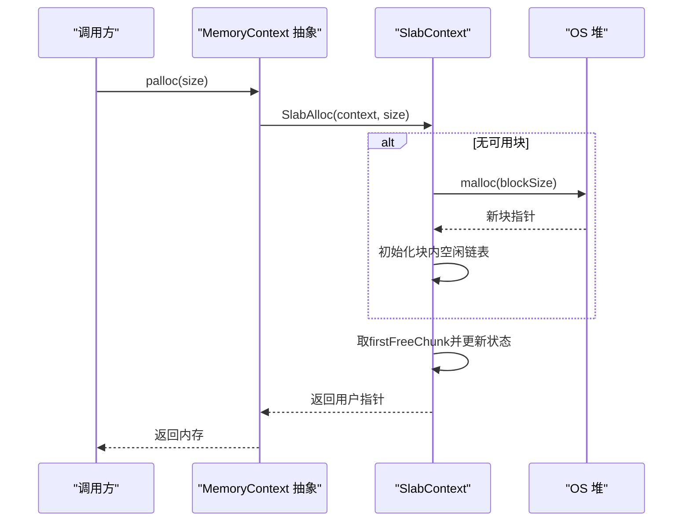

# Slab分配器

<cite>
**本文引用的文件**
- [slab.c](file://src/backend/utils/mmgr/slab.c)
- [memutils.h](file://src/include/utils/memutils.h)
- [mcxt.c](file://src/backend/utils/mmgr/mcxt.c)
- [tuplesort.c](file://src/backend/utils/sort/tuplesort.c)
</cite>

## 目录
1. [简介](#简介)
2. [项目结构](#项目结构)
3. [核心组件](#核心组件)
4. [架构总览](#架构总览)
5. [详细组件分析](#详细组件分析)
6. [依赖关系分析](#依赖关系分析)
7. [性能考量](#性能考量)
8. [故障排查指南](#故障排查指南)
9. [结论](#结论)
10. [附录：使用最佳实践与配置建议](#附录使用最佳实践与配置建议)

## 简介
本文件为Mini PostgreSQL中的Slab分配器提供系统化、可操作的文档。Slab是一种面向“固定大小对象”的内存上下文实现，通过预分配大块内存并切分为等大小的块（chunk），在块内维护空闲链表，从而显著降低频繁分配/释放相同大小对象的开销。其核心思想是：以空间换时间，用少量元数据与块级索引，将分配/回收路径优化到常数时间级别，并在缓存命中时避免系统调用。

## 项目结构
- Slab分配器实现位于后端工具层的内存管理模块中，作为MemoryContext的一种具体实现。
- 相关接口定义于公共头文件，供上层模块创建和使用Slab上下文。
- 典型使用场景包括排序合并阶段对固定大小元组的复用分配。

图表来源
- [mcxt.c:103-140](file://src/backend/utils/mmgr/mcxt.c#L103-L140)
- [slab.c:149-161](file://src/backend/utils/mmgr/slab.c#L149-L161)
- [tuplesort.c:316-343](file://src/backend/utils/sort/tuplesort.c#L316-L343)

章节来源
- [mcxt.c:103-140](file://src/backend/utils/mmgr/mcxt.c#L103-L140)
- [memutils.h:178-182](file://src/include/utils/memutils.h#L178-L182)
- [slab.c:149-161](file://src/backend/utils/mmgr/slab.c#L149-L161)

## 核心组件
- SlabContext：Slab上下文，保存分配参数（chunkSize、blockSize）、每块容纳的chunk数量、按空闲数分桶的双向链表freelist、以及全局最小空闲数minFreeChunks等。
- SlabBlock：一个从堆上分配的大块，内部被划分为多个等长chunk；记录当前空闲chunk数量nfree和首个空闲chunk索引firstFreeChunk。
- SlabChunk：每个chunk的前置头部，包含所属block与所属slab指针，用于反向定位与归属校验。
- 自由列表策略：按块的空闲chunk数量分组组织块，便于快速找到“最满”的块进行复用，减少碎片并加速整块回收。

章节来源
- [slab.c:64-80](file://src/backend/utils/mmgr/slab.c#L64-L80)
- [slab.c:90-113](file://src/backend/utils/mmgr/slab.c#L90-L113)
- [slab.c:116-127](file://src/backend/utils/mmgr/slab.c#L116-L127)

## 架构总览
Slab作为MemoryContext的一种实现，遵循统一的上下文API（分配、释放、重置、删除、统计等）。SlabContextCreate负责初始化上下文与自由列表；SlabAlloc/SlabFree实现高效的固定大小分配与回收；SlabReset/SlabDelete负责批量释放；SlabStats提供统计信息。

图表来源
- [slab.c:64-80](file://src/backend/utils/mmgr/slab.c#L64-L80)
- [slab.c:90-113](file://src/backend/utils/mmgr/slab.c#L90-L113)
- [slab.c:149-161](file://src/backend/utils/mmgr/slab.c#L149-L161)

## 详细组件分析

### 数据结构与布局
- SlabContext：
  - 保存chunkSize、fullChunkSize（含对齐与头部）、blockSize、chunksPerBlock、minFreeChunks、nblocks等关键参数。
  - freelist数组按空闲chunk数量分桶，索引0表示无空闲块，索引chunksPerBlock表示全空闲块。
- SlabBlock：
  - 维护块内空闲计数nfree与首个空闲chunk索引firstFreeChunk，支持O(1)取块首空闲。
- SlabChunk：
  - 每个chunk前缀包含指向block与slab的指针，保证释放时可快速回查上下文与块。

复杂度与空间：
- 分配/释放均为O(1)（平均情况），因为通过minFreeChunks直接定位到合适块，并通过块内firstFreeChunk直接取出空闲chunk。
- 额外空间：每个块有固定头部与块级元数据；每个chunk有固定头部；freelist数组大小为chunksPerBlock+1。

章节来源
- [slab.c:64-80](file://src/backend/utils/mmgr/slab.c#L64-L80)
- [slab.c:90-113](file://src/backend/utils/mmgr/slab.c#L90-L113)
- [slab.c:116-127](file://src/backend/utils/mmgr/slab.c#L116-L127)

### 工作流程：对象分配

图表来源
- [slab.c:341-493](file://src/backend/utils/mmgr/slab.c#L341-L493)

章节来源
- [slab.c:341-493](file://src/backend/utils/mmgr/slab.c#L341-L493)

### 工作流程：对象回收

图表来源
- [slab.c:499-572](file://src/backend/utils/mmgr/slab.c#L499-L572)

章节来源
- [slab.c:499-572](file://src/backend/utils/mmgr/slab.c#L499-L572)

### 工作流程：重置与删除
- SlabReset：遍历所有freelist桶，逐个释放块，清空统计与minFreeChunks。
- SlabDelete：先Reset再释放上下文头。

章节来源
- [slab.c:284-334](file://src/backend/utils/mmgr/slab.c#L284-L334)

### 与其他分配器的区别与适用场景
- 与通用分配器（如AllocSet）相比：
  - Slab仅支持固定大小分配，无法动态扩容；但因此避免了复杂边界管理与碎片整理，分配/释放路径更短。
  - 通过块级空闲链表与全局分桶策略，优先复用“较满”的块，有助于尽快整块回收，降低内存驻留。
- 适用场景：
  - 大量同构小对象的高频创建/销毁，例如排序合并阶段的固定大小元组槽位复用。
  - 对延迟敏感且可预测对象大小的热点路径。

章节来源
- [tuplesort.c:316-343](file://src/backend/utils/sort/tuplesort.c#L316-L343)
- [slab.c:16-49](file://src/backend/utils/mmgr/slab.c#L16-L49)

## 依赖关系分析
- SlabContextCreate依赖底层malloc分配块与上下文头，并初始化freelist。
- SlabAlloc/SlabFree通过块内firstFreeChunk与freelist分桶实现高效操作。
- 统计函数SlabStats遍历freelist收集块数、空闲chunk数、总空间与空闲空间。

图表来源
- [slab.c:341-493](file://src/backend/utils/mmgr/slab.c#L341-L493)
- [mcxt.c:103-140](file://src/backend/utils/mmgr/mcxt.c#L103-L140)

章节来源
- [slab.c:341-493](file://src/backend/utils/mmgr/slab.c#L341-L493)
- [mcxt.c:103-140](file://src/backend/utils/mmgr/mcxt.c#L103-L140)

## 性能考量
- 时间复杂度：
  - 分配/释放均摊O(1)，得益于minFreeChunks与块内firstFreeChunk的直接访问。
  - 当minFreeChunks==0时需分配新块，属于低频事件。
- 空间效率：
  - 每个chunk存在固定头部开销；块内对齐可能带来少量浪费，但整体远小于通用分配器的元数据开销。
  - 通过优先复用较满块，有利于尽早整块释放，降低常驻内存。
- 缓存友好性：
  - 同一块内连续chunk提升局部性；块级空闲链表减少跨块搜索。
- 对比：
  - 对于固定大小对象的高频分配/释放，Slab通常优于通用分配器；对于变长或生命周期差异大的对象，应选用其他上下文类型。

[本节为通用性能讨论，不直接分析具体代码行]

## 故障排查指南
- 常见错误与检查点：
  - 请求大小不匹配：SlabAlloc会拒绝非chunkSize的请求。
  - 越界写入：在开启MEMORY_CONTEXT_CHECKING时，会通过哨兵检测越界。
  - 一致性校验：SlabCheck会遍历freelist与块内空闲链表，校验nfree与bitmap一致性，并检查chunk头指针正确性。
- 调试建议：
  - 启用MEMORY_CONTEXT_CHECKING以捕获越界与不一致。
  - 使用MemoryContextStats/MemoryContextStatsDetail观察上下文占用与块分布。
  - 关注minFreeChunks与freelist状态，确认块迁移逻辑正常。

章节来源
- [slab.c:354-357](file://src/backend/utils/mmgr/slab.c#L354-L357)
- [slab.c:692-794](file://src/backend/utils/mmgr/slab.c#L692-L794)
- [memutils.h:86-89](file://src/include/utils/memutils.h#L86-L89)

## 结论
Slab分配器通过“固定大小+块级空闲链表+全局分桶”的设计，为高频同构对象分配提供了极低的分配/释放成本与良好的内存局部性。它特别适用于数据库内核中对固定大小元组、节点或缓冲槽的快速复用场景。合理设置blockSize与chunkSize，并结合上下文生命周期管理，可在保证安全性的前提下获得显著的性能收益。

[本节为总结性内容，不直接分析具体代码行]

## 附录：使用最佳实践与配置建议
- 何时选择Slab：
  - 对象大小固定且生命周期相近；分配/释放频率高；对延迟敏感。
- 参数建议：
  - blockSize：应能容纳至少一个chunk，并尽量使chunksPerBlock适中，兼顾块内利用率与整块回收概率。
  - chunkSize：必须严格匹配实际对象大小；可通过宏或常量集中管理。
  - 参考默认值：可使用头文件中提供的SLAB_DEFAULT_BLOCK_SIZE与SLAB_LARGE_BLOCK_SIZE作为起点。
- 生命周期管理：
  - 使用MemoryContextReset/ResetChildren批量释放，避免逐块释放带来的开销。
  - 将Slab上下文置于合适的父上下文下，确保资源随事务/查询结束而清理。
- 监控与调优：
  - 定期调用MemoryContextStatsDetail观察块数、空闲chunk数与总占用。
  - 在高并发场景下，结合系统内存压力指标评估是否需要增大blockSize以减少分配次数。
- 注意事项：
  - 不支持realloc改变大小；如需扩容，请重新分配并复制数据。
  - 避免在临界区中进行可能导致失败的分配；必要时允许特定上下文在临界区分配。

章节来源
- [memutils.h:225-227](file://src/include/utils/memutils.h#L225-L227)
- [slab.c:284-334](file://src/backend/utils/mmgr/slab.c#L284-L334)
- [mcxt.c:147-190](file://src/backend/utils/mmgr/mcxt.c#L147-L190)