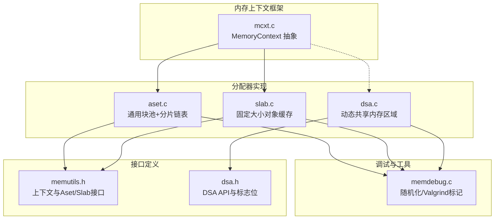
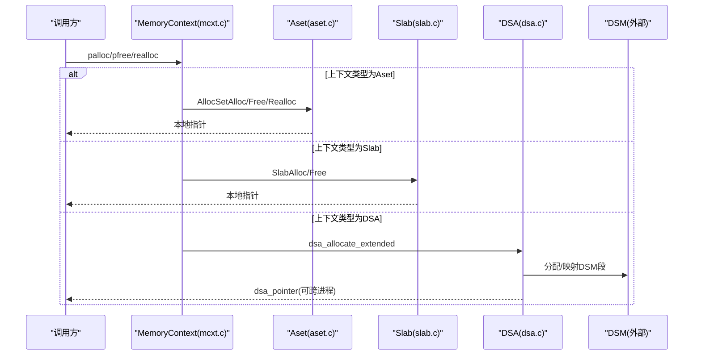
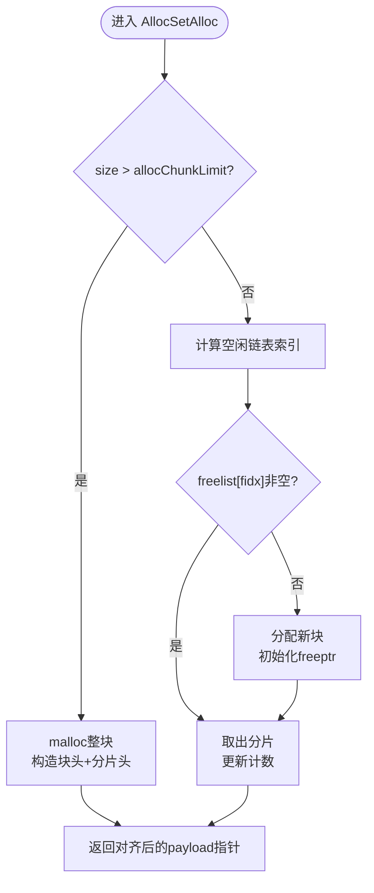
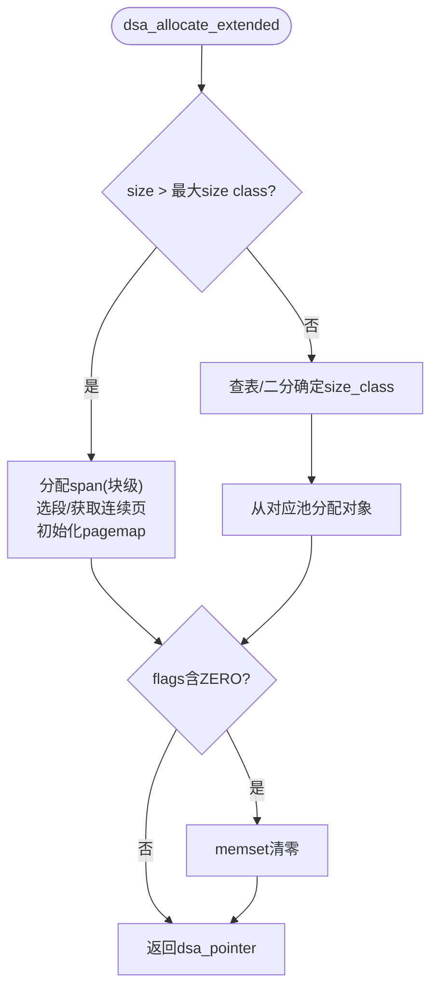
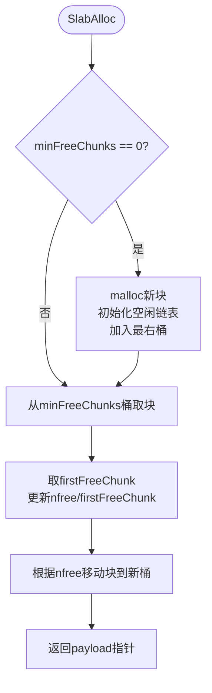
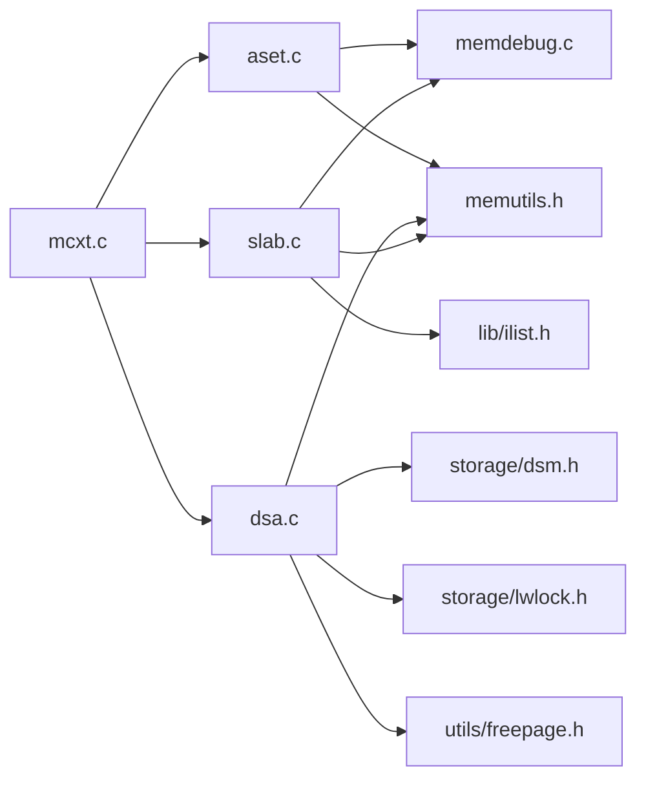

# 内存分配器

<cite>
**本文引用的文件**
- [src/backend/utils/mmgr/aset.c](file://src/backend/utils/mgr/aset.c)
- [src/backend/utils/mmgr/dsa.c](file://src/backend/utils/mmgr/dsa.c)
- [src/backend/utils/mmgr/slab.c](file://src/backend/utils/mmgr/slab.c)
- [src/backend/utils/mmgr/mcxt.c](file://src/backend/utils/mmgr/mcxt.c)
- [src/backend/utils/mmgr/memdebug.c](file://src/backend/utils/mmgr/memdebug.c)
- [src/include/utils/memutils.h](file://src/include/utils/memutils.h)
- [src/include/utils/dsa.h](file://src/include/utils/dsa.h)
</cite>

## 目录
1. [简介](#简介)
2. [项目结构](#项目结构)
3. [核心组件](#核心组件)
4. [架构总览](#架构总览)
5. [详细组件分析](#详细组件分析)
6. [依赖关系分析](#依赖关系分析)
7. [性能考量](#性能考量)
8. [故障排查指南](#故障排查指南)
9. [结论](#结论)
10. [附录](#附录)

## 简介
本文件面向Mini PostgreSQL的内存分配器子系统，系统性阐述三种分配器的设计原理与实现细节：Aset（通用块池+分片链表）、DSA（动态共享内存区域，跨进程共享）与Slab（固定大小对象缓存）。文档覆盖以下主题：
- 各分配器的快速分配策略、数据结构与复杂度
- 生命周期管理：分配、重新分配、释放、对齐处理
- 调试能力：越界检测、已释放内存访问检测、统计信息
- 架构图、性能对比表与选型指南，帮助开发者按场景选择合适策略

## 项目结构
内存分配相关代码集中在后端工具层 utils/mmgr，并通过 include/utils 暴露接口。关键文件如下：
- Aset：通用分配器，基于块池与多级空闲链表，适合大多数场景
- DSA：动态共享内存区域，基于DSM段与页级管理，支持跨进程共享指针
- Slab：固定大小对象缓存，适合大量等尺寸对象的分配/释放
- mcxt：内存上下文框架，统一封装创建、重置、删除、统计等生命周期操作
- memdebug：调试宏与辅助功能（随机化填充、Valgrind标记等）
- 头文件：memutils.h、dsa.h 提供对外API与常量定义

图表来源
- [src/backend/utils/mmgr/mcxt.c:103-140](file://src/backend/utils/mmgr/mcxt.c#L103-L140)
- [src/backend/utils/mmgr/aset.c:266-297](file://src/backend/utils/mmgr/aset.c#L266-L297)
- [src/backend/utils/mmgr/slab.c:129-161](file://src/backend/utils/mmgr/slab.c#L129-L161)
- [src/backend/utils/mmgr/dsa.c:420-529](file://src/backend/utils/mmgr/dsa.c#L420-L529)
- [src/backend/utils/mmgr/memdebug.c:14-53](file://src/backend/utils/mmgr/memdebug.c#L14-L53)
- [src/include/utils/memutils.h:156-182](file://src/include/utils/memutils.h#L156-L182)
- [src/include/utils/dsa.h:72-120](file://src/include/utils/dsa.h#L72-L120)

章节来源
- [src/backend/utils/mmgr/mcxt.c:103-140](file://src/backend/utils/mmgr/mcxt.c#L103-L140)
- [src/include/utils/memutils.h:156-182](file://src/include/utils/memutils.h#L156-L182)
- [src/include/utils/dsa.h:72-120](file://src/include/utils/dsa.h#L72-L120)

## 核心组件
- MemoryContext 抽象：统一的上下文接口，包含分配、释放、重置、删除、统计等方法指针；具体分配器通过实现这些方法接入框架
- Aset：维护块链表与多级别空闲链表（按2的幂次大小），小对象走分片链表，大对象直接独占块并返回给系统
- DSA：以DSM段为底层存储，维护“超块-跨度”两级结构，小对象使用固定大小类池，大对象直接申请连续页
- Slab：将大块切分为固定大小的chunk，按块内空闲链表与全局按空闲数分桶的块链表组织，追求零碎片与高复用率
- 调试：CLOBBER_FREED_MEMORY、MEMORY_CONTEXT_CHECKING、RANDOMIZE_ALLOCATED_MEMORY、VALGRIND标记等

章节来源
- [src/backend/utils/mmgr/mcxt.c:103-140](file://src/backend/utils/mmgr/mcxt.c#L103-L140)
- [src/backend/utils/mmgr/aset.c:53-81](file://src/backend/utils/mmgr/aset.c#L53-L81)
- [src/backend/utils/mmgr/dsa.c:216-247](file://src/backend/utils/mmgr/dsa.c#L216-L247)
- [src/backend/utils/mmgr/slab.c:16-49](file://src/backend/utils/mmgr/slab.c#L16-L49)
- [src/backend/utils/mmgr/memdebug.c:14-53](file://src/backend/utils/mmgr/memdebug.c#L14-L53)

## 架构总览
下图展示内存上下文如何调度到不同分配器，以及DSA的跨进程共享路径。

图表来源
- [src/backend/utils/mmgr/mcxt.c:147-191](file://src/backend/utils/mmgr/mcxt.c#L147-L191)
- [src/backend/utils/mmgr/aset.c:720-800](file://src/backend/utils/mmgr/aset.c#L720-L800)
- [src/backend/utils/mmgr/slab.c:341-493](file://src/backend/utils/mmgr/slab.c#L341-L493)
- [src/backend/utils/mmgr/dsa.c:665-800](file://src/backend/utils/mmgr/dsa.c#L665-L800)

## 详细组件分析

### Aset 分配器（通用块池+分片链表）
- 设计要点
  - 小块：按2的幂次大小建立多个空闲链表，分配时通过位运算快速定位链表索引
  - 大块：超过阈值则单独分配一个块，释放时直接归还系统，避免长期占用
  - 块增长：首次分配后按需倍增块大小，减少malloc调用次数
  - 上下文回收：对常用参数组合的上下文进行复用，降低创建开销
- 数据结构
  - AllocBlockData：块头，维护freeptr/endptr及前后块指针
  - AllocChunkData：分片头，记录size与所属aset，payload前对齐
  - freelist[ALLOCSET_NUM_FREELISTS]：按大小类的空闲分片链表
- 复杂度
  - 分配：O(1)（计算索引+链表头取用）
  - 释放：O(1)（插入对应空闲链表）
  - 重新分配：可能触发复制+释放，取决于是否跨阈值
- 对齐与边界
  - 所有chunk满足MAXALIGN；超大请求直接独占块，避免碎片
- 典型流程（分配）

图表来源
- [src/backend/utils/mmgr/aset.c:308-354](file://src/backend/utils/mmgr/aset.c#L308-L354)
- [src/backend/utils/mmgr/aset.c:720-800](file://src/backend/utils/mmgr/aset.c#L720-L800)

章节来源
- [src/backend/utils/mmgr/aset.c:53-81](file://src/backend/utils/mmgr/aset.c#L53-L81)
- [src/backend/utils/mmgr/aset.c:151-194](file://src/backend/utils/mmgr/aset.c#L151-L194)
- [src/backend/utils/mmgr/aset.c:378-544](file://src/backend/utils/mmgr/aset.c#L378-L544)
- [src/backend/utils/mmgr/aset.c:558-617](file://src/backend/utils/mmgr/aset.c#L558-L617)
- [src/backend/utils/mmgr/aset.c:720-800](file://src/backend/utils/mmgr/aset.c#L720-L800)

### DSA 分配器（动态共享内存区域）
- 设计要点
  - 基于DSM段构建共享内存堆，支持跨进程共享的dsa_pointer
  - 小对象：按预定义的大小类（size classes）组织在池中，每个池由若干“超块”组成，超块内部再划分为固定大小的对象槽
  - 大对象：直接申请连续页，独立span管理，释放时回收到自由页管理器
  - 并发控制：全局锁保护段管理，每大小类池有独立LWLock保护小对象分配
- 数据结构
  - dsa_area_control：区域控制块，含段列表、池数组、统计与限制
  - dsa_segment_header：段头，维护可用页数、双向链式段桶
  - dsa_area_span：超块元数据，维护起止地址、对象数量、空闲链表等
  - dsa_size_classes[]：大小类表，兼顾空间利用率与碎片控制
- 复杂度
  - 小对象分配：O(1)（查找大小类+池中超块空闲槽）
  - 大对象分配：近似O(1)（选择最佳段+FPM获取连续页）
  - 释放：小对象O(1)，大对象O(1)（回收到FPM）
- 典型流程（分配）

图表来源
- [src/backend/utils/mmgr/dsa.c:216-247](file://src/backend/utils/mmgr/dsa.c#L216-L247)
- [src/backend/utils/mmgr/dsa.c:665-800](file://src/backend/utils/mmgr/dsa.c#L665-L800)

章节来源
- [src/backend/utils/mmgr/dsa.c:147-179](file://src/backend/utils/mmgr/dsa.c#L147-L179)
- [src/backend/utils/mmgr/dsa.c:194-207](file://src/backend/utils/mmgr/dsa.c#L194-L207)
- [src/backend/utils/mmgr/dsa.c:285-326](file://src/backend/utils/mmgr/dsa.c#L285-L326)
- [src/backend/utils/mmgr/dsa.c:420-529](file://src/backend/utils/mmgr/dsa.c#L420-L529)
- [src/include/utils/dsa.h:72-120](file://src/include/utils/dsa.h#L72-L120)

### Slab 分配器（固定大小对象缓存）
- 设计要点
  - 所有对象大小固定，块被切分为等长chunk，无内部碎片
  - 块内维护空闲链表（通过chunk payload首字链接），块级维护nfree与firstFreeChunk
  - 全局按“空闲chunk数”分桶维护块链表，优先复用较满的块，促进整块释放
- 数据结构
  - SlabContext：chunkSize/fullChunkSize/blockSize/chunksPerBlock/minFreeChunks/nblocks等
  - SlabBlock：nfree、firstFreeChunk、双向节点
  - SlabChunk：指向block与slab，payload前对齐
- 复杂度
  - 分配：O(1)（minFreeChunks直接定位块，取首空闲chunk）
  - 释放：O(1)（插回块内链表，必要时移动块桶）
  - 重新分配：仅允许同大小，否则报错
- 典型流程（分配）

图表来源
- [src/backend/utils/mmgr/slab.c:341-493](file://src/backend/utils/mmgr/slab.c#L341-L493)

章节来源
- [src/backend/utils/mmgr/slab.c:64-80](file://src/backend/utils/mmgr/slab.c#L64-L80)
- [src/backend/utils/mmgr/slab.c:90-127](file://src/backend/utils/mmgr/slab.c#L90-L127)
- [src/backend/utils/mmgr/slab.c:176-275](file://src/backend/utils/mmgr/slab.c#L176-L275)
- [src/backend/utils/mmgr/slab.c:341-493](file://src/backend/utils/mmgr/slab.c#L341-L493)
- [src/backend/utils/mmgr/slab.c:499-600](file://src/backend/utils/mmgr/slab.c#L499-L600)

### 内存上下文框架（mcxt）
- 作用：提供统一的上下文生命周期管理（创建、重置、删除、子上下文管理、统计）
- 关键点：TopMemoryContext/ErrorContext初始化；错误上下文允许在临界区分配；统计输出聚合子上下文
- 与分配器集成：每种分配器实现MemoryContextMethods，mcxt通过虚函数表分发

章节来源
- [src/backend/utils/mmgr/mcxt.c:103-140](file://src/backend/utils/mmgr/mcxt.c#L103-L140)
- [src/backend/utils/mmgr/mcxt.c:147-191](file://src/backend/utils/mmgr/mcxt.c#L147-L191)
- [src/backend/utils/mmgr/mcxt.c:222-260](file://src/backend/utils/mmgr/mcxt.c#L222-L260)
- [src/backend/utils/mmgr/mcxt.c:509-559](file://src/backend/utils/mmgr/mcxt.c#L509-L559)

## 依赖关系分析
- Aset依赖：port/pg_bitutils（位运算）、utils/memdebug（调试）、utils/memutils（上下文接口）
- DSA依赖：storage/dsm（共享内存段）、storage/lwlock（锁）、utils/freepage（自由页管理）、utils/memutils
- Slab依赖：lib/ilist（双向链表）、utils/memdebug、utils/memutils
- 公共：mcxt作为上层抽象，三种分配器均实现其方法集

图表来源
- [src/backend/utils/mmgr/aset.c:47-51](file://src/backend/utils/mmgr/aset.c#L47-L51)
- [src/backend/utils/mmgr/dsa.c:51-60](file://src/backend/utils/mmgr/dsa.c#L51-L60)
- [src/backend/utils/mmgr/slab.c:53-57](file://src/backend/utils/mmgr/slab.c#L53-L57)
- [src/backend/utils/mmgr/mcxt.c:22-32](file://src/backend/utils/mmgr/mcxt.c#L22-L32)

章节来源
- [src/backend/utils/mmgr/aset.c:47-51](file://src/backend/utils/mmgr/aset.c#L47-L51)
- [src/backend/utils/mmgr/dsa.c:51-60](file://src/backend/utils/mmgr/dsa.c#L51-L60)
- [src/backend/utils/mmgr/slab.c:53-57](file://src/backend/utils/mmgr/slab.c#L53-L57)
- [src/backend/utils/mmgr/mcxt.c:22-32](file://src/backend/utils/mmgr/mcxt.c#L22-L32)

## 性能考量
- Aset
  - 优点：小对象分配极快（O(1)），内存复用率高，适合通用负载
  - 注意：频繁realloc可能导致复制；大块直接归还系统，避免长期占用
- DSA
  - 优点：支持跨进程共享，适合并行执行、扩展节点间共享结构
  - 注意：小对象池存在一定元数据开销；大对象需连续页，极端情况下可能失败
- Slab
  - 优点：零内部碎片，分配/释放O(1)，适合大量等尺寸对象（如元组、索引项）
  - 注意：不支持变长realloc；块粒度较大时可能产生外部碎片
- 对比摘要
  - 分配速度：Aset≈Slab > DSA（小对象）；DSA在大对象上表现稳定
  - 内存效率：Slab最优（无内部碎片），Aset良好（小块复用），DSA因池粒度与页对齐略有浪费
  - 并发与共享：DSA唯一支持跨进程共享；Aset/Slab为进程内
  - 适用场景：Aset通用；Slab固定大小高频；DSA跨进程共享结构

[本节为一般性指导，不直接分析具体文件]

## 故障排查指南
- 常见调试开关
  - CLOBBER_FREED_MEMORY：释放后写0x7F，便于发现悬垂指针
  - MEMORY_CONTEXT_CHECKING：在chunk末尾放置哨兵字节，释放时校验，捕获越界写入
  - RANDOMIZE_ALLOCATED_MEMORY：分配后填充伪随机数据，提高未初始化读取的检出率
  - Valgrind：NOACCESS/UNDEFINED/DEFINED标记，结合客户端请求提升检测精度
- 常见问题定位
  - 越界写入：启用MEMORY_CONTEXT_CHECKING，观察警告或断言
  - 重复释放/悬垂指针：启用CLOBBER_FREED_MEMORY，配合Valgrind
  - 内存泄漏：使用MemoryContextStatsDetail打印上下文树，定位未释放上下文
  - DSA OOM：检查dsa_set_size_limit与DSM段上限，确认是否有过大分配
- 实用技巧
  - 在关键路径前后打印MemoryContextStats，比较差异
  - 对热点分配路径开启随机化填充，尽早暴露未初始化问题
  - 对共享结构使用DSA，确保跨进程一致性

章节来源
- [src/backend/utils/mmgr/memdebug.c:14-53](file://src/backend/utils/mmgr/memdebug.c#L14-L53)
- [src/backend/utils/mmgr/mcxt.c:509-559](file://src/backend/utils/mmgr/mcxt.c#L509-L559)
- [src/backend/utils/mmgr/aset.c:568-571](file://src/backend/utils/mmgr/aset.c#L568-L571)
- [src/backend/utils/mmgr/slab.c:692-794](file://src/backend/utils/mmgr/slab.c#L692-L794)
- [src/backend/utils/mmgr/dsa.c:665-705](file://src/backend/utils/mmgr/dsa.c#L665-L705)

## 结论
- Aset作为默认通用分配器，在小对象场景下具备优异的性能与良好的内存复用特性
- Slab在固定大小对象的高频分配场景中几乎消除内部碎片，达到极致效率
- DSA提供跨进程共享能力，适用于并行与分布式场景下的共享数据结构
- 建议依据负载特征选择：通用负载用Aset；固定大小高频用Slab；需要跨进程共享用DSA
- 充分利用调试选项与统计工具，持续监控内存行为，及时发现问题

[本节为总结性内容，不直接分析具体文件]

## 附录
- 配置与常量
  - ALLOC_MINBITS、ALLOCSET_NUM_FREELISTS、ALLOC_CHUNK_LIMIT：控制Aset的分片大小与阈值
  - DSA_INITIAL_SEGMENT_SIZE、DSA_PAGES_PER_SUPERBLOCK、dsa_size_classes[]：控制DSA的段与池粒度
  - Slab的blockSize与chunkSize：决定块大小与对象大小，影响碎片与命中率
- 选择指南
  - 若对象大小变化大且频繁：优先Aset
  - 若对象大小固定且数量巨大：优先Slab
  - 若需在多进程间共享：必须DSA
  - 若关注最小延迟：Aset/Slab通常优于DSA（小对象）
- 生命周期要点
  - 分配：确保对齐与大小合法性
  - 重新分配：Aset可能复制；Slab不允许变长；DSA支持大对象与小对象两类路径
  - 释放：Aset/Slab回收到各自空闲结构；DSA回收到池或FPM
  - 对齐：所有分配均满足MAXALIGN；DSA通过页对齐保证

[本节为补充说明，不直接分析具体文件]