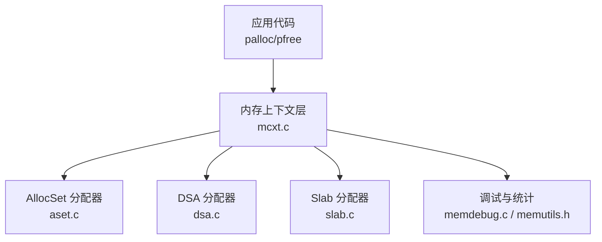
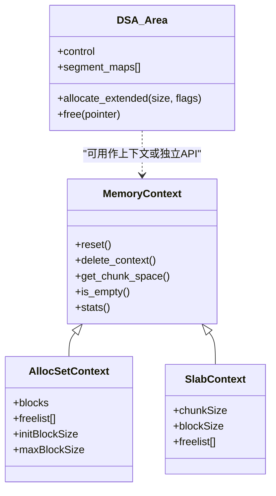
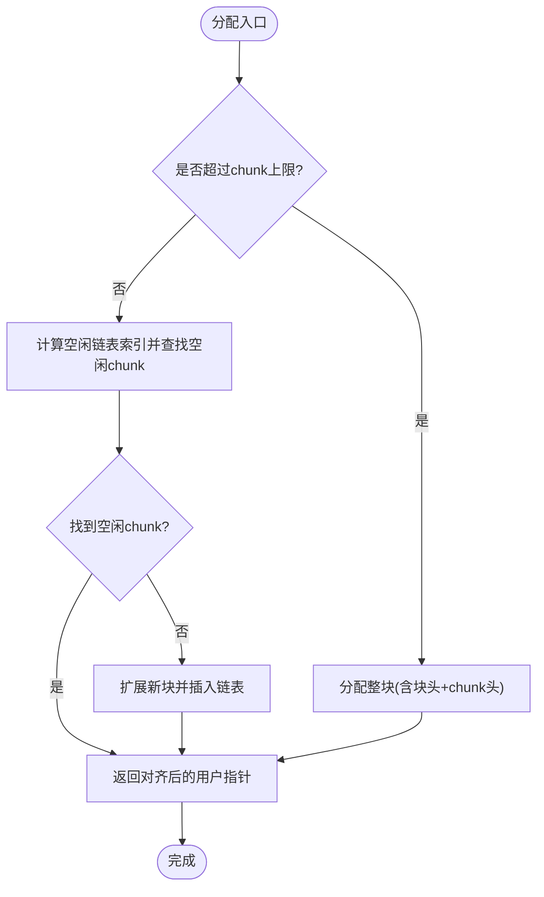
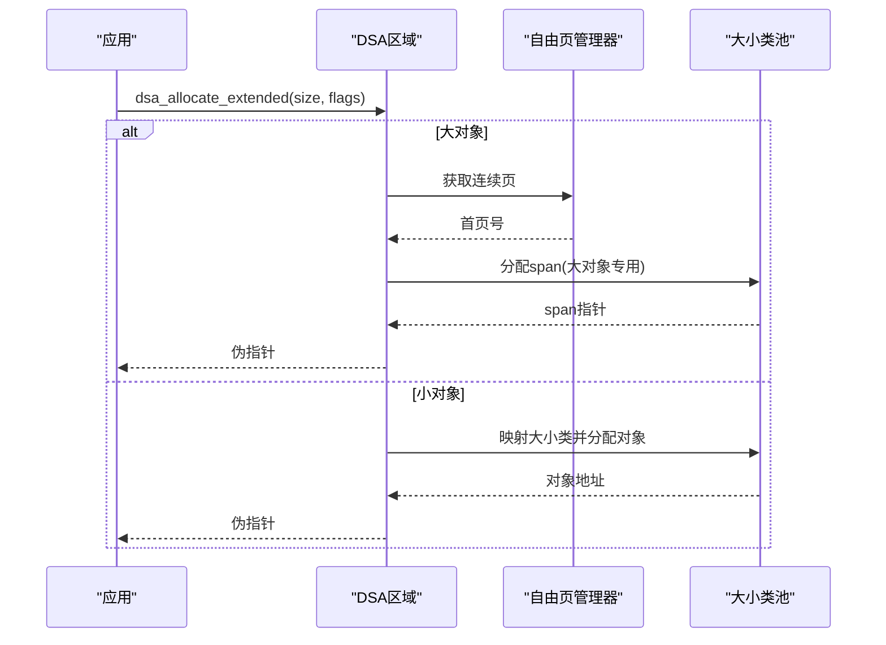
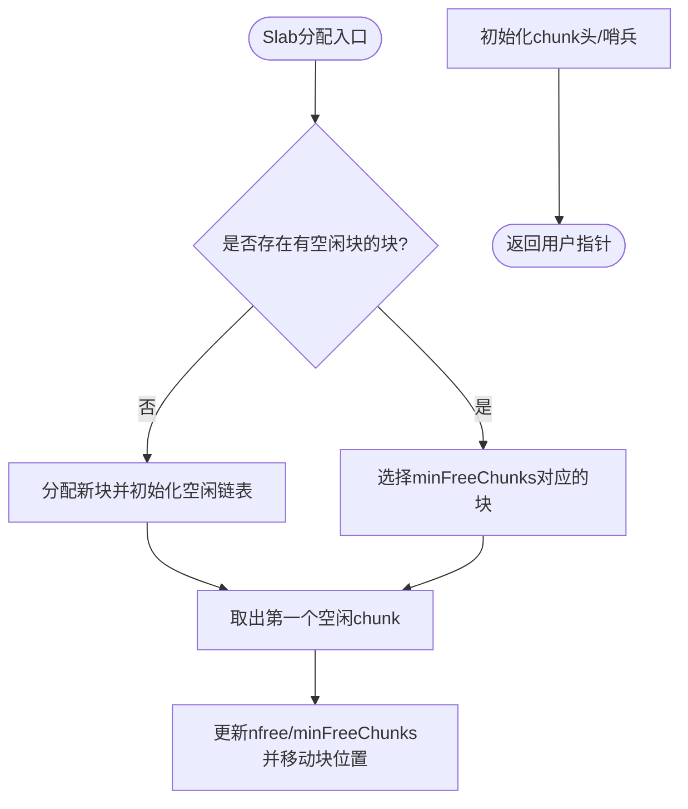
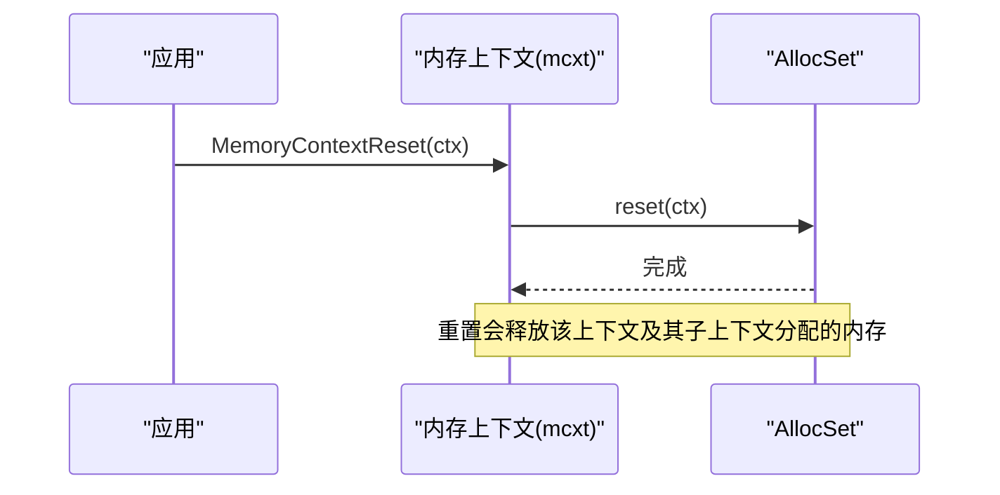
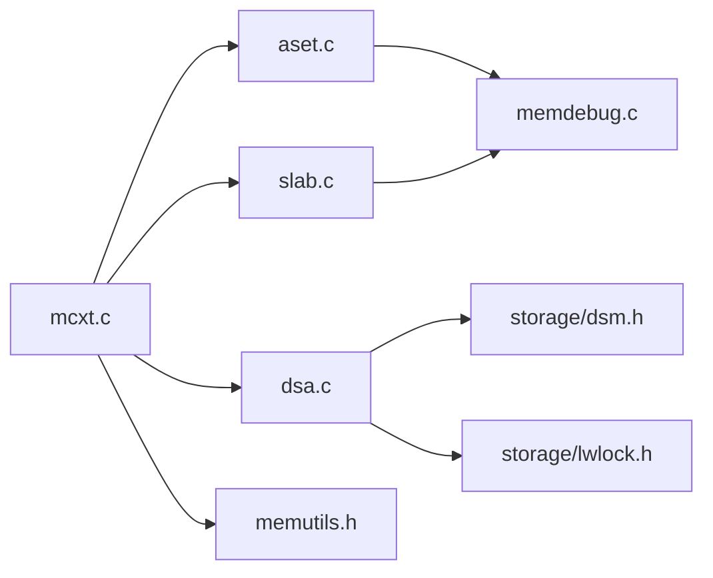

# 内存分配策略

<cite>
**本文引用的文件**
- [src/backend/utils/mmgr/README](file://src/backend/utils/mmgr/README)
- [src/backend/utils/mmgr/mcxt.c](file://src/backend/utils/mmgr/mcxt.c)
- [src/backend/utils/mmgr/aset.c](file://src/backend/utils/mmgr/aset.c)
- [src/backend/utils/mmgr/dsa.c](file://src/backend/utils/mmgr/dsa.c)
- [src/backend/utils/mmgr/slab.c](file://src/backend/utils/mmgr/slab.c)
- [src/include/utils/memutils.h](file://src/include/utils/memutils.h)
- [src/backend/utils/mmgr/memdebug.c](file://src/backend/utils/mmgr/memdebug.c)
</cite>

## 目录
1. [简介](#简介)
2. [项目结构](#项目结构)
3. [核心组件](#核心组件)
4. [架构总览](#架构总览)
5. [详细组件分析](#详细组件分析)
6. [依赖关系分析](#依赖关系分析)
7. [性能考量](#性能考量)
8. [故障排除指南](#故障排除指南)
9. [结论](#结论)
10. [附录](#附录)

## 简介
本文件面向 Mini PostgreSQL 的内存分配策略系统，系统性说明不同内存分配器的选择策略与适用场景（Aset、DSA、Slab），完整描述从分配请求到释放的生命周期管理，解释内存对齐、边界检查与错误处理机制，并梳理内存调试功能（泄漏检测、越界访问检查、统计信息收集）。同时提供流程图、架构图与故障排除建议，帮助读者在不同工作负载下做出合理的分配器选择。

## 项目结构
Mini PostgreSQL 的内存子系统位于 src/backend/utils/mmgr，核心由“内存上下文”抽象与多种具体分配器实现组成：
- 上下文管理与统一接口：mcxt.c
- 通用分配器（默认）：aset.c（AllocSet）
- 共享动态内存区域：dsa.c（DSA）
- 固定大小块分配器：slab.c（Slab）
- 调试与工具：memdebug.c
- 公共头与常量：include/utils/memutils.h
- 设计说明：mmgr/README

图表来源
- [src/backend/utils/mmgr/mcxt.c:103-140](file://src/backend/utils/mmgr/mcxt.c#L103-L140)
- [src/backend/utils/mmgr/aset.c:264-297](file://src/backend/utils/mmgr/aset.c#L264-L297)
- [src/backend/utils/mmgr/dsa.c:665-800](file://src/backend/utils/mmgr/dsa.c#L665-L800)
- [src/backend/utils/mmgr/slab.c:129-161](file://src/backend/utils/mmgr/slab.c#L129-L161)
- [src/backend/utils/mmgr/memdebug.c:14-52](file://src/backend/utils/mmgr/memdebug.c#L14-L52)
- [src/include/utils/memutils.h:23-47](file://src/include/utils/memutils.h#L23-L47)

章节来源
- [src/backend/utils/mmgr/README:1-488](file://src/backend/utils/mmgr/README#L1-L488)
- [src/backend/utils/mmgr/mcxt.c:103-140](file://src/backend/utils/mmgr/mcxt.c#L103-L140)

## 核心组件
- 内存上下文（MemoryContext）：统一的分配/释放/重置/删除抽象，通过方法表分派到具体分配器。
- AllocSet（Aset）：通用分配器，维护块池与按幂次大小的空闲链表，适合大多数场景。
- DSA（Dynamic Shared Area）：基于 DSM 的动态共享内存区域，支持跨后端共享的伪指针，小对象使用池化超块，大对象直接分配连续页。
- Slab：固定大小块分配器，将大块切分为等长块，按空闲块数组织块列表，适合大量同构对象。
- 调试与统计：CLOBBER_FREED_MEMORY、MEMORY_CONTEXT_CHECKING、Valgrind 集成、随机填充、统计输出。

章节来源
- [src/backend/utils/mmgr/README:364-458](file://src/backend/utils/mmgr/README#L364-L458)
- [src/backend/utils/mmgr/mcxt.c:36-58](file://src/backend/utils/mmgr/mcxt.c#L36-L58)
- [src/backend/utils/mmgr/aset.c:121-137](file://src/backend/utils/mmgr/aset.c#L121-L137)
- [src/backend/utils/mmgr/dsa.c:147-179](file://src/backend/utils/mmgr/dsa.c#L147-L179)
- [src/backend/utils/mmgr/slab.c:64-80](file://src/backend/utils/mmgr/slab.c#L64-L80)
- [src/backend/utils/mmgr/memdebug.c:14-52](file://src/backend/utils/mmgr/memdebug.c#L14-L52)

## 架构总览
内存上下文作为抽象层，屏蔽底层分配器差异；上层通过 palloc/pfree 等 API 进行分配与释放，内部根据上下文类型调用对应方法。DSA 在共享内存之上构建，提供跨进程共享能力；Aset 和 Slab 主要服务于进程内上下文。

图表来源
- [src/backend/utils/mmgr/aset.c:264-297](file://src/backend/utils/mmgr/aset.c#L264-L297)
- [src/backend/utils/mmgr/slab.c:129-161](file://src/backend/utils/mmgr/slab.c#L129-L161)
- [src/backend/utils/mmgr/dsa.c:665-800](file://src/backend/utils/mmgr/dsa.c#L665-L800)

## 详细组件分析

### AllocSet（Aset）分配器
- 设计要点
  - 以块为单位向系统申请内存，块内再划分为多个 chunk；小请求走固定大小空闲链表，大请求单独成块。
  - 首次分配默认块大小为 8K，后续按需倍增至最大块大小，减少 malloc 调用次数。
  - 保留一个 keeper 块以避免频繁 reset 时反复 malloc/free。
  - 通过 freelist 索引快速定位合适大小的空闲 chunk。
- 生命周期
  - 创建：设置初始/最大块大小、计算 chunk 上限、初始化块与上下文。
  - 分配：优先复用空闲 chunk，否则扩展块；超大请求直接分配整块。
  - 释放：放回对应空闲链表；若为独占块则归还系统。
  - 重置/删除：重置仅清空空闲链表并复位 keeper 块；删除释放所有块。
- 对齐与边界
  - 最小 chunk 尺寸保证满足 MAXALIGN；chunk 头部紧邻数据区，便于反向查找上下文。
  - 调试模式下写入哨兵字节，释放时校验防止越界。
- 错误处理
  - 分配失败时上报 OOM；ErrorContext 允许在临界区分配以保证错误恢复可用。

图表来源
- [src/backend/utils/mmgr/aset.c:720-800](file://src/backend/utils/mmgr/aset.c#L720-L800)
- [src/backend/utils/mmgr/aset.c:558-617](file://src/backend/utils/mmgr/aset.c#L558-L617)

章节来源
- [src/backend/utils/mmgr/aset.c:53-99](file://src/backend/utils/mmgr/aset.c#L53-L99)
- [src/backend/utils/mmgr/aset.c:378-544](file://src/backend/utils/mmgr/aset.c#L378-L544)
- [src/backend/utils/mmgr/aset.c:720-800](file://src/backend/utils/mmgr/aset.c#L720-L800)
- [src/backend/utils/mmgr/aset.c:558-617](file://src/backend/utils/mmgr/aset.c#L558-L617)

### DSA（动态共享内存区域）
- 设计要点
  - 基于 DSM 段构建共享内存区域，支持跨后端共享的伪指针。
  - 小对象：按大小类池化，超块（superblock）由若干页组成，span 管理空闲对象。
  - 大对象：直接分配连续页，使用特殊 span 管理并在释放时归还页。
  - 分段与超块按“满度类”组织，提高回收效率与局部性。
- 生命周期
  - 创建：分配控制段并建立区域控制结构；支持在已有共享内存中就地创建。
  - 分配：大于最大大小类的请求走页分配路径；否则映射到大小类并从池中取对象。
  - 释放：小对象回池，大对象归还页；必要时拆分/合并 span 与段。
  - 附加/分离：通过 handle 在其他后端附加；资源释放时自动解绑。
- 对齐与边界
  - 页粒度管理，偏移宽度限制段大小与最大分配；大小类映射确保对齐与利用率平衡。
- 错误处理
  - 非法大小或超出限制时报错；可选择 NO_OOM 模式返回无效指针而非报错。

图表来源
- [src/backend/utils/mmgr/dsa.c:665-800](file://src/backend/utils/mmgr/dsa.c#L665-L800)
- [src/backend/utils/mmgr/dsa.c:420-451](file://src/backend/utils/mmgr/dsa.c#L420-L451)

章节来源
- [src/backend/utils/mmgr/dsa.c:147-179](file://src/backend/utils/mmgr/dsa.c#L147-L179)
- [src/backend/utils/mmgr/dsa.c:236-247](file://src/backend/utils/mmgr/dsa.c#L236-L247)
- [src/backend/utils/mmgr/dsa.c:665-800](file://src/backend/utils/mmgr/dsa.c#L665-L800)

### Slab（固定大小块分配器）
- 设计要点
  - 每个块被切分为等长 chunk；块级与上下文级均维护空闲链表，按空闲块数排序。
  - 分配时优先重用最满的块，促使更早出现完全空闲的块以便归还系统。
  - 维护 minFreeChunks 缓存以减少遍历开销。
- 生命周期
  - 创建：计算每块 chunk 数量、初始化 freelist、设置上下文参数。
  - 分配：若无空闲块则新建块并入最末桶；从 minFreeChunks 指向的块取出第一个空闲 chunk。
  - 释放：将 chunk 插回块内链表，更新 nfree 与 minFreeChunks；若块全空则立即释放。
- 对齐与边界
  - fullChunkSize 包含对齐与头部；调试模式下对未使用空间写哨兵并校验。
- 错误处理
  - 非预期大小或 realloc 不支持时抛出错误；创建失败时打印上下文统计辅助诊断。

图表来源
- [src/backend/utils/mmgr/slab.c:341-493](file://src/backend/utils/mmgr/slab.c#L341-L493)
- [src/backend/utils/mmgr/slab.c:499-572](file://src/backend/utils/mmgr/slab.c#L499-L572)

章节来源
- [src/backend/utils/mmgr/slab.c:64-80](file://src/backend/utils/mmgr/slab.c#L64-L80)
- [src/backend/utils/mmgr/slab.c:176-275](file://src/backend/utils/mmgr/slab.c#L176-L275)
- [src/backend/utils/mmgr/slab.c:341-493](file://src/backend/utils/mmgr/slab.c#L341-L493)
- [src/backend/utils/mmgr/slab.c:499-572](file://src/backend/utils/mmgr/slab.c#L499-L572)

### 内存上下文管理与生命周期
- 顶层上下文：TopMemoryContext、ErrorContext、PostmasterContext、CacheMemoryContext、MessageContext、TopTransactionContext、CurTransactionContext、PortalContext。
- 生命周期操作：创建、切换当前上下文、重置（释放子上下文与块）、删除（递归释放）、注册回调（在重置/删除前释放外部资源）。
- 统计与检查：MemoryContextStats/MemoryContextCheck 用于统计与一致性检查；支持限制子上下文输出数量。

图表来源
- [src/backend/utils/mmgr/mcxt.c:147-191](file://src/backend/utils/mmgr/mcxt.c#L147-L191)
- [src/backend/utils/mmgr/mcxt.c:509-559](file://src/backend/utils/mmgr/mcxt.c#L509-L559)

章节来源
- [src/backend/utils/mmgr/mcxt.c:36-58](file://src/backend/utils/mmgr/mcxt.c#L36-L58)
- [src/backend/utils/mmgr/mcxt.c:103-140](file://src/backend/utils/mmgr/mcxt.c#L103-L140)
- [src/backend/utils/mmgr/mcxt.c:147-191](file://src/backend/utils/mmgr/mcxt.c#L147-L191)
- [src/backend/utils/mmgr/mcxt.c:509-559](file://src/backend/utils/mmgr/mcxt.c#L509-L559)

## 依赖关系分析
- 上下文层（mcxt.c）依赖具体分配器实现的方法表，向上暴露统一 API。
- Aset/Slab 依赖通用头与调试宏；DSA 依赖 DSM、LWLock、FreePageManager 等存储与同步原语。
- 调试模块（memdebug.c）提供随机填充与 Valgrind 标记；memutils.h 定义全局上下文与分配限制。

图表来源
- [src/backend/utils/mmgr/mcxt.c:22-33](file://src/backend/utils/mmgr/mcxt.c#L22-L33)
- [src/backend/utils/mmgr/dsa.c:51-60](file://src/backend/utils/mmgr/dsa.c#L51-L60)
- [src/backend/utils/mmgr/aset.c:47-52](file://src/backend/utils/mmgr/aset.c#L47-L52)
- [src/backend/utils/mmgr/slab.c:53-58](file://src/backend/utils/mmgr/slab.c#L53-L58)
- [src/include/utils/memutils.h:23-47](file://src/include/utils/memutils.h#L23-L47)

章节来源
- [src/backend/utils/mmgr/mcxt.c:22-33](file://src/backend/utils/mmgr/mcxt.c#L22-L33)
- [src/backend/utils/mmgr/dsa.c:51-60](file://src/backend/utils/mmgr/dsa.c#L51-L60)
- [src/include/utils/memutils.h:23-47](file://src/include/utils/memutils.h#L23-L47)

## 性能考量
- Aset
  - 优点：通用性强，小块复用率高，块倍增降低系统调用；keeper 块减少频繁 reset 的开销。
  - 适用：大多数查询执行、临时数据结构、事务级上下文。
  - 注意：过大请求会单独成块，避免长期占用；合理设置 init/max block size 可减少碎片。
- DSA
  - 优点：跨后端共享、页级管理利于大对象、超块池化提升小对象吞吐。
  - 适用：需要共享的数据结构、并行执行中间结果、大规模哈希/排序。
  - 注意：锁粒度（区域锁与池锁）影响并发；大小类映射需匹配工作负载分布。
- Slab
  - 优点：固定大小无碎片、分配/释放极快、统计简单。
  - 适用：大量同构对象（如元组、索引项、消息缓冲）。
  - 注意：不支持变长 realloc；块大小与 chunk 大小需预先评估。

[本节为一般性指导，不直接分析具体文件]

## 故障排除指南
- 常见症状
  - 内存不足：检查 MaxAllocSize/MaxAllocHugeSize 限制与上下文树规模；查看 ErrorContext 是否耗尽。
  - 越界访问：启用 MEMORY_CONTEXT_CHECKING 与 CLOBBER_FREED_MEMORY，结合 sentinel 检测。
  - 泄漏：使用 MemoryContextStats 输出各上下文统计，关注持续增长且未释放的上下文。
- 排查步骤
  - 确认当前上下文是否正确切换；避免在 TopMemoryContext 中长期持有短生命周期数据。
  - 对于 DSA，检查段映射与引用计数，确认 detach/release 流程。
  - 对于 Slab，核对 chunkSize 与请求一致，避免误用 realloc。
- 工具与标志
  - RANDOMIZE_ALLOCATED_MEMORY：随机填充新分配内存，有助于发现未初始化使用。
  - USE_VALGRIND：利用 Valgrind 客户端请求标记 NOACCESS/UNDEFINED 区域，捕获非法访问。

章节来源
- [src/backend/utils/mmgr/memdebug.c:14-52](file://src/backend/utils/mmgr/memdebug.c#L14-L52)
- [src/backend/utils/mmgr/mcxt.c:509-559](file://src/backend/utils/mmgr/mcxt.c#L509-L559)
- [src/include/utils/memutils.h:23-47](file://src/include/utils/memutils.h#L23-L47)

## 结论
Mini PostgreSQL 的内存子系统通过统一的内存上下文抽象，将通用分配器（Aset）、共享内存分配器（DSA）与固定大小分配器（Slab）有机结合，满足不同工作负载的需求。合理选择分配器、正确管理上下文生命周期、启用调试与统计手段，是保障性能与稳定性的关键。

[本节为总结性内容，不直接分析具体文件]

## 附录
- 分配器选择建议
  - 通用/事务级临时数据：Aset
  - 跨后端共享/并行中间结果：DSA
  - 大量同构对象：Slab
- 关键配置与限制
  - MaxAllocSize/MaxAllocHugeSize：单分配大小限制
  - ErrorContext：错误恢复专用上下文，保证最低可用内存
  - 上下文树：Top/Message/Transaction/Portal 等层级划分，避免泄漏

[本节为补充信息，不直接分析具体文件]