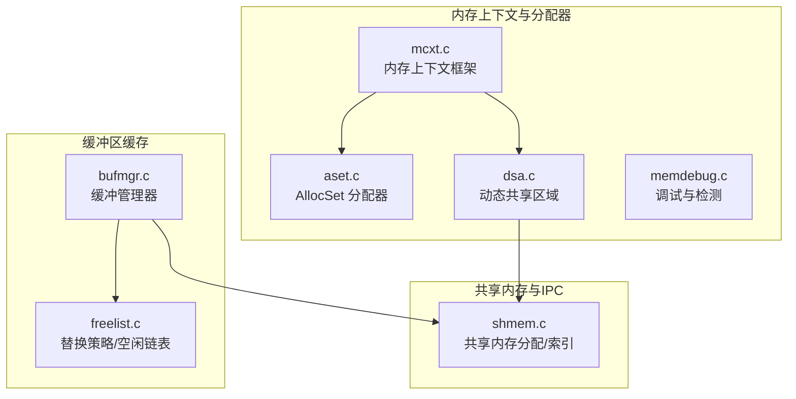
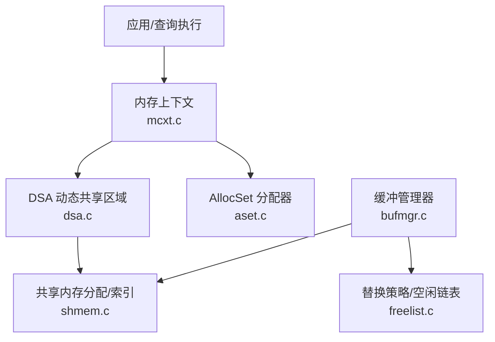
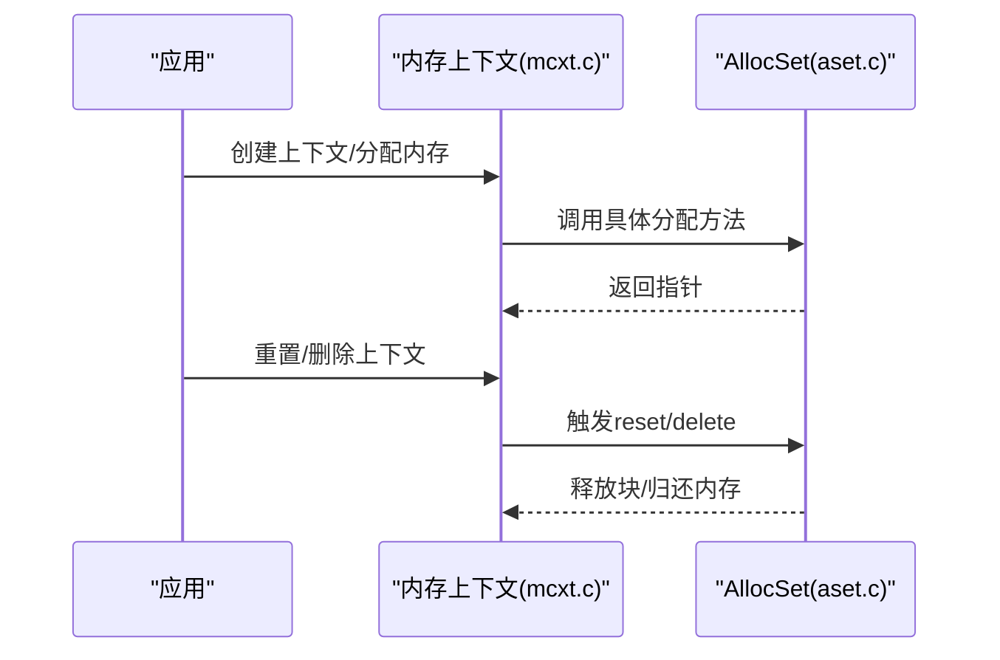
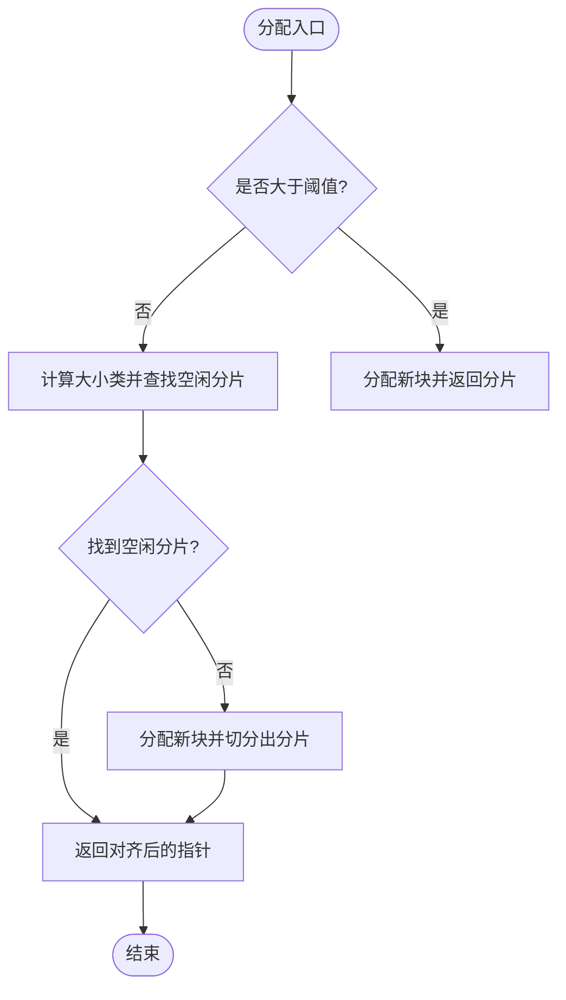
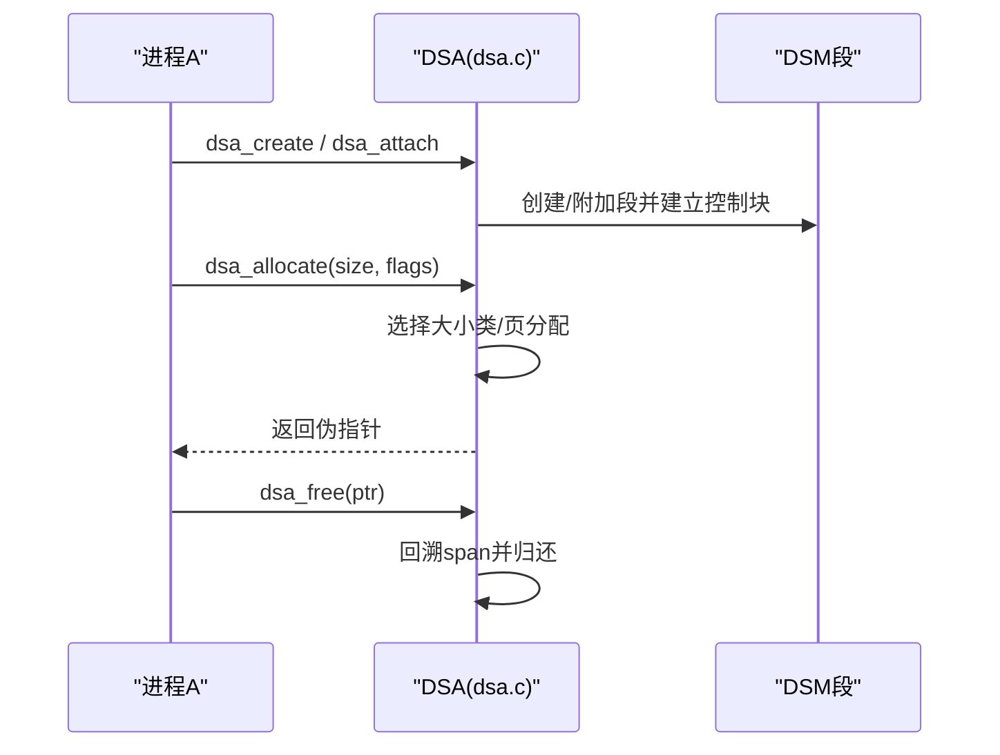
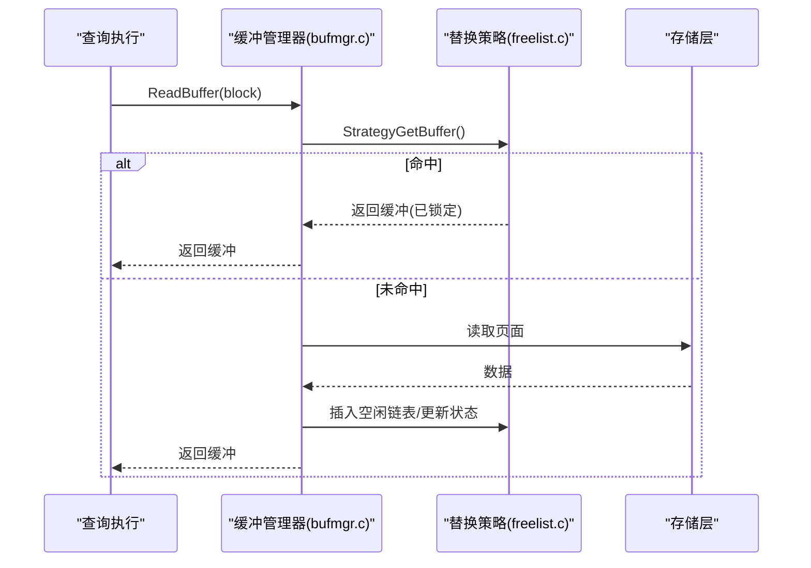
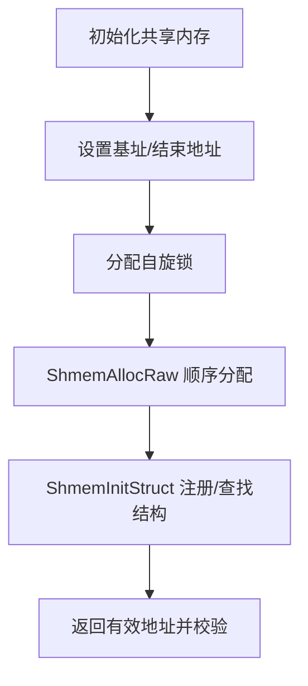
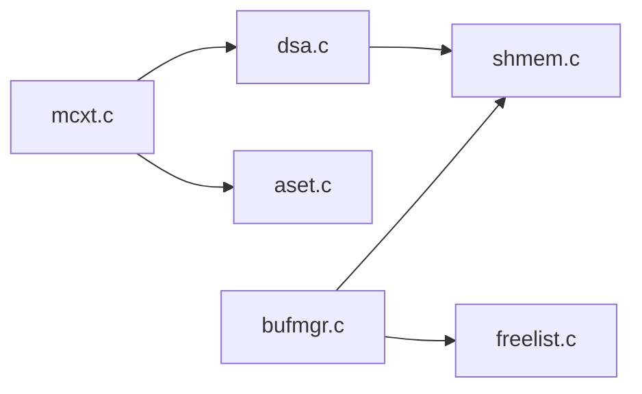

# 内存管理

<cite>
**本文引用的文件**
- [mcxt.c](file://src/backend/utils/mmgr/mcxt.c)
- [aset.c](file://src/backend/utils/mmgr/aset.c)
- [dsa.c](file://src/backend/utils/mmgr/dsa.c)
- [memdebug.c](file://src/backend/utils/mmgr/memdebug.c)
- [bufmgr.c](file://src/backend/storage/buffer/bufmgr.c)
- [freelist.c](file://src/backend/storage/buffer/freelist.c)
- [shmem.c](file://src/backend/storage/ipc/shmem.c)
</cite>

## 目录
1. [简介](#简介)
2. [项目结构](#项目结构)
3. [核心组件](#核心组件)
4. [架构总览](#架构总览)
5. [详细组件分析](#详细组件分析)
6. [依赖关系分析](#依赖关系分析)
7. [性能考量](#性能考量)
8. [故障排查指南](#故障排查指南)
9. [结论](#结论)
10. [附录](#附录)

## 简介
本文件面向 Mini PostgreSQL 的内存管理系统，系统性阐述以下主题：
- 内存上下文（Memory Context）的设计原理与使用模式，包括层次化生命周期管理与自动清理机制。
- 缓冲区缓存的实现，涵盖缓冲池分配、页面替换算法与脏页管理。
- 共享内存管理机制，包括进程间通信与同步原语。
- 内存分配器的优化策略与内存泄漏检测方法。
- 提供内存架构图、分配流程图与性能调优指南，为内存管理开发提供完整技术指导。

## 项目结构
Mini PostgreSQL 的内存相关代码主要分布在以下模块：
- 内存上下文与分配器：utils/mmgr（mcxt.c、aset.c、dsa.c、memdebug.c）
- 缓冲区缓存：storage/buffer（bufmgr.c、freelist.c）
- 共享内存与IPC：storage/ipc（shmem.c）

**图表来源**
- [mcxt.c:103-140](file://src/backend/utils/mmgr/mcxt.c#L103-L140)
- [aset.c:378-544](file://src/backend/utils/mmgr/aset.c#L378-L544)
- [dsa.c:420-451](file://src/backend/utils/mmgr/dsa.c#L420-L451)
- [bufmgr.c:742-759](file://src/backend/storage/buffer/bufmgr.c#L742-L759)
- [freelist.c:199-358](file://src/backend/storage/buffer/freelist.c#L199-L358)
- [shmem.c:158-234](file://src/backend/storage/ipc/shmem.c#L158-L234)

**章节来源**
- [mcxt.c:103-140](file://src/backend/utils/mmgr/mcxt.c#L103-L140)
- [bufmgr.c:742-759](file://src/backend/storage/buffer/bufmgr.c#L742-L759)
- [shmem.c:158-234](file://src/backend/storage/ipc/shmem.c#L158-L234)

## 核心组件
- 内存上下文（MemoryContext）：提供层次化的内存生命周期管理，支持创建、重置、删除、统计与回调清理。
- AllocSet 分配器：基于块与分片（chunk）的高效小对象分配器，维护多级空闲链表与保留块，减少系统调用开销。
- 动态共享区域（DSA）：在共享内存上构建可跨进程共享的动态分配区，支持大小类池与超块管理，提供伪指针与本地地址转换。
- 缓冲管理器（Buffer Manager）：负责缓冲池分配、页面读取/写入、脏页标记与后台刷写协调。
- 替换策略（Freelist/Clock Sweep）：选择可回收缓冲区的策略，结合空闲链表与时钟扫描降低锁竞争。
- 共享内存（Shared Memory）：统一分配与索引机制，保证多进程可见性与一致性。

**章节来源**
- [mcxt.c:103-140](file://src/backend/utils/mmgr/mcxt.c#L103-L140)
- [aset.c:378-544](file://src/backend/utils/mmgr/aset.c#L378-L544)
- [dsa.c:420-451](file://src/backend/utils/mmgr/dsa.c#L420-L451)
- [bufmgr.c:742-759](file://src/backend/storage/buffer/bufmgr.c#L742-L759)
- [freelist.c:199-358](file://src/backend/storage/buffer/freelist.c#L199-L358)
- [shmem.c:158-234](file://src/backend/storage/ipc/shmem.c#L158-L234)

## 架构总览
下图展示内存子系统各组件之间的交互关系：应用通过内存上下文进行分配；底层由 AllocSet 或 DSA 实现具体分配；缓冲管理器从共享内存中获取/释放缓冲；替换策略决定回收候选；共享内存提供全局数据结构的分配与索引。

**图表来源**
- [mcxt.c:103-140](file://src/backend/utils/mmgr/mcxt.c#L103-L140)
- [aset.c:378-544](file://src/backend/utils/mmgr/aset.c#L378-L544)
- [dsa.c:420-451](file://src/backend/utils/mmgr/dsa.c#L420-L451)
- [bufmgr.c:742-759](file://src/backend/storage/buffer/bufmgr.c#L742-L759)
- [freelist.c:199-358](file://src/backend/storage/buffer/freelist.c#L199-L358)
- [shmem.c:158-234](file://src/backend/storage/ipc/shmem.c#L158-L234)

## 详细组件分析

### 内存上下文（MemoryContext）
- 设计要点
  - 层次化结构：每个上下文有父/子关系，支持批量重置与删除，便于事务/语句/元组等短生命周期内存管理。
  - 自动清理：通过 reset/delete 回调链，确保资源在上下文销毁时释放。
  - 关键上下文：TopMemoryContext、ErrorContext、CacheMemoryContext、Transaction 相关上下文等。
  - 统计与检查：提供统计输出与完整性检查工具，辅助定位内存问题。
- 典型流程
  - 初始化：创建顶层上下文并设置当前上下文。
  - 分配/释放：通过类型特定的方法（如 AllocSet）完成实际分配。
  - 生命周期：Reset/ResetChildren/Delete 控制内存回收范围。

**图表来源**
- [mcxt.c:103-140](file://src/backend/utils/mmgr/mcxt.c#L103-L140)
- [aset.c:378-544](file://src/backend/utils/mmgr/aset.c#L378-L544)

**章节来源**
- [mcxt.c:103-140](file://src/backend/utils/mmgr/mcxt.c#L103-L140)
- [mcxt.c:147-278](file://src/backend/utils/mmgr/mcxt.c#L147-L278)
- [mcxt.c:509-650](file://src/backend/utils/mmgr/mcxt.c#L509-L650)

### AllocSet 分配器
- 设计要点
  - 块与分片：以块为单位向系统申请内存，块内再划分为固定大小的分片（按大小类组织），减少碎片与系统调用。
  - 多级空闲链表：按2的幂次大小维护空闲分片列表，快速匹配请求大小。
  - 大对象直配：超过阈值的请求直接分配整块，避免过度碎片化。
  - 保留块（keeper）：重置时保留首块以减少频繁分配/释放。
- 复杂度与优化
  - 分配时间近似 O(1)，查找空闲分片通过位运算与查表加速。
  - 通过上下文复用与 freelist 提升局部性。

**图表来源**
- [aset.c:720-800](file://src/backend/utils/mmgr/aset.c#L720-L800)
- [aset.c:308-354](file://src/backend/utils/mmgr/aset.c#L308-L354)

**章节来源**
- [aset.c:378-544](file://src/backend/utils/mmgr/aset.c#L378-L544)
- [aset.c:558-617](file://src/backend/utils/mmgr/aset.c#L558-L617)
- [aset.c:626-705](file://src/backend/utils/mmgr/aset.c#L626-L705)

### 动态共享区域（DSA）
- 设计要点
  - 共享堆：基于 DSM 段构建，支持跨进程共享的伪指针，需转换为本地地址后访问。
  - 大小类池与超块：小对象通过大小类池分配，大对象直接分配连续页；超块管理 span 与空闲页。
  - 段管理：按最大连续空闲页将段分桶，优先选择合适段以降低碎片。
- 典型流程
  - 创建/附加：创建新 DSM 段或附加到已有段，建立控制块与映射。
  - 分配：根据大小选择池或页分配，维护页映射与 span。
  - 释放：根据地址回溯 span 并归还至对应池或页管理器。

**图表来源**
- [dsa.c:420-451](file://src/backend/utils/mmgr/dsa.c#L420-L451)
- [dsa.c:665-758](file://src/backend/utils/mmgr/dsa.c#L665-L758)

**章节来源**
- [dsa.c:420-451](file://src/backend/utils/mmgr/dsa.c#L420-L451)
- [dsa.c:665-758](file://src/backend/utils/mmgr/dsa.c#L665-L758)

### 缓冲管理器与替换策略
- 缓冲管理器
  - 读取路径：ReadBuffer/ReadBufferExtended 查找或创建缓冲，必要时从磁盘读入并标记有效。
  - 脏页管理：MarkBufferDirty 标记修改，延迟到 checkpoint 或后台写进程刷写。
  - 预取：PrefetchBuffer 尝试异步预读，提高命中概率。
- 替换策略
  - 空闲链表：快速返回无引用且使用计数低的缓冲。
  - 时钟扫描（Clock Sweep）：遍历缓冲，降低使用计数或选择可用缓冲。
  - 策略环（Strategy Ring）：针对批量读写场景，维护本地缓冲环以提升重用率。

**图表来源**
- [bufmgr.c:742-759](file://src/backend/storage/buffer/bufmgr.c#L742-L759)
- [freelist.c:199-358](file://src/backend/storage/buffer/freelist.c#L199-L358)

**章节来源**
- [bufmgr.c:742-759](file://src/backend/storage/buffer/bufmgr.c#L742-L759)
- [freelist.c:199-358](file://src/backend/storage/buffer/freelist.c#L199-L358)

### 共享内存管理
- 分配模型
  - 顺序分配：ShmemAllocRaw 在共享段内按缓存行对齐顺序分配，保证结构不被跨缓存行分割。
  - 索引表：ShmemIndex 记录命名结构的位置与大小，支持多进程发现与附加。
- 同步与一致性
  - 自旋锁/LWLock：保护共享结构创建与索引操作。
  - 地址有效性校验：ShmemAddrIsValid 验证指针位于共享段范围内。

**图表来源**
- [shmem.c:98-149](file://src/backend/storage/ipc/shmem.c#L98-L149)
- [shmem.c:158-234](file://src/backend/storage/ipc/shmem.c#L158-L234)
- [shmem.c:393-493](file://src/backend/storage/ipc/shmem.c#L393-L493)

**章节来源**
- [shmem.c:98-149](file://src/backend/storage/ipc/shmem.c#L98-L149)
- [shmem.c:158-234](file://src/backend/storage/ipc/shmem.c#L158-L234)
- [shmem.c:393-493](file://src/backend/storage/ipc/shmem.c#L393-L493)

## 依赖关系分析
- 耦合关系
  - mcxt.c 依赖具体分配器（如 aset.c）的方法表，解耦上下文与分配实现。
  - bufmgr.c 依赖 freelist.c 的选择策略与 shmem.c 的共享内存分配。
  - dsa.c 依赖 shmem.c 与 DSM 段管理，提供跨进程共享的堆。
- 潜在循环依赖
  - 初始化阶段存在“先有锁还是先有索引”的循环，通过特殊名称与顺序初始化规避。
- 外部依赖
  - 原子操作、LWLock、自旋锁用于并发控制。
  - 存储层接口用于页面 I/O。

**图表来源**
- [mcxt.c:103-140](file://src/backend/utils/mmgr/mcxt.c#L103-L140)
- [bufmgr.c:742-759](file://src/backend/storage/buffer/bufmgr.c#L742-L759)
- [dsa.c:420-451](file://src/backend/utils/mmgr/dsa.c#L420-L451)
- [shmem.c:158-234](file://src/backend/storage/ipc/shmem.c#L158-L234)

**章节来源**
- [mcxt.c:103-140](file://src/backend/utils/mmgr/mcxt.c#L103-L140)
- [bufmgr.c:742-759](file://src/backend/storage/buffer/bufmgr.c#L742-L759)
- [dsa.c:420-451](file://src/backend/utils/mmgr/dsa.c#L420-L451)
- [shmem.c:158-234](file://src/backend/storage/ipc/shmem.c#L158-L234)

## 性能考量
- 内存上下文
  - 合理划分上下文粒度：短生命周期使用事务/语句上下文，长生命周期使用缓存上下文。
  - 利用 Reset/ResetChildren 批量回收，减少频繁 delete。
- AllocSet
  - 调整初始块大小与最大块大小以平衡碎片与系统调用次数。
  - 对超大对象采用直配，避免小块碎片累积。
- 缓冲管理器
  - 预取（PrefetchBuffer）提升热点页面命中率。
  - 调整后台写进程参数（如 bgwriter_lru_maxpages）平衡吞吐与延迟。
- 共享内存
  - 合理估算共享哈希表大小，避免运行时扩容导致失败。
  - 使用 ShmemInitStruct 命名结构，便于诊断与监控。

[本节为通用指导，不直接分析具体文件]

## 故障排查指南
- 内存上下文
  - 使用 MemoryContextStats/MemoryContextStatsDetail 输出上下文统计，识别异常增长。
  - 启用 MEMORY_CONTEXT_CHECKING 检测越界与损坏。
- 分配器
  - 观察 AllocSet 的空闲链表与块数量，判断是否存在碎片或分配瓶颈。
  - 使用 Valgrind 客户端请求宏（VALGRIND_*）检测非法访问。
- 缓冲管理器
  - 检查脏页比例与后台写进度，确认 checkpoint 频率是否合理。
  - 关注 StrategyGetBuffer 的时钟扫描与空闲链表命中率。
- 共享内存
  - 使用 pg_get_shmem_allocations 查看共享内存分配情况，定位未命名或异常占用。
  - 校验 ShmemAddrIsValid 结果，排除越界访问。

**章节来源**
- [mcxt.c:509-650](file://src/backend/utils/mmgr/mcxt.c#L509-L650)
- [memdebug.c:14-53](file://src/backend/utils/mmgr/memdebug.c#L14-L53)
- [bufmgr.c:742-759](file://src/backend/storage/buffer/bufmgr.c#L742-L759)
- [freelist.c:199-358](file://src/backend/storage/buffer/freelist.c#L199-L358)
- [shmem.c:497-574](file://src/backend/storage/ipc/shmem.c#L497-L574)

## 结论
Mini PostgreSQL 的内存管理以层次化上下文为核心，结合高效的 AllocSet 分配器与共享内存基础设施，支撑了灵活的内存生命周期管理与跨进程共享需求。缓冲管理器通过空闲链表与时钟扫描实现低竞争的页面替换，配合后台写进程保障脏页持久化。通过合理的配置与监控，可在吞吐、延迟与内存占用之间取得良好平衡。

[本节为总结，不直接分析具体文件]

## 附录
- 术语
  - 内存上下文：具有父子关系的内存管理单元，支持批量生命周期管理。
  - 分片（Chunk）：块内的最小分配单位，按大小类组织。
  - 超块（Superblock）：DSA 中由多个页组成的分配单元，内部包含 span 管理。
  - 伪指针：DSA 中的跨进程指针，需转换为本地地址后访问。
- 参考路径
  - 内存上下文初始化：[mcxt.c:103-140](file://src/backend/utils/mmgr/mcxt.c#L103-L140)
  - AllocSet 分配流程：[aset.c:720-800](file://src/backend/utils/mmgr/aset.c#L720-L800)
  - DSA 分配流程：[dsa.c:665-758](file://src/backend/utils/mmgr/dsa.c#L665-L758)
  - 缓冲读取流程：[bufmgr.c:742-759](file://src/backend/storage/buffer/bufmgr.c#L742-L759)
  - 替换策略：[freelist.c:199-358](file://src/backend/storage/buffer/freelist.c#L199-L358)
  - 共享内存分配：[shmem.c:158-234](file://src/backend/storage/ipc/shmem.c#L158-L234)

[本节为附录，不直接分析具体文件]