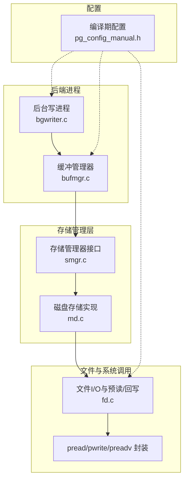
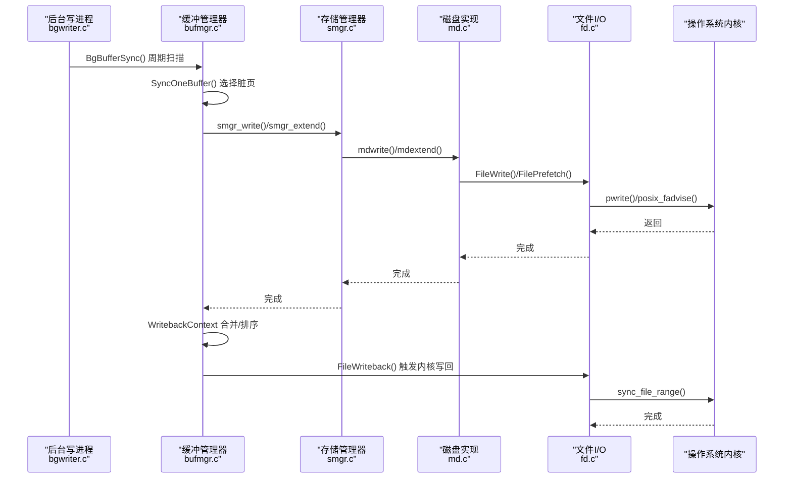
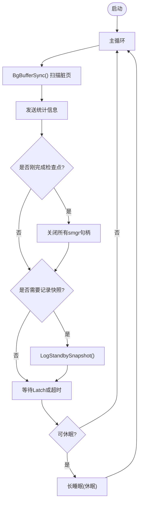
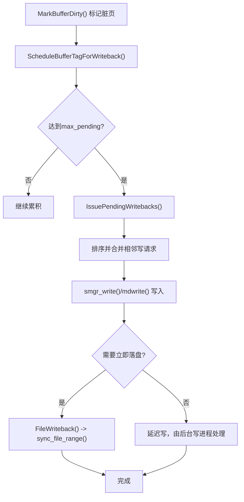
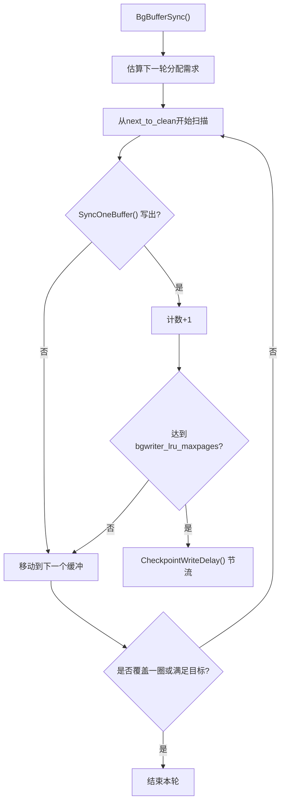
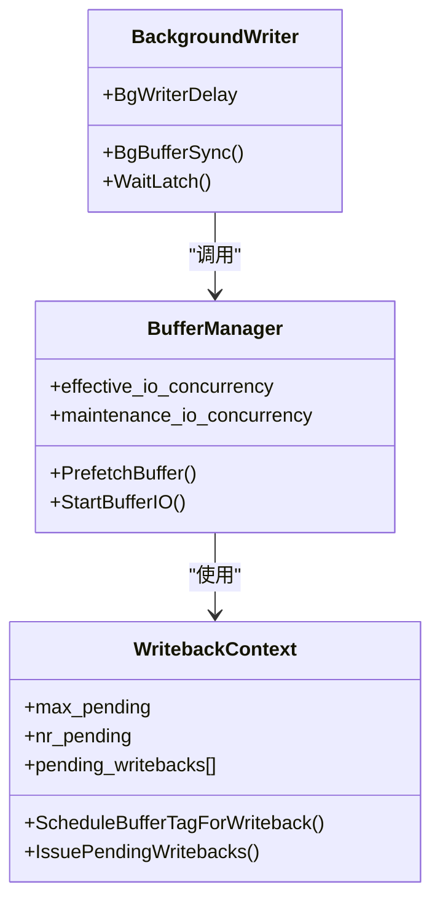
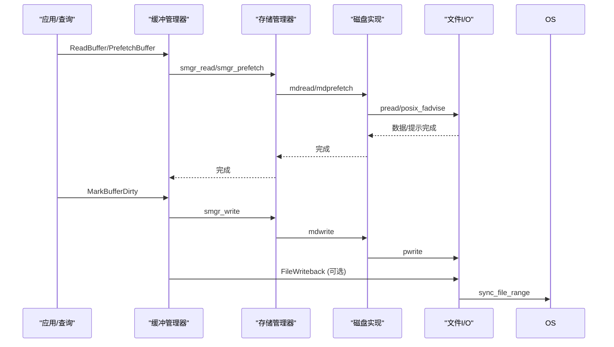
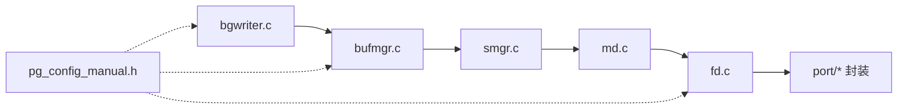

# I/O调度

<cite>
**本文引用的文件**
- [src/backend/postmaster/bgwriter.c](file://src/backend/postmaster/bgwriter.c)
- [src/include/postmaster/bgwriter.h](file://src/include/postmaster/bgwriter.h)
- [src/backend/storage/buffer/bufmgr.c](file://src/backend/storage/buffer/bufmgr.c)
- [src/include/storage/bufmgr.h](file://src/include/storage/bufmgr.h)
- [src/backend/storage/smgr/md.c](file://src/backend/storage/smgr/md.c)
- [src/backend/storage/smgr/smgr.c](file://src/backend/storage/smgr/smgr.c)
- [src/backend/storage/file/fd.c](file://src/backend/storage/file/fd.c)
- [src/port/pread.c](file://src/port/pread.c)
- [src/port/pwrite.c](file://src/port/pwrite.c)
- [src/port/preadv.c](file://src/port/preadv.c)
- [src/include/port/pg_iovec.h](file://src/include/port/pg_iovec.h)
- [src/include/pg_config_manual.h](file://src/include/pg_config_manual.h)
</cite>

## 目录
1. [简介](#简介)
2. [项目结构](#项目结构)
3. [核心组件](#核心组件)
4. [架构总览](#架构总览)
5. [详细组件分析](#详细组件分析)
6. [依赖关系分析](#依赖关系分析)
7. [性能考量](#性能考量)
8. [故障排查指南](#故障排查指南)
9. [结论](#结论)
10. [附录](#附录)

## 简介
本文件面向Mini PostgreSQL的I/O调度系统，系统性阐述异步I/O、预读策略、写合并与批处理优化、后台写进程（Background Writer）脏页扫描与I/O资源管理、I/O并发控制、文件系统I/O与缓冲区缓存交互流程（同步写、异步写、延迟写），并给出架构图、请求流程图与监控指标说明，为I/O性能调优提供技术指导。

## 项目结构
与I/O调度相关的代码主要分布在以下模块：
- 后台写进程：postmaster/bgwriter.c
- 缓冲管理与I/O调度：storage/buffer/bufmgr.c、include/storage/bufmgr.h
- 存储管理器接口与磁盘实现：storage/smgr/smgr.c、storage/smgr/md.c
- 文件层I/O与预读/回写：storage/file/fd.c
- 平台兼容I/O封装：port/pread.c、port/pwrite.c、port/preadv.c、include/port/pg_iovec.h
- 编译期配置与默认阈值：include/pg_config_manual.h

**图表来源**
- [src/backend/postmaster/bgwriter.c:93-353](file://src/backend/postmaster/bgwriter.c#L93-L353)
- [src/backend/storage/buffer/bufmgr.c:568-593](file://src/backend/storage/buffer/bufmgr.c#L568-L593)
- [src/backend/storage/smgr/smgr.c:30-88](file://src/backend/storage/smgr/smgr.c#L30-L88)
- [src/backend/storage/smgr/md.c:147-200](file://src/backend/storage/smgr/md.c#L147-L200)
- [src/backend/storage/file/fd.c:1937-1986](file://src/backend/storage/file/fd.c#L1937-L1986)
- [src/include/pg_config_manual.h:140-167](file://src/include/pg_config_manual.h#L140-L167)

**章节来源**
- [src/backend/postmaster/bgwriter.c:93-353](file://src/backend/postmaster/bgwriter.c#L93-L353)
- [src/backend/storage/buffer/bufmgr.c:568-593](file://src/backend/storage/buffer/bufmgr.c#L568-L593)
- [src/backend/storage/smgr/smgr.c:30-88](file://src/backend/storage/smgr/smgr.c#L30-L88)
- [src/backend/storage/smgr/md.c:147-200](file://src/backend/storage/smgr/md.c#L147-L200)
- [src/backend/storage/file/fd.c:1937-1986](file://src/backend/storage/file/fd.c#L1937-L1986)
- [src/include/pg_config_manual.h:140-167](file://src/include/pg_config_manual.h#L140-L167)

## 核心组件
- 后台写进程（Background Writer）
  - 周期性扫描共享缓冲池，将脏页写出到内核缓冲区，降低前台后端写放大与阻塞。
  - 支持休眠模式以节能，并在有活动或检查点时唤醒。
- 缓冲管理器（Buffer Manager）
  - 负责缓冲池分配、替换策略（时钟扫描）、脏页标记与写回触发。
  - 提供预读接口PrefetchBuffer，驱动底层异步I/O提示。
  - 维护写回上下文WritebackContext，进行写合并与批量提交。
- 存储管理器（Storage Manager）
  - smgr.c定义统一接口，md.c实现基于POSIX的文件读写、扩展、截断、预取与回写。
- 文件I/O层（File Layer）
  - fd.c提供FilePrefetch/FileWriteback等，结合posix_fadvise/sync_file_range等系统调用。
  - port/*提供pread/pwrite/preadv跨平台封装。

**章节来源**
- [src/backend/postmaster/bgwriter.c:93-353](file://src/backend/postmaster/bgwriter.c#L93-L353)
- [src/backend/storage/buffer/bufmgr.c:568-593](file://src/backend/storage/buffer/bufmgr.c#L568-L593)
- [src/backend/storage/buffer/bufmgr.c:4716-4814](file://src/backend/storage/buffer/bufmgr.c#L4716-L4814)
- [src/backend/storage/smgr/smgr.c:30-88](file://src/backend/storage/smgr/smgr.c#L30-L88)
- [src/backend/storage/smgr/md.c:147-200](file://src/backend/storage/smgr/md.c#L147-L200)
- [src/backend/storage/file/fd.c:1937-1986](file://src/backend/storage/file/fd.c#L1937-L1986)

## 架构总览
下图展示了从后台写进程到文件系统的I/O路径，以及缓冲管理器在其中的角色。

**图表来源**
- [src/backend/postmaster/bgwriter.c:231-353](file://src/backend/postmaster/bgwriter.c#L231-L353)
- [src/backend/storage/buffer/bufmgr.c:2190-2485](file://src/backend/storage/buffer/bufmgr.c#L2190-L2485)
- [src/backend/storage/smgr/smgr.c:30-88](file://src/backend/storage/smgr/smgr.c#L30-L88)
- [src/backend/storage/smgr/md.c:147-200](file://src/backend/storage/smgr/md.c#L147-L200)
- [src/backend/storage/file/fd.c:1937-1986](file://src/backend/storage/file/fd.c#L1937-L1986)

## 详细组件分析

### 后台写进程（Background Writer）工作机制
- 主循环
  - 每BgWriterDelay毫秒唤醒一次，调用BgBufferSync执行一轮脏页清理。
  - 统计发送pgstat_send_bgwriter与pgstat_send_wal。
  - 检查点后关闭所有smgr句柄，避免悬挂引用。
  - 非恢复模式下定期记录运行事务快照，辅助复制一致性。
- 休眠与唤醒
  - 若连续两轮无活动且可休眠，进入长睡眠；通过StrategyNotifyBgWriter在下次缓冲分配时唤醒。
- 错误恢复
  - 使用sigsetjmp保护，异常后释放锁、中止缓冲IO、关闭文件、重置内存上下文并重初始化WritebackContext。

**图表来源**
- [src/backend/postmaster/bgwriter.c:93-353](file://src/backend/postmaster/bgwriter.c#L93-L353)

**章节来源**
- [src/backend/postmaster/bgwriter.c:93-353](file://src/backend/postmaster/bgwriter.c#L93-L353)
- [src/include/postmaster/bgwriter.h:24-44](file://src/include/postmaster/bgwriter.h#L24-L44)

### 缓冲管理器：预读、写合并与批处理
- 预读策略
  - PrefetchBuffer发起对某块的异步读取提示，可能命中缓存或触发内核预取。
  - 未启用USE_PREFETCH或文件不存在时会跳过。
- 写回上下文与写合并
  - WritebackContextInit初始化写回上下文，限制最大挂起数。
  - ScheduleBufferTagForWriteback将BufferTag加入待写队列，达到阈值时触发IssuePendingWritebacks。
  - IssuePendingWritebacks对请求排序并按相邻块合并，减少系统调用次数，提升顺序写效率。
- 同步写与延迟写
  - 正常写路径通过smgr_write写入数据至内核缓冲区；必要时调用FileWriteback触发sync_file_range强制落盘。
  - 检查点/后台写进程按阈值触发写回，避免频繁fsync带来的抖动。

**图表来源**
- [src/backend/storage/buffer/bufmgr.c:568-593](file://src/backend/storage/buffer/bufmgr.c#L568-L593)
- [src/backend/storage/buffer/bufmgr.c:4716-4814](file://src/backend/storage/buffer/bufmgr.c#L4716-L4814)
- [src/backend/storage/file/fd.c:1974-1986](file://src/backend/storage/file/fd.c#L1974-L1986)

**章节来源**
- [src/backend/storage/buffer/bufmgr.c:568-593](file://src/backend/storage/buffer/bufmgr.c#L568-L593)
- [src/backend/storage/buffer/bufmgr.c:4716-4814](file://src/backend/storage/buffer/bufmgr.c#L4716-L4814)
- [src/backend/storage/file/fd.c:1937-1986](file://src/backend/storage/file/fd.c#L1937-L1986)

### 后台写进程的脏页扫描与I/O资源管理
- 扫描策略
  - BgBufferSync维护最近分配率与空闲密度平滑估计，动态决定本轮扫描范围。
  - 从next_to_clean位置向前扫描，直到覆盖策略指针一圈或达到bgwriter_lru_maxpages上限。
  - 每次成功写出或发现可复用缓冲即计数，超过阈值则停止本轮。
- I/O节流
  - 通过CheckpointWriteDelay进行I/O速率控制，避免打满磁盘。
- 资源管理
  - 错误恢复中释放所有锁、中止缓冲IO、关闭文件，重初始化WritebackContext，确保状态一致。

**图表来源**
- [src/backend/storage/buffer/bufmgr.c:2190-2485](file://src/backend/storage/buffer/bufmgr.c#L2190-L2485)

**章节来源**
- [src/backend/storage/buffer/bufmgr.c:2190-2485](file://src/backend/storage/buffer/bufmgr.c#L2190-L2485)

### I/O并发控制：有效并发度、队列与超时
- 有效I/O并发度
  - effective_io_concurrency用于控制预读与并发I/O数量，影响PrefetchBuffer行为。
  - maintenance_io_concurrency为维护任务提供更高并发度。
- I/O队列管理
  - WritebackContext作为写回队列，限制最大挂起数WRITEBACK_MAX_PENDING_FLUSHES，防止过多并发写导致拥塞。
- 超时与等待
  - 后台写进程通过WaitLatch配合WL_TIMEOUT控制周期唤醒。
  - 缓冲I/O过程中通过ConditionVariableSleep等待I/O完成，避免忙等。

**图表来源**
- [src/include/storage/bufmgr.h:67-88](file://src/include/storage/bufmgr.h#L67-L88)
- [src/backend/storage/buffer/bufmgr.c:4716-4814](file://src/backend/storage/buffer/bufmgr.c#L4716-L4814)
- [src/backend/postmaster/bgwriter.c:231-353](file://src/backend/postmaster/bgwriter.c#L231-L353)

**章节来源**
- [src/include/storage/bufmgr.h:67-88](file://src/include/storage/bufmgr.h#L67-L88)
- [src/backend/storage/buffer/bufmgr.c:4716-4814](file://src/backend/storage/buffer/bufmgr.c#L4716-L4814)
- [src/backend/postmaster/bgwriter.c:231-353](file://src/backend/postmaster/bgwriter.c#L231-L353)

### 文件系统I/O与缓冲区缓存交互：同步写、异步写、延迟写
- 同步写
  - 直接调用smgr_write/mdwrite，最终通过pwrite写入数据；必要时调用FileWriteback触发sync_file_range确保落盘。
- 异步写
  - 通过WritebackContext累积写请求，排序合并后批量提交，减少系统调用开销。
- 延迟写
  - 后台写进程周期性扫描脏页，按阈值触发写回；检查点完成后关闭smgr句柄，避免长期持有文件描述符。
- 预读
  - FilePrefetch使用posix_fadvise提示内核预取；PrefetchBuffer在缓冲层发起预读，提高后续ReadBuffer命中率。

**图表来源**
- [src/backend/storage/buffer/bufmgr.c:568-593](file://src/backend/storage/buffer/bufmgr.c#L568-L593)
- [src/backend/storage/smgr/smgr.c:30-88](file://src/backend/storage/smgr/smgr.c#L30-L88)
- [src/backend/storage/smgr/md.c:147-200](file://src/backend/storage/smgr/md.c#L147-L200)
- [src/backend/storage/file/fd.c:1937-1986](file://src/backend/storage/file/fd.c#L1937-L1986)
- [src/port/pread.c:22-29](file://src/port/pread.c#L22-L29)
- [src/port/pwrite.c:22-29](file://src/port/pwrite.c#L22-L29)
- [src/port/preadv.c:24-54](file://src/port/preadv.c#L24-L54)

**章节来源**
- [src/backend/storage/buffer/bufmgr.c:568-593](file://src/backend/storage/buffer/bufmgr.c#L568-L593)
- [src/backend/storage/smgr/smgr.c:30-88](file://src/backend/storage/smgr/smgr.c#L30-L88)
- [src/backend/storage/smgr/md.c:147-200](file://src/backend/storage/smgr/md.c#L147-L200)
- [src/backend/storage/file/fd.c:1937-1986](file://src/backend/storage/file/fd.c#L1937-L1986)
- [src/port/pread.c:22-29](file://src/port/pread.c#L22-L29)
- [src/port/pwrite.c:22-29](file://src/port/pwrite.c#L22-L29)
- [src/port/preadv.c:24-54](file://src/port/preadv.c#L24-L54)

## 依赖关系分析
- 模块耦合
  - bgwriter.c依赖bufmgr.c的BgBufferSync与WritebackContext，间接依赖smgr与fd。
  - bufmgr.c依赖smgr接口与fd层，使用pg_config_manual.h中的默认阈值。
  - smgr.c抽象出存储管理器接口，md.c实现具体逻辑，fd.c提供系统调用封装。
- 外部依赖
  - 预读依赖POSIX fadvise；写回依赖sync_file_range（Linux）。
  - 向量I/O依赖preadv/pwritev或模拟实现。

**图表来源**
- [src/backend/postmaster/bgwriter.c:93-353](file://src/backend/postmaster/bgwriter.c#L93-L353)
- [src/backend/storage/buffer/bufmgr.c:568-593](file://src/backend/storage/buffer/bufmgr.c#L568-L593)
- [src/backend/storage/smgr/smgr.c:30-88](file://src/backend/storage/smgr/smgr.c#L30-L88)
- [src/backend/storage/smgr/md.c:147-200](file://src/backend/storage/smgr/md.c#L147-L200)
- [src/backend/storage/file/fd.c:1937-1986](file://src/backend/storage/file/fd.c#L1937-L1986)
- [src/include/pg_config_manual.h:140-167](file://src/include/pg_config_manual.h#L140-L167)

**章节来源**
- [src/backend/postmaster/bgwriter.c:93-353](file://src/backend/postmaster/bgwriter.c#L93-L353)
- [src/backend/storage/buffer/bufmgr.c:568-593](file://src/backend/storage/buffer/bufmgr.c#L568-L593)
- [src/backend/storage/smgr/smgr.c:30-88](file://src/backend/storage/smgr/smgr.c#L30-L88)
- [src/backend/storage/smgr/md.c:147-200](file://src/backend/storage/smgr/md.c#L147-L200)
- [src/backend/storage/file/fd.c:1937-1986](file://src/backend/storage/file/fd.c#L1937-L1986)
- [src/include/pg_config_manual.h:140-167](file://src/include/pg_config_manual.h#L140-L167)

## 性能考量
- 预读与并发
  - 合理设置effective_io_concurrency以提升顺序扫描与索引构建性能；维护任务可使用maintenance_io_concurrency获得更高并发。
- 写合并与批处理
  - WritebackContext的排序与合并显著减少系统调用次数，建议在高吞吐场景保持合理的max_pending阈值。
- 后台写节奏
  - 调整BgWriterDelay与bgwriter_lru_maxpages平衡延迟与吞吐；在高负载下适当增大以避免前台阻塞。
- 落盘策略
  - 根据业务容忍度调整checkpoint_flush_after与bgwriter_flush_after，权衡数据持久化与性能。
- I/O节流
  - 利用CheckpointWriteDelay避免瞬时I/O尖峰，保护磁盘健康。

[本节为通用指导，不直接分析具体文件]

## 故障排查指南
- 后台写进程异常退出
  - 现象：主进程检测到后台写进程崩溃，触发恢复流程。
  - 排查：检查错误日志、信号处理、资源释放是否正确；确认WritebackContext重初始化。
- 写回堆积
  - 现象：大量PendingWriteback未提交，磁盘I/O延迟升高。
  - 排查：检查max_pending阈值、合并逻辑、底层pwrite/sync_file_range是否报错。
- 预读无效
  - 现象：PrefetchBuffer未触发内核预取。
  - 排查：确认USE_POSIX_FADVISE编译选项、文件存在性、表空间有效并发度配置。
- 缓冲I/O阻塞
  - 现象：StartBufferIO长时间等待。
  - 排查：检查是否有其他进程正在对该缓冲进行I/O；确认ConditionVariableSleep与WaitIO逻辑。

**章节来源**
- [src/backend/postmaster/bgwriter.c:155-213](file://src/backend/postmaster/bgwriter.c#L155-L213)
- [src/backend/storage/buffer/bufmgr.c:4716-4814](file://src/backend/storage/buffer/bufmgr.c#L4716-L4814)
- [src/backend/storage/file/fd.c:1937-1986](file://src/backend/storage/file/fd.c#L1937-L1986)
- [src/backend/storage/buffer/bufmgr.c:4389-4447](file://src/backend/storage/buffer/bufmgr.c#L4389-L4447)

## 结论
Mini PostgreSQL的I/O调度通过后台写进程、缓冲管理器与存储管理器的协同，实现了高效的异步预读、写合并与批处理，并结合I/O节流与休眠机制，在保证数据一致性的前提下最大化吞吐与降低延迟。通过合理配置有效I/O并发度、写回阈值与后台写节奏，可在不同工作负载下取得良好性能表现。

[本节为总结，不直接分析具体文件]

## 附录
- 关键配置项
  - effective_io_concurrency：有效I/O并发度，影响预读与并发I/O。
  - maintenance_io_concurrency：维护任务专用并发度。
  - bgwriter_lru_maxpages：后台写进程单轮最多写出页数。
  - checkpoint_flush_after/bgwriter_flush_after/backend_flush_after：触发内核写回的阈值。
  - WRITEBACK_MAX_PENDING_FLUSHES：写回上下文最大挂起数。

**章节来源**
- [src/include/storage/bufmgr.h:67-88](file://src/include/storage/bufmgr.h#L67-L88)
- [src/include/pg_config_manual.h:140-167](file://src/include/pg_config_manual.h#L140-L167)