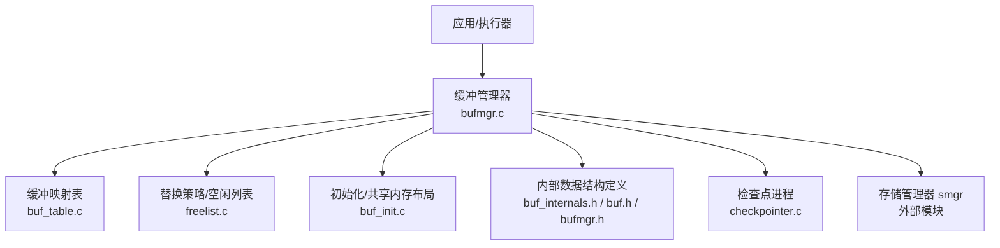
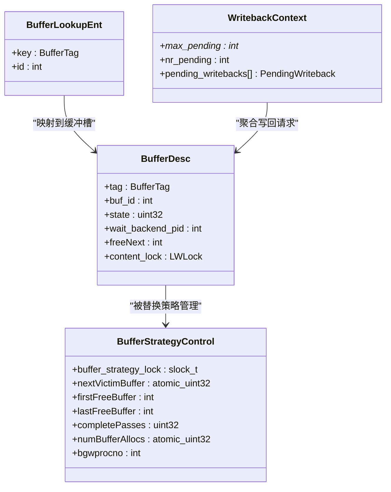
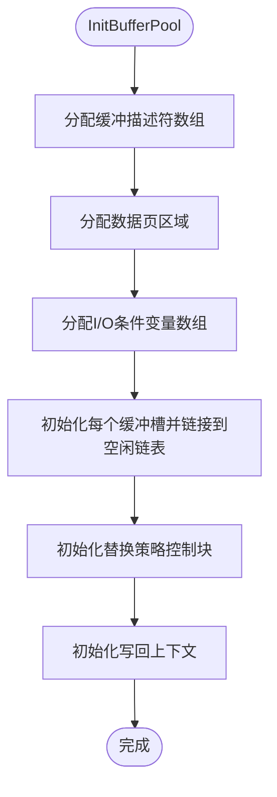
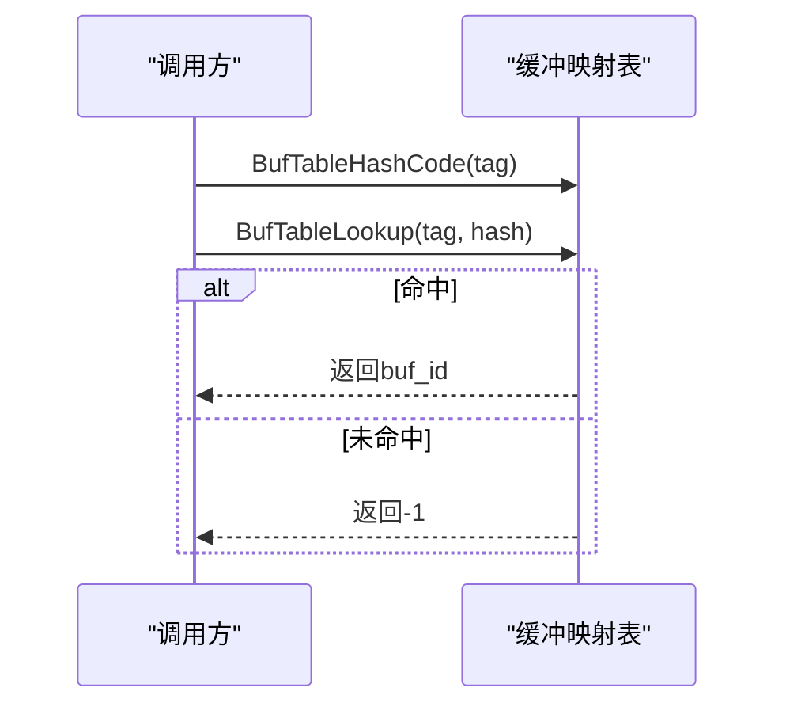
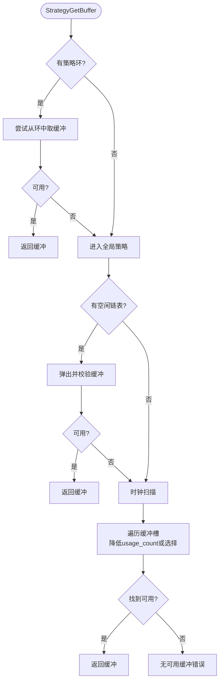
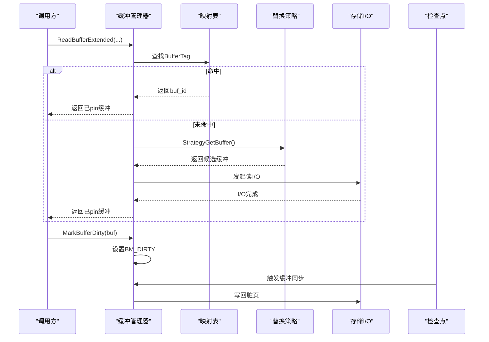
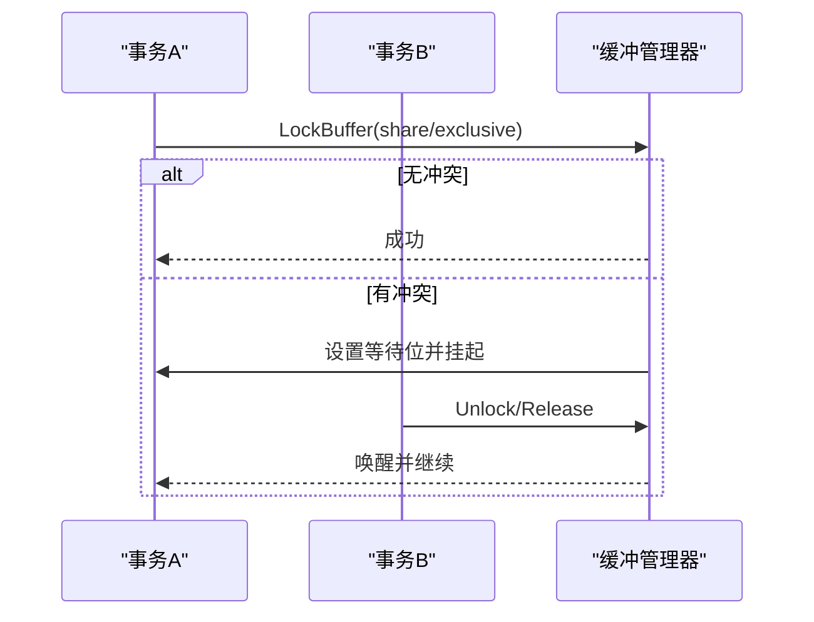
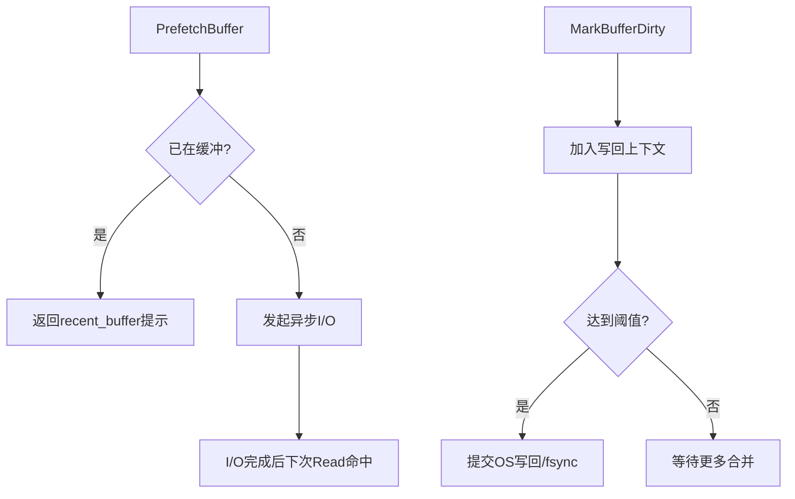
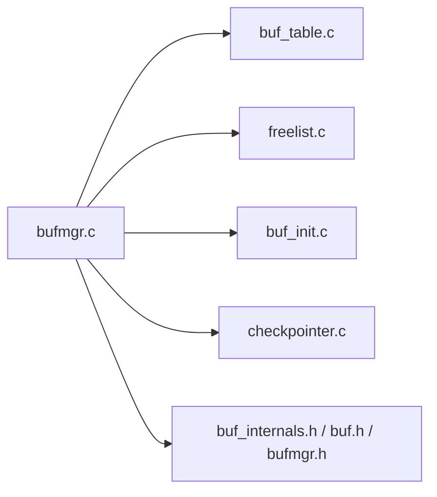

# 缓冲区缓存

<cite>
**本文引用的文件**
- [bufmgr.c](file://src/backend/storage/buffer/bufmgr.c)
- [freelist.c](file://src/backend/storage/buffer/freelist.c)
- [buf_table.c](file://src/backend/storage/buffer/buf_table.c)
- [buf_init.c](file://src/backend/storage/buffer/buf_init.c)
- [buf.h](file://src/include/storage/buf.h)
- [buf_internals.h](file://src/include/storage/buf_internals.h)
- [bufmgr.h](file://src/include/storage/bufmgr.h)
- [checkpointer.c](file://src/backend/postmaster/checkpointer.c)
</cite>

## 目录
1. [简介](#简介)
2. [项目结构](#项目结构)
3. [核心组件](#核心组件)
4. [架构总览](#架构总览)
5. [详细组件分析](#详细组件分析)
6. [依赖关系分析](#依赖关系分析)
7. [性能考量](#性能考量)
8. [故障排查指南](#故障排查指南)
9. [结论](#结论)
10. [附录](#附录)

## 简介
本文件面向Mini PostgreSQL的缓冲区缓存系统，系统性阐述缓冲池的设计与实现：包括缓冲区表管理、空闲列表维护、页面替换算法；缓冲区的生命周期（获取、释放、脏页处理、检查点）；并发控制（锁机制、等待队列、死锁预防）；以及与文件系统I/O的交互（异步I/O、预读策略、写回优化）。文档提供架构图、I/O流程图和性能调优参数说明，为存储层开发提供技术指导。

## 项目结构
Mini PostgreSQL的缓冲区子系统位于后端存储层的buffer目录，配合头文件定义与后台进程协作完成缓冲池管理。

图表来源
- [bufmgr.c:16-30](file://src/backend/storage/buffer/bufmgr.c#L16-L30)
- [buf_table.c:1-20](file://src/backend/storage/buffer/buf_table.c#L1-L20)
- [freelist.c:1-25](file://src/backend/storage/buffer/freelist.c#L1-L25)
- [buf_init.c:27-57](file://src/backend/storage/buffer/buf_init.c#L27-L57)
- [buf_internals.h:135-193](file://src/include/storage/buf_internals.h#L135-L193)
- [bufmgr.h:24-47](file://src/include/storage/bufmgr.h#L24-L47)
- [checkpointer.c:1-36](file://src/backend/postmaster/checkpointer.c#L1-L36)

章节来源
- [bufmgr.c:16-30](file://src/backend/storage/buffer/bufmgr.c#L16-L30)
- [buf_init.c:60-146](file://src/backend/storage/buffer/buf_init.c#L60-L146)

## 核心组件
- 缓冲描述符与状态位：BufferDesc及其state字段集中编码引用计数、使用计数与标志位，支持无锁CAS操作提升并发性能。
- 缓冲映射表：以BufferTag为键的哈希表，将磁盘块定位到缓冲槽，分区化以减少锁竞争。
- 替换策略与空闲列表：基于时钟扫描（Clock Sweep）与空闲链表，选择可回收的候选缓冲。
- 缓冲管理器接口：ReadBuffer/PrefetchBuffer/ReleaseBuffer/MarkBufferDirty等API，协调查找、分配、I/O与写回。
- 初始化与共享内存：统一分配并链接缓冲槽、条件变量、排序数组等。
- 检查点协同：后台检查点进程触发脏页刷盘与WAL同步，保证持久化。

章节来源
- [buf_internals.h:30-77](file://src/include/storage/buf_internals.h#L30-L77)
- [buf_internals.h:135-193](file://src/include/storage/buf_internals.h#L135-L193)
- [buf_table.c:27-67](file://src/backend/storage/buffer/buf_table.c#L27-L67)
- [freelist.c:26-61](file://src/backend/storage/buffer/freelist.c#L26-L61)
- [bufmgr.h:24-47](file://src/include/storage/bufmgr.h#L24-L47)
- [buf_init.c:60-146](file://src/backend/storage/buffer/buf_init.c#L60-L146)

## 架构总览
缓冲池由“缓冲槽+数据页”、“缓冲描述符”、“映射表”、“替换策略”四部分构成，通过缓冲管理器对外暴露API，并与检查点、存储I/O协作。

图表来源
- [buf_internals.h:135-193](file://src/include/storage/buf_internals.h#L135-L193)
- [freelist.c:26-61](file://src/backend/storage/buffer/freelist.c#L26-L61)
- [buf_table.c:27-35](file://src/backend/storage/buffer/buf_table.c#L27-L35)
- [buf_internals.h:254-275](file://src/include/storage/buf_internals.h#L254-L275)

## 详细组件分析

### 缓冲池初始化与共享内存布局
- 在启动时分配缓冲描述符数组、数据页区域、I/O条件变量数组以及检查点排序数组，并将所有缓冲槽链接成空闲链表。
- 初始化策略控制块与每后端的写回上下文。

图表来源
- [buf_init.c:60-146](file://src/backend/storage/buffer/buf_init.c#L60-L146)

章节来源
- [buf_init.c:60-146](file://src/backend/storage/buffer/buf_init.c#L60-L146)

### 缓冲映射表（Buffer Tag → Buffer ID）
- 使用分区哈希表将BufferTag映射到缓冲槽ID，减少锁粒度与冲突。
- 提供计算哈希、查找、插入、删除等基础操作，调用方需持有对应分区锁。

图表来源
- [buf_table.c:70-106](file://src/backend/storage/buffer/buf_table.c#L70-L106)

章节来源
- [buf_table.c:27-163](file://src/backend/storage/buffer/buf_table.c#L27-L163)

### 替换策略与空闲列表（Clock Sweep + 空闲链表）
- 优先从空闲链表取缓冲；若无可用缓冲，则启动时钟扫描，按usage_count逐步降级并寻找可回收缓冲。
- 支持访问策略环（ring）用于批量读取/写入场景，避免频繁抖动。
- 统计完整扫描次数与近期分配数，供后台进程感知压力。

图表来源
- [freelist.c:107-169](file://src/backend/storage/buffer/freelist.c#L107-L169)
- [freelist.c:188-358](file://src/backend/storage/buffer/freelist.c#L188-L358)
- [freelist.c:537-705](file://src/backend/storage/buffer/freelist.c#L537-L705)

章节来源
- [freelist.c:188-358](file://src/backend/storage/buffer/freelist.c#L188-L358)
- [freelist.c:537-705](file://src/backend/storage/buffer/freelist.c#L537-L705)

### 缓冲生命周期：获取、释放、脏页与检查点
- 获取缓冲：ReadBuffer/ReadBufferExtended通过缓冲映射表查找，若未命中则分配缓冲并发起I/O；支持最近缓冲快速路径。
- 释放缓冲：ReleaseBuffer/UnlockReleaseBuffer减少引用计数，必要时加入空闲链表。
- 脏页处理：MarkBufferDirty标记BM_DIRTY，延迟至替换或检查点时写回。
- 检查点：检查点进程周期性触发缓冲同步，确保脏页落盘与WAL一致性。

图表来源
- [bufmgr.c:742-759](file://src/backend/storage/buffer/bufmgr.c#L742-L759)
- [bufmgr.c:505-600](file://src/backend/storage/buffer/bufmgr.c#L505-L600)
- [freelist.c:188-358](file://src/backend/storage/buffer/freelist.c#L188-L358)
- [checkpointer.c:1-36](file://src/backend/postmaster/checkpointer.c#L1-L36)

章节来源
- [bufmgr.c:742-759](file://src/backend/storage/buffer/bufmgr.c#L742-L759)
- [bufmgr.c:505-600](file://src/backend/storage/buffer/bufmgr.c#L505-L600)
- [checkpointer.c:1-36](file://src/backend/postmaster/checkpointer.c#L1-L36)

### 并发控制：锁机制、等待队列与死锁预防
- 缓冲头锁：BufferDesc.state中的BM_LOCKED位与spinlock结合，保护tag/state/waiter等关键信息。
- 内容锁：content_lock（LWLock）用于保护缓冲页内容的读写，支持共享/独占模式。
- 等待队列：当需要独占访问但存在其他pin时，通过wait_backend_pid与BM_PIN_COUNT_WAITER协调等待。
- 死锁预防：通过细粒度分区锁（缓冲映射表分区）、短临界区、先查后锁的策略降低死锁概率；替换策略在扫描过程中避免长时间持锁。

图表来源
- [buf_internals.h:135-193](file://src/include/storage/buf_internals.h#L135-L193)
- [bufmgr.h:93-99](file://src/include/storage/bufmgr.h#L93-L99)

章节来源
- [buf_internals.h:135-193](file://src/include/storage/buf_internals.h#L135-L193)
- [bufmgr.h:93-99](file://src/include/storage/bufmgr.h#L93-L99)

### 与文件系统I/O的交互：异步I/O、预读与写回优化
- 预读：PrefetchBuffer在不阻塞的情况下发起异步读，提升后续命中概率。
- 写回优化：写回请求可合并到WritebackContext，按阈值触发fsync；检查点期间批量写回与同步。
- 并发I/O：effective_io_concurrency与maintenance_io_concurrency控制并发度，提升吞吐。

图表来源
- [bufmgr.c:505-600](file://src/backend/storage/buffer/bufmgr.c#L505-L600)
- [buf_internals.h:254-275](file://src/include/storage/buf_internals.h#L254-L275)
- [bufmgr.h:64-77](file://src/include/storage/bufmgr.h#L64-L77)

章节来源
- [bufmgr.c:505-600](file://src/backend/storage/buffer/bufmgr.c#L505-L600)
- [buf_internals.h:254-275](file://src/include/storage/buf_internals.h#L254-L275)
- [bufmgr.h:64-77](file://src/include/storage/bufmgr.h#L64-L77)

## 依赖关系分析
- 缓冲管理器依赖映射表进行快速定位，依赖替换策略选择候选缓冲，依赖初始化模块构建共享内存布局。
- 检查点进程与缓冲管理器通过共享状态与信号协作，确保脏页与WAL的一致性。
- 头文件定义了跨模块共享的数据结构与常量，保证类型一致性与ABI稳定。

图表来源
- [bufmgr.c:16-30](file://src/backend/storage/buffer/bufmgr.c#L16-L30)
- [buf_table.c:1-20](file://src/backend/storage/buffer/buf_table.c#L1-L20)
- [freelist.c:1-25](file://src/backend/storage/buffer/freelist.c#L1-L25)
- [buf_init.c:27-57](file://src/backend/storage/buffer/buf_init.c#L27-L57)
- [checkpointer.c:1-36](file://src/backend/postmaster/checkpointer.c#L1-L36)

章节来源
- [bufmgr.c:16-30](file://src/backend/storage/buffer/bufmgr.c#L16-L30)
- [bufmgr.h:24-47](file://src/include/storage/bufmgr.h#L24-L47)

## 性能考量
- 使用计数上限BM_MAX_USAGE_COUNT平衡LRU近似精度与时钟扫描成本。
- 缓冲映射表分区化减少锁争用；缓冲描述符按缓存行对齐避免伪共享。
- 预读与写回合并降低I/O次数；有效并发度参数调节吞吐与延迟。
- 访问策略环（bulkread/bulkwrite/vacuum）针对特定工作负载优化缓冲重用。

[本节为通用性能指导，不直接分析具体文件]

## 故障排查指南
- 无可用缓冲：当所有缓冲均被pin或usage_count非零且无法降权时，可能抛出“无可用缓冲”错误。检查是否存在长时间持有pin的事务或热点访问导致替换失败。
- 脏页堆积：检查点间隔过长或写回阈值过高可能导致脏页积压，影响恢复时间。调整checkpoint_flush_after与backend_flush_after。
- I/O瓶颈：effective_io_concurrency过低会限制并发读；过高可能引发内核调度开销。根据硬件与工作负载调优maintenance_io_concurrency。
- 锁竞争：高并发下缓冲映射表分区锁仍可能成为热点，考虑增加NUM_BUFFER_PARTITIONS或优化查询模式。

章节来源
- [freelist.c:315-358](file://src/backend/storage/buffer/freelist.c#L315-L358)
- [bufmgr.h:64-77](file://src/include/storage/bufmgr.h#L64-L77)

## 结论
Mini PostgreSQL的缓冲区缓存通过紧凑的状态位设计、分区化的映射表、高效的时钟扫描替换策略以及与检查点的紧密协作，实现了高并发、低延迟的缓冲管理。合理的预读、写回合并与并发I/O配置可显著提升吞吐与稳定性。建议在生产环境中依据工作负载特征调优相关参数，并结合监控指标持续优化。

[本节为总结性内容，不直接分析具体文件]

## 附录
- 关键GUC参数
  - effective_io_concurrency：默认I/O并发度
  - maintenance_io_concurrency：维护路径的I/O并发度
  - checkpoint_flush_after：检查点写回阈值
  - backend_flush_after：后端写回阈值
  - bgwriter_flush_after：后台写手写回阈值
  - zero_damaged_pages：损坏页处理策略
  - track_io_timing：是否记录I/O耗时

章节来源
- [bufmgr.h:64-77](file://src/include/storage/bufmgr.h#L64-L77)
- [bufmgr.c:134-161](file://src/backend/storage/buffer/bufmgr.c#L134-L161)