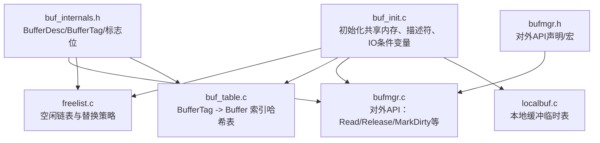
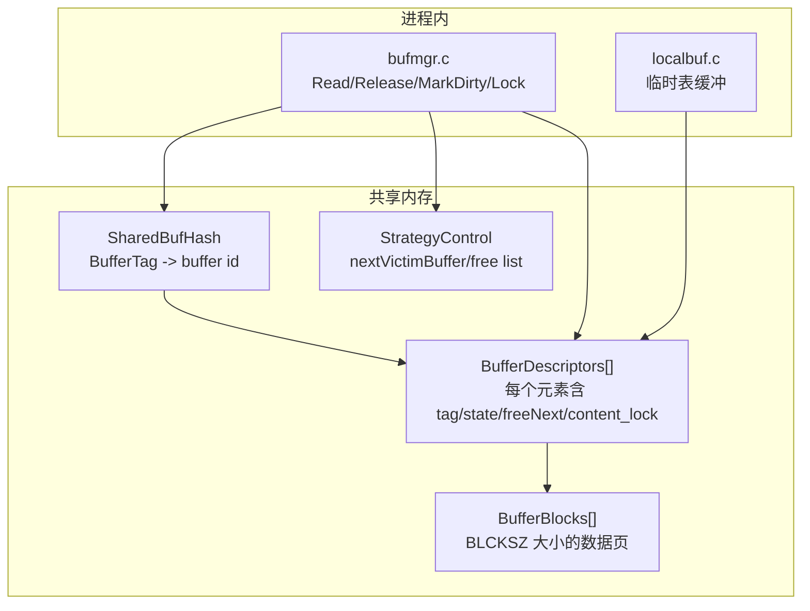
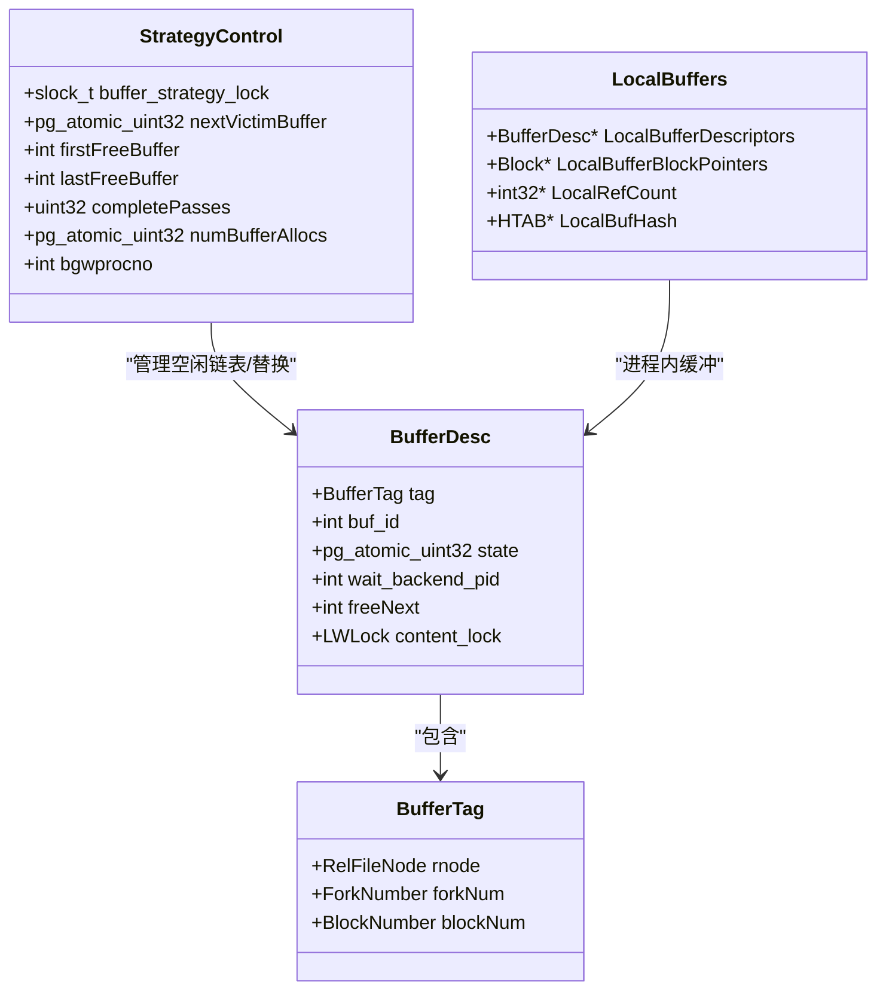
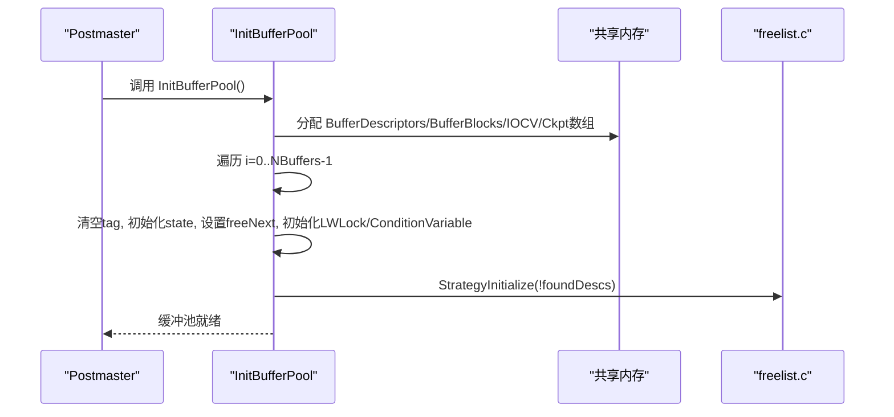
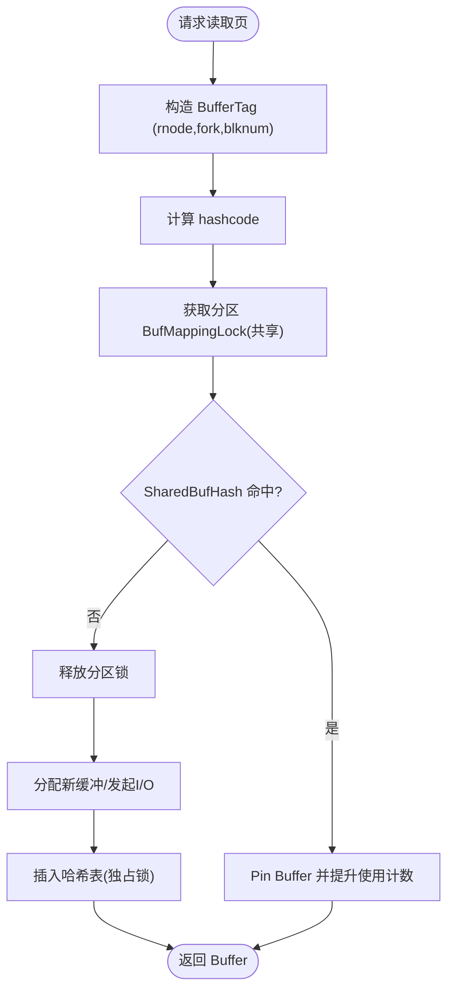
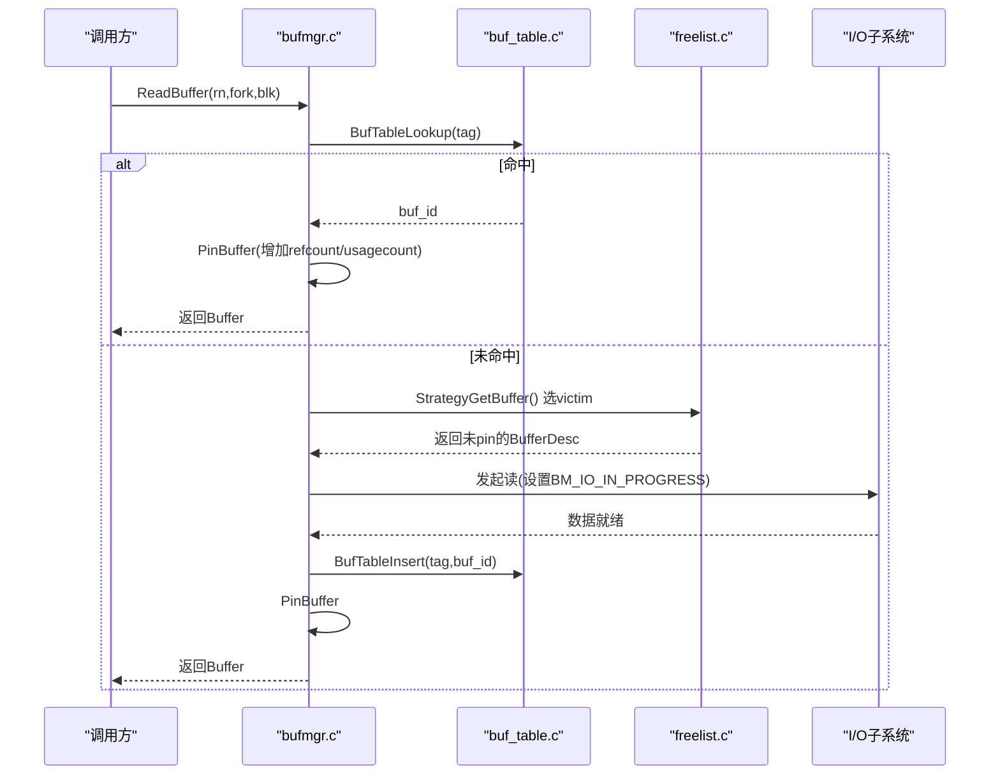
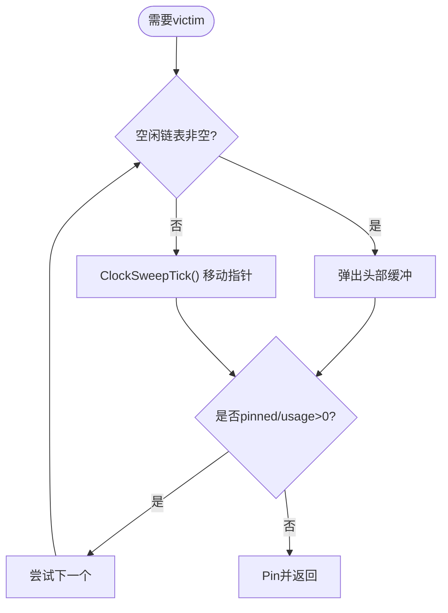
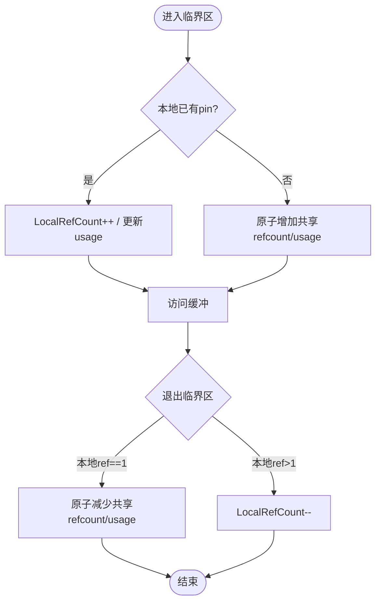
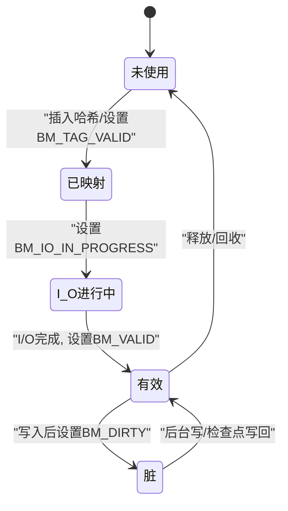
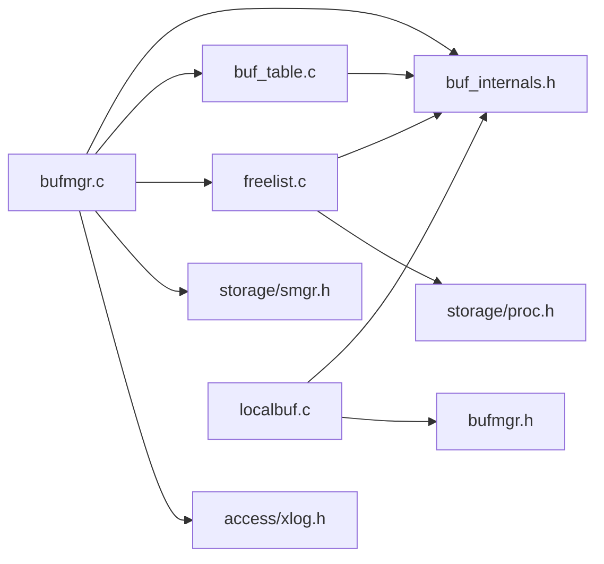

# 缓冲池管理

<cite>
**本文引用的文件**
- [buf_init.c](file://src/backend/storage/buffer/buf_init.c)
- [bufmgr.c](file://src/backend/storage/buffer/bufmgr.c)
- [buf_table.c](file://src/backend/storage/buffer/buf_table.c)
- [freelist.c](file://src/backend/storage/buffer/freelist.c)
- [localbuf.c](file://src/backend/storage/buffer/localbuf.c)
- [buf_internals.h](file://src/include/storage/buf_internals.h)
- [bufmgr.h](file://src/include/storage/bufmgr.h)
- [README（缓冲池访问规则）](file://src/backend/storage/buffer/README)
</cite>

## 目录
1. [简介](#简介)
2. [项目结构](#项目结构)
3. [核心组件](#核心组件)
4. [架构总览](#架构总览)
5. [详细组件分析](#详细组件分析)
6. [依赖关系分析](#依赖关系分析)
7. [性能考量](#性能考量)
8. [故障排查指南](#故障排查指南)
9. [结论](#结论)
10. [附录](#附录)

## 简介
本文件面向存储层开发者，系统性阐述 Mini PostgreSQL 的缓冲池管理系统。重点覆盖：
- 缓冲区表的结构与组织方式
- 缓冲区的分配、回收与替换策略
- 缓冲区的生命周期管理（创建、获取、释放、销毁）
- 引用计数机制（共享引用计数与本地引用计数）
- 缓冲区与文件系统的映射（RelFileNode 到 Buffer 的映射管理）
- 缓冲池架构图、状态转换图与关键数据结构说明

## 项目结构
缓冲池相关代码主要位于 storage/buffer 目录，配合 include/storage 中的头文件定义内部接口与数据结构。

图表来源
- [buf_init.c:66-146](file://src/backend/storage/buffer/buf_init.c#L66-L146)
- [freelist.c:26-64](file://src/backend/storage/buffer/freelist.c#L26-L64)
- [buf_table.c:27-67](file://src/backend/storage/buffer/buf_table.c#L27-L67)
- [bufmgr.c:15-30](file://src/backend/storage/buffer/bufmgr.c#L15-L30)
- [localbuf.c:30-53](file://src/backend/storage/buffer/localbuf.c#L30-L53)
- [buf_internals.h:135-193](file://src/include/storage/buf_internals.h#L135-L193)
- [bufmgr.h:174-244](file://src/include/storage/bufmgr.h#L174-L244)

章节来源
- [buf_init.c:66-146](file://src/backend/storage/buffer/buf_init.c#L66-L146)
- [bufmgr.h:174-244](file://src/include/storage/bufmgr.h#L174-L244)

## 核心组件
- 共享缓冲池初始化与资源分配：负责在共享内存中分配 BufferDescriptors、数据页块、I/O 条件变量数组以及检查点排序数组，并建立空闲链表。
- 缓冲查找表：维护 BufferTag 到 buffer 索引的映射，支持并发分区锁。
- 替换策略与空闲链表：基于时钟扫描算法选择可回收的 victim buffer，并提供环式策略用于批量读/写场景。
- 缓冲管理器 API：提供 ReadBuffer、ReleaseBuffer、MarkBufferDirty、LockBuffer 等高层接口。
- 本地缓冲：为临时表提供进程内快速缓冲，无需 WAL/检查点。

章节来源
- [buf_init.c:66-146](file://src/backend/storage/buffer/buf_init.c#L66-L146)
- [buf_table.c:27-67](file://src/backend/storage/buffer/buf_table.c#L27-L67)
- [freelist.c:26-64](file://src/backend/storage/buffer/freelist.c#L26-L64)
- [bufmgr.c:15-30](file://src/backend/storage/buffer/bufmgr.c#L15-L30)
- [localbuf.c:30-53](file://src/backend/storage/buffer/localbuf.c#L30-L53)

## 架构总览
缓冲池由“描述符 + 数据页 + 查找表 + 替换策略 + 本地缓冲”构成。外部通过 bufmgr 接口访问；内部通过 buf_table 进行 Tag->Buffer 映射；freelist 负责 victim 选择；buf_init 完成初始化；localbuf 处理临时表路径。

图表来源
- [buf_init.c:66-146](file://src/backend/storage/buffer/buf_init.c#L66-L146)
- [buf_table.c:27-67](file://src/backend/storage/buffer/buf_table.c#L27-L67)
- [freelist.c:26-64](file://src/backend/storage/buffer/freelist.c#L26-L64)
- [bufmgr.c:15-30](file://src/backend/storage/buffer/bufmgr.c#L15-L30)
- [localbuf.c:30-53](file://src/backend/storage/buffer/localbuf.c#L30-L53)
- [buf_internals.h:135-193](file://src/include/storage/buf_internals.h#L135-L193)

## 详细组件分析

### 数据结构与布局
- BufferTag：标识磁盘页（包含 RelFileNode、ForkNumber、BlockNumber），作为哈希键。
- BufferDesc：共享缓冲描述符，包含 tag、buf_id、state（refcount/usagecount/flags）、freeNext、content_lock 等。
- 状态位：BM_VALID、BM_DIRTY、BM_IO_IN_PROGRESS、BM_TAG_VALID、BM_CHECKPOINT_NEEDED 等。
- 本地缓冲：LocalBufferDescriptors、LocalRefCount、LocalBufferBlockPointers，以及 LocalBufHash。

图表来源
- [buf_internals.h:91-119](file://src/include/storage/buf_internals.h#L91-L119)
- [buf_internals.h:135-193](file://src/include/storage/buf_internals.h#L135-L193)
- [freelist.c:26-64](file://src/backend/storage/buffer/freelist.c#L26-L64)
- [localbuf.c:30-53](file://src/backend/storage/buffer/localbuf.c#L30-L53)

章节来源
- [buf_internals.h:91-119](file://src/include/storage/buf_internals.h#L91-L119)
- [buf_internals.h:135-193](file://src/include/storage/buf_internals.h#L135-L193)
- [freelist.c:26-64](file://src/backend/storage/buffer/freelist.c#L26-L64)
- [localbuf.c:30-53](file://src/backend/storage/buffer/localbuf.c#L30-L53)

### 缓冲池初始化与内存布局
- 在共享内存中分配 BufferDescriptors、BufferBlocks、BufferIOCVArray、CkptBufferIds。
- 将全部 BufferDesc 链接成空闲链表，并初始化 LWLock 与条件变量。
- 计算共享内存大小以指导 postmaster 分配。

图表来源
- [buf_init.c:66-146](file://src/backend/storage/buffer/buf_init.c#L66-L146)
- [buf_init.c:154-180](file://src/backend/storage/buffer/buf_init.c#L154-L180)

章节来源
- [buf_init.c:66-146](file://src/backend/storage/buffer/buf_init.c#L66-L146)
- [buf_init.c:154-180](file://src/backend/storage/buffer/buf_init.c#L154-L180)

### 缓冲区与文件系统的映射（RelFileNode -> Buffer）
- BufferTag 由 RelFileNode、ForkNumber、BlockNumber 组成，唯一标识一个物理页。
- SharedBufHash 维护 BufferTag -> buffer id 的映射，按 NUM_BUFFER_PARTITIONS 分区以减少锁竞争。
- 查找/插入/删除需持有对应分区的 BufMappingLock（共享或独占）。

图表来源
- [buf_table.c:27-67](file://src/backend/storage/buffer/buf_table.c#L27-L67)
- [buf_table.c:84-163](file://src/backend/storage/buffer/buf_table.c#L84-L163)
- [buf_internals.h:121-133](file://src/include/storage/buf_internals.h#L121-L133)

章节来源
- [buf_table.c:27-67](file://src/backend/storage/buffer/buf_table.c#L27-L67)
- [buf_table.c:84-163](file://src/backend/storage/buffer/buf_table.c#L84-L163)
- [buf_internals.h:121-133](file://src/include/storage/buf_internals.h#L121-L133)

### 缓冲区的生命周期管理（创建、获取、释放、销毁）
- 创建：InitBufferPool 分配并初始化所有 BufferDesc，构建空闲链表。
- 获取：ReadBuffer/ReadBufferExtended 通过 buf_table 查找或分配新缓冲，必要时发起 I/O，并 pin 缓冲。
- 释放：ReleaseBuffer 减少本地/共享引用计数，若为零则可能回收到空闲链表。
- 销毁：会话/事务结束时清理本地缓冲；数据库/关系级清理会移除映射并释放缓冲。

图表来源
- [bufmgr.c:15-30](file://src/backend/storage/buffer/bufmgr.c#L15-L30)
- [buf_table.c:84-163](file://src/backend/storage/buffer/buf_table.c#L84-L163)
- [freelist.c:188-200](file://src/backend/storage/buffer/freelist.c#L188-L200)

章节来源
- [bufmgr.c:15-30](file://src/backend/storage/buffer/bufmgr.c#L15-L30)
- [buf_table.c:84-163](file://src/backend/storage/buffer/buf_table.c#L84-L163)
- [freelist.c:188-200](file://src/backend/storage/buffer/freelist.c#L188-L200)

### 替换策略与空闲链表（时钟扫描与环式策略）
- 空闲链表：首尾指针维护未使用缓冲链，由 buffer_strategy_lock 保护。
- 时钟扫描：nextVictimBuffer 循环前进，结合 usage count 与 pinned 状态选择 victim。
- 环式策略：对顺序扫描/VACUUM/COPY 等大批量访问，使用固定大小的 ring 复用缓冲，降低抖动与 WAL flush 压力。

图表来源
- [freelist.c:26-64](file://src/backend/storage/buffer/freelist.c#L26-L64)
- [freelist.c:106-169](file://src/backend/storage/buffer/freelist.c#L106-L169)
- [freelist.c:171-200](file://src/backend/storage/buffer/freelist.c#L171-L200)

章节来源
- [freelist.c:26-64](file://src/backend/storage/buffer/freelist.c#L26-L64)
- [freelist.c:106-169](file://src/backend/storage/buffer/freelist.c#L106-L169)
- [freelist.c:171-200](file://src/backend/storage/buffer/freelist.c#L171-L200)

### 引用计数机制（共享与本地）
- 共享引用计数：嵌入 BufferDesc.state 的低18位，表示全局被 pin 的次数；配合 usage count 辅助替换。
- 本地引用计数：每个后端维护 PrivateRefCountArray/Hash，避免重复修改共享 refcount；事务结束校验无泄漏。
- 本地缓冲：LocalRefCount 独立于共享计数，仅在本进程有效。

图表来源
- [bufmgr.c:170-200](file://src/backend/storage/buffer/bufmgr.c#L170-L200)
- [buf_internals.h:29-78](file://src/include/storage/buf_internals.h#L29-L78)
- [localbuf.c:139-160](file://src/backend/storage/buffer/localbuf.c#L139-L160)

章节来源
- [bufmgr.c:170-200](file://src/backend/storage/buffer/bufmgr.c#L170-L200)
- [buf_internals.h:29-78](file://src/include/storage/buf_internals.h#L29-L78)
- [localbuf.c:139-160](file://src/backend/storage/buffer/localbuf.c#L139-L160)

### 缓冲区状态与锁语义
- 状态位：BM_VALID（数据有效）、BM_DIRTY（需写盘）、BM_IO_IN_PROGRESS（I/O进行中）、BM_TAG_VALID（已映射）、BM_CHECKPOINT_NEEDED（检查点需写）等。
- 内容锁：LWLock content_lock 控制对缓冲内容的共享/独占访问，短持有时延。
- 清理锁：LockBufferForCleanup 在独占锁基础上等待共享pin数降至1，供 VACUUM/清理使用。

图表来源
- [buf_internals.h:52-78](file://src/include/storage/buf_internals.h#L52-L78)
- [README（缓冲池访问规则）:100-153](file://src/backend/storage/buffer/README#L100-L153)

章节来源
- [buf_internals.h:52-78](file://src/include/storage/buf_internals.h#L52-L78)
- [README（缓冲池访问规则）:100-153](file://src/backend/storage/buffer/README#L100-L153)

### 本地缓冲（临时表）
- 目的：为临时表提供进程内快速缓冲，无需 WAL/检查点。
- 实现：LocalBufHash 维护 tag->id 映射；LocalRefCount 跟踪本地 pin；按需分配 LocalBufferDescriptors 和 Block 指针。
- 行为：与共享缓冲类似，但无跨进程同步开销。

章节来源
- [localbuf.c:30-53](file://src/backend/storage/buffer/localbuf.c#L30-L53)
- [localbuf.c:99-200](file://src/backend/storage/buffer/localbuf.c#L99-L200)

## 依赖关系分析
- bufmgr.c 依赖 buf_internals.h（数据结构）、buf_table.c（映射）、freelist.c（替换）、smgr（存储管理器）、xlog（日志）。
- freelist.c 依赖 buf_internals.h 与 proc（进程信息）。
- buf_table.c 依赖哈希库与分区锁。
- localbuf.c 依赖 buf_internals.h 与 bufmgr.h。

图表来源
- [bufmgr.c:31-59](file://src/backend/storage/buffer/bufmgr.c#L31-L59)
- [freelist.c:16-22](file://src/backend/storage/buffer/freelist.c#L16-L22)
- [buf_table.c:22-26](file://src/backend/storage/buffer/buf_table.c#L22-L26)
- [localbuf.c:16-26](file://src/backend/storage/buffer/localbuf.c#L16-L26)

章节来源
- [bufmgr.c:31-59](file://src/backend/storage/buffer/bufmgr.c#L31-L59)
- [freelist.c:16-22](file://src/backend/storage/buffer/freelist.c#L16-L22)
- [buf_table.c:22-26](file://src/backend/storage/buffer/buf_table.c#L22-L26)
- [localbuf.c:16-26](file://src/backend/storage/buffer/localbuf.c#L16-L26)

## 性能考量
- 分区哈希与分区锁：将 BufMappingLock 拆分为多个分区，显著降低热点冲突。
- 原子状态字段：refcount/usagecount/flags 合并为单原子字，减少锁粒度与上下文切换。
- 时钟扫描与 usage count：近似 LRU，避免全局扫描带来的高开销。
- 环式策略：对顺序扫描/VACUUM/COPY 等场景限制缓冲重用范围，减少 WAL flush 与抖动。
- 缓存对齐：BufferDescPadded 保证每条目对齐至缓存行，降低伪共享。

[本节为通用性能讨论，不直接分析具体文件]

## 故障排查指南
- 死锁与竞争：确保在访问哈希表时正确获取分区锁；避免在持有 buffer_strategy_lock 时执行慢操作。
- I/O 阻塞：检查 BM_IO_IN_PROGRESS 标志与条件变量唤醒逻辑，确认 I/O 完成后正确清除标志并通知等待者。
- 清理锁等待：VACUUM/清理路径需等待共享 pin 数为1，注意长时间持有清理锁的影响。
- 本地缓冲泄漏：事务结束时检查 LocalRefCount，确保无残留 pin。

章节来源
- [README（缓冲池访问规则）:100-153](file://src/backend/storage/buffer/README#L100-L153)
- [bufmgr.c:170-200](file://src/backend/storage/buffer/bufmgr.c#L170-L200)

## 结论
Mini PostgreSQL 的缓冲池采用经典的共享缓冲设计：以 BufferDesc 为核心，结合哈希映射、时钟扫描替换、分区锁与原子状态字段，实现了高并发下的低开销缓冲管理。本地缓冲为临时表提供了高效路径。理解其数据结构、生命周期与锁语义，有助于在存储层进行扩展与优化。

[本节为总结性内容，不直接分析具体文件]

## 附录
- 关键 API 参考：ReadBuffer、ReleaseBuffer、MarkBufferDirty、LockBuffer、StrategyGetBuffer、BufTableLookup/Insert/Delete、InitBufferPool。
- 配置项：effective_io_concurrency、maintenance_io_concurrency、checkpoint_flush_after、bgwriter_flush_after 等影响 I/O 与写回行为。

章节来源
- [bufmgr.h:174-244](file://src/include/storage/bufmgr.h#L174-L244)
- [bufmgr.c:134-162](file://src/backend/storage/buffer/bufmgr.c#L134-L162)