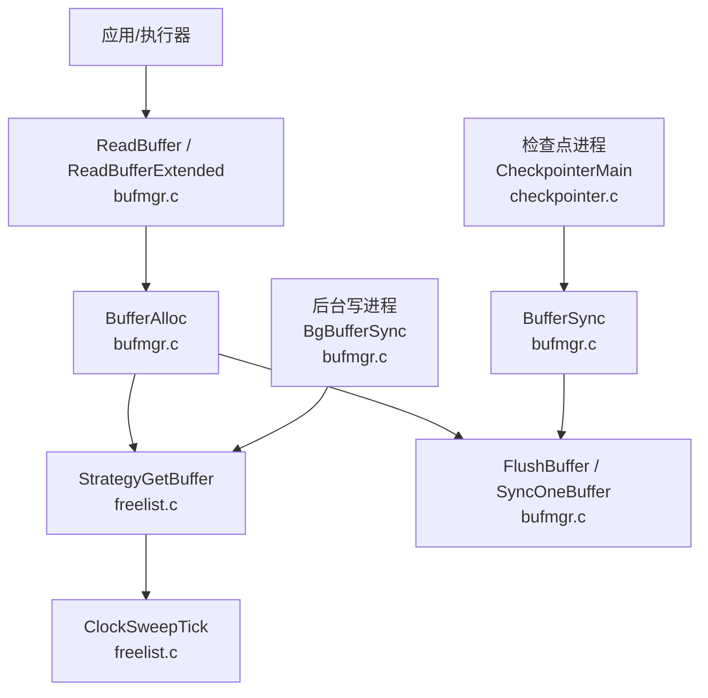
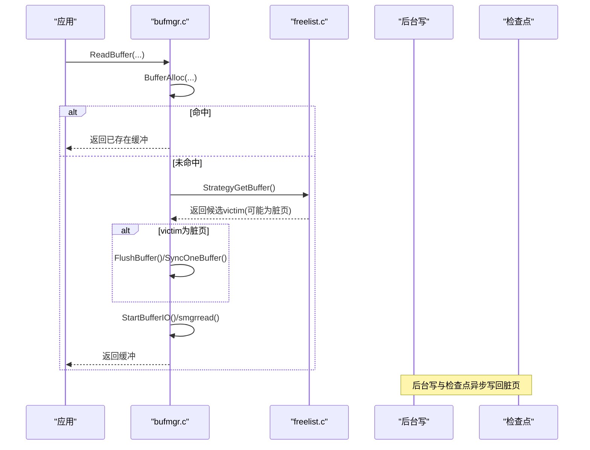
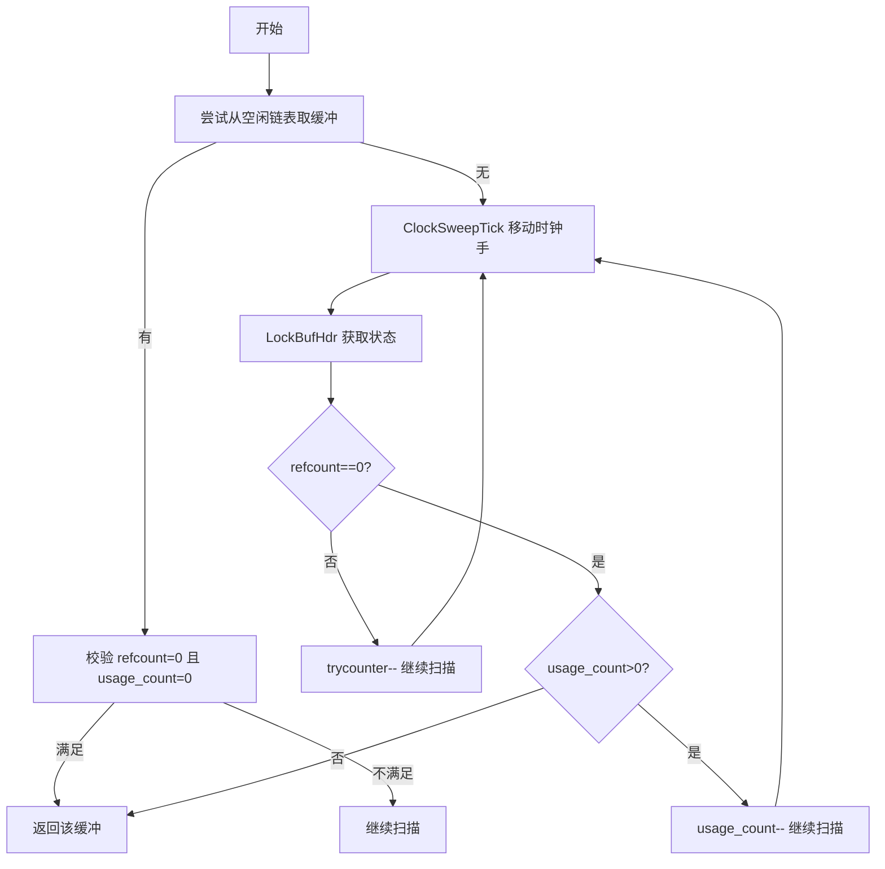
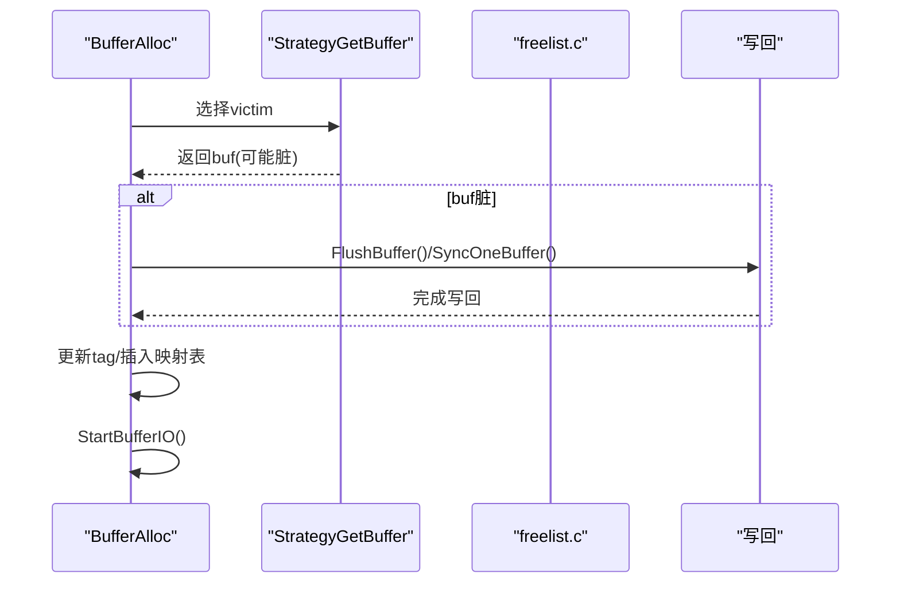
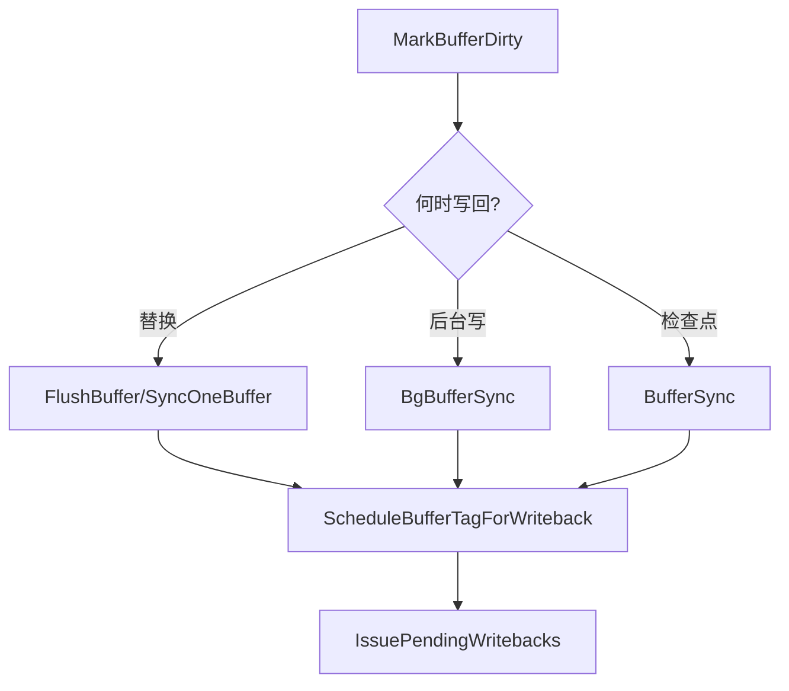
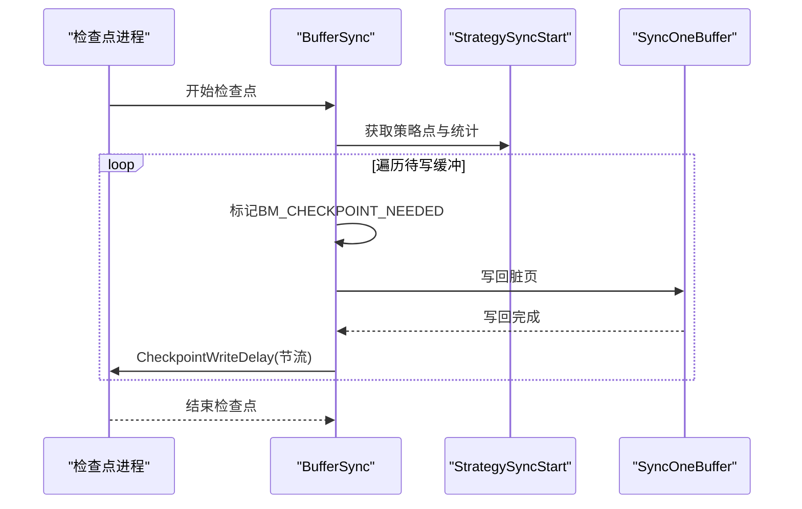
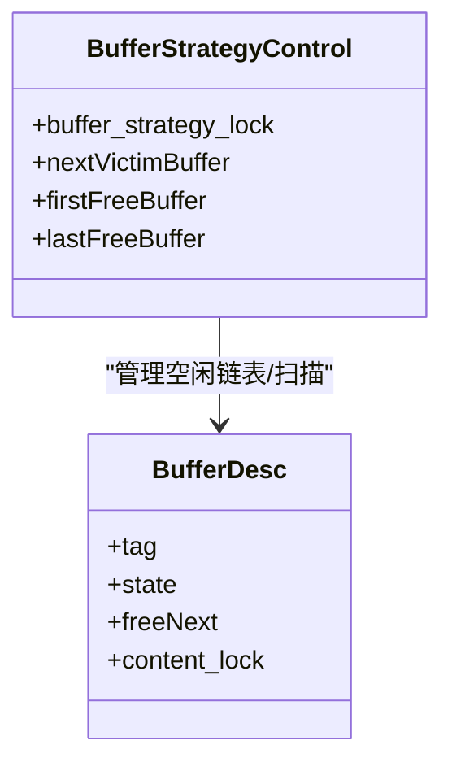
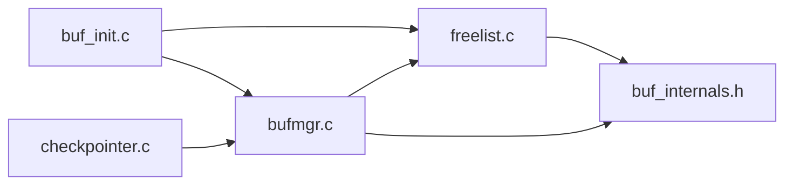

# 页面替换算法

<cite>
**本文引用的文件**
- [bufmgr.c](file://src/backend/storage/buffer/bufmgr.c)
- [freelist.c](file://src/backend/storage/buffer/freelist.c)
- [buf_init.c](file://src/backend/storage/buffer/buf_init.c)
- [checkpointer.c](file://src/backend/postmaster/checkpointer.c)
- [buf_internals.h](file://src/include/storage/buf_internals.h)
</cite>

## 目录
1. [简介](#简介)
2. [项目结构](#项目结构)
3. [核心组件](#核心组件)
4. [架构总览](#架构总览)
5. [详细组件分析](#详细组件分析)
6. [依赖关系分析](#依赖关系分析)
7. [性能考虑](#性能考虑)
8. [故障排查指南](#故障排查指南)
9. [结论](#结论)
10. [附录](#附录)

## 简介
本文面向存储层优化，系统性阐述 Mini PostgreSQL 的页面替换算法与缓冲管理实现。重点包括：
- LRU（最近最少使用）近似策略的实现原理与数据结构
- 空闲列表组织、候选页面选择与替换决策机制
- 脏页处理流程：脏页检查、写回触发条件与批量写优化
- 检查点机制对页面替换的影响及特殊处理策略
- 并发控制下的页面替换安全机制：锁竞争与死锁预防
- 配套流程图、LRU 队列操作图与性能调优参数说明

## 项目结构
Mini PostgreSQL 的缓冲管理与页面替换主要位于后端存储子系统中：
- 缓冲区分配与读写入口、脏页标记、IO 协调：bufmgr.c
- 替换策略与空闲链表/时钟扫描：freelist.c
- 缓冲区池初始化与共享内存布局：buf_init.c
- 检查点进程与写回节流：checkpointer.c
- 缓冲区状态位、BufferDesc 定义等内部接口：buf_internals.h

图表来源
- [bufmgr.c:1092-1439](file://src/backend/storage/buffer/bufmgr.c#L1092-L1439)
- [freelist.c:112-169](file://src/backend/storage/buffer/freelist.c#L112-L169)
- [freelist.c:200-358](file://src/backend/storage/buffer/freelist.c#L200-L358)
- [bufmgr.c:1924-2187](file://src/backend/storage/buffer/bufmgr.c#L1924-L2187)
- [checkpointer.c:182-532](file://src/backend/postmaster/checkpointer.c#L182-L532)

章节来源
- [bufmgr.c:1092-1439](file://src/backend/storage/buffer/bufmgr.c#L1092-L1439)
- [freelist.c:112-169](file://src/backend/storage/buffer/freelist.c#L112-L169)
- [buf_init.c:66-146](file://src/backend/storage/buffer/buf_init.c#L66-L146)
- [checkpointer.c:182-532](file://src/backend/postmaster/checkpointer.c#L182-L532)

## 核心组件
- 缓冲区描述符 BufferDesc：包含 tag、state（refcount、usage_count、标志位）、freeNext、content_lock 等，用于标识页、跟踪访问与 IO 状态、参与空闲链表与内容锁。
- 缓冲区映射表：按 BufferTag 哈希分区，减少锁争用，支持快速查找是否已在缓冲池中。
- 替换策略：基于“时钟扫描”（clock sweep）的近似 LRU，维护空闲链表与全局扫描指针 nextVictimBuffer。
- 后台写进程：周期性扫描并写回脏页，配合策略点避免重复工作。
- 检查点进程：集中写回脏页，平衡多表空间写入，控制写速率。

章节来源
- [buf_internals.h:29-77](file://src/include/storage/buf_internals.h#L29-L77)
- [buf_internals.h:135-193](file://src/include/storage/buf_internals.h#L135-L193)
- [freelist.c:26-64](file://src/backend/storage/buffer/freelist.c#L26-L64)
- [bufmgr.c:1924-2187](file://src/backend/storage/buffer/bufmgr.c#L1924-L2187)

## 架构总览
页面替换与写回的整体协作如下：
- 读路径：ReadBuffer → BufferAlloc → 若命中则 PinBuffer；否则 StrategyGetBuffer 选择 victim → 必要时 FlushBuffer 写回脏页 → StartBufferIO 读取数据 → TerminateBufferIO 标记有效。
- 写路径：MarkBufferDirty 设置 BM_DIRTY/BM_JUST_DIRTIED；在替换或检查点时触发写回。
- 后台写：BgBufferSync 依据策略点扫描并写回脏页，避免阻塞前台。
- 检查点：BufferSync 收集需要写回的脏页，排序并按表空间均衡写入，调用 CheckpointWriteDelay 控制速率。

图表来源
- [bufmgr.c:742-859](file://src/backend/storage/buffer/bufmgr.c#L742-L859)
- [bufmgr.c:1092-1439](file://src/backend/storage/buffer/bufmgr.c#L1092-L1439)
- [freelist.c:200-358](file://src/backend/storage/buffer/freelist.c#L200-L358)
- [bufmgr.c:1924-2187](file://src/backend/storage/buffer/bufmgr.c#L1924-L2187)

## 详细组件分析

### LRU（时钟扫描）替换策略
- 空闲链表：所有缓冲初始化为单向链表，首尾指针由 StrategyControl.firstFreeBuffer/lastFreeBuffer 维护。
- 时钟手：nextVicti mBuffer 原子递增，循环遍历缓冲数组，寻找可回收候选。
- 选择策略：优先从空闲链表取；若无空闲，则扫描 usage_count > 0 的缓冲并递减 usage_count；找到 refcount=0 且 usage_count=0 的缓冲作为 victim。
- 环式策略对象：针对批量读/写场景，提供 ring buffer 以局部重用缓冲，降低全局扫描开销。

图表来源
- [freelist.c:112-169](file://src/backend/storage/buffer/freelist.c#L112-L169)
- [freelist.c:200-358](file://src/backend/storage/buffer/freelist.c#L200-L358)

章节来源
- [freelist.c:112-169](file://src/backend/storage/buffer/freelist.c#L112-L169)
- [freelist.c:200-358](file://src/backend/storage/buffer/freelist.c#L200-L358)
- [freelist.c:536-705](file://src/backend/storage/buffer/freelist.c#L536-L705)

### 缓冲区分配与替换决策
- BufferAlloc：先查映射表命中；未命中则调用 StrategyGetBuffer 选 victim；若 victim 脏页，需先写回；随后更新 tag、插入映射表、启动 IO。
- 脏页写回：使用 LW_SHARED 内容锁避免与并发修改冲突；若无法立即获得锁，放弃当前 victim 重试，防止死锁。
- 非默认策略拒绝：当写回需要刷 WAL 时，可通过 StrategyRejectBuffer 让批量读策略跳过该 victim，提高命中率。

图表来源
- [bufmgr.c:1092-1439](file://src/backend/storage/buffer/bufmgr.c#L1092-L1439)
- [freelist.c:200-358](file://src/backend/storage/buffer/freelist.c#L200-L358)

章节来源
- [bufmgr.c:1092-1439](file://src/backend/storage/buffer/bufmgr.c#L1092-L1439)

### 脏页处理流程与批量写优化
- 脏页标记：MarkBufferDirty 设置 BM_DIRTY 与 BM_JUST_DIRTIED，并更新统计。
- 写回触发：
  - 替换时：若 victim 脏页，先写回再复用。
  - 后台写：BgBufferSync 根据策略点扫描并写回脏页，避免频繁唤醒。
  - 检查点：BufferSync 统一收集并写回脏页，按表空间均衡写入。
- 批量写优化：
  - WritebackContext：累积写请求，延迟到合适时机批量提交。
  - CheckpointWriteDelay：按 checkpoint_completion_target 控制写速率，避免瞬时压力。
  - 排序与表空间均衡：BufferSync 将待写缓冲按表空间排序，并使用最小堆平衡各表空间进度，减少随机 IO 与热点。

图表来源
- [bufmgr.c:1556-1604](file://src/backend/storage/buffer/bufmgr.c#L1556-L1604)
- [bufmgr.c:1924-2187](file://src/backend/storage/buffer/bufmgr.c#L1924-L2187)
- [checkpointer.c:618-677](file://src/backend/postmaster/checkpointer.c#L618-L677)

章节来源
- [bufmgr.c:1556-1604](file://src/backend/storage/buffer/bufmgr.c#L1556-L1604)
- [bufmgr.c:1924-2187](file://src/backend/storage/buffer/bufmgr.c#L1924-L2187)
- [checkpointer.c:618-677](file://src/backend/postmaster/checkpointer.c#L618-L677)

### 检查点机制对页面替换的影响
- 检查点期间：BufferSync 遍历缓冲池，标记 BM_CHECKPOINT_NEEDED 的脏页，记录到 CkptBufferIds，排序后按表空间均衡写回。
- 特殊处理：
  - 关闭 CHECKPOINT_IMMEDIATE 时通过 CheckpointWriteDelay 节流。
  - 关闭 BM_PERMANENT 的非永久缓冲在非关机检查点被跳过。
  - 使用最小堆平衡多表空间写入，避免单一表空间过载。
- 与替换的交互：检查点会主动写回脏页，减少后续替换时的写回成本；同时 BM_CHECKPOINT_NEEDED 标志确保一致性边界。

图表来源
- [bufmgr.c:1924-2187](file://src/backend/storage/buffer/bufmgr.c#L1924-L2187)
- [checkpointer.c:182-532](file://src/backend/postmaster/checkpointer.c#L182-L532)

章节来源
- [bufmgr.c:1924-2187](file://src/backend/storage/buffer/bufmgr.c#L1924-L2187)
- [checkpointer.c:182-532](file://src/backend/postmaster/checkpointer.c#L182-L532)

### 并发控制与死锁预防
- 锁层次：
  - 缓冲头自旋锁（state 中的 BM_LOCKED）：保护 state、tag、wait_backend_pid 等字段。
  - 内容 LW 锁（content_lock）：保护缓冲页内容访问，写回时使用 LW_SHARED 以避免与并发修改冲突。
  - 映射分区锁：保护缓冲映射表，按 hash 分区减少争用。
- 死锁预防：
  - 写回前尝试 LW_SHARED 内容锁，若失败则放弃 victim 重试，避免与正在修改页面的进程死锁。
  - 更新映射表时按较低编号分区锁先加锁，避免环形等待。
  - 使用 CAS 循环更新 state，减少持有锁的时间。
- 等待机制：
  - WaitIO：等待 IO_IN_PROGRESS 完成。
  - UnpinBuffer 中检测 BM_PIN_COUNT_WAITER，通知等待者。

图表来源
- [buf_internals.h:135-193](file://src/include/storage/buf_internals.h#L135-L193)
- [freelist.c:26-64](file://src/backend/storage/buffer/freelist.c#L26-L64)

章节来源
- [bufmgr.c:1177-1266](file://src/backend/storage/buffer/bufmgr.c#L1177-L1266)
- [bufmgr.c:1817-1905](file://src/backend/storage/buffer/bufmgr.c#L1817-L1905)
- [buf_internals.h:135-193](file://src/include/storage/buf_internals.h#L135-L193)

## 依赖关系分析
- bufmgr.c 依赖 freelist.c 提供的替换策略接口（StrategyGetBuffer、StrategyFreeBuffer、StrategySyncStart）。
- checkpointer.c 调用 bufmgr.c 的 BufferSync 进行脏页写回，并通过 CheckpointWriteDelay 控制写速率。
- buf_init.c 初始化缓冲池、空闲链表与策略控制块，供其他模块使用。
- buf_internals.h 定义 BufferDesc、状态位与分区锁宏，贯穿整个缓冲子系统。

图表来源
- [buf_init.c:66-146](file://src/backend/storage/buffer/buf_init.c#L66-L146)
- [freelist.c:200-358](file://src/backend/storage/buffer/freelist.c#L200-L358)
- [bufmgr.c:1092-1439](file://src/backend/storage/buffer/bufmgr.c#L1092-L1439)
- [checkpointer.c:182-532](file://src/backend/postmaster/checkpointer.c#L182-L532)
- [buf_internals.h:135-193](file://src/include/storage/buf_internals.h#L135-L193)

章节来源
- [buf_init.c:66-146](file://src/backend/storage/buffer/buf_init.c#L66-L146)
- [freelist.c:200-358](file://src/backend/storage/buffer/freelist.c#L200-L358)
- [bufmgr.c:1092-1439](file://src/backend/storage/buffer/bufmgr.c#L1092-L1439)
- [checkpointer.c:182-532](file://src/backend/postmaster/checkpointer.c#L182-L532)
- [buf_internals.h:135-193](file://src/include/storage/buf_internals.h#L135-L193)

## 性能考虑
- 使用量计数上限：BM_MAX_USAGE_COUNT 限制 usage_count 最大值，平衡 LRU 精度与时钟扫描效率。
- 后台写阈值：bgwriter_lru_maxpages 控制每次扫描的最大缓冲数；bgwriter_lru_multiplier 调节扫描激进程度。
- 写回节流：checkpoint_flush_after、backend_flush_after 控制内核写回时机；CheckpointWriteDelay 结合 checkpoint_completion_target 平滑写速率。
- 表空间均衡：BufferSync 按表空间排序并使用最小堆平衡写入，减少热点与随机 IO。
- 预取与策略对象：PrefetchBuffer 与 Ring Buffer 提升顺序扫描场景的缓存命中率。

章节来源
- [buf_internals.h:70-77](file://src/include/storage/buf_internals.h#L70-L77)
- [bufmgr.c:134-161](file://src/backend/storage/buffer/bufmgr.c#L134-L161)
- [bufmgr.c:1924-2187](file://src/backend/storage/buffer/bufmgr.c#L1924-L2187)
- [checkpointer.c:618-677](file://src/backend/postmaster/checkpointer.c#L618-L677)

## 故障排查指南
- 无可用缓冲：StrategyGetBuffer 在全部缓冲被 pin 或 usage_count>0 时会报错，需检查是否存在长时间持有缓冲未释放的情况。
- 写回失败：FlushBuffer/SyncOneBuffer 失败可能导致 BM_IO_ERROR 置位，需检查底层 smgr 错误与磁盘状态。
- 检查点卡顿：检查 checkpoint_completion_target、checkpoint_flush_after 配置，确认是否因写速率过慢导致检查点延迟。
- 锁争用高：观察映射分区锁与内容锁的持有时间，必要时调整 NBuffers 或优化查询模式以减少热点页竞争。

章节来源
- [freelist.c:200-358](file://src/backend/storage/buffer/freelist.c#L200-L358)
- [bufmgr.c:1177-1266](file://src/backend/storage/buffer/bufmgr.c#L1177-L1266)
- [checkpointer.c:618-677](file://src/backend/postmaster/checkpointer.c#L618-L677)

## 结论
Mini PostgreSQL 的页面替换采用“时钟扫描”近似 LRU 策略，结合空闲链表、usage_count 衰减与后台写/检查点机制，实现了高效、可扩展的缓冲管理。通过合理的锁层次、CAS 更新与写回节流，系统在并发环境下保持了良好的稳定性与吞吐。针对大规模或多表空间场景，BufferSync 的表空间均衡与排序显著降低了随机 IO。建议在生产环境中根据负载特征调整 bgwriter 与检查点相关参数，以获得最佳性能。

## 附录
- 关键函数路径参考：
  - 读路径：ReadBufferExtended → ReadBuffer_common → BufferAlloc → StrategyGetBuffer
  - 写路径：MarkBufferDirty → FlushBuffer/SyncOneBuffer
  - 后台写：BgBufferSync → StrategySyncStart → SyncOneBuffer
  - 检查点：CheckpointerMain → BufferSync → Sort & Balance → CheckpointWriteDelay

章节来源
- [bufmgr.c:742-859](file://src/backend/storage/buffer/bufmgr.c#L742-L859)
- [bufmgr.c:1092-1439](file://src/backend/storage/buffer/bufmgr.c#L1092-L1439)
- [bufmgr.c:1924-2187](file://src/backend/storage/buffer/bufmgr.c#L1924-L2187)
- [checkpointer.c:182-532](file://src/backend/postmaster/checkpointer.c#L182-L532)