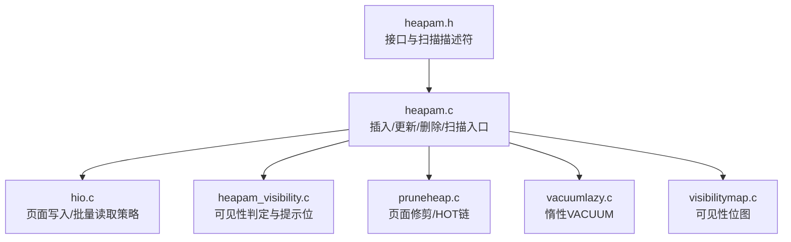
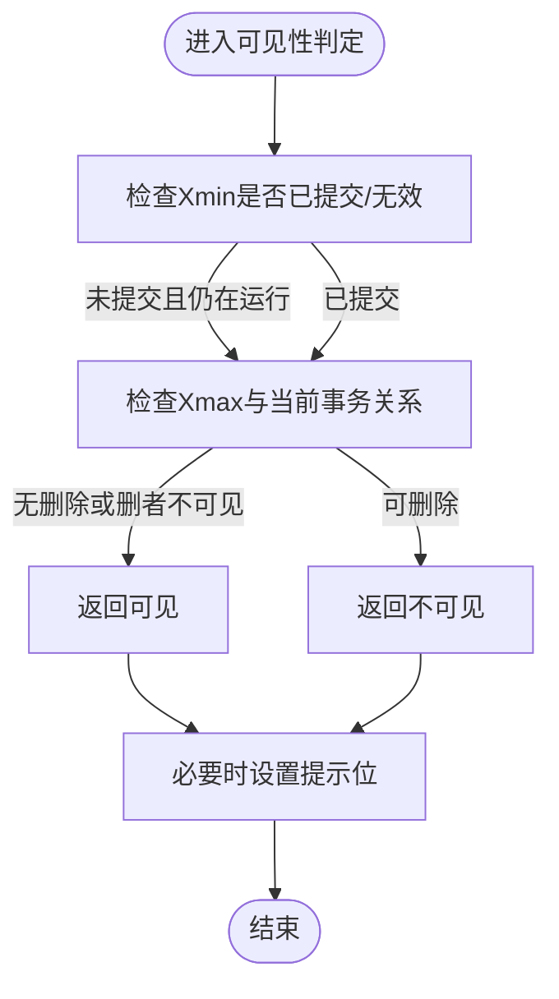
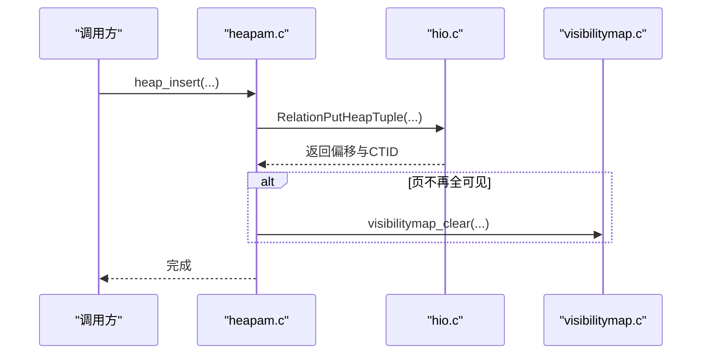
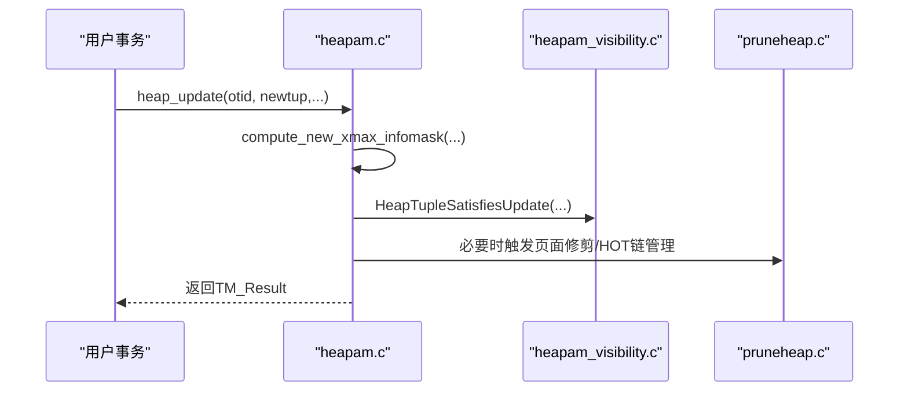
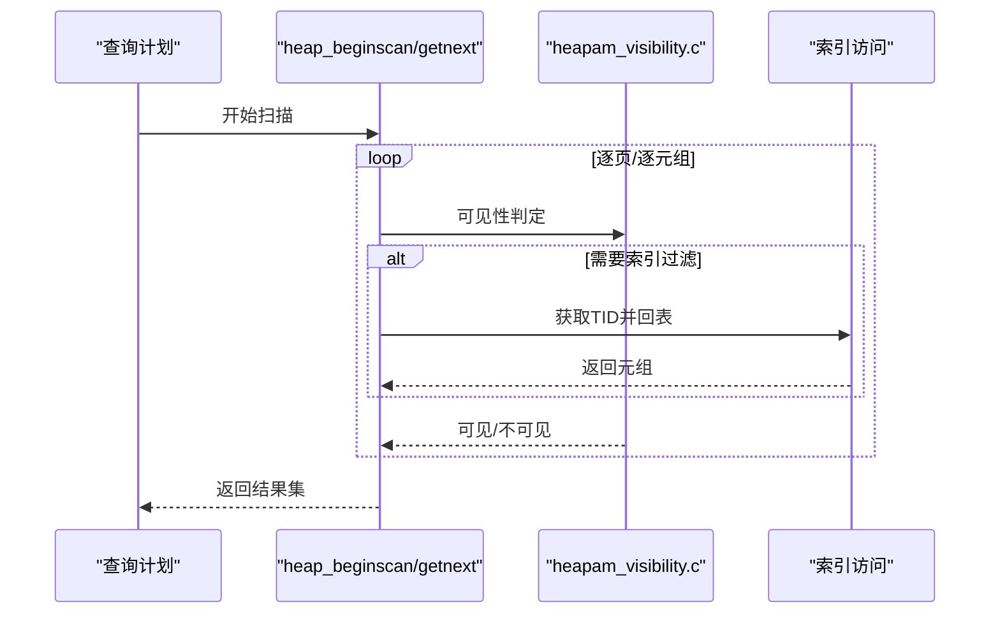
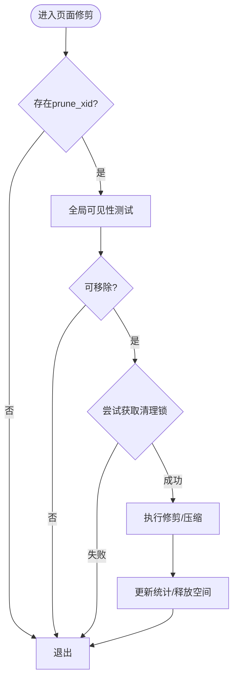
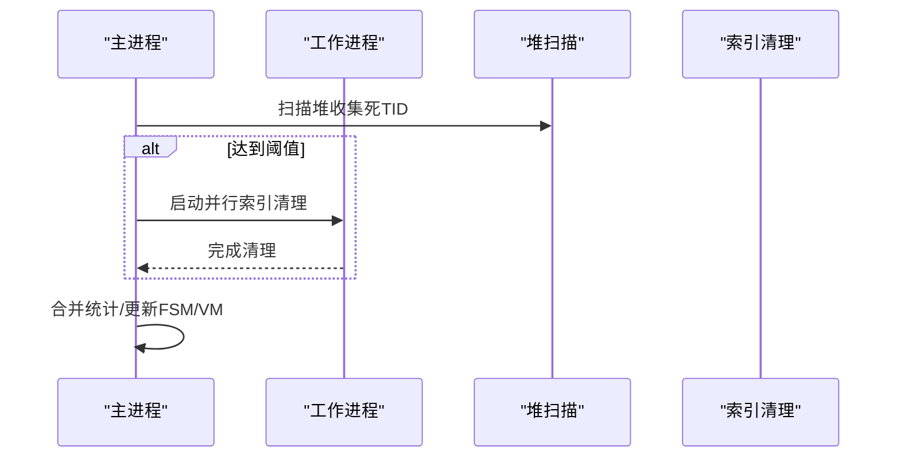
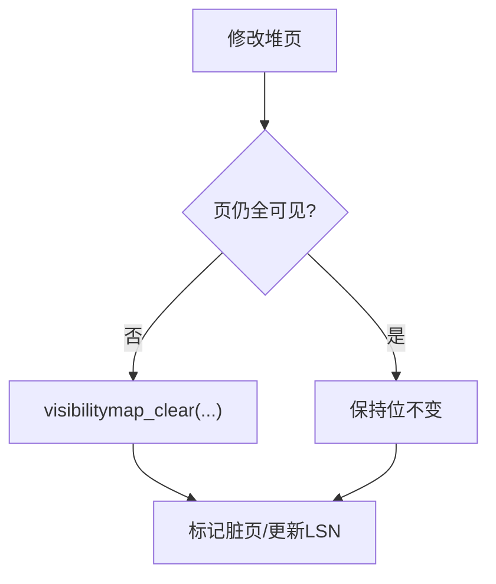
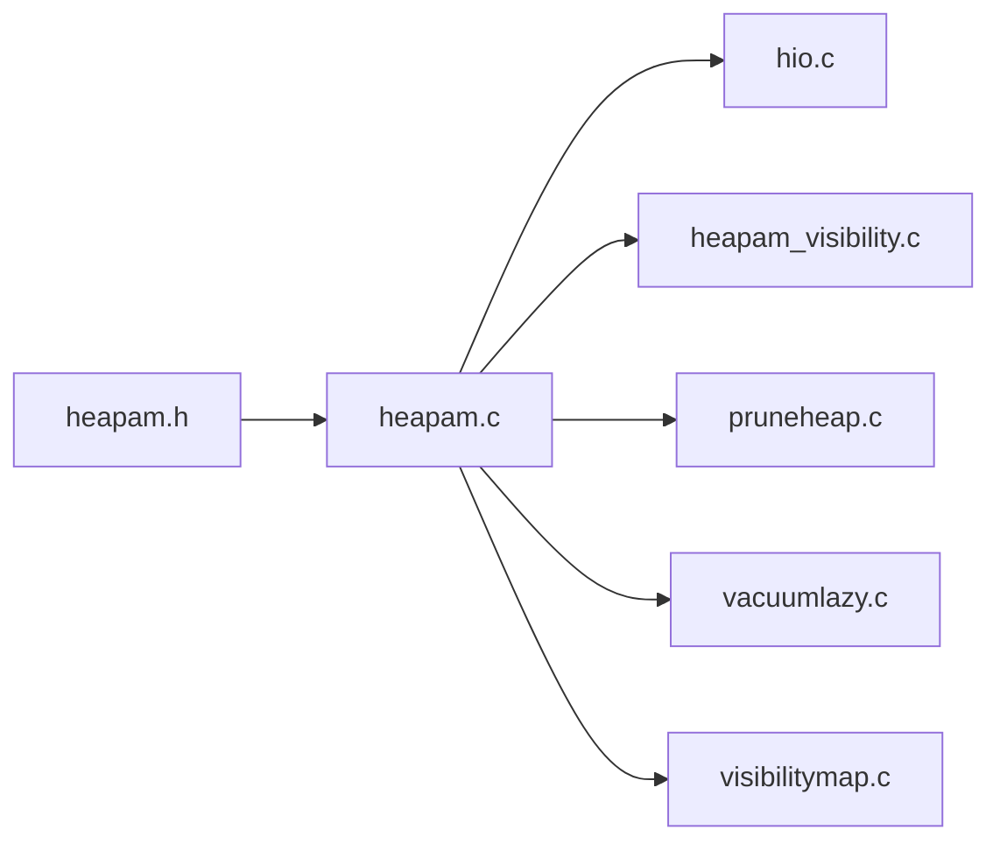

# 堆表存储

<cite>
**本文引用的文件**
- [heapam.h](file://src/include/access/heapam.h)
- [heapam.c](file://src/backend/access/heap/heapam.c)
- [heapam_visibility.c](file://src/backend/access/heap/heapam_visibility.c)
- [hio.c](file://src/backend/access/heap/hio.c)
- [pruneheap.c](file://src/backend/access/heap/pruneheap.c)
- [vacuumlazy.c](file://src/backend/access/heap/vacuumlazy.c)
- [visibilitymap.c](file://src/backend/access/heap/visibilitymap.c)
</cite>

## 目录
1. [简介](#简介)
2. [项目结构](#项目结构)
3. [核心组件](#核心组件)
4. [架构总览](#架构总览)
5. [详细组件分析](#详细组件分析)
6. [依赖关系分析](#依赖关系分析)
7. [性能考虑](#性能考虑)
8. [故障排查指南](#故障排查指南)
9. [结论](#结论)
10. [附录](#附录)

## 简介
本文件面向Mini PostgreSQL的堆表存储层，系统性阐述堆表的元组存储格式、页面结构与空间管理机制；深入解释元组的物理布局（HeapTupleHeader）、可见性信息位图与事务ID管理；文档化插入、更新、删除操作的实现细节，包括MVCC机制与版本链管理；说明扫描算法、索引访问与批量操作优化；并提供架构图、数据流图与性能调优建议，帮助开发者与维护者高效理解与改进堆表子系统。

## 项目结构
堆表相关代码主要位于后端access/heap目录，配合头文件include/access/heapam.h定义对外接口与数据结构；可见性与快照判定逻辑集中在heapam_visibility.c；页面级修剪与HOT链管理由pruneheap.c负责；惰性VACUUM在vacuumlazy.c中实现；可见性映射（Visibility Map）在visibilitymap.c中维护；I/O与批量插入策略在hio.c中提供。



**图示来源**
- [heapam.h:47-90](file://src/include/access/heapam.h#L47-L90)
- [heapam.c:14-31](file://src/backend/access/heap/heapam.c#L14-L31)
- [hio.c:28-83](file://src/backend/access/heap/hio.c#L28-L83)
- [heapam_visibility.c:1-62](file://src/backend/access/heap/heapam_visibility.c#L1-L62)
- [pruneheap.c:1-29](file://src/backend/access/heap/pruneheap.c#L1-L29)
- [vacuumlazy.c:1-48](file://src/backend/access/heap/vacuumlazy.c#L1-L48)
- [visibilitymap.c:1-86](file://src/backend/access/heap/visibilitymap.c#L1-L86)

**章节来源**
- [heapam.h:47-90](file://src/include/access/heapam.h#L47-L90)
- [heapam.c:14-31](file://src/backend/access/heap/heapam.c#L14-L31)

## 核心组件
- 扫描描述符与索引获取：HeapScanDescData用于顺序扫描状态跟踪；IndexFetchHeapData用于通过索引回表取数。
- 可见性结果枚举：HTSV_Result表示元组在VACUUM视角下的可见性状态。
- 批量插入状态：BulkInsertState用于减少缓冲竞争与提升批量写入吞吐。
- 可见性判定API：HeapTupleSatisfies*系列函数提供不同快照语义下的可见性判断，并维护提示位以加速后续访问。
- 页面修剪与HOT链：heap_page_prune_opt等函数进行机会式修剪与碎片整理。
- 惰性VACUUM：vacuumlazy.c实现并发安全的惰性清理，支持并行工作进程与共享内存DSM。
- 可见性映射：visibilitymap.c维护每页“全可见/全冻结”位，加速跳过扫描与索引仅扫描。

**章节来源**
- [heapam.h:47-100](file://src/include/access/heapam.h#L47-L100)
- [heapam.h:146-183](file://src/include/access/heapam.h#L146-L183)
- [heapam_visibility.c:1-62](file://src/backend/access/heap/heapam_visibility.c#L1-L62)
- [pruneheap.c:30-78](file://src/backend/access/heap/pruneheap.c#L30-L78)
- [vacuumlazy.c:85-161](file://src/backend/access/heap/vacuumlazy.c#L85-L161)
- [visibilitymap.c:23-86](file://src/backend/access/heap/visibilitymap.c#L23-L86)

## 架构总览
堆表存储层围绕“元组—页面—关系”三层组织：
- 元组层：HeapTupleHeader包含事务ID、命令ID、可见性位图、CTID等，承载MVCC版本链。
- 页面层：PageHeader+Item数组存放多个元组，维护空闲空间指针与全可见标记。
- 关系层：通过TableScanDesc/HeapScanDescData驱动顺序或索引回表扫描；通过BulkInsertState优化批量写入。

```mermaid
classDiagram
class HeapScanDescData {
+BlockNumber rs_nblocks
+BlockNumber rs_startblock
+BlockNumber rs_numblocks
+bool rs_inited
+BlockNumber rs_cblock
+Buffer rs_cbuf
+int rs_cindex
+int rs_ntuples
+OffsetNumber rs_vistuples[]
}
class IndexFetchHeapData {
+Buffer xs_cbuf
}
class BulkInsertStateData
class VisibilityMap {
+set_bit()
+clear_bit()
+pin()
}
HeapScanDescData --> "使用" Buffer : "当前缓冲"
IndexFetchHeapData --> "使用" Buffer : "当前缓冲"
BulkInsertStateData --> "优化" "批量插入"
VisibilityMap --> "加速" "全可见页跳过"
```

**图示来源**
- [heapam.h:47-90](file://src/include/access/heapam.h#L47-L90)
- [visibilitymap.c:131-200](file://src/backend/access/heap/visibilitymap.c#L131-L200)

## 详细组件分析

### 元组物理布局与可见性位图
- HeapTupleHeader字段涵盖Xmin/Xmax、t_infomask/t_infomask2、t_ctid、t_happens等，用于记录创建/删除事务、锁定状态、是否被移动、是否冻结等。
- 可见性判定函数根据快照与事务状态计算元组可见性，并在安全时机设置提示位（如HEAP_XMIN_COMMITTED），以减少后续检查成本。
- 多事务锁（MultiXact）与命令ID（CommandId）共同决定更新/删除时的冲突检测与可见性窗口。



**图示来源**
- [heapam_visibility.c:147-200](file://src/backend/access/heap/heapam_visibility.c#L147-L200)
- [heapam_visibility.c:81-144](file://src/backend/access/heap/heapam_visibility.c#L81-L144)

**章节来源**
- [heapam_visibility.c:1-62](file://src/backend/access/heap/heapam_visibility.c#L1-L62)
- [heapam_visibility.c:81-144](file://src/backend/access/heap/heapam_visibility.c#L81-L144)
- [heapam_visibility.c:147-200](file://src/backend/access/heap/heapam_visibility.c#L147-L200)

### 插入流程与批量优化
- heap_insert将准备后的元组写入目标页，调用RelationPutHeapTuple完成页面项添加与CTID回填。
- 批量插入通过BulkInsertState复用缓冲、降低锁竞争，并使用ReadBufferBI按策略读取/重用页。
- 插入时可能触发可见性映射位清除（若页不再全可见），确保一致性。



**图示来源**
- [heapam.c:14-31](file://src/backend/access/heap/heapam.c#L14-L31)
- [hio.c:28-83](file://src/backend/access/heap/hio.c#L28-L83)
- [visibilitymap.c:131-171](file://src/backend/access/heap/visibilitymap.c#L131-L171)

**章节来源**
- [hio.c:28-83](file://src/backend/access/heap/hio.c#L28-L83)
- [hio.c:85-128](file://src/backend/access/heap/hio.c#L85-L128)
- [visibilitymap.c:131-171](file://src/backend/access/heap/visibilitymap.c#L131-L171)

### 更新与删除（MVCC与版本链）
- 更新采用MVCC：新元组插入并设置Xmax指向旧版本，形成版本链；同时处理MultiXact冲突与锁定模式。
- 删除标记Xmax为当前事务，并可能设置提示位；后续扫描依据快照决定是否可见。
- 热点更新路径（HOT）在同一页内链接新版本，减少索引维护开销。



**图示来源**
- [heapam.c:94-118](file://src/backend/access/heap/heapam.c#L94-L118)
- [heapam_visibility.c:147-200](file://src/backend/access/heap/heapam_visibility.c#L147-L200)
- [pruneheap.c:94-200](file://src/backend/access/heap/pruneheap.c#L94-L200)

**章节来源**
- [heapam.c:94-118](file://src/backend/access/heap/heapam.c#L94-L118)
- [heapam_visibility.c:147-200](file://src/backend/access/heap/heapam_visibility.c#L147-L200)
- [pruneheap.c:94-200](file://src/backend/access/heap/pruneheap.c#L94-L200)

### 扫描算法与索引访问
- 顺序扫描：HeapScanDescData维护当前块、缓冲、可见元组列表；支持范围扫描与并行扫描数据。
- 索引回表：IndexFetchHeapData缓存当前堆缓冲，减少重复加载；结合BitmapHeapScan/BitmapIndexScan进行过滤。
- 可见性过滤：扫描过程中调用HeapTupleSatisfies*判定元组可见性，必要时更新提示位。



**图示来源**
- [heapam.h:117-134](file://src/include/access/heapam.h#L117-L134)
- [heapam_visibility.c:147-200](file://src/backend/access/heap/heapam_visibility.c#L147-L200)

**章节来源**
- [heapam.h:117-134](file://src/include/access/heapam.h#L117-L134)
- [heapam_visibility.c:147-200](file://src/backend/access/heap/heapam_visibility.c#L147-L200)

### 页面修剪与空间管理
- 机会式修剪：heap_page_prune_opt在满足条件时尝试获取清理锁并进行页面级修剪与碎片整理。
- 阈值与Horizon：基于全局可见性测试与旧快照限制确定可移除事务边界，避免不必要清理。
- HOT链管理：对同一页内的更新链进行压缩，减少索引维护与空间浪费。



**图示来源**
- [pruneheap.c:94-200](file://src/backend/access/heap/pruneheap.c#L94-L200)

**章节来源**
- [pruneheap.c:94-200](file://src/backend/access/heap/pruneheap.c#L94-L200)

### 惰性VACUUM与并行
- 惰性VACUUM分阶段扫描堆与索引，收集死元组TID，分批清理以避免内存溢出。
- 并行模式下使用DSM共享上下文，主进程协调工作进程处理索引清理与堆清理。
- 支持跳过全可见页（借助Visibility Map），显著降低扫描成本。



**图示来源**
- [vacuumlazy.c:85-161](file://src/backend/access/heap/vacuumlazy.c#L85-L161)
- [visibilitymap.c:23-86](file://src/backend/access/heap/visibilitymap.c#L23-L86)

**章节来源**
- [vacuumlazy.c:85-161](file://src/backend/access/heap/vacuumlazy.c#L85-L161)
- [visibilitymap.c:23-86](file://src/backend/access/heap/visibilitymap.c#L23-L86)

### 可见性映射（Visibility Map）
- 每页两位：全可见（all-visible）与全冻结（all-frozen），用于快速跳过扫描与优化索引仅扫描。
- 设置/清除位需遵循WAL与LSN顺序约束，保证崩溃恢复正确性。
- 与堆页PD_ALL_VISIBLE位协同，确保一致性与性能。



**图示来源**
- [visibilitymap.c:131-171](file://src/backend/access/heap/visibilitymap.c#L131-L171)
- [visibilitymap.c:23-86](file://src/backend/access/heap/visibilitymap.c#L23-L86)

**章节来源**
- [visibilitymap.c:23-86](file://src/backend/access/heap/visibilitymap.c#L23-L86)
- [visibilitymap.c:131-171](file://src/backend/access/heap/visibilitymap.c#L131-L171)

## 依赖关系分析
- heapam.c依赖hio.c进行页面写入与批量读取；依赖heapam_visibility.c进行可见性判定；依赖pruneheap.c进行页面修剪；依赖vacuumlazy.c进行清理；依赖visibilitymap.c进行位图管理。
- 头文件heapam.h集中声明扫描描述符、批量插入状态、可见性API与核心操作原型，作为模块间契约。



**图示来源**
- [heapam.h:117-183](file://src/include/access/heapam.h#L117-L183)
- [heapam.c:32-75](file://src/backend/access/heap/heapam.c#L32-L75)

**章节来源**
- [heapam.h:117-183](file://src/include/access/heapam.h#L117-L183)
- [heapam.c:32-75](file://src/backend/access/heap/heapam.c#L32-L75)

## 性能考虑
- 批量插入：使用BulkInsertState复用缓冲与策略，减少锁竞争与I/O；合理预扩展关系以降低扩展锁争用。
- 可见性优化：利用提示位与Visibility Map减少重复检查；避免不必要的位清除与WAL刷新。
- 页面修剪：机会式修剪在低负载时自动回收空间；在高碎片场景下主动触发以提升空间利用率。
- 惰性VACUUM：并行清理索引与堆，控制内存上限，避免长事务导致的膨胀；跳过全可见页。
- 扫描优化：结合索引与位图扫描减少回表次数；合理使用范围扫描与分页限制。

[本节提供通用指导，不直接分析具体文件]

## 故障排查指南
- 插入失败：检查页面空间不足与提示位组合合法性；确认缓冲锁持有与WAL顺序。
- 可见性异常：核对快照与事务状态；验证提示位设置时机与LSN约束；检查MultiXact冲突。
- 修剪阻塞：评估清理锁获取失败原因；调整old_snapshot_threshold与全局可见性阈值。
- VACUUM卡顿：监控死元组数组大小与并行工作进程；适当调整maintenance_work_mem与autovacuum参数。

**章节来源**
- [hio.c:28-83](file://src/backend/access/heap/hio.c#L28-L83)
- [heapam_visibility.c:81-144](file://src/backend/access/heap/heapam_visibility.c#L81-L144)
- [pruneheap.c:94-200](file://src/backend/access/heap/pruneheap.c#L94-L200)
- [vacuumlazy.c:85-161](file://src/backend/access/heap/vacuumlazy.c#L85-L161)

## 结论
Mini PostgreSQL的堆表存储层通过清晰的层次划分与完善的MVCC机制，实现了高效的元组存储、可见性判定与空间管理。借助批量插入、可见性映射、机会式修剪与惰性VACUUM，系统在吞吐与延迟之间取得良好平衡。开发者应重点关注提示位与WAL顺序、MultiXact冲突处理以及并行清理的资源分配，以获得稳定且高性能的存储行为。

[本节总结性内容，不直接分析具体文件]

## 附录
- 关键数据结构参考：HeapScanDescData、IndexFetchHeapData、BulkInsertStateData。
- 核心API参考：heap_insert/heap_update/heap_delete、heap_beginscan/heap_getnext、HeapTupleSatisfies*、visibilitymap_*、heap_page_prune_opt。
- 调试建议：启用调试日志观察提示位设置与可见性判定路径；使用pageinspect工具检查页面布局与项偏移。

[本节为补充信息，不直接分析具体文件]