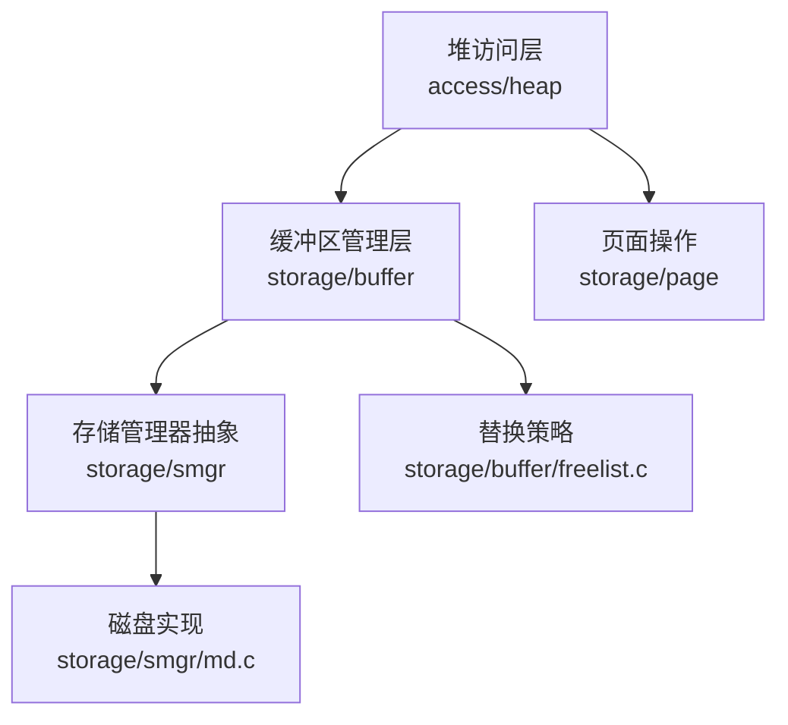
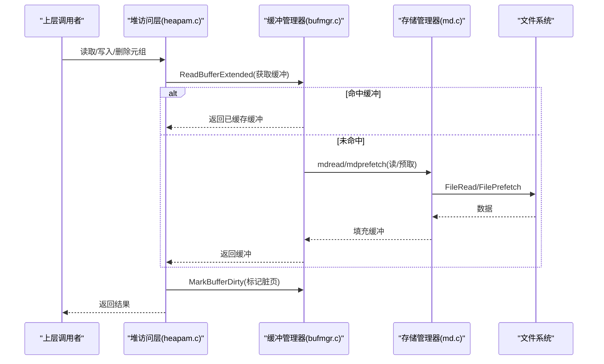
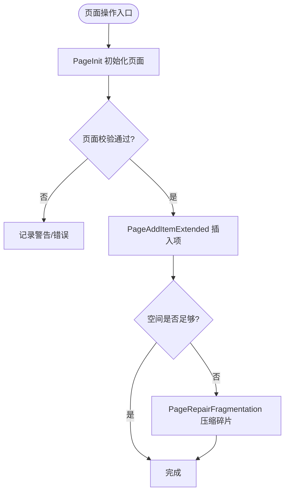
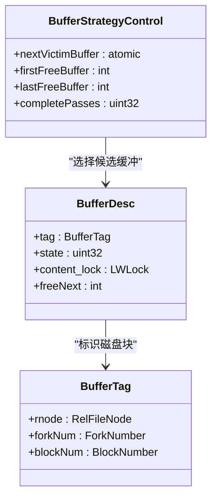
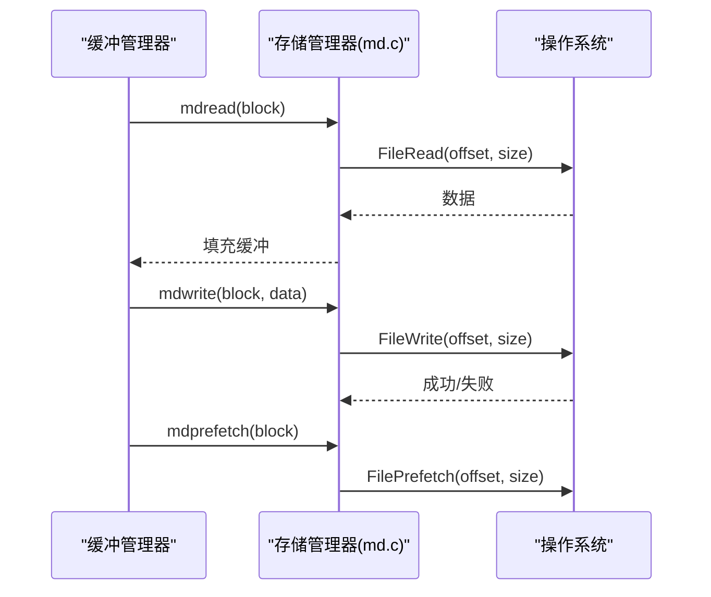
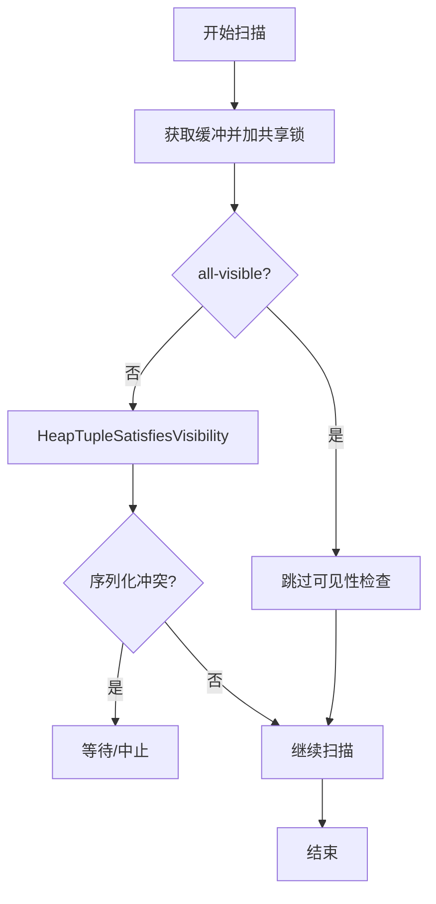
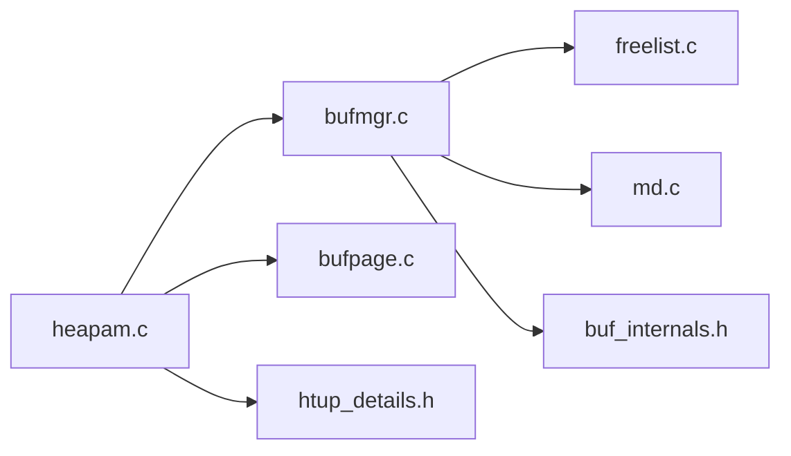

# 存储引擎

<cite>
**本文引用的文件**
- [heapam.c](file://src/backend/access/heap/heapam.c)
- [bufmgr.c](file://src/backend/storage/buffer/bufmgr.c)
- [freelist.c](file://src/backend/storage/buffer/freelist.c)
- [md.c](file://src/backend/storage/smgr/md.c)
- [bufpage.c](file://src/backend/storage/page/bufpage.c)
- [htup.h](file://src/include/access/htup.h)
- [htup_details.h](file://src/include/access/htup_details.h)
- [buf_internals.h](file://src/include/storage/buf_internals.h)
</cite>

## 目录
1. [简介](#简介)
2. [项目结构](#项目结构)
3. [核心组件](#核心组件)
4. [架构总览](#架构总览)
5. [详细组件分析](#详细组件分析)
6. [依赖关系分析](#依赖关系分析)
7. [性能考虑](#性能考虑)
8. [故障排查指南](#故障排查指南)
9. [结论](#结论)
10. [附录](#附录)

## 简介
本文件为 Mini PostgreSQL 的存储引擎提供全面文档，聚焦堆表存储、缓冲区管理、文件系统抽象层与并发控制。内容涵盖：
- 堆表元组存储格式、页面结构与空间管理
- 缓冲池算法（时钟扫描）、LRU 近似替换策略与脏页处理
- 文件系统抽象层接口与 I/O 优化（预取、批量回写）
- 存储层的并发控制机制与数据一致性保证
- 架构图、数据流图与性能调优建议

## 项目结构
Mini PostgreSQL 存储子系统位于 src/backend/storage 下，按职责划分为：
- buffer：共享缓冲池、局部缓冲、替换策略、缓冲表
- smgr：存储管理器抽象，磁盘实现 md.c
- page：页面初始化、校验、碎片整理等
- access/heap：堆访问方法，实现元组插入、更新、删除、扫描
- include/storage, include/access：关键头文件定义缓冲描述符、元组头等

**图示来源**
- [heapam.c:1-120](file://src/backend/access/heap/heapam.c#L1-L120)
- [bufmgr.c:1-120](file://src/backend/storage/buffer/bufmgr.c#L1-L120)
- [md.c:1-120](file://src/backend/storage/smgr/md.c#L1-L120)
- [bufpage.c:1-120](file://src/backend/storage/page/bufpage.c#L1-L120)
- [freelist.c:1-120](file://src/backend/storage/buffer/freelist.c#L1-L120)

**章节来源**
- [heapam.c:1-120](file://src/backend/access/heap/heapam.c#L1-L120)
- [bufmgr.c:1-120](file://src/backend/storage/buffer/bufmgr.c#L1-L120)
- [md.c:1-120](file://src/backend/storage/smgr/md.c#L1-L120)
- [bufpage.c:1-120](file://src/backend/storage/page/bufpage.c#L1-L120)
- [freelist.c:1-120](file://src/backend/storage/buffer/freelist.c#L1-L120)

## 核心组件
- 堆访问方法（heapam.c）：实现元组的插入、更新、删除、扫描与可见性判断，协调缓冲与文件系统。
- 缓冲区管理器（bufmgr.c）：提供 ReadBuffer/MarkBufferDirty 等接口，维护缓冲池、脏页标记、I/O 调度。
- 替换策略（freelist.c）：基于时钟扫描的近似 LRU 策略，选择可回收缓冲。
- 存储管理器（md.c）：将逻辑块映射到段文件，提供读写、扩展、预取、回写等能力。
- 页面管理（bufpage.c）：页面初始化、校验、碎片整理、行指针管理。
- 元组与缓冲内部结构（htup*.h, buf_internals.h）：定义 HeapTupleHeader、BufferDesc、BufferTag 等关键数据结构。

**章节来源**
- [heapam.c:1-120](file://src/backend/access/heap/heapam.c#L1-L120)
- [bufmgr.c:1-120](file://src/backend/storage/buffer/bufmgr.c#L1-L120)
- [freelist.c:1-120](file://src/backend/storage/buffer/freelist.c#L1-L120)
- [md.c:1-120](file://src/backend/storage/smgr/md.c#L1-L120)
- [bufpage.c:1-120](file://src/backend/storage/page/bufpage.c#L1-L120)
- [htup.h:1-90](file://src/include/access/htup.h#L1-L90)
- [htup_details.h:1-200](file://src/include/access/htup_details.h#L1-L200)
- [buf_internals.h:1-120](file://src/include/storage/buf_internals.h#L1-L120)

## 架构总览
下图展示从上层堆访问到磁盘文件的完整调用链，以及缓冲池在其中的作用。

**图示来源**
- [heapam.c:380-492](file://src/backend/access/heap/heapam.c#L380-L492)
- [bufmgr.c:742-759](file://src/backend/storage/buffer/bufmgr.c#L742-L759)
- [md.c:635-691](file://src/backend/storage/smgr/md.c#L635-L691)

## 详细组件分析

### 堆表存储：元组格式、页面结构与空间管理
- 元组头与可见性
  - 元组头包含事务信息（xmin/xmax/cmin/cmax/xvac）、t_ctid 链接、标志位与变长数据布局，支持 MVCC 可见性判断与更新链追踪。
- 页面布局与碎片整理
  - 页面通过 PageInit 初始化，PageIsVerifiedExtended 进行头部与校验和验证；PageAddItemExtended 负责插入项并维护 pd_lower/pd_upper；PageRepairFragmentation 在删除后压缩数据、回收间隙。
- 扫描与可见性
  - heapgetpage 加载页面并评估可见性，结合 all-visible 标志与快照检查，避免不必要的逐元组检查。

**图示来源**
- [bufpage.c:41-60](file://src/backend/storage/page/bufpage.c#L41-L60)
- [bufpage.c:87-163](file://src/backend/storage/page/bufpage.c#L87-L163)
- [bufpage.c:193-356](file://src/backend/storage/page/bufpage.c#L193-L356)
- [bufpage.c:708-800](file://src/backend/storage/page/bufpage.c#L708-L800)

**章节来源**
- [htup_details.h:50-200](file://src/include/access/htup_details.h#L50-L200)
- [bufpage.c:41-163](file://src/backend/storage/page/bufpage.c#L41-L163)
- [bufpage.c:193-356](file://src/backend/storage/page/bufpage.c#L193-L356)
- [bufpage.c:708-800](file://src/backend/storage/page/bufpage.c#L708-L800)
- [heapam.c:380-492](file://src/backend/access/heap/heapam.c#L380-L492)

### 缓冲区管理器：缓冲池、LRU 近似与脏页处理
- 缓冲描述符与状态
  - BufferDesc 包含 tag、state（refcount、usagecount、flags）、content_lock 等；state 使用原子位域减少锁竞争。
- 读取路径与统计
  - ReadBufferExtended 统一入口，命中时更新 pgstat 计数；ReadRecentBuffer 利用最近观察到的缓冲快速定位。
- 替换策略（时钟扫描）
  - freelist.c 维护 nextVictimBuffer 与 free list，StrategyGetBuffer 以时钟手推进选择候选缓冲；completePasses 用于同步后台进程。
- 脏页与回写
  - MarkBufferDirty 标记 BM_DIRTY；后台写进程与检查点触发 WritebackContext 合并 flush 请求，降低系统调用开销。

**图示来源**
- [buf_internals.h:136-193](file://src/include/storage/buf_internals.h#L136-L193)
- [buf_internals.h:91-119](file://src/include/storage/buf_internals.h#L91-L119)
- [freelist.c:29-61](file://src/backend/storage/buffer/freelist.c#L29-L61)

**章节来源**
- [buf_internals.h:29-119](file://src/include/storage/buf_internals.h#L29-L119)
- [bufmgr.c:742-759](file://src/backend/storage/buffer/bufmgr.c#L742-L759)
- [bufmgr.c:609-689](file://src/backend/storage/buffer/bufmgr.c#L609-L689)
- [freelist.c:107-186](file://src/backend/storage/buffer/freelist.c#L107-L186)

### 文件系统抽象层：文件操作接口与 I/O 优化
- 段文件组织
  - 关系由多个段文件组成，每个段固定大小；md.c 维护打开的文件描述符数组，按需打开/关闭。
- 读写与扩展
  - mdread/mdwrite/mdextend 分别处理读、写与扩展；mdextend 在 EOF 之后追加并处理短写错误。
- 预取与回写
  - mdprefetch 发起异步预取；mdwriteback 批量回写以减少系统调用；mdunlinkfork 安全删除或截断段文件。

**图示来源**
- [md.c:416-469](file://src/backend/storage/smgr/md.c#L416-L469)
- [md.c:635-691](file://src/backend/storage/smgr/md.c#L635-L691)
- [md.c:700-755](file://src/backend/storage/smgr/md.c#L700-L755)
- [md.c:558-578](file://src/backend/storage/smgr/md.c#L558-L578)
- [md.c:586-630](file://src/backend/storage/smgr/md.c#L586-L630)

**章节来源**
- [md.c:44-119](file://src/backend/storage/smgr/md.c#L44-L119)
- [md.c:416-469](file://src/backend/storage/smgr/md.c#L416-L469)
- [md.c:635-691](file://src/backend/storage/smgr/md.c#L635-L691)
- [md.c:700-755](file://src/backend/storage/smgr/md.c#L700-L755)
- [md.c:558-578](file://src/backend/storage/smgr/md.c#L558-L578)
- [md.c:586-630](file://src/backend/storage/smgr/md.c#L586-L630)

### 并发控制与一致性
- 缓冲内容锁
  - BufferDesc.content_lock 保护缓冲内容访问，配合 state 中的 BM_LOCKED 位减少锁粒度。
- 元组级锁与多事务状态
  - 堆访问层根据 LockTupleMode 映射到 MultiXactStatus，支持键共享/独占等强度，协调并发更新与锁定。
- 可见性与快照
  - 扫描过程中使用快照判断元组可见性，all-visible 标志可跳过逐元组检查；必要时等待冲突事务完成。

**图示来源**
- [heapam.c:416-492](file://src/backend/access/heap/heapam.c#L416-L492)
- [heapam.c:124-182](file://src/backend/access/heap/heapam.c#L124-L182)
- [buf_internals.h:136-193](file://src/include/storage/buf_internals.h#L136-L193)

**章节来源**
- [heapam.c:124-182](file://src/backend/access/heap/heapam.c#L124-L182)
- [heapam.c:416-492](file://src/backend/access/heap/heapam.c#L416-L492)
- [buf_internals.h:136-193](file://src/include/storage/buf_internals.h#L136-L193)

## 依赖关系分析
- 模块耦合
  - 堆访问层依赖缓冲管理与存储管理器；缓冲管理器依赖替换策略与文件系统；页面操作被堆访问层广泛使用。
- 外部依赖
  - 操作系统文件接口（FileRead/FileWrite/FilePrefetch），WAL/检查点（间接通过上层），统计接口（pgstat）。

**图示来源**
- [heapam.c:1-120](file://src/backend/access/heap/heapam.c#L1-L120)
- [bufmgr.c:1-120](file://src/backend/storage/buffer/bufmgr.c#L1-L120)
- [freelist.c:1-120](file://src/backend/storage/buffer/freelist.c#L1-L120)
- [md.c:1-120](file://src/backend/storage/smgr/md.c#L1-L120)
- [bufpage.c:1-120](file://src/backend/storage/page/bufpage.c#L1-L120)
- [buf_internals.h:1-120](file://src/include/storage/buf_internals.h#L1-L120)
- [htup_details.h:1-200](file://src/include/access/htup_details.h#L1-L200)

**章节来源**
- [heapam.c:1-120](file://src/backend/access/heap/heapam.c#L1-L120)
- [bufmgr.c:1-120](file://src/backend/storage/buffer/bufmgr.c#L1-L120)
- [freelist.c:1-120](file://src/backend/storage/buffer/freelist.c#L1-L120)
- [md.c:1-120](file://src/backend/storage/smgr/md.c#L1-L120)
- [bufpage.c:1-120](file://src/backend/storage/page/bufpage.c#L1-L120)
- [buf_internals.h:1-120](file://src/include/storage/buf_internals.h#L1-L120)
- [htup_details.h:1-200](file://src/include/access/htup_details.h#L1-L200)

## 性能考虑
- 缓冲池调优
  - 调整 NBuffers 与 BGWriter 参数，平衡命中率与回写延迟；关注 completePasses 与 numBufferAllocs 统计。
- I/O 优化
  - 启用预取（USE_PREFETCH）与批量回写（mdwriteback），减少系统调用次数；合理设置 effective_io_concurrency。
- 页面碎片
  - 定期执行清理与碎片整理，避免频繁移动数据；利用 all-visible 标志加速扫描。
- 可见性检查
  - 合理使用快照与 all-visible 标志，减少逐元组可见性判断开销。

[本节为通用指导，不直接分析具体文件]

## 故障排查指南
- 页面校验失败
  - PageIsVerifiedExtended 检测头部与校验和，若失败可记录警告或忽略（ignore_checksum_failure）；检查磁盘健康与 WAL 恢复流程。
- 短读/短写错误
  - mdread/mdwrite 对短读/短写进行处理，可能返回零填充或报错；检查磁盘空间与文件系统状态。
- 缓冲泄漏与死锁
  - 监控缓冲引用计数与 content_lock 持有时间；确保正确释放缓冲与解锁，避免长时间持有导致阻塞。

**章节来源**
- [bufpage.c:87-163](file://src/backend/storage/page/bufpage.c#L87-L163)
- [md.c:635-691](file://src/backend/storage/smgr/md.c#L635-L691)
- [md.c:700-755](file://src/backend/storage/smgr/md.c#L700-L755)
- [buf_internals.h:136-193](file://src/include/storage/buf_internals.h#L136-L193)

## 结论
Mini PostgreSQL 的存储引擎通过清晰的层次划分与高效的缓冲管理，实现了可靠的堆表存储与 I/O 优化。堆访问层与缓冲管理器协同工作，借助时钟扫描策略与批量回写提升吞吐；文件系统抽象层屏蔽底层差异并提供预取能力。通过合理的参数调优与维护策略，可在不同负载下获得稳定性能。

[本节为总结，不直接分析具体文件]

## 附录
- 关键数据结构参考
  - HeapTupleHeaderData：元组头与可见性字段
  - BufferDesc：缓冲描述符与状态位
  - BufferTag：缓冲标签（关系、分叉、块号）
- 常用接口参考
  - ReadBufferExtended、MarkBufferDirty、mdread/mdwrite/mdextend、PageInit/PageAddItemExtended/PageRepairFragmentation

[本节为补充信息，不直接分析具体文件]