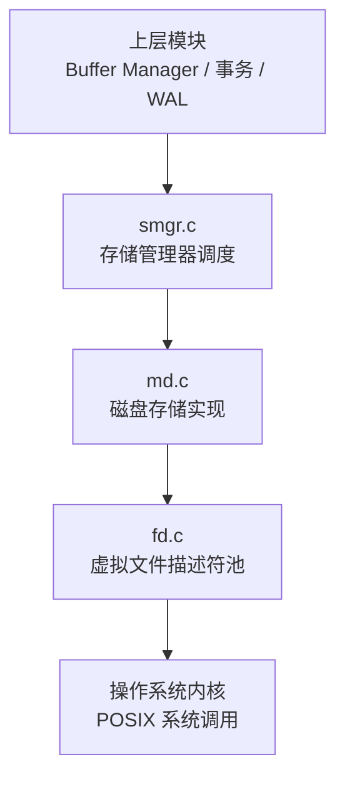
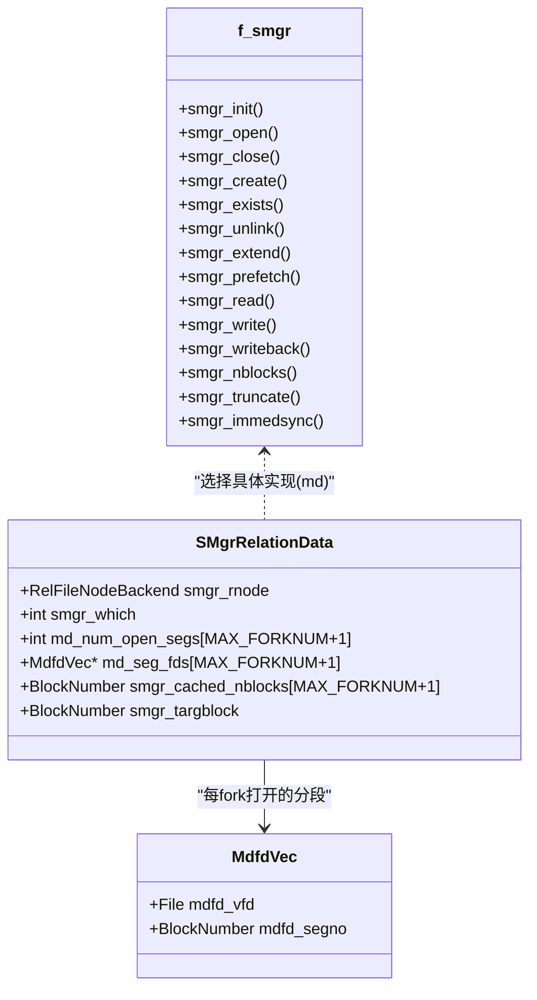
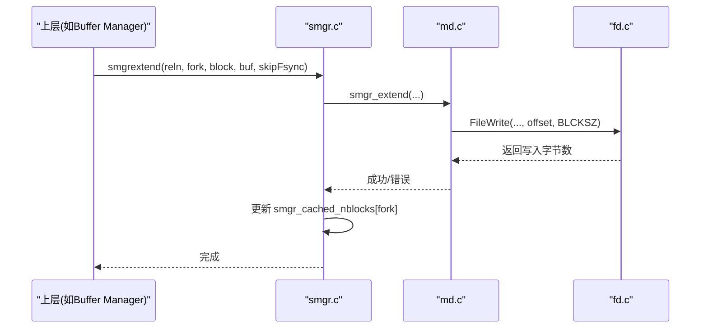
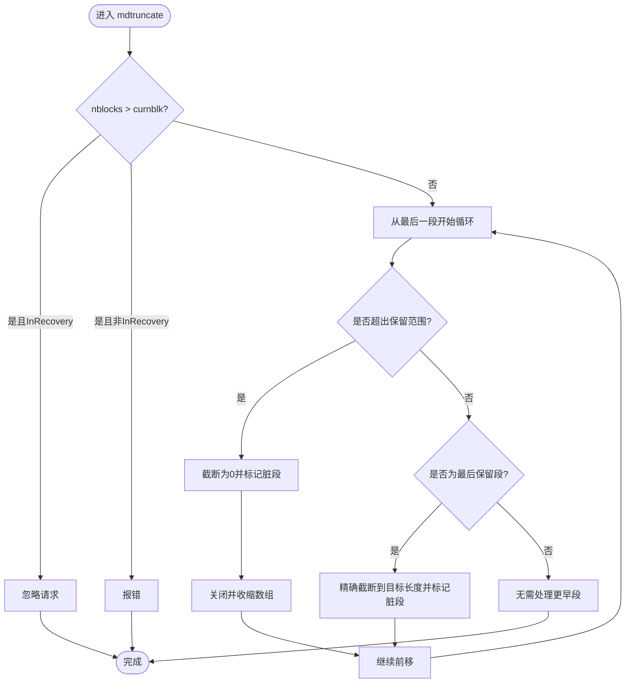
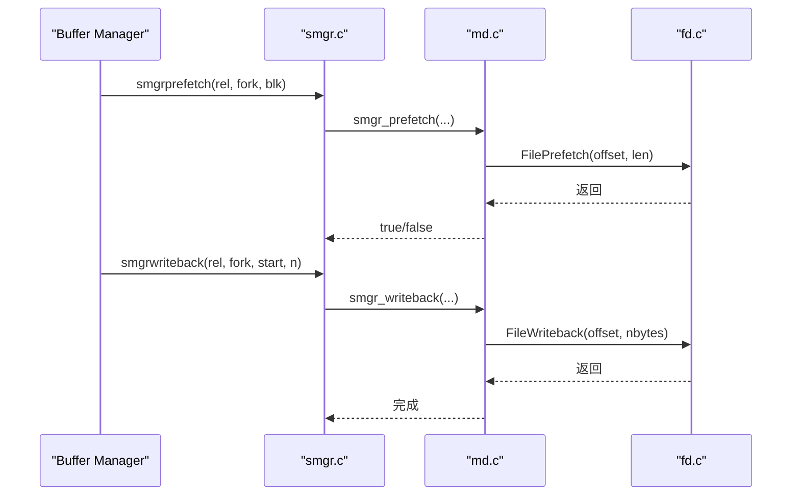
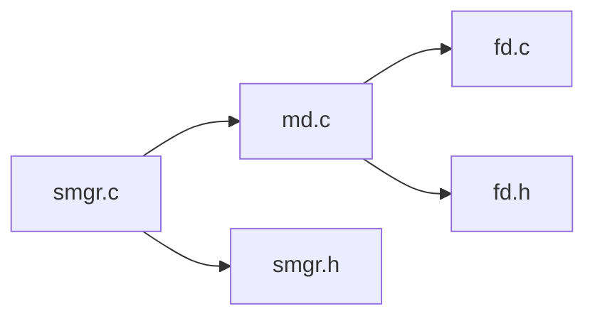

# 文件系统接口

<cite>
**本文档引用的文件**
- [smgr.c](file://src/backend/storage/smgr/smgr.c)
- [md.c](file://src/backend/storage/smgr/md.c)
- [smgr.h](file://src/include/storage/smgr.h)
- [fd.h](file://src/include/storage/fd.h)
- [fd.c](file://src/backend/storage/file/fd.c)
- [README](file://src/backend/storage/smgr/README)
</cite>

## 目录
1. [简介](#简介)
2. [项目结构](#项目结构)
3. [核心组件](#核心组件)
4. [架构总览](#架构总览)
5. [详细组件分析](#详细组件分析)
6. [依赖关系分析](#依赖关系分析)
7. [性能考虑](#性能考虑)
8. [故障排查指南](#故障排查指南)
9. [结论](#结论)
10. [附录](#附录)

## 简介
本文件面向 Mini PostgreSQL 的存储层文件系统抽象层（smgr），系统性阐述其设计架构与实现要点，重点覆盖：
- 文件句柄管理与 I/O 操作抽象（smgr 调度、md 磁盘实现）
- 大对象分段管理、异步预取与写回优化
- 错误处理与崩溃恢复机制（含 WAL 恢复路径下的行为差异）
- 平台适配层（POSIX 接口封装与虚拟文件描述符池）
- 架构图、I/O 流程图与性能优化建议

该文档旨在为存储层文件操作提供完整技术参考，帮助读者理解从高层 smgr 到内核 I/O 的调用链路与关键优化点。

## 项目结构
- smgr 层：对外暴露统一接口，维护 SMgrRelation 缓存表，按 fork 管理打开的分段文件句柄数组。
- md 层：基于 POSIX 文件系统的“磁盘中”存储管理器，负责分段文件（segment）的打开、读写、截断、同步等。
- fd 层：虚拟文件描述符（VFD）池与跨平台 I/O 封装，提供 FileRead/FileWrite/FileSync 等稳定接口。
- 头文件：定义 smgr 公共 API、fd 接口声明等。

图表来源
- [smgr.c:30-88](file://src/backend/storage/smgr/smgr.c#L30-L88)
- [md.c:44-80](file://src/backend/storage/smgr/md.c#L44-L80)
- [fd.c:12-70](file://src/backend/storage/file/fd.c#L12-L70)

章节来源
- [README:24-34](file://src/backend/storage/smgr/README#L24-L34)
- [smgr.h:21-75](file://src/include/storage/smgr.h#L21-L75)

## 核心组件
- SMgrRelationData：每个后端进程内的关系句柄缓存项，包含 rnode、fork 维度的打开分段数组、目标块号、缓存大小等。
- f_smgr：smgr 与各具体存储管理器（当前为 md）之间的函数指针表，屏蔽底层差异。
- MdfdVec：md 层对单个分段文件的句柄记录（虚拟 FD + 段号）。
- VFD（虚拟文件描述符）：fd.c 中的 LRU 池，统一管理真实 OS 文件描述符的分配与回收。

章节来源
- [smgr.h:39-75](file://src/include/storage/smgr.h#L39-L75)
- [smgr.c:40-88](file://src/backend/storage/smgr/smgr.c#L40-L88)
- [md.c:82-89](file://src/backend/storage/smgr/md.c#L82-L89)
- [fd.c:12-70](file://src/backend/storage/file/fd.c#L12-L70)

## 架构总览
smgr 通过函数指针表将上层请求分发到 md；md 以 RELSEG_SIZE 为单位将关系拆分为多个分段文件，按需打开并维护每 fork 的打开分段数组；所有实际 I/O 通过 fd.c 的 VFD 池进行，屏蔽平台差异并提供统一的 Read/Write/Sync/Truncate 等接口。

图表来源
- [smgr.h:39-75](file://src/include/storage/smgr.h#L39-L75)
- [md.c:82-89](file://src/backend/storage/smgr/md.c#L82-L89)
- [smgr.c:40-88](file://src/backend/storage/smgr/smgr.c#L40-L88)

## 详细组件分析

### smgr 调度与句柄缓存
- 职责：维护 SMgrRelation 哈希表，按 rnode 查找或创建条目；维护无主句柄链表用于事务结束清理；通过 f_smgr 表转发 I/O 请求。
- 关键点：
  - smgropen 初始化哈希表与 unowned 列表，设置默认 which=0（md）。
  - smgrextend 更新缓存 nblocks，失败时置 InvalidBlockNumber 强制下次探测。
  - smgrtruncate2 先发送共享失效消息，再执行截断，保证其他后端及时关闭旧句柄。
  - AtEOXact_SMgr 在事务提交/中止时关闭所有无主句柄，避免长期占用内核 FD。

图表来源
- [smgr.c:452-477](file://src/backend/storage/smgr/smgr.c#L452-L477)
- [md.c:416-469](file://src/backend/storage/smgr/md.c#L416-L469)
- [fd.h:82-94](file://src/include/storage/fd.h#L82-L94)

章节来源
- [smgr.c:140-189](file://src/backend/storage/smgr/smgr.c#L140-L189)
- [smgr.c:243-323](file://src/backend/storage/smgr/smgr.c#L243-L323)
- [smgr.c:585-670](file://src/backend/storage/smgr/smgr.c#L585-L670)
- [smgr.c:701-731](file://src/backend/storage/smgr/smgr.c#L701-L731)

### md 磁盘存储实现（分段文件、读写、截断、同步）
- 分段策略：关系被切分为固定大小的 segment 文件（RELSEG_SIZE 块），首个 segment 可能不满；inactive segments 保留零长度以避免已删除但仍有 FD 引用导致的数据错写。
- 打开与定位：_mdfd_getseg 根据 block 计算目标段号，必要时创建新段（EXTENSION_CREATE/RECOVERY），并维护每 fork 的打开段数组。
- 读/写：mdread/mdwrite 通过 FileRead/FileWrite 进行块级 I/O，短读/短写在不同场景下（zero_damaged_pages、InRecovery）有不同处理。
- 截断：mdtruncate 从尾部向前截断 inactive 段至零长度，最后一个 active 段精确截断；非主分支或临时关系直接 unlink。
- 同步：mdimmedsync 对所有 active/inactive 段执行 fsync；register_dirty_segment 将脏段登记到同步队列或由 checkpointer 处理。

图表来源
- [md.c:832-916](file://src/backend/storage/smgr/md.c#L832-L916)

章节来源
- [md.c:44-80](file://src/backend/storage/smgr/md.c#L44-L80)
- [md.c:416-469](file://src/backend/storage/smgr/md.c#L416-L469)
- [md.c:632-691](file://src/backend/storage/smgr/md.c#L632-L691)
- [md.c:700-755](file://src/backend/storage/smgr/md.c#L700-L755)
- [md.c:765-817](file://src/backend/storage/smgr/md.c#L765-L817)
- [md.c:918-971](file://src/backend/storage/smgr/md.c#L918-L971)
- [md.c:973-1003](file://src/backend/storage/smgr/md.c#L973-L1003)

### 异步 I/O 与写回优化
- 预取：mdprefetch 在支持 USE_PREFETCH 的平台调用 FilePrefetch，提前加载后续页到内核页缓存。
- 写回：mdwriteback 批量触发内核写回（pg_flush_data 或等价接口），减少系统调用次数，提高吞吐。
- 同步队列：register_dirty_segment 优先尝试将 fsync 请求转交给 checkpointer；若队列满则本地同步，确保可靠性。

图表来源
- [smgr.c:479-490](file://src/backend/storage/smgr/smgr.c#L479-L490)
- [md.c:556-578](file://src/backend/storage/smgr/md.c#L556-L578)
- [md.c:581-630](file://src/backend/storage/smgr/md.c#L581-L630)
- [fd.h:82-94](file://src/include/storage/fd.h#L82-L94)

章节来源
- [md.c:556-578](file://src/backend/storage/smgr/md.c#L556-L578)
- [md.c:581-630](file://src/backend/storage/smgr/md.c#L581-L630)
- [md.c:973-1003](file://src/backend/storage/smgr/md.c#L973-L1003)

### 错误处理与恢复机制
- 读取短读：当 zero_damaged_pages 开启或在 InRecovery 时，返回零填充缓冲；否则报数据损坏错误。
- 写入短写/扩展失败：报告磁盘空间不足或 I/O 错误。
- 删除与截断：非主分支或临时关系直接 unlink；主分支首段先截断为零并延迟删除，防止 relfilenode 重用冲突；WAL 恢复期间允许缺失文件存在。
- 同步失败：data_sync_elevel 控制错误级别，必要时重试或降级。

章节来源
- [md.c:632-691](file://src/backend/storage/smgr/md.c#L632-L691)
- [md.c:416-469](file://src/backend/storage/smgr/md.c#L416-L469)
- [md.c:279-405](file://src/backend/storage/smgr/md.c#L279-L405)
- [md.c:918-971](file://src/backend/storage/smgr/md.c#L918-L971)

### 平台适配层（POSIX 封装与 VFD 池）
- VFD 池：fd.c 维护 LRU 虚拟文件描述符池，限制最大安全 FD 数，避免 EMFILE；提供 PathNameOpenFile/FileRead/FileWrite/FileSync 等统一接口。
- 平台特性：通过宏检测 sync_file_range、MS_ASYNC、POSIX_FADVISE 等能力，决定 pg_flush_data 的实现方式。
- 临时文件与目录：提供临时文件/目录创建与删除接口，支持跨后端共享命名临时文件。

章节来源
- [fd.c:12-70](file://src/backend/storage/file/fd.c#L12-L70)
- [fd.c:102-163](file://src/backend/storage/file/fd.c#L102-L163)
- [fd.h:82-170](file://src/include/storage/fd.h#L82-L170)

## 依赖关系分析
- smgr 依赖 md 作为唯一存储管理器实现（当前 which=0）。
- md 依赖 fd 提供的 I/O 原语与路径/权限工具。
- smgr 与 md 通过 f_smgr 函数表松耦合，便于未来扩展新的存储后端。
- 事务边界通过 AtEOXact_SMgr 清理无主句柄，避免资源泄漏。

图表来源
- [smgr.c:30-88](file://src/backend/storage/smgr/smgr.c#L30-L88)
- [md.c:22-42](file://src/backend/storage/smgr/md.c#L22-L42)
- [fd.c:73-100](file://src/backend/storage/file/fd.c#L73-L100)

章节来源
- [smgr.c:30-88](file://src/backend/storage/smgr/smgr.c#L30-L88)
- [md.c:22-42](file://src/backend/storage/smgr/md.c#L22-L42)

## 性能考虑
- 分段 I/O 合并：mdwriteback 尽量以较少的系统调用批量触发内核写回，降低开销。
- 预取优化：USE_PREFETCH 启用后，mdprefetch 提前加载后续页，减少随机读延迟。
- 同步批量化：register_dirty_segment 将 fsync 请求集中交由 checkpointer 处理，减少阻塞。
- 句柄复用：SMgrRelation 缓存与每 fork 打开段数组减少频繁 open/close 成本。
- 参数调优：max_files_per_process、data_sync_retry、recovery_init_sync_method 等影响并发与稳定性。

[本节为通用性能指导，不直接分析具体代码行]

## 故障排查指南
- 读取短读：检查 zero_damaged_pages 配置与 InRecovery 状态；确认是否存在截断后的访问。
- 写入失败：关注磁盘空间、文件系统权限与 I/O 错误码；核对 skipFsync 使用场景。
- 截断异常：确认调用方持有足够锁并在临界区外获取 old size；检查 InRecovery 下 nblocks 合法性。
- 同步失败：查看 data_sync_retry 与 data_sync_elevel；必要时提升日志级别定位具体文件与段号。

章节来源
- [md.c:632-691](file://src/backend/storage/smgr/md.c#L632-L691)
- [md.c:416-469](file://src/backend/storage/smgr/md.c#L416-L469)
- [md.c:832-916](file://src/backend/storage/smgr/md.c#L832-L916)
- [md.c:918-971](file://src/backend/storage/smgr/md.c#L918-L971)

## 结论
Mini PostgreSQL 的 smgr 层通过清晰的调度与缓存机制，结合 md 的分段文件模型与 fd 的 VFD 池，实现了高效、可移植的文件系统抽象。其在 WAL 恢复、错误处理与同步策略上提供了稳健保障，并通过预取与写回批量化等手段优化了 I/O 性能。对于扩展新的存储后端或进一步优化 I/O 路径，该架构具备良好的可扩展性与可维护性。

## 附录
- 关系分叉（Fork）：一个 smgr relation 可由多个物理文件组成（如 FSM、VM 等），各 fork 独立增长与截断，但逻辑上视为单一关系。
- 分段大小：RELSEG_SIZE 决定了单段文件大小上限，避免超过 OS 文件尺寸限制。
- 临时关系：不参与 fsync，删除策略更宽松，生命周期由事务/子事务管理。

章节来源
- [README:37-53](file://src/backend/storage/smgr/README#L37-L53)
- [md.c:44-80](file://src/backend/storage/smgr/md.c#L44-L80)