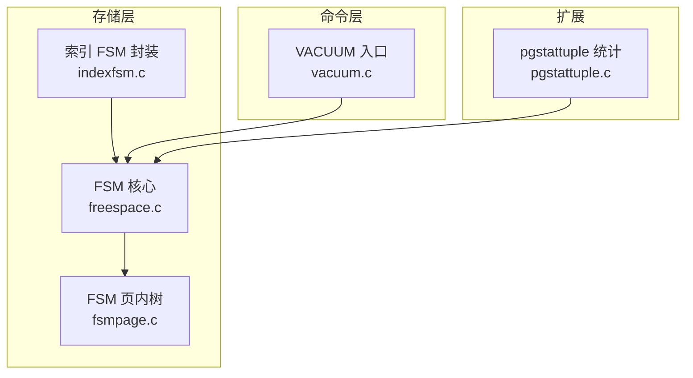
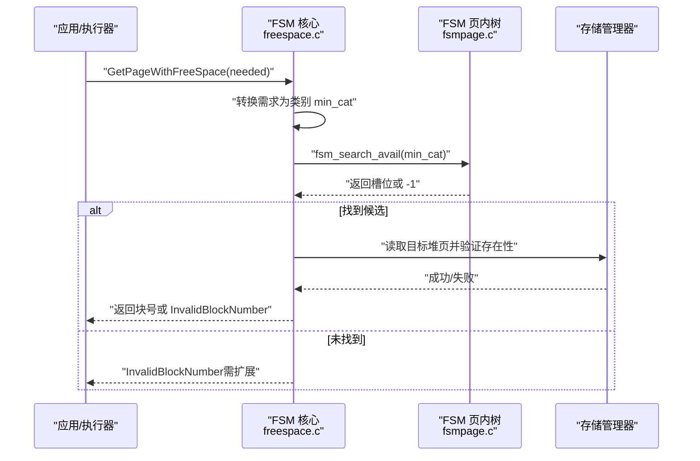
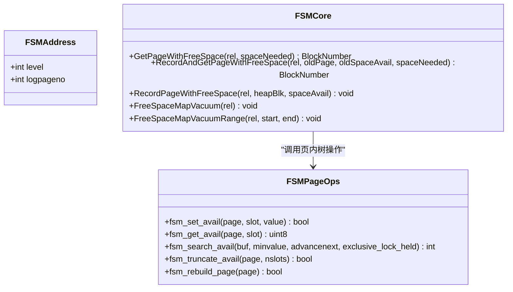
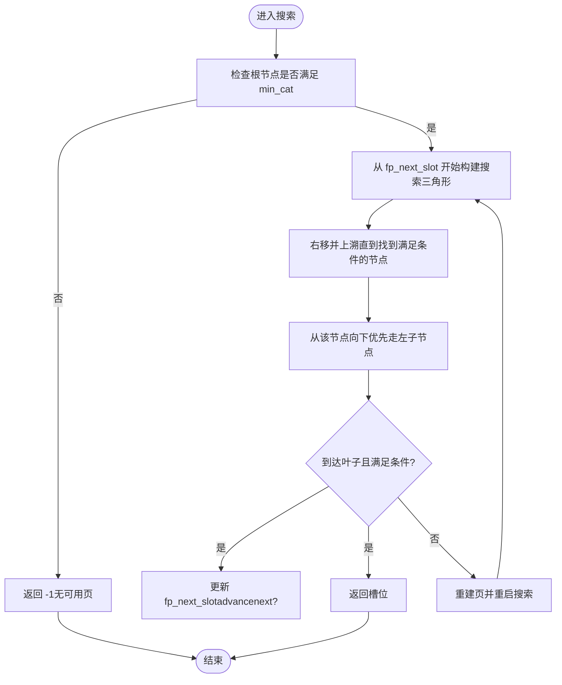
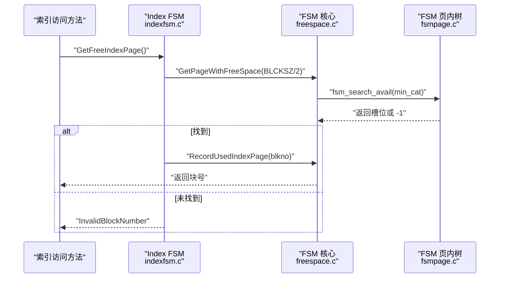
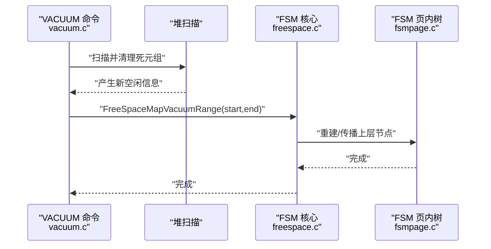
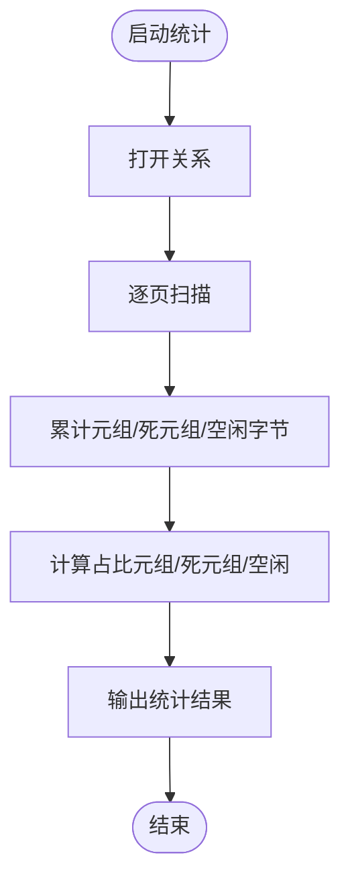
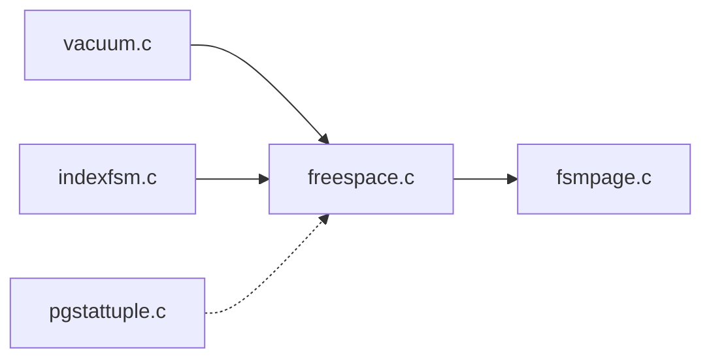

# 空间管理

<cite>
**本文引用的文件**
- [src/backend/storage/freespace/README](file://src/backend/storage/freespace/README)
- [src/backend/storage/freespace/freespace.c](file://src/backend/storage/freespace/freespace.c)
- [src/backend/storage/freespace/fsmpage.c](file://src/backend/storage/freespace/fsmpage.c)
- [src/backend/storage/freespace/indexfsm.c](file://src/backend/storage/freespace/indexfsm.c)
- [src/backend/commands/vacuum.c](file://src/backend/commands/vacuum.c)
- [contrib/pgstattuple/pgstattuple.c](file://contrib/pgstattuple/pgstattuple.c)
</cite>

## 目录
1. [简介](#简介)
2. [项目结构](#项目结构)
3. [核心组件](#核心组件)
4. [架构总览](#架构总览)
5. [详细组件分析](#详细组件分析)
6. [依赖关系分析](#依赖关系分析)
7. [性能考量](#性能考量)
8. [故障排查指南](#故障排查指南)
9. [结论](#结论)
10. [附录：容量规划与优化建议](#附录：容量规划与优化建议)

## 简介
本文件为 Mini PostgreSQL 的空间管理系统提供全面技术文档，重点围绕自由空间映射（Free Space Map, FSM）的设计原理、页面级与索引级的空闲跟踪机制、空闲空间分配算法（最佳匹配与首次适应策略）、空间回收流程（VACUUM 与死元组清理）、以及空间统计信息的维护（表膨胀监控与增长预测）。文档包含架构图、分配流程图与容量规划指南，旨在为存储层空间优化提供完整参考。

## 项目结构
Mini PostgreSQL 的 FSM 实现位于 storage/freespace 目录下，包含通用 FSM 逻辑、页内树操作与索引专用封装；VACUUM 命令入口在 commands/vacuum.c；空间统计通过 contrib/pgstattuple 暴露。

图表来源
- [src/backend/storage/freespace/freespace.c:117-203](file://src/backend/storage/freespace/freespace.c#L117-L203)
- [src/backend/storage/freespace/fsmpage.c:145-306](file://src/backend/storage/freespace/fsmpage.c#L145-L306)
- [src/backend/storage/freespace/indexfsm.c:32-74](file://src/backend/storage/freespace/indexfsm.c#L32-L74)
- [src/backend/commands/vacuum.c:94-200](file://src/backend/commands/vacuum.c#L94-L200)
- [contrib/pgstattuple/pgstattuple.c:48-147](file://contrib/pgstattuple/pgstattuple.c#L48-L147)

章节来源
- [src/backend/storage/freespace/README:1-207](file://src/backend/storage/freespace/README#L1-L207)
- [src/backend/storage/freespace/freespace.c:117-203](file://src/backend/storage/freespace/freespace.c#L117-L203)
- [src/backend/storage/freespace/fsmpage.c:145-306](file://src/backend/storage/freespace/fsmpage.c#L145-L306)
- [src/backend/storage/freespace/indexfsm.c:32-74](file://src/backend/storage/freespace/indexfsm.c#L32-L74)
- [src/backend/commands/vacuum.c:94-200](file://src/backend/commands/vacuum.c#L94-L200)
- [contrib/pgstattuple/pgstattuple.c:48-147](file://contrib/pgstattuple/pgstattuple.c#L48-L147)

## 核心组件
- FSM 核心（freespace.c）：提供按块号查找可用页面的 API、更新 FSM 条目、截断与真空传播等能力。
- FSM 页内树（fsmpage.c）：实现单页内的二叉树结构，支持设置空闲类别、搜索满足最小需求的槽位、重建与截断。
- 索引 FSM（indexfsm.c）：复用堆 FSM 实现，仅记录“完全空闲/已用”状态，用于索引页分配。
- VACUUM（vacuum.c）：命令入口，协调清理与空间信息回传至 FSM 上层节点。
- pgstattuple（pgstattuple.c）：扫描表/索引页，统计元组长度、死元组比例与可用空间，辅助膨胀监控。

章节来源
- [src/backend/storage/freespace/freespace.c:117-203](file://src/backend/storage/freespace/freespace.c#L117-L203)
- [src/backend/storage/freespace/fsmpage.c:57-113](file://src/backend/storage/freespace/fsmpage.c#L57-L113)
- [src/backend/storage/freespace/indexfsm.c:32-74](file://src/backend/storage/freespace/indexfsm.c#L32-L74)
- [src/backend/commands/vacuum.c:94-200](file://src/backend/commands/vacuum.c#L94-L200)
- [contrib/pgstattuple/pgstattuple.c:48-147](file://contrib/pgstattuple/pgstattuple.c#L48-L147)

## 架构总览
FSM 采用分层树结构：根页在最底层物理块 0，每层页内以数组形式存储二叉树；叶子节点对应堆或索引页的空闲类别，非叶子节点保存子节点最大值。该设计使得快速判断是否存在足够空闲空间并定位候选页成为可能。

图表来源
- [src/backend/storage/freespace/freespace.c:135-141](file://src/backend/storage/freespace/freespace.c#L135-L141)
- [src/backend/storage/freespace/fsmpage.c:145-306](file://src/backend/storage/freespace/fsmpage.c#L145-L306)

章节来源
- [src/backend/storage/freespace/README:26-139](file://src/backend/storage/freespace/README#L26-L139)
- [src/backend/storage/freespace/freespace.c:135-141](file://src/backend/storage/freespace/freespace.c#L135-L141)
- [src/backend/storage/freespace/fsmpage.c:145-306](file://src/backend/storage/freespace/fsmpage.c#L145-L306)

## 详细组件分析

### 自由空间映射（FSM）设计与数据结构
- 粒度与分类：每个堆页用一个字节表示空闲量，分为 256 个类别；最大类别代表至少 MaxHeapTupleSize 的空闲。
- 树结构与层级：页内二叉树，父节点值为子节点最大值；跨页形成多层树，根页固定于物理块 0。
- 地址与寻址：逻辑地址由 level、logpageno、slot 组成；提供逻辑到物理块号的转换函数。
- 并发与恢复：搜索使用共享锁，更新使用独占锁；FSM 不显式 WAL 日志，依靠自修复与 VACUUM 传播修正。

图表来源
- [src/backend/storage/freespace/freespace.c:117-203](file://src/backend/storage/freespace/freespace.c#L117-L203)
- [src/backend/storage/freespace/fsmpage.c:57-113](file://src/backend/storage/freespace/fsmpage.c#L57-L113)
- [src/backend/storage/freespace/fsmpage.c:145-306](file://src/backend/storage/freespace/fsmpage.c#L145-L306)

章节来源
- [src/backend/storage/freespace/README:1-207](file://src/backend/storage/freespace/README#L1-L207)
- [src/backend/storage/freespace/freespace.c:117-203](file://src/backend/storage/freespace/freespace.c#L117-L203)
- [src/backend/storage/freespace/fsmpage.c:57-113](file://src/backend/storage/freespace/fsmpage.c#L57-L113)

### 空闲空间分配算法：最佳匹配与首次适应
- 类别化搜索：将需求转换为类别 min_cat，从根开始沿满足条件的路径下探，优先选择左子节点（若两者均满足），体现“最佳匹配”倾向。
- 起始点优化：使用 fp_next_slot 作为下一次搜索起点，避免热点竞争并提升顺序预取效果，体现“首次适应”思想。
- 容错与重建：若发现不一致（如父节点承诺但子节点不足），触发重建并重启搜索，确保一致性。

图表来源
- [src/backend/storage/freespace/fsmpage.c:145-306](file://src/backend/storage/freespace/fsmpage.c#L145-L306)

章节来源
- [src/backend/storage/freespace/fsmpage.c:145-306](file://src/backend/storage/freespace/fsmpage.c#L145-L306)

### 页面级与索引级空间跟踪
- 页面级（堆）：FSM 记录每个堆页的空闲类别，供插入时快速定位合适页面。
- 索引级：indexfsm.c 复用堆 FSM，仅区分“完全空闲”与“已用”，通过 RecordUsedIndexPage/RecordFreeIndexPage 标记状态，并使用 GetPageWithFreeSpace 获取空闲页。

图表来源
- [src/backend/storage/freespace/indexfsm.c:32-74](file://src/backend/storage/freespace/indexfsm.c#L32-L74)
- [src/backend/storage/freespace/freespace.c:135-141](file://src/backend/storage/freespace/freespace.c#L135-L141)
- [src/backend/storage/freespace/fsmpage.c:145-306](file://src/backend/storage/freespace/fsmpage.c#L145-L306)

章节来源
- [src/backend/storage/freespace/indexfsm.c:32-74](file://src/backend/storage/freespace/indexfsm.c#L32-L74)
- [src/backend/storage/freespace/freespace.c:135-141](file://src/backend/storage/freespace/freespace.c#L135-L141)

### 空间回收过程：VACUUM 与死元组清理
- VACUUM 入口：vacuum.c 解析参数并调度实际清理流程。
- FSM 更新：VACUUM 遍历堆页后调用 FreeSpaceMapVacuum/Range，将底层空闲信息向上层传播，修正不一致。
- 截断处理：FreeSpaceMapPrepareTruncateRel 负责在关系缩小时清理尾部 FSM 槽位并调整上层节点。

图表来源
- [src/backend/commands/vacuum.c:94-200](file://src/backend/commands/vacuum.c#L94-L200)
- [src/backend/storage/freespace/freespace.c:359-392](file://src/backend/storage/freespace/freespace.c#L359-L392)
- [src/backend/storage/freespace/fsmpage.c:337-374](file://src/backend/storage/freespace/fsmpage.c#L337-L374)

章节来源
- [src/backend/commands/vacuum.c:94-200](file://src/backend/commands/vacuum.c#L94-L200)
- [src/backend/storage/freespace/freespace.c:359-392](file://src/backend/storage/freespace/freespace.c#L359-L392)
- [src/backend/storage/freespace/fsmpage.c:337-374](file://src/backend/storage/freespace/fsmpage.c#L337-L374)

### 空间统计信息的维护：表膨胀监控与增长预测
- pgstattuple：扫描表/索引页，统计表长度、元组数量与长度、死元组数量与长度、可用空间及百分比，帮助识别膨胀与碎片。
- 结合 FSM：通过 FSM 记录的可用空间类别与 pgstattuple 的实际空闲字节对比，可评估估算偏差与趋势。

图表来源
- [contrib/pgstattuple/pgstattuple.c:48-147](file://contrib/pgstattuple/pgstattuple.c#L48-L147)

章节来源
- [contrib/pgstattuple/pgstattuple.c:48-147](file://contrib/pgstattuple/pgstattuple.c#L48-L147)

## 依赖关系分析
- freespace.c 依赖 fsmpage.c 提供的页内树操作，并通过 smgr/bufmgr 进行缓冲与持久化。
- indexfsm.c 复用 freespace.c 的公共接口，屏蔽索引场景的特殊语义。
- vacuum.c 驱动 FSM 上层节点更新，确保一致性。
- pgstattuple.c 独立扫描，提供观测数据，间接影响运维决策。

图表来源
- [src/backend/commands/vacuum.c:94-200](file://src/backend/commands/vacuum.c#L94-L200)
- [src/backend/storage/freespace/freespace.c:117-203](file://src/backend/storage/freespace/freespace.c#L117-L203)
- [src/backend/storage/freespace/fsmpage.c:145-306](file://src/backend/storage/freespace/fsmpage.c#L145-L306)
- [src/backend/storage/freespace/indexfsm.c:32-74](file://src/backend/storage/freespace/indexfsm.c#L32-L74)
- [contrib/pgstattuple/pgstattuple.c:48-147](file://contrib/pgstattuple/pgstattuple.c#L48-L147)

章节来源
- [src/backend/storage/freespace/freespace.c:117-203](file://src/backend/storage/freespace/freespace.c#L117-L203)
- [src/backend/storage/freespace/fsmpage.c:145-306](file://src/backend/storage/freespace/fsmpage.c#L145-L306)
- [src/backend/storage/freespace/indexfsm.c:32-74](file://src/backend/storage/freespace/indexfsm.c#L32-L74)
- [src/backend/commands/vacuum.c:94-200](file://src/backend/commands/vacuum.c#L94-L200)
- [contrib/pgstattuple/pgstattuple.c:48-147](file://contrib/pgstattuple/pgstattuple.c#L48-L147)

## 性能考量
- 搜索复杂度：基于页内二叉树的搜索近似 O(log N)，配合 fp_next_slot 减少重复扫描。
- 锁粒度：搜索阶段使用共享锁，更新阶段使用独占锁，降低并发冲突。
- 自修复：检测到不一致时重建页，避免错误传播；使用 RBM_ZERO_ON_ERROR 容忍损坏页。
- 扩展开销：FSM 扩展使用关系扩展锁，保证一致性；扩展频率较低，对整体性能影响有限。

[本节为一般性指导，无需特定文件引用]

## 故障排查指南
- 搜索不到可用页：检查根节点最大值是否低于需求类别；确认 fp_next_slot 是否越界或被重置。
- 返回块不存在：当候选块超出关系末尾时，FSM 会将对应槽位置零并重启搜索；关注 fsm_does_block_exist 的路径。
- 页不一致：若父节点承诺但子节点不足，触发重建；查看调试日志中关于修复损坏块的提示。
- VACUUM 未生效：确认是否调用了 FreeSpaceMapVacuum/Range；检查底层页是否已正确更新。

章节来源
- [src/backend/storage/freespace/freespace.c:732-800](file://src/backend/storage/freespace/freespace.c#L732-L800)
- [src/backend/storage/freespace/fsmpage.c:240-289](file://src/backend/storage/freespace/fsmpage.c#L240-L289)
- [src/backend/storage/freespace/freespace.c:359-392](file://src/backend/storage/freespace/freespace.c#L359-L392)

## 结论
Mini PostgreSQL 的 FSM 通过类别化与分层树结构实现了高效的空间定位与更新，结合 VACUUM 的周期性传播与自修复机制，保证了在高并发与异常场景下的稳定性。配合 pgstattuple 的统计能力，可为容量规划与膨胀治理提供可靠依据。

[本节为总结性内容，无需特定文件引用]

## 附录：容量规划与优化建议
- 合理设置 BLCKSZ 与 FSM 层级：默认 BLCKSZ 下三层即可覆盖 2^32 块范围；根据实际数据规模评估是否需要调整。
- 控制请求大小：MaxFSMRequestSize 决定最高类别阈值；过大请求可能导致无法命中，应结合业务元组大小调优。
- 定期 VACUUM：确保底层空闲信息及时上传至上层节点，避免长期不一致导致分配效率下降。
- 监控膨胀：使用 pgstattuple 观察死元组比例与空闲占比，结合 FSM 类别分布判断碎片程度。
- 索引页分配：索引 FSM 仅记录完全空闲/已用，适合高吞吐索引写入；必要时调整索引填充因子以减少分裂。

[本节为一般性指导，无需特定文件引用]