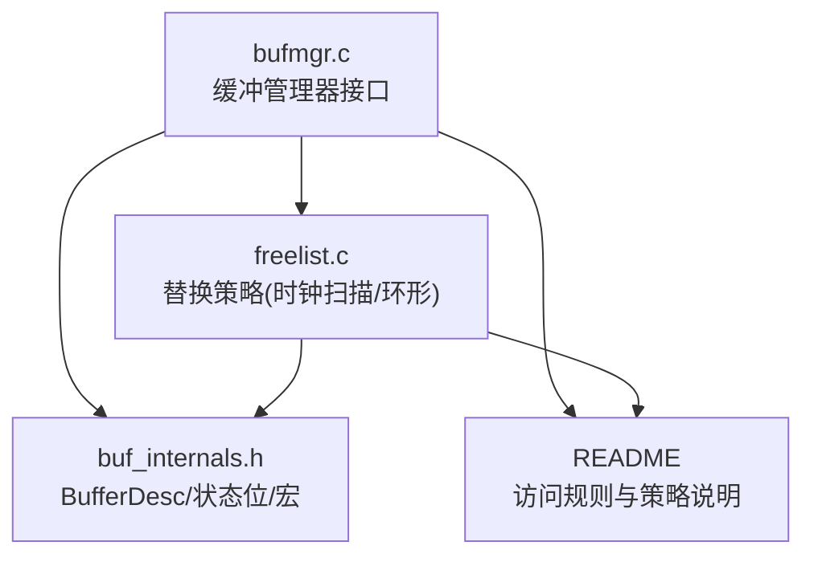
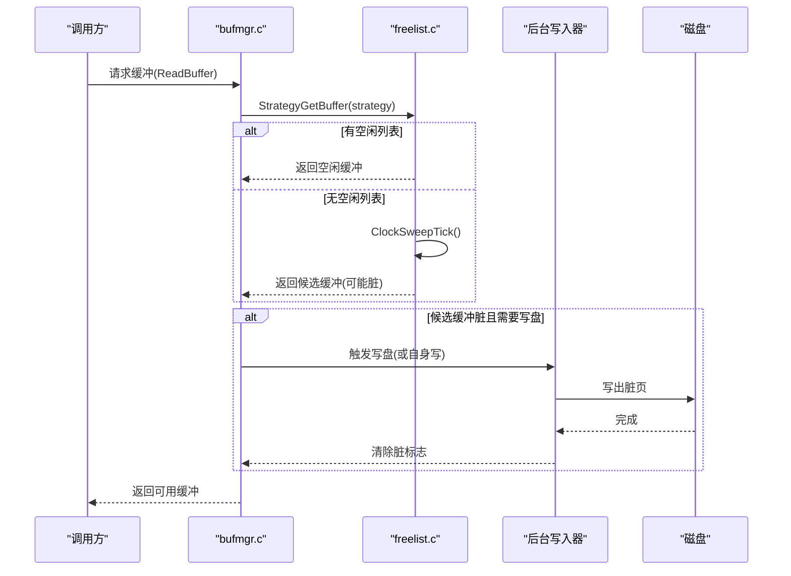
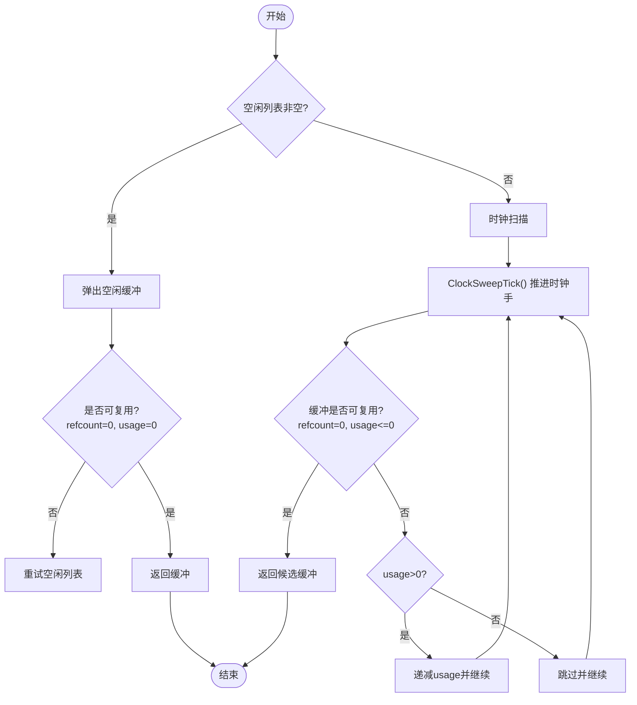
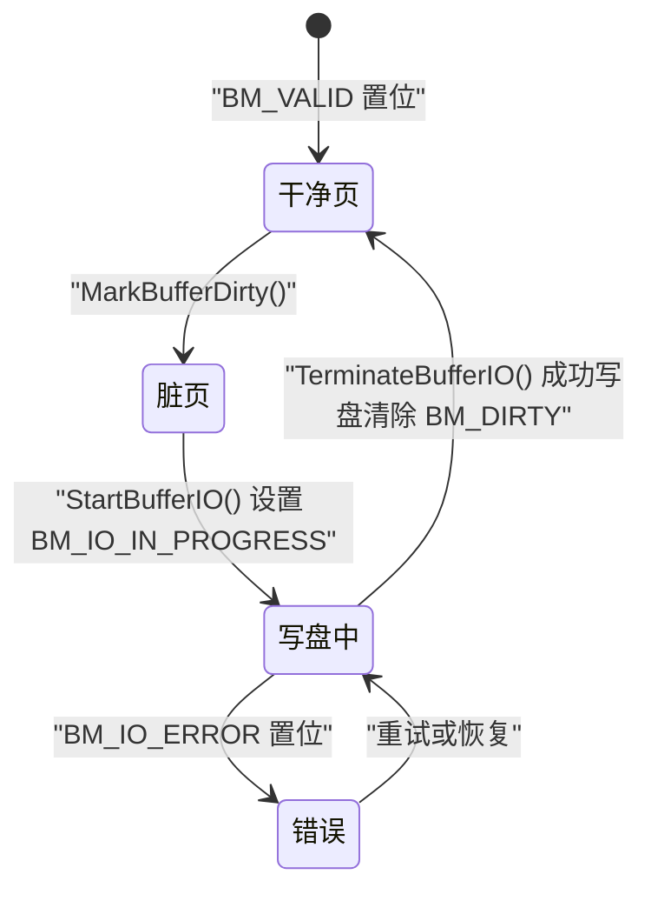
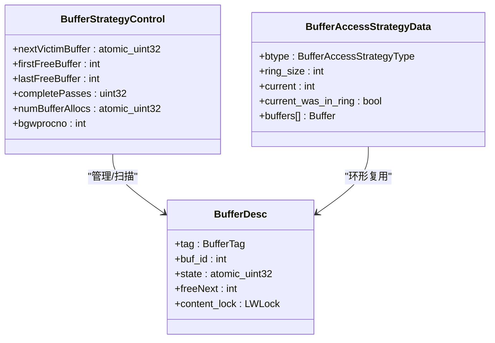
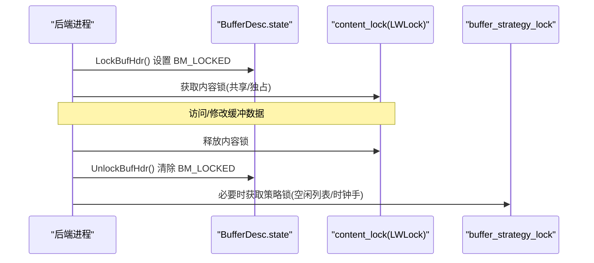
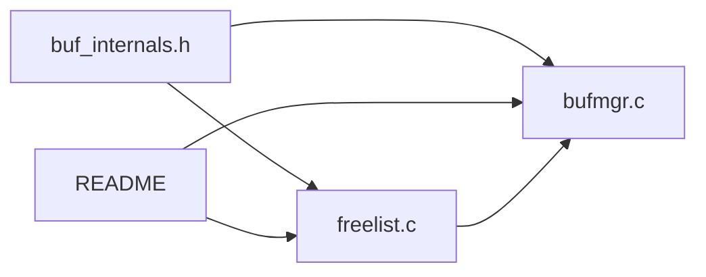

# LRU替换算法

<cite>
**本文引用的文件**
- [src/backend/storage/buffer/README](file://src/backend/storage/buffer/README)
- [src/backend/storage/buffer/freelist.c](file://src/backend/storage/buffer/freelist.c)
- [src/backend/storage/buffer/bufmgr.c](file://src/backend/storage/buffer/bufmgr.c)
- [src/include/storage/buf_internals.h](file://src/include/storage/buf_internals.h)
</cite>

## 目录
1. [简介](#简介)
2. [项目结构](#项目结构)
3. [核心组件](#核心组件)
4. [架构总览](#架构总览)
5. [详细组件分析](#详细组件分析)
6. [依赖关系分析](#依赖关系分析)
7. [性能考量](#性能考量)
8. [故障排查指南](#故障排查指南)
9. [结论](#结论)
10. [附录](#附录)

## 简介
本技术文档围绕 Mini PostgreSQL 的缓冲池 LRU 替换算法，系统性阐述时钟扫描（Clock Sweep）算法的实现原理、缓冲区链表管理、状态转换机制（脏页与干净页）、最近最少使用（LRU）近似策略的具体实现、并发环境下的锁机制与竞争避免策略，以及性能分析与调优参数、监控指标。目标是提供一份从代码到实践完整的缓冲池替换策略技术指南。

## 项目结构
Mini PostgreSQL 的缓冲池与替换策略主要位于 storage/buffer 目录下：
- freelist.c：负责空闲列表与替换策略（时钟扫描、环形策略）。
- bufmgr.c：缓冲管理器接口，包含脏页标记、I/O 生命周期、锁与状态操作等。
- README：缓冲访问规则与替换策略说明。
- include/storage/buf_internals.h：缓冲描述符、状态位、宏定义等内部接口。

**图表来源**
- [src/backend/storage/buffer/freelist.c:189-358](file://src/backend/storage/buffer/freelist.c#L189-L358)
- [src/backend/storage/buffer/bufmgr.c:1547-1603](file://src/backend/storage/buffer/bufmgr.c#L1547-L1603)
- [src/include/storage/buf_internals.h:29-78](file://src/include/storage/buf_internals.h#L29-L78)
- [src/backend/storage/buffer/README:155-216](file://src/backend/storage/buffer/README#L155-L216)

**章节来源**
- [src/backend/storage/buffer/README:1-153](file://src/backend/storage/buffer/README#L1-L153)
- [src/backend/storage/buffer/freelist.c:1-105](file://src/backend/storage/buffer/freelist.c#L1-L105)
- [src/backend/storage/buffer/bufmgr.c:1-60](file://src/backend/storage/buffer/bufmgr.c#L1-L60)
- [src/include/storage/buf_internals.h:1-78](file://src/include/storage/buf_internals.h#L1-L78)

## 核心组件
- 缓冲描述符 BufferDesc：集中保存缓冲的状态（引用计数、使用计数、标志位）、内容锁、空闲链表指针等。
- 策略控制 BufferStrategyControl：维护全局时钟手 nextVictimBuffer、空闲列表头尾、统计信息、后台写入器通知等。
- 缓冲管理器 bufmgr：提供 ReadBuffer/ReleaseBuffer/MarkBufferDirty 等接口，协调 I/O 与状态变更。
- 替换策略 freelist：实现空闲列表管理与时钟扫描选择候选缓冲，支持环形策略优化批量访问。

关键数据结构与职责：
- BufferDesc.state：32位原子变量，组合 refcount（18位）、usagecount（4位）、flags（10位），用于无锁或CAS更新。
- BM_* 标志位：BM_DIRTY、BM_VALID、BM_IO_IN_PROGRESS、BM_LOCKED、BM_JUST_DIRTIED、BM_CHECKPOINT_NEEDED 等。
- StrategyGetBuffer：主入口，优先从空闲列表取缓冲，否则执行时钟扫描。
- ClockSweepTick：原子推进时钟手并处理回绕，统计完整周期。
- MarkBufferDirty：将缓冲标记为脏，并更新统计与成本平衡。

**章节来源**
- [src/include/storage/buf_internals.h:29-78](file://src/include/storage/buf_internals.h#L29-L78)
- [src/include/storage/buf_internals.h:136-193](file://src/include/storage/buf_internals.h#L136-L193)
- [src/backend/storage/buffer/freelist.c:26-61](file://src/backend/storage/buffer/freelist.c#L26-L61)
- [src/backend/storage/buffer/freelist.c:189-358](file://src/backend/storage/buffer/freelist.c#L189-L358)
- [src/backend/storage/buffer/bufmgr.c:1547-1603](file://src/backend/storage/buffer/bufmgr.c#L1547-L1603)

## 架构总览
下图展示了缓冲池替换的核心流程：请求缓冲时先尝试空闲列表，若为空则启动时钟扫描；找到候选后检查是否可复用（未锁定、引用计数为零、使用计数为零或低值）；若脏页需写盘，由后台写入器或当前进程完成；最终返回缓冲供上层使用。

**图表来源**
- [src/backend/storage/buffer/freelist.c:189-358](file://src/backend/storage/buffer/freelist.c#L189-L358)
- [src/backend/storage/buffer/bufmgr.c:1547-1603](file://src/backend/storage/buffer/bufmgr.c#L1547-L1603)
- [src/backend/storage/buffer/README:249-277](file://src/backend/storage/buffer/README#L249-L277)

## 详细组件分析

### 时钟算法与缓冲区链表管理
- 空闲列表：单链表维护完全空闲缓冲，头尾指针在 StrategyControl 中，受 buffer_strategy_lock 保护。
- 时钟手 nextVictimBuffer：原子递增，循环遍历缓冲数组，定位候选 victim。
- 选择策略：
  - 优先从空闲列表取缓冲；若不可用（被pin或usage_count>0），丢弃并继续。
  - 若无空闲缓冲，进入时钟扫描：逐个检查缓冲，若被pin则跳过；若usage_count>0则递减并继续；找到usage_count=0且未被pin的缓冲即选中。
- 回绕与统计：当 nextVictimBuffer 回绕时增加 completePasses，便于后台写入器同步。

**图表来源**
- [src/backend/storage/buffer/freelist.c:189-358](file://src/backend/storage/buffer/freelist.c#L189-L358)
- [src/backend/storage/buffer/freelist.c:112-169](file://src/backend/storage/buffer/freelist.c#L112-L169)

**章节来源**
- [src/backend/storage/buffer/README:155-216](file://src/backend/storage/buffer/README#L155-L216)
- [src/backend/storage/buffer/freelist.c:189-358](file://src/backend/storage/buffer/freelist.c#L189-L358)
- [src/backend/storage/buffer/freelist.c:112-169](file://src/backend/storage/buffer/freelist.c#L112-L169)

### 缓冲区状态转换机制（脏页与干净页）
- 脏页标记：MarkBufferDirty 设置 BM_DIRTY 与 BM_JUST_DIRTIED，并更新 VacuumPageDirty 与共享内存统计。
- I/O 生命周期：StartBufferIO 设置 BM_IO_IN_PROGRESS；TerminateBufferIO 清理 IO 标志，成功写盘时清除 BM_DIRTY/BM_CHECKPOINT_NEEDED（除非被重脏）。
- 干净页：BM_VALID 表示数据有效；读入完成后设置该标志。
- 后台写入器：从 nextVictimBuffer 位置扫描脏且未pin、usage_count=0 的缓冲，进行写盘，减轻前台压力。

**图表来源**
- [src/backend/storage/buffer/bufmgr.c:1547-1603](file://src/backend/storage/buffer/bufmgr.c#L1547-L1603)
- [src/backend/storage/buffer/bufmgr.c:4440-4486](file://src/backend/storage/buffer/bufmgr.c#L4440-L4486)
- [src/backend/storage/buffer/README:249-277](file://src/backend/storage/buffer/README#L249-L277)

**章节来源**
- [src/backend/storage/buffer/bufmgr.c:1547-1603](file://src/backend/storage/buffer/bufmgr.c#L1547-L1603)
- [src/backend/storage/buffer/bufmgr.c:4440-4486](file://src/backend/storage/buffer/bufmgr.c#L4440-L4486)
- [src/backend/storage/buffer/README:249-277](file://src/backend/storage/buffer/README#L249-L277)

### 缓冲区选择算法（LRU 近似）
- 使用计数 usage_count：每次 pin 缓冲时递增（上限 BM_MAX_USAGE_COUNT=5），作为“近期使用”的近似度量。
- 时钟扫描：遇到 usage_count>0 的缓冲则递减，模拟“淘汰较不常用”的 LRU 语义；真正 LRU 需要更复杂结构，此处以有限精度换取高性能。
- 环形策略（Ring）：针对一次性大扫描（如 VACUUM、顺序扫描）分配固定大小的缓冲环，减少破坏全局缓存；脏页处理不同（读模式丢弃，写模式允许 WAL flush 重用）。

**图表来源**
- [src/backend/storage/buffer/freelist.c:26-61](file://src/backend/storage/buffer/freelist.c#L26-L61)
- [src/include/storage/buf_internals.h:136-193](file://src/include/storage/buf_internals.h#L136-L193)
- [src/backend/storage/buffer/freelist.c:71-97](file://src/backend/storage/buffer/freelist.c#L71-L97)

**章节来源**
- [src/backend/storage/buffer/freelist.c:189-358](file://src/backend/storage/buffer/freelist.c#L189-L358)
- [src/backend/storage/buffer/freelist.c:536-588](file://src/backend/storage/buffer/freelist.c#L536-L588)
- [src/include/storage/buf_internals.h:70-78](file://src/include/storage/buf_internals.h#L70-L78)

### 并发锁机制与竞争避免
- 缓冲头自旋锁与状态位：BufferDesc.state 中的 BM_LOCKED 标志与 LockBufHdr/UnlockBufHdr 配合，保证对 header 的原子访问。
- 内容锁 content_lock：LWLock，保护缓冲数据访问，支持共享/独占模式。
- 策略锁 buffer_strategy_lock：系统级自旋锁，保护空闲列表与时钟手，避免全局竞争。
- I/O 等待：BM_IO_IN_PROGRESS 标志与条件变量，等待 I/O 完成。
- 竞争避免：
  - 无锁快速路径：have_free_buffer() 先检查空闲列表，减少锁获取。
  - 原子推进时钟手：pg_atomic_fetch_add_u32 避免锁开销。
  - 局部自旋延迟：perform_spin_delay 降低忙等成本。

**图表来源**
- [src/backend/storage/buffer/bufmgr.c:4595-4636](file://src/backend/storage/buffer/bufmgr.c#L4595-L4636)
- [src/backend/storage/buffer/README:100-153](file://src/backend/storage/buffer/README#L100-L153)
- [src/backend/storage/buffer/freelist.c:268-313](file://src/backend/storage/buffer/freelist.c#L268-L313)

**章节来源**
- [src/backend/storage/buffer/README:100-153](file://src/backend/storage/buffer/README#L100-L153)
- [src/backend/storage/buffer/bufmgr.c:4595-4636](file://src/backend/storage/buffer/bufmgr.c#L4595-L4636)
- [src/backend/storage/buffer/freelist.c:268-313](file://src/backend/storage/buffer/freelist.c#L268-L313)

## 依赖关系分析
- freelist.c 依赖 buf_internals.h 的 BufferDesc、状态位与原子操作。
- bufmgr.c 依赖 freelist.c 的 StrategyGetBuffer/StrategyFreeBuffer，以及 buf_internals.h 的锁与状态操作。
- README 提供策略与访问规则指导，贯穿各模块设计。

**图表来源**
- [src/include/storage/buf_internals.h:136-193](file://src/include/storage/buf_internals.h#L136-L193)
- [src/backend/storage/buffer/freelist.c:189-358](file://src/backend/storage/buffer/freelist.c#L189-L358)
- [src/backend/storage/buffer/bufmgr.c:1547-1603](file://src/backend/storage/buffer/bufmgr.c#L1547-L1603)

**章节来源**
- [src/backend/storage/buffer/freelist.c:189-358](file://src/backend/storage/buffer/freelist.c#L189-L358)
- [src/backend/storage/buffer/bufmgr.c:1547-1603](file://src/backend/storage/buffer/bufmgr.c#L1547-L1603)
- [src/include/storage/buf_internals.h:136-193](file://src/include/storage/buf_internals.h#L136-L193)

## 性能考量
- 时间复杂度：
  - 空闲列表访问 O(1)，但可能因竞争导致多次重试。
  - 时钟扫描最坏 O(N)，但通过 usage_count 递减与快速失败路径，实际平均接近常数。
- 空间复杂度：BufferDesc 控制在 64 字节以内以减少缓存行冲突。
- 锁粒度：
  - 策略锁短持有，仅保护空闲列表与时钟手。
  - 内容锁按缓冲粒度，避免全局阻塞。
- 后台写入器：
  - 从 nextVicti mBuffer 附近扫描脏页，减少前台写放大。
  - 共享内容锁确保一致性，允许少量 hint 位丢失。
- 环形策略：
  - 批量读取/写入专用缓冲环，降低对全局缓存的破坏。
  - 读模式脏页丢弃，写模式允许 WAL flush 重用，提升吞吐。

[本节为通用性能讨论，无需特定文件引用]

## 故障排查指南
- 无可用缓冲：
  - 现象：StrategyGetBuffer 抛出“no unpinned buffers available”。
  - 排查：检查是否存在长时间 pin 未释放、大量并发访问同一缓冲、或脏页过多导致写盘瓶颈。
- 脏页写盘失败：
  - 现象：BM_IO_ERROR 置位。
  - 排查：检查磁盘 I/O 子系统、WAL 配置、后台写入器状态。
- 高竞争：
  - 现象：频繁获取 buffer_strategy_lock 或内容锁。
  - 排查：优化查询减少热点缓冲、调整环形策略大小、检查是否有长事务持有缓冲。

**章节来源**
- [src/backend/storage/buffer/freelist.c:344-355](file://src/backend/storage/buffer/freelist.c#L344-L355)
- [src/backend/storage/buffer/bufmgr.c:4440-4486](file://src/backend/storage/buffer/bufmgr.c#L4440-L4486)

## 结论
Mini PostgreSQL 的缓冲池采用高效的时钟扫描算法近似 LRU，结合空闲列表与环形策略，在高并发场景下保持低锁争用与良好吞吐。通过原子状态位、细粒度内容锁与后台写入器协同，实现了脏页与干净页的高效管理。合理配置环形策略大小与后台写入参数，可进一步优化性能。

[本节为总结性内容，无需特定文件引用]

## 附录
- 关键 GUC 与统计：
  - bgwriter_lru_maxpages、bgwriter_lru_multiplier：控制后台写入器行为。
  - pgBufferUsage.shared_blks_dirtied、local_blks_dirtied：脏页统计。
  - StrategyControl.completePasses、numBufferAllocs：替换策略统计。
- 最佳实践：
  - 避免长事务长时间 pin 缓冲。
  - 对批量扫描使用环形策略（BAS_BULKREAD/BAS_BULKWRITE）。
  - 监控脏页比例与写盘延迟，调整后台写入器参数。

**章节来源**
- [src/backend/storage/buffer/bufmgr.c:134-161](file://src/backend/storage/buffer/bufmgr.c#L134-L161)
- [src/backend/storage/buffer/freelist.c:49-61](file://src/backend/storage/buffer/freelist.c#L49-L61)
- [src/backend/storage/buffer/bufmgr.c:1594-1603](file://src/backend/storage/buffer/bufmgr.c#L1594-L1603)