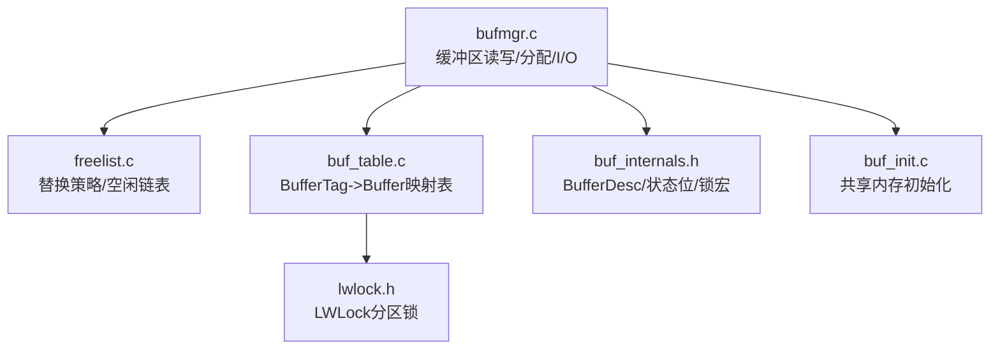
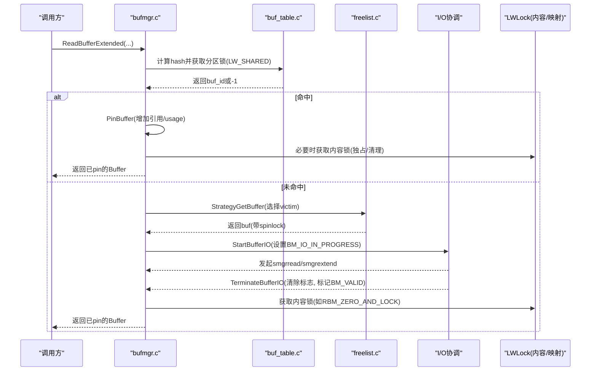
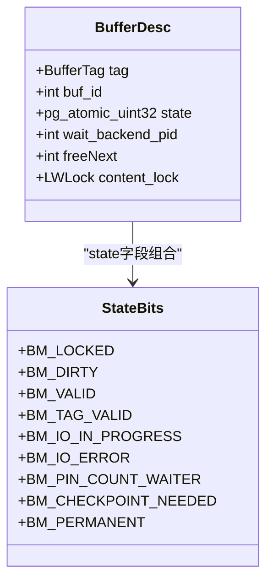
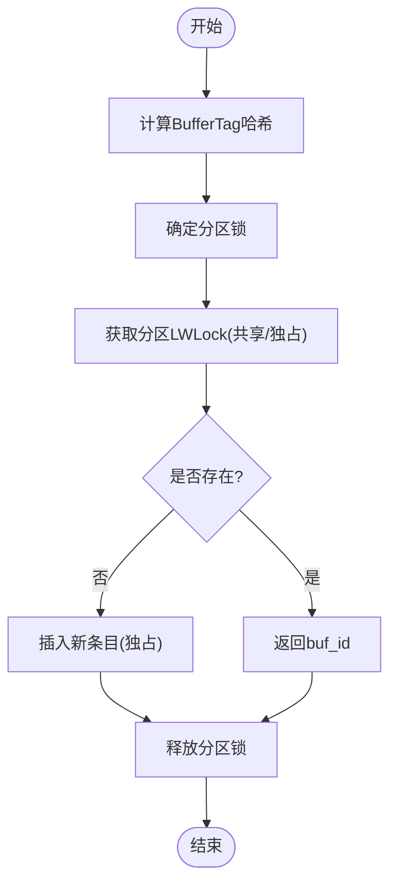
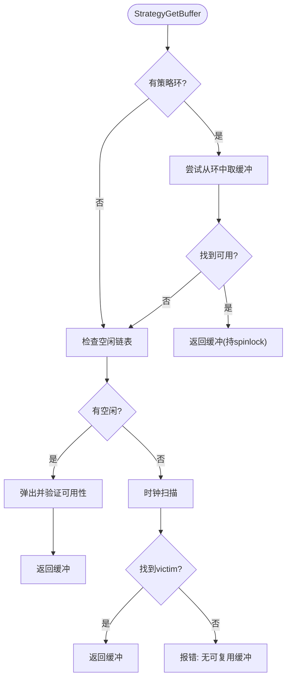
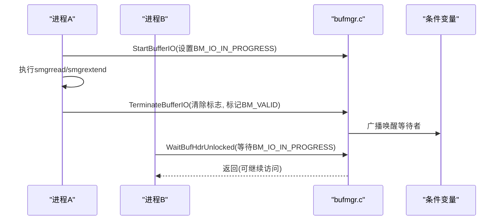
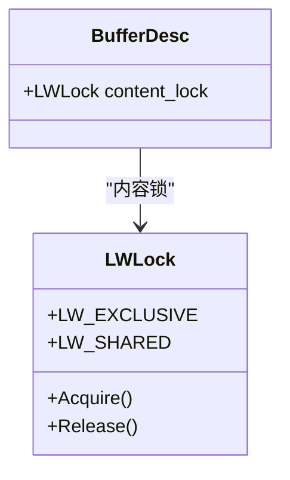
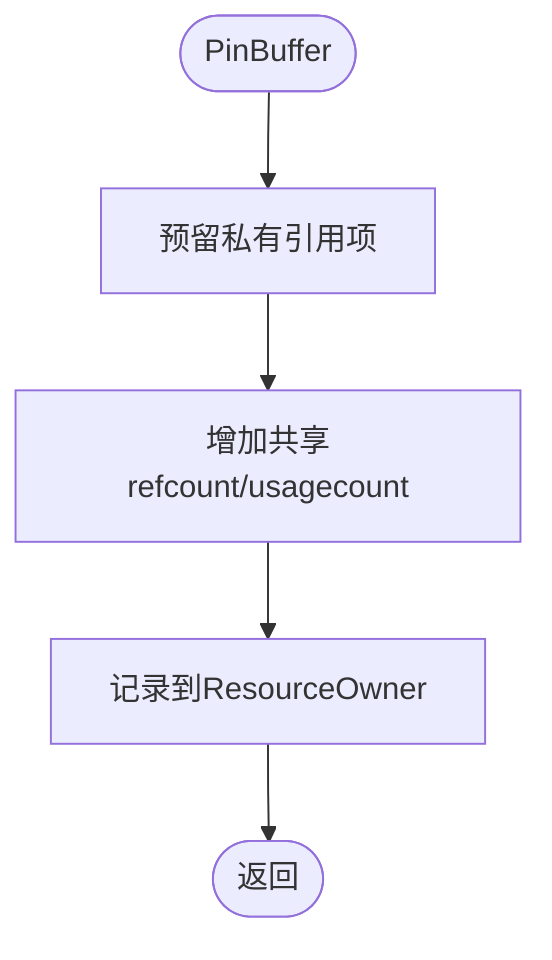
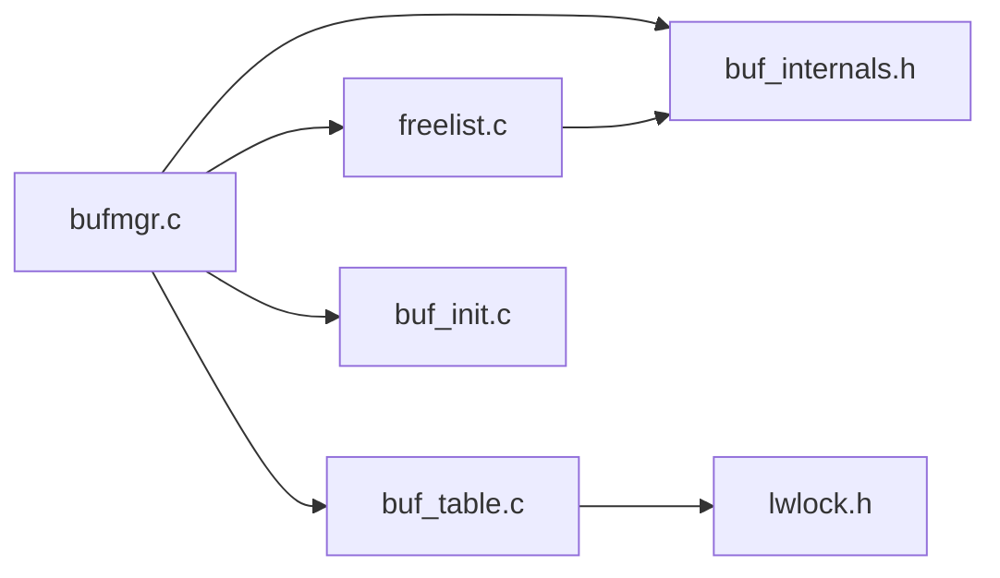

# 并发控制机制

<cite>
**本文引用的文件**
- [bufmgr.c](file://src/backend/storage/buffer/bufmgr.c)
- [buf_init.c](file://src/backend/storage/buffer/buf_init.c)
- [buf_table.c](file://src/backend/storage/buffer/buf_table.c)
- [freelist.c](file://src/backend/storage/buffer/freelist.c)
- [buf_internals.h](file://src/include/storage/buf_internals.h)
- [lwlock.h](file://src/include/storage/lwlock.h)
</cite>

## 目录
1. [简介](#简介)
2. [项目结构](#项目结构)
3. [核心组件](#核心组件)
4. [架构总览](#架构总览)
5. [详细组件分析](#详细组件分析)
6. [依赖关系分析](#依赖关系分析)
7. [性能考量](#性能考量)
8. [故障排查指南](#故障排查指南)
9. [结论](#结论)
10. [附录](#附录)

## 简介
本文件面向Mini PostgreSQL的缓冲区并发控制机制，聚焦以下目标：
- 解释缓冲区锁机制与轻量级锁（LWLock）的使用方式、分区化设计以及死锁避免策略。
- 说明多进程环境下缓冲区的访问控制协议，包括引用计数、私有引用计数、内容锁与映射表锁的协作。
- 文档化缓冲区竞争检测与解决机制，包括等待队列、条件变量与超时/重试处理。
- 阐述在并发场景下的数据一致性保证以及与MVCC的集成点。
- 提供并发性能分析与调试技巧、最佳实践，指导高并发环境下的缓冲管理。

## 项目结构
与缓冲区并发控制相关的核心代码位于 storage/buffer 目录及 include/storage 头文件中：
- bufmgr.c：缓冲区管理器主逻辑，包含读取、分配、I/O启动/终止、脏页回写、等待与唤醒等。
- freelist.c：缓冲区替换策略（时钟扫描）、空闲链表与后台写入器通知。
- buf_table.c：BufferTag到Buffer索引的哈希映射表，按分区加锁降低争用。
- buf_init.c：共享内存初始化（缓冲区描述符、数据块、条件变量数组、检查点排序数组）。
- buf_internals.h：缓冲区状态位、BufferDesc结构、分区锁宏、内容锁访问宏等。
- lwlock.h：轻量级锁接口、分区数量、偏移与模式定义。

**图表来源**
- [bufmgr.c:800-1200](file://src/backend/storage/buffer/bufmgr.c#L800-L1200)
- [freelist.c:189-358](file://src/backend/storage/buffer/freelist.c#L189-L358)
- [buf_table.c:51-163](file://src/backend/storage/buffer/buf_table.c#L51-L163)
- [buf_internals.h:121-193](file://src/include/storage/buf_internals.h#L121-L193)
- [lwlock.h:84-137](file://src/include/storage/lwlock.h#L84-L137)
- [buf_init.c:66-146](file://src/backend/storage/buffer/buf_init.c#L66-L146)

**章节来源**
- [bufmgr.c:800-1200](file://src/backend/storage/buffer/bufmgr.c#L800-L1200)
- [freelist.c:189-358](file://src/backend/storage/buffer/freelist.c#L189-L358)
- [buf_table.c:51-163](file://src/backend/storage/buffer/buf_table.c#L51-L163)
- [buf_internals.h:121-193](file://src/include/storage/buf_internals.h#L121-L193)
- [lwlock.h:84-137](file://src/include/storage/lwlock.h#L84-L137)
- [buf_init.c:66-146](file://src/backend/storage/buffer/buf_init.c#L66-L146)

## 核心组件
- 缓冲区描述符与状态位：BufferDesc包含tag、state（refcount/usagecount/flags）、content_lock、wait_backend_pid等；state为原子32位，支持无锁CAS操作提升性能。
- 缓冲区映射表：以BufferTag为键的哈希表，按NUM_BUFFER_PARTITIONS分区，使用LWLock分区锁减少热点。
- 替换策略：时钟扫描算法选择victim，维护空闲链表与统计信息，支持后台写入器唤醒。
- I/O协调：通过BM_IO_IN_PROGRESS标志与条件变量实现读/写I/O的同步与等待唤醒。
- 内容锁：每个BufferDesc含LWLock content_lock，用于保护页面内容的并发访问。
- 私有引用计数：后端本地缓存频繁pin的buffer引用计数，减少共享内存更新开销。

**章节来源**
- [buf_internals.h:29-78](file://src/include/storage/buf_internals.h#L29-L78)
- [buf_internals.h:121-193](file://src/include/storage/buf_internals.h#L121-L193)
- [buf_table.c:27-163](file://src/backend/storage/buffer/buf_table.c#L27-L163)
- [freelist.c:26-65](file://src/backend/storage/buffer/freelist.c#L26-L65)
- [bufmgr.c:170-205](file://src/backend/storage/buffer/bufmgr.c#L170-L205)

## 架构总览
下图展示缓冲区并发控制的关键交互：读取路径、映射表查找、替换策略、I/O启动与等待、内容锁获取。

**图表来源**
- [bufmgr.c:800-1200](file://src/backend/storage/buffer/bufmgr.c#L800-L1200)
- [buf_table.c:84-163](file://src/backend/storage/buffer/buf_table.c#L84-L163)
- [freelist.c:189-358](file://src/backend/storage/buffer/freelist.c#L189-L358)
- [buf_internals.h:121-193](file://src/include/storage/buf_internals.h#L121-L193)

## 详细组件分析

### 缓冲区描述符与状态位（BufferDesc/state）
- state字段组合了refcount（18位）、usagecount（4位）和flags（10位），允许在无锁情况下进行CAS更新，提高并发性能。
- 关键标志：BM_LOCKED、BM_DIRTY、BM_VALID、BM_TAG_VALID、BM_IO_IN_PROGRESS、BM_IO_ERROR、BM_PIN_COUNT_WAITER、BM_CHECKPOINT_NEEDED、BM_PERMANENT。
- wait_backend_pid用于记录等待“唯一pin”的后端PID，配合BM_PIN_COUNT_WAITER实现等待者通知。

**图表来源**
- [buf_internals.h:29-78](file://src/include/storage/buf_internals.h#L29-L78)
- [buf_internals.h:136-193](file://src/include/storage/buf_internals.h#L136-L193)

**章节来源**
- [buf_internals.h:29-78](file://src/include/storage/buf_internals.h#L29-L78)
- [buf_internals.h:136-193](file://src/include/storage/buf_internals.h#L136-L193)

### 缓冲区映射表与分区锁（buf_table.c + lwlock.h）
- 映射表将BufferTag映射到Buffer ID，采用NUM_BUFFER_PARTITIONS=128个分区，每个分区由独立的LWLock保护，降低争用。
- 查找/插入/删除需持有相应分区的LWLock（共享/独占），并在临界区内调整Buffer头部状态。
- 分区锁通过BufMappingPartitionLock(hashcode)计算，确保同一tag的并发访问串行化。

**图表来源**
- [buf_table.c:51-163](file://src/backend/storage/buffer/buf_table.c#L51-L163)
- [lwlock.h:84-137](file://src/include/storage/lwlock.h#L84-L137)

**章节来源**
- [buf_table.c:51-163](file://src/backend/storage/buffer/buf_table.c#L51-L163)
- [lwlock.h:84-137](file://src/include/storage/lwlock.h#L84-L137)

### 替换策略与空闲链表（freelist.c）
- 使用时钟扫描算法（ClockSweepTick）遍历缓冲区，寻找可复用victim（refcount=0且usagecount低）。
- 空闲链表firstFreeBuffer/lastFreeBuffer快速定位可用缓冲，结合spinlock保护。
- 支持后台写入器通知（StrategyNotifyBgWriter），在分配请求时唤醒bgwriter进行回写。
- 策略对象（BufferAccessStrategy）提供环形缓冲区优化批量访问。

**图表来源**
- [freelist.c:189-358](file://src/backend/storage/buffer/freelist.c#L189-L358)
- [freelist.c:537-705](file://src/backend/storage/buffer/freelist.c#L537-L705)

**章节来源**
- [freelist.c:189-358](file://src/backend/storage/buffer/freelist.c#L189-L358)
- [freelist.c:537-705](file://src/backend/storage/buffer/freelist.c#L537-L705)

### I/O协调与等待队列（bufmgr.c + buf_internals.h）
- StartBufferIO设置BM_IO_IN_PROGRESS，防止其他进程重用该缓冲；TerminateBufferIO清除标志并标记BM_VALID，同时唤醒等待者。
- 等待者通过条件变量（BufferIOCVArray）阻塞，直到I/O完成。
- 对于扩展关系（P_NEW），需先smgrextend再标记有效，避免重复扩展。

**图表来源**
- [bufmgr.c:800-1200](file://src/backend/storage/buffer/bufmgr.c#L800-L1200)
- [buf_init.c:66-146](file://src/backend/storage/buffer/buf_init.c#L66-L146)
- [buf_internals.h:178-193](file://src/include/storage/buf_internals.h#L178-L193)

**章节来源**
- [bufmgr.c:800-1200](file://src/backend/storage/buffer/bufmgr.c#L800-L1200)
- [buf_init.c:66-146](file://src/backend/storage/buffer/buf_init.c#L66-L146)
- [buf_internals.h:178-193](file://src/include/storage/buf_internals.h#L178-L193)

### 内容锁与访问协议（buf_internals.h + lwlock.h）
- 每个BufferDesc包含content_lock（LWLock），用于保护页面内容的并发访问。
- RBM_ZERO_AND_LOCK/RBM_ZERO_AND_CLEANUP_LOCK模式在返回前获取内容锁，确保调用方可安全初始化页面。
- 内容锁与映射表锁分离：映射表锁保护BufferTag->Buffer映射，内容锁保护实际数据。

**图表来源**
- [buf_internals.h:136-193](file://src/include/storage/buf_internals.h#L136-L193)
- [lwlock.h:110-137](file://src/include/storage/lwlock.h#L110-L137)

**章节来源**
- [buf_internals.h:136-193](file://src/include/storage/buf_internals.h#L136-L193)
- [lwlock.h:110-137](file://src/include/storage/lwlock.h#L110-L137)

### 私有引用计数与Pin/Unpin协议（bufmgr.c）
- 每个后端维护PrivateRefCountArray/Hash，跟踪当前进程对共享缓冲的pin次数，减少共享内存更新。
- PinBuffer/PinBuffer_Locked增加引用计数与usage_count；UnpinBuffer减少并可能触发回写。
- BufferIsPinned检查当前后端是否持有pin，用于资源泄漏检查。

**图表来源**
- [bufmgr.c:170-205](file://src/backend/storage/buffer/bufmgr.c#L170-L205)
- [bufmgr.c:444-460](file://src/backend/storage/buffer/bufmgr.c#L444-L460)

**章节来源**
- [bufmgr.c:170-205](file://src/backend/storage/buffer/bufmgr.c#L170-L205)
- [bufmgr.c:444-460](file://src/backend/storage/buffer/bufmgr.c#L444-L460)

## 依赖关系分析
- bufmgr.c依赖freelist.c进行victim选择，依赖buf_table.c进行BufferTag查找，依赖buf_internals.h中的BufferDesc与锁宏。
- freelist.c依赖全局策略控制块（BufferStrategyControl）与空闲链表。
- buf_table.c依赖lwlock.h的分区锁机制。
- buf_init.c负责初始化所有共享数据结构，包括BufferDescriptors、BufferBlocks、BufferIOCVArray等。

**图表来源**
- [bufmgr.c:800-1200](file://src/backend/storage/buffer/bufmgr.c#L800-L1200)
- [freelist.c:189-358](file://src/backend/storage/buffer/freelist.c#L189-L358)
- [buf_table.c:51-163](file://src/backend/storage/buffer/buf_table.c#L51-L163)
- [buf_internals.h:121-193](file://src/include/storage/buf_internals.h#L121-L193)
- [buf_init.c:66-146](file://src/backend/storage/buffer/buf_init.c#L66-L146)

**章节来源**
- [bufmgr.c:800-1200](file://src/backend/storage/buffer/bufmgr.c#L800-L1200)
- [freelist.c:189-358](file://src/backend/storage/buffer/freelist.c#L189-L358)
- [buf_table.c:51-163](file://src/backend/storage/buffer/buf_table.c#L51-L163)
- [buf_internals.h:121-193](file://src/include/storage/buf_internals.h#L121-L193)
- [buf_init.c:66-146](file://src/backend/storage/buffer/buf_init.c#L66-L146)

## 性能考量
- 原子状态位：state字段合并refcount/usagecount/flags，支持CAS无锁更新，减少自旋锁持有时间。
- 分区化映射表：128个分区降低哈希表热点，提高并发查找/插入性能。
- 私有引用计数：后端本地缓存高频pin的buffer，减少共享内存竞争。
- 时钟扫描策略：近似LRU，平衡命中率与扫描成本。
- 条件变量等待：I/O期间阻塞等待，避免忙轮询，降低CPU占用。
- 批量访问策略：BufferAccessStrategy环形缓冲区优化顺序扫描。

[本节为通用性能讨论，不直接分析具体文件]

## 故障排查指南
- 死锁避免：
  - 映射表锁与内容锁分离，避免嵌套锁顺序不一致。
  - 在需要写回时优先尝试条件获取内容锁，失败则选择其他victim。
- 等待队列问题：
  - 检查BM_IO_IN_PROGRESS是否正确设置/清除，确认条件变量广播是否触发。
  - 监控wait_backend_pid与BM_PIN_COUNT_WAITER，排查“等待唯一pin”的阻塞。
- 性能瓶颈：
  - 观察替换策略的completePasses与numBufferAllocs，评估回收频率。
  - 检查私有引用计数溢出情况（PrivateRefCountOverflowed），评估是否需要增大数组容量。
- 数据一致性：
  - 确认RBM_ZERO_AND_LOCK模式下内容锁获取时机，避免脏页可见。
  - 验证PageIsVerifiedExtended校验结果，处理损坏页策略（zero_damaged_pages）。

**章节来源**
- [bufmgr.c:800-1200](file://src/backend/storage/buffer/bufmgr.c#L800-L1200)
- [freelist.c:394-442](file://src/backend/storage/buffer/freelist.c#L394-L442)
- [buf_internals.h:136-193](file://src/include/storage/buf_internals.h#L136-L193)

## 结论
Mini PostgreSQL的缓冲区并发控制通过原子状态位、分区化LWLock、时钟扫描替换策略与条件变量等待队列，实现了高效且安全的共享缓冲管理。其设计在多进程环境下保证了数据一致性与高吞吐，同时通过私有引用计数与批量访问策略优化性能。在高并发场景中，建议关注映射表分区大小、替换策略参数与I/O调度配置，并结合调试工具监控等待队列与锁争用情况。

[本节为总结性内容，不直接分析具体文件]

## 附录
- 相关配置与统计：
  - effective_io_concurrency：控制预取并发度。
  - bgwriter_lru_maxpages/bgwriter_lru_multiplier：后台写入器阈值与增长因子。
  - track_io_timing：启用I/O时间统计。
- 调试接口：
  - TRACE_POSTGRESQL_BUFFER_READ_START/DONE：追踪缓冲区读取事件。
  - pgstat_count_buffer_hit/read：统计命中与读取次数。

**章节来源**
- [bufmgr.c:134-161](file://src/backend/storage/buffer/bufmgr.c#L134-L161)
- [bufmgr.c:810-816](file://src/backend/storage/buffer/bufmgr.c#L810-L816)
- [bufmgr.c:860-878](file://src/backend/storage/buffer/bufmgr.c#L860-L878)
- [bufmgr.c:1062-1068](file://src/backend/storage/buffer/bufmgr.c#L1062-L1068)