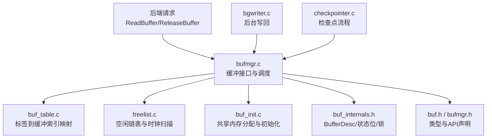
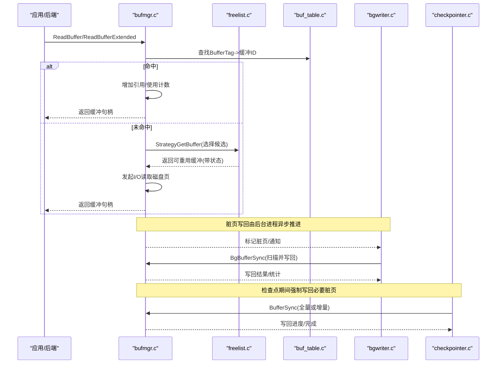
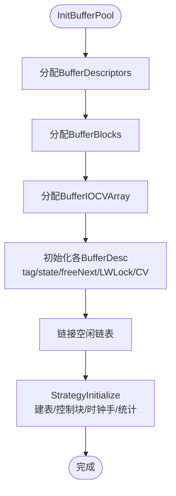
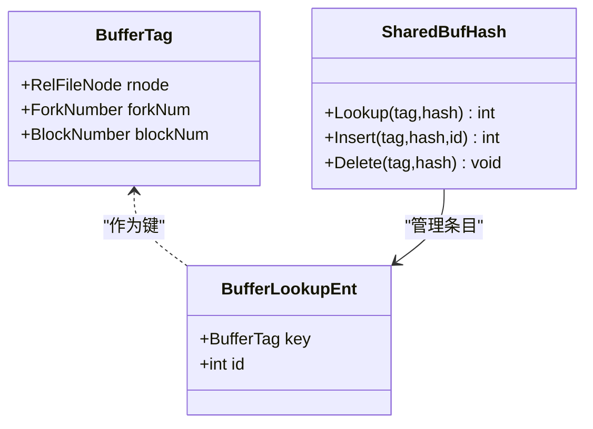
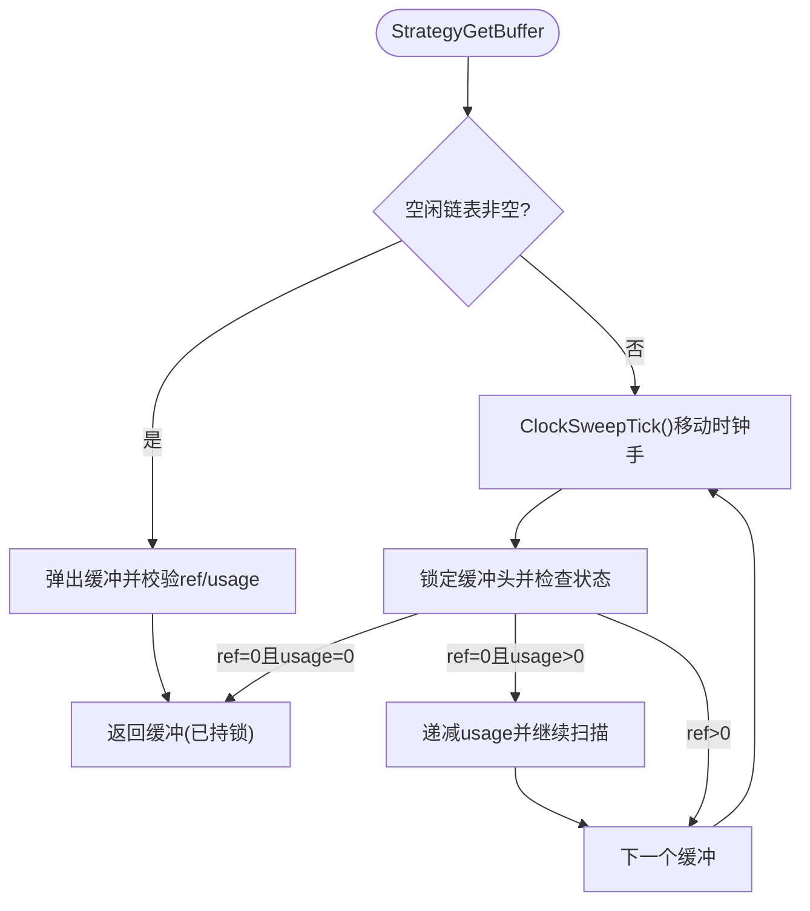
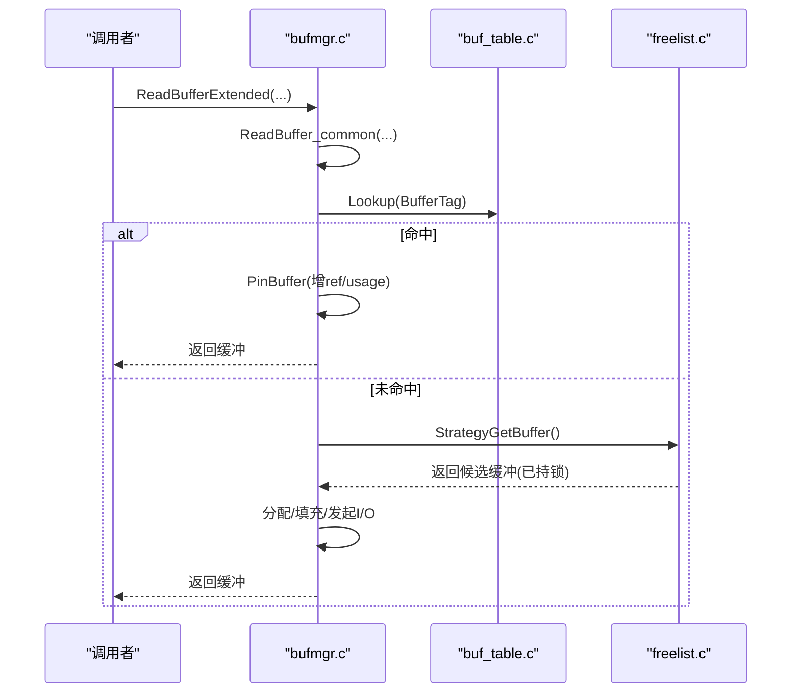
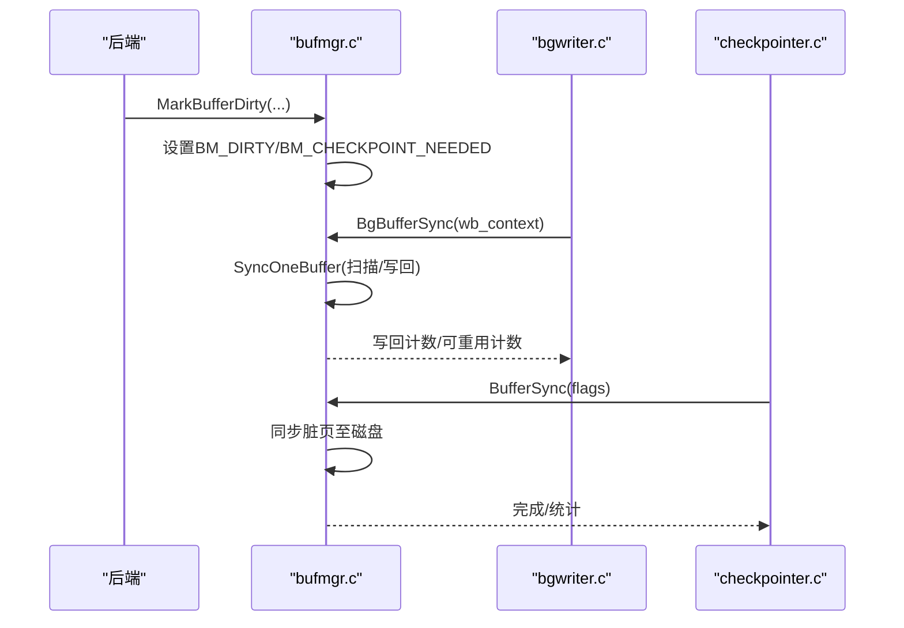
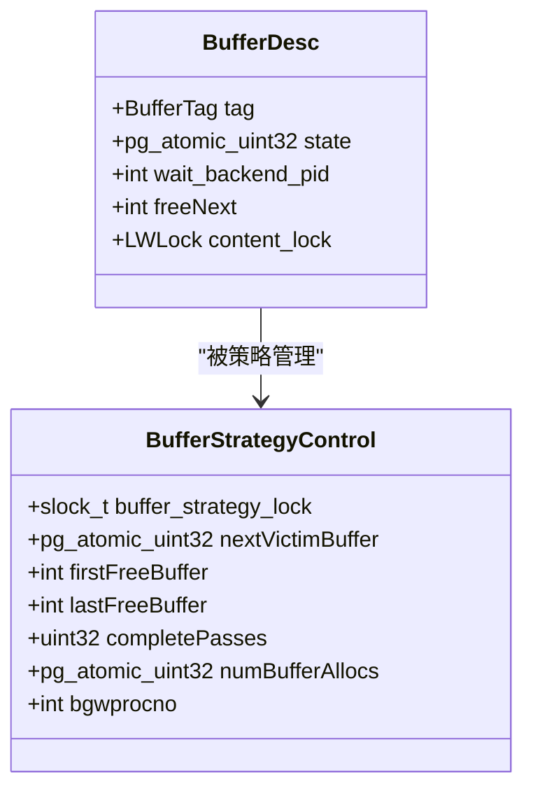
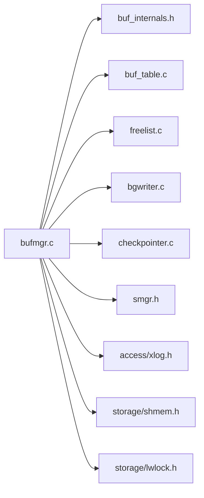
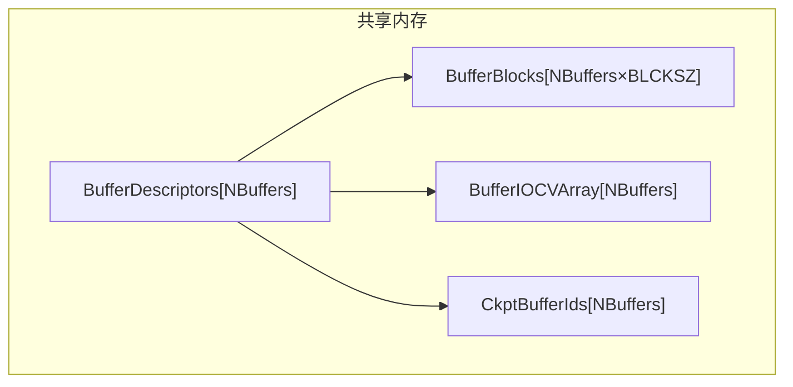

# 缓冲区管理器

<cite>
**本文引用的文件**
- [bufmgr.c](file://src/backend/storage/buffer/bufmgr.c)
- [buf_init.c](file://src/backend/storage/buffer/buf_init.c)
- [freelist.c](file://src/backend/storage/buffer/freelist.c)
- [buf_table.c](file://src/backend/storage/buffer/buf_table.c)
- [buf.h](file://src/include/storage/buf.h)
- [buf_internals.h](file://src/include/storage/buf_internals.h)
- [bufmgr.h](file://src/include/storage/bufmgr.h)
- [bgwriter.c](file://src/backend/postmaster/bgwriter.c)
- [checkpointer.c](file://src/backend/postmaster/checkpointer.c)
</cite>

## 目录
1. [简介](#简介)
2. [项目结构](#项目结构)
3. [核心组件](#核心组件)
4. [架构总览](#架构总览)
5. [详细组件分析](#详细组件分析)
6. [依赖关系分析](#依赖关系分析)
7. [性能考量](#性能考量)
8. [故障排查指南](#故障排查指南)
9. [结论](#结论)
10. [附录](#附录)

## 简介
本文件为 Mini PostgreSQL 的缓冲区管理器提供完整技术参考，聚焦于固定大小缓冲池的设计与实现、LRU（时钟）替换算法、脏页与检查点/WAL 集成、并发控制与锁机制，并配套架构图、内存布局图与性能监控指南。目标是帮助读者理解存储层缓冲管理的核心原理与实践细节。

## 项目结构
Mini PostgreSQL 的缓冲管理位于 storage/buffer 目录，配合 postmaster 中的后台进程（背景写入器与检查点进程）以及共享内存初始化模块共同完成缓冲池生命周期管理。

图表来源
- [bufmgr.c:16-30](file://src/backend/storage/buffer/bufmgr.c#L16-L30)
- [buf_init.c:66-146](file://src/backend/storage/buffer/buf_init.c#L66-L146)
- [freelist.c:189-358](file://src/backend/storage/buffer/freelist.c#L189-L358)
- [buf_table.c:51-163](file://src/backend/storage/buffer/buf_table.c#L51-L163)
- [buf_internals.h:136-193](file://src/include/storage/buf_internals.h#L136-L193)
- [buf.h:17-44](file://src/include/storage/buf.h#L17-L44)
- [bufmgr.h:172-244](file://src/include/storage/bufmgr.h#L172-L244)
- [bgwriter.c:93-136](file://src/backend/postmaster/bgwriter.c#L93-L136)
- [checkpointer.c:182-200](file://src/backend/postmaster/checkpointer.c#L182-L200)

章节来源
- [bufmgr.c:16-30](file://src/backend/storage/buffer/bufmgr.c#L16-L30)
- [buf_init.c:66-146](file://src/backend/storage/buffer/buf_init.c#L66-L146)
- [freelist.c:189-358](file://src/backend/storage/buffer/freelist.c#L189-L358)
- [buf_table.c:51-163](file://src/backend/storage/buffer/buf_table.c#L51-L163)
- [buf_internals.h:136-193](file://src/include/storage/buf_internals.h#L136-L193)
- [buf.h:17-44](file://src/include/storage/buf.h#L17-L44)
- [bufmgr.h:172-244](file://src/include/storage/bufmgr.h#L172-L244)
- [bgwriter.c:93-136](file://src/backend/postmaster/bgwriter.c#L93-L136)
- [checkpointer.c:182-200](file://src/backend/postmaster/checkpointer.c#L182-L200)

## 核心组件
- 缓冲描述符 BufferDesc：每个共享缓冲区的元数据，包含 tag、state（原子32位，组合 refcount/usagecount/flags）、content_lock、freeNext 等。
- 缓冲块 BufferBlocks：固定大小的连续内存区域，按 BLCKSZ 划分，供所有共享缓冲复用。
- 缓冲查找表 BufTable：将 BufferTag（relNode, forkNum, blockNum）映射到缓冲索引，分区哈希以降低锁竞争。
- 空闲链表与时钟扫描：维护 free list，使用“时钟手”遍历缓冲数组进行 LRU 近似淘汰。
- 后台写回与检查点：bgwriter 周期性写回脏页；checkpointer 在检查点时确保脏页持久化并与 WAL 对齐。
- 并发控制：每缓冲 content LWLock 保护页面内容访问；BufferDesc state 通过原子位与自旋锁保护；映射表分区 LWLock 降低冲突。

章节来源
- [buf_internals.h:136-193](file://src/include/storage/buf_internals.h#L136-L193)
- [buf_init.c:66-146](file://src/backend/storage/buffer/buf_init.c#L66-L146)
- [buf_table.c:51-163](file://src/backend/storage/buffer/buf_table.c#L51-L163)
- [freelist.c:189-358](file://src/backend/storage/buffer/freelist.c#L189-L358)
- [bufmgr.c:2190-2485](file://src/backend/storage/buffer/bufmgr.c#L2190-L2485)
- [bgwriter.c:93-136](file://src/backend/postmaster/bgwriter.c#L93-L136)
- [checkpointer.c:182-200](file://src/backend/postmaster/checkpointer.c#L182-L200)

## 架构总览
下图展示缓冲管理器与后台进程的交互及数据流。

图表来源
- [bufmgr.c:742-759](file://src/backend/storage/buffer/bufmgr.c#L742-L759)
- [bufmgr.c:2190-2485](file://src/backend/storage/buffer/bufmgr.c#L2190-L2485)
- [freelist.c:189-358](file://src/backend/storage/buffer/freelist.c#L189-L358)
- [buf_table.c:84-163](file://src/backend/storage/buffer/buf_table.c#L84-L163)
- [bgwriter.c:93-136](file://src/backend/postmaster/bgwriter.c#L93-L136)
- [checkpointer.c:182-200](file://src/backend/postmaster/checkpointer.c#L182-L200)

## 详细组件分析

### 缓冲池初始化与内存布局
- 共享内存分配：
  - BufferDescriptors：缓冲描述符数组，缓存行对齐以提升并发性能。
  - BufferBlocks：固定大小缓冲块数组，大小为 NBuffers × BLCKSZ。
  - BufferIOCVArray：每缓冲的 I/O 条件变量数组，用于等待 I/O 完成。
  - CkptBufferIds：检查点排序所需数组，预分配避免运行时分配失败。
- 初始化流程：
  - 初始化每个 BufferDesc：清空 tag、state 置零、设置 freeNext 形成空闲链表、初始化 content LWLock 与 IO CV。
  - 策略初始化：建立查找表、策略控制块、时钟手初始位置、统计清零。

图表来源
- [buf_init.c:66-146](file://src/backend/storage/buffer/buf_init.c#L66-L146)
- [bufmgr.h:130-169](file://src/include/storage/bufmgr.h#L130-L169)
- [buf_internals.h:195-233](file://src/include/storage/buf_internals.h#L195-L233)

章节来源
- [buf_init.c:66-146](file://src/backend/storage/buffer/buf_init.c#L66-L146)
- [bufmgr.h:130-169](file://src/include/storage/bufmgr.h#L130-L169)
- [buf_internals.h:195-233](file://src/include/storage/buf_internals.h#L195-L233)

### 缓冲查找与映射（BufTable）
- BufferTag 标识磁盘页（relNode, forkNum, blockNum）。
- 分区哈希表：根据 hashcode 选择分区 LWLock，减少热点冲突。
- 操作：Lookup/Insert/Delete，调用方负责持有对应分区锁。

图表来源
- [buf_internals.h:80-119](file://src/include/storage/buf_internals.h#L80-L119)
- [buf_table.c:27-67](file://src/backend/storage/buffer/buf_table.c#L27-L67)
- [buf_table.c:84-163](file://src/backend/storage/buffer/buf_table.c#L84-L163)

章节来源
- [buf_internals.h:80-119](file://src/include/storage/buf_internals.h#L80-L119)
- [buf_table.c:27-67](file://src/backend/storage/buffer/buf_table.c#L27-L67)
- [buf_table.c:84-163](file://src/backend/storage/buffer/buf_table.c#L84-L163)

### 空闲链表与时钟算法（LRU近似）
- 空闲链表：首尾指针维护可用缓冲列表，快速弹出。
- 时钟扫描：nextVictimBuffer 原子递增，循环扫描 BufferDescriptors，依据 refcount 与 usagecount 判断是否可回收。
- 策略对象：支持环状缓冲集合（如批量读），提高局部性。

图表来源
- [freelist.c:106-169](file://src/backend/storage/buffer/freelist.c#L106-L169)
- [freelist.c:189-358](file://src/backend/storage/buffer/freelist.c#L189-L358)
- [freelist.c:394-421](file://src/backend/storage/buffer/freelist.c#L394-L421)

章节来源
- [freelist.c:106-169](file://src/backend/storage/buffer/freelist.c#L106-L169)
- [freelist.c:189-358](file://src/backend/storage/buffer/freelist.c#L189-L358)
- [freelist.c:394-421](file://src/backend/storage/buffer/freelist.c#L394-L421)

### 读路径与缓冲获取（ReadBuffer/ReadBufferExtended）
- 入口：ReadBufferExtended -> ReadBuffer_common。
- 流程：
  - 构造 BufferTag，计算哈希，查询 BufTable。
  - 命中则增加引用/使用计数并返回。
  - 未命中则通过 StrategyGetBuffer 选择候选，分配并发起 I/O 读取。
  - 更新 pgstat 统计（hit/miss）。

图表来源
- [bufmgr.c:742-759](file://src/backend/storage/buffer/bufmgr.c#L742-L759)
- [bufmgr.c:787-800](file://src/backend/storage/buffer/bufmgr.c#L787-L800)
- [buf_table.c:84-163](file://src/backend/storage/buffer/buf_table.c#L84-L163)
- [freelist.c:189-358](file://src/backend/storage/buffer/freelist.c#L189-L358)

章节来源
- [bufmgr.c:742-759](file://src/backend/storage/buffer/bufmgr.c#L742-L759)
- [bufmgr.c:787-800](file://src/backend/storage/buffer/bufmgr.c#L787-L800)
- [buf_table.c:84-163](file://src/backend/storage/buffer/buf_table.c#L84-L163)
- [freelist.c:189-358](file://src/backend/storage/buffer/freelist.c#L189-L358)

### 脏页处理与检查点/WAL集成
- 脏页标记：修改页面后通过 MarkBufferDirty 标记 BM_DIRTY。
- 后台写回：BgBufferSync 周期扫描，从 next_to_clean 开始，按 LRU 近似顺序写回脏页，受 bgwriter_lru_maxpages 限制。
- 检查点：BufferSync 在检查点期间确保必要脏页落盘，结合 WAL 保证一致性。
- WritebackContext：合并 OS 写回请求，减少系统调用开销。

图表来源
- [bufmgr.c:2190-2485](file://src/backend/storage/buffer/bufmgr.c#L2190-L2485)
- [bufmgr.c:1915-1925](file://src/backend/storage/buffer/bufmgr.c#L1915-L1925)
- [bgwriter.c:93-136](file://src/backend/postmaster/bgwriter.c#L93-L136)
- [checkpointer.c:182-200](file://src/backend/postmaster/checkpointer.c#L182-L200)

章节来源
- [bufmgr.c:2190-2485](file://src/backend/storage/buffer/bufmgr.c#L2190-L2485)
- [bufmgr.c:1915-1925](file://src/backend/storage/buffer/bufmgr.c#L1915-L1925)
- [bgwriter.c:93-136](file://src/backend/postmaster/bgwriter.c#L93-L136)
- [checkpointer.c:182-200](file://src/backend/postmaster/checkpointer.c#L182-L200)

### 并发控制与锁机制
- BufferDesc.state：原子32位，组合 refcount/usagecount/flags，CAS 操作避免频繁加锁。
- 内容锁：每缓冲 content LWLock，保护页面内容读写。
- 映射表锁：分区 LWLock，降低哈希表竞争。
- 私有引用计数：后端本地 PrivateRefCountArray/Hash，减少共享内存访问。

图表来源
- [buf_internals.h:136-193](file://src/include/storage/buf_internals.h#L136-L193)
- [freelist.c:29-61](file://src/backend/storage/buffer/freelist.c#L29-L61)
- [bufmgr.c:170-205](file://src/backend/storage/buffer/bufmgr.c#L170-L205)

章节来源
- [buf_internals.h:136-193](file://src/include/storage/buf_internals.h#L136-L193)
- [freelist.c:29-61](file://src/backend/storage/buffer/freelist.c#L29-L61)
- [bufmgr.c:170-205](file://src/backend/storage/buffer/bufmgr.c#L170-L205)

## 依赖关系分析
- bufmgr.c 依赖：
  - buf_internals.h：BufferDesc、状态位、锁宏。
  - buf_table.c：BufferTag 到缓冲索引的映射。
  - freelist.c：空闲链表与时钟扫描。
  - bgwriter.c/checkpointer.c：后台写回与检查点。
- 外部依赖：
  - smgr：存储管理器，负责实际磁盘 I/O。
  - xlog：WAL 日志，确保持久化一致性。
  - shmem/lwlock/spin：共享内存与锁原语。

图表来源
- [bufmgr.c:31-59](file://src/backend/storage/buffer/bufmgr.c#L31-L59)
- [buf_internals.h:18-27](file://src/include/storage/buf_internals.h#L18-L27)
- [buf_table.c:22-25](file://src/backend/storage/buffer/buf_table.c#L22-L25)
- [freelist.c:16-21](file://src/backend/storage/buffer/freelist.c#L16-L21)
- [bgwriter.c:35-59](file://src/backend/postmaster/bgwriter.c#L35-L59)
- [checkpointer.c:37-59](file://src/backend/postmaster/checkpointer.c#L37-L59)

章节来源
- [bufmgr.c:31-59](file://src/backend/storage/buffer/bufmgr.c#L31-L59)
- [buf_internals.h:18-27](file://src/include/storage/buf_internals.h#L18-L27)
- [buf_table.c:22-25](file://src/backend/storage/buffer/buf_table.c#L22-L25)
- [freelist.c:16-21](file://src/backend/storage/buffer/freelist.c#L16-L21)
- [bgwriter.c:35-59](file://src/backend/postmaster/bgwriter.c#L35-L59)
- [checkpointer.c:37-59](file://src/backend/postmaster/checkpointer.c#L37-L59)

## 性能考量
- 原子状态与无锁路径：BufferDesc.state 使用 CAS 提升高频操作效率。
- 缓存行对齐：BufferDescriptors 与 IO CV 数组按缓存行对齐，减少伪共享。
- 分区哈希：BufTable 分区降低锁竞争。
- 后台写回：BgBufferSync 平滑写负载，避免后端阻塞。
- 写回合并：WritebackContext 合并 OS 写回请求，减少系统调用。
- 配置参数：
  - bgwriter_lru_maxpages：单次写回上限。
  - checkpoint_flush_after/backend_flush_after/bgwriter_flush_after：触发 fsync 的阈值。
  - effective_io_concurrency/maintenance_io_concurrency：预取与并发度。

[本节为通用性能指导，不直接分析具体文件]

## 故障排查指南
- 常见错误：
  - “no unpinned buffers available”：所有缓冲均被占用，需检查事务/锁持有时间过长。
  - 脏页未写回：检查 bgwriter 是否运行、bgwriter_lru_maxpages 是否过小。
  - 检查点延迟：关注 BufferSync 进度与 WAL 生成速率。
- 诊断要点：
  - 查看 pgstat 缓冲命中/缺失统计。
  - 检查 BufferDesc.state 标志位（BM_DIRTY/BM_VALID/BM_IO_IN_PROGRESS）。
  - 确认分区 LWLock 与 content LWLock 持有情况。

章节来源
- [freelist.c:344-355](file://src/backend/storage/buffer/freelist.c#L344-L355)
- [bufmgr.c:2190-2485](file://src/backend/storage/buffer/bufmgr.c#L2190-L2485)
- [buf_internals.h:52-77](file://src/include/storage/buf_internals.h#L52-L77)

## 结论
Mini PostgreSQL 的缓冲管理器采用固定大小缓冲池、原子状态位、分区哈希与后台写回等机制，实现了高效、可扩展的共享缓冲管理。时钟算法提供 LRU 近似淘汰，结合检查点与 WAL 保障一致性与恢复能力。合理的锁粒度与内存布局优化确保了高并发下的良好性能。

[本节为总结性内容，不直接分析具体文件]

## 附录

### 内存布局图

图表来源
- [buf_init.c:66-146](file://src/backend/storage/buffer/buf_init.c#L66-L146)
- [bufmgr.h:130-169](file://src/include/storage/bufmgr.h#L130-L169)
- [buf_internals.h:195-233](file://src/include/storage/buf_internals.h#L195-L233)

### 性能监控指南
- 关键指标：
  - 缓冲命中率：pgstat_count_buffer_hit/miss。
  - 写回速率：BgWriterStats.m_buf_written_clean/checkpoints。
  - 分配频率：StrategyControl.numBufferAllocs。
- 调优建议：
  - 调整 NBuffers 以匹配工作集大小。
  - 合理设置 bgwriter_lru_maxpages 与 flush_after 参数。
  - 监控 I/O 并发度与 WAL 生成速率，平衡预取与写回。

[本节为通用监控指导，不直接分析具体文件]