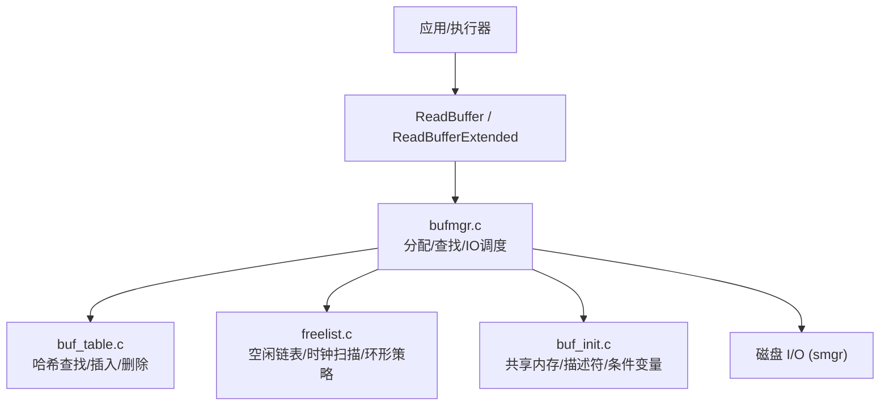
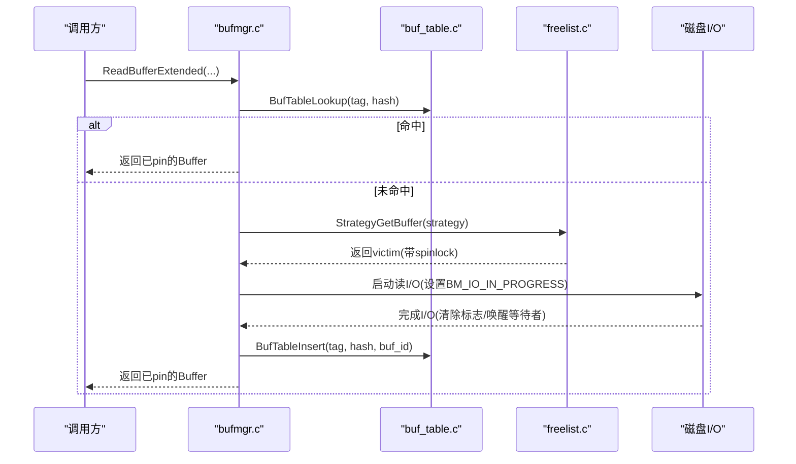
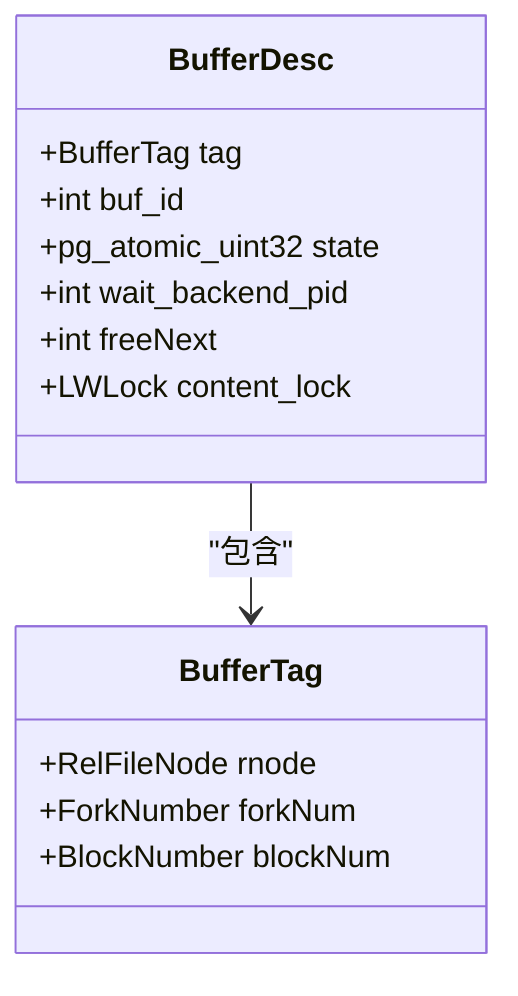
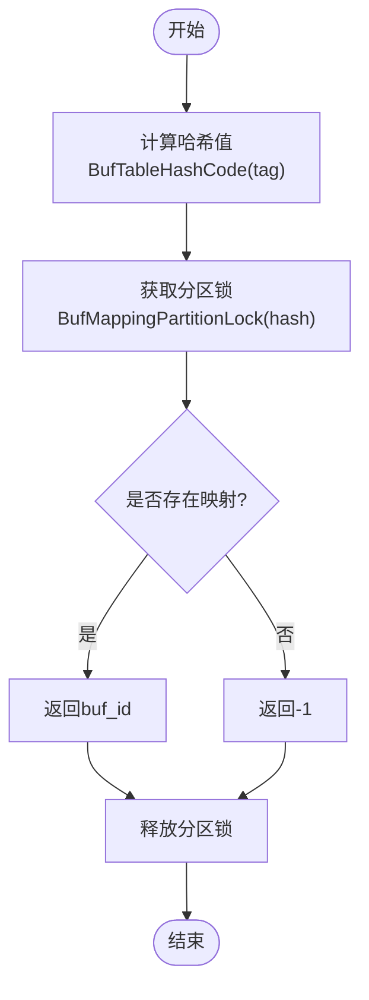
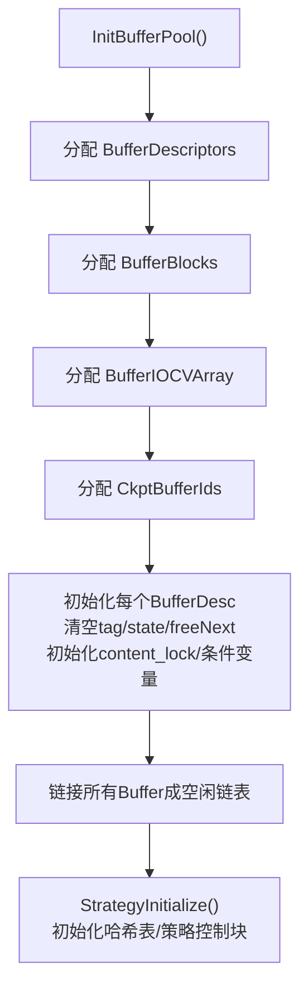
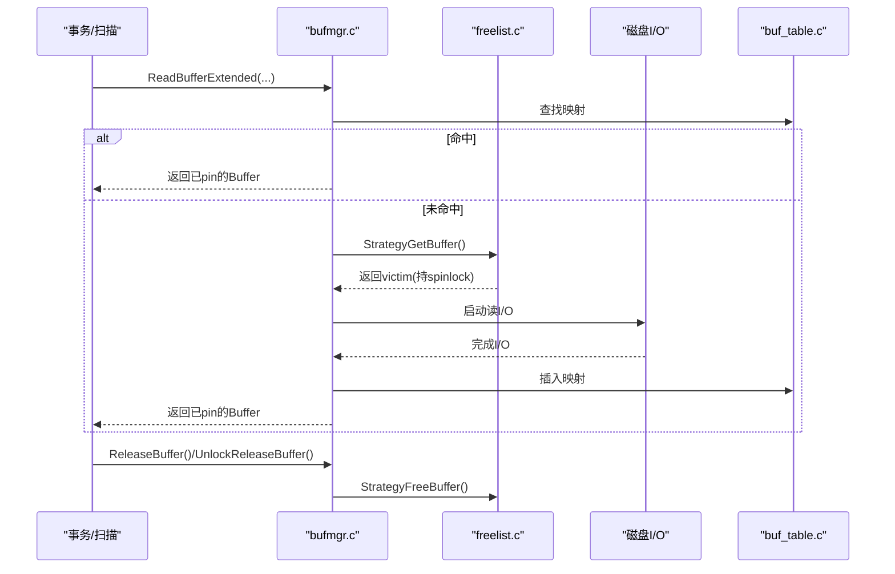
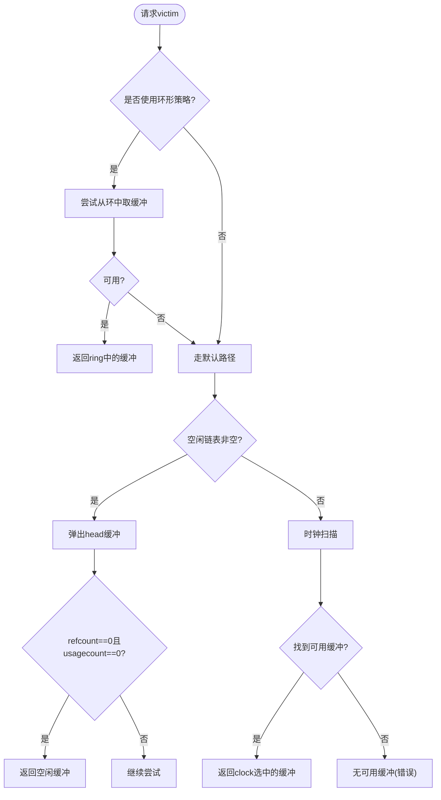
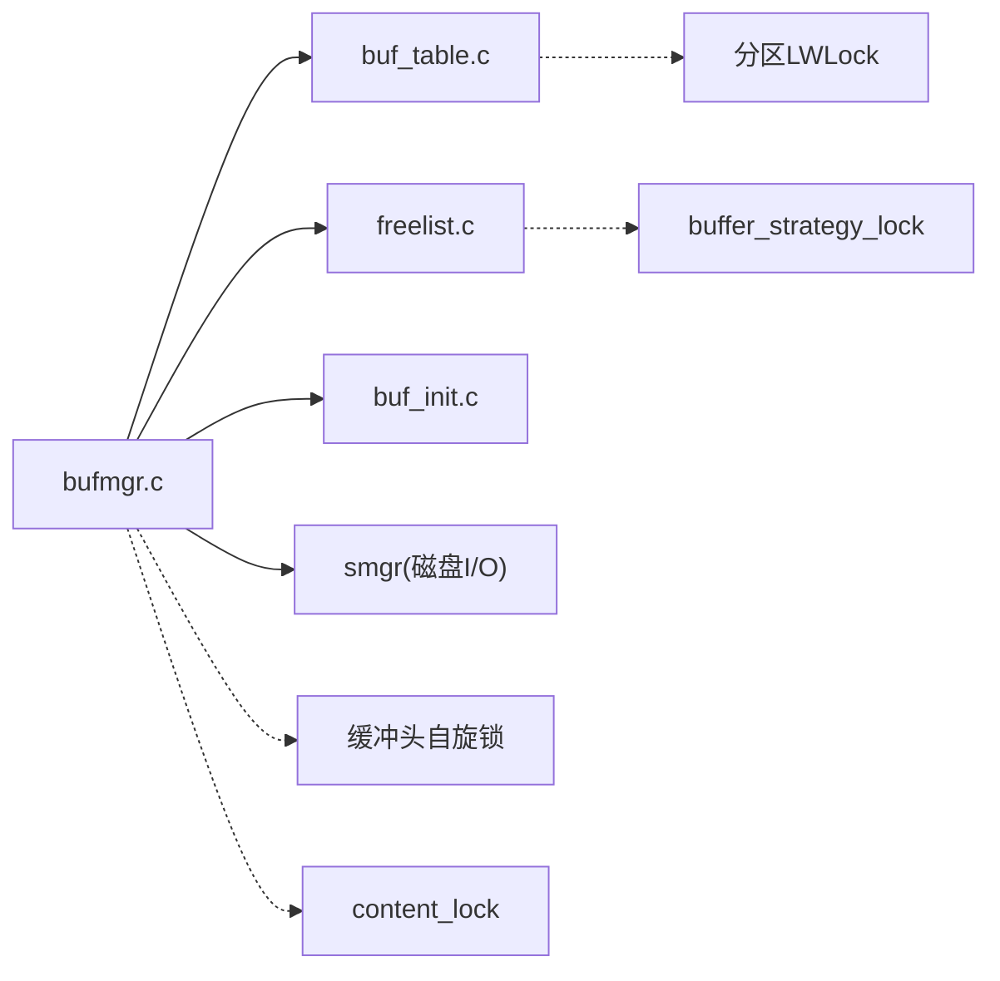

# 缓冲池分配管理

<cite>
**本文引用的文件**
- [buf_init.c](file://src/backend/storage/buffer/buf_init.c)
- [bufmgr.c](file://src/backend/storage/buffer/bufmgr.c)
- [buf_table.c](file://src/backend/storage/buffer/buf_table.c)
- [freelist.c](file://src/backend/storage/buffer/freelist.c)
- [README（缓冲池）](file://src/backend/storage/buffer/README)
- [buf_internals.h](file://src/include/storage/buf_internals.h)
- [bufmgr.h](file://src/include/storage/bufmgr.h)
</cite>

## 目录
1. [简介](#简介)
2. [项目结构](#项目结构)
3. [核心组件](#核心组件)
4. [架构总览](#架构总览)
5. [详细组件分析](#详细组件分析)
6. [依赖关系分析](#依赖关系分析)
7. [性能考量](#性能考量)
8. [故障排查指南](#故障排查指南)
9. [结论](#结论)
10. [附录](#附录)

## 简介
本文面向 Mini PostgreSQL 的存储层缓冲池，系统性阐述固定大小缓冲区的分配策略、内存布局、缓冲区表（Buffer Table）的哈希实现与查找算法、缓冲区的生命周期管理（从分配到回收），以及缓冲区描述符 BufferDesc 的结构定义与状态管理。文档同时提供关键流程的时序图与流程图，并给出性能优化建议，帮助读者深入理解并高效使用缓冲池。

## 项目结构
Mini PostgreSQL 的缓冲池实现位于 src/backend/storage/buffer 目录，核心文件包括：
- buf_init.c：共享缓冲池初始化、内存布局与全局对象创建
- bufmgr.c：缓冲管理器对外接口与主要分配/释放逻辑
- buf_table.c：缓冲区映射表（BufferTag -> Buffer ID）的哈希表实现
- freelist.c：替换策略（空闲链表、时钟扫描、环形缓冲区）
- README（缓冲池）：访问规则、锁机制、替换策略说明
- 头文件：buf_internals.h（内部数据结构与宏）、bufmgr.h（对外接口与枚举）

**图表来源**
- [bufmgr.c:742-759](file://src/backend/storage/buffer/bufmgr.c#L742-L759)
- [buf_table.c:51-67](file://src/backend/storage/buffer/buf_table.c#L51-L67)
- [freelist.c:189-358](file://src/backend/storage/buffer/freelist.c#L189-L358)
- [buf_init.c:66-146](file://src/backend/storage/buffer/buf_init.c#L66-L146)

**章节来源**
- [buf_init.c:66-146](file://src/backend/storage/buffer/buf_init.c#L66-L146)
- [bufmgr.c:742-759](file://src/backend/storage/buffer/bufmgr.c#L742-L759)
- [buf_table.c:51-67](file://src/backend/storage/buffer/buf_table.c#L51-L67)
- [freelist.c:189-358](file://src/backend/storage/buffer/freelist.c#L189-L358)
- [README（缓冲池）:1-146](file://src/backend/storage/buffer/README#L1-L146)

## 核心组件
- 缓冲区描述符 BufferDesc：每个共享缓冲区的元数据，包含 tag、buf_id、state（原子位域：refcount、usagecount、flags）、freeNext、content_lock 等
- 缓冲区映射表（Buffer Table）：哈希表，将 BufferTag 映射到 Buffer ID，支持分区锁以减少竞争
- 空闲链表与替换策略：维护 free list，采用时钟扫描（Clock Sweep）选择 victim；支持环形缓冲区策略（BulkRead/Vacuum/BulkWrite）
- 缓冲池初始化：分配 BufferDescriptors、BufferBlocks、IO 条件变量数组、检查点排序数组，并初始化各缓冲头的状态和链表

**章节来源**
- [buf_internals.h:136-193](file://src/include/storage/buf_internals.h#L136-L193)
- [buf_internals.h:18-47](file://src/include/storage/buf_internals.h#L18-L47)
- [buf_table.c:27-67](file://src/backend/storage/buffer/buf_table.c#L27-L67)
- [freelist.c:26-61](file://src/backend/storage/buffer/freelist.c#L26-L61)
- [buf_init.c:66-146](file://src/backend/storage/buffer/buf_init.c#L66-L146)

## 架构总览
缓冲池由“描述符 + 数据块 + 映射表 + 替换策略”组成。读取路径通过 ReadBuffer/ReadBufferExtended 进入，先在映射表中查找命中；未命中则通过替换策略选择 victim，必要时发起 I/O 读入数据，更新映射表并返回已 pin 的 buffer。写路径通过 MarkBufferDirty 标记脏页，后台写入器或检查点负责刷盘。

**图表来源**
- [bufmgr.c:742-759](file://src/backend/storage/buffer/bufmgr.c#L742-L759)
- [bufmgr.c:1093-1219](file://src/backend/storage/buffer/bufmgr.c#L1093-L1219)
- [buf_table.c:85-106](file://src/backend/storage/buffer/buf_table.c#L85-L106)
- [freelist.c:189-358](file://src/backend/storage/buffer/freelist.c#L189-L358)

## 详细组件分析

### 缓冲区描述符 BufferDesc 与状态管理
- 字段与作用
  - tag：标识该缓冲区对应的磁盘页（RelFileNode + forkNum + blockNum）
  - buf_id：缓冲区索引号（0..NBuffers-1）
  - state：原子 32 位位域，组合 refcount（引用计数）、usagecount（使用计数）、flags（如 BM_VALID、BM_DIRTY、BM_IO_IN_PROGRESS 等）
  - freeNext：空闲链表链接指针（受 buffer_strategy_lock 保护）
  - content_lock：内容级 LWLock，控制对缓冲数据的并发访问
- 状态位与语义
  - BM_VALID：数据有效
  - BM_DIRTY：需要写回
  - BM_IO_IN_PROGRESS：I/O进行中，用于等待
  - BM_TAG_VALID：tag 已分配（即存在映射表项）
  - BM_PIN_COUNT_WAITER：有进程等待唯一 pin
  - BM_CHECKPOINT_NEEDED：检查点需写
  - BM_PERMANENT：持久化缓冲（非 unlogged/init fork）
- 访问与同步
  - 修改/读取 tag/state/wait_backend_pid 需持有缓冲头自旋锁（BM_LOCKED）
  - freeNext 由 buffer_strategy_lock 保护
  - content_lock 用于数据访问的互斥/共享

**图表来源**
- [buf_internals.h:91-119](file://src/include/storage/buf_internals.h#L91-L119)
- [buf_internals.h:136-193](file://src/include/storage/buf_internals.h#L136-L193)

**章节来源**
- [buf_internals.h:18-47](file://src/include/storage/buf_internals.h#L18-L47)
- [buf_internals.h:136-193](file://src/include/storage/buf_internals.h#L136-L193)
- [README（缓冲池）:100-146](file://src/backend/storage/buffer/README#L100-L146)

### 缓冲区表（Buffer Table）：哈希表与查找
- 数据结构
  - 哈希表项 BufferLookupEnt：key=BufferTag，value=buffer id
  - 全局哈希表 SharedBufHash，按 NUM_BUFFER_PARTITIONS 分区以降低锁竞争
- 关键操作
  - InitBufTable(size)：初始化共享哈希表
  - BufTableHashCode(tag)：计算 tag 的哈希值
  - BufTableLookup(tag, hashcode)：在分区锁下查找，返回 buffer id 或未找到
  - BufTableInsert/Delete(tag, hashcode, buf_id)：插入/删除映射项（需独占分区锁）
- 查找算法
  - 基于 PG 哈希库的开放寻址/链地址实现（内部细节不暴露），以 BufferTag 为键
  - 分区锁粒度：根据 hash 低几位确定分区，减少热点冲突

**图表来源**
- [buf_table.c:51-67](file://src/backend/storage/buffer/buf_table.c#L51-L67)
- [buf_table.c:78-106](file://src/backend/storage/buffer/buf_table.c#L78-L106)
- [buf_internals.h:121-133](file://src/include/storage/buf_internals.h#L121-L133)

**章节来源**
- [buf_table.c:27-67](file://src/backend/storage/buffer/buf_table.c#L27-L67)
- [buf_table.c:78-163](file://src/backend/storage/buffer/buf_table.c#L78-L163)
- [buf_internals.h:121-133](file://src/include/storage/buf_internals.h#L121-L133)

### 分配策略与内存布局
- 内存布局
  - BufferDescriptors：对齐到缓存行的缓冲描述符数组
  - BufferBlocks：连续分配的 BLCKSZ 大小的数据块数组
  - BufferIOCVArray：每缓冲一个条件变量，用于 I/O 等待
  - CkptBufferIds：检查点时排序用的共享数组
- 初始化流程
  - InitBufferPool() 分配上述共享内存区域
  - 初始化每个 BufferDesc：清空 tag、state、freeNext 链接成空闲链表、初始化 content_lock 与条件变量
  - StrategyInitialize() 初始化哈希表、策略控制块、空闲链表头尾、时钟扫描指针等

**图表来源**
- [buf_init.c:66-146](file://src/backend/storage/buffer/buf_init.c#L66-L146)
- [bufmgr.h:79-85](file://src/include/storage/bufmgr.h#L79-L85)
- [freelist.c:474-527](file://src/backend/storage/buffer/freelist.c#L474-L527)

**章节来源**
- [buf_init.c:66-146](file://src/backend/storage/buffer/buf_init.c#L66-L146)
- [bufmgr.h:79-85](file://src/include/storage/bufmgr.h#L79-L85)
- [freelist.c:474-527](file://src/backend/storage/buffer/freelist.c#L474-L527)

### 缓冲区生命周期管理（分配→使用→回收）
- 分配
  - ReadBuffer/ReadBufferExtended → ReadBuffer_common → BufferAlloc
  - 若命中映射表：直接返回已 pin 的 buffer
  - 未命中：StrategyGetBuffer 选择 victim（优先空闲链表，否则时钟扫描），必要时发起 I/O
- 使用
  - 持有 pin（refcount > 0）方可安全访问
  - 内容访问需加 content_lock（共享/独占）
  - 可更新 hint 位（仅共享锁即可）
- 回收
  - ReleaseBuffer/UnlockReleaseBuffer：减少本地/共享 refcount，若为0则加入空闲链表
  - 脏页由后台写入器或检查点写出
  - 环形策略（BAS_BULKREAD/VACUUM/BULKWRITE）：限制重用范围，避免污染主缓存

**图表来源**
- [bufmgr.c:742-759](file://src/backend/storage/buffer/bufmgr.c#L742-L759)
- [bufmgr.c:1093-1219](file://src/backend/storage/buffer/bufmgr.c#L1093-L1219)
- [freelist.c:189-358](file://src/backend/storage/buffer/freelist.c#L189-L358)
- [buf_table.c:85-163](file://src/backend/storage/buffer/buf_table.c#L85-L163)

**章节来源**
- [bufmgr.c:742-759](file://src/backend/storage/buffer/bufmgr.c#L742-L759)
- [bufmgr.c:1093-1219](file://src/backend/storage/buffer/bufmgr.c#L1093-L1219)
- [freelist.c:189-358](file://src/backend/storage/buffer/freelist.c#L189-L358)
- [buf_table.c:85-163](file://src/backend/storage/buffer/buf_table.c#L85-L163)

### 替换策略与环形缓冲区
- 空闲链表：首尾指针 firstFreeBuffer/lastFreeBuffer，快速分配/回收
- 时钟扫描：nextVictimBuffer 循环前进，跳过 pinned 或 usagecount>0 的缓冲
- 环形策略：
  - BAS_BULKREAD/VACUUM：256KB 环，适合一次性大扫描
  - BAS_BULKWRITE：最大 16MB 或 shared_buffers 的 1/8，适合批量写
  - 脏页处理：BulkRead 模式下拒绝脏缓冲，避免频繁 WAL flush

**图表来源**
- [freelist.c:189-358](file://src/backend/storage/buffer/freelist.c#L189-L358)
- [freelist.c:537-588](file://src/backend/storage/buffer/freelist.c#L537-L588)
- [freelist.c:605-705](file://src/backend/storage/buffer/freelist.c#L605-L705)

**章节来源**
- [freelist.c:189-358](file://src/backend/storage/buffer/freelist.c#L189-L358)
- [freelist.c:537-588](file://src/backend/storage/buffer/freelist.c#L537-L588)
- [freelist.c:605-705](file://src/backend/storage/buffer/freelist.c#L605-L705)

## 依赖关系分析
- bufmgr.c 依赖：
  - buf_table.c：哈希查找/插入/删除
  - freelist.c：替换策略与环形缓冲
  - buf_init.c：共享内存与全局对象
  - smgr：底层文件 I/O
- 锁依赖：
  - 映射表分区锁（LWLock）：保护哈希表
  - buffer_strategy_lock（自旋锁）：保护空闲链表与时钟指针
  - 缓冲头自旋锁（BM_LOCKED）：保护 BufferDesc 的 state/tag 等
  - content_lock（LWLock）：保护缓冲数据访问

**图表来源**
- [bufmgr.c:742-759](file://src/backend/storage/buffer/bufmgr.c#L742-L759)
- [buf_table.c:51-67](file://src/backend/storage/buffer/buf_table.c#L51-L67)
- [freelist.c:474-527](file://src/backend/storage/buffer/freelist.c#L474-L527)
- [buf_internals.h:121-133](file://src/include/storage/buf_internals.h#L121-L133)

**章节来源**
- [bufmgr.c:742-759](file://src/backend/storage/buffer/bufmgr.c#L742-L759)
- [buf_table.c:51-67](file://src/backend/storage/buffer/buf_table.c#L51-L67)
- [freelist.c:474-527](file://src/backend/storage/buffer/freelist.c#L474-L527)
- [buf_internals.h:121-133](file://src/include/storage/buf_internals.h#L121-L133)

## 性能考量
- 减少锁竞争
  - 使用分区化的映射表锁，降低热点冲突
  - 空闲链表与时钟指针用自旋锁保护，缩短临界区
- 提升命中率
  - 合理设置 NBuffers 与哈希表容量（NBuffers + NUM_BUFFER_PARTITIONS）
  - 使用环形策略隔离一次性大扫描，避免污染主缓存
- 降低 I/O 开销
  - 预取 PrefetchBuffer 异步预热
  - 后台写入器从 nextVictimBuffer 附近扫描脏页，减少抖动
- 原子位域优化
  - state 合并 refcount/usagecount/flags，减少锁次数，提高 CAS 效率

[本节为通用指导，不直接分析具体文件]

## 故障排查指南
- 常见错误与定位
  - “no unpinned buffers available”：所有缓冲均被 pin 或 usagecount>0，检查长时间持有 pin 的代码路径
  - 映射表损坏：哈希表异常删除导致 elog(ERROR)，检查并发插入/删除是否正确持有分区锁
  - I/O 阻塞：BM_IO_IN_PROGRESS 未正确清除，检查 WaitIO/TerminateBufferIO 路径
- 调试建议
  - 观察 nextVictimBuffer 与 completePasses，评估时钟扫描进度
  - 统计 numBufferAllocs，评估分配压力
  - 使用 pgstat 缓冲命中/缺失计数，定位热点

**章节来源**
- [freelist.c:315-358](file://src/backend/storage/buffer/freelist.c#L315-L358)
- [buf_table.c:148-163](file://src/backend/storage/buffer/buf_table.c#L148-L163)
- [README（缓冲池）:148-153](file://src/backend/storage/buffer/README#L148-L153)

## 结论
Mini PostgreSQL 的缓冲池通过“描述符 + 数据块 + 哈希映射 + 替换策略”的组合，实现了高并发、低竞争的共享缓冲管理。BufferDesc 的原子位域设计、分区化的映射表锁、时钟扫描与环形策略共同保障了高性能与稳定性。理解其生命周期与锁协议，有助于在存储层进行高效的缓冲管理与调优。

[本节为总结性内容，不直接分析具体文件]

## 附录
- 关键 API 参考
  - ReadBuffer/ReadBufferExtended：读取页面并 pin
  - ReleaseBuffer/UnlockReleaseBuffer：释放 pin 与锁
  - MarkBufferDirty：标记脏页
  - GetAccessStrategy/FreeAccessStrategy：获取/释放环形策略对象
  - StrategyGetBuffer/StrategyFreeBuffer：底层分配/回收
  - BufTableLookup/Insert/Delete：映射表操作

**章节来源**
- [bufmgr.h:174-250](file://src/include/storage/bufmgr.h#L174-L250)
- [freelist.c:537-588](file://src/backend/storage/buffer/freelist.c#L537-L588)
- [buf_table.c:78-163](file://src/backend/storage/buffer/buf_table.c#L78-L163)