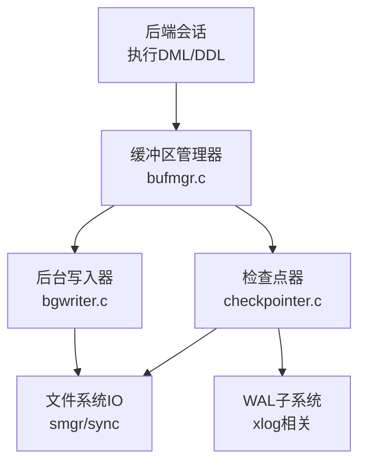
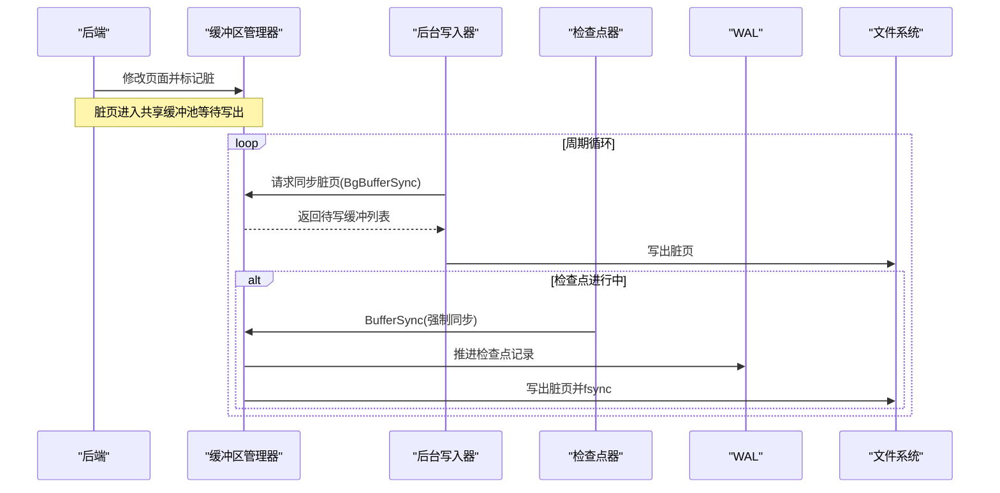
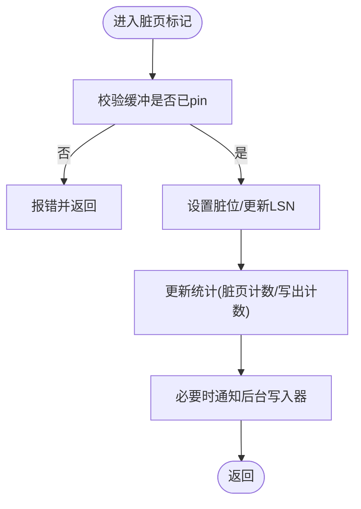
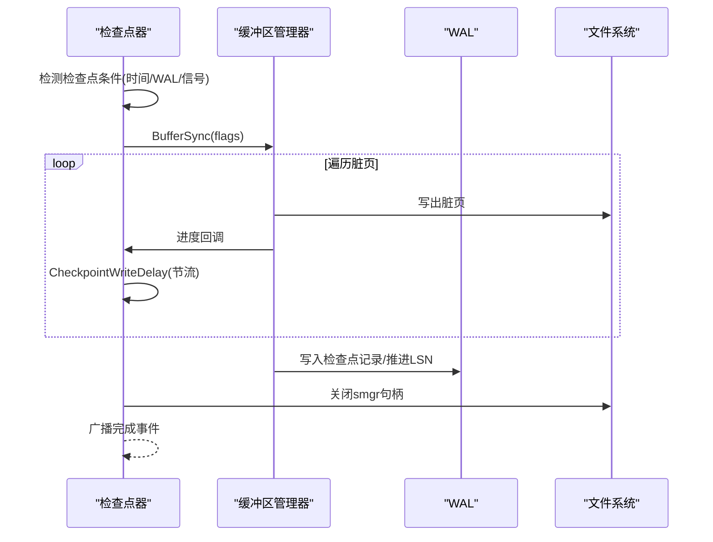
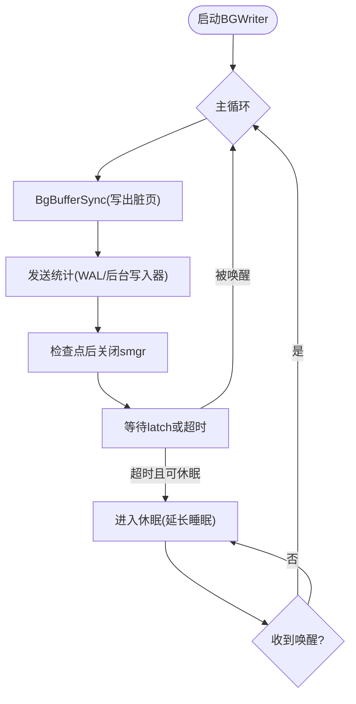
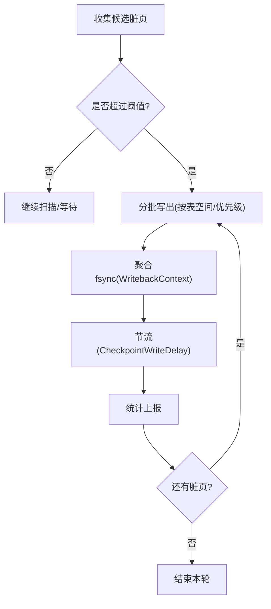
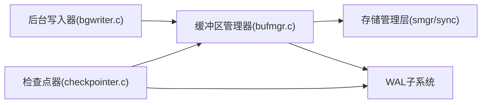

# 脏页管理机制

<cite>
**本文引用的文件**
- [bgwriter.c](file://src/backend/postmaster/bgwriter.c)
- [checkpointer.c](file://src/backend/postmaster/checkpointer.c)
- [bufmgr.c](file://src/backend/storage/buffer/bufmgr.c)
- [README（缓冲区子系统）](file://src/backend/storage/buffer/README)
</cite>

## 目录
1. [简介](#简介)
2. [项目结构](#项目结构)
3. [核心组件](#核心组件)
4. [架构总览](#架构总览)
5. [详细组件分析](#详细组件分析)
6. [依赖关系分析](#依赖关系分析)
7. [性能考虑](#性能考虑)
8. [故障排查指南](#故障排查指南)
9. [结论](#结论)
10. [附录](#附录)

## 简介
本文面向Mini PostgreSQL的脏页管理机制，围绕以下主题展开：
- 脏页标记与追踪：从业务修改到共享缓冲区的脏位设置、统计上报与后台回收。
- 检查点过程：检查点触发、BufferSync刷盘流程以及与WAL的协同。
- 后台写入器（Background Writer）：职责、调度与休眠策略。
- 脏页刷盘策略：阈值控制、批量写入优化与I/O吞吐控制。
- 监控、调优与恢复：关键指标、参数建议与常见问题定位。

## 项目结构
与脏页管理直接相关的代码主要分布在以下模块：
- 存储层缓冲区管理器：负责缓冲区的分配、锁定、脏页标记、替换与刷写。
- 后台进程：后台写入器（BGWriter）与检查点器（Checkpointer）。
- WAL子系统：通过检查点协调脏页持久化与WAL一致性。

图表来源
- [bufmgr.c:1-120](file://src/backend/storage/buffer/bufmgr.c#L1-L120)
- [bgwriter.c:1-120](file://src/backend/postmaster/bgwriter.c#L1-L120)
- [checkpointer.c:1-120](file://src/backend/postmaster/checkpointer.c#L1-L120)

章节来源
- [bufmgr.c:1-120](file://src/backend/storage/buffer/bufmgr.c#L1-L120)
- [bgwriter.c:1-120](file://src/backend/postmaster/bgwriter.c#L1-L120)
- [checkpointer.c:1-120](file://src/backend/postmaster/checkpointer.c#L1-L120)

## 核心组件
- 缓冲区管理器（bufmgr.c）
  - 提供脏页标记入口（如MarkBufferDirty），维护缓冲区的引用计数、使用计数、脏位与LSN等状态。
  - 实现BufferSync/SyncOneBuffer等刷写逻辑，配合策略选择目标缓冲并落盘。
- 后台写入器（bgwriter.c）
  - 周期性扫描脏页并异步写出，降低后端自行写盘的阻塞。
  - 支持“休眠”模式以节能，并在有活动或收到唤醒信号时快速响应。
- 检查点器（checkpointer.c）
  - 负责触发检查点/重启点，协调BufferSync与WAL，确保数据一致性与可恢复性。
  - 提供CheckpointWriteDelay进行速率控制，避免检查点期间I/O尖峰。

章节来源
- [bufmgr.c:1-120](file://src/backend/storage/buffer/bufmgr.c#L1-L120)
- [bgwriter.c:1-120](file://src/backend/postmaster/bgwriter.c#L1-L120)
- [checkpointer.c:1-120](file://src/backend/postmaster/checkpointer.c#L1-L120)

## 架构总览
脏页生命周期与系统交互如下：
- 后端修改页面后，调用脏页标记接口将缓冲区置为脏。
- 后台写入器周期性地挑选脏页并写出；当脏页过多或需要释放空间时，后端也可能主动写出。
- 检查点过程中，统一收集脏页并写出，同时推进WAL，保证崩溃恢复的一致性。

图表来源
- [bgwriter.c:230-350](file://src/backend/postmaster/bgwriter.c#L230-L350)
- [checkpointer.c:606-677](file://src/backend/postmaster/checkpointer.c#L606-L677)
- [bufmgr.c:1-120](file://src/backend/storage/buffer/bufmgr.c#L1-L120)

## 详细组件分析

### 脏页标记与追踪（MarkBufferDirty）
- 功能要点
  - 将已pin的缓冲区标记为脏，以便后续由后台写入器或检查点写出。
  - 更新统计信息，便于监控脏页增长趋势与写出压力。
  - 与WAL的关系：在PostgreSQL中，通常先写WAL再写数据页；Mini PG中同样遵循“日志先行”的原则，确保崩溃恢复一致性。
- 复杂度与并发
  - 标记操作通常为O(1)，涉及原子位操作与轻量锁。
  - 多后端并发标记同一缓冲需通过缓冲头自旋锁/内容锁保护。
- 典型路径
  - 后端修改数据 -> 调用脏页标记 -> 统计上报 -> 等待后台写出或检查点写出。

图表来源
- [bufmgr.c:1-120](file://src/backend/storage/buffer/bufmgr.c#L1-L120)

章节来源
- [bufmgr.c:1-120](file://src/backend/storage/buffer/bufmgr.c#L1-L120)

### 检查点过程与BufferSync
- 触发条件
  - 时间到期（CheckPointTimeout）、WAL段满、外部信号或关闭时的最终检查点。
- 工作流程
  - 检查点器读取共享标志位，决定执行检查点或重启点。
  - 调用BufferSync遍历脏页，按表空间/优先级组织并写出。
  - 每写一页后调用CheckpointWriteDelay进行节流，避免I/O过载。
  - 完成后推进WAL检查点记录，并关闭smgr句柄以避免悬挂引用。
- 与WAL集成
  - 检查点记录包含redo指针等信息，用于崩溃恢复时确定恢复起点。
  - 检查点期间可能产生额外WAL记录（如running xacts快照），提升复制一致性。

图表来源
- [checkpointer.c:338-531](file://src/backend/postmaster/checkpointer.c#L338-L531)
- [checkpointer.c:606-677](file://src/backend/postmaster/checkpointer.c#L606-L677)
- [bufmgr.c:1-120](file://src/backend/storage/buffer/bufmgr.c#L1-L120)

章节来源
- [checkpointer.c:338-531](file://src/backend/postmaster/checkpointer.c#L338-L531)
- [checkpointer.c:606-677](file://src/backend/postmaster/checkpointer.c#L606-L677)
- [bufmgr.c:1-120](file://src/backend/storage/buffer/bufmgr.c#L1-L120)

### 后台写入器（Background Writer）的职责与调度
- 职责
  - 定期扫描脏页并写出，减少后端自行写盘带来的延迟抖动。
  - 在空闲时进入休眠，降低能耗；当后端分配缓冲或收到唤醒信号时快速恢复工作。
- 调度机制
  - 主循环：每次循环调用BgBufferSync执行一轮脏页写出，随后发送统计信息。
  - 休眠策略：若连续两轮无工作且无latch事件，则延长睡眠；下次缓冲分配会唤醒它。
  - 运行期任务：周期性记录standby快照，辅助复制快速达到一致状态。
- 错误处理
  - 异常时清理资源、重置上下文、关闭文件描述符，并短暂休眠避免日志风暴。

图表来源
- [bgwriter.c:230-350](file://src/backend/postmaster/bgwriter.c#L230-L350)

章节来源
- [bgwriter.c:230-350](file://src/backend/postmaster/bgwriter.c#L230-L350)

### 脏页刷盘策略与批量写入优化
- 阈值与批量
  - 后台写入器根据配置参数（如BgWriterDelay、bgwriter_lru_maxpages、bgwriter_lru_multiplier）控制每轮扫描与写出数量。
  - 检查点期间通过CheckpointWriteDelay对写出速率进行节流，结合checkpoint_completion_target平滑I/O。
- 批量优化
  - 按表空间/优先级组织脏页，减少随机I/O。
  - 使用WritebackContext聚合fsync时机，减少系统调用次数。
- 后端参与
  - 当后台写入器未能维持足够干净缓冲时，后端会主动写出部分脏页以满足空间需求。

图表来源
- [bufmgr.c:1-120](file://src/backend/storage/buffer/bufmgr.c#L1-L120)
- [checkpointer.c:606-677](file://src/backend/postmaster/checkpointer.c#L606-L677)
- [bgwriter.c:230-350](file://src/backend/postmaster/bgwriter.c#L230-L350)

章节来源
- [bufmgr.c:1-120](file://src/backend/storage/buffer/bufmgr.c#L1-L120)
- [checkpointer.c:606-677](file://src/backend/postmaster/checkpointer.c#L606-L677)
- [bgwriter.c:230-350](file://src/backend/postmaster/bgwriter.c#L230-L350)

## 依赖关系分析
- 模块耦合
  - 缓冲区管理器依赖smgr/sync进行实际IO，依赖WAL进行一致性保障。
  - 后台写入器与检查点器均依赖缓冲区管理器的同步接口。
  - 检查点器与WAL紧密协作，确保检查点记录与脏页写出顺序一致。
- 外部依赖
  - 操作系统I/O与fsync语义。
  - 信号与latch机制用于进程间唤醒与调度。

图表来源
- [bufmgr.c:1-120](file://src/backend/storage/buffer/bufmgr.c#L1-L120)
- [bgwriter.c:1-120](file://src/backend/postmaster/bgwriter.c#L1-L120)
- [checkpointer.c:1-120](file://src/backend/postmaster/checkpointer.c#L1-L120)

章节来源
- [bufmgr.c:1-120](file://src/backend/storage/buffer/bufmgr.c#L1-L120)
- [bgwriter.c:1-120](file://src/backend/postmaster/bgwriter.c#L1-L120)
- [checkpointer.c:1-120](file://src/backend/postmaster/checkpointer.c#L1-L120)

## 性能考虑
- 后台写入器休眠
  - 在无脏页且无latch事件时进入休眠，显著降低CPU与磁盘唤醒开销。
- 检查点节流
  - 通过CheckpointWriteDelay与checkpoint_completion_target控制写出节奏，避免检查点造成I/O尖峰。
- 批量fsync
  - 使用WritebackContext聚合fsync，减少系统调用与磁盘寻道。
- 后端主动写出
  - 当后台写入器滞后时，后端会主动写出部分脏页，保障缓冲池可用性。

[本节为通用指导，不直接分析具体文件]

## 故障排查指南
- 常见症状
  - 检查点频繁：可能由于WAL增长过快或checkpoint_timeout过小。
  - 后台写入器长时间空闲：确认是否有脏页积压或被后端抢先写出。
  - 崩溃后恢复时间长：检查检查点间隔与WAL保留策略。
- 定位步骤
  - 查看后台写入器与检查点器日志，关注错误与重试。
  - 检查缓冲池命中率与脏页数量变化趋势。
  - 核对WAL生成速率与检查点间隔是否匹配。
- 恢复建议
  - 调整checkpoint_timeout、max_wal_size、checkpoint_completion_target等参数。
  - 优化批处理与索引维护窗口，避开高峰时段。

章节来源
- [bgwriter.c:150-213](file://src/backend/postmaster/bgwriter.c#L150-L213)
- [checkpointer.c:246-313](file://src/backend/postmaster/checkpointer.c#L246-L313)

## 结论
Mini PostgreSQL的脏页管理机制通过后台写入器与检查点器的协同，实现了高效、可控的脏页持久化。脏页标记与追踪保证了数据变更的可恢复性，检查点与WAL集成确保了崩溃一致性。通过合理的阈值控制与批量优化，系统在吞吐与延迟之间取得平衡。建议在生产环境中结合负载特征调优参数，并持续监控关键指标以维持稳定运行。

[本节为总结，不直接分析具体文件]

## 附录
- 关键概念
  - 脏页：已被修改但尚未写出到磁盘的数据页。
  - 检查点：将脏页写出并推进WAL，形成一致的恢复点。
  - 后台写入器：异步写出脏页的后台进程，降低后端写盘延迟。
- 参考路径
  - 脏页标记入口：参见缓冲区管理器中的脏页标记函数。
  - 检查点流程：参见检查点器主循环与BufferSync调用。
  - 后台写入器循环：参见bgwriter主循环与休眠策略。

[本节为概念说明，不直接分析具体文件]