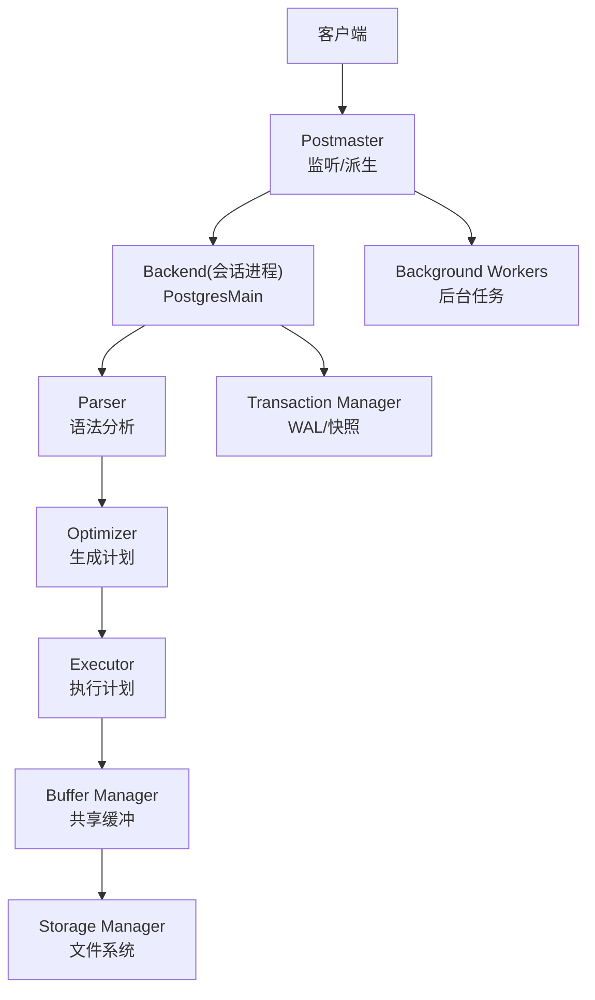
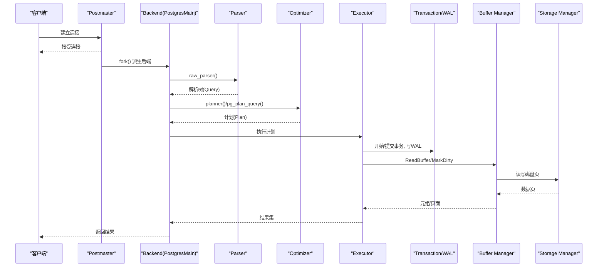
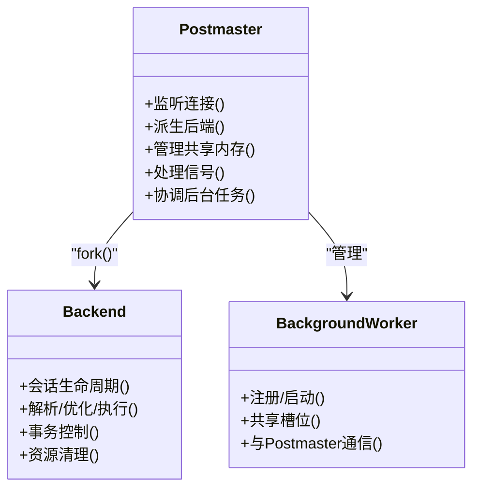
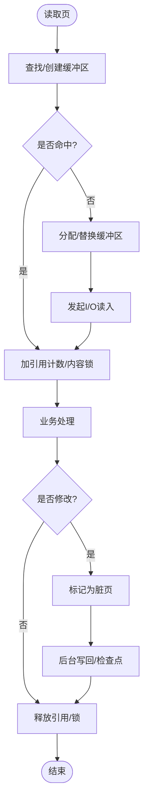
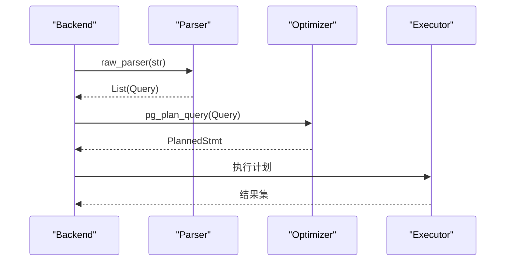
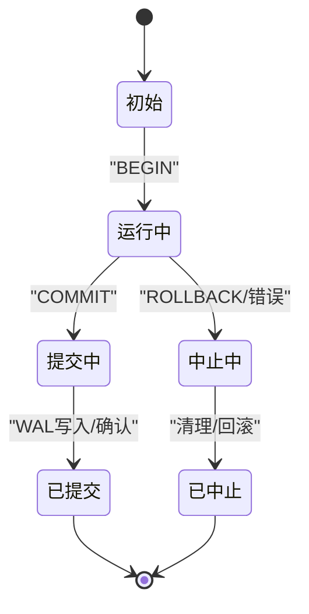
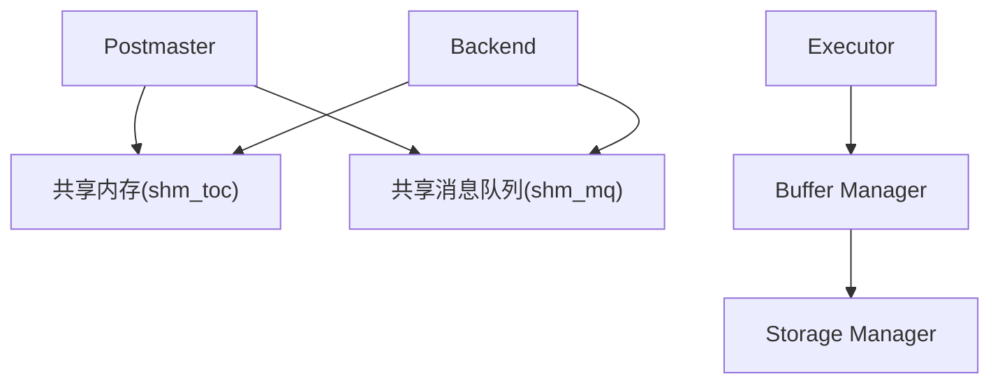

# 架构设计

<cite>
**本文引用的文件**
- [README](file://README)
- [main.c](file://src/backend/main/main.c)
- [postmaster.c](file://src/backend/postmaster/postmaster.c)
- [bgworker.c](file://src/backend/postmaster/bgworker.c)
- [interrupt.c](file://src/backend/postmaster/interrupt.c)
- [postgres.c](file://src/backend/tcop/postgres.c)
- [parser.c](file://src/backend/parser/parser.c)
- [optimizer/README](file://src/backend/optimizer/README)
- [bufmgr.c](file://src/backend/storage/buffer/bufmgr.c)
- [buffer/README](file://src/backend/storage/buffer/README)
- [smgr/README](file://src/backend/storage/smgr/README)
- [shm_mq.c](file://src/backend/storage/ipc/shm_mq.c)
- [shm_toc.c](file://src/backend/storage/ipc/shm_toc.c)
- [xactdesc.c](file://src/backend/access/rmgrdesc/xactdesc.c)
- [transam/README](file://src/backend/access/transam/README)
</cite>

## 目录
1. [简介](#简介)
2. [项目结构](#项目结构)
3. [核心组件](#核心组件)
4. [架构总览](#架构总览)
5. [详细组件分析](#详细组件分析)
6. [依赖关系分析](#依赖关系分析)
7. [性能考量](#性能考量)
8. [故障排查指南](#故障排查指南)
9. [结论](#结论)
10. [附录](#附录)

## 简介
Mini PostgreSQL（minipg）是一个基于 PostgreSQL 的轻量级数据库内核学习项目，目标是裁剪原百万行源码至十万行左右的核心功能，保留关键子系统：进程模型、存储层、查询处理、事务管理与内存管理。本架构文档面向开发者与学习者，系统阐述整体架构、核心组件职责、数据流与交互机制，并给出可扩展点与集成方式。

## 项目结构
- 入口与进程调度：后端统一入口 main.c 根据参数分发到 PostmasterMain、PostgresMain 或辅助进程入口。
- 主进程与后台工作进程：postmaster.c 负责监听连接、派生后端进程、管理共享资源；bgworker.c 提供可插拔后台工作者框架。
- 查询处理：parser.c 完成词法/语法分析；optimizer/README 描述优化器生成执行计划的过程。
- 存储层：buffer 子系统的 bufmgr.c 与 buffer/README 定义共享缓冲池与替换策略；smgr/README 说明存储管理器抽象。
- 事务与 WAL：access/transam/README 描述事务生命周期；xactdesc.c 提供事务记录解析。
- 内存管理：通过内存上下文统一管理分配与释放，SPI 文档说明了上下文在扩展中的使用。

图表来源
- [main.c:49-177](file://src/backend/main/main.c#L49-L177)
- [postmaster.c:1-64](file://src/backend/postmaster/postmaster.c#L1-L64)
- [postgres.c:3977-4233](file://src/backend/tcop/postgres.c#L3977-L4233)
- [parser.c:34-82](file://src/backend/parser/parser.c#L34-L82)
- [optimizer/README:1-13](file://src/backend/optimizer/README#L1-L13)
- [bufmgr.c:16-30](file://src/backend/storage/buffer/bufmgr.c#L16-L30)
- [smgr/README:1-34](file://src/backend/storage/smgr/README#L1-L34)
- [bgworker.c:37-100](file://src/backend/postmaster/bgworker.c#L37-L100)

章节来源
- [README:1-6](file://README#L1-L6)
- [main.c:49-177](file://src/backend/main/main.c#L49-L177)

## 核心组件
- 进程模型
  - Postmaster 主进程：负责监听连接、派生后端、管理共享内存与信号、协调后台任务。
  - Backend 后端进程：每个会话一个进程，执行解析、优化、执行、事务控制。
  - 后台工作进程：可插拔的长期运行任务（如并行 worker），通过共享槽位与 Postmaster 协作。
- 存储层
  - Buffer Manager：共享缓冲池、页获取/替换、脏页写回、I/O 同步。
  - Storage Manager：对文件系统的抽象，支持多 fork 的关系文件组织。
- 查询处理层
  - Parser：词法/语法分析，产出原始解析树。
  - Optimizer：将 Query 转换为 Plan，选择最优路径（顺序扫描、索引扫描、各类 Join）。
  - Executor：按 Plan 节点执行，访问 Buffer/SMgr，产生结果。
- 事务管理层
  - 事务状态机、快照隔离、WAL 记录与回放，保证 ACID。
- 内存管理层
  - 内存上下文（Memory Context）：按作用域批量释放，避免泄漏；扩展 SPI 也遵循该模型。

章节来源
- [postmaster.c:1-64](file://src/backend/postmaster/postmaster.c#L1-L64)
- [bgworker.c:37-100](file://src/backend/postmaster/bgworker.c#L37-L100)
- [bufmgr.c:16-30](file://src/backend/storage/buffer/bufmgr.c#L16-L30)
- [smgr/README:1-34](file://src/backend/storage/smgr/README#L1-L34)
- [parser.c:34-82](file://src/backend/parser/parser.c#L34-L82)
- [optimizer/README:1-13](file://src/backend/optimizer/README#L1-L13)
- [transam/README:78-141](file://src/backend/access/transam/README#L78-L141)
- [doc/src/sgml/spi.sgml:4276-4304](file://doc/src/sgml/spi.sgml#L4276-L4304)

## 架构总览
下图展示从客户端请求到数据落盘的端到端流程，以及各层之间的职责边界与交互。

图表来源
- [main.c:49-177](file://src/backend/main/main.c#L49-L177)
- [postmaster.c:1-64](file://src/backend/postmaster/postmaster.c#L1-L64)
- [postgres.c:3977-4233](file://src/backend/tcop/postgres.c#L3977-L4233)
- [parser.c:34-82](file://src/backend/parser/parser.c#L34-L82)
- [optimizer/README:1-13](file://src/backend/optimizer/README#L1-L13)
- [bufmgr.c:16-30](file://src/backend/storage/buffer/bufmgr.c#L16-L30)
- [smgr/README:1-34](file://src/backend/storage/smgr/README#L1-L34)
- [transam/README:78-141](file://src/backend/access/transam/README#L78-L141)

## 详细组件分析

### 进程模型：Postmaster、Backend、后台工作进程
- Postmaster
  - 职责：监听端口、派生后端、维护共享内存、处理信号、重启崩溃的后端、协调后台任务。
  - 关键点：不直接操作共享锁以避免自身成为瓶颈；收到请求立即 fork，确保认证阻塞不影响其他客户端。
- Backend
  - 职责：会话生命周期、解析/优化/执行、事务控制、资源清理。
  - 关键点：独立进程隔离错误与阻塞；主循环包含异常恢复与事务边界。
- 后台工作进程
  - 职责：长期运行的后台任务（如并行 worker），通过共享槽位与 Postmaster 通信。
  - 关键点：无锁协议协调槽位所有权；限制并行 worker 数量。

图表来源
- [postmaster.c:1-64](file://src/backend/postmaster/postmaster.c#L1-L64)
- [bgworker.c:37-100](file://src/backend/postmaster/bgworker.c#L37-L100)
- [postgres.c:3977-4233](file://src/backend/tcop/postgres.c#L3977-L4233)

章节来源
- [postmaster.c:1-64](file://src/backend/postmaster/postmaster.c#L1-L64)
- [bgworker.c:37-100](file://src/backend/postmaster/bgworker.c#L37-L100)
- [postgres.c:3977-4233](file://src/backend/tcop/postgres.c#L3977-L4233)

### 存储层：Buffer Manager 与 Storage Manager
- Buffer Manager
  - 职责：共享缓冲池管理、页获取/替换、脏页标记与写回、I/O 同步。
  - 关键点：引用计数与内容锁分离；策略锁保护空闲列表；IO 标志等待 I/O 完成。
- Storage Manager
  - 职责：对文件系统的抽象，支持关系的多 fork 文件组织。
  - 关键点：高层通过 smgr.c 调用具体实现，便于扩展不同存储后端。

图表来源
- [bufmgr.c:16-30](file://src/backend/storage/buffer/bufmgr.c#L16-L30)
- [buffer/README:6-156](file://src/backend/storage/buffer/README#L6-L156)
- [smgr/README:1-52](file://src/backend/storage/smgr/README#L1-L52)

章节来源
- [bufmgr.c:16-30](file://src/backend/storage/buffer/bufmgr.c#L16-L30)
- [buffer/README:6-156](file://src/backend/storage/buffer/README#L6-L156)
- [smgr/README:1-52](file://src/backend/storage/smgr/README#L1-L52)

### 查询处理层：Parser、Optimizer、Executor
- Parser
  - 职责：词法/语法分析，产出原始解析树。
  - 关键点：过滤器减少多令牌前瞻需求；保持解析阶段不访问表。
- Optimizer
  - 职责：将 Query 转为 Plan，构建 Path 树并选择最便宜路径。
  - 关键点：动态规划搜索 join 顺序；等价类与排序键用于合并连接与去重排序。
- Executor
  - 职责：按 Plan 节点执行，访问 Buffer/SMgr，产生结果。
  - 关键点：与事务和快照配合，保证可见性与一致性。

图表来源
- [parser.c:34-82](file://src/backend/parser/parser.c#L34-L82)
- [optimizer/README:1-13](file://src/backend/optimizer/README#L1-L13)
- [postgres.c:778-882](file://src/backend/tcop/postgres.c#L778-L882)

章节来源
- [parser.c:34-82](file://src/backend/parser/parser.c#L34-L82)
- [optimizer/README:1-13](file://src/backend/optimizer/README#L1-L13)
- [postgres.c:778-882](file://src/backend/tcop/postgres.c#L778-L882)

### 事务管理层：事务状态机与 WAL
- 事务状态机
  - 职责：Begin/Commit/Abort 状态转换，命令计数器递增，子事务栈管理。
  - 关键点：两阶段提交语义（EndTransactionBlock 与 CommitTransactionCommand）。
- WAL
  - 职责：持久化事务变更，支持恢复与回放。
  - 关键点：事务记录的解析与回放由 rmgr 描述器处理。

图表来源
- [transam/README:78-141](file://src/backend/access/transam/README#L78-L141)
- [xactdesc.c:23-52](file://src/backend/access/rmgrdesc/xactdesc.c#L23-L52)

章节来源
- [transam/README:78-141](file://src/backend/access/transam/README#L78-L141)
- [xactdesc.c:23-52](file://src/backend/access/rmgrdesc/xactdesc.c#L23-L52)

### 内存管理层：内存上下文
- 职责：按作用域批量分配与释放，避免逐对象管理开销。
- 关键点：SPI 等扩展通过创建/销毁上下文来隔离临时内存；当前上下文决定 palloc 去向。

章节来源
- [doc/src/sgml/spi.sgml:4276-4304](file://doc/src/sgml/spi.sgml#L4276-L4304)

## 依赖关系分析
- 进程间通信
  - 共享消息队列 shm_mq：用于进程间高效传递消息，设置发送者/接收者并通过 Latch 唤醒对方。
  - 共享内存目录 shm_toc：以“目录”形式划分共享段逻辑块，便于多用途共享内存管理。
- 模块耦合
  - Postmaster 与 Backend：通过 fork 与信号/共享内存协作。
  - Executor 与 Buffer/SMgr：执行时依赖缓冲池与存储管理器。
  - Parser/Optimizer：上游依赖解析树，下游输出计划供执行器消费。

图表来源
- [shm_mq.c:178-244](file://src/backend/storage/ipc/shm_mq.c#L178-L244)
- [shm_toc.c:44-94](file://src/backend/storage/ipc/shm_toc.c#L44-L94)
- [postmaster.c:1-64](file://src/backend/postmaster/postmaster.c#L1-L64)
- [bufmgr.c:16-30](file://src/backend/storage/buffer/bufmgr.c#L16-L30)
- [smgr/README:1-34](file://src/backend/storage/smgr/README#L1-L34)

章节来源
- [shm_mq.c:178-244](file://src/backend/storage/ipc/shm_mq.c#L178-L244)
- [shm_toc.c:44-94](file://src/backend/storage/ipc/shm_toc.c#L44-L94)

## 性能考量
- 进程隔离与并发
  - Postmaster 不持有共享锁，降低崩溃风险；后端进程独立执行，避免阻塞传播。
- 缓冲池策略
  - 使用 spinlock 保护策略相关数据结构，减少锁竞争；延迟写回与检查点提升吞吐。
- 优化器搜索空间
  - 动态规划与等价类减少无效路径；参数化路径利用小表驱动大表索引扫描。
- I/O 并发
  - effective_io_concurrency 与 maintenance_io_concurrency 控制预取与并发度。

[本节为通用性能讨论，不直接分析具体文件]

## 故障排查指南
- 配置重载与关闭
  - 后台进程主循环通过 HandleMainLoopInterrupts 检查 SIGHUP 配置重载与关闭请求。
- 共享内存与消息队列
  - 若出现进程间通信异常，检查 shm_mq 的发送者/接收者设置与 Latch 唤醒是否正确。
- 事务与 WAL
  - 事务提交/中止失败时，查看 xactdesc 解析与 WAL 回放日志定位问题。

章节来源
- [interrupt.c:26-61](file://src/backend/postmaster/interrupt.c#L26-L61)
- [shm_mq.c:178-244](file://src/backend/storage/ipc/shm_mq.c#L178-L244)
- [xactdesc.c:23-52](file://src/backend/access/rmgrdesc/xactdesc.c#L23-L52)

## 结论
Mini PostgreSQL 采用经典的 PostgreSQL 分层架构：Postmaster 作为调度中心，Backend 负责会话处理，存储层通过 Buffer/SMgr 抽象磁盘访问，查询处理层由 Parser/Optimizer/Executor 组成，事务管理层保障一致性与持久性，内存管理层通过上下文简化资源回收。该设计在可靠性、可扩展性与性能之间取得平衡，适合学习与二次开发。

[本节为总结性内容，不直接分析具体文件]

## 附录
- 扩展点与集成方式
  - 后台工作进程：通过 bgworker.c 提供的注册与共享槽位机制，实现自定义后台任务。
  - 存储管理器：通过 smgr.c 接口接入新的存储后端。
  - 扩展函数与 SPI：遵循内存上下文模型，安全地在扩展中使用临时内存。

[本节为概念性内容，不直接分析具体文件]