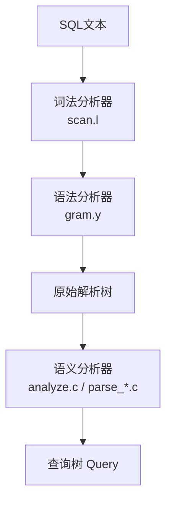
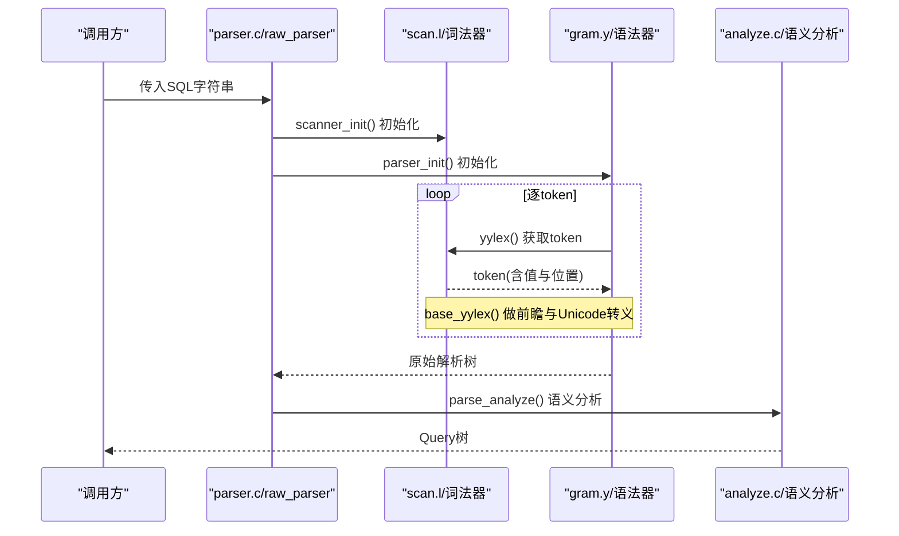
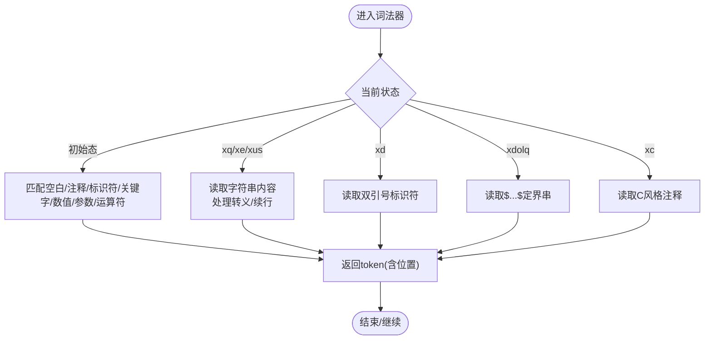
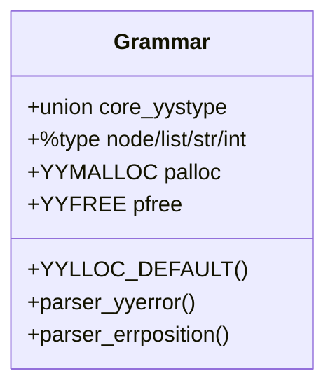
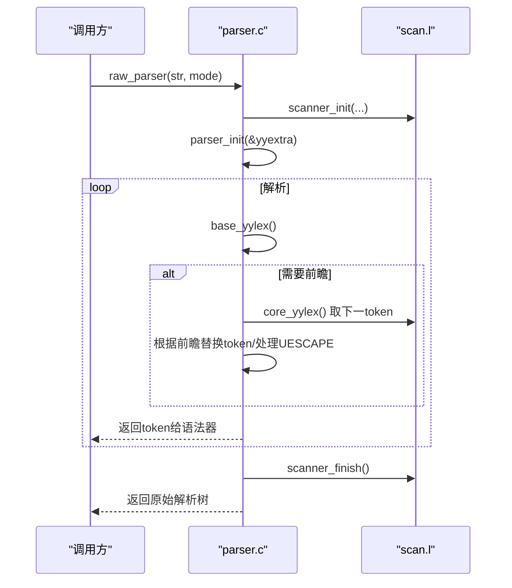
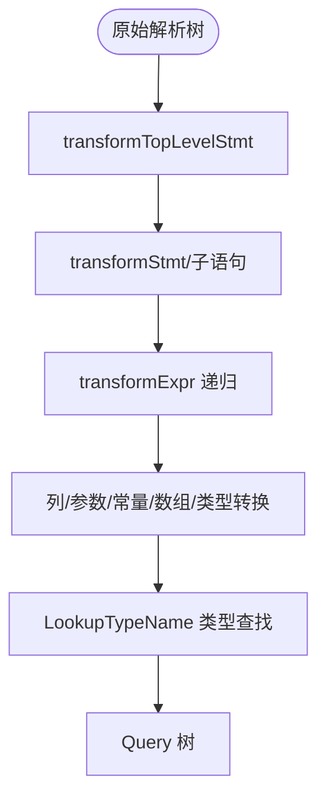
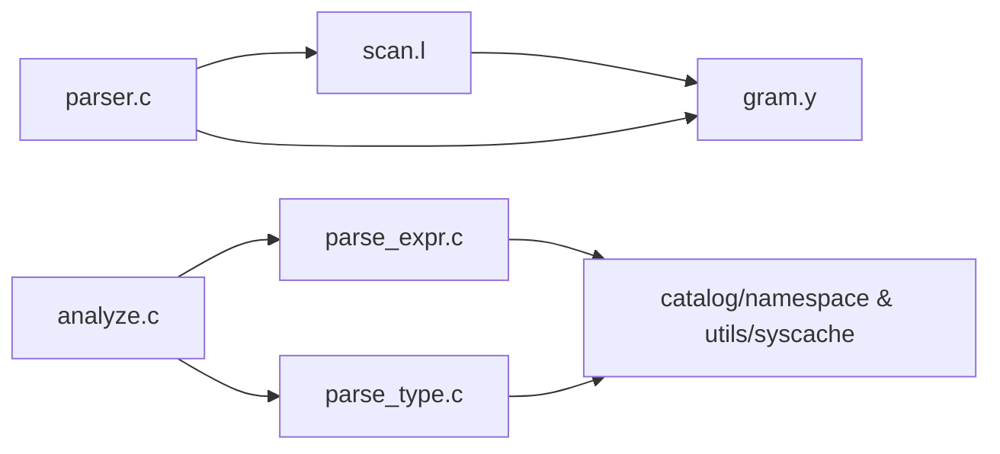

# SQL解析器

<cite>
**本文引用的文件**
- [src/backend/parser/README](file://src/backend/parser/README)
- [src/backend/parser/parser.c](file://src/backend/parser/parser.c)
- [src/backend/parser/scan.l](file://src/backend/parser/scan.l)
- [src/backend/parser/gram.y](file://src/backend/parser/gram.y)
- [src/backend/parser/analyze.c](file://src/backend/parser/analyze.c)
- [src/backend/parser/parse_expr.c](file://src/backend/parser/parse_expr.c)
- [src/backend/parser/parse_type.c](file://src/backend/parser/parse_type.c)
- [src/backend/parser/parse_node.c](file://src/backend/parser/parse_node.c)
</cite>

## 目录
1. [简介](#简介)
2. [项目结构](#项目结构)
3. [核心组件](#核心组件)
4. [架构总览](#架构总览)
5. [详细组件分析](#详细组件分析)
6. [依赖关系分析](#依赖关系分析)
7. [性能考量](#性能考量)
8. [故障排查指南](#故障排查指南)
9. [结论](#结论)
10. [附录](#附录)

## 简介
本文件为Mini PostgreSQL的SQL解析器提供系统化、可操作的技术文档。内容覆盖词法分析（token识别、关键字处理、错误恢复）、语法分析（Bison语法规则、语义动作、AST节点构建）、从原始SQL文本到抽象语法树的完整解析流程，以及类型检查、作用域分析与语义验证等语义分析步骤。同时给出解析器架构设计、错误处理策略与性能优化技巧，帮助开发者高效扩展与维护SQL解析功能。

## 项目结构
解析子系统位于 src/backend/parser，采用“词法分析 + 语法分析 + 语义分析”的分层架构：
- 词法分析：scan.l（Flex），负责将SQL文本切分为token，处理字符串、标识符、数字、运算符、注释、Unicode转义等。
- 语法分析：gram.y（Bison），定义SQL语法规则与语义动作，产出“原始解析树”。
- 入口驱动：parser.c，初始化扫描器与解析器，协调lookahead与Unicode转义等预处理。
- 语义分析：analyze.c 及 parse_*.c，将原始解析树转换为可优化的Query树，完成类型检查、作用域分析、函数/操作符解析等。

**章节来源**
- [src/backend/parser/README:1-33](file://src/backend/parser/README#L1-L33)

## 核心组件
- 词法分析器（scanner）
  - 状态机：支持多种独占状态（如xq、xe、xd、xdolq、xus等）以正确解析单引号串、E'...'、双引号标识符、$...$定界字符串、带Unicode转义的字符串/标识符等。
  - 关键字识别：通过ScanKeywordLookup匹配SQL关键字，返回对应token；非关键字标识符统一小写并截断。
  - 数值与参数：整数、浮点数、十六进制/位串常量、$n参数占位符。
  - 错误定位：基于yylloc与scanner_errposition在错误消息中精确定位。
- 语法分析器（parser）
  - Bison规则：声明union类型、%type标注、非终结符与终结符集合，构建原始解析树节点。
  - 位置跟踪：YYLLOC_DEFAULT简化位置记录，便于错误报告。
  - 内存管理：使用palloc/pfree替代malloc/free，避免解析异常时的内存泄漏。
- 入口与过滤器（parser.c）
  - raw_parser：初始化扫描器与解析器，调用base_yyparse，返回原始解析树。
  - base_yylex：实现多token前瞻（如NOT ... BETWEEN/IN/LIKE/ILIKE、NULLS FIRST/LAST、WITH TIME/ORDINALITY），并将UIDENT/USCONST转换为IDENT/SCONST，同时处理U&'' UESCAPE语法。
- 语义分析（analyze.c, parse_*.c）
  - transformTopLevelStmt：顶层语句转换，生成Query。
  - 表达式分析：transformExpr及其递归分发，完成列引用、参数、常量、数组、类型转换、排序/分组上下文中的表达式分析。
  - 类型查找：LookupTypeName/Extended，支持%schema.typename、%TYPE引用、数组类型推导与typmod计算。

**章节来源**
- [src/backend/parser/parser.c:34-82](file://src/backend/parser/parser.c#L34-L82)
- [src/backend/parser/parser.c:85-293](file://src/backend/parser/parser.c#L85-L293)
- [src/backend/parser/scan.l:162-200](file://src/backend/parser/scan.l#L162-L200)
- [src/backend/parser/scan.l:1012-1035](file://src/backend/parser/scan.l#L1012-L1035)
- [src/backend/parser/gram.y:65-108](file://src/backend/parser/gram.y#L65-L108)
- [src/backend/parser/analyze.c:86-128](file://src/backend/parser/analyze.c#L86-L128)
- [src/backend/parser/parse_expr.c:84-106](file://src/backend/parser/parse_expr.c#L84-L106)
- [src/backend/parser/parse_type.c:33-75](file://src/backend/parser/parse_type.c#L33-L75)

## 架构总览
解析器整体遵循“词法→语法→语义”的流水线，配合错误定位与内存管理，确保健壮性与可维护性。

**图表来源**
- [src/backend/parser/parser.c:41-82](file://src/backend/parser/parser.c#L41-L82)
- [src/backend/parser/parser.c:106-293](file://src/backend/parser/parser.c#L106-L293)
- [src/backend/parser/scan.l:1188-1224](file://src/backend/parser/scan.l#L1188-L1224)
- [src/backend/parser/gram.y:181-187](file://src/backend/parser/gram.y#L181-L187)
- [src/backend/parser/analyze.c:97-128](file://src/backend/parser/analyze.c#L97-L128)

## 详细组件分析

### 词法分析器（scan.l）
- 状态机与模式
  - 支持多种独占状态：xb（位串）、xc（C风格注释）、xd（双引号标识符）、xh（十六进制）、xq（标准单引号串）、xqs（续行检测）、xe（E'...'扩展串）、xdolq（$...$定界串）、xui/xus（带Unicode转义的标识符/字符串）、xeu（UTF-16代理对）。
  - 通过BEGIN/状态切换保证无回溯匹配，提升性能。
- 关键字与标识符
  - 标识符先尝试关键字匹配，失败则转为小写并截断至NAMEDATALEN。
- 数值与参数
  - 整数/小数/科学计数法；失败回退（如decimalfail/realfail）避免回溯。
  - $n参数直接解析为PARAM。
- Unicode与转义
  - xus/xui支持U&'' UESCAPE语法，校验转义序列与代理对。
  - xe状态处理\octal、\xhex、\uXXXX/\UXXXXXXXX等。
- 错误处理
  - 未终止字符串/注释/标识符时触发错误，附带精确位置。
  - 非法转义或非法Unicode码点抛出明确错误信息。

**图表来源**
- [src/backend/parser/scan.l:162-200](file://src/backend/parser/scan.l#L162-L200)
- [src/backend/parser/scan.l:418-800](file://src/backend/parser/scan.l#L418-L800)
- [src/backend/parser/scan.l:800-1047](file://src/backend/parser/scan.l#L800-L1047)

**章节来源**
- [src/backend/parser/scan.l:162-200](file://src/backend/parser/scan.l#L162-L200)
- [src/backend/parser/scan.l:418-800](file://src/backend/parser/scan.l#L418-L800)
- [src/backend/parser/scan.l:800-1047](file://src/backend/parser/scan.l#L800-L1047)
- [src/backend/parser/scan.l:1049-1430](file://src/backend/parser/scan.l#L1049-L1430)

### 语法分析器（gram.y）
- 规则与类型
  - 通过%union定义联合类型，%type标注各非终结符的返回值类型（node/list/str/int等）。
  - 大量%type声明覆盖DDL/DML/事务/变量等语句类别。
- 位置与内存
  - YYLLOC_DEFAULT仅记录起始位置，减少开销。
  - 使用palloc/pfree替换默认分配器，避免解析异常导致的内存泄漏。
- 错误与调试
  - 自定义parser_yyerror与parser_errposition，统一错误上报。
  - 可通过启用YYDEBUG进行调试（生产环境通常关闭）。

**图表来源**
- [src/backend/parser/gram.y:189-228](file://src/backend/parser/gram.y#L189-L228)
- [src/backend/parser/gram.y:65-108](file://src/backend/parser/gram.y#L65-L108)
- [src/backend/parser/gram.y:131-178](file://src/backend/parser/gram.y#L131-L178)

**章节来源**
- [src/backend/parser/gram.y:181-187](file://src/backend/parser/gram.y#L181-L187)
- [src/backend/parser/gram.y:189-228](file://src/backend/parser/gram.y#L189-L228)
- [src/backend/parser/gram.y:65-108](file://src/backend/parser/gram.y#L65-L108)
- [src/backend/parser/gram.y:131-178](file://src/backend/parser/gram.y#L131-L178)

### 入口与过滤器（parser.c）
- raw_parser
  - 初始化flex扫描器与bison解析器，设置lookahead模式，调用base_yyparse，清理资源并返回原始解析树。
- base_yylex
  - 实现关键的多token前瞻：NOT ... (BETWEEN/IN/LIKE/ILIKE)、NULLS_P ... (FIRST/LAST)、WITH ... (TIME/ORDINALITY)。
  - 将UIDENT/USCONST转换为IDENT/SCONST，并处理U&'' UESCAPE序列，执行Unicode转义与标识符截断。

**图表来源**
- [src/backend/parser/parser.c:41-82](file://src/backend/parser/parser.c#L41-L82)
- [src/backend/parser/parser.c:106-293](file://src/backend/parser/parser.c#L106-L293)
- [src/backend/parser/scan.l:1188-1224](file://src/backend/parser/scan.l#L1188-L1224)

**章节来源**
- [src/backend/parser/parser.c:34-82](file://src/backend/parser/parser.c#L34-L82)
- [src/backend/parser/parser.c:85-293](file://src/backend/parser/parser.c#L85-L293)

### 语义分析（analyze.c, parse_expr.c, parse_type.c）
- 顶层转换
  - parse_analyze/parse_sub_analyze：创建ParseState，调用transformTopLevelStmt/transformStmt，生成Query。
  - 支持固定/可变参数类型推断与校验。
- 表达式分析
  - transformExpr：按表达式种类分派，处理列引用、参数、常量、数组、类型转换、排序/分组上下文等。
  - 递归保护：check_stack_depth防止过深表达式导致栈溢出。
- 类型查找与作用域
  - LookupTypeName/Extended：支持schema限定名、%TYPE引用、数组类型推导、temp schema控制与typmod计算。
  - 错误定位：setup_parser_errposition_callback确保错误消息包含准确位置。

**图表来源**
- [src/backend/parser/analyze.c:97-128](file://src/backend/parser/analyze.c#L97-L128)
- [src/backend/parser/parse_expr.c:84-106](file://src/backend/parser/parse_expr.c#L84-L106)
- [src/backend/parser/parse_type.c:33-75](file://src/backend/parser/parse_type.c#L33-L75)
- [src/backend/parser/parse_node.c:128-165](file://src/backend/parser/parse_node.c#L128-L165)

**章节来源**
- [src/backend/parser/analyze.c:86-128](file://src/backend/parser/analyze.c#L86-L128)
- [src/backend/parser/parse_expr.c:84-106](file://src/backend/parser/parse_expr.c#L84-L106)
- [src/backend/parser/parse_type.c:33-75](file://src/backend/parser/parse_type.c#L33-L75)
- [src/backend/parser/parse_node.c:128-165](file://src/backend/parser/parse_node.c#L128-L165)

## 依赖关系分析
- 模块耦合
  - scan.l 与 gram.y 通过token接口耦合；parser.c作为调度层桥接两者。
  - analyze.c 依赖多个parse_*.c完成特定领域的语义分析（表达式、类型、关系、目标列等）。
- 外部依赖
  - 关键字表：parser/kwlist.h（由scan.l包含），用于关键字识别。
  - 系统缓存/命名空间：类型查找依赖catalog/namespace与utils/syscache。
- 循环依赖
  - 解析阶段避免数据库访问与可变状态，降低循环依赖风险；复杂语义在analyze阶段再访问系统目录。

**图表来源**
- [src/backend/parser/scan.l:1188-1224](file://src/backend/parser/scan.l#L1188-L1224)
- [src/backend/parser/gram.y:181-187](file://src/backend/parser/gram.y#L181-L187)
- [src/backend/parser/analyze.c:25-53](file://src/backend/parser/analyze.c#L25-L53)
- [src/backend/parser/parse_type.c:15-27](file://src/backend/parser/parse_type.c#L15-L27)

**章节来源**
- [src/backend/parser/analyze.c:25-53](file://src/backend/parser/analyze.c#L25-L53)
- [src/backend/parser/parse_type.c:15-27](file://src/backend/parser/parse_type.c#L15-L27)

## 性能考量
- 词法器无回溯设计：scan.l刻意避免backtrack，提升扫描速度。
- 多token前瞻集中处理：parser.c的base_yylex将复杂前瞻逻辑集中在单一层，保持grammar为LALR(1)，降低冲突与回溯。
- 内存分配：gram.y使用palloc/pfree，避免解析异常时的内存泄漏；scanner_init/literalbuf按需扩容，减少频繁分配。
- 表达式深度保护：transformExprRecurse调用check_stack_depth，防止恶意或极深表达式导致栈溢出。
- 关键字查找：ScanKeywordLookup使用高效查找表，减少标识符匹配开销。

[本节为通用指导，不直接分析具体文件]

## 故障排查指南
- 常见错误与定位
  - 未终止字符串/注释/标识符：scanner_yyerror结合lexer_errposition输出精确位置。
  - 非法转义/Unicode：在scan.l中针对xe/xus/xeu状态抛出明确错误，附带提示。
  - 关键字误用/保留字冲突：gram.y中通过关键字分类与reserved/non-reserved规则约束。
- 调试建议
  - 临时启用YYDEBUG观察归约过程（gram.y顶部注释）。
  - 使用setup_scanner_errposition_callback/setup_parser_errposition_callback包裹可能抛错的函数调用，确保错误位置准确。
- 常见问题定位路径
  - 字符串/Unicode问题：优先检查scan.l中xq/xe/xus/xus相关规则与str_udeescape处理。
  - 表达式类型错误：查看parse_expr.c中transformExpr分支与parse_type.c的类型查找逻辑。
  - 关键字识别问题：确认kwlist.h与ScanKeywordTokens一致性。

**章节来源**
- [src/backend/parser/scan.l:1150-1182](file://src/backend/parser/scan.l#L1150-L1182)
- [src/backend/parser/scan.l:125-135](file://src/backend/parser/scan.l#L125-L135)
- [src/backend/parser/parse_node.c:128-165](file://src/backend/parser/parse_node.c#L128-L165)
- [src/backend/parser/gram.y:21-44](file://src/backend/parser/gram.y#L21-L44)

## 结论
Mini PostgreSQL的SQL解析器采用经典的三层架构，词法器专注高效、健壮的token化，语法器以Bison规则表达SQL语法并构建原始解析树，语义分析器完成类型检查、作用域分析与查询树生成。通过前瞻过滤、Unicode转义、错误定位与内存管理优化，系统在正确性、可维护性与性能之间取得良好平衡。扩展新特性时，建议在scan.l中添加相应token与状态，在gram.y中补充规则与语义动作，并在对应的parse_*.c中实现语义验证与转换。

[本节为总结，不直接分析具体文件]

## 附录
- 术语
  - AST：抽象语法树，此处指原始解析树（raw parsetree）。
  - Query树：语义分析后的可优化查询表示。
  - 前瞻：为维持LALR(1)而进行的额外token读取与规则替换。
- 参考路径
  - 词法器：src/backend/parser/scan.l
  - 语法器：src/backend/parser/gram.y
  - 入口驱动：src/backend/parser/parser.c
  - 语义分析：src/backend/parser/analyze.c 与各parse_*.c

[本节为附加说明，不直接分析具体文件]