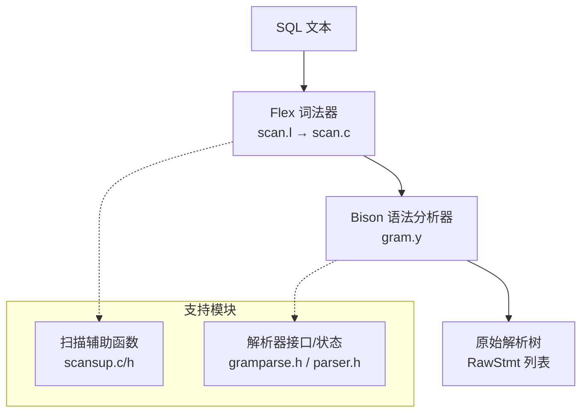
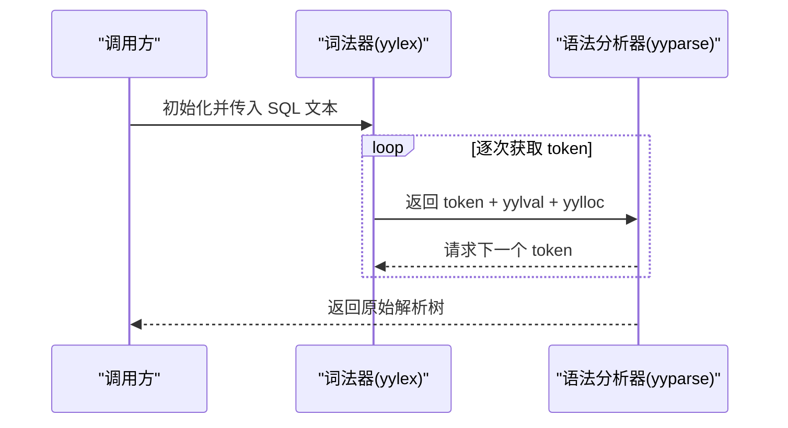
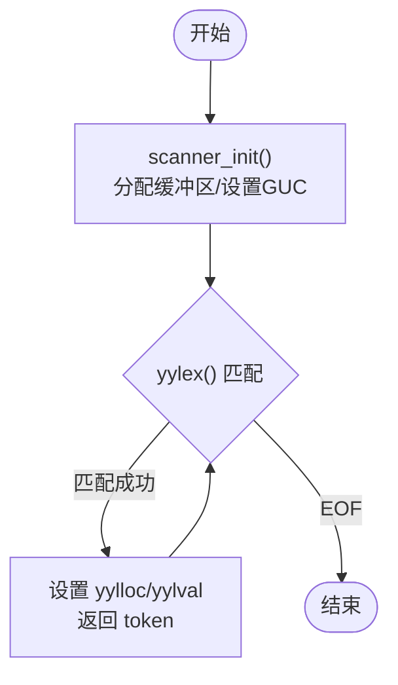
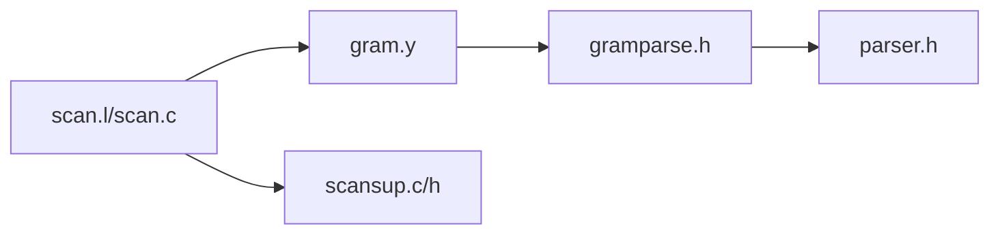

# 词法分析器

<cite>
**本文引用的文件**
- [scan.l](file://src/backend/parser/scan.l)
- [scan.c](file://src/backend/parser/scan.c)
- [gram.y](file://src/backend/parser/gram.y)
- [scansup.c](file://src/backend/parser/scansup.c)
- [scansup.h](file://src/include/parser/scansup.h)
- [gramparse.h](file://src/include/parser/gramparse.h)
- [parser.h](file://src/include/parser/parser.h)
</cite>

## 目录
1. [简介](#简介)
2. [项目结构](#项目结构)
3. [核心组件](#核心组件)
4. [架构总览](#架构总览)
5. [详细组件分析](#详细组件分析)
6. [依赖关系分析](#依赖关系分析)
7. [性能考量](#性能考量)
8. [故障排查指南](#故障排查指南)
9. [结论](#结论)
10. [附录](#附录)

## 简介
本文件为 Mini PostgreSQL 的词法分析器提供完整技术文档，聚焦于基于 Flex 的核心 SQL 词法分析器。内容涵盖：
- 从原始字符流到 token 序列的扫描过程
- Token 识别机制、关键字处理与特殊字符处理
- 标识符、常量、运算符、分隔符等 token 类型的定义与识别规则
- 错误恢复机制与位置跟踪
- 注释、字符串字面量（含 Unicode 转义）、数字字面量的处理
- 配置选项、性能优化技巧与调试方法

该词法分析器是 SQL 解析的第一阶段，为后续语法分析提供稳定、高效的 token 流。

## 项目结构
Mini PostgreSQL 的词法分析相关代码主要位于后端解析器目录中，由 Flex 源文件生成 C 实现，并与 Bison 语法文件协作完成“词法+语法”的原始解析流程。

图表来源
- [scan.l:1-1430](file://src/backend/parser/scan.l#L1-L1430)
- [scan.c:1-800](file://src/backend/parser/scan.c#L1-L800)
- [gram.y:1-200](file://src/backend/parser/gram.y#L1-L200)
- [scansup.c:1-128](file://src/backend/parser/scansup.c#L1-L128)
- [gramparse.h:1-76](file://src/include/parser/gramparse.h#L1-L76)
- [parser.h:1-58](file://src/include/parser/parser.h#L1-L58)

章节来源
- [scan.l:1-1430](file://src/backend/parser/scan.l#L1-L1430)
- [scan.c:1-800](file://src/backend/parser/scan.c#L1-L800)
- [gram.y:1-200](file://src/backend/parser/gram.y#L1-L200)
- [scansup.c:1-128](file://src/backend/parser/scansup.c#L1-L128)
- [gramparse.h:1-76](file://src/include/parser/gramparse.h#L1-L76)
- [parser.h:1-58](file://src/include/parser/parser.h#L1-L58)

## 核心组件
- Flex 词法器（scan.l/scan.c）：将 SQL 文本切分为 token，维护状态机与缓冲区，负责定位、错误上报、内存管理。
- 扫描辅助（scansup.c/h）：提供标识符大小写转换、截断、空白判断等工具。
- 语法分析器（gram.y）：消费 token 构建原始解析树；与词法器通过 yylex/yylval/yylloc 协作。
- 解析接口（gramparse.h/parser.h）：暴露 raw_parser 入口、GUC 变量、解析模式等。

章节来源
- [scan.l:1-1430](file://src/backend/parser/scan.l#L1-L1430)
- [scansup.c:1-128](file://src/backend/parser/scansup.c#L1-L128)
- [gram.y:1-200](file://src/backend/parser/gram.y#L1-L200)
- [gramparse.h:1-76](file://src/include/parser/gramparse.h#L1-L76)
- [parser.h:1-58](file://src/include/parser/parser.h#L1-L58)

## 架构总览
词法器采用无回溯设计，通过 exclusive states（独占状态）处理复杂字面量与注释，确保匹配最长且优先的规则，避免回退带来的性能损耗。Bison 语法分析器在收到 token 后继续构建 AST。

图表来源
- [scan.l:1042-1045](file://src/backend/parser/scan.l#L1042-L1045)
- [gram.y:181-187](file://src/backend/parser/gram.y#L181-L187)

章节来源
- [scan.l:1042-1045](file://src/backend/parser/scan.l#L1042-L1045)
- [gram.y:181-187](file://src/backend/parser/gram.y#L181-L187)

## 详细组件分析

### 词法器状态机与规则组织
- 使用 exclusive states 区分不同上下文：位串(xb)、C风格注释(xc)、双引号标识符(xd)、十六进制串(xh)、标准单引号串(xq)、续行检测(xqs)、带反斜杠转义的扩展串(xe)、美元符定界串(xdolq)、Unicode 标识符(xui)、Unicode 字符串(xus)、UTF-16 代理对(xeu)。
- 规则遵循“最长匹配优先、同长取先”的原则，并通过 yyless() 将多余字符退回，保证无回溯。
- 位置跟踪通过 SET_YYLLOC/ADVANCE_YYLLOC/PUSH_YYLLOC/POP_YYLLOC 宏维护 yylloc，使错误信息能精确指向出错位置。

章节来源
- [scan.l:162-200](file://src/backend/parser/scan.l#L162-L200)
- [scan.l:219-401](file://src/backend/parser/scan.l#L219-L401)
- [scan.l:418-800](file://src/backend/parser/scan.l#L418-L800)

### Token 类型与识别规则
- 空白与注释
  - 空白：空格、制表符、换行、回车、换页；以及以 -- 开头的行注释。
  - C 风格注释：/* ... */，支持嵌套计数 xcdepth，遇到 EOF 报错。
- 标识符
  - 普通标识符：字母或下划线开头，可包含字母、数字、$；若命中关键字则返回对应关键字 token，否则转为小写并可能截断至 NAMEDATALEN-1。
  - 双引号标识符："..."，允许嵌入空格与特殊字符；空标识符报错；长度超限截断。
  - Unicode 标识符：U&"..."，需开启 standard_conforming_strings，否则报错。
- 字符串字面量
  - 标准单引号串 '...'：根据 standard_conforming_strings 决定进入 xq 或 xe 状态。
  - 扩展串 E'...'：支持 \n, \t, \r, \f, \b, \\, \' 及八进制/十六进制/Unicode 转义；首次出现非标准转义时发出警告；非法 Unicode 代理对或格式错误时报错。
  - 美元符定界串 $tag$...$tag$：原样保留，不转义；标签可为空或以标识符形式出现；未闭合报错。
  - 位串与十六进制串：B'...' 与 X'...'，分别标记为二进制与十六进制常量。
  - 国家字符：N'...'，作为普通字符串但前缀 NCHAR 关键字。
- 数字与参数
  - 整数：digits；溢出或含小数点时降级为浮点。
  - 浮点数：含小数点或科学计数法；失败分支退回部分输入重试。
  - 参数占位符：$integer，返回 PARAM 并填充序号。
- 运算符与分隔符
  - 单字符分隔符：逗号、括号、方括号、点、分号、冒号、加减乘除、百分号、异或、小于等于、大于等于、不等于、不等于(<>和!=)、类型转换(::)、点范围(..)、赋值(:=)、箭头(=>)等。
  - 多字符运算符：按 op_chars 集合匹配，必要时剔除尾部 +/- 以保证 SQL 兼容；超长运算符报错。

章节来源
- [scan.l:219-401](file://src/backend/parser/scan.l#L219-L401)
- [scan.l:418-800](file://src/backend/parser/scan.l#L418-L800)
- [scan.l:801-1045](file://src/backend/parser/scan.l#L801-L1045)

### 关键字处理
- 通过 ScanKeywordLookup 在 keywordlist 中查找；命中则返回对应的关键字 token。
- 关键字映射表由 kwlist.h 生成，ScanKeywordTokens[] 将零基索引映射到 Bison token 编号。

章节来源
- [scan.l:69-82](file://src/backend/parser/scan.l#L69-L82)
- [scan.l:1012-1035](file://src/backend/parser/scan.l#L1012-L1035)

### 错误恢复与位置跟踪
- 位置跟踪：每个 token 开始时设置 yylloc；内部子规则可使用 PUSH/POP 保存/恢复位置，以便错误指针指向合适位置。
- 错误上报：scanner_yyerror 统一封装 ereport，附带 lexer_errposition；EOF 处错误提示“在输入末尾”。
- 回调机制：setup_scanner_errposition_callback/cancel_scanner_errposition_callback 在非词法器函数抛错时也能附加位置信息。
- 常见错误：未终止注释/字符串、非法 Unicode 转义、零长度标识符、运算符过长等。

章节来源
- [scan.l:96-135](file://src/backend/parser/scan.l#L96-L135)
- [scan.l:457-460](file://src/backend/parser/scan.l#L457-L460)
- [scan.l:717-718](file://src/backend/parser/scan.l#L717-L718)
- [scan.l:762-763](file://src/backend/parser/scan.l#L762-L763)
- [scan.l:778-785](file://src/backend/parser/scan.l#L778-L785)
- [scan.l:801-812](file://src/backend/parser/scan.l#L801-L812)
- [scan.l:962-967](file://src/backend/parser/scan.l#L962-L967)
- [scan.l:1067-1182](file://src/backend/parser/scan.l#L1067-L1182)

### 配置选项
- backslash_quote：控制 E'...' 中 \' 的安全性检查；客户端编码仅用时禁止不安全用法。
- escape_string_warning：是否在首次遇到非标准转义时发出警告。
- standard_conforming_strings：是否启用标准符合的单引号串语义；关闭时默认进入扩展串模式。
- 这些 GUC 在 scanner_init 中复制到扫描器额外状态，影响字符串与转义行为。

章节来源
- [scan.l:59-68](file://src/backend/parser/scan.l#L59-L68)
- [scan.l:1188-1224](file://src/backend/parser/scan.l#L1188-L1224)
- [parser.h:36-47](file://src/include/parser/parser.h#L36-L47)

### 扫描流程与数据缓冲
- 初始化：scanner_init 创建扫描缓冲区（追加两个结束符），设置关键字列表与 GUC，分配字面量缓冲区。
- 扫描循环：yylex 匹配规则，更新 yylloc，构造 yylval，返回 token；遇到 EOF 终止。
- 清理：scanner_finish 释放大对象缓冲，避免频繁分配开销。

图表来源
- [scan.l:1188-1224](file://src/backend/parser/scan.l#L1188-L1224)
- [scan.l:1042-1045](file://src/backend/parser/scan.l#L1042-L1045)
- [scan.l:1230-1247](file://src/backend/parser/scan.l#L1230-L1247)

章节来源
- [scan.l:1188-1247](file://src/backend/parser/scan.l#L1188-L1247)

### 数字与字符串处理细节
- 整数与浮点：process_integer_literal 尝试解析整数，失败则降级为浮点；decimalfail/realfail1/realfail2 通过 yyless 退回部分输入以正确分类。
- 字符串转义：xe 状态支持多种转义序列；unescape_single_char 处理基本控制字符；addunicode 将 Unicode 码点转换为服务器编码；非法值或代理对错误立即上报。
- 字节/高位标志：当转义产生空字符或高位集字符时，标记 saw_non_ascii，用于后续校验。

章节来源
- [scan.l:1304-1320](file://src/backend/parser/scan.l#L1304-L1320)
- [scan.l:1322-1363](file://src/backend/parser/scan.l#L1322-L1363)
- [scan.l:617-716](file://src/backend/parser/scan.l#L617-L716)

### 标识符规范化与截断
- downcase_truncate_identifier/downcase_identifier：进行大小写归一化与可选截断；对多字节编码做安全处理。
- truncate_identifier：按 NAMEDATALEN-1 截断，必要时发出 NOTICE。

章节来源
- [scansup.c:23-105](file://src/backend/parser/scansup.c#L23-L105)
- [scansup.h:17-25](file://src/include/parser/scansup.h#L17-L25)

## 依赖关系分析
词法器与语法分析器通过 yylex/yylval/yylloc 紧密耦合；扫描辅助函数被词法器调用；解析接口对外暴露 raw_parser 与 GUC。

图表来源
- [scan.l:1-1430](file://src/backend/parser/scan.l#L1-L1430)
- [gram.y:1-200](file://src/backend/parser/gram.y#L1-L200)
- [scansup.c:1-128](file://src/backend/parser/scansup.c#L1-L128)
- [gramparse.h:1-76](file://src/include/parser/gramparse.h#L1-L76)
- [parser.h:1-58](file://src/include/parser/parser.h#L1-L58)

章节来源
- [scan.l:1-1430](file://src/backend/parser/scan.l#L1-L1430)
- [gram.y:1-200](file://src/backend/parser/gram.y#L1-L200)
- [scansup.c:1-128](file://src/backend/parser/scansup.c#L1-L128)
- [gramparse.h:1-76](file://src/include/parser/gramparse.h#L1-L76)
- [parser.h:1-58](file://src/include/parser/parser.h#L1-L58)

## 性能考量
- 无回溯设计：规则组织避免 flex 回溯，提升扫描速度。
- 状态机优化：独占状态减少规则冲突与匹配成本。
- 内存管理：使用 palloc/repalloc/pfree 统一管理；大缓冲延迟释放以减少分配次数。
- 缓冲区策略：扫描缓冲区追加结束符，避免边界检查；字面量缓冲按需扩容。
- 字符集处理：仅在必要时进行 Unicode 转换与校验，降低开销。

[本节为通用性能讨论，无需特定文件引用]

## 故障排查指南
- 常见问题
  - 未终止注释/字符串：检查 /* ... */ 或 '...'/$tag$...$tag$ 是否闭合。
  - 非法 Unicode 转义：确认 \uXXXX/\UXXXXXXXX 格式与代理对配对。
  - 零长度标识符：双引号标识符不能为空。
  - 运算符过长：超过 NAMEDATALEN-1 会报错。
- 定位技巧
  - 利用 yylloc 与 scanner_errposition 精确定位错误位置。
  - 通过 setup_scanner_errposition_callback 为非词法器函数的错误附加位置。
  - 关注 escape_string_warning 与 backslash_quote 配置对字符串转义的影响。

章节来源
- [scan.l:457-460](file://src/backend/parser/scan.l#L457-L460)
- [scan.l:717-718](file://src/backend/parser/scan.l#L717-L718)
- [scan.l:762-763](file://src/backend/parser/scan.l#L762-L763)
- [scan.l:778-785](file://src/backend/parser/scan.l#L778-L785)
- [scan.l:962-967](file://src/backend/parser/scan.l#L962-L967)
- [scan.l:1067-1182](file://src/backend/parser/scan.l#L1067-L1182)

## 结论
Mini PostgreSQL 的词法分析器通过严谨的状态机设计与无回溯规则组织，实现了高效、稳定的 SQL 文本扫描。其完善的错误定位、灵活的字符串与数字处理、以及对关键字与特殊字符的细致支持，为上层语法分析与执行提供了坚实基础。合理配置 GUC 与遵循最佳实践，可进一步提升性能与可维护性。

[本节为总结性内容，无需特定文件引用]

## 附录
- 术语
  - 词法器：将字符流转换为 token 序列的程序。
  - 语法分析器：消费 token 构建抽象语法树的程序。
  - GUC：全局用户配置项。
- 参考路径
  - 词法器源文件：src/backend/parser/scan.l
  - 生成的 C 实现：src/backend/parser/scan.c
  - 语法文件：src/backend/parser/gram.y
  - 扫描辅助：src/backend/parser/scansup.c, src/include/parser/scansup.h
  - 解析接口：src/include/parser/gramparse.h, src/include/parser/parser.h

[本节为附录说明，无需特定文件引用]