# 语义分析

<cite>
**本文引用的文件**
- [analyze.c](file://src/backend/parser/analyze.c)
- [parse_expr.c](file://src/backend/parser/parse_expr.c)
- [parse_type.c](file://src/backend/parser/parse_type.c)
- [parse_func.c](file://src/backend/parser/parse_func.c)
- [parse_oper.c](file://src/backend/parser/parse_oper.c)
- [parse_coerce.c](file://src/backend/parser/parse_coerce.c)
- [parse_clause.c](file://src/backend/parser/parse_clause.c)
- [parse_target.c](file://src/backend/parser/parse_target.c)
- [parse_node.h](file://src/include/parser/parse_node.h)
</cite>

## 目录
1. [简介](#简介)
2. [项目结构](#项目结构)
3. [核心组件](#核心组件)
4. [架构总览](#架构总览)
5. [详细组件分析](#详细组件分析)
6. [依赖关系分析](#依赖关系分析)
7. [性能考虑](#性能考虑)
8. [故障排查指南](#故障排查指南)
9. [结论](#结论)
10. [附录](#附录)

## 简介
本文件面向 Mini PostgreSQL 的 SQL 语义分析子系统，系统化阐述从语法树到语义树的转换过程，覆盖符号表与作用域、类型推导与转换、函数与操作符解析、表达式求值规则、语义错误检测与处理、性能优化策略与调试技巧。文档以源码为依据，提供可追溯的代码级引用与图示，帮助读者理解并维护 SQL 语义分析功能。

## 项目结构
语义分析位于后端解析器模块（backend/parser），由多个职责清晰的子模块组成：
- 顶层入口与语句分发：analyze.c
- 表达式语义化：parse_expr.c
- 类型查找与校验：parse_type.c
- 函数/聚合解析：parse_func.c
- 操作符解析：parse_oper.c
- 类型转换与强制：parse_coerce.c
- FROM/JOIN/USING 等子句语义：parse_clause.c
- 目标列展开与命名：parse_target.c
- 解析状态结构定义：parse_node.h

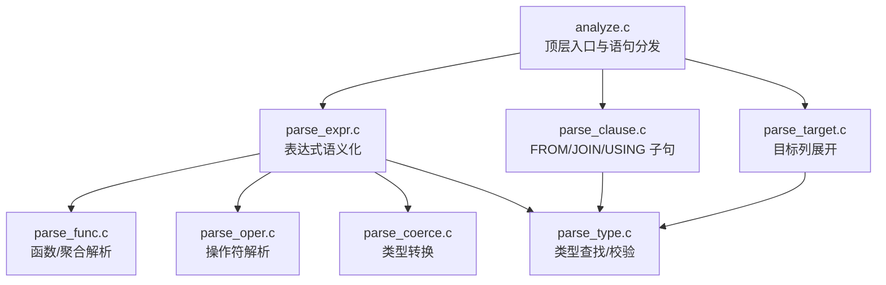

图表来源
- [analyze.c:97-128](file://src/backend/parser/analyze.c#L97-L128)
- [parse_expr.c:84-106](file://src/backend/parser/parse_expr.c#L84-L106)
- [parse_clause.c:106-146](file://src/backend/parser/parse_clause.c#L106-L146)
- [parse_target.c:76-111](file://src/backend/parser/parse_target.c#L76-L111)
- [parse_func.c:89-141](file://src/backend/parser/parse_func.c#L89-L141)
- [parse_oper.c:671-776](file://src/backend/parser/parse_oper.c#L671-L776)
- [parse_coerce.c:77-131](file://src/backend/parser/parse_coerce.c#L77-L131)
- [parse_type.c:37-43](file://src/backend/parser/parse_type.c#L37-L43)

章节来源
- [analyze.c:97-128](file://src/backend/parser/analyze.c#L97-L128)
- [parse_node.h:162-204](file://src/include/parser/parse_node.h#L162-L204)

## 核心组件
- 解析状态 ParseState：贯穿整个语义分析，维护范围表、命名空间、表达式上下文、标志位与钩子。
- 表达式转换器 transformExpr：将语法节点递归转换为带类型信息的表达式树，完成作用域解析、函数/操作符解析、类型检查与转换。
- 类型系统：LookupTypeName/typenameType 等负责类型名解析、数组类型、%TYPE 引用、typmod 计算与校验。
- 函数解析：ParseFuncOrColumn 统一处理函数调用与列投影歧义，支持聚合、窗口、可变参数、默认参数、多态一致性。
- 操作符解析：oper/left_oper/make_op 负责二元/一元操作符选择、候选消歧、类型兼容性与转换。
- 类型转换：coerce_to_target_type/coerce_type/coerce_type_typmod 实现隐式/显式转换、域约束、长度约束与 RelabelType 标注。
- 子句与目标列：transformFromClause 构建命名空间；transformTargetList 展开 * 与生成列别名。

章节来源
- [parse_node.h:162-204](file://src/include/parser/parse_node.h#L162-L204)
- [parse_expr.c:84-106](file://src/backend/parser/parse_expr.c#L84-L106)
- [parse_type.c:37-43](file://src/backend/parser/parse_type.c#L37-L43)
- [parse_func.c:89-141](file://src/backend/parser/parse_func.c#L89-L141)
- [parse_oper.c:671-776](file://src/backend/parser/parse_oper.c#L671-L776)
- [parse_coerce.c:77-131](file://src/backend/parser/parse_coerce.c#L77-L131)
- [parse_clause.c:106-146](file://src/backend/parser/parse_clause.c#L106-L146)
- [parse_target.c:122-189](file://src/backend/parser/parse_target.c#L122-L189)

## 架构总览
语义分析的主流程由 analyze.c 驱动，按语句类型分派到具体转换器，最终产出 Query 树。表达式在 parse_expr.c 中递归转换，期间调用类型、函数、操作符与转换模块，形成带类型与绑定信息的语义树。

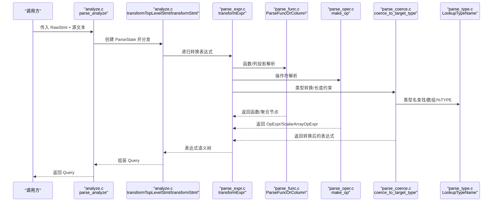

图表来源
- [analyze.c:97-128](file://src/backend/parser/analyze.c#L97-L128)
- [parse_expr.c:84-106](file://src/backend/parser/parse_expr.c#L84-L106)
- [parse_func.c:89-141](file://src/backend/parser/parse_func.c#L89-L141)
- [parse_oper.c:671-776](file://src/backend/parser/parse_oper.c#L671-L776)
- [parse_coerce.c:77-131](file://src/backend/parser/parse_coerce.c#L77-L131)
- [parse_type.c:37-43](file://src/backend/parser/parse_type.c#L37-L43)

## 详细组件分析

### 顶层分析与语句分发（analyze.c）
- 入口 parse_analyze：初始化 ParseState，设置参数类型与环境，调用 transformTopLevelStmt 进行语句分发，必要时生成查询 ID 并触发 post_parse_analyze_hook。
- transformStmt：根据语句节点类型分派到 INSERT/DELETE/UPDATE/SELECT/RETURN 等专用转换器；非优化语句包装为 CMD_UTILITY。
- 辅助：stmt_requires_parse_analysis、analyze_requires_snapshot 用于判断是否需要完整分析与快照。

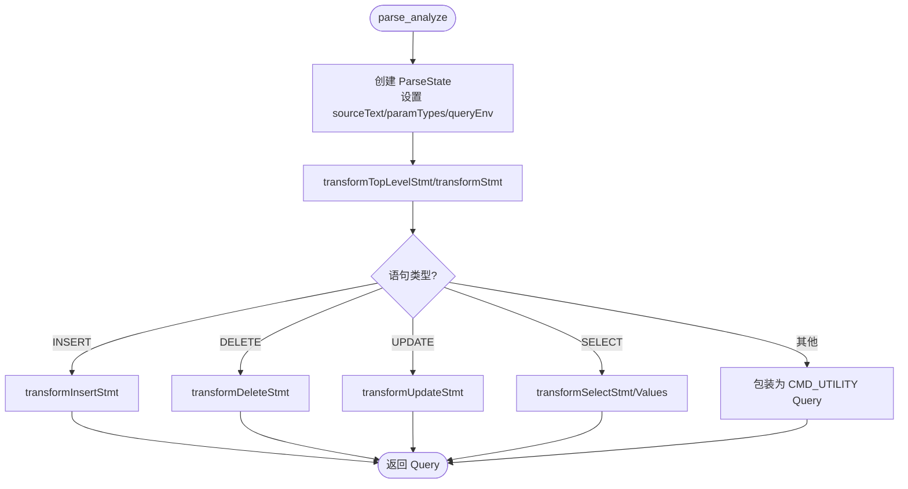

图表来源
- [analyze.c:97-128](file://src/backend/parser/analyze.c#L97-L128)
- [analyze.c:232-323](file://src/backend/parser/analyze.c#L232-L323)

章节来源
- [analyze.c:97-128](file://src/backend/parser/analyze.c#L97-L128)
- [analyze.c:232-323](file://src/backend/parser/analyze.c#L232-L323)

### 表达式语义化（parse_expr.c）
- transformExpr：保存/恢复 p_expr_kind，调用内部递归器 transformExprRecurse。
- transformExprRecurse：按节点类型分派，如 ColumnRef、ParamRef、A_Const、A_Indirection、A_ArrayExpr、TypeCast、CollateClause、A_Expr（含操作符、IN、BETWEEN、DISTINCT、NULLIF）、BoolExpr、FuncCall、MultiAssignRef、GroupingFunc、SubLink、CaseExpr、RowExpr、CoalesceExpr、MinMaxExpr、SQLValueFunction、NullTest、BooleanTest、CurrentOfExpr 等。
- 关键语义：
  - 列引用解析：通过命名空间与范围表解析，支持 A.B.C.D 形式与整行引用。
  - 下标与字段访问：分离字段选择与下标，调用容器下标转换。
  - 函数/列投影歧义：委托 ParseFuncOrColumn。
  - 类型转换：TypeCast 节点交由类型转换模块。
  - 集合返回函数位置检查：check_srf_call_placement。

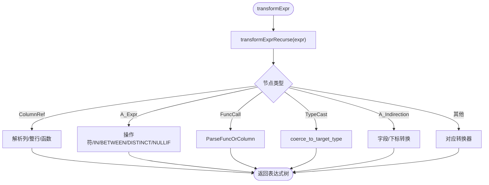

图表来源
- [parse_expr.c:84-106](file://src/backend/parser/parse_expr.c#L84-L106)
- [parse_expr.c:108-304](file://src/backend/parser/parse_expr.c#L108-L304)
- [parse_expr.c:358-423](file://src/backend/parser/parse_expr.c#L358-L423)
- [parse_expr.c:430-800](file://src/backend/parser/parse_expr.c#L430-L800)

章节来源
- [parse_expr.c:84-106](file://src/backend/parser/parse_expr.c#L84-L106)
- [parse_expr.c:108-304](file://src/backend/parser/parse_expr.c#L108-L304)
- [parse_expr.c:358-423](file://src/backend/parser/parse_expr.c#L358-L423)
- [parse_expr.c:430-800](file://src/backend/parser/parse_expr.c#L430-L800)

### 类型系统与类型推导（parse_type.c）
- LookupTypeName/Extended：解析 TypeName，支持 %TYPE 引用、数组维度、模式限定、搜索路径；计算 typmod。
- typenameType/TypeIdAndMod：封装查找并抛出未定义或壳类型的错误。
- 类型修饰符：typenameTypeMod 将原始修饰符转为 cstring 数组，调用类型 typmodin 函数计算内部 typmod。
- 排序规则：GetColumnDefCollation/LookupCollation 处理 COLLATE 与类型默认排序。

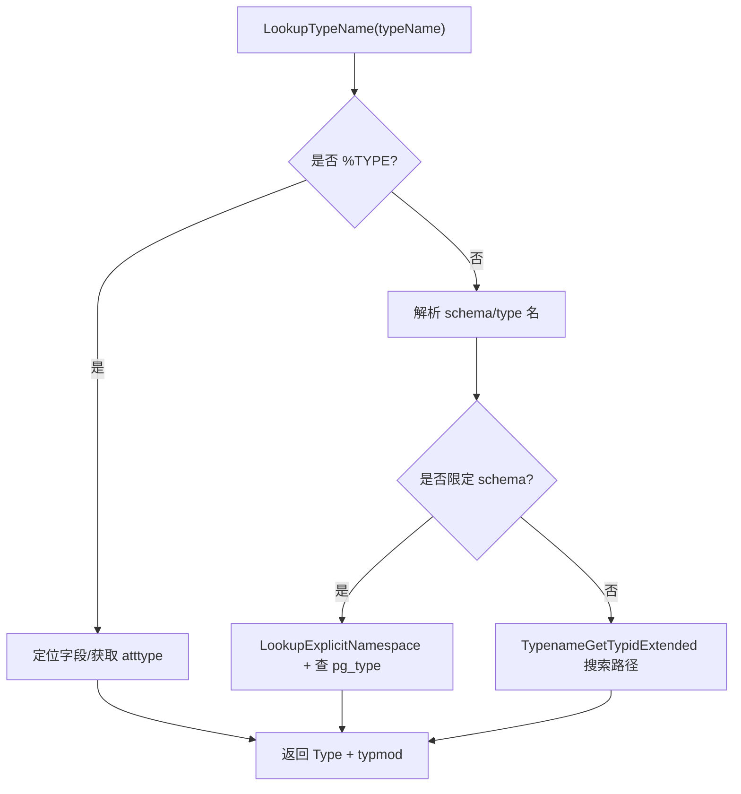

图表来源
- [parse_type.c:37-43](file://src/backend/parser/parse_type.c#L37-L43)
- [parse_type.c:73-217](file://src/backend/parser/parse_type.c#L73-L217)
- [parse_type.c:263-318](file://src/backend/parser/parse_type.c#L263-L318)
- [parse_type.c:331-426](file://src/backend/parser/parse_type.c#L331-L426)
- [parse_type.c:537-571](file://src/backend/parser/parse_type.c#L537-L571)

章节来源
- [parse_type.c:37-43](file://src/backend/parser/parse_type.c#L37-L43)
- [parse_type.c:73-217](file://src/backend/parser/parse_type.c#L73-L217)
- [parse_type.c:263-318](file://src/backend/parser/parse_type.c#L263-L318)
- [parse_type.c:331-426](file://src/backend/parser/parse_type.c#L331-L426)
- [parse_type.c:537-571](file://src/backend/parser/parse_type.c#L537-L571)

### 函数解析与聚合（parse_func.c）
- ParseFuncOrColumn：统一处理函数调用与列投影歧义；提取实际参数类型；处理命名参数、VARIADIC、默认参数；调用 func_get_detail 进行候选选择与多态一致性检查；构造 FuncExpr/Aggref；对集合返回函数做位置检查。
- 聚合函数：验证 WITHIN GROUP、ORDER BY、DISTINCT、FILTER 等使用合法性；处理有序集/假设集聚合；调用 transformAggregateCall 完成后续处理。
- 错误处理：不存在/模糊/类型不匹配时给出明确提示与建议。

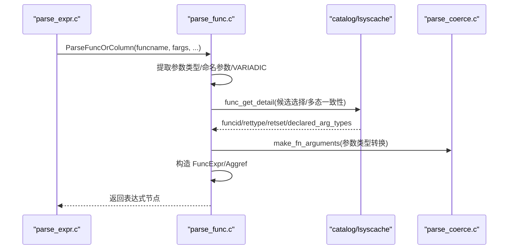

图表来源
- [parse_func.c:89-141](file://src/backend/parser/parse_func.c#L89-L141)
- [parse_func.c:248-304](file://src/backend/parser/parse_func.c#L248-L304)
- [parse_func.c:346-504](file://src/backend/parser/parse_func.c#L346-L504)
- [parse_func.c:606-727](file://src/backend/parser/parse_func.c#L606-L727)

章节来源
- [parse_func.c:89-141](file://src/backend/parser/parse_func.c#L89-L141)
- [parse_func.c:248-304](file://src/backend/parser/parse_func.c#L248-L304)
- [parse_func.c:346-504](file://src/backend/parser/parse_func.c#L346-L504)
- [parse_func.c:606-727](file://src/backend/parser/parse_func.c#L606-L727)

### 操作符解析（parse_oper.c）
- oper/left_oper：优先精确匹配，否则候选选择；支持二元/一元操作符；内置缓存减少重复查找。
- compatible_oper：要求无需运行时类型转换（仅二进制兼容）。
- make_op：选择操作符后，执行类型一致性与参数转换，构造 OpExpr/ScalarArrayOpExpr，并对集合返回操作进行检查。

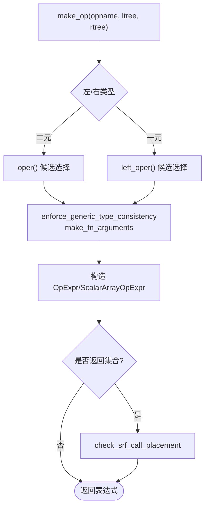

图表来源
- [parse_oper.c:381-452](file://src/backend/parser/parse_oper.c#L381-L452)
- [parse_oper.c:529-603](file://src/backend/parser/parse_oper.c#L529-L603)
- [parse_oper.c:671-776](file://src/backend/parser/parse_oper.c#L671-L776)

章节来源
- [parse_oper.c:381-452](file://src/backend/parser/parse_oper.c#L381-L452)
- [parse_oper.c:529-603](file://src/backend/parser/parse_oper.c#L529-L603)
- [parse_oper.c:671-776](file://src/backend/parser/parse_oper.c#L671-L776)

### 类型转换机制（parse_coerce.c）
- coerce_to_target_type：通用入口，先 can_coerce_type 判定可行性，再调用 coerce_type 与 coerce_type_typmod，处理 CollateExpr 包裹与固定长度类型 typmod。
- coerce_type：处理 UNKNOWN 常量输入、ANY* 伪类型、RelabelType、域类型、RECORD 与复合类型互转、类继承转换等；通过 find_coercion_pathway 选择转换路径。
- coerce_type_typmod：针对目标 typmod 插入长度转换或 RelabelType。
- coerce_to_domain：为域类型附加运行时约束检查节点。

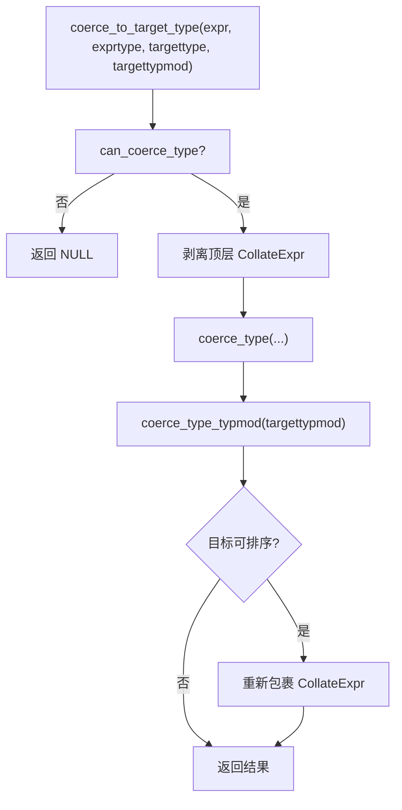

图表来源
- [parse_coerce.c:77-131](file://src/backend/parser/parse_coerce.c#L77-L131)
- [parse_coerce.c:156-544](file://src/backend/parser/parse_coerce.c#L156-L544)
- [parse_coerce.c:673-723](file://src/backend/parser/parse_coerce.c#L673-L723)
- [parse_coerce.c:750-796](file://src/backend/parser/parse_coerce.c#L750-L796)

章节来源
- [parse_coerce.c:77-131](file://src/backend/parser/parse_coerce.c#L77-L131)
- [parse_coerce.c:156-544](file://src/backend/parser/parse_coerce.c#L156-L544)
- [parse_coerce.c:673-723](file://src/backend/parser/parse_coerce.c#L673-L723)
- [parse_coerce.c:750-796](file://src/backend/parser/parse_coerce.c#L750-L796)

### 作用域与命名空间（parse_clause.c）
- transformFromClause：从左到右处理 FROM 项，构建命名空间与 joinlist，控制 LATERAL 可见性。
- setTargetTable：为 INSERT/UPDATE/DELETE 打开目标表并获取写锁，建立 RTE 与 NSItem。

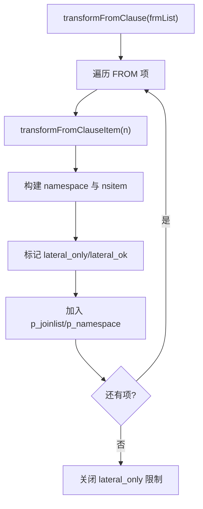

图表来源
- [parse_clause.c:106-146](file://src/backend/parser/parse_clause.c#L106-L146)
- [parse_clause.c:167-200](file://src/backend/parser/parse_clause.c#L167-L200)

章节来源
- [parse_clause.c:106-146](file://src/backend/parser/parse_clause.c#L106-L146)
- [parse_clause.c:167-200](file://src/backend/parser/parse_clause.c#L167-L200)

### 目标列展开与命名（parse_target.c）
- transformTargetEntry：将表达式转换为 TargetEntry，自动推断列名，支持 SetToDefault 透传。
- transformTargetList：展开 table.* 与 indirection.*，生成目标列表；处理多赋值产生的 resjunk 条目。

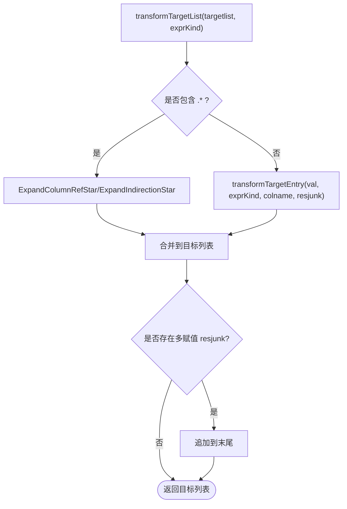

图表来源
- [parse_target.c:76-111](file://src/backend/parser/parse_target.c#L76-L111)
- [parse_target.c:122-189](file://src/backend/parser/parse_target.c#L122-L189)

章节来源
- [parse_target.c:76-111](file://src/backend/parser/parse_target.c#L76-L111)
- [parse_target.c:122-189](file://src/backend/parser/parse_target.c#L122-L189)

## 依赖关系分析
- 模块耦合：
  - analyze.c 依赖所有子模块进行语句级装配。
  - parse_expr.c 强依赖 parse_func.c、parse_oper.c、parse_coerce.c、parse_type.c。
  - parse_clause.c 依赖 parse_type.c 与命名空间工具。
  - parse_target.c 依赖 parse_expr.c 与类型系统。
- 外部依赖：
  - 系统目录与缓存（pg_proc/pg_operator/pg_type）通过 utils/lsyscache 与 utils/syscache 访问。
  - 类型缓存 typcache 加速排序/分组操作符查找。

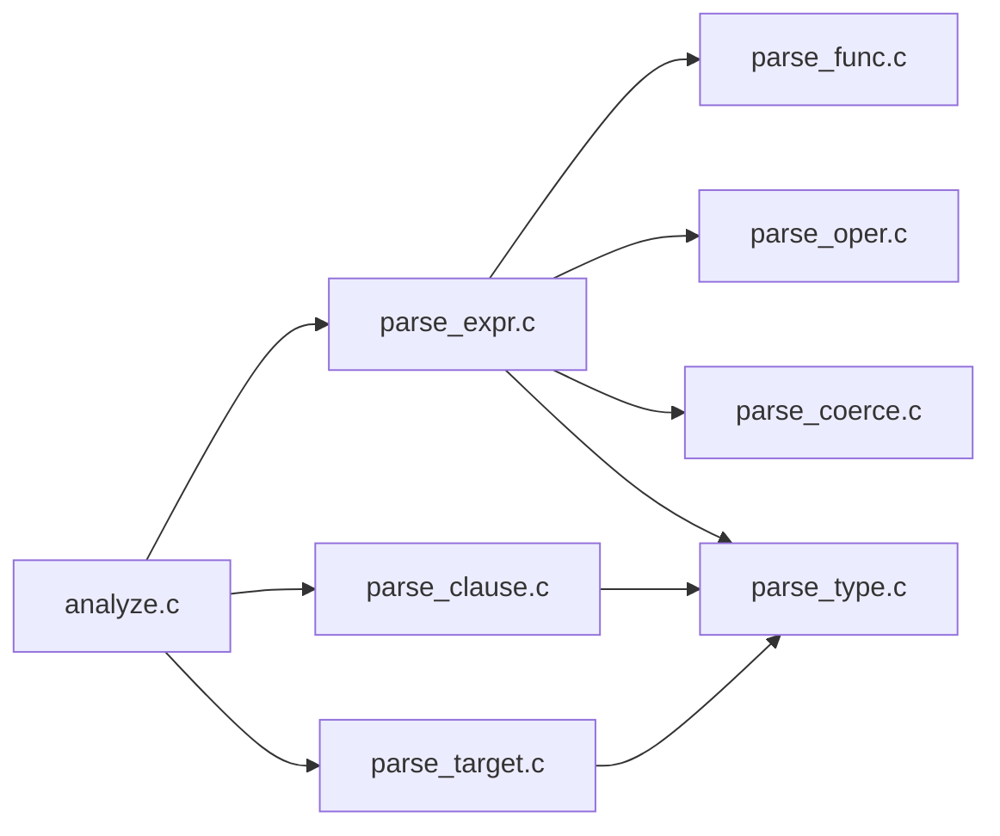

图表来源
- [analyze.c:25-53](file://src/backend/parser/analyze.c#L25-L53)
- [parse_expr.c:16-38](file://src/backend/parser/parse_expr.c#L16-L38)
- [parse_clause.c:16-52](file://src/backend/parser/parse_clause.c#L16-L52)
- [parse_target.c:15-33](file://src/backend/parser/parse_target.c#L15-L33)

章节来源
- [analyze.c:25-53](file://src/backend/parser/analyze.c#L25-L53)
- [parse_expr.c:16-38](file://src/backend/parser/parse_expr.c#L16-L38)
- [parse_clause.c:16-52](file://src/backend/parser/parse_clause.c#L16-L52)
- [parse_target.c:15-33](file://src/backend/parser/parse_target.c#L15-L33)

## 性能考虑
- 操作符查找缓存：parse_oper.c 使用 OprCacheKey/OprCacheEntry 哈希表缓存操作符映射，减少重复查找开销。
- 类型缓存：get_sort_group_operators 利用 typcache 批量获取排序/分组操作符，降低系统目录访问。
- 表达式栈深度保护：transformExprRecurse 调用 check_stack_depth 防止过深嵌套导致栈溢出。
- 最小化转换：coerce_type 对相同类型、ANY* 伪类型、无转换需求的情况快速返回，避免多余节点生成。
- 目标列展开优化：transformTargetList 仅在 SELECT/RETURNING 展开 *，避免不必要的处理。

章节来源
- [parse_oper.c:34-83](file://src/backend/parser/parse_oper.c#L34-L83)
- [parse_oper.c:191-245](file://src/backend/parser/parse_oper.c#L191-L245)
- [parse_expr.c:108-118](file://src/backend/parser/parse_expr.c#L108-L118)
- [parse_coerce.c:156-190](file://src/backend/parser/parse_coerce.c#L156-L190)
- [parse_target.c:122-135](file://src/backend/parser/parse_target.c#L122-L135)

## 故障排查指南
- 函数/操作符未找到或模糊：
  - 现象：报错“function/operator does not exist”或“ambiguous”。
  - 排查：检查参数类型与声明是否匹配；必要时添加显式类型转换；确认搜索路径与模式限定。
  - 参考：parse_func.c 中的错误分支与提示；parse_oper.c 的 op_error。
- 列不存在或类型不匹配：
  - 现象：“column ... does not exist”或“applied to type ... which is not a composite type”。
  - 排查：确认命名空间与范围表；检查复合类型与字段访问；查看 unknown_attribute 的错误路径。
  - 参考：parse_expr.c 的 unknown_attribute 与列解析分支。
- 类型转换失败：
  - 现象：无法从某类型转换到目标类型或域约束失败。
  - 排查：使用 can_coerce_type 预判；检查目标类型与 typmod；关注 domain 约束与长度转换。
  - 参考：parse_coerce.c 的 coerce_to_target_type/coerce_type/coerce_to_domain。
- 聚合/窗口用法错误：
  - 现象：WITHIN GROUP/ORDER BY/DISTINCT/FILTER 使用不当。
  - 排查：确认是否为有序集聚合；核对直接参数与聚合参数数量；检查 VARIADIC 与 ANY 变参组合。
  - 参考：parse_func.c 的聚合校验分支。
- 调试技巧：
  - 启用 post_parse_analyze_hook 在分析结束时注入自定义检查。
  - 使用 parser_errposition 精确定位错误位置。
  - 通过 GUC 与日志观察转换路径与候选选择。

章节来源
- [parse_func.c:274-341](file://src/backend/parser/parse_func.c#L274-L341)
- [parse_func.c:515-604](file://src/backend/parser/parse_func.c#L515-L604)
- [parse_oper.c:631-657](file://src/backend/parser/parse_oper.c#L631-L657)
- [parse_expr.c:306-356](file://src/backend/parser/parse_expr.c#L306-L356)
- [parse_coerce.c:547-654](file://src/backend/parser/parse_coerce.c#L547-L654)
- [parse_coerce.c:673-723](file://src/backend/parser/parse_coerce.c#L673-L723)

## 结论
Mini PostgreSQL 的语义分析以 ParseState 为核心，围绕表达式、类型、函数、操作符与子句四大支柱完成从语法树到语义树的转换。其设计强调：
- 明确的阶段划分：语句分发、表达式语义化、类型推导与转换、函数/操作符解析、子句与目标列处理。
- 强大的类型系统：支持数组、%TYPE、域类型、排序规则与长度约束。
- 健壮的解析与错误处理：提供清晰错误信息与修复建议。
- 性能优化：缓存与快速路径减少系统目录访问与冗余节点生成。
这些特性为 SQL 语义分析功能的开发与维护提供了坚实基础。

## 附录
- 术语说明：
  - AST：抽象语法树，语法分析阶段的中间表示。
  - 语义树：带类型、作用域与绑定信息的表达式树。
  - 命名空间：当前可引用的关系与列集合。
  - 类型转换：隐式/显式转换、域约束、长度约束。
- 相关扩展点：
  - pre/post columnref hook：拦截/重写列引用解析。
  - paramref/coerce_param hook：定制参数解析与转换行为。
  - post_parse_analyze_hook：在分析结束后注入自定义逻辑。