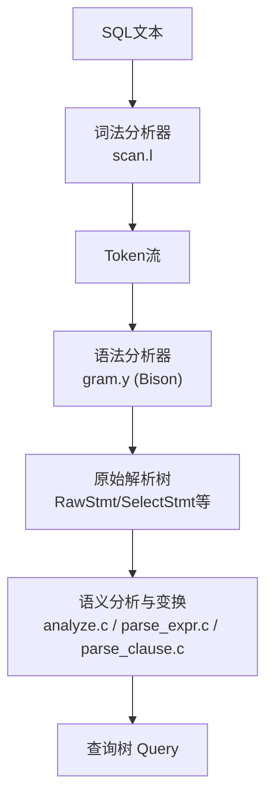
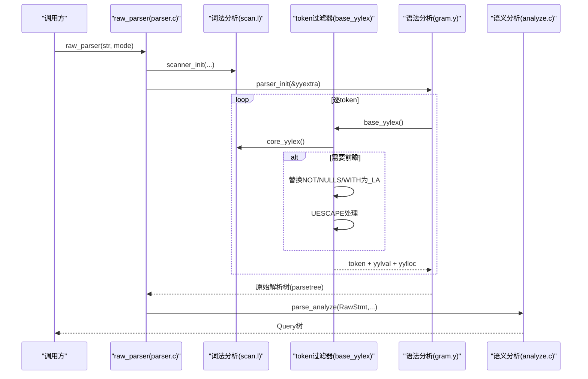
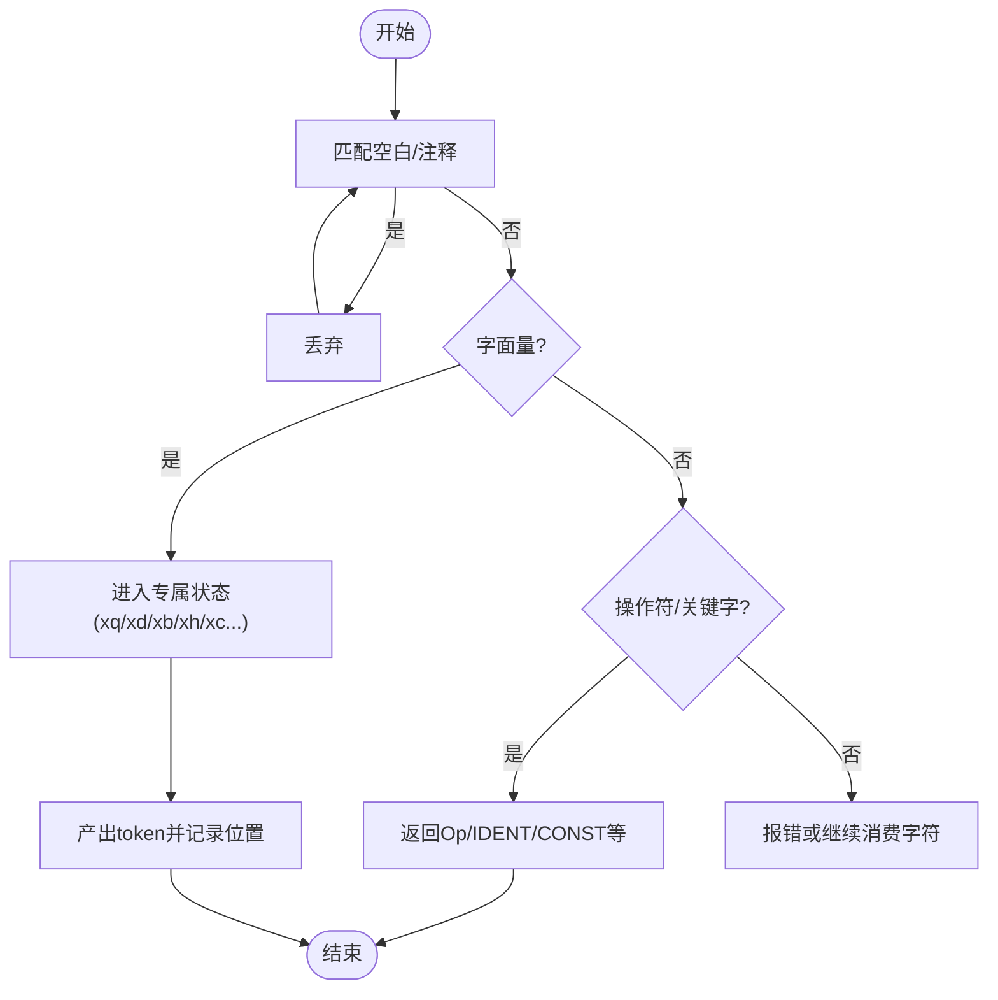
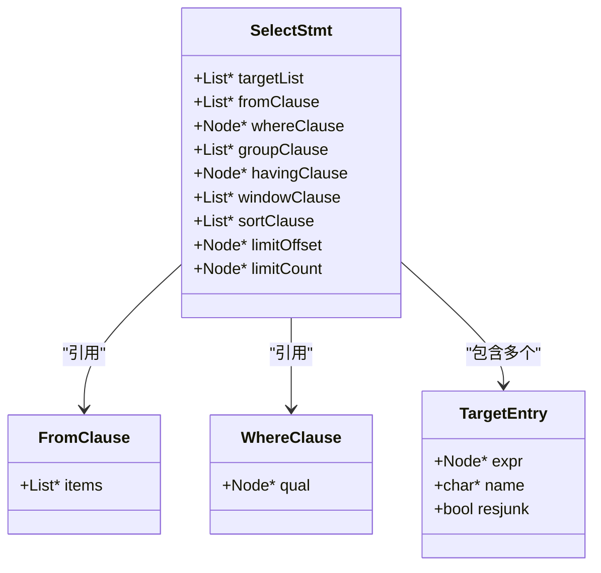
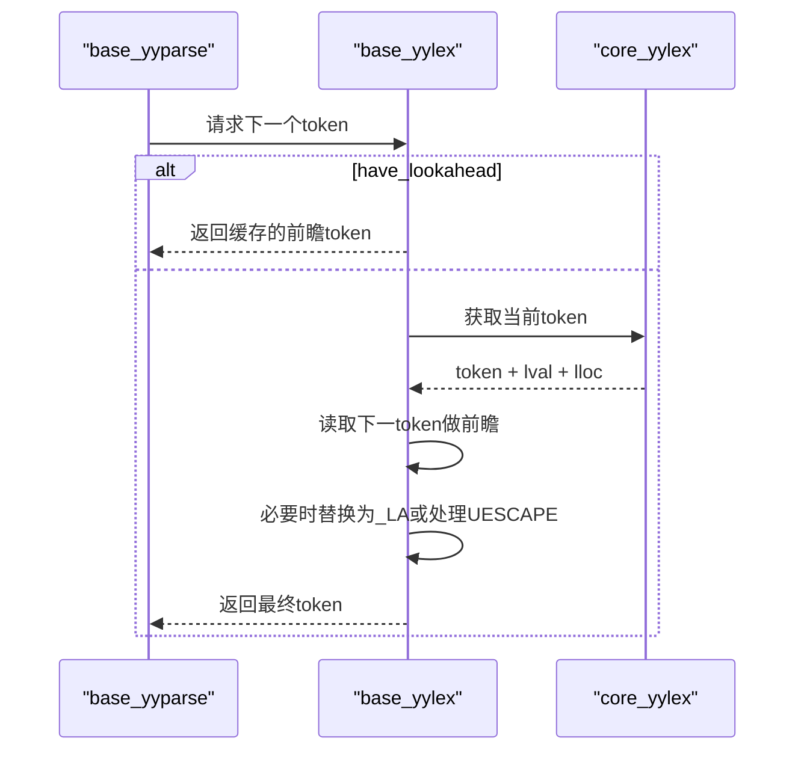
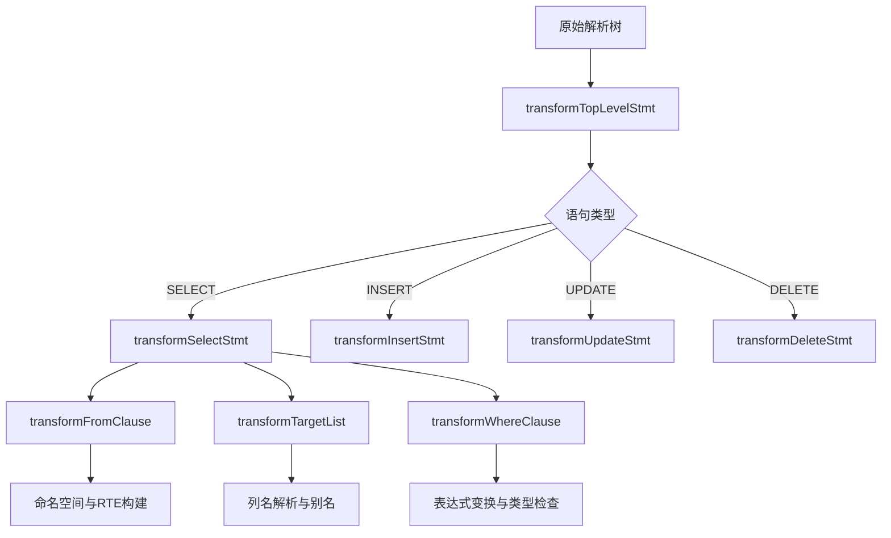
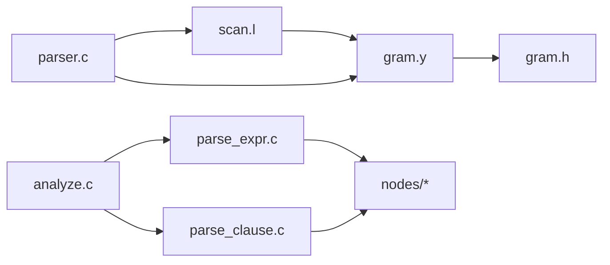

# 语法分析器

<cite>
**本文引用的文件**
- [gram.y](file://src/backend/parser/gram.y)
- [scan.l](file://src/backend/parser/scan.l)
- [parser.c](file://src/backend/parser/parser.c)
- [gram.h](file://src/backend/parser/gram.h)
- [parse_expr.c](file://src/backend/parser/parse_expr.c)
- [parse_clause.c](file://src/backend/parser/parse_clause.c)
- [analyze.c](file://src/backend/parser/analyze.c)
</cite>

## 目录
1. [简介](#简介)
2. [项目结构](#项目结构)
3. [核心组件](#核心组件)
4. [架构总览](#架构总览)
5. [详细组件分析](#详细组件分析)
6. [依赖关系分析](#依赖关系分析)
7. [性能考量](#性能考量)
8. [故障排查指南](#故障排查指南)
9. [结论](#结论)
10. [附录](#附录)

## 简介
本文件面向Mini PostgreSQL的SQL语法分析器，系统性说明Bison语法规则的设计与实现、词法到语法的转换流程、语义动作如何构建抽象语法树（AST）、类型检查与作用域管理、错误处理与冲突解决机制，以及递归下降解析的实现细节。文档同时提供扩展方法、性能优化技巧与调试工具使用建议，帮助读者深入理解并高效维护SQL解析的核心功能。

## 项目结构
Mini PostgreSQL的解析子系统位于src/backend/parser目录，主要包含：
- 词法分析：scan.l（Flex）
- 语法分析：gram.y（Bison），生成gram.h
- 驱动与过滤：parser.c（raw_parser入口、token过滤器）
- 语义分析与AST变换：analyze.c、parse_expr.c、parse_clause.c等

图表来源
- [scan.l:1-200](file://src/backend/parser/scan.l#L1-L200)
- [gram.y:667-784](file://src/backend/parser/gram.y#L667-L784)
- [parser.c:41-82](file://src/backend/parser/parser.c#L41-L82)
- [analyze.c:97-128](file://src/backend/parser/analyze.c#L97-L128)

章节来源
- [scan.l:1-200](file://src/backend/parser/scan.l#L1-L200)
- [gram.y:667-784](file://src/backend/parser/gram.y#L667-L784)
- [parser.c:41-82](file://src/backend/parser/parser.c#L41-L82)
- [analyze.c:97-128](file://src/backend/parser/analyze.c#L97-L128)

## 核心组件
- 词法分析器（scanner）：将SQL文本切分为token，支持字符串、标识符、数字、操作符、注释、美元引号等复杂字面量，维护位置信息以辅助错误定位。
- 语法分析器（parser）：基于Bison的LR(1)文法，定义非终结符、终结符、优先级与结合性，通过语义动作构建原始解析树节点。
- 驱动层（driver/filter）：raw_parser初始化扫描器与解析器，调用base_yyparse；base_yylex作为过滤器进行前瞻替换（如NOT_LA、NULLS_LA、WITH_LA）和UESCAPE处理。
- 语义分析与变换：将原始解析树转换为Query树，完成类型检查、作用域解析、函数/操作符解析、列名解析、子查询展开等。

章节来源
- [scan.l:1-200](file://src/backend/parser/scan.l#L1-L200)
- [gram.y:181-666](file://src/backend/parser/gram.y#L181-L666)
- [parser.c:85-293](file://src/backend/parser/parser.c#L85-L293)
- [analyze.c:97-128](file://src/backend/parser/analyze.c#L97-L128)

## 架构总览
从SQL文本到Query树的完整流程如下：

图表来源
- [parser.c:41-82](file://src/backend/parser/parser.c#L41-L82)
- [parser.c:106-293](file://src/backend/parser/parser.c#L106-L293)
- [gram.y:667-784](file://src/backend/parser/gram.y#L667-L784)
- [analyze.c:97-128](file://src/backend/parser/analyze.c#L97-L128)

## 详细组件分析

### 词法分析器（scan.l）
- 设计要点
  - 无回溯规则：确保匹配效率，避免backtracking带来的性能损失。
  - 多状态机：使用独占状态处理不同字面量（如单引号字符串、双引号标识符、美元引号、C风格注释、十六进制/二进制字符串）。
  - 位置追踪：SET_YYLLOC/ADVANCE_YYLLOC/PUSH_YYLLOC/POP_YYLLOC保证错误报告精确定位。
  - Unicode与转义：支持U&''与UESCAPE，处理代理对与非法转义序列。
- 关键流程
  - 识别空白与注释，跳过。
  - 识别字符串/标识符/数字/操作符/关键字，返回对应token。
  - 在xqs状态中处理字符串续行与结束。
  - 在xd/xui状态中处理带引号的标识符与Unicode转义。
  - 在xc状态中处理嵌套注释。

图表来源
- [scan.l:162-200](file://src/backend/parser/scan.l#L162-L200)
- [scan.l:418-800](file://src/backend/parser/scan.l#L418-L800)

章节来源
- [scan.l:1-200](file://src/backend/parser/scan.l#L1-L200)
- [scan.l:418-800](file://src/backend/parser/scan.l#L418-L800)

### 语法分析器（gram.y）
- 非终结符与终结符
  - 终结符：IDENT、SCONST、FCONST、ICONST、Op、各类SQL关键字（ABORT_P、SELECT、FROM等），以及特殊令牌NOT_LA、NULLS_LA、WITH_LA用于保持LALR(1)。
  - 非终结符：stmt、toplevel_stmt、select_clause、from_clause、where_clause、target_list等，分别映射到具体的AST节点类型（如SelectStmt、FromClause、WhereClause、TargetEntry等）。
- 优先级与结合性
  - 明确定义运算符优先级与结合性，例如UNION/INTERSECT、AND/OR、比较运算符、算术运算符、函数调用、数组下标、类型转换等，确保表达式解析符合SQL语义。
- 语义动作与AST构建
  - 每个规则的动作负责构造对应的AST节点，并通过list_make1/lappend等组合成列表结构。
  - 位置信息通过YYLLOC_DEFAULT与@n/@$传递，便于错误定位。
- 顶层目标与语句拆分
  - parse_toplevel接收stmtmulti，按分号拆分为多个RawStmt，并设置parsetree。
  - stmt列举所有支持的SQL命令，形成统一入口。

图表来源
- [gram.y:667-784](file://src/backend/parser/gram.y#L667-L784)
- [gram.y:608-666](file://src/backend/parser/gram.y#L608-L666)

章节来源
- [gram.y:181-666](file://src/backend/parser/gram.y#L181-L666)
- [gram.y:667-784](file://src/backend/parser/gram.y#L667-L784)

### 驱动与过滤器（parser.c）
- raw_parser
  - 初始化扫描器与解析器，根据模式决定是否注入前瞻token（如MODE_TYPE_NAME）。
  - 调用base_yyparse执行解析，清理资源后返回parsetree。
- base_yylex过滤器
  - 支持一token前瞻，将NOT/NULLS/WITH在特定上下文中替换为_NOT_LA/_NULLS_LA/_WITH_LA，使文法保持LALR(1)。
  - 处理U&''与UESCAPE，校验转义字符并进行Unicode转换。
  - 将UIDENT/USCONST归一化为IDENT/SCONST，简化后续语法处理。

图表来源
- [parser.c:106-293](file://src/backend/parser/parser.c#L106-L293)

章节来源
- [parser.c:41-82](file://src/backend/parser/parser.c#L41-L82)
- [parser.c:85-293](file://src/backend/parser/parser.c#L85-L293)

### 语义分析与AST变换（analyze.c、parse_expr.c、parse_clause.c）
- analyze.c
  - parse_analyze/parse_sub_analyze：创建ParseState，调用transformTopLevelStmt/transformStmt，将原始解析树转换为Query。
  - 针对可优化语句进行锁获取与深度分析；实用命令通常直接包装为CMD_UTILITY。
- parse_expr.c
  - transformExpr：根据节点类型分发到具体变换函数，完成表达式类型检查、函数/操作符解析、数组/行/聚合/窗口函数处理等。
  - transformColumnRef：解析列引用，支持A、A.B、A.B.C、A.B.C.D形式，处理整行引用与函数调用歧义。
- parse_clause.c
  - transformFromClause：处理FROM子句，添加范围表项、连接列表与命名空间，支持LATERAL与子查询。
  - setTargetTable：为INSERT/UPDATE/DELETE设置目标表，打开关系并加写锁。
  - transformJoinUsingClause/transformJoinOnClause：构建JOIN条件，验证并转换为布尔表达式。

图表来源
- [analyze.c:97-128](file://src/backend/parser/analyze.c#L97-L128)
- [parse_expr.c:90-304](file://src/backend/parser/parse_expr.c#L90-L304)
- [parse_clause.c:106-146](file://src/backend/parser/parse_clause.c#L106-L146)

章节来源
- [analyze.c:97-128](file://src/backend/parser/analyze.c#L97-L128)
- [parse_expr.c:90-304](file://src/backend/parser/parse_expr.c#L90-L304)
- [parse_clause.c:106-146](file://src/backend/parser/parse_clause.c#L106-L146)

## 依赖关系分析
- 组件耦合
  - scan.l与gram.y通过token接口耦合，gram.h暴露token枚举与YYSTYPE定义。
  - parser.c协调scanner与parser，并提供token过滤器。
  - analyze.c及parse_*模块依赖nodes/makefuncs与utils/builtins，完成AST构建与类型系统交互。
- 外部依赖
  - 类型系统与内置函数：catalog/pg_type.h、utils/builtins.h。
  - 命名空间与范围表：parser/parse_relation.h、utils/rel.h。
- 潜在循环依赖
  - 通过分层设计（词法→语法→语义）避免循环；各模块仅向上依赖公共头与节点定义。

图表来源
- [gram.h:48-516](file://src/backend/parser/gram.h#L48-L516)
- [parser.c:41-82](file://src/backend/parser/parser.c#L41-L82)
- [analyze.c:25-54](file://src/backend/parser/analyze.c#L25-L54)

章节来源
- [gram.h:48-516](file://src/backend/parser/gram.h#L48-L516)
- [parser.c:41-82](file://src/backend/parser/parser.c#L41-L82)
- [analyze.c:25-54](file://src/backend/parser/analyze.c#L25-L54)

## 性能考量
- 词法分析
  - 无回溯规则减少状态切换开销；独占状态降低匹配复杂度。
  - 字符串与标识符采用增量构建与复用缓冲区，减少内存分配。
- 语法分析
  - 明确的优先级与结合性减少冲突；_LA令牌保持LALR(1)，避免二义性。
  - 使用palloc/pfree替代malloc/free，避免解析失败时的内存泄漏。
- 语义分析
  - 表达式变换时进行栈深度保护，防止过深嵌套导致崩溃。
  - 命名空间与RTE构建尽量一次性完成，减少重复查找。

[本节为通用指导，不直接分析具体文件]

## 故障排查指南
- 常见错误与定位
  - 词法错误：未终止的字符串/注释/标识符，错误位置由yylloc精确指示。
  - 语法错误：Bison报告冲突或期望令牌，可通过启用调试输出观察移进/归约过程。
  - 语义错误：列不存在、类型不匹配、跨库引用不支持等，错误消息附带位置与上下文。
- 调试工具
  - 启用Bison调试：在gram.y中开启YYDEBUG，打印移进/归约日志。
  - 检查词法状态：确认独占状态是否正确切换，字符串续行是否被正确处理。
  - 过滤器调试：观察NOT/NULLS/WITH的_LA替换逻辑与UESCAPE处理路径。
- 常见问题定位步骤
  - 缩小输入：逐步剔除SQL片段，定位最小复现用例。
  - 检查优先级：确认运算符优先级是否符合预期，必要时调整优先级声明。
  - 查看命名空间：确认FROM子句与列引用是否在正确的作用域内可见。

章节来源
- [scan.l:418-800](file://src/backend/parser/scan.l#L418-L800)
- [gram.y:608-666](file://src/backend/parser/gram.y#L608-L666)
- [parser.c:106-293](file://src/backend/parser/parser.c#L106-L293)
- [parse_expr.c:430-800](file://src/backend/parser/parse_expr.c#L430-L800)

## 结论
Mini PostgreSQL的语法分析器通过清晰的三层架构（词法、语法、语义）实现了健壮且高效的SQL解析。Bison文法借助_LA令牌与明确的优先级设计，保持了LALR(1)特性；语义分析阶段完成AST构建、类型检查与作用域管理，将原始解析树转换为可优化的Query树。遵循本文档的扩展方法与优化建议，可在不破坏现有稳定性的前提下，安全地增强语法能力与解析性能。

[本节为总结，不直接分析具体文件]

## 附录
- 扩展语法规则
  - 新增关键字：在gram.y中添加%token声明，并在scan.l的关键词表中注册。
  - 新增语句：在gram.y的stmt规则中添加新语句的非终结符，并在analyze.c中实现transform函数。
  - 新增表达式：在gram.y中定义新的非终结符与优先级，在parse_expr.c中实现transform分支。
- 性能优化技巧
  - 减少不必要的字符串复制与内存分配。
  - 利用命名空间缓存与RTE复用，避免重复查找。
  - 合理划分语义分析阶段，延迟昂贵操作至必要时刻。
- 调试工具使用
  - 启用YYDEBUG观察Bison内部状态机。
  - 使用gdb断点于base_yylex与transformExpr，跟踪token流与AST构建。
  - 通过测试套件逐步验证语法变更的正确性。

[本节为补充信息，不直接分析具体文件]