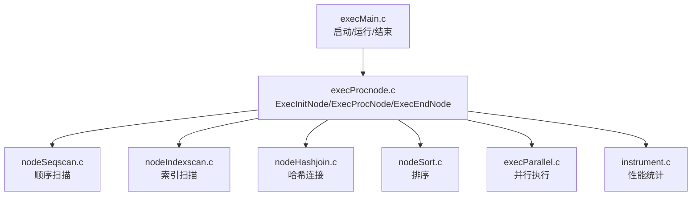
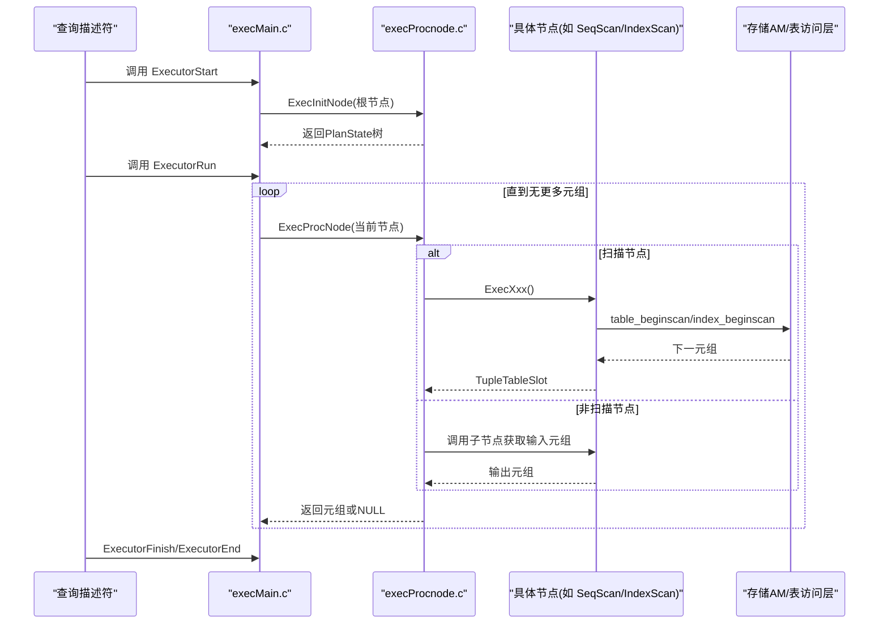
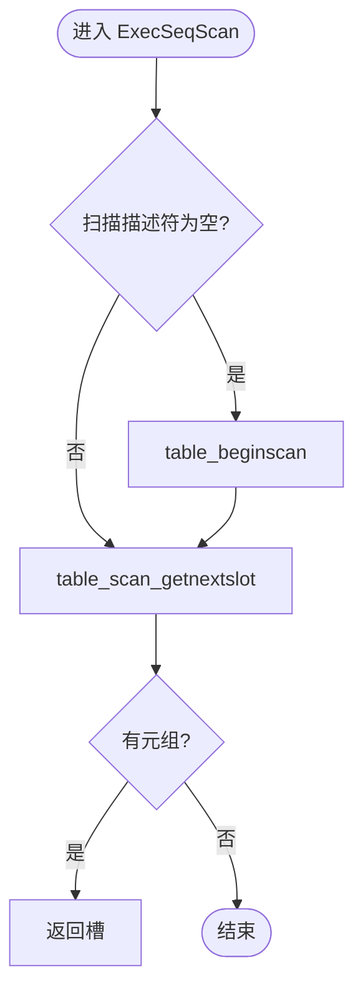
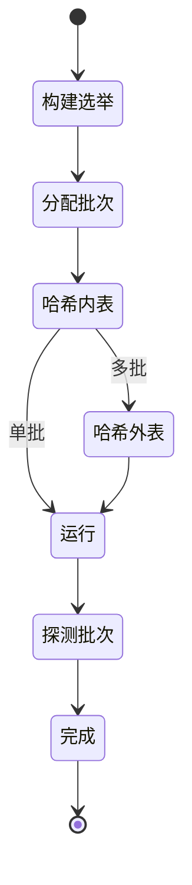
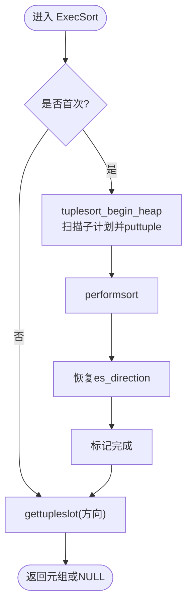
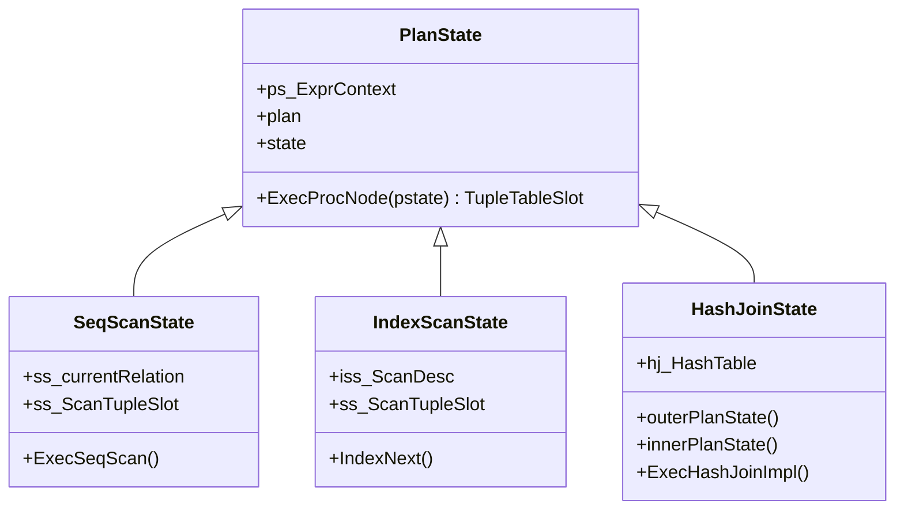
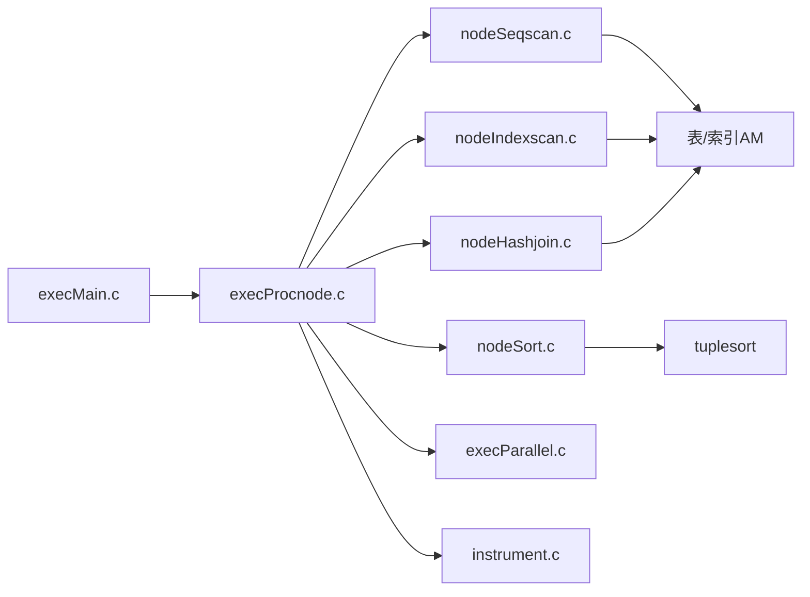

# 执行引擎

<cite>
**本文引用的文件**
- [src/backend/executor/README](file://src/backend/executor/README)
- [src/backend/executor/execMain.c](file://src/backend/executor/execMain.c)
- [src/backend/executor/execProcnode.c](file://src/backend/executor/execProcnode.c)
- [src/backend/executor/nodeSeqscan.c](file://src/backend/executor/nodeSeqscan.c)
- [src/backend/executor/nodeIndexscan.c](file://src/backend/executor/nodeIndexscan.c)
- [src/backend/executor/nodeHashjoin.c](file://src/backend/executor/nodeHashjoin.c)
- [src/backend/executor/nodeSort.c](file://src/backend/executor/nodeSort.c)
- [src/backend/executor/execParallel.c](file://src/backend/executor/execParallel.c)
- [src/backend/executor/instrument.c](file://src/backend/executor/instrument.c)
- [src/include/executor/nodeSeqscan.h](file://src/include/executor/nodeSeqscan.h)
- [src/include/executor/nodeIndexscan.h](file://src/include/executor/nodeIndexscan.h)
</cite>

## 目录
1. [简介](#简介)
2. [项目结构](#项目结构)
3. [核心组件](#核心组件)
4. [架构总览](#架构总览)
5. [详细组件分析](#详细组件分析)
6. [依赖关系分析](#依赖关系分析)
7. [性能考量](#性能考量)
8. [故障排查指南](#故障排查指南)
9. [结论](#结论)
10. [附录](#附录)

## 简介
本文件面向 Mini PostgreSQL 的执行引擎，系统性阐述节点执行模型、执行树与协议、数据流处理（元组传递、缓冲区管理、内存分配）、主要执行节点实现（顺序扫描、索引扫描、哈希连接、排序等），以及并行执行支持、结果缓存与性能监控能力。文档提供流程图、节点交互图与调优建议，帮助读者理解并扩展执行引擎。

## 项目结构
执行引擎位于 src/backend/executor，围绕“计划节点 -> 状态节点”的映射组织代码：
- 顶层接口与生命周期：execMain.c
- 节点分发与初始化：execProcnode.c
- 具体节点实现：nodeSeqscan.c、nodeIndexscan.c、nodeHashjoin.c、nodeSort.c 等
- 并行执行框架：execParallel.c
- 性能监控：instrument.c
- 节点头文件：include/executor/*.h



图表来源
- [src/backend/executor/execMain.c:113-130](file://src/backend/executor/execMain.c#L113-L130)
- [src/backend/executor/execProcnode.c:134-200](file://src/backend/executor/execProcnode.c#L134-L200)

章节来源
- [src/backend/executor/README:47-78](file://src/backend/executor/README#L47-L78)
- [src/backend/executor/execMain.c:113-130](file://src/backend/executor/execMain.c#L113-L130)
- [src/backend/executor/execProcnode.c:134-200](file://src/backend/executor/execProcnode.c#L134-L200)

## 核心组件
- 执行生命周期
  - ExecutorStart：创建执行环境、参数、快照、查询描述符，进入每查询上下文
  - ExecutorRun：循环调用 ExecProcNode 拉取元组
  - ExecutorFinish/ExecutorEnd：收尾、释放资源
- 节点分发
  - ExecInitNode：根据 Plan 类型构建对应的 PlanState 子树
  - ExecProcNode：按节点类型调度到具体 ExecXxx 函数
  - ExecEndNode：递归释放资源
- 表达式与投影
  - 表达式编译为扁平步骤数组，执行时通过 ExprContext 求值
  - 目标列投影通过投影信息生成，将结果写入 TupleTableSlot
- 内存管理
  - 每查询上下文用于计划与状态树
  - 每元组上下文用于表达式求值临时存储，逐元组重置

章节来源
- [src/backend/executor/execMain.c:113-200](file://src/backend/executor/execMain.c#L113-L200)
- [src/backend/executor/execProcnode.c:134-200](file://src/backend/executor/execProcnode.c#L134-L200)
- [src/backend/executor/README:226-243](file://src/backend/executor/README#L226-L243)

## 架构总览
执行引擎采用“需求拉取”的数据流管道：上层节点每次请求一个元组，驱动下层节点产生下一个元组或空指针表示结束。



图表来源
- [src/backend/executor/execMain.c:113-130](file://src/backend/executor/execMain.c#L113-L130)
- [src/backend/executor/execProcnode.c:134-200](file://src/backend/executor/execProcnode.c#L134-L200)
- [src/backend/executor/nodeSeqscan.c:107-115](file://src/backend/executor/nodeSeqscan.c#L107-L115)
- [src/backend/executor/nodeIndexscan.c:80-161](file://src/backend/executor/nodeIndexscan.c#L80-L161)

## 详细组件分析

### 顺序扫描（SeqScan）
- 职责：顺序读取堆表，按方向推进，应用 qual 过滤后产出元组
- 关键流程
  - 初始化：打开关系、创建槽、准备投影与 qual
  - 获取元组：table_beginscan + table_scan_getnextslot
  - 重检查：EvalPlanQual 场景下可跳过（顺序扫描不依赖键）
- 并行支持：提供估计、DSM 初始化、工作进程附加接口



图表来源
- [src/backend/executor/nodeSeqscan.c:49-83](file://src/backend/executor/nodeSeqscan.c#L49-L83)
- [src/backend/executor/nodeSeqscan.c:107-115](file://src/backend/executor/nodeSeqscan.c#L107-L115)

章节来源
- [src/backend/executor/nodeSeqscan.c:122-175](file://src/backend/executor/nodeSeqscan.c#L122-L175)
- [src/include/executor/nodeSeqscan.h:20-29](file://src/include/executor/nodeSeqscan.h#L20-L29)

### 索引扫描（IndexScan）
- 职责：基于索引键和可选 ORDER BY 键检索元组，必要时进行 recheck
- 关键流程
  - 初始化：建立索引扫描描述符、准备运行时键与排序键
  - 获取元组：index_beginscan + index_getnext_slot，若 lossy 则用原始条件重检
  - 重排序：当存在 ORDER BY 且需重排时使用配对堆维护顺序
- 并行支持：估计、DSM 初始化、工作进程附加

```mermaid
sequenceDiagram
participant IS as "IndexScanState"
participant AM as "索引AM"
participant Slot as "TupleTableSlot"
IS->>AM : index_beginscan(keys, orderbys)
loop 获取下一条
AM-->>IS : index_getnext_slot(direction, slot)
alt 需要recheck
IS->>IS : ExecQualAndReset(indexqualorig)
alt 失败
continue
end
end
IS-->>Slot : 返回元组
end
```

图表来源
- [src/backend/executor/nodeIndexscan.c:80-161](file://src/backend/executor/nodeIndexscan.c#L80-L161)

章节来源
- [src/backend/executor/nodeIndexscan.c:80-161](file://src/backend/executor/nodeIndexscan.c#L80-L161)
- [src/include/executor/nodeIndexscan.h:21-45](file://src/include/executor/nodeIndexscan.h#L21-L45)

### 哈希连接（HashJoin）
- 职责：对内表构建哈希表，对外表探测匹配；支持多批次与并行
- 算法要点
  - 构建阶段：内表分桶/批，必要时扩容；并行使用屏障协调
  - 探测阶段：外表面扫描，计算哈希值并探测桶；支持 null-fill
  - 多批次：外层预分区，批次独立处理；批0在构建阶段已填充
- 并行模式
  - 并行感知：共享状态机与 Barrier 同步；避免死锁的策略（不在等待中发射元组）
  - 单批/多批：优先尝试合并参与者内存构建大哈希表，否则回退



图表来源
- [src/backend/executor/nodeHashjoin.c:15-109](file://src/backend/executor/nodeHashjoin.c#L15-L109)
- [src/backend/executor/nodeHashjoin.c:170-200](file://src/backend/executor/nodeHashjoin.c#L170-L200)

章节来源
- [src/backend/executor/nodeHashjoin.c:15-109](file://src/backend/executor/nodeHashjoin.c#L15-L109)
- [src/backend/executor/nodeHashjoin.c:170-200](file://src/backend/executor/nodeHashjoin.c#L170-L200)

### 排序（Sort）
- 职责：将子计划输出排序，支持前向/反向、边界限制、随机访问
- 关键流程
  - 首次调用：收集全部元组至 Tuplesort，配置排序键、collation、nullsFirst、work_mem
  - 后续调用：从排序器按需取出元组，支持 bounded 模式提前结束
- 并行支持：工作进程统计聚合



图表来源
- [src/backend/executor/nodeSort.c:39-157](file://src/backend/executor/nodeSort.c#L39-L157)

章节来源
- [src/backend/executor/nodeSort.c:39-157](file://src/backend/executor/nodeSort.c#L39-L157)

### 执行协议与节点交互
- 协议约定
  - 每个节点暴露 ExecInit/ExecProc/ExecEnd 三件套
  - ExecProc 返回 TupleTableSlot，空表示结束
  - 子节点通过 outerPlan/innerPlan 链接
- 控制流
  - 顶层循环由 execMain 驱动，节点内部按需拉取子节点元组
  - 表达式与投影在每元组上下文中求值，结果写入槽



图表来源
- [src/backend/executor/execProcnode.c:134-200](file://src/backend/executor/execProcnode.c#L134-L200)
- [src/backend/executor/nodeSeqscan.c:122-175](file://src/backend/executor/nodeSeqscan.c#L122-L175)
- [src/backend/executor/nodeIndexscan.c:80-161](file://src/backend/executor/nodeIndexscan.c#L80-L161)
- [src/backend/executor/nodeHashjoin.c:170-200](file://src/backend/executor/nodeHashjoin.c#L170-L200)

章节来源
- [src/backend/executor/execProcnode.c:134-200](file://src/backend/executor/execProcnode.c#L134-L200)

## 依赖关系分析
- 模块耦合
  - execMain 依赖 execProcnode 进行节点分发
  - 各节点依赖存储访问层（表/索引AM）与工具库（表达式、内存、排序、哈希）
  - 并行执行通过 execParallel 将计划与状态序列化到共享内存，协调工作进程
- 外部依赖
  - 存储层：heapam、genam、nbtree 等
  - 工具库：utils/tuplesort、utils/memutils、utils/hashfn 等
  - 并行基础设施：access/parallel、storage/ipc



图表来源
- [src/backend/executor/execMain.c:113-130](file://src/backend/executor/execMain.c#L113-L130)
- [src/backend/executor/execProcnode.c:134-200](file://src/backend/executor/execProcnode.c#L134-L200)
- [src/backend/executor/execParallel.c:123-200](file://src/backend/executor/execParallel.c#L123-L200)

章节来源
- [src/backend/executor/execParallel.c:123-200](file://src/backend/executor/execParallel.c#L123-L200)

## 性能考量
- 内存策略
  - 每查询上下文集中管理计划与状态树，便于一次性释放
  - 每元组上下文用于表达式求值临时存储，逐元组重置，避免泄漏
- 缓冲与I/O
  - 顺序扫描直接顺序读堆页；索引扫描减少I/O但可能触发重检
  - 排序在 work_mem 不足时落盘，影响延迟
- 哈希连接
  - 合理选择内/外表以最小化哈希表大小
  - 多批/扩容会引入额外开销，关注负载因子与内存预算
- 并行执行
  - 利用并行感知节点（SeqScan/IndexScan/HashJoin/Sort）提升吞吐
  - 注意屏障同步与任务划分，避免热点与偏斜
- 监控指标
  - 使用 instrument 统计时间、缓冲/WAL 使用、过滤计数
  - EXPLAIN ANALYZE 结合节点级统计定位瓶颈

章节来源
- [src/backend/executor/README:226-243](file://src/backend/executor/README#L226-L243)
- [src/backend/executor/instrument.c:30-111](file://src/backend/executor/instrument.c#L30-L111)
- [src/backend/executor/instrument.c:167-196](file://src/backend/executor/instrument.c#L167-L196)

## 故障排查指南
- 常见问题
  - 只读事务或并行模式下写操作被拒绝：检查命令类型与 eflags
  - 索引扫描返回不符合条件的元组：确认 lossy 标志与 recheck 逻辑
  - 排序结果不正确：检查排序键、collation、nullsFirst 配置
  - 哈希连接内存溢出：调整 hash_mem/work_mem，考虑多批策略
- 诊断手段
  - 启用 INSTRUMENT_TIMER/BUFFERS/WAL，观察节点耗时与资源消耗
  - 使用 EXPLAIN (ANALYZE, BUFFERS) 查看实际执行路径与统计
  - 检查并行执行中的 barrier 阶段与批次分布

章节来源
- [src/backend/executor/execMain.c:157-159](file://src/backend/executor/execMain.c#L157-L159)
- [src/backend/executor/nodeIndexscan.c:137-150](file://src/backend/executor/nodeIndexscan.c#L137-L150)
- [src/backend/executor/instrument.c:30-111](file://src/backend/executor/instrument.c#L30-L111)

## 结论
Mini PostgreSQL 执行引擎以清晰的“计划-状态”分离与“需求拉取”的数据流模型为基础，提供了可扩展的节点体系与完善的并行、监控能力。通过掌握节点协议、数据流与内存策略，开发者可以高效扩展新节点或优化现有路径。

## 附录
- 术语
  - 元组：一行记录，封装于 TupleTableSlot
  - 计划节点：优化器生成的逻辑执行单元
  - 状态节点：执行期对应计划节点的运行时状态
  - DSM：分布式共享内存，用于并行执行状态共享
- 参考路径
  - 执行入口：[execMain.c](file://src/backend/executor/execMain.c)
  - 节点分发：[execProcnode.c](file://src/backend/executor/execProcnode.c)
  - 顺序扫描：[nodeSeqscan.c](file://src/backend/executor/nodeSeqscan.c)
  - 索引扫描：[nodeIndexscan.c](file://src/backend/executor/nodeIndexscan.c)
  - 哈希连接：[nodeHashjoin.c](file://src/backend/executor/nodeHashjoin.c)
  - 排序：[nodeSort.c](file://src/backend/executor/nodeSort.c)
  - 并行执行：[execParallel.c](file://src/backend/executor/execParallel.c)
  - 性能监控：[instrument.c](file://src/backend/executor/instrument.c)