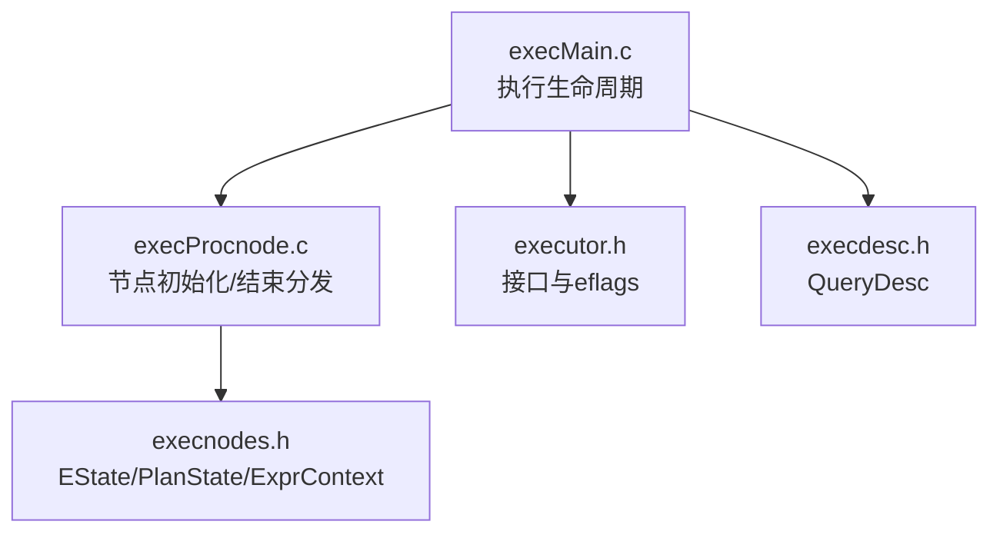
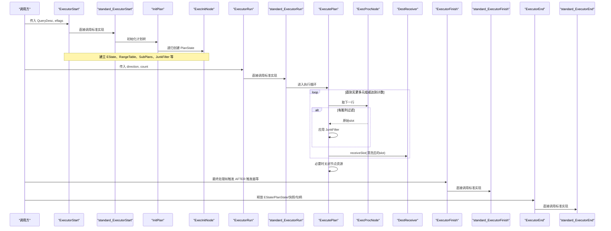
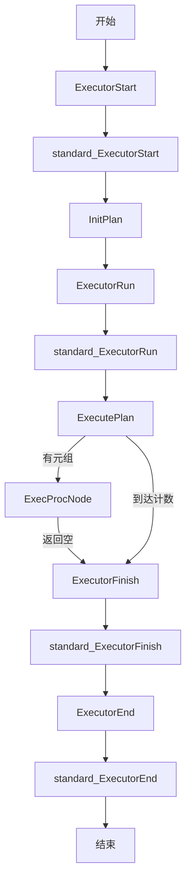
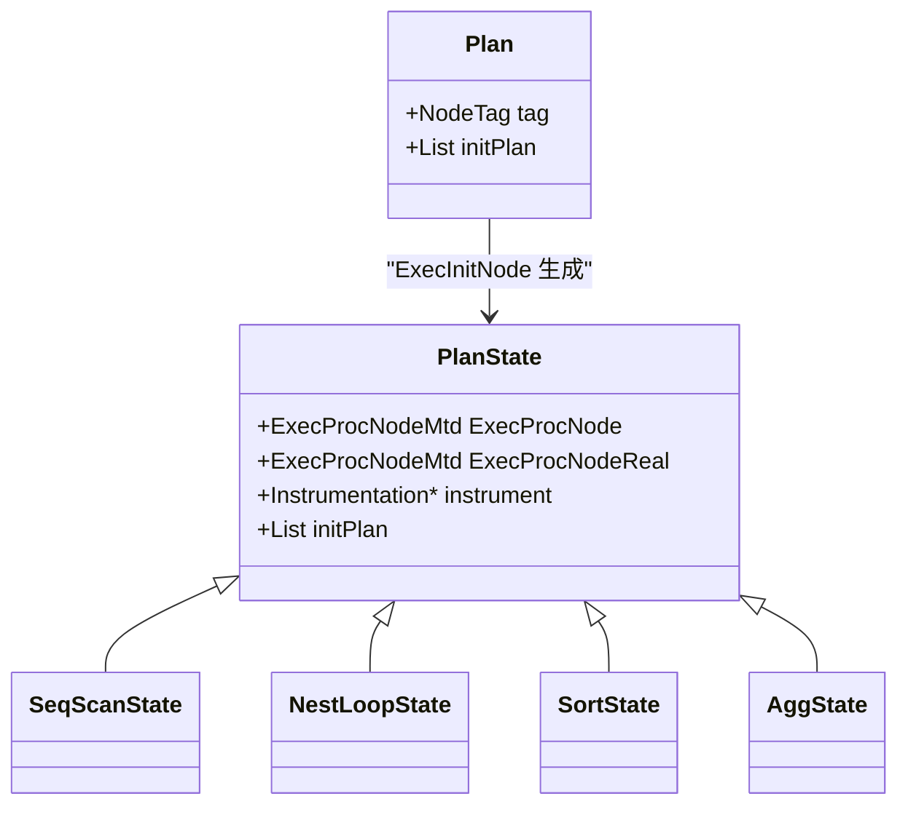
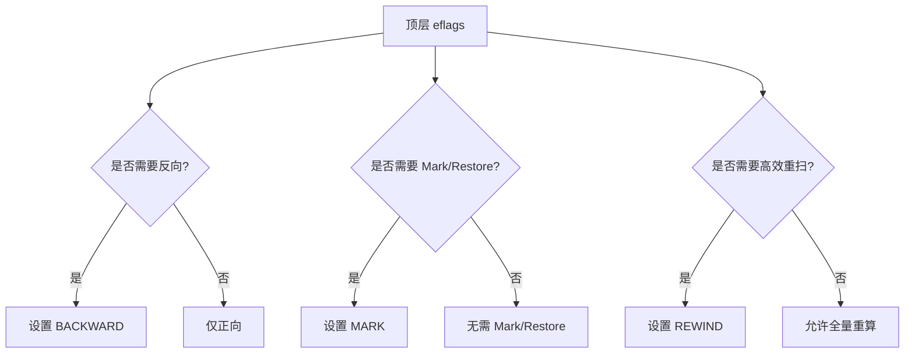
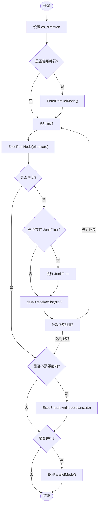
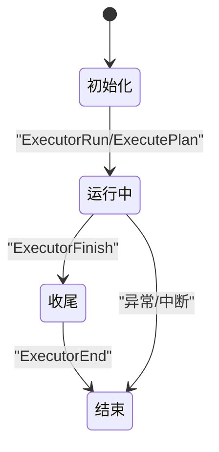
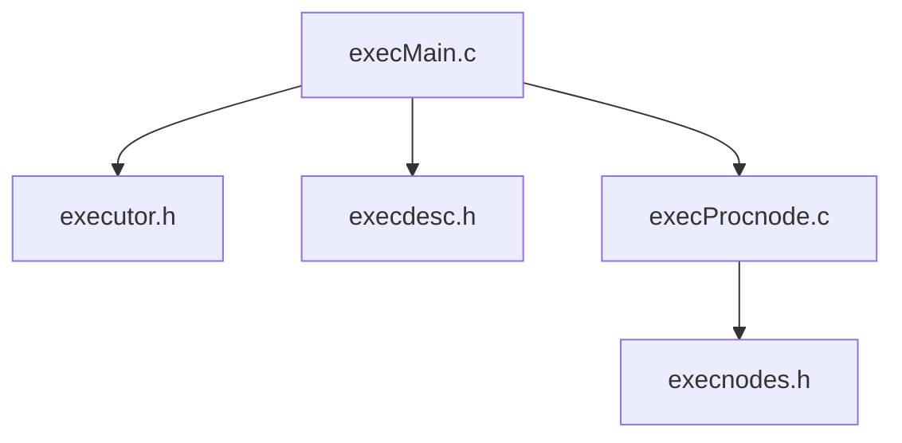

# 执行模型

<cite>
**本文引用的文件**
- [executor.h](file://src/include/executor/executor.h)
- [execdesc.h](file://src/include/executor/execdesc.h)
- [execnodes.h](file://src/include/nodes/execnodes.h)
- [execMain.c](file://src/backend/executor/execMain.c)
- [execProcnode.c](file://src/backend/executor/execProcnode.c)
</cite>

## 更新摘要
**变更内容**
- 移除了所有执行器钩子机制，简化了执行器架构
- ExecutorStart、ExecutorRun、ExecutorFinish、ExecutorEnd函数现在直接调用标准实现
- 不再支持外部插件拦截执行生命周期事件
- 更新了相关章节以反映简化的执行流程

## 目录
1. [简介](#简介)
2. [项目结构](#项目结构)
3. [核心组件](#核心组件)
4. [架构总览](#架构总览)
5. [详细组件分析](#详细组件分析)
6. [依赖关系分析](#依赖关系分析)
7. [性能考虑](#性能考虑)
8. [故障排查指南](#故障排查指南)
9. [结论](#结论)
10. [附录](#附录)

## 简介
本文件面向 Mini PostgreSQL 的执行引擎，系统化阐述执行树结构、节点类型系统、执行协议与生命周期。重点解释 EState 执行状态管理、QueryDesc 查询描述符与 PlanState 计划状态的关系；完整说明 ExecutorStart/ExecutorRun/ExecutorFinish/ExecutorEnd 的执行流程；解析执行标志位（eflags）对执行模式的影响；并提供执行流程图、状态转换图与内存管理策略，帮助读者深入理解执行器核心机制。

**更新** 执行器子系统已进行重大简化，移除了所有执行器钩子机制。现在所有执行器函数都直接调用标准实现，不再支持外部插件拦截执行生命周期事件。

## 项目结构
Mini PostgreSQL 的执行器位于 src/backend/executor，相关头文件在 src/include/executor 与 src/include/nodes。关键文件职责如下：
- executor.h：执行器对外接口、执行标志位 eflags、ExecProcNode 分发入口等
- execdesc.h：QueryDesc 定义，封装一次执行的上下文
- execnodes.h：EState、ExprContext、PlanState 等执行期数据结构
- execMain.c：ExecutorStart/Run/Finish/End、InitPlan/ExecutePlan/ExecEndPlan 等主流程
- execProcnode.c：ExecInitNode/ExecEndNode/MultiExecProcNode 等节点初始化与清理的分发实现

**图表来源**
- [execMain.c:113-130](file://src/backend/executor/execMain.c#L113-L130)
- [execProcnode.c:134-175](file://src/backend/executor/execProcnode.c#L134-L175)
- [executor.h:24-61](file://src/include/executor/executor.h#L24-L61)
- [execdesc.h:33-56](file://src/include/executor/execdesc.h#L33-L56)
- [execnodes.h:495-583](file://src/include/nodes/execnodes.h#L495-L583)

**章节来源**
- [execMain.c:113-130](file://src/backend/executor/execMain.c#L113-L130)
- [execProcnode.c:134-175](file://src/backend/executor/execProcnode.c#L134-L175)
- [executor.h:24-61](file://src/include/executor/executor.h#L24-L61)
- [execdesc.h:33-56](file://src/include/executor/execdesc.h#L33-L56)
- [execnodes.h:495-583](file://src/include/nodes/execnodes.h#L495-L583)

## 核心组件
- QueryDesc：封装一次执行所需的全部上下文，包括操作类型、计划树、源文本、快照、目标接收器、参数、环境、结果元组描述、执行状态指针、计划状态树、是否已执行标记、总体耗时统计等
- EState：执行期工作区，包含扫描方向、快照、范围表、结果关系、参数、每查询内存上下文、元组表、已处理行数、顶层 eflags、是否完成、表达式上下文列表、子计划状态、辅助修改表、并行模式开关、共享内存区域等
- PlanState：每个计划节点的运行时状态，持有 ExecProcNode 回调、Instrumentation、子计划状态、投影信息等
- ExprContext：表达式求值上下文，维护当前扫描/内外元组、每查询/每元组内存上下文、参数、聚合值、域值、回调等
- 节点类型系统：通过 nodeTag 分派到具体节点的 Init/Run/End 方法，支持控制节点、扫描节点、连接节点、物化节点等

**章节来源**
- [execdesc.h:33-56](file://src/include/executor/execdesc.h#L33-L56)
- [execnodes.h:495-583](file://src/include/nodes/execnodes.h#L495-L583)
- [execProcnode.c:134-375](file://src/backend/executor/execProcnode.c#L134-L375)
- [execnodes.h:212-258](file://src/include/nodes/execnodes.h#L212-L258)

## 架构总览
执行器以"查询描述符 + 执行状态 + 计划状态树"为核心，按生命周期组织：
- 启动阶段：ExecutorStart -> standard_ExecutorStart -> InitPlan -> ExecInitNode（递归构建 PlanState 树）
- 运行阶段：ExecutorRun -> ExecutePlan -> 循环调用 ExecProcNode 获取元组并投递到 DestReceiver
- 收尾阶段：ExecutorFinish -> ExecPostprocessPlan（确保所有修改类节点完成）-> ExecutorEnd -> ExecEndPlan（释放资源）

**更新** 由于移除了钩子机制，执行流程更加直接和简单，所有执行器函数都直接调用对应的标准实现，不再有插件拦截点。

**图表来源**
- [execMain.c:113-130](file://src/backend/executor/execMain.c#L113-L130)
- [execMain.c:557-730](file://src/backend/executor/execMain.c#L557-L730)
- [execMain.c:269-345](file://src/backend/executor/execMain.c#L269-L345)
- [execMain.c:1011-1125](file://src/backend/executor/execMain.c#L1011-L1125)
- [execMain.c:361-403](file://src/backend/executor/execMain.c#L361-L403)
- [execMain.c:417-474](file://src/backend/executor/execMain.c#L417-L474)
- [execProcnode.c:134-375](file://src/backend/executor/execProcnode.c#L134-L375)

## 详细组件分析

### 执行生命周期与协议
- ExecutorStart：注册 query_id、只读/并行检查、创建 EState、设置参数与快照、调用 InitPlan
- InitPlan：初始化 RangeTable、RowMarks、TupleTable、SubPlans，递归 ExecInitNode 构建 PlanState 树，计算结果 TupleDesc，必要时初始化 JunkFilter
- ExecutorRun：切换至 per-query 上下文，启动 DestReceiver，调用 ExecutePlan
- ExecutePlan：设置方向与并行模式，循环 ExecProcNode，处理 JunkFilter，投递到 DestReceiver，计数与限制，必要时提前关闭节点资源
- ExecutorFinish：强制正向扫描，完成辅助 ModifyTable 节点
- ExecutorEnd：校验已完成，调用 ExecEndPlan 释放计划树、子计划、TupleTable、Relation 与快照，销毁 EState

**更新** 所有执行器函数现在都是简单的包装函数，直接调用对应的标准实现，移除了钩子机制的复杂性。

**图表来源**
- [execMain.c:113-130](file://src/backend/executor/execMain.c#L113-L130)
- [execMain.c:557-730](file://src/backend/executor/execMain.c#L557-L730)
- [execMain.c:269-345](file://src/backend/executor/execMain.c#L269-L345)
- [execMain.c:1011-1125](file://src/backend/executor/execMain.c#L1011-L1125)
- [execMain.c:361-403](file://src/backend/executor/execMain.c#L361-L403)
- [execMain.c:417-474](file://src/backend/executor/execMain.c#L417-L474)

**章节来源**
- [execMain.c:113-130](file://src/backend/executor/execMain.c#L113-L130)
- [execMain.c:557-730](file://src/backend/executor/execMain.c#L557-L730)
- [execMain.c:269-345](file://src/backend/executor/execMain.c#L269-L345)
- [execMain.c:1011-1125](file://src/backend/executor/execMain.c#L1011-L1125)
- [execMain.c:361-403](file://src/backend/executor/execMain.c#L361-L403)
- [execMain.c:417-474](file://src/backend/executor/execMain.c#L417-L474)

### 执行树结构与节点类型系统
- 节点分类：控制节点（Result、ProjectSet、ModifyTable、Append、MergeAppend、BitmapAnd/Or）、扫描节点（SeqScan、SampleScan、IndexScan、IndexOnlyScan、BitmapIndexScan、BitmapHeapScan、TidScan/TidRangeScan、SubqueryScan、FunctionScan、ValuesScan、NamedTuplestoreScan、CustomScan）、连接节点（NestLoop、MergeJoin、HashJoin）、物化/排序/聚合（Material、Sort、IncrementalSort、Memoize、Group、Agg、Unique、Gather/GatherMerge、Hash、LockRows、Limit）
- 初始化分发：ExecInitNode 根据 nodeTag 调用对应 ExecInitXxx，递归初始化子计划，安装 ExecProcNode 包装（首次执行时进行栈深度检查与可选 Instrumentation 包装）
- 结束分发：ExecEndNode 同理按节点类型调用对应 ExecEndXxx，释放资源

**图表来源**
- [execProcnode.c:134-375](file://src/backend/executor/execProcnode.c#L134-L375)
- [execProcnode.c:517-700](file://src/backend/executor/execProcnode.c#L517-L700)

**章节来源**
- [execProcnode.c:134-375](file://src/backend/executor/execProcnode.c#L134-L375)
- [execProcnode.c:517-700](file://src/backend/executor/execProcnode.c#L517-L700)

### EState、QueryDesc 与 PlanState 的关系
- QueryDesc 是外部传入的一次执行上下文，包含 PlannedStmt、Snapshot、DestReceiver、Params、tupDesc、estate、planstate 等
- EState 是执行期工作区，贯穿整个执行生命周期，保存 RangeTable、ResultRelations、参数、TupleTable、es_direction、es_top_eflags、es_finished、并行模式等
- PlanState 是计划树的运行时镜像，由 ExecInitNode 递归创建，持有各节点的具体状态与回调

**图表来源**
- [execdesc.h:33-56](file://src/include/executor/execdesc.h#L33-L56)
- [execnodes.h:495-583](file://src/include/nodes/execnodes.h#L495-L583)
- [execProcnode.c:134-375](file://src/backend/executor/execProcnode.c#L134-L375)

**章节来源**
- [execdesc.h:33-56](file://src/include/executor/execdesc.h#L33-L56)
- [execnodes.h:495-583](file://src/include/nodes/execnodes.h#L495-L583)
- [execProcnode.c:134-375](file://src/backend/executor/execProcnode.c#L134-L375)

### 执行标志位（eflags）与执行模式控制
- EXEC_FLAG_EXPLAIN_ONLY：仅 EXPLAIN，不执行，避免副作用
- EXEC_FLAG_REWIND：需要高效 rescan（无参数变化）
- EXEC_FLAG_BACKWARD：需要反向扫描
- EXEC_FLAG_MARK：需要 Mark/Restore 能力
- EXEC_FLAG_WITH_NO_DATA：关系可扫描性不重要
- 上层节点可能向子节点追加或屏蔽某些需求（例如 MergeJoin 要求内输入具备 Mark/Restore；Materialize 屏蔽子输入的反向扫描需求）

**图表来源**
- [executor.h:24-61](file://src/include/executor/executor.h#L24-L61)

**章节来源**
- [executor.h:24-61](file://src/include/executor/executor.h#L24-L61)

### 执行流程图（含并行与限制）

**图表来源**
- [execMain.c:1011-1125](file://src/backend/executor/execMain.c#L1011-L1125)

**章节来源**
- [execMain.c:1011-1125](file://src/backend/executor/execMain.c#L1011-L1125)

### 状态转换图（EState 生命周期）

**图表来源**
- [execMain.c:113-130](file://src/backend/executor/execMain.c#L113-L130)
- [execMain.c:269-345](file://src/backend/executor/execMain.c#L269-L345)
- [execMain.c:361-403](file://src/backend/executor/execMain.c#L361-L403)
- [execMain.c:417-474](file://src/backend/executor/execMain.c#L417-L474)

### 内存管理策略
- 每查询上下文：EState->es_query_cxt，用于存放 EState、PlanState、表达式编译缓存等长生命周期对象
- 每元组上下文：ExprContext->ecxt_per_tuple_memory，每次求值前重置，避免泄漏
- 每输出元组上下文：EState->es_per_tuple_exprcontext，按需创建并在每输出元组前 ResetPerTupleExprContext
- 元组表：EState->es_tupleTable，结束时统一清理以释放缓冲 pin 和 tupdesc 引用计数
- 快照：执行开始时注册，结束时注销
- 资源关闭：ExecCloseResultRelations/ExecCloseRangeTableRelations 关闭索引与关系

**章节来源**
- [execnodes.h:212-258](file://src/include/nodes/execnodes.h#L212-L258)
- [execMain.c:929-1000](file://src/backend/executor/execMain.c#L929-L1000)
- [execMain.c:1011-1125](file://src/backend/executor/execMain.c#L1011-L1125)

## 依赖关系分析
- execMain.c 依赖 executor.h 的接口与 eflags，依赖 execdesc.h 的 QueryDesc，依赖 execProcnode.c 的节点分发
- execProcnode.c 依赖 execnodes.h 的 PlanState/EState/ExprContext 等结构
- 节点实现文件（如 nodeSeqscan.c、nodeNestloop.c 等）通过 ExecInitNode/ExecEndNode 接入体系

**更新** 由于移除了钩子机制，依赖关系更加简单直接，减少了不必要的间接层。

**图表来源**
- [execMain.c:113-130](file://src/backend/executor/execMain.c#L113-L130)
- [execProcnode.c:134-175](file://src/backend/executor/execProcnode.c#L134-L175)
- [executor.h:24-61](file://src/include/executor/executor.h#L24-L61)
- [execdesc.h:33-56](file://src/include/executor/execdesc.h#L33-L56)
- [execnodes.h:495-583](file://src/include/nodes/execnodes.h#L495-L583)

**章节来源**
- [execMain.c:113-130](file://src/backend/executor/execMain.c#L113-L130)
- [execProcnode.c:134-175](file://src/backend/executor/execProcnode.c#L134-L175)
- [executor.h:24-61](file://src/include/executor/executor.h#L24-L61)
- [execdesc.h:33-56](file://src/include/executor/execdesc.h#L33-L56)
- [execnodes.h:495-583](file://src/include/nodes/execnodes.h#L495-L583)

## 性能考虑
- 栈深度检查：ExecInitNode 与 ExecProcNodeFirst 均进行检查，防止深层递归导致栈溢出
- 首次执行包装：ExecSetExecProcNode 将 ExecProcNode 指向包装函数，首次执行后根据是否需要 Instrumentation 直接替换为真实回调，减少后续开销
- 并行模式：ExecutePlan 根据计划与调用方式决定是否启用并行，并在完成后退出
- 早停与资源回收：当确定不需要反向扫描时，尽早调用 ExecShutdownNode 释放资源
- 元组限制：count=0 表示无限制，否则在达到数量后退出循环

**更新** 移除钩子机制后，执行路径更加直接，减少了函数调用的开销，提升了整体性能。

**章节来源**
- [execProcnode.c:385-426](file://src/backend/executor/execProcnode.c#L385-L426)
- [execMain.c:1011-1125](file://src/backend/executor/execMain.c#L1011-L1125)

## 故障排查指南
- 只读/并行模式限制：ExecutorStart 中对只读事务与并行模式下的写操作进行检查，违反时会报错
- 无效关系类型：CheckValidResultRelNew/CheckValidRowMarkRel 对 TOAST/视图等不可变/不可锁关系进行校验，非法操作会抛出错误
- 约束检查失败：ExecConstraints/ExecWithCheckOptions 会在 NOT NULL、CHECK、WITH CHECK OPTION 或 RLS 策略不满足时报错，并提供失败行信息
- 未调用 ExecutorFinish：ExecutorEnd 中断言 es_finished，若遗漏会触发断言失败

**更新** 由于移除了钩子机制，故障排查变得更加简单，不再需要考虑插件拦截可能引入的复杂问题。

**章节来源**
- [execMain.c:157-159](file://src/backend/executor/execMain.c#L157-L159)
- [execMain.c:744-783](file://src/backend/executor/execMain.c#L744-L783)
- [execMain.c:801-830](file://src/backend/executor/execMain.c#L801-L830)
- [execMain.c:1212-1334](file://src/backend/executor/execMain.c#L1212-L1334)
- [execMain.c:417-446](file://src/backend/executor/execMain.c#L417-L446)

## 结论
Mini PostgreSQL 的执行模型围绕 QueryDesc/EState/PlanState 三要素展开，通过严格的生命周期管理与节点类型分发，实现了可扩展、高性能且易于调试的执行框架。eflags 提供了灵活的模式控制，配合内存上下文与资源管理策略，确保了执行过程的稳定性与效率。

**更新** 执行器子系统的重大简化移除了所有钩子机制，使得执行流程更加直接和高效。这种简化不仅提高了性能，还降低了系统的复杂性，使得理解和维护执行器变得更加容易。掌握上述机制有助于定位性能瓶颈、扩展新节点类型以及优化执行路径。

## 附录
- 关键接口速查
  - ExecutorStart/standard_ExecutorStart：启动执行
  - ExecutorRun/standard_ExecutorRun：执行计划
  - ExecutorFinish/standard_ExecutorFinish：收尾处理
  - ExecutorEnd/standard_ExecutorEnd：释放资源
  - ExecInitNode/ExecEndNode：节点初始化/结束
  - ExecProcNode：逐元组执行
  - CreateExecutorState/FreeExecutorState：EState 生命周期
  - CreateExprContext/FreeExprContext：表达式上下文生命周期

**更新** 所有执行器接口现在都是简单的包装函数，直接调用标准实现，不再支持钩子机制。

**章节来源**
- [executor.h:183-193](file://src/include/executor/executor.h#L183-L193)
- [execProcnode.c:134-375](file://src/backend/executor/execProcnode.c#L134-L375)
- [execProcnode.c:517-700](file://src/backend/executor/execProcnode.c#L517-L700)
- [execnodes.h:495-583](file://src/include/nodes/execnodes.h#L495-L583)