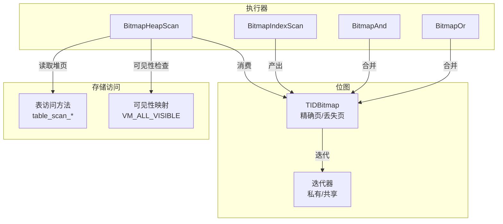
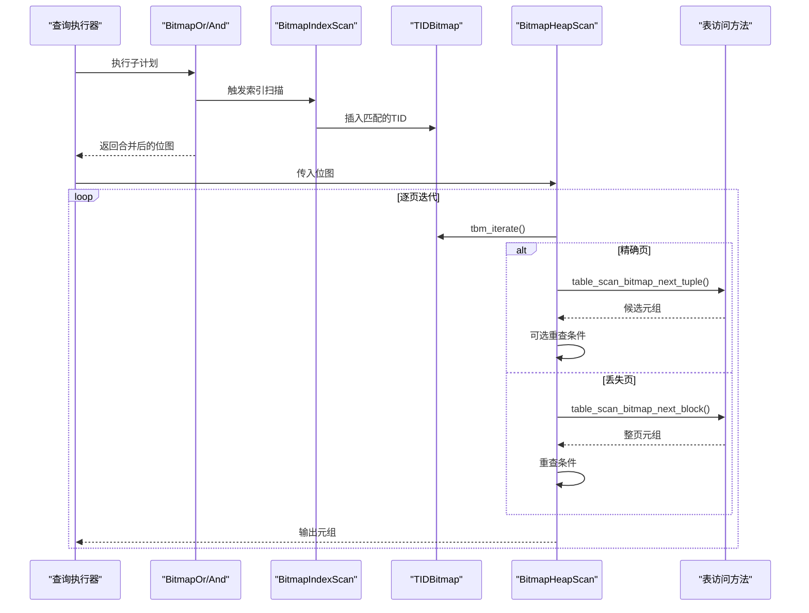
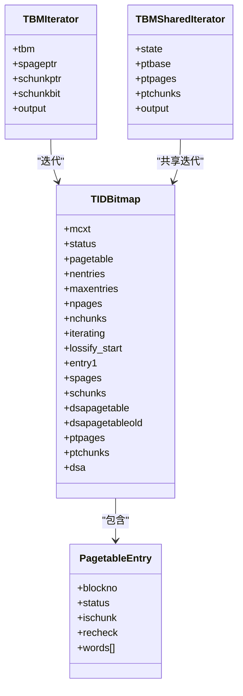
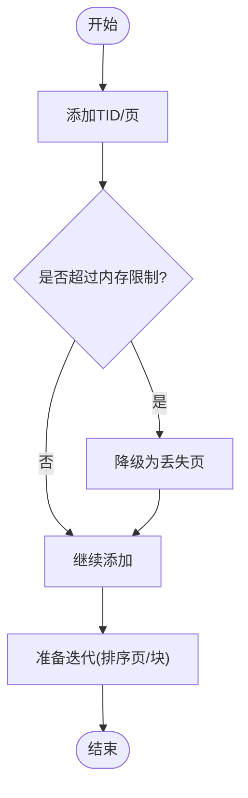
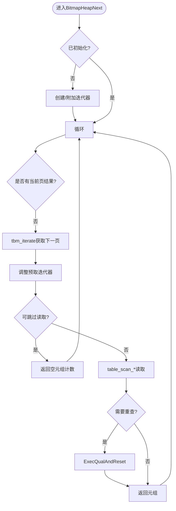
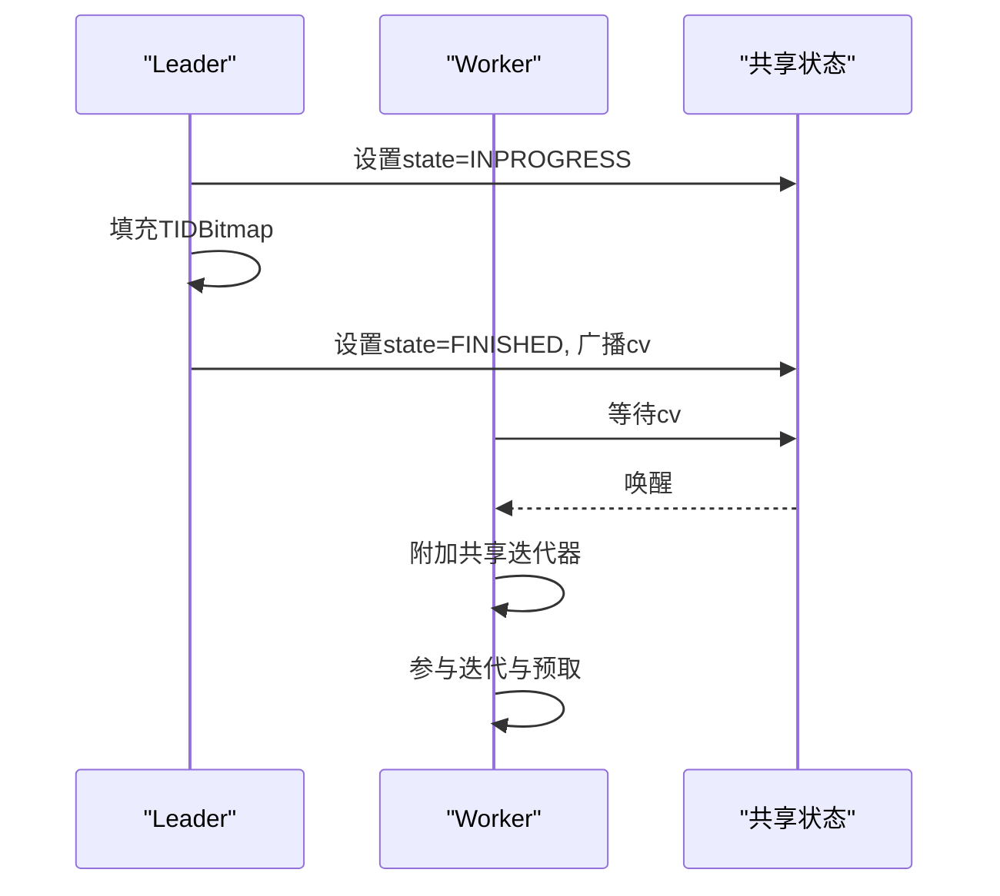
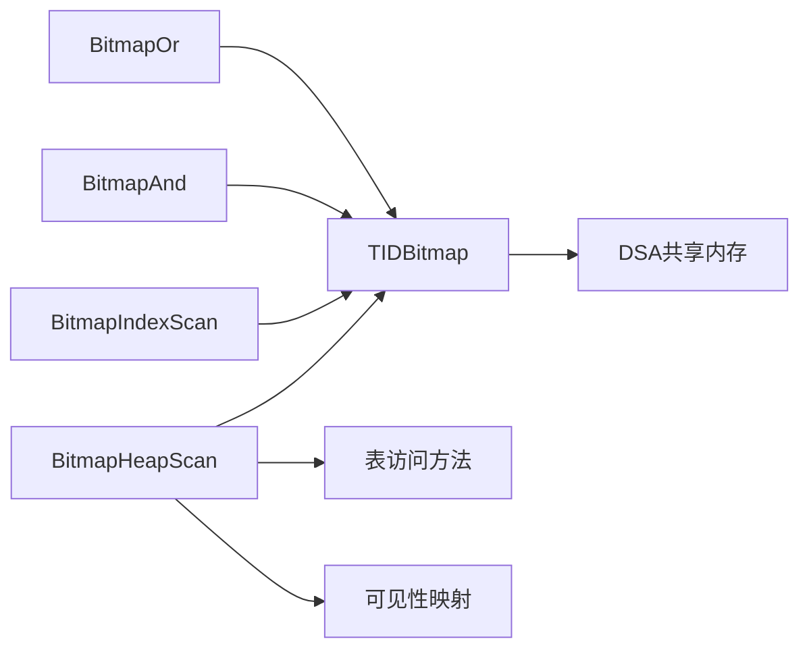

# 位图堆扫描

<cite>
**本文引用的文件**
- [nodeBitmapHeapscan.c](file://src/backend/executor/nodeBitmapHeapscan.c)
- [nodeBitmapIndexscan.c](file://src/backend/executor/nodeBitmapIndexscan.c)
- [tidbitmap.c](file://src/backend/nodes/tidbitmap.c)
- [tidbitmap.h](file://src/include/nodes/tidbitmap.h)
- [nodeBitmapAnd.c](file://src/backend/executor/nodeBitmapAnd.c)
- [nodeBitmapOr.c](file://src/backend/executor/nodeBitmapOr.c)
- [execnodes.h](file://src/include/nodes/execnodes.h)
</cite>

## 目录
1. [简介](#简介)
2. [项目结构](#项目结构)
3. [核心组件](#核心组件)
4. [架构总览](#架构总览)
5. [详细组件分析](#详细组件分析)
6. [依赖关系分析](#依赖关系分析)
7. [性能考量](#性能考量)
8. [故障排查指南](#故障排查指南)
9. [结论](#结论)
10. [附录](#附录)

## 简介
本文件面向Mini PostgreSQL中的“位图堆扫描”（BitmapHeapScan）节点，系统性阐述其工作原理与实现细节。内容涵盖：
- 位图生成、位图优化、元组获取三个阶段
- 位图数据结构设计（精确页与丢失页）、内存管理与溢出策略
- 并发控制与并行执行支持
- 与传统索引扫描的对比、适用场景与调优建议

## 项目结构
位图堆扫描由以下关键模块协作完成：
- 执行器节点：BitmapHeapScan、BitmapIndexScan、BitmapAnd/Or
- 位图数据结构：TIDBitmap及其迭代器
- 共享状态与并行：ParallelBitmapHeapState、DSA共享区域

图表来源
- [nodeBitmapHeapscan.c:70-338](file://src/backend/executor/nodeBitmapHeapscan.c#L70-L338)
- [nodeBitmapIndexscan.c:49-122](file://src/backend/executor/nodeBitmapIndexscan.c#L49-L122)
- [tidbitmap.c:148-169](file://src/backend/nodes/tidbitmap.c#L148-L169)
- [execnodes.h:1467-1489](file://src/include/nodes/execnodes.h#L1467-L1489)

章节来源
- [nodeBitmapHeapscan.c:70-338](file://src/backend/executor/nodeBitmapHeapscan.c#L70-L338)
- [nodeBitmapIndexscan.c:49-122](file://src/backend/executor/nodeBitmapIndexscan.c#L49-L122)
- [tidbitmap.c:148-169](file://src/backend/nodes/tidbitmap.c#L148-L169)
- [execnodes.h:1467-1489](file://src/include/nodes/execnodes.h#L1467-L1489)

## 核心组件
- BitmapHeapScan：基于位图从堆表中按TID顺序拉取元组，支持预取、跳过无必要列读取等优化
- BitmapIndexScan：遍历索引，将匹配TID写入位图
- TIDBitmap：存储TID集合的数据结构，支持精确页与丢失页两种表示，提供并集/交集操作与排序迭代
- BitmapAnd/Or：对多个子计划产生的位图进行AND/OR组合
- 并行支持：通过ParallelBitmapHeapState在进程间共享位图迭代状态与预取目标

章节来源
- [nodeBitmapHeapscan.c:704-824](file://src/backend/executor/nodeBitmapHeapscan.c#L704-L824)
- [nodeBitmapIndexscan.c:210-331](file://src/backend/executor/nodeBitmapIndexscan.c#L210-L331)
- [tidbitmap.c:264-330](file://src/backend/nodes/tidbitmap.c#L264-L330)
- [nodeBitmapAnd.c:109-167](file://src/backend/executor/nodeBitmapAnd.c#L109-L167)
- [nodeBitmapOr.c:110-185](file://src/backend/executor/nodeBitmapOr.c#L110-L185)
- [execnodes.h:1467-1489](file://src/include/nodes/execnodes.h#L1467-L1489)

## 架构总览
位图扫描的执行流程分为三阶段：
1) 位图生成：BitmapIndexScan调用索引AM收集TID并插入TIDBitmap；BitmapAnd/Or对多路结果进行集合运算
2) 位图优化：TIDBitmap内部根据内存限制自动将部分精确页转为丢失页，减少内存占用
3) 元组获取：BitmapHeapScan按块号顺序迭代位图，按需读取堆页，必要时重查条件

图表来源
- [nodeBitmapIndexscan.c:49-122](file://src/backend/executor/nodeBitmapIndexscan.c#L49-L122)
- [nodeBitmapAnd.c:109-167](file://src/backend/executor/nodeBitmapAnd.c#L109-L167)
- [nodeBitmapOr.c:110-185](file://src/backend/executor/nodeBitmapOr.c#L110-L185)
- [tidbitmap.c:687-753](file://src/backend/nodes/tidbitmap.c#L687-L753)
- [nodeBitmapHeapscan.c:70-338](file://src/backend/executor/nodeBitmapHeapscan.c#L70-L338)

## 详细组件分析

### 位图数据结构与内存管理（TIDBitmap）
- 精确页与丢失页：
  - 精确页：记录页内每个偏移位的集合，适合少量匹配
  - 丢失页：以“每页一位”的方式标记需要访问的页，适合大量匹配或内存紧张时
- 哈希表+数组：
  - 使用哈希表维护页到条目映射，首次迭代时构建有序页/块数组以便顺序访问
- 内存上限与自动降级：
  - 当条目数超过阈值时，将部分精确页转换为丢失页，保证内存可控
- 迭代器：
  - 私有迭代器与共享迭代器，支持并行执行中多进程共同迭代同一位图

图表来源
- [tidbitmap.c:148-169](file://src/backend/nodes/tidbitmap.c#L148-L169)
- [tidbitmap.c:99-115](file://src/backend/nodes/tidbitmap.c#L99-L115)
- [tidbitmap.c:177-225](file://src/backend/nodes/tidbitmap.c#L177-L225)

章节来源
- [tidbitmap.c:99-115](file://src/backend/nodes/tidbitmap.c#L99-L115)
- [tidbitmap.c:148-169](file://src/backend/nodes/tidbitmap.c#L148-L169)
- [tidbitmap.c:264-330](file://src/backend/nodes/tidbitmap.c#L264-L330)
- [tidbitmap.c:687-753](file://src/backend/nodes/tidbitmap.c#L687-L753)

### 位图生成与优化
- 生成：
  - BitmapIndexScan循环调用index_getbitmap将TID写入TIDBitmap
  - BitmapOr/And分别调用tbm_union/tbm_intersect合并多路结果
- 优化：
  - 当条目数超过阈值，触发tbm_lossify将精确页转为丢失页
  - 迭代前构建有序页/块数组，确保按块号顺序访问，提升I/O局部性

图表来源
- [nodeBitmapIndexscan.c:49-122](file://src/backend/executor/nodeBitmapIndexscan.c#L49-L122)
- [nodeBitmapAnd.c:109-167](file://src/backend/executor/nodeBitmapAnd.c#L109-L167)
- [nodeBitmapOr.c:110-185](file://src/backend/executor/nodeBitmapOr.c#L110-L185)
- [tidbitmap.c:435-449](file://src/backend/nodes/tidbitmap.c#L435-L449)
- [tidbitmap.c:687-753](file://src/backend/nodes/tidbitmap.c#L687-L753)

章节来源
- [nodeBitmapIndexscan.c:49-122](file://src/backend/executor/nodeBitmapIndexscan.c#L49-L122)
- [nodeBitmapAnd.c:109-167](file://src/backend/executor/nodeBitmapAnd.c#L109-L167)
- [nodeBitmapOr.c:110-185](file://src/backend/executor/nodeBitmapOr.c#L110-L185)
- [tidbitmap.c:435-449](file://src/backend/nodes/tidbitmap.c#L435-L449)
- [tidbitmap.c:687-753](file://src/backend/nodes/tidbitmap.c#L687-L753)

### 元组获取与访问优化
- 主循环：
  - 首次调用时初始化位图迭代器，后续按块号顺序迭代
  - 精确页：直接提取元组；丢失页：整页读取后重查条件
- 可见性优化：
  - 若无需读取堆列且页面全可见，可跳过实际读取，仅返回空元组占位
- 预取机制：
  - 维护独立预取迭代器，动态调整预取目标距离，减少随机I/O

图表来源
- [nodeBitmapHeapscan.c:70-338](file://src/backend/executor/nodeBitmapHeapscan.c#L70-L338)
- [nodeBitmapHeapscan.c:358-413](file://src/backend/executor/nodeBitmapHeapscan.c#L358-L413)
- [nodeBitmapHeapscan.c:423-457](file://src/backend/executor/nodeBitmapHeapscan.c#L423-L457)
- [nodeBitmapHeapscan.c:462-562](file://src/backend/executor/nodeBitmapHeapscan.c#L462-L562)

章节来源
- [nodeBitmapHeapscan.c:70-338](file://src/backend/executor/nodeBitmapHeapscan.c#L70-L338)
- [nodeBitmapHeapscan.c:358-413](file://src/backend/executor/nodeBitmapHeapscan.c#L358-L413)
- [nodeBitmapHeapscan.c:423-457](file://src/backend/executor/nodeBitmapHeapscan.c#L423-L457)
- [nodeBitmapHeapscan.c:462-562](file://src/backend/executor/nodeBitmapHeapscan.c#L462-L562)

### 并发控制与并行执行
- 共享状态：
  - ParallelBitmapHeapState包含位图迭代器指针、预取状态、互斥锁、条件变量及快照数据
- 协调流程：
  - 首个进程成为leader，负责填充TIDBitmap并设置共享状态为完成
  - 其他worker等待条件变量唤醒后，附加共享迭代器参与迭代
- 预取共享：
  - 预取目标与页数在共享状态下受自旋锁保护，避免竞争

图表来源
- [execnodes.h:1467-1489](file://src/include/nodes/execnodes.h#L1467-L1489)
- [nodeBitmapHeapscan.c:820-859](file://src/backend/executor/nodeBitmapHeapscan.c#L820-L859)
- [nodeBitmapHeapscan.c:888-916](file://src/backend/executor/nodeBitmapHeapscan.c#L888-L916)

章节来源
- [execnodes.h:1467-1489](file://src/include/nodes/execnodes.h#L1467-L1489)
- [nodeBitmapHeapscan.c:820-859](file://src/backend/executor/nodeBitmapHeapscan.c#L820-L859)
- [nodeBitmapHeapscan.c:888-916](file://src/backend/executor/nodeBitmapHeapscan.c#L888-L916)

### 与传统索引扫描的对比
- 位图扫描优势：
  - 适合多条件组合（AND/OR），先产生位图再统一访问堆，减少重复IO
  - 对选择性较差的条件更友好，通过丢失页降低内存压力
- 传统索引扫描特点：
  - 单一路径扫描，适合高选择性条件，但多条件组合可能多次访问堆
- 选择建议：
  - 多条件、中等选择性：优先位图扫描
  - 高选择性、单条件：传统索引扫描更高效

章节来源
- [nodeBitmapIndexscan.c:49-122](file://src/backend/executor/nodeBitmapIndexscan.c#L49-L122)
- [nodeBitmapAnd.c:109-167](file://src/backend/executor/nodeBitmapAnd.c#L109-L167)
- [nodeBitmapOr.c:110-185](file://src/backend/executor/nodeBitmapOr.c#L110-L185)
- [nodeBitmapHeapscan.c:70-338](file://src/backend/executor/nodeBitmapHeapscan.c#L70-L338)

## 依赖关系分析
- 执行器层：
  - BitmapHeapScan依赖TIDBitmap迭代器与表访问方法
  - BitmapIndexScan依赖索引AM接口
  - BitmapAnd/Or依赖位图集合运算
- 存储层：
  - 可见性映射用于跳过读取优化
  - DSA用于并行共享内存分配

图表来源
- [nodeBitmapHeapscan.c:70-338](file://src/backend/executor/nodeBitmapHeapscan.c#L70-L338)
- [nodeBitmapIndexscan.c:49-122](file://src/backend/executor/nodeBitmapIndexscan.c#L49-L122)
- [tidbitmap.c:264-330](file://src/backend/nodes/tidbitmap.c#L264-L330)
- [execnodes.h:1467-1489](file://src/include/nodes/execnodes.h#L1467-L1489)

章节来源
- [nodeBitmapHeapscan.c:70-338](file://src/backend/executor/nodeBitmapHeapscan.c#L70-L338)
- [nodeBitmapIndexscan.c:49-122](file://src/backend/executor/nodeBitmapIndexscan.c#L49-L122)
- [tidbitmap.c:264-330](file://src/backend/nodes/tidbitmap.c#L264-L330)
- [execnodes.h:1467-1489](file://src/include/nodes/execnodes.h#L1467-L1489)

## 性能考量
- I/O局部性：
  - 位图按块号顺序迭代，减少随机访问
- 预取优化：
  - 动态增长预取目标，平衡吞吐与延迟
- 可见性跳过：
  - 无需读取列且页面全可见时，跳过堆读取，显著降低IO
- 内存控制：
  - 自动降级为丢失页，防止内存膨胀
- 并行扩展：
  - 共享迭代器与预取状态，多进程协同工作

章节来源
- [nodeBitmapHeapscan.c:358-413](file://src/backend/executor/nodeBitmapHeapscan.c#L358-L413)
- [nodeBitmapHeapscan.c:423-457](file://src/backend/executor/nodeBitmapHeapscan.c#L423-L457)
- [nodeBitmapHeapscan.c:462-562](file://src/backend/executor/nodeBitmapHeapscan.c#L462-L562)
- [tidbitmap.c:435-449](file://src/backend/nodes/tidbitmap.c#L435-L449)

## 故障排查指南
- 常见错误：
  - 非MVCC快照：位图扫描要求MVCC快照，否则可能返回不满足条件的元组
  - 子计划类型不符：期望TIDBitmap但收到其他类型
  - 零输入：BitmapAnd/Or不支持零输入
- 调试要点：
  - 检查位图是否为空、是否触发丢失页
  - 观察预取目标与页数是否同步
  - 并行模式下确认共享状态转换与条件变量唤醒

章节来源
- [nodeBitmapHeapscan.c:6-16](file://src/backend/executor/nodeBitmapHeapscan.c#L6-L16)
- [nodeBitmapHeapscan.c:112-118](file://src/backend/executor/nodeBitmapHeapscan.c#L112-L118)
- [nodeBitmapAnd.c:159-161](file://src/backend/executor/nodeBitmapAnd.c#L159-L161)
- [nodeBitmapOr.c:176-179](file://src/backend/executor/nodeBitmapOr.c#L176-L179)

## 结论
位图堆扫描通过“先位图、后堆”的两阶段策略，在多条件组合查询中展现出良好的灵活性与可扩展性。其精确页/丢失页混合表示、自动内存降级、预取与可见性优化，以及并行共享迭代能力，使其在高并发与大数据量场景中具备显著优势。合理运用位图扫描并结合统计信息与参数调优，可在复杂查询条件下获得稳定高效的执行性能。

## 附录
- 适用场景：
  - 多条件AND/OR组合、选择性中等、需合并多索引结果
- 调优建议：
  - 调整work_mem以平衡位图容量与降级频率
  - 启用预取并根据负载调整最大预取距离
  - 确保统计信息准确，帮助规划器选择合适计划
- 与传统索引扫描对比：
  - 位图扫描更适合多条件与低选择性；传统索引扫描在高选择性单条件下更高效