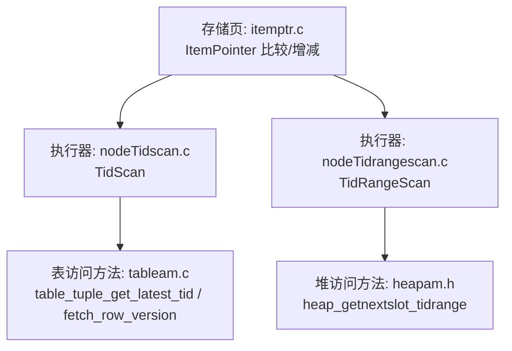
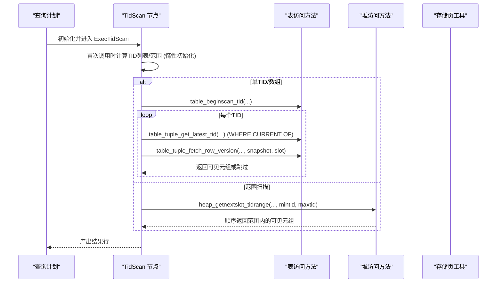
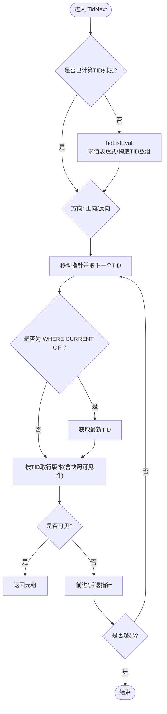
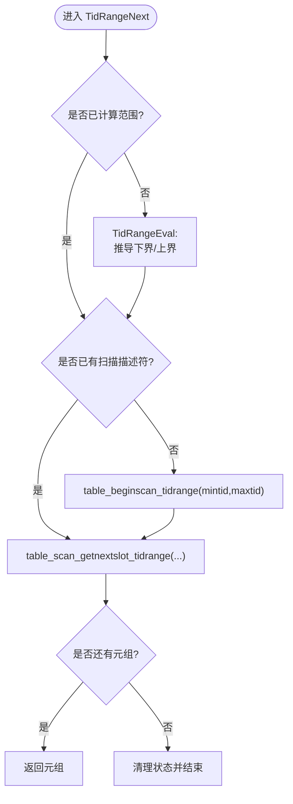
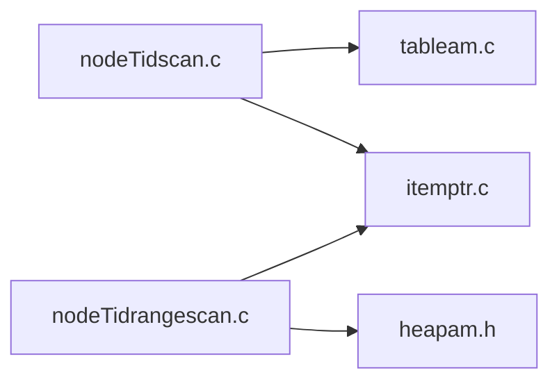

# 元组ID扫描

<cite>
**本文引用的文件**
- [nodeTidscan.c](file://src/backend/executor/nodeTidscan.c)
- [nodeTidrangescan.c](file://src/backend/executor/nodeTidrangescan.c)
- [heapam.h](file://src/include/access/heapam.h)
- [itemptr.c](file://src/backend/storage/page/itemptr.c)
- [tableam.c](file://src/backend/access/table/tableam.c)
</cite>

## 目录
1. [简介](#简介)
2. [项目结构](#项目结构)
3. [核心组件](#核心组件)
4. [架构总览](#架构总览)
5. [详细组件分析](#详细组件分析)
6. [依赖关系分析](#依赖关系分析)
7. [性能考量](#性能考量)
8. [故障排查指南](#故障排查指南)
9. [结论](#结论)
10. [附录](#附录)

## 简介
本文件针对 Mini PostgreSQL 中的“元组ID扫描”（TID Scan）与“TID范围扫描”（TID Range Scan）进行系统化文档化。重点解释：
- 基于物理位置直接访问元组的实现原理
- TID（ItemPointerData）数据结构及其比较、排序与范围操作
- 随机访问优化策略（排序去重、延迟初始化、可见性检查）
- 典型使用场景（子查询优化、更新删除定位等）
- MVCC环境下的可见性检查与并发安全保证
- 与其他扫描类型的配合与差异
- 实际应用场景示例与性能分析要点

## 项目结构
围绕元组ID扫描的核心代码位于执行器层，主要包含两类节点：
- TidScan：按一组TID直接读取元组
- TidRangeScan：按TID范围进行顺序扫描

此外，TID的底层表示与比较在存储页层提供；MVCC可见性与最新版本获取由表访问方法（Table AM）提供；堆访问方法（Heap AM）提供具体的范围扫描接口。

图表来源
- [nodeTidscan.c:123-275](file://src/backend/executor/nodeTidscan.c#L123-L275)
- [nodeTidrangescan.c:123-205](file://src/backend/executor/nodeTidrangescan.c#L123-L205)
- [heapam.h:130-134](file://src/include/access/heapam.h#L130-L134)
- [itemptr.c:104-132](file://src/backend/storage/page/itemptr.c#L104-L132)
- [tableam.c:234-238](file://src/backend/access/table/tableam.c#L234-L238)

章节来源
- [nodeTidscan.c:1-570](file://src/backend/executor/nodeTidscan.c#L1-L570)
- [nodeTidrangescan.c:1-424](file://src/backend/executor/nodeTidrangescan.c#L1-L424)
- [heapam.h:1-200](file://src/include/access/heapam.h#L1-L200)
- [itemptr.c:1-132](file://src/backend/storage/page/itemptr.c#L1-L132)
- [tableam.c:196-238](file://src/backend/access/table/tableam.c#L196-L238)

## 核心组件
- TidScan 节点
  - 负责根据表达式计算出的一个或多个TID，直接到堆表中按物理位置取回元组
  - 支持单TID、TID数组、以及 WHERE CURRENT OF 语义
  - 对TID列表进行排序与去重，以优化磁盘访问顺序并避免重复读取
  - 首次访问时惰性初始化扫描描述符，减少不必要的开销
- TidRangeScan 节点
  - 将CTID的比较条件转换为下界与上界，调用堆表的范围扫描接口顺序遍历
  - 支持包含/不包含边界的规范化处理
  - 通过范围限制减少不必要页面访问
- TID 数据结构与工具
  - ItemPointerData 由块号与偏移组成，提供比较、递增/递减等基础操作
- 可见性与最新版本获取
  - 通过 Table AM 提供的函数在当前快照下获取最新可见版本或最新TID
  - 结合 MVCC 快照确保并发安全

章节来源
- [nodeTidscan.c:65-121](file://src/backend/executor/nodeTidscan.c#L65-L121)
- [nodeTidscan.c:129-275](file://src/backend/executor/nodeTidscan.c#L129-L275)
- [nodeTidscan.c:309-395](file://src/backend/executor/nodeTidscan.c#L309-L395)
- [nodeTidrangescan.c:52-95](file://src/backend/executor/nodeTidrangescan.c#L52-L95)
- [nodeTidrangescan.c:132-205](file://src/backend/executor/nodeTidrangescan.c#L132-L205)
- [itemptr.c:104-132](file://src/backend/storage/page/itemptr.c#L104-L132)
- [tableam.c:234-238](file://src/backend/access/table/tableam.c#L234-L238)

## 架构总览
TID扫描的执行流程分为“准备阶段”和“迭代阶段”。准备阶段解析并编译TID相关表达式，生成待访问的TID集合或范围；迭代阶段按顺序或范围从堆表中取回元组，并在MVCC快照下进行可见性判断。

图表来源
- [nodeTidscan.c:129-275](file://src/backend/executor/nodeTidscan.c#L129-L275)
- [nodeTidscan.c:309-395](file://src/backend/executor/nodeTidscan.c#L309-L395)
- [nodeTidrangescan.c:215-263](file://src/backend/executor/nodeTidrangescan.c#L215-L263)
- [heapam.h:130-134](file://src/include/access/heapam.h#L130-L134)
- [tableam.c:234-238](file://src/backend/access/table/tableam.c#L234-L238)

## 详细组件分析

### TidScan：基于TID的直接访问
- 表达式解析与编译
  - 支持 ctid = expr、ctid IN (array)、WHERE CURRENT OF 等形式
  - 将表达式编译为 ExprState，便于运行时求值
- TID列表构建
  - 惰性初始化：仅在第一次需要时创建扫描描述符
  - 过滤无效TID：调用AM接口校验TID有效性
  - 排序与去重：按块号+偏移排序，提升顺序IO；去重避免重复读取
- 迭代与可见性
  - 正向/反向扫描指针管理
  - WHERE CURRENT OF 时先获取当前游标对应行的最新TID
  - 使用快照进行可见性检查，不可见则跳过
- Recheck 支持
  - EvalPlanQual 中通过二分查找确认TID是否在列表中

图表来源
- [nodeTidscan.c:129-275](file://src/backend/executor/nodeTidscan.c#L129-L275)
- [nodeTidscan.c:309-395](file://src/backend/executor/nodeTidscan.c#L309-L395)

章节来源
- [nodeTidscan.c:65-121](file://src/backend/executor/nodeTidscan.c#L65-L121)
- [nodeTidscan.c:129-275](file://src/backend/executor/nodeTidscan.c#L129-L275)
- [nodeTidscan.c:309-395](file://src/backend/executor/nodeTidscan.c#L309-L395)
- [nodeTidscan.c:400-420](file://src/backend/executor/nodeTidscan.c#L400-L420)

### TidRangeScan：基于TID范围的顺序扫描
- 边界推导
  - 将 ctid < / <= / > / >= 表达式解析为下界/上界
  - 非包含边界进行规范化（如 < 转为 <= 的下一项）
- 范围扫描
  - 首次进入时计算范围并启动堆表范围扫描
  - 后续通过范围接口顺序获取元组
- Recheck 支持
  - 重新评估范围，并校验当前元组TID仍在范围内

图表来源
- [nodeTidrangescan.c:132-205](file://src/backend/executor/nodeTidrangescan.c#L132-L205)
- [nodeTidrangescan.c:215-263](file://src/backend/executor/nodeTidrangescan.c#L215-L263)

章节来源
- [nodeTidrangescan.c:52-95](file://src/backend/executor/nodeTidrangescan.c#L52-L95)
- [nodeTidrangescan.c:132-205](file://src/backend/executor/nodeTidrangescan.c#L132-L205)
- [nodeTidrangescan.c:215-263](file://src/backend/executor/nodeTidrangescan.c#L215-L263)
- [nodeTidrangescan.c:268-282](file://src/backend/executor/nodeTidrangescan.c#L268-L282)

### TID数据结构与工具
- ItemPointerData：由块号与偏移构成，用于精确定位页内元组
- 比较与调整：提供相等、大小比较、递增/递减等操作，支撑排序与范围边界规范化

章节来源
- [itemptr.c:104-132](file://src/backend/storage/page/itemptr.c#L104-L132)

### 可见性与并发安全
- 最新版本获取：WHERE CURRENT OF 场景下，先获取当前游标对应的最新TID，再按快照取行版本
- 可见性检查：按快照过滤，确保只返回当前事务可见的元组
- 并发安全：持有必要的锁（例如 AccessShareLock），防止截断导致的目标块失效；AM层保证TID有效性检查

章节来源
- [nodeTidscan.c:371-379](file://src/backend/executor/nodeTidscan.c#L371-L379)
- [tableam.c:234-238](file://src/backend/access/table/tableam.c#L234-L238)

## 依赖关系分析
- 执行器层
  - nodeTidscan.c：TidScan 节点逻辑（表达式求值、TID列表、迭代）
  - nodeTidrangescan.c：TidRangeScan 节点逻辑（范围推导、范围扫描）
- 表访问方法层
  - tableam.c：通用表访问抽象（最新TID获取、行版本读取）
- 堆访问方法层
  - heapam.h：堆表范围扫描接口定义
- 存储页层
  - itemptr.c：TID比较与调整工具

图表来源
- [nodeTidscan.c:129-275](file://src/backend/executor/nodeTidscan.c#L129-L275)
- [nodeTidrangescan.c:132-205](file://src/backend/executor/nodeTidrangescan.c#L132-L205)
- [heapam.h:130-134](file://src/include/access/heapam.h#L130-L134)
- [itemptr.c:104-132](file://src/backend/storage/page/itemptr.c#L104-L132)
- [tableam.c:234-238](file://src/backend/access/table/tableam.c#L234-L238)

章节来源
- [nodeTidscan.c:129-275](file://src/backend/executor/nodeTidscan.c#L129-L275)
- [nodeTidrangescan.c:132-205](file://src/backend/executor/nodeTidrangescan.c#L132-L205)
- [heapam.h:130-134](file://src/include/access/heapam.h#L130-L134)
- [itemptr.c:104-132](file://src/backend/storage/page/itemptr.c#L104-L132)
- [tableam.c:234-238](file://src/backend/access/table/tableam.c#L234-L238)

## 性能考量
- 随机访问优化
  - 排序与去重：TID列表按块号+偏移排序，最大化顺序IO；去重避免重复读取
  - 惰性初始化：仅在首次需要时创建扫描描述符，降低无执行路径的开销
- 范围扫描优势
  - 将多个不等式约束合并为上下界，利用堆表范围扫描顺序访问，减少随机I/O
- 可见性检查成本
  - 每次取行需进行快照可见性判断；WHERE CURRENT OF 会额外获取最新TID
- 与Bitmap Heap Scan的配合
  - 当索引扫描产生大量TID时，可考虑使用 Bitmap Heap Scan 批量收集TID后再进行堆访问；TID Scan适合少量精确命中或已知TID的场景
- 潜在瓶颈
  - 大量随机TID会导致随机I/O增多；应优先通过索引或范围条件减少随机访问
  - 高并发下可见性检查频繁，需关注快照一致性与锁竞争

[本节为通用性能讨论，不直接分析具体文件]

## 故障排查指南
- 常见错误
  - 无法识别CTID变量：表达式未正确匹配 ctid 相关形式
  - 无法识别CTID运算符：范围扫描使用了不支持的操作符
  - 无效TID：TID超出范围或被标记为无效，会被自动忽略
- 调试建议
  - 检查TID表达式是否正确编译为 ExprState
  - 确认 WHERE CURRENT OF 使用的游标与目标表一致
  - 验证范围边界规范化是否符合预期（包含/不包含）
  - 观察可见性检查结果，确认快照设置与事务可见性

章节来源
- [nodeTidscan.c:79-113](file://src/backend/executor/nodeTidscan.c#L79-L113)
- [nodeTidrangescan.c:61-90](file://src/backend/executor/nodeTidrangescan.c#L61-L90)
- [nodeTidscan.c:175-183](file://src/backend/executor/nodeTidscan.c#L175-L183)

## 结论
TID扫描提供了基于物理位置的快速定位能力，适用于已知TID或可通过表达式高效推导TID的场景。通过排序去重、惰性初始化、范围扫描与MVCC可见性检查，系统在随机访问与顺序访问之间取得平衡。对于大规模随机访问，建议结合索引或Bitmap扫描策略；对于少量精确命中或游标相关操作，TID扫描具有显著优势。

[本节为总结性内容，不直接分析具体文件]

## 附录
- 典型使用场景
  - 子查询优化：当子查询能返回少量明确TID时，使用TID扫描直接定位父表元组
  - 更新/删除定位：通过主键或唯一索引找到TID后，使用TID扫描进行二次定位并应用变更
  - 游标操作：WHERE CURRENT OF 语义下，基于游标当前位置的最新版本进行更新或删除
- 示例SQL思路（概念性）
  - 通过索引得到TID后，使用 ctid IN (...) 触发TID扫描
  - 使用 ctid BETWEEN a AND b 触发TID范围扫描
  - 使用 WHERE CURRENT OF cursor 进行游标定位更新/删除
- 性能分析方法
  - 使用 EXPLAIN 观察是否选择了 TidScan/TidRangeScan
  - 对比不同条件下（TID数量、范围大小）的I/O与CPU开销
  - 在高并发环境下监控可见性检查与锁等待

[本节为概念性说明，不直接分析具体文件]