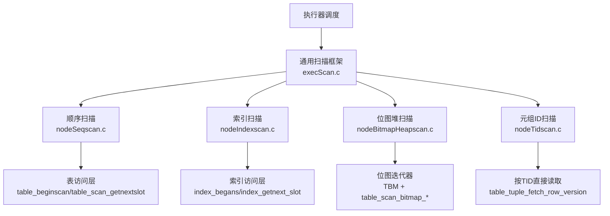
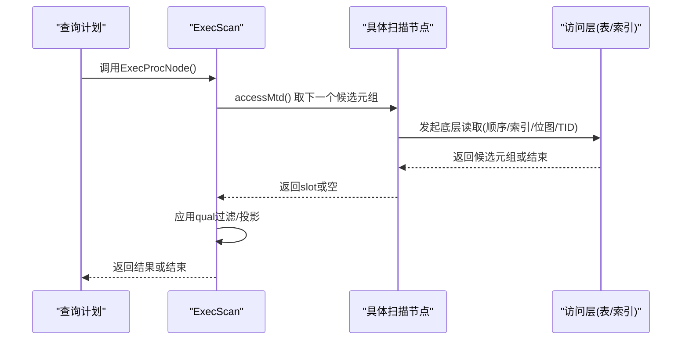
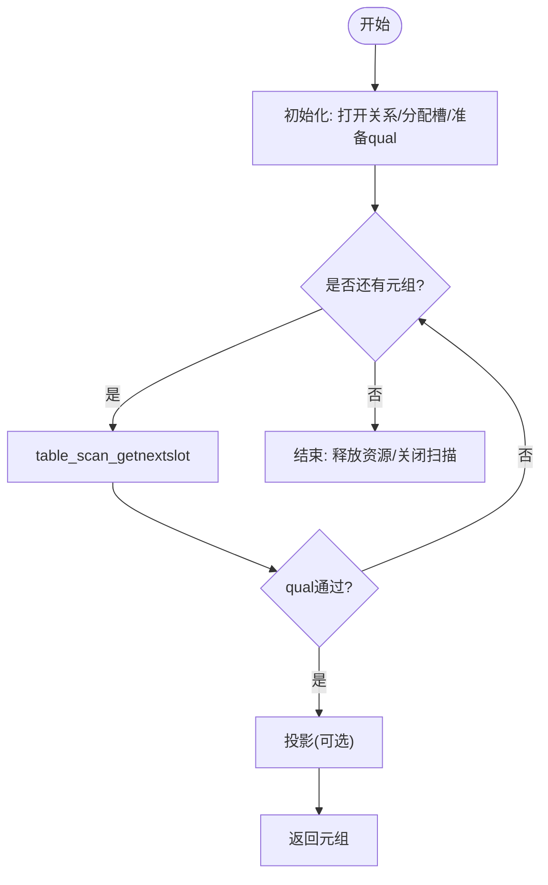
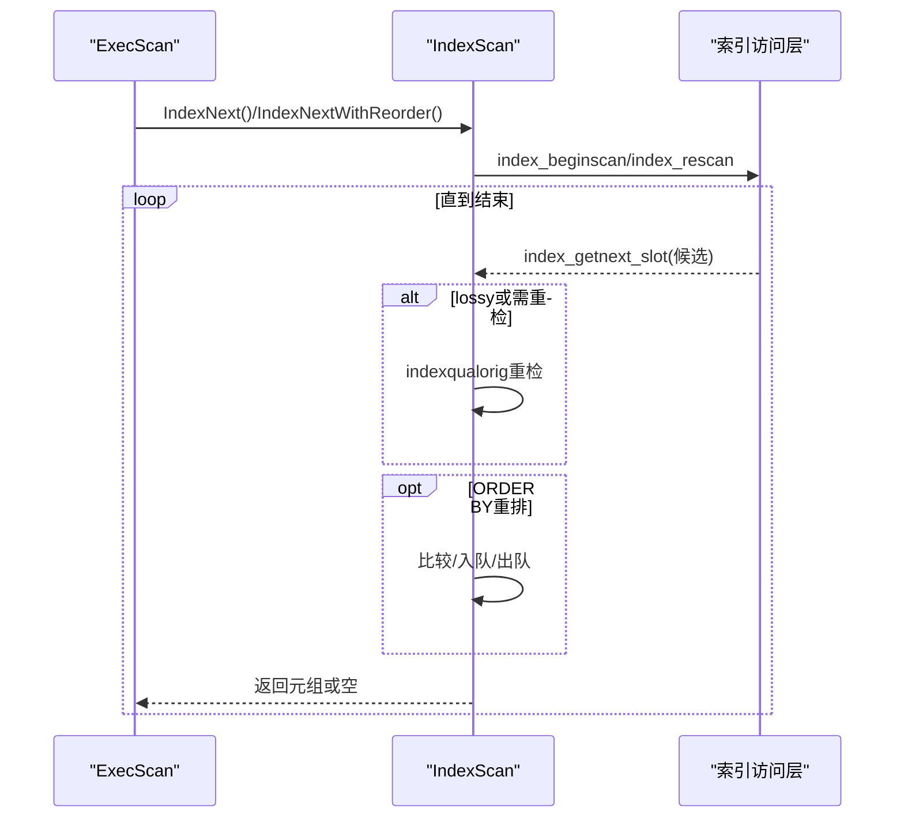
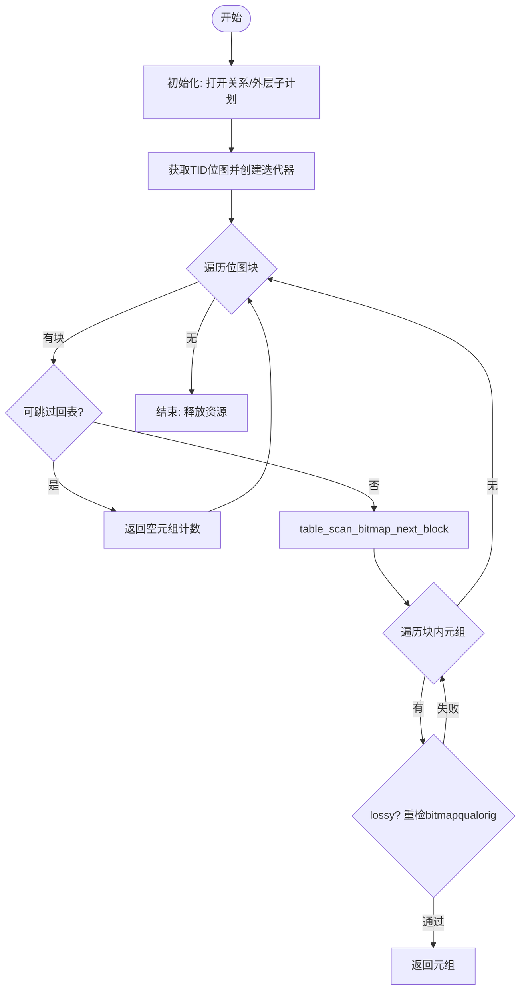
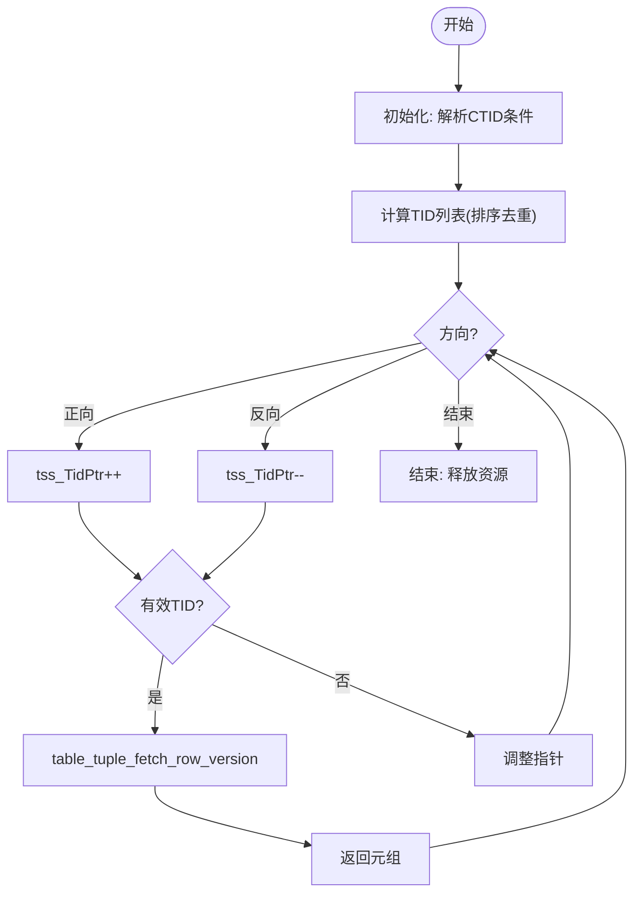
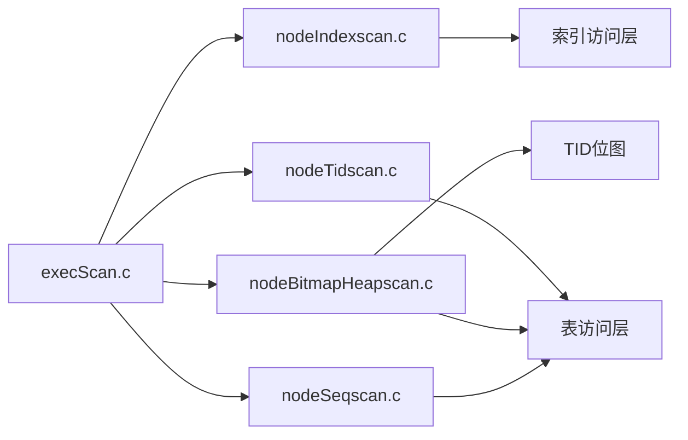

# 扫描节点

<cite>
**本文引用的文件**
- [nodeSeqscan.c](file://src/backend/executor/nodeSeqscan.c)
- [nodeIndexscan.c](file://src/backend/executor/nodeIndexscan.c)
- [nodeBitmapHeapscan.c](file://src/backend/executor/nodeBitmapHeapscan.c)
- [nodeTidscan.c](file://src/backend/executor/nodeTidscan.c)
- [execScan.c](file://src/backend/executor/execScan.c)
- [nodeSeqscan.h](file://src/include/executor/nodeSeqscan.h)
- [nodeIndexscan.h](file://src/include/executor/nodeIndexscan.h)
- [nodeBitmapHeapscan.h](file://src/include/executor/nodeBitmapHeapscan.h)
- [nodeTidscan.h](file://src/include/executor/nodeTidscan.h)
</cite>

## 目录
1. [简介](#简介)
2. [项目结构](#项目结构)
3. [核心组件](#核心组件)
4. [架构总览](#架构总览)
5. [详细组件分析](#详细组件分析)
6. [依赖关系分析](#依赖关系分析)
7. [性能考量](#性能考量)
8. [故障排查指南](#故障排查指南)
9. [结论](#结论)
10. [附录](#附录)

## 简介
本文件面向Mini PostgreSQL执行器中的“扫描节点”，系统性说明顺序扫描（SeqScan）、索引扫描（IndexScan）、位图堆扫描（BitmapHeapScan）与元组ID扫描（TidScan）的实现原理、生命周期（启动/获取元组/关闭）、参数配置、过滤条件处理、并行化支持及性能优化策略。文档同时提供流程图、时序图与对比分析，帮助读者理解不同扫描类型的适用场景与选择标准，并为查询优化与扩展开发提供实践指导。

## 项目结构
扫描节点位于执行器子系统中，围绕统一的ExecScan框架实现：
- 通用扫描框架：execScan.c 提供统一的取数、过滤、投影与EPQ重检流程
- 具体扫描类型：
  - 顺序扫描：nodeSeqscan.c
  - 索引扫描：nodeIndexscan.c
  - 位图堆扫描：nodeBitmapHeapscan.c
  - 元组ID扫描：nodeTidscan.c
- 头文件定义各扫描节点的对外接口与并行支持函数原型

图表来源
- [execScan.c:164-263](file://src/backend/executor/execScan.c#L164-L263)
- [nodeSeqscan.c:107-115](file://src/backend/executor/nodeSeqscan.c#L107-L115)
- [nodeIndexscan.c:521-540](file://src/backend/executor/nodeIndexscan.c#L521-L540)
- [nodeBitmapHeapscan.c:586-594](file://src/backend/executor/nodeBitmapHeapscan.c#L586-L594)
- [nodeTidscan.c:441-449](file://src/backend/executor/nodeTidscan.c#L441-L449)

章节来源
- [execScan.c:164-263](file://src/backend/executor/execScan.c#L164-L263)

## 核心组件
- 统一扫描框架（ExecScan）
  - 负责调用具体Access Method取元组、应用qual过滤、投影输出、EPQ重检与中断检查
- 顺序扫描（SeqScan）
  - 通过表访问层顺序遍历堆页，返回满足条件的元组
- 索引扫描（IndexScan）
  - 基于索引键进行有序或无序访问，支持ORDER BY重排序队列与运行时键
- 位图堆扫描（BitmapHeapScan）
  - 先由上层索引扫描生成TID位图，再按需回表取元组；支持预取与并行共享迭代
- 元组ID扫描（TidScan）
  - 根据CTID列表直接定位并读取元组，支持CURRENT OF语义与数组TID

章节来源
- [execScan.c:164-263](file://src/backend/executor/execScan.c#L164-L263)
- [nodeSeqscan.c:122-175](file://src/backend/executor/nodeSeqscan.c#L122-L175)
- [nodeIndexscan.c:521-540](file://src/backend/executor/nodeIndexscan.c#L521-L540)
- [nodeBitmapHeapscan.c:704-797](file://src/backend/executor/nodeBitmapHeapscan.c#L704-L797)
- [nodeTidscan.c:508-569](file://src/backend/executor/nodeTidscan.c#L508-L569)

## 架构总览
扫描节点遵循“统一入口+差异化Access Method”的架构：
- ExecScan作为统一循环，封装了取数、过滤、投影与EPQ重检
- 各扫描节点仅实现具体的Next与Recheck方法，并通过ExecScan接入统一流程
- 并行扫描通过DSM共享状态与专用初始化/恢复函数完成

图表来源
- [execScan.c:164-263](file://src/backend/executor/execScan.c#L164-L263)
- [nodeSeqscan.c:107-115](file://src/backend/executor/nodeSeqscan.c#L107-L115)
- [nodeIndexscan.c:521-540](file://src/backend/executor/nodeIndexscan.c#L521-L540)
- [nodeBitmapHeapscan.c:586-594](file://src/backend/executor/nodeBitmapHeapscan.c#L586-L594)
- [nodeTidscan.c:441-449](file://src/backend/executor/nodeTidscan.c#L441-L449)

## 详细组件分析

### 顺序扫描（SeqScan）
- 启动（Init）
  - 创建SeqScanState，打开关系，分配槽与投影信息，初始化qual表达式
- 获取元组（Next）
  - 若为串行或非并行计划，调用表层begin/getnextslot逐行读取
  - 返回满足条件的元组，否则继续
- 关闭（End/ReScan）
  - 释放表达式上下文、清空槽、结束表扫描；ReScan时重置扫描描述符

图表来源
- [nodeSeqscan.c:122-175](file://src/backend/executor/nodeSeqscan.c#L122-L175)
- [nodeSeqscan.c:49-83](file://src/backend/executor/nodeSeqscan.c#L49-L83)
- [nodeSeqscan.c:183-235](file://src/backend/executor/nodeSeqscan.c#L183-L235)

章节来源
- [nodeSeqscan.c:122-175](file://src/backend/executor/nodeSeqscan.c#L122-L175)
- [nodeSeqscan.c:49-83](file://src/backend/executor/nodeSeqscan.c#L49-L83)
- [nodeSeqscan.c:183-235](file://src/backend/executor/nodeSeqscan.c#L183-L235)
- [nodeSeqscan.h:20-29](file://src/include/executor/nodeSeqscan.h#L20-L29)

### 索引扫描（IndexScan）
- 启动（Init）
  - 构建扫描键与ORDER BY键，必要时计算运行时键
- 获取元组（Next/WithReorder）
  - 首次调用时建立索引扫描描述符，传入扫描键与ORDER BY键
  - 若索引返回可能不精确（lossy），使用indexqualorig重检
  - 当存在ORDER BY且需要重排时，使用配对堆维护有序队列
- 关闭（End/ReScan）
  - ReScan时重新评估运行时键、清空重排队列、重置索引扫描

图表来源
- [nodeIndexscan.c:80-161](file://src/backend/executor/nodeIndexscan.c#L80-L161)
- [nodeIndexscan.c:170-357](file://src/backend/executor/nodeIndexscan.c#L170-L357)
- [nodeIndexscan.c:521-540](file://src/backend/executor/nodeIndexscan.c#L521-L540)
- [nodeIndexscan.c:553-593](file://src/backend/executor/nodeIndexscan.c#L553-L593)

章节来源
- [nodeIndexscan.c:80-161](file://src/backend/executor/nodeIndexscan.c#L80-L161)
- [nodeIndexscan.c:170-357](file://src/backend/executor/nodeIndexscan.c#L170-L357)
- [nodeIndexscan.c:521-540](file://src/backend/executor/nodeIndexscan.c#L521-L540)
- [nodeIndexscan.c:553-593](file://src/backend/executor/nodeIndexscan.c#L553-L593)
- [nodeIndexscan.h:21-45](file://src/include/executor/nodeIndexscan.h#L21-L45)

### 位图堆扫描（BitmapHeapScan）
- 启动（Init）
  - 初始化状态，打开关系，初始化外层子计划以产生TID位图
- 获取元组（Next）
  - 首次调用时从外层子计划获取TIDBitmap并创建迭代器
  - 按块迭代位图，跳过无需回表的页面（如VM可见且无需列）
  - 对lossy位图项在回表后重检bitmapqualorig
  - 支持预取（Prefetch）与并行共享迭代器
- 关闭（End/ReScan）
  - 释放位图、迭代器、缓冲区，重置状态

图表来源
- [nodeBitmapHeapscan.c:70-338](file://src/backend/executor/nodeBitmapHeapscan.c#L70-L338)
- [nodeBitmapHeapscan.c:586-594](file://src/backend/executor/nodeBitmapHeapscan.c#L586-L594)
- [nodeBitmapHeapscan.c:600-641](file://src/backend/executor/nodeBitmapHeapscan.c#L600-L641)
- [nodeBitmapHeapscan.c:704-797](file://src/backend/executor/nodeBitmapHeapscan.c#L704-L797)

章节来源
- [nodeBitmapHeapscan.c:70-338](file://src/backend/executor/nodeBitmapHeapscan.c#L70-L338)
- [nodeBitmapHeapscan.c:586-594](file://src/backend/executor/nodeBitmapHeapscan.c#L586-L594)
- [nodeBitmapHeapscan.c:600-641](file://src/backend/executor/nodeBitmapHeapscan.c#L600-L641)
- [nodeBitmapHeapscan.c:704-797](file://src/backend/executor/nodeBitmapHeapscan.c#L704-L797)
- [nodeBitmapHeapscan.h:20-30](file://src/include/executor/nodeBitmapHeapscan.h#L20-L30)

### 元组ID扫描（TidScan）
- 启动（Init）
  - 解析CTID相关条件，编译表达式或识别CURRENT OF
- 获取元组（Next）
  - 首次调用时计算待访问的TID列表（排序去重）
  - 按方向（前向/反向）遍历TID列表，读取对应版本元组
  - CURRENT OF语义下获取最新可见版本
- 关闭（End/ReScan）
  - 释放TID列表，重置指针，必要时重置扫描描述符

图表来源
- [nodeTidscan.c:65-121](file://src/backend/executor/nodeTidscan.c#L65-L121)
- [nodeTidscan.c:129-275](file://src/backend/executor/nodeTidscan.c#L129-L275)
- [nodeTidscan.c:309-395](file://src/backend/executor/nodeTidscan.c#L309-L395)
- [nodeTidscan.c:441-449](file://src/backend/executor/nodeTidscan.c#L441-L449)
- [nodeTidscan.c:455-469](file://src/backend/executor/nodeTidscan.c#L455-L469)

章节来源
- [nodeTidscan.c:65-121](file://src/backend/executor/nodeTidscan.c#L65-L121)
- [nodeTidscan.c:129-275](file://src/backend/executor/nodeTidscan.c#L129-L275)
- [nodeTidscan.c:309-395](file://src/backend/executor/nodeTidscan.c#L309-L395)
- [nodeTidscan.c:441-449](file://src/backend/executor/nodeTidscan.c#L441-L449)
- [nodeTidscan.c:455-469](file://src/backend/executor/nodeTidscan.c#L455-L469)
- [nodeTidscan.h:19-21](file://src/include/executor/nodeTidscan.h#L19-L21)

## 依赖关系分析
- 统一框架依赖
  - execScan.c 提供ExecScan/ExecScanFetch/ExecScanReScan等通用能力
- 各扫描节点依赖
  - SeqScan依赖表访问层（table_beginscan/table_scan_getnextslot）
  - IndexScan依赖索引访问层（index_beginscan/index_getnext_slot）
  - BitmapHeapScan依赖TID位图与表访问层的位图接口（table_scan_bitmap_*）
  - TidScan依赖按TID读取接口（table_tuple_fetch_row_version）
- 并行支持
  - SeqScan/IndexScan/BitmapHeapScan均提供Estimate/InitializeDSM/ReInitializeDSM/InitializeWorker系列函数用于并行扫描

图表来源
- [execScan.c:164-263](file://src/backend/executor/execScan.c#L164-L263)
- [nodeSeqscan.c:107-115](file://src/backend/executor/nodeSeqscan.c#L107-L115)
- [nodeIndexscan.c:521-540](file://src/backend/executor/nodeIndexscan.c#L521-L540)
- [nodeBitmapHeapscan.c:586-594](file://src/backend/executor/nodeBitmapHeapscan.c#L586-L594)
- [nodeTidscan.c:441-449](file://src/backend/executor/nodeTidscan.c#L441-L449)

章节来源
- [execScan.c:164-263](file://src/backend/executor/execScan.c#L164-L263)

## 性能考量
- 顺序扫描（SeqScan）
  - 适合全表扫描或小表；I/O线性，缓存友好
  - 无索引键参与，过滤仅在返回后进行
- 索引扫描（IndexScan）
  - 适合点查、范围查与有序输出；可减少回表次数
  - 支持ORDER BY重排队列，避免额外排序；lossy时需重检
- 位图堆扫描（BitmapHeapScan）
  - 适合多索引合并或复杂OR条件；位图聚合减少重复回表
  - 支持预取与并行共享迭代，提升吞吐；lossy项需重检
- 元组ID扫描（TidScan）
  - 适合已知TID的直接定位；避免索引查找开销
  - 支持CURRENT OF语义，保证一致性

调优建议
- 优先利用索引覆盖或索引有序性以减少回表与排序
- 对多条件查询考虑位图合并，降低重复访问
- 合理设置预取目标与并行度，避免过度预取导致内存压力
- 对小表或低选择性条件，顺序扫描可能更优

[本节为通用性能讨论，不直接分析具体文件]

## 故障排查指南
- EPQ重检路径
  - ExecScanFetch在EPQ模式下会调用recheck方法，确保替换元组满足访问层条件
- 常见错误与处理
  - 索引返回顺序不一致：IndexScan中会对ORDER BY值进行校验
  - 位图项无效或丢失：BitmapHeapScan会跳过无效块并继续迭代
  - TID无效或快照不匹配：TidScan会跳过无效TID并尝试下一个
- 调试要点
  - 关注recheck标志与过滤计数，确认是否发生大量重检
  - 检查并行状态下共享迭代器与预取状态是否正确初始化

章节来源
- [execScan.c:34-141](file://src/backend/executor/execScan.c#L34-L141)
- [nodeIndexscan.c:274-319](file://src/backend/executor/nodeIndexscan.c#L274-L319)
- [nodeBitmapHeapscan.c:207-243](file://src/backend/executor/nodeBitmapHeapscan.c#L207-L243)
- [nodeTidscan.c:371-388](file://src/backend/executor/nodeTidscan.c#L371-L388)

## 结论
Mini PostgreSQL的扫描节点以统一的ExecScan框架为核心，将顺序、索引、位图与TID扫描的差异封装在各自的Access Method中。该设计既保证了扩展性与一致性，又提供了丰富的优化手段（如ORDER BY重排、位图合并、预取与并行）。在实际使用中，应根据数据分布、查询条件与目标列选择最合适的扫描类型，并结合重检与过滤行为进行性能调优。

[本节为总结性内容，不直接分析具体文件]

## 附录
- 扫描节点生命周期对照
  - 启动：ExecInit* 打开关系/准备表达式/分配槽
  - 获取：ExecProcNode -> accessMtd -> 返回slot
  - 关闭：ExecEnd* 释放资源/结束扫描
- 关键函数路径参考
  - 顺序扫描：[nodeSeqscan.c:122-175](file://src/backend/executor/nodeSeqscan.c#L122-L175), [nodeSeqscan.c:49-83](file://src/backend/executor/nodeSeqscan.c#L49-L83)
  - 索引扫描：[nodeIndexscan.c:80-161](file://src/backend/executor/nodeIndexscan.c#L80-L161), [nodeIndexscan.c:170-357](file://src/backend/executor/nodeIndexscan.c#L170-L357)
  - 位图堆扫描：[nodeBitmapHeapscan.c:70-338](file://src/backend/executor/nodeBitmapHeapscan.c#L70-L338)
  - 元组ID扫描：[nodeTidscan.c:129-275](file://src/backend/executor/nodeTidscan.c#L129-L275), [nodeTidscan.c:309-395](file://src/backend/executor/nodeTidscan.c#L309-L395)

[本节为补充信息，不直接分析具体文件]