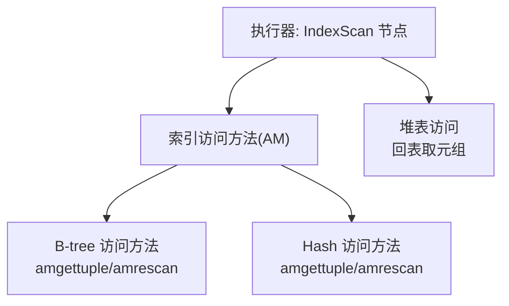
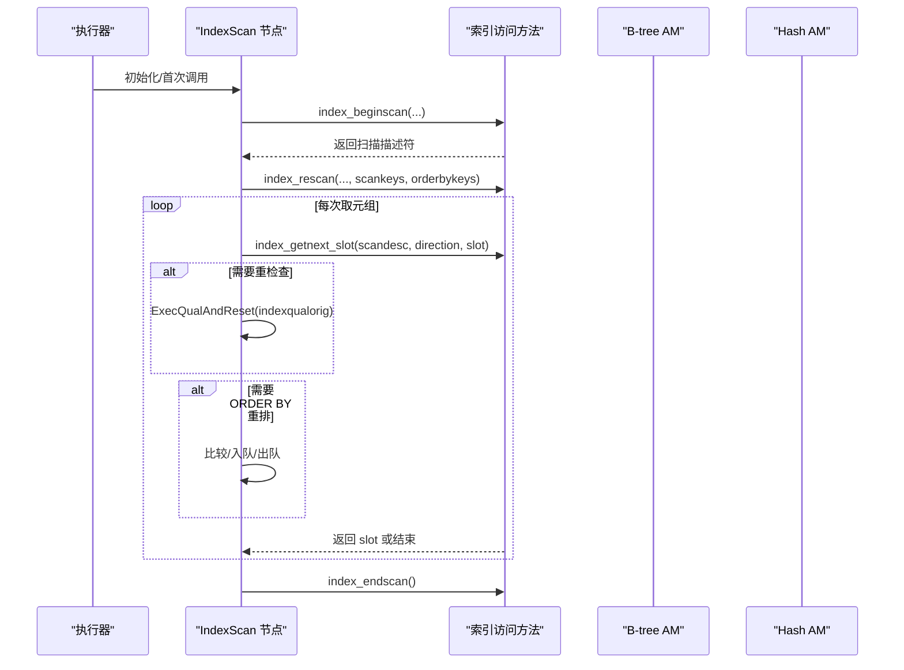
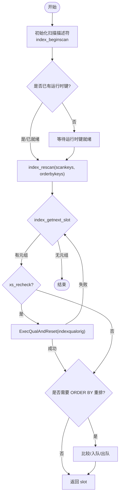
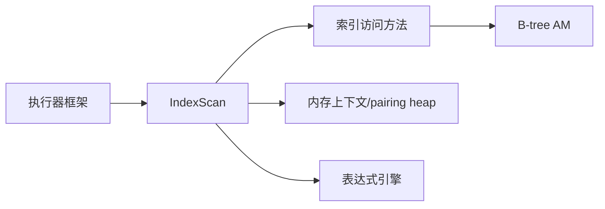

# 索引扫描

<cite>
**本文引用的文件**
- [nodeIndexscan.c](file://src/backend/executor/nodeIndexscan.c)
- [nbtree.c](file://src/backend/access/nbtree/nbtree.c)
- [nbtsort.c](file://src/backend/access/nbtree/nbtsort.c)
</cite>

## 目录
1. [简介](#简介)
2. [项目结构](#项目结构)
3. [核心组件](#核心组件)
4. [架构总览](#架构总览)
5. [详细组件分析](#详细组件分析)
6. [依赖关系分析](#依赖关系分析)
7. [性能考虑](#性能考虑)
8. [故障排查指南](#故障排查指南)
9. [结论](#结论)
10. [附录](#附录)

## 简介
本文件聚焦于 Mini PostgreSQL 中的索引扫描节点（IndexScan）实现，系统性地解释其启动、扫描、排序与回表机制，并覆盖 B-tree 与 Hash 索引在扫描阶段的差异、索引键匹配策略、条件过滤处理、参数配置、扫描方向控制、排序支持、选择策略、性能优化技巧以及索引失效场景。文档以代码级分析为基础，辅以流程图与时序图，帮助读者从执行器到访问方法（AM）完整理解索引扫描的工作方式。

## 项目结构
Mini PostgreSQL 的索引扫描由“执行器层”和“索引访问方法层”共同完成：
- 执行器层：负责 IndexScan 节点的初始化、运行时键计算、ORDER BY 重排序、条件重检查、并行扫描状态管理等。
- 索引访问方法层：B-tree 通过 nbtree.c 提供 amgettuple/amrescan 等接口；Hash 索引通过 hash AM 提供对应接口（在本仓库中未直接展开）。

图表来源
- [nodeIndexscan.c:521-540](file://src/backend/executor/nodeIndexscan.c#L521-L540)
- [nbtree.c:94-143](file://src/backend/access/nbtree/nbtree.c#L94-L143)

章节来源
- [nodeIndexscan.c:521-540](file://src/backend/executor/nodeIndexscan.c#L521-L540)
- [nbtree.c:94-143](file://src/backend/access/nbtree/nbtree.c#L94-L143)

## 核心组件
- IndexScanState：保存当前扫描描述符、扫描键、排序键、运行时键、重排序队列等。
- IndexNext/IndexNextWithReorder：核心获取下一元组的函数，分别用于无排序与需 ORDER BY 重排序的场景。
- ExecIndexBuildScanKeys：将 indexqual/indexorderby 表达式转换为 ScanKey，并识别运行时键与数组键。
- B-tree 访问方法回调：amgettuple/amrescan 等，由 nbtree.c 注册并提供具体页遍历与定位逻辑。

章节来源
- [nodeIndexscan.c:80-161](file://src/backend/executor/nodeIndexscan.c#L80-L161)
- [nodeIndexscan.c:170-357](file://src/backend/executor/nodeIndexscan.c#L170-L357)
- [nodeIndexscan.c:1152-1599](file://src/backend/executor/nodeIndexscan.c#L1152-L1599)
- [nbtree.c:94-143](file://src/backend/access/nbtree/nbtree.c#L94-L143)

## 架构总览
下图展示了从执行器发起索引扫描到 AM 返回元组的关键调用链，包括启动、重扫描、获取元组、条件重检查与排序重排。

图表来源
- [nodeIndexscan.c:80-161](file://src/backend/executor/nodeIndexscan.c#L80-L161)
- [nodeIndexscan.c:170-357](file://src/backend/executor/nodeIndexscan.c#L170-L357)
- [nbtree.c:94-143](file://src/backend/access/nbtree/nbtree.c#L94-L143)

## 详细组件分析

### 索引扫描启动与运行流程
- 启动阶段：ExecInitIndexScan 打开基表与索引关系，构建扫描键与排序键，准备表达式上下文与运行时键环境。
- 首次获取：IndexNext/IndexNextWithReorder 在首次调用时创建扫描描述符，并在必要时传入运行时键值后调用 index_rescan。
- 循环获取：index_getnext_slot 驱动 AM 返回下一个候选元组；若 AM 标记为 lossy，则使用 indexqualorig 进行二次过滤。
- 排序重排：当存在 ORDER BY 且 AM 无法保证顺序时，使用配对堆（pairing heap）维护待输出元组，确保最终顺序正确。

图表来源
- [nodeIndexscan.c:80-161](file://src/backend/executor/nodeIndexscan.c#L80-L161)
- [nodeIndexscan.c:170-357](file://src/backend/executor/nodeIndexscan.c#L170-L357)

章节来源
- [nodeIndexscan.c:903-1090](file://src/backend/executor/nodeIndexscan.c#L903-L1090)
- [nodeIndexscan.c:80-161](file://src/backend/executor/nodeIndexscan.c#L80-L161)
- [nodeIndexscan.c:170-357](file://src/backend/executor/nodeIndexscan.c#L170-L357)

### 索引键匹配策略与条件过滤
- 扫描键构建：ExecIndexBuildScanKeys 将 indexqual 表达式转换为 ScanKey，支持简单操作符、行比较、数组 ANY、NULL 测试等。
- 运行时键：对非常量右侧表达式，延迟到运行时求值，更新 ScanKey 的 sk_argument。
- 数组键：若 AM 不支持 amsearcharray，则在执行器侧展开数组元素并迭代。
- 条件重检查：当 AM 返回的元组可能为“lossy”（例如位图索引或某些哈希碰撞），通过 indexqualorig 再次校验。

章节来源
- [nodeIndexscan.c:1152-1599](file://src/backend/executor/nodeIndexscan.c#L1152-L1599)
- [nodeIndexscan.c:600-652](file://src/backend/executor/nodeIndexscan.c#L600-L652)
- [nodeIndexscan.c:662-779](file://src/backend/executor/nodeIndexscan.c#L662-L779)
- [nodeIndexscan.c:137-150](file://src/backend/executor/nodeIndexscan.c#L137-L150)

### 排序支持与 ORDER BY 重排
- 当存在 ORDER BY 且 AM 不保证顺序时，IndexNextWithReorder 使用 pairing heap 维护待输出元组，按 SortSupport 比较函数排序。
- 仅支持正向扫描的重排序；反向扫描由上层计划器决定。
- 若 AM 返回的 ORDER BY 值不准确（xs_recheckorderby），会重新计算并与 AM 返回值比较，必要时入队。

章节来源
- [nodeIndexscan.c:170-357](file://src/backend/executor/nodeIndexscan.c#L170-L357)
- [nodeIndexscan.c:362-383](file://src/backend/executor/nodeIndexscan.c#L362-L383)
- [nodeIndexscan.c:407-455](file://src/backend/executor/nodeIndexscan.c#L407-L455)

### 扫描方向控制
- 根据 plan 的 indexorderdir 与当前执行方向 es_direction，动态翻转实际扫描方向。
- 支持 ForwardScanDirection 与 BackwardScanDirection；B-tree 通过 amcanbackward=true 支持反向扫描。

章节来源
- [nodeIndexscan.c:92-101](file://src/backend/executor/nodeIndexscan.c#L92-L101)
- [nbtree.c:102-105](file://src/backend/access/nbtree/nbtree.c#L102-L105)

### 回表查询机制
- IndexScan 本身只负责通过索引找到候选元组；若 SELECT 列表包含不在索引中的列，则需通过 TID 回表读取堆元组。
- 回表由执行器通用流程完成，IndexScan 返回的 slot 包含必要信息供后续步骤使用。

章节来源
- [nodeIndexscan.c:80-161](file://src/backend/executor/nodeIndexscan.c#L80-L161)

### B-tree 与 Hash 索引的扫描算法差异
- B-tree：
  - 支持有序扫描、范围查询、反向扫描、唯一性、多列索引等。
  - 通过 amgettuple 逐页/逐条目推进，适合范围与排序场景。
- Hash：
  - 基于桶与槽的快速等值查找，通常不支持范围与排序。
  - 在 Mini PostgreSQL 中，Hash AM 的扫描入口同样遵循 index_getnext_slot 协议，但内部实现与 B-tree 不同。

章节来源
- [nbtree.c:94-143](file://src/backend/access/nbtree/nbtree.c#L94-L143)

### 索引选择策略与最佳实践
- 选择策略：
  - 等值/IN 列表：Hash 索引通常更快；B-tree 也可胜任。
  - 范围/排序：优先选择 B-tree。
  - 多列前缀匹配：利用 B-tree 的多列特性。
- 最佳实践：
  - 尽量使用选择性高的列建立索引。
  - 避免在 WHERE 中对索引列做函数转换导致索引失效。
  - 合理使用 INCLUDE 列减少回表。
  - 对高频范围查询优先考虑 B-tree。

[本节为概念性指导，不直接分析具体文件]

### 索引失效场景分析
- 函数包裹列：WHERE f(col) = ... 可能导致无法使用索引。
- 类型不匹配：隐式转换导致索引不可用。
- 统计信息缺失：优化器误判成本，放弃索引。
- 低选择性：全表扫描更优，优化器选择 SeqScan。
- 复杂表达式：如 RowCompare/ScalarArrayOpExpr 在某些 AM 上受限。

章节来源
- [nodeIndexscan.c:1152-1599](file://src/backend/executor/nodeIndexscan.c#L1152-L1599)

## 依赖关系分析
IndexScan 的执行依赖以下关键模块：
- 执行器框架：ExecScan、ExecQualAndReset、SortSupport。
- 索引访问方法：index_beginscan/index_rescan/index_getnext_slot/index_endscan。
- B-tree 访问方法：btgettuple/btrescan 等。
- 内存管理：每元组上下文、pairing heap。

图表来源
- [nodeIndexscan.c:521-540](file://src/backend/executor/nodeIndexscan.c#L521-L540)
- [nbtree.c:94-143](file://src/backend/access/nbtree/nbtree.c#L94-L143)

章节来源
- [nodeIndexscan.c:521-540](file://src/backend/executor/nodeIndexscan.c#L521-L540)
- [nbtree.c:94-143](file://src/backend/access/nbtree/nbtree.c#L94-L143)

## 性能考虑
- 减少回表：使用 INCLUDE 列或 IndexOnlyScan（若支持）降低 IO。
- 合理索引设计：高选择性、合适的前缀列、避免冗余索引。
- 避免函数包裹：保持列原始形式以便使用索引。
- 统计信息准确：定期 ANALYZE，确保优化器做出正确选择。
- 排序开销：ORDER BY 重排引入额外内存与 CPU 开销，尽量让 AM 提供有序结果。
- 并行扫描：B-tree 支持并行扫描，注意共享状态同步与锁竞争。

[本节为通用性能建议，不直接分析具体文件]

## 故障排查指南
- 症状：查询未走索引
  - 检查 WHERE 是否对索引列使用了函数或类型转换。
  - 查看 EXPLAIN 输出，确认是否选择了 SeqScan。
- 症状：结果顺序不正确
  - 检查是否存在 ORDER BY 且 AM 不支持有序返回；确认 xs_recheckorderby 路径。
- 症状：大量过滤
  - 若 AM 返回大量候选元组，检查 selectivity 与统计信息。
- 症状：内存增长
  - ORDER BY 重排队列过大，考虑限制或调整工作内存。

章节来源
- [nodeIndexscan.c:137-150](file://src/backend/executor/nodeIndexscan.c#L137-L150)
- [nodeIndexscan.c:278-319](file://src/backend/executor/nodeIndexscan.c#L278-L319)
- [nodeIndexscan.c:460-514](file://src/backend/executor/nodeIndexscan.c#L460-L514)

## 结论
Mini PostgreSQL 的 IndexScan 在执行器层提供了统一的索引扫描接口，结合 B-tree 与 Hash 等访问方法，实现了高效的等值、范围与排序查询。通过运行时键、数组键、条件重检查与 ORDER BY 重排，IndexScan 能够灵活适配多种查询模式。合理的索引设计与统计信息维护是发挥性能潜力的关键。

## 附录

### B-tree 构建与扫描相关要点
- B-tree 构建采用高效排序加载策略，提升建索引性能与页面填充率。
- 扫描过程中，B-tree 通过页内指针与条目比较快速定位目标区间。

章节来源
- [nbtsort.c:1-200](file://src/backend/access/nbtree/nbtsort.c#L1-L200)