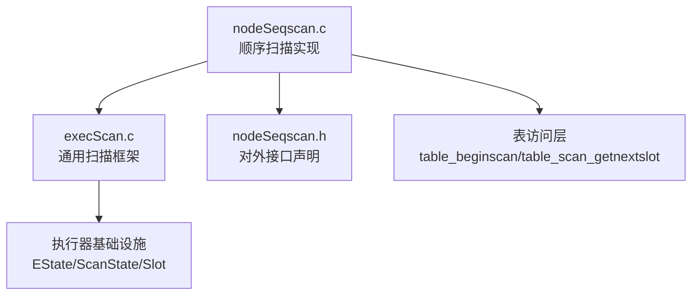
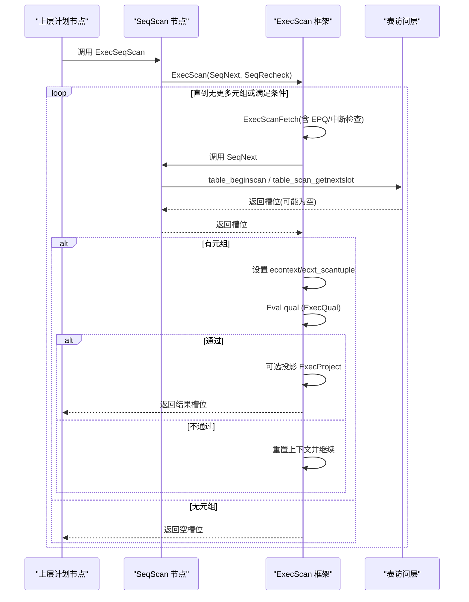
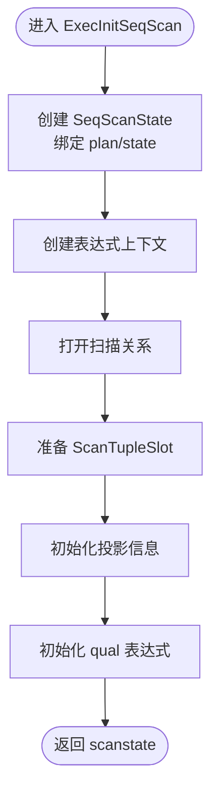
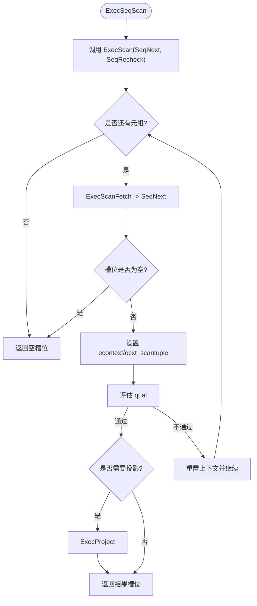
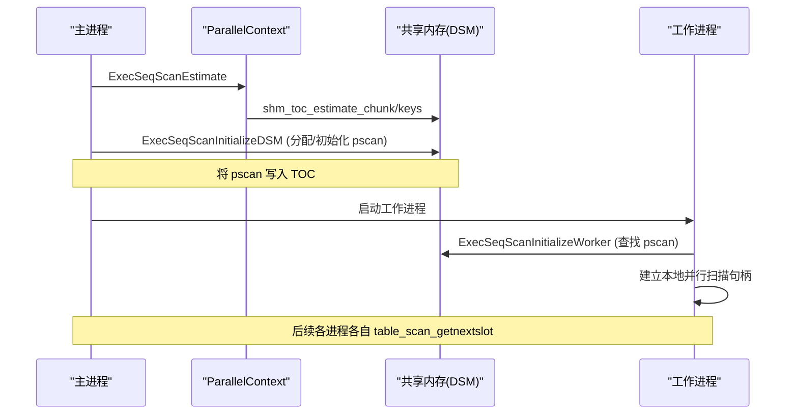
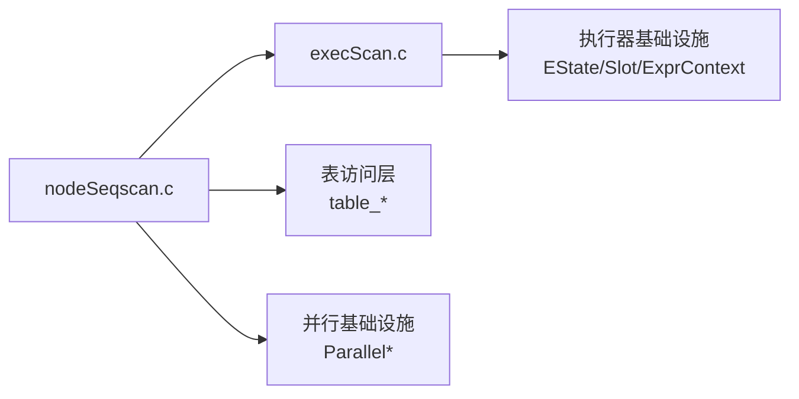

# 顺序扫描

<cite>
**本文引用的文件**
- [nodeSeqscan.c](file://src/backend/executor/nodeSeqscan.c)
- [execScan.c](file://src/backend/executor/execScan.c)
- [nodeSeqscan.h](file://src/include/executor/nodeSeqscan.h)
</cite>

## 目录
1. [简介](#简介)
2. [项目结构](#项目结构)
3. [核心组件](#核心组件)
4. [架构总览](#架构总览)
5. [详细组件分析](#详细组件分析)
6. [依赖关系分析](#依赖关系分析)
7. [性能考量](#性能考量)
8. [故障排查指南](#故障排查指南)
9. [结论](#结论)
10. [附录](#附录)

## 简介
本文件为 Mini PostgreSQL 中“顺序扫描（SeqScan）”执行节点的权威技术文档。内容覆盖：
- 全表扫描机制与元组获取流程
- 并行扫描支持（估计、DSM 初始化、工作进程初始化、重初始化）
- 生命周期管理：ExecInitSeqScan 初始化、ExecSeqScan 执行、ExecReScanSeqScan 重扫、ExecEndSeqScan 清理
- 状态管理、快照处理、方向控制（正向/反向）
- 性能特点、适用场景、与索引扫描的对比
- 并行扫描配置与使用示例、调优建议

## 项目结构
顺序扫描的实现位于执行器子系统中，核心文件如下：
- src/backend/executor/nodeSeqscan.c：顺序扫描节点的具体实现（初始化、执行、结束、重扫、并行支持）
- src/backend/executor/execScan.c：通用扫描框架（ExecScan 循环、过滤、投影、EPQ 集成）
- src/include/executor/nodeSeqscan.h：对外接口声明（初始化、结束、重扫、并行相关函数）

图表来源
- [nodeSeqscan.c:1-315](file://src/backend/executor/nodeSeqscan.c#L1-L315)
- [execScan.c:1-353](file://src/backend/executor/execScan.c#L1-L353)
- [nodeSeqscan.h:1-32](file://src/include/executor/nodeSeqscan.h#L1-L32)

章节来源
- [nodeSeqscan.c:1-315](file://src/backend/executor/nodeSeqscan.c#L1-L315)
- [execScan.c:1-353](file://src/backend/executor/execScan.c#L1-L353)
- [nodeSeqscan.h:1-32](file://src/include/executor/nodeSeqscan.h#L1-L32)

## 核心组件
- SeqNext：顺序扫描的核心取数函数，负责打开/复用 TableScanDesc，按方向从底层表读取下一个元组到槽位。
- ExecSeqScan：封装调用通用扫描框架 ExecScan，传入 SeqNext 和 SeqRecheck。
- ExecInitSeqScan：创建并初始化 SeqScanState，打开扫描关系，准备槽位、投影、qual 表达式上下文。
- ExecReScanSeqScan：重置底层扫描描述符，配合上层重扫逻辑。
- ExecEndSeqScan：释放表达式上下文、清空槽位、关闭扫描描述符。
- 并行扫描支持：
  - ExecSeqScanEstimate：估算共享内存 DSM 空间
  - ExecSeqScanInitializeDSM：在共享区域初始化并行扫描描述符，并建立本地并行扫描句柄
  - ExecSeqScanReInitializeDSM：重置共享状态以开始新的并行扫描
  - ExecSeqScanInitializeWorker：在工作进程中查找 TOC 中的并行扫描信息并建立本地句柄

章节来源
- [nodeSeqscan.c:49-115](file://src/backend/executor/nodeSeqscan.c#L49-L115)
- [nodeSeqscan.c:122-175](file://src/backend/executor/nodeSeqscan.c#L122-L175)
- [nodeSeqscan.c:183-235](file://src/backend/executor/nodeSeqscan.c#L183-L235)
- [nodeSeqscan.c:249-314](file://src/backend/executor/nodeSeqscan.c#L249-L314)
- [execScan.c:164-263](file://src/backend/executor/execScan.c#L164-L263)

## 架构总览
顺序扫描的执行由“具体节点 + 通用框架”组成：
- 具体节点（nodeSeqscan.c）提供取数方法 SeqNext 与重检方法 SeqRecheck
- 通用框架（execScan.c）负责：中断检查、EPQ 替换元组、Qual 过滤、投影输出、统计计数等
- 底层通过 table_beginscan / table_scan_getnextslot 完成实际页级遍历

图表来源
- [nodeSeqscan.c:49-115](file://src/backend/executor/nodeSeqscan.c#L49-L115)
- [execScan.c:164-263](file://src/backend/executor/execScan.c#L164-L263)

章节来源
- [nodeSeqscan.c:49-115](file://src/backend/executor/nodeSeqscan.c#L49-L115)
- [execScan.c:164-263](file://src/backend/executor/execScan.c#L164-L263)

## 详细组件分析

### 初始化：ExecInitSeqScan
- 创建 SeqScanState，绑定 Plan/EState，设置 ExecProcNode
- 创建表达式上下文，打开扫描关系（Relation），准备 ScanTupleSlot
- 初始化结果类型与投影信息，构建 qual 表达式树
- 注意：外层/内层计划指针应为空（单表扫描）

图表来源
- [nodeSeqscan.c:122-175](file://src/backend/executor/nodeSeqscan.c#L122-L175)

章节来源
- [nodeSeqscan.c:122-175](file://src/backend/executor/nodeSeqscan.c#L122-L175)

### 执行：ExecSeqScan 与 SeqNext
- ExecSeqScan：将 SeqNext 与 SeqRecheck 交给 ExecScan 统一调度
- SeqNext：
  - 若未建立 TableScanDesc（非并行或串行执行并行计划），则基于当前 Relation 与 EState 快照开启扫描
  - 根据 EState 的方向字段决定正向/反向读取
  - 通过 table_scan_getnextslot 将元组放入槽位并返回
- ExecScan：
  - 每轮循环：获取元组 -> 设置 econtext -> 评估 qual -> 必要时投影 -> 返回
  - 支持 EPQ 替换元组与重检
  - 无 qual 且无投影时走快速路径

图表来源
- [nodeSeqscan.c:49-115](file://src/backend/executor/nodeSeqscan.c#L49-L115)
- [execScan.c:164-263](file://src/backend/executor/execScan.c#L164-L263)

章节来源
- [nodeSeqscan.c:49-115](file://src/backend/executor/nodeSeqscan.c#L49-L115)
- [execScan.c:164-263](file://src/backend/executor/execScan.c#L164-L263)

### 重扫：ExecReScanSeqScan
- 若存在 TableScanDesc，调用 table_rescan 重置扫描位置
- 调用 ExecScanReScan 清理槽位并处理 EPQ 状态

章节来源
- [nodeSeqscan.c:223-235](file://src/backend/executor/nodeSeqscan.c#L223-L235)
- [execScan.c:305-353](file://src/backend/executor/execScan.c#L305-L353)

### 结束：ExecEndSeqScan
- 释放表达式上下文
- 清空结果槽位与扫描槽位
- 关闭 TableScanDesc（若已打开）

章节来源
- [nodeSeqscan.c:183-210](file://src/backend/executor/nodeSeqscan.c#L183-L210)

### 并行扫描支持
- 估计阶段：ExecSeqScanEstimate 计算并行扫描所需 DSM 大小并登记键值
- 初始化阶段：ExecSeqScanInitializeDSM 分配并初始化 ParallelTableScanDesc，插入 TOC，建立本地并行扫描句柄
- 重初始化：ExecSeqScanReInitializeDSM 重置共享状态以开始新扫描
- 工作进程：ExecSeqScanInitializeWorker 从 TOC 查找并行扫描信息并建立本地句柄

图表来源
- [nodeSeqscan.c:249-314](file://src/backend/executor/nodeSeqscan.c#L249-L314)

章节来源
- [nodeSeqscan.c:249-314](file://src/backend/executor/nodeSeqscan.c#L249-L314)

### 状态管理与方向控制
- 状态存储：
  - ss_currentRelation：当前扫描的关系
  - ss_currentScanDesc：TableScanDesc（串行或并行句柄）
  - ss_ScanTupleSlot：存放底层返回的元组
  - ps.qual / ps.ps_ProjInfo：过滤与投影
- 方向控制：
  - 通过 EState 的 es_direction 决定正向/反向扫描
  - 底层 table_scan_getnextslot 依据方向推进游标
- 快照处理：
  - 非并行路径下，table_beginscan 使用 EState 的 es_snapshot 作为可见性快照
  - 并行路径下，table_parallelscan_initialize 结合快照初始化并行扫描

章节来源
- [nodeSeqscan.c:49-83](file://src/backend/executor/nodeSeqscan.c#L49-L83)
- [nodeSeqscan.c:122-175](file://src/backend/executor/nodeSeqscan.c#L122-L175)
- [nodeSeqscan.c:267-281](file://src/backend/executor/nodeSeqscan.c#L267-L281)

## 依赖关系分析
- nodeSeqscan.c 依赖 execScan.c 提供的通用扫描框架
- nodeSeqscan.c 依赖表访问层（table_beginscan/table_scan_getnextslot）进行实际 I/O
- nodeSeqscan.c 依赖并行基础设施（ParallelContext/TOC/ParallelTableScanDesc）
- execScan.c 依赖执行器基础设施（EState/ScanState/Slot/ExprContext）

图表来源
- [nodeSeqscan.c:1-315](file://src/backend/executor/nodeSeqscan.c#L1-L315)
- [execScan.c:1-353](file://src/backend/executor/execScan.c#L1-L353)

章节来源
- [nodeSeqscan.c:1-315](file://src/backend/executor/nodeSeqscan.c#L1-L315)
- [execScan.c:1-353](file://src/backend/executor/execScan.c#L1-L353)

## 性能考量
- 顺序扫描特点
  - 线性扫描整张表，I/O 连续性好，适合全表扫描、聚合、去重、排序前数据收集等
  - 无索引跳转开销，但在选择性高的查询中通常不如索引扫描
- 与索引扫描对比
  - 顺序扫描：适合大比例读取、批量操作、物化/聚合前驱动；成本模型简单
  - 索引扫描：适合高选择性点查/范围查；存在随机 I/O 与索引维护成本
- 优化建议
  - 合理设置 work_mem、maintenance_work_mem 以利于排序/哈希聚合
  - 对热点表维护统计信息，使规划器正确选择顺序/索引扫描
  - 避免不必要的投影与过滤，减少表达式求值开销
  - 并行扫描：在大表全表扫描时启用并行，提升吞吐
  - 关注 I/O 模式：顺序扫描受益于预读与缓冲池命中

[本节为通用指导，不直接分析具体文件]

## 故障排查指南
- 常见问题定位
  - 扫描未返回数据：检查表是否存在数据、快照可见性、方向是否正确
  - 重复扫描/状态异常：确认 ExecReScanSeqScan 是否被正确调用
  - 并行扫描无效：检查并行参数与工作进程数量，确认 DSM 初始化成功
- 关键断点/日志
  - ExecScan 循环入口与退出
  - SeqNext 中 table_beginscan/table_scan_getnextslot 调用
  - 并行初始化/重初始化函数调用链
- 诊断步骤
  - 使用 EXPLAIN/EXPLAIN ANALYZE 观察计划与耗时
  - 检查 EState 的 es_direction、es_snapshot
  - 验证 ScanTupleSlot 与 ResultTupleSlot 的状态

章节来源
- [nodeSeqscan.c:49-115](file://src/backend/executor/nodeSeqscan.c#L49-L115)
- [nodeSeqscan.c:223-235](file://src/backend/executor/nodeSeqscan.c#L223-L235)
- [execScan.c:164-263](file://src/backend/executor/execScan.c#L164-L263)

## 结论
Mini PostgreSQL 的顺序扫描采用“具体节点 + 通用框架”的分层设计，清晰分离了取数逻辑与过滤/投影/EPQ 等通用能力。其实现简洁高效，支持正向/反向扫描、快照可见性与并行扫描，适用于全表扫描与批量数据处理场景。在实际使用中，应结合查询特性与系统负载选择合适的扫描方式，并通过合理的参数与统计信息维护获得稳定性能。

[本节为总结性内容，不直接分析具体文件]

## 附录

### 并行扫描配置与使用示例
- 典型配置项（概念性说明）
  - max_parallel_workers_per_gather：限制每个 Gather/Gather Merge 节点可用的最大工作进程数
  - parallel_setup_cost / parallel_tuple_cost：影响规划器对并行计划的成本评估
  - min_parallel_table_scan_size / parallel_leader_participation：控制何时启用并行表扫描及领导者参与
- 使用示例（概念性说明）
  - 对大表执行 SELECT COUNT(*) 或全表聚合，观察计划中出现 Gather/Gather Merge + SeqScan
  - 调整上述参数后比较执行时间与资源占用
  - 监控工作进程数量与并行度是否达到预期

[本节为概念性说明，不直接分析具体文件]

### 与索引扫描的对比要点
- 顺序扫描
  - 优点：顺序 I/O、低开销、适合大批量读取
  - 缺点：选择性高时效率较低
- 索引扫描
  - 优点：点查/范围查高效，随机 I/O 可控
  - 缺点：维护成本高，小结果集优势明显
- 选择策略
  - 基于选择性、谓词、统计信息与成本模型综合判断

[本节为概念性说明，不直接分析具体文件]