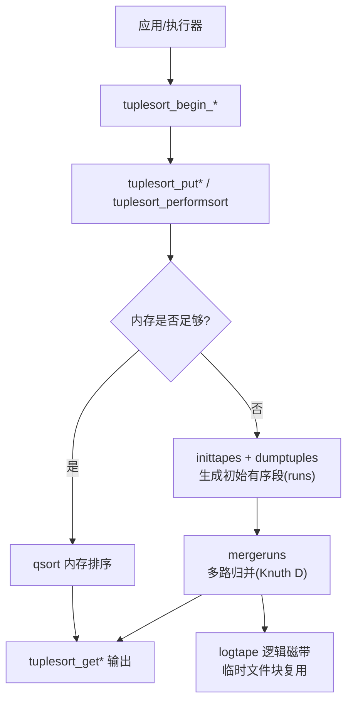
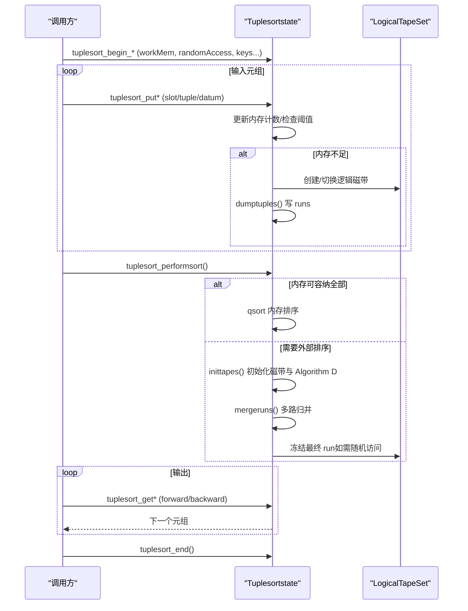
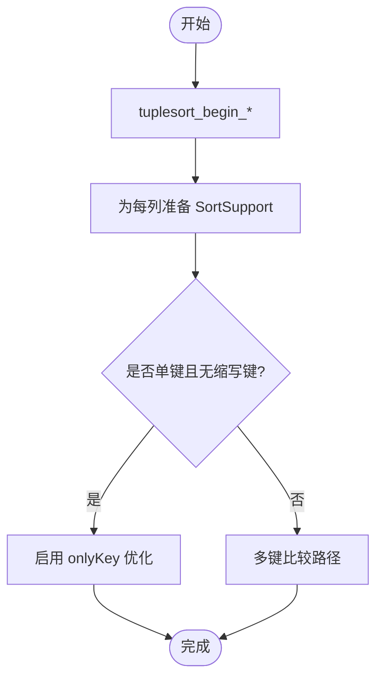
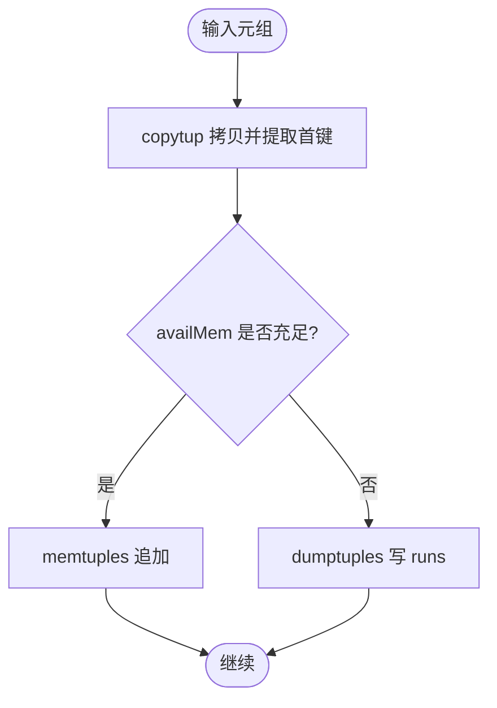
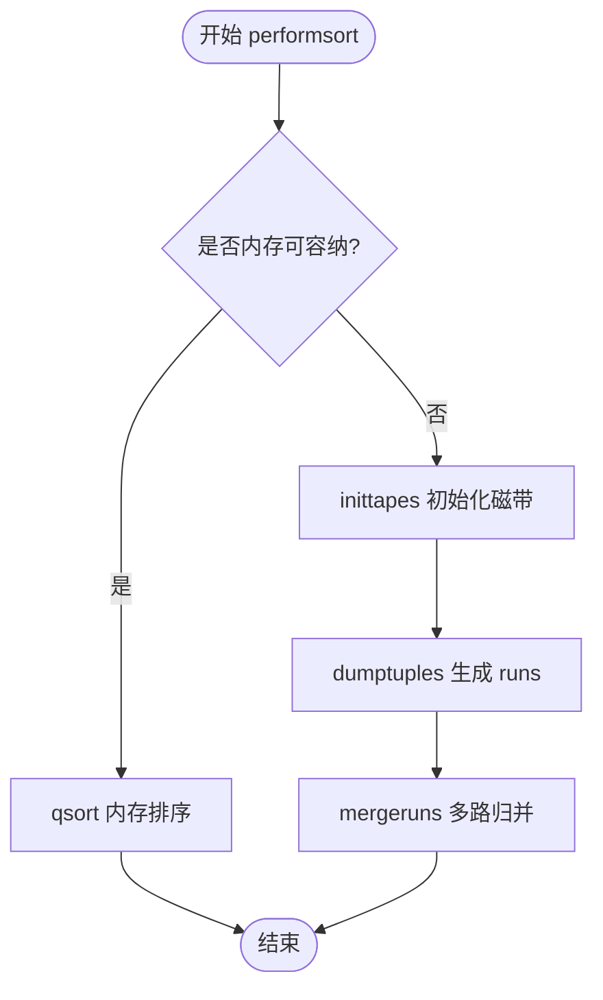
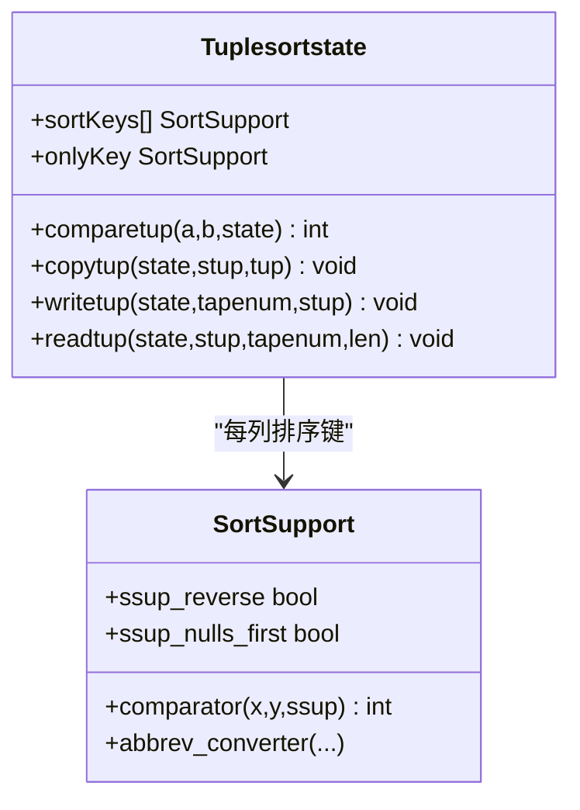
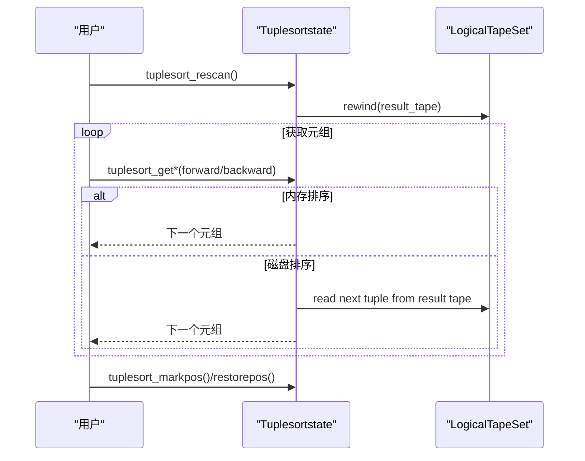
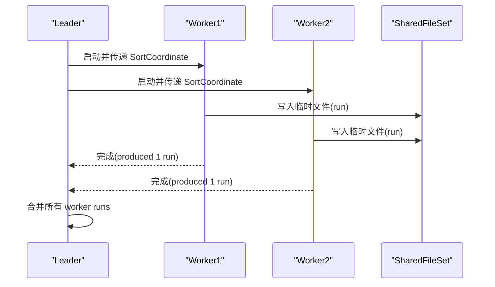
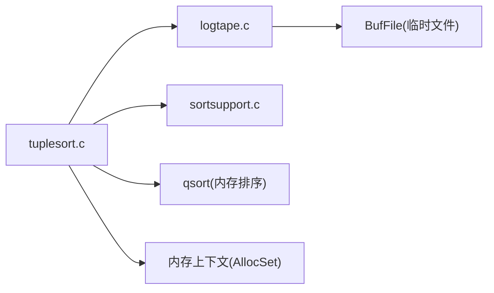

# 排序算法实现

<cite>
**本文引用的文件**
- [tuplesort.c](file://src/backend/utils/sort/tuplesort.c)
- [tuplesort.h](file://src/include/utils/tuplesort.h)
- [logtape.c](file://src/backend/utils/sort/logtape.c)
- [sortsupport.c](file://src/backend/utils/sort/sortsupport.c)
</cite>

## 目录
1. [简介](#简介)
2. [项目结构](#项目结构)
3. [核心组件](#核心组件)
4. [架构总览](#架构总览)
5. [详细组件分析](#详细组件分析)
6. [依赖关系分析](#依赖关系分析)
7. [性能考量](#性能考量)
8. [故障排除指南](#故障排除指南)
9. [结论](#结论)
10. [附录](#附录)

## 简介
本文件面向 Mini PostgreSQL 的 Tuplesort 模块，系统性阐述其排序算法与工程实现。内容涵盖：内存排序、磁盘排序与外部多路归并策略的选择机制；排序初始化、数据输入处理、排序执行流程与结果输出机制；排序键配置、比较函数调用、排序稳定性保证与并行排序支持；并提供流程图、内存使用分析与优化建议、故障排除指南，帮助读者深入理解并高效使用复杂排序操作。

## 项目结构
Tuplesort 的核心位于后端 utils/sort 目录，主要文件职责如下：
- tuplesort.c：通用元组排序主逻辑，包含状态机、内存/磁盘路径选择、外部多路归并（Knuth Algorithm D）、堆维护、并行协调等。
- logtape.c：逻辑“磁带”抽象，基于临时文件实现块级复用与顺序预读，支撑外部排序的多路 I/O。
- sortsupport.c：排序支持接口，封装比较器查找、缩写键（abbreviated key）与旧式比较函数适配。
- tuplesort.h：对外 API 与数据结构声明，包括 begin/get/perform 系列接口、并行协调结构体、统计信息类型等。

图表来源
- [tuplesort.c:22-83](file://src/backend/utils/sort/tuplesort.c#L22-L83)
- [tuplesort.c:2547-2580](file://src/backend/utils/sort/tuplesort.c#L2547-L2580)
- [tuplesort.c:2587-2639](file://src/backend/utils/sort/tuplesort.c#L2587-L2639)
- [tuplesort.c:3119-3217](file://src/backend/utils/sort/tuplesort.c#L3119-L3217)
- [tuplesort.c:2756-2975](file://src/backend/utils/sort/tuplesort.c#L2756-L2975)
- [logtape.c:1-77](file://src/backend/utils/sort/logtape.c#L1-L77)

章节来源
- [tuplesort.c:1-116](file://src/backend/utils/sort/tuplesort.c#L1-L116)
- [tuplesort.h:1-197](file://src/include/utils/tuplesort.h#L1-L197)
- [logtape.c:1-77](file://src/backend/utils/sort/logtape.c#L1-L77)

## 核心组件
- Tuplesortstate：排序内部状态机，记录当前阶段（初始加载、构建 runs、内存已排序、磁盘已排序、最终合并中）、可用内存、最大磁带走数、Algorithm D 变量、堆与 slab 分配器等。
- SortTuple：待排序元素，包含元组指针、首键值与空标志、源磁带号（用于归并）。
- LogicalTapeSet：逻辑磁带集合，管理底层 BufFile、块分配/回收、预分配与读取缓冲，提供顺序读写与冻结能力。
- SortSupport：每列排序键的配置与比较器，支持缩写键优化、反向/空值优先策略、从索引或排序算子推导比较函数。

关键要点
- 内存路径：当未超过 workMem 时，在 memtuples 数组中累积并使用 qsort 快速排序。
- 磁盘路径：超过阈值后，将内存中的块按 quicksort 排序后写入逻辑磁带，形成多个 runs；随后通过 Knuth 多相归并（Algorithm D）进行多路合并。
- 随机访问：若需要随机访问，最终 run 会被冻结到逻辑磁带，支持 rewind/mark/restore。
- 并行排序：worker 各自产生一个最终 run，leader 负责合并所有 worker 的 run。

章节来源
- [tuplesort.c:148-183](file://src/backend/utils/sort/tuplesort.c#L148-L183)
- [tuplesort.c:208-216](file://src/backend/utils/sort/tuplesort.c#L208-L216)
- [tuplesort.c:240-483](file://src/backend/utils/sort/tuplesort.c#L240-L483)
- [logtape.c:128-220](file://src/backend/utils/sort/logtape.c#L128-L220)
- [sortsupport.c:126-177](file://src/backend/utils/sort/sortsupport.c#L126-L177)

## 架构总览
Tuplesort 采用“内存快排 + 外部多路归并”的两阶段设计，配合逻辑磁带实现高效的磁盘 I/O 与空间复用。整体控制流如下：

图表来源
- [tuplesort.c:720-823](file://src/backend/utils/sort/tuplesort.c#L720-L823)
- [tuplesort.c:2547-2580](file://src/backend/utils/sort/tuplesort.c#L2547-L2580)
- [tuplesort.c:2587-2639](file://src/backend/utils/sort/tuplesort.c#L2587-L2639)
- [tuplesort.c:2756-2975](file://src/backend/utils/sort/tuplesort.c#L2756-L2975)
- [tuplesort.c:3119-3217](file://src/backend/utils/sort/tuplesort.c#L3119-L3217)

## 详细组件分析

### 排序初始化与键配置
- 入口：tuplesort_begin_heap/begin_cluster/begin_index_btree/begin_index_hash/begin_datum 等，统一通过 tuplesort_begin_common 初始化状态、内存上下文与并行协调字段。
- 键配置：为每个排序键准备 SortSupport，设置 collation、nulls_first、是否允许缩写键；单键场景启用 onlyKey 优化以走更快的单键比较路径。
- 比较函数：根据排序算子或索引定义解析比较器，必要时回退到旧式 btree 比较函数的 shim。

图表来源
- [tuplesort.c:896-968](file://src/backend/utils/sort/tuplesort.c#L896-L968)
- [tuplesort.c:970-1065](file://src/backend/utils/sort/tuplesort.c#L970-L1065)
- [tuplesort.c:1067-1143](file://src/backend/utils/sort/tuplesort.c#L1067-L1143)
- [tuplesort.c:1145-1189](file://src/backend/utils/sort/tuplesort.c#L1145-L1189)
- [tuplesort.c:1192-1265](file://src/backend/utils/sort/tuplesort.c#L1192-L1265)
- [sortsupport.c:126-177](file://src/backend/utils/sort/sortsupport.c#L126-L177)

章节来源
- [tuplesort.c:720-823](file://src/backend/utils/sort/tuplesort.c#L720-L823)
- [tuplesort.c:896-1265](file://src/backend/utils/sort/tuplesort.c#L896-L1265)
- [sortsupport.c:26-177](file://src/backend/utils/sort/sortsupport.c#L26-L177)

### 数据输入与内存管理
- puttuple_*：将传入元组拷贝到 sortcontext，提取首键值（可能为缩写键），更新可用内存；若触发 LACKMEM，则转入磁盘路径。
- grow_memtuples：动态扩展 memtuples 数组，避免频繁扩容；接近上限时采用保守增长策略。
- 内存跟踪：USEMEM/FREEMEM 跟踪元组占用；进入外部排序后切换到 slab 分配器以减少 palloc/pfree 开销。

图表来源
- [tuplesort.c:1495-1599](file://src/backend/utils/sort/tuplesort.c#L1495-L1599)
- [tuplesort.c:3119-3217](file://src/backend/utils/sort/tuplesort.c#L3119-L3217)
- [tuplesort.c:2717-2748](file://src/backend/utils/sort/tuplesort.c#L2717-L2748)

章节来源
- [tuplesort.c:1495-1599](file://src/backend/utils/sort/tuplesort.c#L1495-L1599)
- [tuplesort.c:3119-3217](file://src/backend/utils/sort/tuplesort.c#L3119-L3217)
- [tuplesort.c:2717-2748](file://src/backend/utils/sort/tuplesort.c#L2717-L2748)

### 内存排序与外部排序策略选择
- 内存排序：当数据量小于 workMem 时，直接对 memtuples 使用 qsort（单键走 qsort_ssup，多键走 qsort_tuple）。
- 外部排序：超过阈值后，inittapes 计算磁带走数（merge order），创建逻辑磁带集，进入 TSS_BUILDRUNS 状态，按块生成 runs。
- 多路归并：mergeruns 实现 Knuth Algorithm D，使用斐波那契分布与虚拟 run 控制，逐步减少 runs 直至单一有序序列。

图表来源
- [tuplesort.c:2547-2580](file://src/backend/utils/sort/tuplesort.c#L2547-L2580)
- [tuplesort.c:2587-2639](file://src/backend/utils/sort/tuplesort.c#L2587-L2639)
- [tuplesort.c:2756-2975](file://src/backend/utils/sort/tuplesort.c#L2756-L2975)
- [tuplesort.c:3500-3517](file://src/backend/utils/sort/tuplesort.c#L3500-L3517)

章节来源
- [tuplesort.c:2547-2580](file://src/backend/utils/sort/tuplesort.c#L2547-L2580)
- [tuplesort.c:2587-2639](file://src/backend/utils/sort/tuplesort.c#L2587-L2639)
- [tuplesort.c:2756-2975](file://src/backend/utils/sort/tuplesort.c#L2756-L2975)
- [tuplesort.c:3500-3517](file://src/backend/utils/sort/tuplesort.c#L3500-L3517)

### 比较函数调用与排序稳定性
- 比较函数：comparetup_* 针对 HeapTuple、Cluster、IndexTuple、Datum 等类型实现；首键比较失败即返回，后续键依次比较。
- 稳定性：对于 btree 索引排序，当键相等时以 ItemPointer（块号+偏移）作为最后比较键，确保稳定且唯一。
- 缩写键：SortSupport 支持缩写键加速首键比较；若不可用或触发回退，则使用完整比较器。

图表来源
- [tuplesort.c:240-483](file://src/backend/utils/sort/tuplesort.c#L240-L483)
- [tuplesort.c:3700-3760](file://src/backend/utils/sort/tuplesort.c#L3700-L3760)
- [tuplesort.c:4145-4276](file://src/backend/utils/sort/tuplesort.c#L4145-L4276)
- [sortsupport.c:126-177](file://src/backend/utils/sort/sortsupport.c#L126-L177)

章节来源
- [tuplesort.c:3700-3760](file://src/backend/utils/sort/tuplesort.c#L3700-L3760)
- [tuplesort.c:4145-4276](file://src/backend/utils/sort/tuplesort.c#L4145-L4276)
- [sortsupport.c:126-177](file://src/backend/utils/sort/sortsupport.c#L126-L177)

### 结果输出与随机访问
- 输出：tuplesort_get* 系列按需从内存或逻辑磁带读取下一个元组；支持 forward/backward。
- 随机访问：若开启 randomAccess，最终 run 被冻结（freeze），支持 rescan/markpos/restorepos。
- 位置标记：markpos 保存当前块号与偏移，restorepos 恢复至该位置。

图表来源
- [tuplesort.c:3222-3283](file://src/backend/utils/sort/tuplesort.c#L3222-L3283)
- [tuplesort.c:2954-2975](file://src/backend/utils/sort/tuplesort.c#L2954-L2975)

章节来源
- [tuplesort.c:3222-3283](file://src/backend/utils/sort/tuplesort.c#L3222-L3283)
- [tuplesort.c:2954-2975](file://src/backend/utils/sort/tuplesort.c#L2954-L2975)

### 并行排序支持
- 协调结构：SortCoordinateData 描述参与者数量与共享内存指针；Sharedsort 维护工作进程标识、完成计数与共享文件集。
- 工作流程：leader 启动 workers，各 worker 独立执行 partial sort 并产出单个 final run；leader 等待完成后合并所有 worker 的 run。
- 限制：并行排序不支持 randomAccess；leader 不接收 bound 提示。

图表来源
- [tuplesort.h:125-197](file://src/include/utils/tuplesort.h#L125-L197)
- [tuplesort.c:485-516](file://src/backend/utils/sort/tuplesort.c#L485-L516)
- [logtape.c:533-620](file://src/backend/utils/sort/logtape.c#L533-L620)

章节来源
- [tuplesort.h:125-197](file://src/include/utils/tuplesort.h#L125-L197)
- [tuplesort.c:485-516](file://src/backend/utils/sort/tuplesort.c#L485-L516)
- [logtape.c:533-620](file://src/backend/utils/sort/logtape.c#L533-L620)

## 依赖关系分析
- tuplesort.c 依赖：
  - logtape.c：提供逻辑磁带读写与块复用。
  - sortsupport.c：提供比较器与缩写键支持。
  - executor/catalog/storage 等：用于元组/索引/表空间等操作。
- 耦合与内聚：
  - 高内聚：tuplesort.c 集中排序状态与流程；logtape.c 专注 I/O 与块管理；sortsupport.c 专注比较器装配。
  - 低耦合：通过函数指针 comparetup/copytup/writetup/readtup 解耦具体数据类型处理。
- 外部依赖：
  - BufFile：底层临时文件抽象。
  - 系统 qsort：内存排序。
  - 内存上下文：AllocSetContext 管理生命周期。

图表来源
- [tuplesort.c:95-115](file://src/backend/utils/sort/tuplesort.c#L95-L115)
- [logtape.c:79-87](file://src/backend/utils/sort/logtape.c#L79-L87)
- [sortsupport.c:16-23](file://src/backend/utils/sort/sortsupport.c#L16-L23)

章节来源
- [tuplesort.c:95-115](file://src/backend/utils/sort/tuplesort.c#L95-L115)
- [logtape.c:79-87](file://src/backend/utils/sort/logtape.c#L79-L87)
- [sortsupport.c:16-23](file://src/backend/utils/sort/sortsupport.c#L16-L23)

## 性能考量
- 内存使用
  - workMem 决定内存阈值；超过阈值即转磁盘。
  - 外部排序阶段使用 slab 分配器减少 palloc/pfree 开销。
  - 读缓冲按输入磁带均分剩余内存，提升顺序预读效果。
- I/O 优化
  - 逻辑磁带块复用，避免峰值空间翻倍。
  - 预读多块降低随机寻道；冻结最终 run 支持随机访问但代价更高。
- 合并阶数
  - merge order 由 allowedMem 估算，上下限 MINORDER/MAXORDER 平衡 CPU 缓存与 I/O 成本。
- 比较优化
  - 单键 onlyKey 路径更快；缩写键加速首键比较，必要时回退完整比较。
- 稳定性
  - btree 索引排序以 ItemPointer 作为最后键，保证稳定与唯一。

[本节为通用指导，无需特定文件引用]

## 故障排除指南
- 内存不足
  - 现象：LACKMEM 触发，转入外部排序。
  - 排查：增大 work_mem；检查元组大小与键数量；确认未误用大量临时对象。
  - 参考：grow_memtuples 与 inittapes 行为。
- 磁盘空间不足
  - 现象：临时文件写入失败。
  - 排查：检查临时表空间配额；确认文件系统可用空间；避免过多并发排序。
  - 参考：logtape 块分配与释放。
- 随机访问异常
  - 现象：rescan/mark/restore 无效。
  - 排查：确认 randomAccess=true；仅在 SORTEDINMEM/SORTEDONTAPE 状态有效。
  - 参考：tuplesort_rescan/markpos/restorepos。
- 并行排序错误
  - 现象：randomAccess 与并行冲突；bound 提示被忽略。
  - 排查：并行排序禁止 randomAccess；leader 忽略 bound。
  - 参考：并行协调结构与约束。

章节来源
- [tuplesort.c:1495-1599](file://src/backend/utils/sort/tuplesort.c#L1495-L1599)
- [tuplesort.c:2587-2639](file://src/backend/utils/sort/tuplesort.c#L2587-L2639)
- [tuplesort.c:3222-3283](file://src/backend/utils/sort/tuplesort.c#L3222-L3283)
- [tuplesort.h:125-197](file://src/include/utils/tuplesort.h#L125-L197)

## 结论
Mini PostgreSQL 的 Tuplesort 模块通过清晰的内存/磁盘路径选择、高效的逻辑磁带实现与稳健的外部多路归并，提供了可扩展、高性能且稳定的排序能力。其模块化设计（比较器、I/O、状态机）便于扩展与维护；并行支持与随机访问进一步增强了实用性。合理配置 work_mem、利用缩写键与 onlyKey 优化、关注 I/O 预读与块复用，可获得更佳性能。

[本节为总结性内容，无需特定文件引用]

## 附录
- 关键函数路径
  - 初始化：tuplesort_begin_common、tuplesort_begin_heap、tuplesort_begin_cluster、tuplesort_begin_index_btree、tuplesort_begin_index_hash、tuplesort_begin_datum
  - 输入：puttuple_*（由上层调用）
  - 执行：tuplesort_performsort、inittapes、dumptuples、mergeruns、mergeonerun、beginmerge
  - 输出：tuplesort_get*、tuplesort_rescan、tuplesort_markpos、tuplesort_restorepos
  - 资源：tuplesort_end、tuplesort_reset
- 关键数据结构
  - Tuplesortstate、SortTuple、LogicalTapeSet、SortSupport、Sharedsort

[本节为索引性内容，无需特定文件引用]