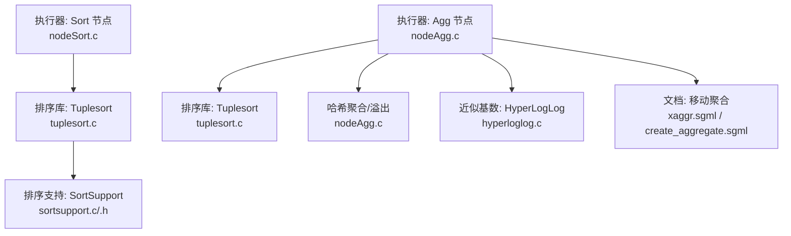
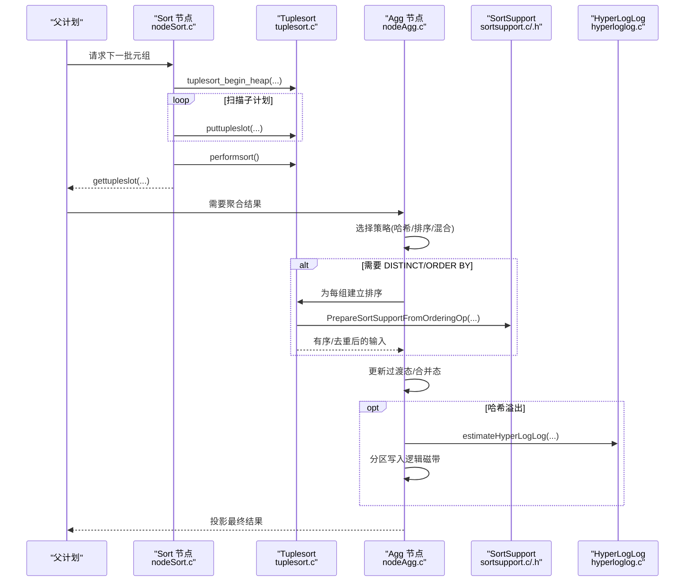
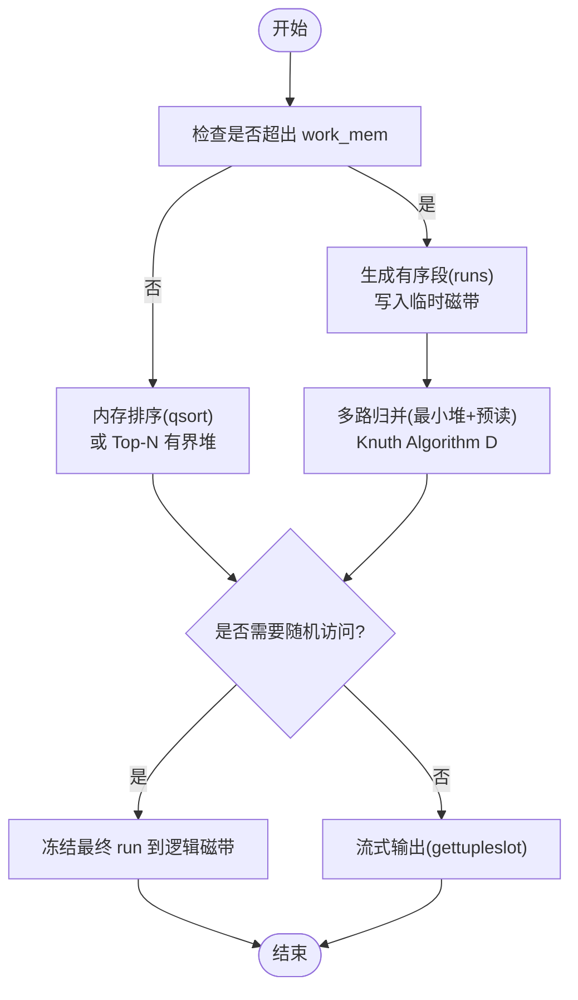
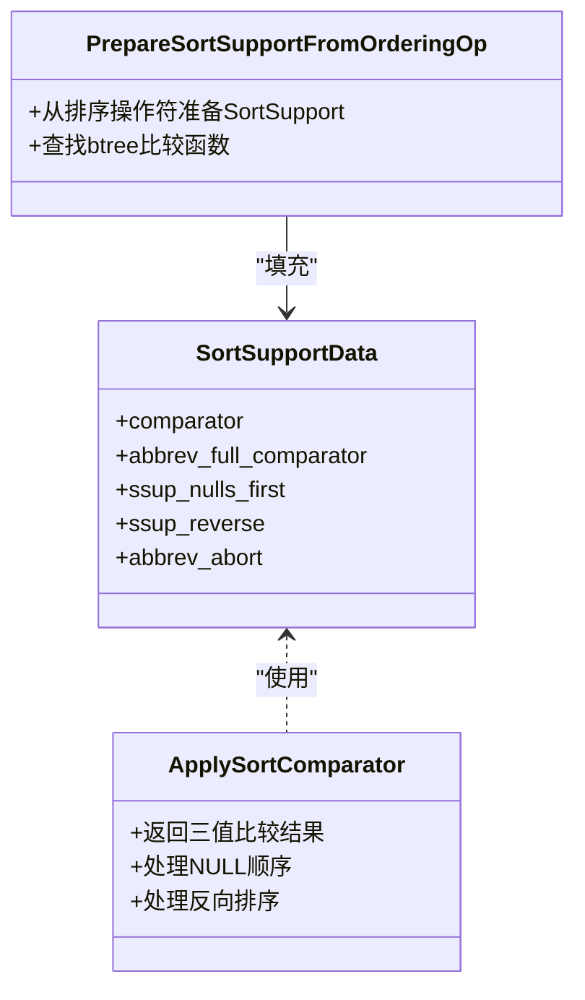
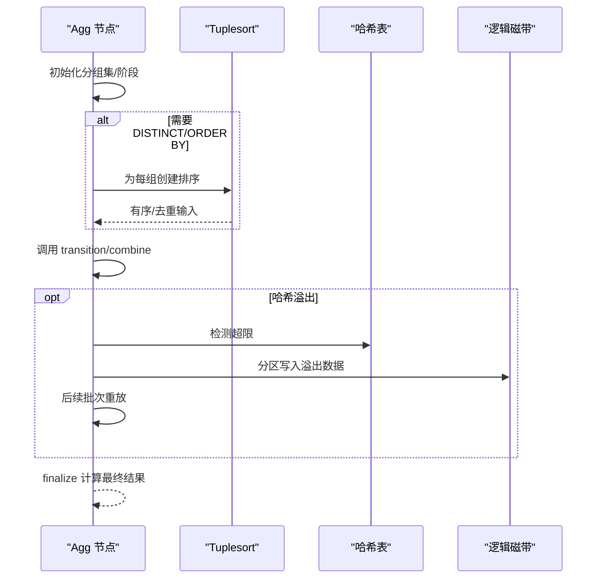
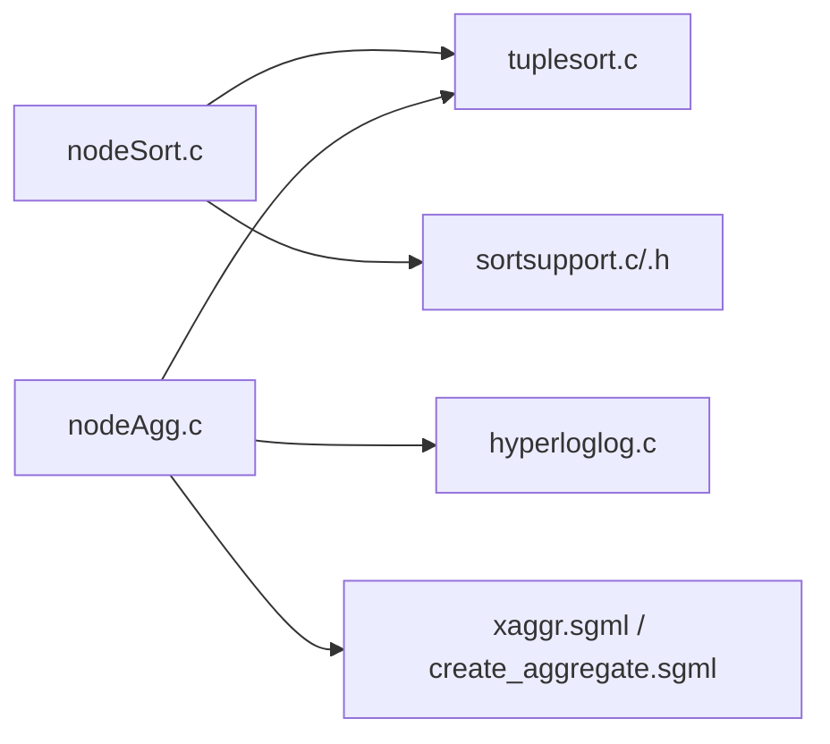

# 排序聚合

<cite>
**本文引用的文件**
- [nodeSort.c](file://src/backend/executor/nodeSort.c)
- [nodeAgg.c](file://src/backend/executor/nodeAgg.c)
- [tuplesort.c](file://src/backend/utils/sort/tuplesort.c)
- [sortsupport.c](file://src/backend/utils/sort/sortsupport.c)
- [sortsupport.h](file://src/include/utils/sortsupport.h)
- [nodeSort.h](file://src/include/executor/nodeSort.h)
- [nodeAgg.h](file://src/include/executor/nodeAgg.h)
- [hyperloglog.c](file://src/backend/lib/hyperloglog.c)
- [xaggr.sgml](file://doc/src/sgml/xaggr.sgml)
- [create_aggregate.sgml](file://doc/src/sgml/ref/create_aggregate.sgml)
</cite>

## 目录
1. [简介](#简介)
2. [项目结构](#项目结构)
3. [核心组件](#核心组件)
4. [架构总览](#架构总览)
5. [详细组件分析](#详细组件分析)
6. [依赖关系分析](#依赖关系分析)
7. [性能考量](#性能考量)
8. [故障排查指南](#故障排查指南)
9. [结论](#结论)
10. [附录](#附录)

## 简介
本文件面向 Mini PostgreSQL 的排序与聚合执行节点，系统性说明排序算法（内存排序、磁盘排序与外部多路归并）、聚合函数处理机制（分组聚合、窗口移动帧、近似基数估计），以及排序键比较、稳定性保证、增量状态维护等关键实现。文档同时提供流程图、内存使用分析与调优建议，帮助读者在复杂数据处理场景中正确理解与优化执行路径。

## 项目结构
围绕排序与聚合的关键代码分布在执行器与通用排序库中：
- 执行器层：Sort 节点负责将子计划产生的元组送入 tuplesort；Agg 节点负责按策略进行分组聚合、有序去重、部分聚合与溢出。
- 排序库层：tuplesort 提供统一的元组排序接口，支持内存快速排序、有界堆 Top-N、外部多阶段排序与多路归并。
- 排序支持：sortsupport 提供比较器准备、缩写键加速、NULL 与反向排序处理。
- 聚合支持：nodeAgg 管理过渡态、合并态、序列化/反序列化、哈希表与排序阶段切换，以及溢出到逻辑磁带。
- 近似统计：HyperLogLog 用于估算分区基数，辅助溢出分片决策。

图表来源
- [nodeSort.c:39-156](file://src/backend/executor/nodeSort.c#L39-L156)
- [nodeAgg.c:197-229](file://src/backend/executor/nodeAgg.c#L197-L229)
- [tuplesort.c:1-93](file://src/backend/utils/sort/tuplesort.c#L1-L93)
- [sortsupport.c:98-140](file://src/backend/utils/sort/sortsupport.c#L98-L140)
- [hyperloglog.c:157-222](file://src/backend/lib/hyperloglog.c#L157-L222)

章节来源
- [nodeSort.c:39-156](file://src/backend/executor/nodeSort.c#L39-L156)
- [nodeAgg.c:197-229](file://src/backend/executor/nodeAgg.c#L197-L229)
- [tuplesort.c:1-93](file://src/backend/utils/sort/tuplesort.c#L1-L93)

## 核心组件
- Sort 节点：封装 tuplesort 生命周期，读取子计划元组并批量输入，完成后按需随机访问或流式输出。
- Tuplesort：统一排序引擎，自动选择内存排序、Top-N 有界堆、外部排序与多路归并，支持标记/恢复位置。
- Agg 节点：实现 AGG_PLAIN/AGG_SORTED/AGG_HASHED/AGG_MIXED 多种策略，支持 DISTINCT/ORDER BY、滚动窗口移动帧、部分聚合与溢出。
- SortSupport：为排序键准备比较器，支持缩写键、NULL 顺序、反向排序与缓存友好比较。
- HyperLogLog：为溢出分片提供基数估计，控制递归溢出深度与分片数量。

章节来源
- [nodeSort.c:39-156](file://src/backend/executor/nodeSort.c#L39-L156)
- [tuplesort.c:205-216](file://src/backend/utils/sort/tuplesort.c#L205-L216)
- [nodeAgg.c:197-229](file://src/backend/executor/nodeAgg.c#L197-L229)
- [sortsupport.c:98-140](file://src/backend/utils/sort/sortsupport.c#L98-L140)
- [hyperloglog.c:157-222](file://src/backend/lib/hyperloglog.c#L157-L222)

## 架构总览
下图展示 Sort 与 Agg 在执行器中的协作关系，以及与底层排序库和近似统计模块的交互。

图表来源
- [nodeSort.c:65-156](file://src/backend/executor/nodeSort.c#L65-L156)
- [tuplesort.c:205-216](file://src/backend/utils/sort/tuplesort.c#L205-L216)
- [sortsupport.c:133-140](file://src/backend/utils/sort/sortsupport.c#L133-L140)
- [nodeAgg.c:495-555](file://src/backend/executor/nodeAgg.c#L495-L555)
- [hyperloglog.c:185-222](file://src/backend/lib/hyperloglog.c#L185-L222)

## 详细组件分析

### 排序引擎（Tuplesort）
- 内存排序：当数据量未超过 work_mem 时，使用 qsort 完成排序；若仅需 Top-N，则构建有界最大堆以丢弃多余大值。
- 外部排序：超过阈值后，将内存块排序后写入临时“磁带”，形成多个有序段（runs）。
- 多路归并：采用 Knuth 的多相归并（Algorithm D），使用最小堆维护各 run 的首元素，结合预读缓冲降低随机 I/O。
- 随机访问：若调用方要求随机访问，最终 run 会被冻结到逻辑磁带以支持 mark/restore。

图表来源
- [tuplesort.c:1-93](file://src/backend/utils/sort/tuplesort.c#L1-L93)
- [tuplesort.c:205-216](file://src/backend/utils/sort/tuplesort.c#L205-L216)
- [tuplesort.c:2565-2580](file://src/backend/utils/sort/tuplesort.c#L2565-L2580)
- [tuplesort.c:2799-2864](file://src/backend/utils/sort/tuplesort.c#L2799-L2864)

章节来源
- [tuplesort.c:1-93](file://src/backend/utils/sort/tuplesort.c#L1-L93)
- [tuplesort.c:205-216](file://src/backend/utils/sort/tuplesort.c#L205-L216)
- [tuplesort.c:2565-2580](file://src/backend/utils/sort/tuplesort.c#L2565-L2580)
- [tuplesort.c:2799-2864](file://src/backend/utils/sort/tuplesort.c#L2799-L2864)

### 排序键与比较器（SortSupport）
- 比较器准备：优先使用排序支持函数的比较器，否则回退到 btree 比较操作符，并通过 shim 适配旧式比较器。
- NULL 与反向：ApplySortComparator 统一处理 NULL 顺序与 ssup_reverse，确保稳定一致的比较语义。
- 缩写键：对 pass-by-reference 类型可生成简短键以提升比较速度，必要时回退到完整比较器。

图表来源
- [sortsupport.h:195-268](file://src/include/utils/sortsupport.h#L195-L268)
- [sortsupport.c:98-140](file://src/backend/utils/sort/sortsupport.c#L98-L140)

章节来源
- [sortsupport.c:98-140](file://src/backend/utils/sort/sortsupport.c#L98-L140)
- [sortsupport.h:195-268](file://src/include/utils/sortsupport.h#L195-L268)

### 聚合节点（Agg）
- 策略模式：
  - AGG_PLAIN：简单聚合，直接推进过渡态。
  - AGG_SORTED：先排序再聚合，支持 DISTINCT/ORDER BY。
  - AGG_HASHED：基于哈希表聚合，支持溢出到逻辑磁带。
  - AGG_MIXED：混合模式，先排序阶段再切换到哈希阶段。
- 分组集与阶段：ROLLUP 类分组集可在单遍有序数据上处理，复杂分组集拆分为多阶段，每阶段可能重新排序。
- 过渡态与合并态：transition 函数累积状态，combine 函数合并部分结果；支持序列化/反序列化以跨进程传递。
- 移动聚合：窗口函数移动起始帧时，若定义逆过渡函数，可从运行状态移除离开窗口的行，避免全量重算。

图表来源
- [nodeAgg.c:197-229](file://src/backend/executor/nodeAgg.c#L197-L229)
- [nodeAgg.c:495-555](file://src/backend/executor/nodeAgg.c#L495-L555)
- [nodeAgg.c:596-668](file://src/backend/executor/nodeAgg.c#L596-L668)
- [nodeAgg.c:724-800](file://src/backend/executor/nodeAgg.c#L724-L800)

章节来源
- [nodeAgg.c:197-229](file://src/backend/executor/nodeAgg.c#L197-L229)
- [nodeAgg.c:495-555](file://src/backend/executor/nodeAgg.c#L495-L555)
- [nodeAgg.c:596-668](file://src/backend/executor/nodeAgg.c#L596-L668)
- [nodeAgg.c:724-800](file://src/backend/executor/nodeAgg.c#L724-L800)

### 窗口函数与移动聚合
- 移动起始帧：通过逆过渡函数从运行状态移除离开窗口的行，时间复杂度与行数线性相关。
- 无逆过渡函数：窗口机制会在帧起点移动时从头重算，代价更高。
- 约束：移动聚合模式下，正过渡函数不得返回 NULL；逆过渡函数返回 NULL 表示无法撤销，触发重算。

章节来源
- [xaggr.sgml:148-178](file://doc/src/sgml/xaggr.sgml#L148-L178)
- [create_aggregate.sgml:703-745](file://doc/src/sgml/ref/create_aggregate.sgml#L703-L745)

### 近似聚合（基数估计）
- HyperLogLog：以固定空间维护寄存器数组，支持添加元素与基数估计，对小范围与大范围分别校正。
- 用途：在 HashAgg 溢出时估算分区基数，决定分片数量与递归溢出深度，平衡内存与 I/O。

章节来源
- [hyperloglog.c:157-222](file://src/backend/lib/hyperloglog.c#L157-L222)

## 依赖关系分析
- nodeSort.c 依赖 tuplesort.c 完成实际排序，并通过 sortsupport.c/.h 获取高效比较器。
- nodeAgg.c 可选择依赖 tuplesort.c（DISTINCT/ORDER BY）与哈希表；溢出时使用逻辑磁带与 HyperLogLog。
- 聚合文档 xaggr.sgml 与 create_aggregate.sgml 描述移动聚合语义，指导窗口函数优化。

图表来源
- [nodeSort.c:39-156](file://src/backend/executor/nodeSort.c#L39-L156)
- [nodeAgg.c:197-229](file://src/backend/executor/nodeAgg.c#L197-L229)
- [sortsupport.c:98-140](file://src/backend/utils/sort/sortsupport.c#L98-L140)
- [hyperloglog.c:157-222](file://src/backend/lib/hyperloglog.c#L157-L222)

章节来源
- [nodeSort.c:39-156](file://src/backend/executor/nodeSort.c#L39-L156)
- [nodeAgg.c:197-229](file://src/backend/executor/nodeAgg.c#L197-L229)
- [sortsupport.c:98-140](file://src/backend/utils/sort/sortsupport.c#L98-L140)
- [hyperloglog.c:157-222](file://src/backend/lib/hyperloglog.c#L157-L222)

## 性能考量
- 内存使用
  - Sort 节点：work_mem 限制内走内存路径；超限时进入外部排序，使用多路归并与预读缓冲减少随机 I/O。
  - Agg 节点：哈希聚合在 hash_mem 超限时进入溢出模式，分区写入逻辑磁带；过渡态对象可能增长（如 ARRAY_AGG），需关注内存峰值。
- 比较开销
  - 使用 SortSupport 的缩写键与缓存友好的比较器，减少 CPU 缓存缺失与函数调用开销。
- 归并阶数
  - 根据可用内存动态调整归并阶数，兼顾 CPU 缓存与 I/O 效率，避免过高阶导致缓存抖动。
- 窗口移动帧
  - 为常用窗口聚合提供逆过渡函数，显著降低移动起始帧的重算成本。
- 并行与统计
  - Sort/Agg 支持并行工作进程统计收集，便于定位瓶颈与评估资源分配。

[本节为通用性能讨论，不直接分析具体文件]

## 故障排查指南
- 排序溢出频繁
  - 现象：大量临时文件与多路归并。
  - 排查：检查 work_mem 设置与数据分布；确认是否启用了随机访问导致额外冻结。
  - 参考：tuplesort 的外部排序与归并流程。
- 聚合内存飙升
  - 现象：哈希表过大或过渡态膨胀。
  - 排查：检查 hash_mem 与过渡态大小；考虑启用溢出与分区策略。
  - 参考：HashAgg 溢出与 HyperLogLog 基数估计。
- 窗口函数性能差
  - 现象：移动起始帧导致重算。
  - 排查：确认是否定义了逆过渡函数；若无，评估业务是否允许近似或分批计算。
  - 参考：移动聚合文档。

章节来源
- [tuplesort.c:2565-2580](file://src/backend/utils/sort/tuplesort.c#L2565-L2580)
- [nodeAgg.c:197-229](file://src/backend/executor/nodeAgg.c#L197-L229)
- [hyperloglog.c:185-222](file://src/backend/lib/hyperloglog.c#L185-L222)
- [xaggr.sgml:148-178](file://doc/src/sgml/xaggr.sgml#L148-L178)

## 结论
Mini PostgreSQL 的排序与聚合子系统通过统一的排序库与灵活的聚合策略，实现了从小数据集内存排序到大外部排序的全覆盖；配合 SortSupport 的高效比较、窗口移动聚合的逆过渡优化以及 HyperLogLog 的近似基数估计，能够在复杂查询中取得良好的性能与可扩展性。合理配置 work_mem/hash_mem、选择合适的聚合策略与窗口函数实现，是获得最佳效果的关键。

[本节为总结，不直接分析具体文件]

## 附录
- 关键头文件与接口
  - Sort 节点接口：ExecInitSort、ExecEndSort、ExecReScanSort、Mark/Restore 位置。
  - Agg 节点接口：ExecInitAgg、ExecEndAgg、ExecReScanAgg；哈希聚合限制与分区估算。
- 参考路径
  - 排序节点：[nodeSort.c:39-156](file://src/backend/executor/nodeSort.c#L39-L156)
  - 聚合节点：[nodeAgg.c:197-229](file://src/backend/executor/nodeAgg.c#L197-L229)
  - 排序库：[tuplesort.c:1-93](file://src/backend/utils/sort/tuplesort.c#L1-L93)
  - 排序支持：[sortsupport.c:98-140](file://src/backend/utils/sort/sortsupport.c#L98-L140)
  - 近似基数：[hyperloglog.c:157-222](file://src/backend/lib/hyperloglog.c#L157-L222)

章节来源
- [nodeSort.h:20-30](file://src/include/executor/nodeSort.h#L20-L30)
- [nodeAgg.h:317-331](file://src/include/executor/nodeAgg.h#L317-L331)
- [nodeSort.c:39-156](file://src/backend/executor/nodeSort.c#L39-L156)
- [nodeAgg.c:197-229](file://src/backend/executor/nodeAgg.c#L197-L229)
- [tuplesort.c:1-93](file://src/backend/utils/sort/tuplesort.c#L1-L93)
- [sortsupport.c:98-140](file://src/backend/utils/sort/sortsupport.c#L98-L140)
- [hyperloglog.c:157-222](file://src/backend/lib/hyperloglog.c#L157-L222)